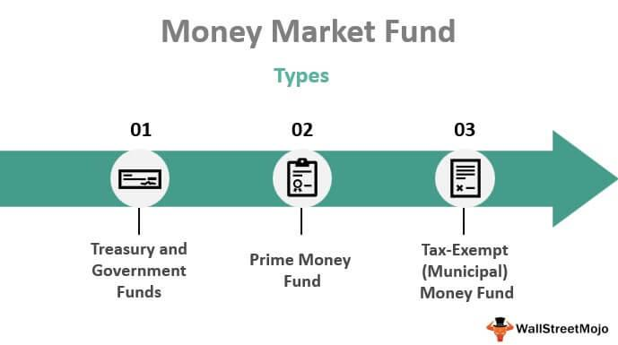

In today's fast-paced financial world, the landscape of investing has undergone significant transformation due to technological advancements and the proliferation of diverse financial instruments. Among these developments, money market funds and algorithmic trading have emerged as pivotal components of contemporary investment strategies, each offering unique advantages and intricacies.

Money market funds have long been valued for their ability to provide liquidity and safety to investors. These mutual funds focus on short-term, high-quality securities such as Treasury bills, commercial paper, and certificates of deposit. By prioritizing low risk and ensuring easy access to capital, money market funds cater to investors seeking stability and security in uncertain financial environments. Their role within a diversified portfolio cannot be understated, as they aim to offer higher yields compared to traditional savings accounts, without significantly increasing risk exposure.

Parallel to the evolution of money market funds is the rise of algorithmic trading. This method employs sophisticated computer algorithms to execute trades at optimal speeds and prices, thereby enhancing the efficiency and accuracy of transactions. By leveraging statistical models and machine learning techniques, algorithmic trading allows investors to optimize liquidity management and price discovery, which is particularly beneficial in volatile markets. These algorithms facilitate more informed decision-making, enabling traders to capitalize on market inefficiencies and achieve strategic investment goals.

This article aims to explore the financial benefits associated with investing in money market funds, alongside the transformative role of algorithmic trading in maximizing returns. By understanding these elements, investors can enhance their portfolios and achieve their investment objectives. As we progress, we will examine the basics and advantages of these financial tools, as well as their intersection with overarching investment goals, ultimately empowering investors to harness the full potential of modern finance.

## Table of Contents

## Understanding Money Market Funds

Money market funds are a category of mutual funds that focus on investing in short-term, high-quality debt instruments. These include Treasury bills, commercial paper, and certificates of deposit. Such instruments typically have maturities of less than one year, allowing the funds to offer a blend of liquidity, safety, and yields higher than those provided by traditional savings accounts.

The primary objective of money market funds is to offer investors a stable and liquid investment vehicle. This makes them attractive to those who prioritize low risk and desire easy access to their cash. Unlike equity or bond funds, money market funds aim to maintain a net asset value (NAV) of $1 per share, providing stability and capital preservation even amidst volatile market conditions.

There are several types of money market funds, each catering to different investor needs:

1. **Government Money Market Funds**: These invest primarily in securities issued or guaranteed by the U.S. government and its agencies, such as Treasury bills and repurchase agreements backed by government securities. Due to their government backing, these funds offer a high degree of safety and are suitable for conservative investors.

2. **Prime Money Market Funds**: These funds invest in a broader range of short-term corporate and bank debt securities, including commercial paper. While they offer the potential for higher yields compared to government funds, they also carry a slightly higher risk.

3. **Municipal Money Market Funds**: These focus on short-term securities issued by state and local governments, often providing tax benefits to investors. For individuals in high tax brackets, the after-tax yield of municipal funds may be comparable to or better than taxable funds.

In a diversified investment portfolio, money market funds can serve as a risk-free anchor, offering [liquidity](/wiki/liquidity-risk-premium) and a safe store for cash allocations. Their role is particularly prominent during periods of market uncertainty, where preserving capital becomes a priority. While money market funds are not entirely without risk—factors like inflation risk, credit risk, and [interest rate](/wiki/interest-rate-trading-strategies) risk can affect their returns—they are generally perceived as one of the safest investment vehicles available.

For investors seeking both safety and liquidity, understanding these fund types and their functions within an investment strategy is essential. Through thoughtful selection aligned with personal risk tolerance and financial goals, money market funds can be a strategic component of a well-rounded portfolio.

## Financial Benefits of Money Market Funds

Money market funds provide several key financial benefits, making them an attractive option for conservative investors seeking low-risk returns with liquidity.

**Liquidity** is one of the most significant advantages of money market funds. These funds invest in short-term, high-quality securities such as Treasury bills and commercial paper. As these investments have short maturity periods, typically ranging from overnight to 13 months, they allow investors quick access to their funds. This feature is particularly beneficial for individuals and institutions needing to maintain cash flow and manage short-term financial needs efficiently.

The **safety** associated with money market funds is another primary benefit. These funds typically invest in highly-rated securities, focusing on preserving capital. By investing in debt instruments with minimal default risk, money market funds are structured to maintain a high degree of safety. This feature is especially attractive to risk-averse investors who value capital preservation and require assurance of minimal [volatility](/wiki/volatility-trading-strategies) in their investments.

**Competitive Yields** are offered by money market funds in comparison to traditional savings accounts. While they provide a lower return than stock market investments, they generally offer better yields than regular savings accounts due to their investment in higher yielding, short-term securities. This allows money market funds to offer a modest but reliable income source without significant risk exposure.

**Stability** is another core attribute of money market funds, centered around maintaining a stable Net Asset Value (NAV), typically at $1 per share. This stability helps investors preserve their capital while still benefiting from the liquidity these funds provide. Even in volatile markets, money market funds strive to maintain this stability, emphasizing their role as a safe haven for capital, particularly during uncertain economic periods.

However, investors should also be aware of potential **risk factors** associated with money market funds. These include:

- **Inflation Risk:** The risk that the returns from the money market fund may not outpace inflation, thereby reducing the real value of returns over time.

- **Credit Risk:** Although money market funds primarily invest in high-quality securities, there is always a minimal risk of issuer default. Fund managers mitigate this through strict credit risk assessments and diversity in investments.

- **Interest Rate Risk:** Changes in interest rates can affect the yield of the securities held by money market funds. Generally, an increase in interest rates might lead to a decrease in the value of longer-term securities, which can impact fund performance.

Understanding these benefits and risks enables investors to make informed decisions about including money market funds in their investment portfolio. Their ability to provide liquidity, safety, competitive yields, and stability positions money market funds as an essential component for various investment strategies, especially for those emphasizing conservative growth and liquidity management.

 to Algorithmic Trading

Algorithmic trading, commonly referred to as algo trading, leverages complex algorithms to execute buy and sell orders in financial markets at optimal prices and speeds. These algorithms use a series of predefined instructions, which allow computers to autonomously conduct trades without human intervention. The primary advantage of this approach is its ability to process large amounts of data rapidly and execute trades with precision, significantly enhancing the efficiency and accuracy of transactions.

At the core of [algorithmic trading](/wiki/algorithmic-trading) are statistical models and [machine learning](/wiki/machine-learning) techniques. These computational tools are employed to analyze historical data, identify patterns, and make informed predictions about future market movements. Machine learning, a subset of [artificial intelligence](/wiki/ai-artificial-intelligence), is particularly useful in refining trading strategies as it adapts to new data over time. Algorithms can learn from each trade, improving their decision-making capabilities and thus optimizing returns. A typical machine learning model used in algorithmic trading could include regressions, neural networks, or decision trees, depending on the complexity and nature of the data.

Price discovery and liquidity management are crucial areas where algorithms have shown considerable utility, especially in markets like money market funds. Price discovery refers to the process of determining the price level of a security through market interactions. Algorithms facilitate this by quickly analyzing supply and demand factors, thereby providing accurate and timely pricing information. Liquidity management, on the other hand, involves maintaining the balance between asset availability and market demands. Algorithms can swiftly adjust trading volumes and frequencies to maintain this equilibrium, ensuring market stability.

While algorithmic trading presents opportunities for enhanced returns, it is not without challenges and risks. Market risks are prominent, as unexpected events or market fluctuations can lead to substantial losses. Moreover, technical failures such as software bugs, network disruptions, or errors in algorithm design can cause severe financial ramifications. As such, rigorous testing, continuous monitoring, and the implementation of fail safes are essential in mitigating these risks.

The regulatory landscape around algorithmic trading is evolving to ensure it operates within a stable and fair market environment. Financial authorities worldwide, such as the Securities and Exchange Commission (SEC) in the United States, have established rules and guidelines aiming to enhance transparency and prevent market manipulation. These regulations often require detailed audit trails, regular system checks, and the imposition of circuit breakers to prevent excessive volatility.

To ensure stable and effective algorithmic trading practices, traders and firms must maintain robust oversight mechanisms. This involves not only adhering to regulatory requirements but also investing in technology infrastructure and skilled personnel who can manage and maintain the algorithms effectively. Furthermore, [backtesting](/wiki/backtesting) is a critical process in this ecosystem. It allows traders to test their algorithm strategies against historical market data, assessing their effectiveness and refining them before they are deployed in live markets.

Algorithmic trading represents a significant innovation in financial markets, offering a strategic edge in trade execution. However, the blend of advanced computational techniques and rigorous regulatory adherence is crucial to harnessing its full potential while mitigating inherent risks.

## The Synergy of Money Market Funds and Algorithmic Trading

Combining money market funds with algorithmic trading strategies presents a robust opportunity for optimizing liquidity and risk management. This synergy is formed through the integration of computer algorithms that facilitate efficient trading operations, offering financial benefits by leveraging advanced technologies.

Algorithmic trading allows fund managers to access real-time data and make well-informed decisions regarding trade execution. These algorithms are designed to analyze large volumes of market data more accurately and quickly than human traders. By utilizing statistical models and machine learning techniques, algorithms can detect patterns and predict price movements, enabling fund managers to execute trades at optimal prices. This capability is especially beneficial for money market funds, which often deal with high-frequency trading of short-term, high-quality securities like Treasury bills and commercial paper.

One of the significant advantages of this synergy lies in its potential to enhance fund performance through the exploitation of market inefficiencies. Algorithms can identify discrepancies between the market price and the perceived value of securities, taking advantage of [arbitrage](/wiki/arbitrage) opportunities that might otherwise be missed. This strategic approach can lead to increased yields for investors while maintaining the stability and safety typical of money market funds.

Furthermore, the integration of algorithmic trading supports strategic investment goals by offering improved risk management. Algorithms can monitor market conditions constantly, allowing fund managers to adjust their strategies dynamically in response to changing economic indicators or interest rate movements. This real-time adjustment capability can mitigate risks associated with market volatility and protect the capital invested in money market funds.

Case studies of successful integration highlight the financial benefits of algorithmic trading in money market funds. For example, some funds have reported improved liquidity management and better alignment of investment portfolios with their risk tolerance levels. These successes underscore the importance of adopting technology to maintain competitiveness in the financial markets.

Looking ahead, future trends and technological advancements are expected to further enhance this synergy. Developments in artificial intelligence and machine learning promise to advance the capabilities of trading algorithms, making them more adaptive and efficient in processing complex market data. Additionally, the increasing availability of high-frequency trading platforms and tools will democratize access to sophisticated trading strategies, potentially expanding the use of algorithmic trading in money market funds.

In summary, the combination of money market funds and algorithmic trading offers a promising pathway to improved investment strategies, prioritizing liquidity and risk management while optimizing returns. As technology continues to evolve, embracing this synergy will be essential for fund managers aiming to maximize the potential of their investment portfolios.

## Challenges and Future Trends

Algorithmic trading and money market funds, as integral components of modern financial strategies, present their own set of challenges and future trends that investors need to navigate.

### Algorithmic Trading Challenges

Algorithmic trading faces various hurdles, primarily related to market risks, technical failures, and regulatory compliance. Market risks include the potential for algorithms to magnify market movements unplanned, leading to exacerbated volatility, sometimes referred to as "flash crashes." These events highlight the need for robust systems capable of managing sudden changes in market conditions. Technical failures, such as software bugs or hardware malfunctions, could lead to significant financial losses. The complexity of these systems necessitates rigorous testing and continuous monitoring to ensure reliability.

Regulatory compliance poses another challenge. The constantly evolving regulatory landscape requires algorithmic trading systems to adapt swiftly to new laws and guidelines aimed at promoting transparency and protecting market integrity. Traders must maintain comprehensive records and reports to satisfy regulatory scrutiny, increasing the operational burden on firms employing these strategies.

### Challenges for Money Market Funds

Money market funds face ongoing challenges, primarily due to fluctuating interest rates and evolving regulations. Interest rate changes can significantly impact the yield of these funds, as they invest in short-term debt instruments sensitive to interest rate movements. A rising rate environment can lead to capital outflows as investors seek higher returns elsewhere, while a declining rate could squeeze yields, making these funds less attractive.

Regulatory changes also play a crucial role in shaping money market fund strategies. Regulations aimed at increasing transparency and investor protection may require funds to hold higher levels of liquidity or capital, potentially affecting returns. Fund managers must navigate these rules while striving to meet investors' needs for safety and liquidity.

### Advances in AI and Machine Learning

Advancements in artificial intelligence (AI) and machine learning are poised to transform both algorithmic trading and money market fund management. AI can enhance trading strategies by identifying patterns and correlations within vast datasets, facilitating improved decision-making. Machine learning algorithms can adapt to new market conditions and optimize trading decisions in real-time, offering a competitive edge.

In money market funds, AI can be deployed to enhance risk management and portfolio optimization, ensuring compliance with evolving regulations while maximizing returns. Improved data analytics can provide fund managers with insights into investor behavior, aiding in the anticipation of redemption pressures and liquidity needs.

### Future Role of Algorithmic Trading in Portfolio Management

Algorithmic trading is expected to play an increasingly prominent role in portfolio management by offering precise execution and efficient risk management. Its ability to manage large datasets and execute trades at optimal prices can significantly enhance portfolio returns while reducing transaction costs. As market conditions become more complex, the demand for algorithm-driven solutions will likely grow.

For money market funds, algorithmic trading can optimize liquidity management and enhance yield generation. Algorithms can quickly adapt to changing interest rates and credit conditions, allowing these funds to maintain stability and meet investor expectations even as the broader economic environment shifts.

### Emerging Opportunities and Strategic Adjustments

The future promises new opportunities as financial technologies continue to advance. Investors need to be prepared to make strategic adjustments, incorporating new tools and methodologies to remain competitive. Integrating algorithmic trading with traditional portfolio management practices can provide a strategic advantage, enabling swift responses to market opportunities and risks.

In conclusion, both algorithmic trading and money market funds are set to evolve as technologies advance and regulatory landscapes shift. Investors who embrace these changes and harness the synergy between technology and traditional financial principles can achieve robust, future-ready investment strategies.

## Conclusion

Money market funds and algorithmic trading have emerged as vital components in the landscape of contemporary investment strategies. These tools provide investors with distinctive benefits while also presenting certain challenges that need to be navigated effectively. By gaining a robust understanding of these elements, investors are better equipped to make strategic decisions that enhance their portfolios.

Money market funds cater to investors seeking liquidity and low-risk options, often providing competitive yields compared to traditional savings accounts. Meanwhile, algorithmic trading leverages advanced technology to offer efficiency and precision in executing trades, thus enabling investors to optimize their investment outcomes.

As financial technology continues to advance, staying informed about these evolving trends is crucial for achieving superior investment results. The integration of traditional finance tools and cutting-edge technology creates a synergistic effect that can significantly boost investment performance. Embracing this synergy is essential for maximizing potential returns while managing risk effectively.

Ultimately, the key to successful investing lies in maintaining a balance between innovative strategies and fundamental investment principles. This approach ensures that investors are well-prepared to capitalize on future opportunities while safeguarding their portfolios against potential pitfalls. As the investment landscape evolves, the ability to adapt and integrate new methods with established practices will be paramount in achieving long-term success.

## References & Further Reading

"Money Market Funds: How to Invest and Find the Best Returns" - This comprehensive guide from Forbes provides an insightful overview of money market funds, focusing on strategies to achieve optimal returns. It discusses the types of securities that money market funds invest in, and offers tips on selecting funds that align with investor goals.

"Algorithmic Trading: Winning Strategies and Their Rationale" by Ernest P. Chan – This book offers a deep dive into algorithmic trading, detailing various strategies used by traders to gain a competitive edge. Chan's work walks readers through the process of developing and testing algorithms to succeed in a fast-paced trading environment.

"Advances in Financial Machine Learning" by Marcos Lopez de Prado – This book explores the intersection of financial trading and machine learning. Lopez de Prado introduces methods to apply machine learning techniques effectively within trading strategies, providing both theoretical insights and practical applications.

For a comprehensive understanding of these topics, explore resources such as Investopedia, which offers articles and tutorials on both money market funds and algorithmic trading. Additionally, a multitude of [books](/wiki/algo-trading-books) and online courses delve into these areas, providing both foundational knowledge and advanced strategies essential for modern investing.

