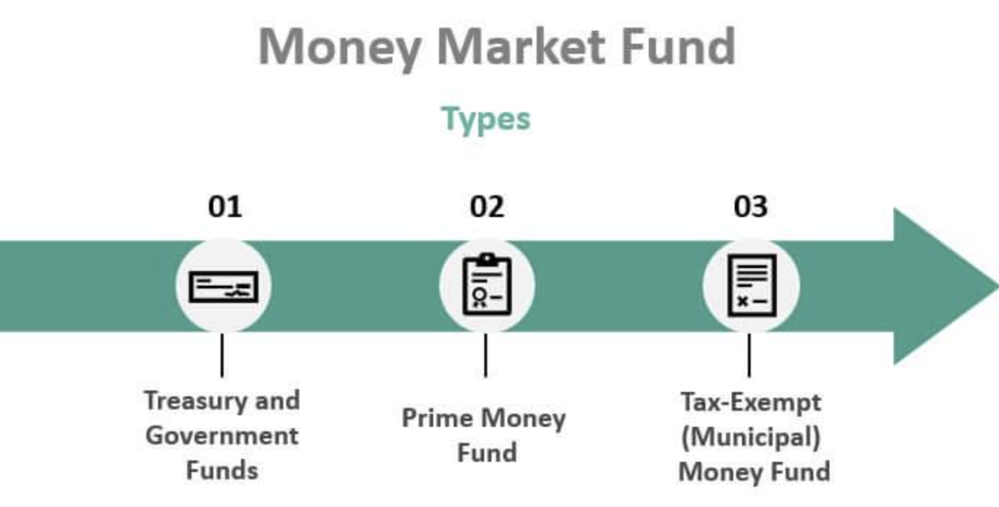

## Table of Contents

## What are money market funds?

Money market funds are a type of investment where people put their money into a fund that invests in very safe, short-term financial products. These products can include things like government bonds, certificates of deposit, and other low-risk securities. The goal of money market funds is to keep the money safe while still earning a small amount of interest. They are often seen as a good place to park money that you might need soon, because they are less risky than stocks or long-term bonds.

These funds try to keep the value of each share at a stable price, usually $1 per share. This makes them different from other types of investments, which can go up and down a lot in value. Because they are so safe, the returns on money market funds are usually lower than what you might get from riskier investments. But for people who want to keep their money safe and accessible, money market funds can be a good choice.

## How do money market funds work?

Money market funds work by pooling money from many investors and using that money to buy safe, short-term investments. These investments might be things like government bonds, certificates of deposit, or other securities that are considered low risk. When you put your money into a money market fund, you're buying shares in the fund. The fund then uses the money from all the shares to buy these safe investments. The goal is to keep your money safe and earn a little bit of interest at the same time.

The value of each share in a money market fund is usually kept at a stable price, often $1 per share. This is different from other investments like stocks, which can change in value a lot. Because the investments in a money market fund are so safe, the returns are usually small. But that's okay if you want a place to keep your money that is easy to get to and not too risky. You can take your money out of the fund whenever you need it, which makes it a good choice for money you might need soon.

## What are the typical investments included in money market funds?

Money market funds usually invest in very safe, short-term things. These can include government bonds, which are loans to the government that get paid back with a little interest. Another common investment is certificates of deposit, or CDs, where you give money to a bank for a short time and they give you a bit of interest when it's done. They might also put money into commercial paper, which is like a short-term loan to big companies.

Sometimes, money market funds also invest in repurchase agreements, or repos. These are deals where the fund buys a security and agrees to sell it back later for a little more money. This is another way to earn a small amount of interest safely. All these investments are chosen because they are low risk and can be turned into cash quickly if needed.

## What are the benefits of investing in money market funds for beginners?

Money market funds are a good choice for beginners because they are safe and easy to understand. When you put your money in a money market fund, it goes into things like government bonds and certificates of deposit. These are very safe investments that won't lose a lot of money. This makes money market funds less risky than stocks or long-term bonds. So, if you are new to investing and want to keep your money safe, money market funds can be a good start.

Another benefit is that money market funds keep your money easy to get to. If you need your money quickly, you can take it out of the fund without waiting a long time. This is good if you might need the money soon but still want to earn a little interest. Money market funds also help you learn about investing without taking big risks. As you get more comfortable, you can try other types of investments. But for beginners, money market funds are a simple and safe way to start.

## How safe are money market funds compared to other investment options?

Money market funds are very safe compared to other investments like stocks or long-term bonds. They invest in things like government bonds and certificates of deposit, which are low risk. This means they are less likely to lose money. The goal of money market funds is to keep your money safe while still earning a little bit of interest. Because they are so safe, they are a good choice if you want to keep your money secure and don't want to take big risks.

However, money market funds are not completely risk-free. There is a small chance that the value could drop below $1 per share, though this is rare. Compared to other investments, money market funds are much safer. Stocks can go up and down a lot in value, and you could lose a lot of money. Long-term bonds can also be risky because their value can change with interest rates. So, while money market funds are not the safest investment out there, they are much safer than many other options.

## What are the potential returns from money market funds?

Money market funds usually give you small returns. The interest you earn from these funds comes from the safe, short-term things they invest in, like government bonds and certificates of deposit. Because these investments are so safe, the returns are not very high. You might earn a bit more than you would in a regular savings account, but it's still not a lot of money.

The returns on money market funds can change a little bit depending on what's going on with interest rates and the economy. If interest rates go up, the returns might go up a bit too. But they will still be small compared to riskier investments like stocks. If you are okay with earning a little bit of interest and want to keep your money safe, money market funds can be a good choice.

## How do fees and expenses affect the returns of money market funds?

Fees and expenses can lower the returns you get from money market funds. When you invest in a money market fund, the fund charges you fees to cover their costs of managing the fund. These fees can be a small percentage of your investment, but they still take away from the interest you earn. The more fees you pay, the less money you keep at the end of the day.

So, it's important to look at the fees when you choose a money market fund. Some funds might have higher fees than others, and those higher fees can eat into your returns. If you can find a fund with lower fees, you might keep more of the interest you earn. Always check the fee information before you invest, so you know how much of your returns will go towards paying the fund's expenses.

## What is the role of money market funds in a diversified investment portfolio?

Money market funds can be a helpful part of a diversified investment portfolio. They are very safe and can help balance out riskier investments like stocks or long-term bonds. If you have money that you might need soon, you can put it in a money market fund to keep it safe and easy to get to. This way, you don't have to worry about losing a lot of money if the stock market goes down.

In a diversified portfolio, money market funds can also give you some steady, small returns. While they won't make you rich, they can add a bit of interest to your overall earnings. By including money market funds, you spread out your investments across different types of assets. This can help protect your money and make your portfolio more stable over time.

## How can money market funds be used as a cash management tool?

Money market funds can be a good way to manage your cash because they are safe and easy to use. If you have money that you might need soon, you can put it in a money market fund. This way, your money stays safe and you can get it back quickly when you need it. Money market funds invest in things like government bonds and certificates of deposit, which are very low risk. So, you don't have to worry about losing your money.

These funds also let you earn a little bit of interest on your cash. While the interest is not a lot, it's more than what you might get in a regular savings account. This makes money market funds a good choice if you want to keep your money safe but still earn something. By using money market funds, you can manage your cash in a way that keeps it secure and easy to access.

## What are the tax implications of investing in money market funds?

When you invest in money market funds, you need to think about taxes. The interest you earn from these funds is usually taxed as regular income. This means you will have to pay taxes on it at the same rate as your other income, like your salary. If you earn a lot of interest, this could add to your tax bill. Some money market funds invest in things like government bonds, and the interest from these might be free from state and local taxes, but you still have to pay federal taxes.

There's another thing to think about with taxes and money market funds. If you sell your shares in the fund for more than you paid, you might have to pay capital gains tax. But because money market funds aim to keep the value of each share at $1, this doesn't happen often. Still, it's good to know that any gains from selling your shares could be taxed. Talking to a tax advisor can help you understand how money market funds will affect your taxes and plan better.

## How do economic conditions affect the performance of money market funds?

Economic conditions can change how well money market funds do. When interest rates go up, the returns on money market funds usually go up too. This is because the funds invest in things like government bonds and certificates of deposit, and these pay more interest when rates are higher. But when interest rates go down, the returns on money market funds also go down. So, if the economy is doing well and interest rates are high, money market funds might give you a bit more interest.

On the other hand, if the economy is not doing well, it can still affect money market funds. During tough economic times, people might pull their money out of riskier investments and put it into safer ones like money market funds. This can make the funds more stable, but it doesn't change the fact that their returns are still tied to interest rates. So, even in a bad economy, money market funds are safe, but the interest you earn might be low if rates are low too.

## What advanced strategies can expert investors use with money market funds?

Expert investors can use money market funds in a few smart ways. One way is to use them for cash management in a bigger investment plan. They might keep some money in money market funds to have cash ready for new investment opportunities. When they see a good chance to invest, they can quickly move money from the money market fund to buy stocks, bonds, or other investments. This helps them act fast without having to sell other investments at a bad time.

Another strategy is to use money market funds to balance risk in their portfolio. If an expert investor has a lot of money in risky investments like stocks, they can put some money in money market funds to make their overall investments safer. This way, if the stock market goes down, the money market funds can help cushion the fall. They can also use money market funds as a place to park money during times when the market is very uncertain, waiting for better conditions to invest in riskier assets.

## References & Further Reading

"Money Market Funds: How to Invest and Find the Best Returns" - This comprehensive guide from Forbes provides an insightful overview of money market funds, focusing on strategies to achieve optimal returns. It discusses the types of securities that money market funds invest in, and offers tips on selecting funds that align with investor goals.

"Algorithmic Trading: Winning Strategies and Their Rationale" by Ernest P. Chan – This book offers a deep dive into algorithmic trading, detailing various strategies used by traders to gain a competitive edge. Chan's work walks readers through the process of developing and testing algorithms to succeed in a fast-paced trading environment.

"Advances in Financial Machine Learning" by Marcos Lopez de Prado – This book explores the intersection of financial trading and machine learning. Lopez de Prado introduces methods to apply machine learning techniques effectively within trading strategies, providing both theoretical insights and practical applications.

For a comprehensive understanding of these topics, explore resources such as Investopedia, which offers articles and tutorials on both money market funds and algorithmic trading. Additionally, a multitude of [books](/wiki/algo-trading-books) and online courses delve into these areas, providing both foundational knowledge and advanced strategies essential for modern investing.

