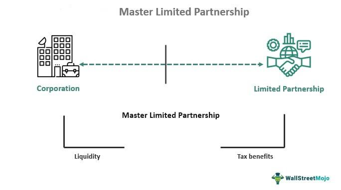

Master Limited Partnerships (MLPs) are sophisticated investment entities that provide a unique combination of tax efficiency and market accessibility. Originating from the intersection of partnership tax attributes and the liquidity of public markets, MLPs allow investors to participate in sectors traditionally associated with high capital expenses and stable cash flows. Predominantly operating within the natural resources, energy, and real estate industries, MLPs manage assets such as pipelines, storage facilities, and real estate assets that generate consistent revenue streams. One of the defining features of MLPs is their tax structure. Unlike conventional corporations subject to corporate tax, MLPs are pass-through entities, meaning they do not pay federal income taxes at the corporate level. Instead, the income is directly allocated to unitholders, who then pay tax at their individual rates. This approach helps maximize the return on investments by mitigating the issue of double taxation, which commonly affects corporate dividends.

Investors are increasingly attracted to MLPs for their high-yield distributions, often bolstered by the steady income generated from long-term contractual agreements typical in industries like energy infrastructure. Moreover, MLPs' returns are often characterized by deferred tax recognition, with a significant portion of distributions considered a return of capital, thus lowering the current tax liability and potentially enhancing after-tax returns. Moreover, MLPs offer diversification benefits, as their performance is often less correlated with traditional equity and bond markets, providing a hedge against market volatility. 



Recently, the integration of algorithmic trading strategies with MLP investments has shown potential in enhancing investor returns. Algorithmic trading utilizes sophisticated mathematical models and high-speed computing power to execute trades, often capitalizing on short-term market inefficiencies. By merging the stable returns of MLPs with algorithmic strategies, investors can potentially optimize their portfolios, balancing the inherent stability of MLPs with the dynamism of automated trading. This article will discuss the synergy between MLPs and algorithmic trading strategies, highlighting the potential advantages and inherent complexities of these investment approaches.

## Table of Contents

## Understanding Master Limited Partnerships (MLPs)

Master Limited Partnerships (MLPs) are investment entities structured as publicly traded partnerships, meaning they blend characteristics of both partnerships and corporations. This unique structure allows shares, often referred to as units, to be traded on public exchanges similar to corporate stocks. Primarily, MLPs operate within sectors that involve consistent income streams, notably infrastructure projects related to energy and natural resources such as oil and gas pipelines, storage facilities, and renewable energy projects.

One of the defining features of MLPs is their ability to avoid corporate tax, creating a tax-efficient structure that is beneficial for both the company and its investors. Unlike traditional corporations, which are subject to corporate income tax, MLPs are governed by the partnership taxation model. This model enables them to pass the bulk of their income directly to unitholders without the earnings being taxed at the corporate level. This avoids the double taxation faced by traditional corporations, whereby income is taxed at the corporate level before being distributed as dividends, which are then taxed again at the individual level.

The taxation principle of MLPs can be expressed in a simplified manner using basic algebra. If $I_c$ is the corporate income, and $T_c$ and $T_i$ represent corporate and individual tax rates respectively, the total tax on corporate income in a standard corporation (ignoring deductions for simplicity) would be:

$$
\text{Total Tax} = I_c \times T_c + (I_c \times (1 - T_c)) \times T_i
$$

In contrast, an MLP bypasses the corporate tax, so its income distributed to investors only incurs individual taxes. Thus, the formula reduces to:

$$
\text{Total Tax for MLP} = I_c \times T_i
$$

Consequently, this structure often results in a higher post-tax income for investors compared to traditional corporate dividends. Additionally, the direct flow-through of income to unitholders makes MLPs an attractive choice for those seeking higher yield investments, and they often appeal to investors looking for consistent income supplemented by tax advantages.

This organizational arrangement enhances the attractiveness of MLPs in sectors that demand constant capital investment, like energy infrastructure. The predictable revenue streams from long-term assets in these sectors provide MLPs with the stable cash flow required to make consistent distributions to unitholders, thereby sustaining the interest of income-focused investors. Such consistent revenue generation and tax advantages underscore the value proposition of MLP investments for those seeking exposure to the energy and natural resources sectors.

Understanding these core features provides insight into why MLPs have carved a niche in financial markets, offering a blend of investment [liquidity](/wiki/liquidity-risk-premium) and tax efficiency not typically found in other asset classes.

## Investment Benefits of MLPs

Master Limited Partnerships (MLPs) present a compelling investment option due to their unique tax and diversification benefits. One of the primary advantages of investing in MLPs is their favorable tax structure. Unlike corporations that face double taxation—where both corporate profits and shareholder dividends are taxed—MLPs are structured as partnerships. This allows them to pass earnings directly to unitholders, significantly reducing the tax burden. Investors receive distributions that are typically tax-deferred, meaning the tax on these distributions is not due until the investor's cost basis is reduced to zero or the MLP units are sold. This tax deferral can enhance the compounding of wealth over time, as investors can reinvest distributions without immediate tax liability.

Moreover, MLPs typically provide returns of capital, which are non-taxable distributions that reduce the investor's adjusted cost basis in the MLP units. The ability to receive a portion of these distributions tax-free can increase the investor's overall effective yield compared to traditional dividend-paying equities.

In terms of diversification, MLPs offer benefits that arise from their core business operations, which are often focused on essential infrastructure in the energy and natural resources sectors. These sectors tend not to correlate closely with traditional asset classes, such as stocks and bonds, providing a hedge against market [volatility](/wiki/volatility-trading-strategies). This lower correlation helps in reducing overall portfolio risk and can improve the risk-adjusted returns of an investment portfolio.

Investors in MLPs often find that these vehicles yield higher income compared to conventional equity investments. This is largely because MLPs are required to distribute a majority of their income as cash distributions to maintain their partnership status; hence, they tend to deliver substantial cash returns to unitholders. As of recent years, MLPs have consistently offered yields that surpass those of common stocks and bonds, making them an attractive investment for income-focused investors. 

Overall, the combination of tax benefits, diversification potential, and high yields makes MLPs an enticing component of a balanced investment strategy. However, potential investors should carefully consider the complexities associated with these investments, including the need for handling K-1 tax forms, before committing capital.

## Tax Benefits of Investing in MLPs

Master Limited Partnerships (MLPs) offer unique tax benefits that make them attractive investments for many individuals. One of the primary advantages is the ability of MLPs to pass income directly to unitholders, thereby avoiding the double taxation typically associated with corporations. In a standard corporate structure, earnings are taxed at the corporate level and again at the individual level when distributed as dividends. MLPs, structured as partnerships, bypass this issue by passing profits directly to unitholders, who are then taxed only once at their individual income tax rates.

### Cash Distributions and Returns of Capital

MLPs often distribute a significant portion of their income to investors in the form of cash distributions. A portion of these distributions may be considered "returns of capital." Unlike traditional dividends, returns of capital are not immediately taxed as income. Instead, they reduce the unitholder's cost basis in their investment. For instance, if an investor receives a return of capital of $2 per unit and their original cost basis was $20 per unit, their new cost basis would be $18.

The reduction in cost basis continues until it reaches zero. If the unitholder sells their MLP units, the lower cost basis results in a higher capital gain, which is taxed accordingly. This deferral of taxes through returns of capital is a strategic advantage, effectively allowing investors to postpone tax liabilities.

### Estate Planning and Tax Deferral

MLP investments can also serve as effective estate planning tools, primarily through their tax deferral strategies. Upon the death of the unitholder, the cost basis of the MLP units is typically adjusted to the fair market value at the date of death. This "step-up" in basis can significantly reduce the capital gains liability for heirs. For example, if a unitholder's original cost basis was $15 per unit and the units are valued at $25 per unit at the time of death, the basis is stepped up to $25. Therefore, if the heirs decide to sell the units at this price, they incur no capital gains tax, thus preserving estate value.

In summary, MLPs provide substantial tax-related advantages by facilitating direct income allocation to unitholders, avoiding double taxation, deferring taxes through returns of capital, and offering potential tax relief advantages for estate planning through basis adjustments. These benefits can significantly enhance the appeal of MLPs to investors seeking both income and tax optimization.

## Algorithmic Trading with MLPs

Algorithmic trading has emerged as a key tool for enhancing the profitability of investments across various sectors, including Master Limited Partnerships (MLPs). The inherent complexity in MLP transactions presents a unique opportunity for [algorithmic trading](/wiki/algorithmic-trading) systems to optimize investment strategies. 

**Enhancing Profitability through Automated Trading**

Algorithmic trading systems utilize computer algorithms to automate the process of buying and selling, allowing investors to execute trades at precise conditions. For MLPs, which are known for their higher yields and tax benefits, automation can significantly streamline trading processes. The use of algorithms allows investors to take advantage of market inefficiencies and volatility in real-time, potentially increasing profitability.

The primary advantage of utilizing automated systems is their speed and ability to manage multiple data inputs simultaneously. Algorithms can analyze vast datasets to identify trends and execute trades in milliseconds, something manual trading cannot match. This precision is crucial for MLP investments, where market conditions can fluctuate rapidly due to external factors like energy prices or regulatory changes.

**Efficiency in Managing MLP Transactions**

MLPs often involve complex financial structures and regulatory requirements, such as tracking and managing K-1 forms for tax purposes. Algorithmic trading platforms can help manage these intricacies by automating back-office processes and ensuring compliance with regulations, thus reducing the administrative burden on investors. 

The automation of transaction handling through algorithms can also reduce transaction costs and minimize human errors. For instance, complex cash distribution schedules and tax implications that accompany MLP investments can be efficiently processed through algorithm-driven platforms, making them more accessible to retail and institutional investors alike.

**Integrating MLPs with Algorithmic Strategies**

Several strategies can integrate MLP investments with algorithmic trading to maximize returns. One such strategy is the statistical [arbitrage](/wiki/arbitrage) approach, where algorithms identify temporary price discrepancies between MLPs and correlated assets, executing trades to capitalize on the price convergence. 

Moreover, [machine learning](/wiki/machine-learning) techniques can be employed to predict market trends based on historical data. For example, a Python-based model could be developed using libraries like TensorFlow or PyTorch to forecast MLP price movements:

```python
import numpy as np
import pandas as pd
from sklearn.model_selection import train_test_split
from sklearn.ensemble import RandomForestRegressor

# Load MLP price data
data = pd.read_csv('mlp_price_data.csv')

# Feature engineering
data['Return'] = (data['Close'] - data['Open']) / data['Open']
X = data[['Open', 'High', 'Low', 'Volume']]
y = data['Return']

# Split dataset
X_train, X_test, y_train, y_test = train_test_split(X, y, test_size=0.2, random_state=42)

# Train model
model = RandomForestRegressor(n_estimators=100, random_state=42)
model.fit(X_train, y_train)

# Predict
predictions = model.predict(X_test)

# Output predicted return
print("Predicted Returns: ", predictions)
```

Such models could offer refined insights into the optimal times to enter or [exit](/wiki/exit-strategy) positions, thus enhancing returns while managing potential risks inherent in the volatile markets MLPs operate within.

In conclusion, leveraging algorithmic trading for MLP investments provides significant opportunities for enhancing profitability and managing the complexities of trading in this asset class. By automating the investment process and incorporating advanced trading strategies, investors can efficiently navigate the MLP market and optimize their financial outcomes.

## Risks and Challenges of MLP Investments

Investing in Master Limited Partnerships (MLPs), though potentially rewarding, involves several risks and challenges that investors should carefully consider. One significant concern is market volatility. MLPs are subject to fluctuations in energy prices, changes in supply and demand dynamics, and broader economic conditions. These factors can lead to price instability, affecting the value of MLP investments.

Regulatory challenges also present risks for MLP investors. MLPs primarily operate in sectors like energy and natural resources, which are highly regulated. Changes in government policies, environmental regulations, or tax laws can significantly impact the operations and profitability of MLPs. For instance, regulatory changes affecting pipelines or energy projects can lead to increased operational costs or reduced revenue opportunities, thus impacting investor returns.

Leverage risks are another important consideration, as MLPs often rely on debt to fund expansion and operational activities. High levels of debt can increase financial risk, especially if revenue declines or interest rates rise. The reliance on debt means that MLPs must manage their financial obligations effectively to avoid liquidity issues, which could negatively affect their ability to make distributions to unit holders.

Tax complexities represent another hurdle for MLP investors. MLPs have a unique tax structure where income is passed directly to unit holders, avoiding corporate taxes. However, this results in a complex tax reporting process, requiring investors to manage Schedule K-1 forms. These forms can detail income, deductions, and credits, adding a layer of complexity to personal tax filings. For some investors, especially those unfamiliar with such tax documentation, managing K-1 forms can be burdensome and may require professional assistance.

In summary, while MLPs offer attractive investment benefits, they come with challenges related to market volatility, regulatory changes, leverage risks, and tax complexities. Investors should weigh these factors carefully and consider seeking advice from financial advisors and tax professionals to navigate these challenges effectively.

## Conclusion: Maximizing MLP Investments

Master Limited Partnerships (MLPs) present a unique investment opportunity by offering high yields and significant tax benefits, making them particularly attractive for certain investor profiles. These investment vehicles allow for the combination of advantageous structures, such as pass-through taxation, with the potential for consistent income streams, traditionally appealing to income-focused investors. The leveraging of MLP investments through algorithmic trading strategies further enhances their appeal by optimizing returns while managing associated risks.

Algorithmic trading can systematically analyze market data and execute trades with speed and precision beyond human capability. This technology can be particularly beneficial for MLP investors, as it navigates the complexities of MLP price movements, liquidity, and market conditions. Algorithmic strategies can efficiently identify entry and exit points, manage transaction costs, and potentially increase profitability by exploiting market inefficiencies related to MLPs. For instance, a Python-based algorithm could be used to model correlations between MLP-specific metrics, like distribution yield, and broader market indices, generating real-time trade signals. 

```python
import numpy as np
import pandas as pd
from sklearn.linear_model import LinearRegression

# Hypothetical dataset
data = pd.DataFrame({
    'MLP_Yield': np.random.rand(100),
    'Market_Index': np.random.rand(100),
})

# Linear regression model to find relationships
model = LinearRegression()
model.fit(data[['Market_Index']], data['MLP_Yield'])

# Predict MLP yields based on market index values
predictions = model.predict(data[['Market_Index']])
```

Despite the benefits, the complexities of MLP investments necessitate a comprehensive understanding of the tax implications and market dynamics. Investors are advised to engage with financial advisors and tax professionals to effectively navigate these complexities. Professional guidance is crucial for understanding aspects like the treatment of cash distributions, the role of K-1 forms, and how these elements fit into broader tax and estate planning strategies. This advisory support ensures that investors can fully leverage the potential of MLP investments while mitigating risks associated with taxation and regulatory changes.

In conclusion, MLPs, coupled with sophisticated trading strategies, provide a compelling opportunity for investors seeking enhanced income with favorable tax treatments. However, the intricate nature of these investments and the various associated risks highlight the importance of informed decision-making backed by expert advice.

## References & Further Reading

[1]: Bergstra, J., Bardenet, R., Bengio, Y., & Kégl, B. (2011). ["Algorithms for Hyper-Parameter Optimization."](https://dl.acm.org/doi/10.5555/2986459.2986743) Advances in Neural Information Processing Systems 24.

[2]: ["Advances in Financial Machine Learning"](https://www.amazon.com/Advances-Financial-Machine-Learning-Marcos/dp/1119482089) by Marcos Lopez de Prado

[3]: ["Evidence-Based Technical Analysis: Applying the Scientific Method and Statistical Inference to Trading Signals"](https://www.amazon.com/Evidence-Based-Technical-Analysis-Scientific-Statistical/dp/0470008741) by David Aronson

[4]: ["Master Limited Partnerships: The First 25 Years"](https://en.wikipedia.org/wiki/Master_limited_partnership) by Research Staff of CCH

[5]: ["Machine Learning for Algorithmic Trading"](https://github.com/stefan-jansen/machine-learning-for-trading) by Stefan Jansen

[6]: ["Quantitative Trading: How to Build Your Own Algorithmic Trading Business"](https://www.amazon.com/Quantitative-Trading-Build-Algorithmic-Business/dp/1119800064) by Ernest P. Chan