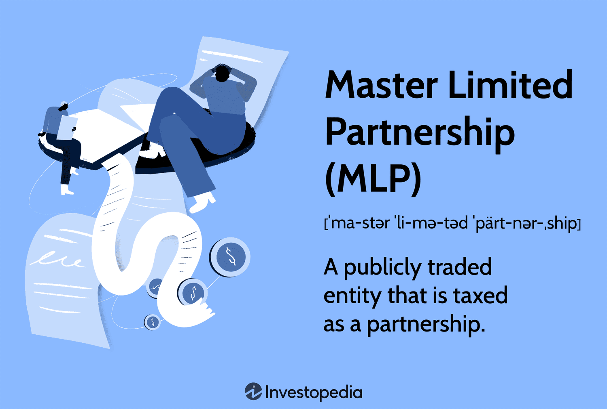

## Table of Contents

## What is a Master Limited Partnership (MLP)?

A Master Limited Partnership, or MLP, is a type of business structure that combines the tax benefits of a partnership with the liquidity of publicly traded securities. MLPs are commonly used in industries like energy, where they own and operate assets such as pipelines and storage facilities. Investors in an MLP are called unit holders, and they receive regular distributions of income, similar to dividends from stocks.

One of the main attractions of MLPs is their tax advantage. Unlike corporations, MLPs do not pay federal income tax at the entity level. Instead, the income, deductions, gains, and losses are passed through to the unit holders, who then report these on their personal tax returns. This structure can lead to higher distributions for investors, making MLPs an appealing option for those seeking income-generating investments.

## How does an MLP differ from a traditional corporation?

An MLP is different from a traditional corporation in how it is structured and taxed. A traditional corporation is a separate legal entity that pays taxes on its income. The shareholders of a corporation then pay taxes on any dividends they receive, leading to what is called double taxation. In contrast, an MLP does not pay taxes at the entity level. Instead, all the income, losses, deductions, and credits are passed directly to the investors, who are called unit holders. This means unit holders report these items on their personal tax returns, avoiding the double taxation that shareholders of a corporation face.

Another key difference is in how they operate and distribute income. A traditional corporation can engage in any type of business, while MLPs are usually limited to specific industries, such as energy, where they manage assets like pipelines and storage facilities. MLPs are required to distribute most of their income to unit holders, which makes them attractive for investors looking for regular income. Corporations, on the other hand, have more flexibility in how they use their profits, often choosing to reinvest in the business or pay dividends at their discretion.

## What are the tax benefits associated with investing in MLPs?

Investing in MLPs has some big tax benefits. The main one is that MLPs don't pay taxes on their income. Instead, all the money the MLP makes goes straight to the investors, called unit holders. This means unit holders get to report this income on their own tax returns, avoiding the double taxation that happens with regular companies. With regular companies, the company pays tax on its profits, and then shareholders pay tax again on any dividends they get.

Another tax benefit of MLPs is that they often give investors a chance to write off some of their investment. This is because MLPs can pass along deductions for things like depreciation of their assets, like pipelines or storage facilities. These deductions can help lower the amount of taxable income unit holders have to report, which can mean paying less in taxes overall. So, by investing in an MLP, you might not only get regular income but also some nice tax breaks.

## Can you explain the concept of pass-through income in MLPs?

Pass-through income in MLPs means that the money the MLP makes goes straight to the people who invest in it, called unit holders. Instead of the MLP paying taxes on its income, the unit holders report this income on their own tax returns. This is different from regular companies, where the company pays taxes first, and then shareholders pay taxes on any dividends they get. With MLPs, there's no double taxation, which can save unit holders a lot of money.

This pass-through system also lets unit holders take advantage of certain tax deductions. For example, if the MLP owns things like pipelines or storage facilities, it can pass along deductions for the wear and tear of these assets, called depreciation. These deductions can lower the amount of income unit holders have to pay taxes on. So, by investing in an MLP, unit holders not only get regular income but also get to enjoy some tax benefits that can make their investment even more valuable.

## What types of industries typically use the MLP structure?

The MLP structure is most commonly used in the energy industry. This is because MLPs are great for businesses that own and operate big, long-lasting assets like pipelines, storage facilities, and processing plants. These assets can produce steady income over time, which is perfect for MLPs because they need to pay out most of their income to their investors regularly.

Besides energy, MLPs can sometimes be found in other industries too, like real estate and natural resources. For example, some real estate investment trusts (REITs) use the MLP structure to manage properties and pass income directly to investors. But the energy sector is where you'll see MLPs the most, mainly because of the stable income their big assets can provide.

## How can MLPs provide high yield returns to investors?

MLPs can provide high yield returns to investors because they have to pay out most of their income to the people who invest in them. This is called a distribution, and it's like getting a regular paycheck from your investment. Since MLPs often own big things like pipelines and storage facilities that make steady money, they can keep paying out these distributions, which can be higher than what you might get from regular stocks.

Another reason MLPs can offer high yields is because they don't pay taxes on their income. Instead, the money goes straight to the investors, who then report it on their own taxes. This means more money can be paid out to investors without the MLP having to pay taxes first. Plus, investors can sometimes get tax breaks, like deductions for the wear and tear of the MLP's assets, which can make the overall return even better.

## What are the risks involved in investing in MLPs?

Investing in MLPs can be a bit risky. One big risk is that the value of the MLP can go up and down a lot. This is because MLPs are often in the energy business, and things like oil and gas prices can change quickly. If the prices go down, the MLP might not make as much money, and the distributions to investors could get smaller or stop altogether. Also, if the MLP has a lot of debt, and it can't pay it back, that could hurt the value of the MLP and the money investors get.

Another risk is that the tax rules for MLPs can be complicated. Even though MLPs pass through income and can give investors some tax breaks, figuring out how to report this on your taxes can be tricky. If you don't do it right, you might end up owing more money to the tax office than you planned. Plus, some MLPs might change their structure or get bought out, which can change how much money you get and how you have to report it on your taxes.

## How does the structure of an MLP affect its governance and management?

The structure of an MLP affects its governance and management in a few big ways. In an MLP, there are usually two types of partners: the general partner and the limited partners. The general partner runs the day-to-day operations and makes big decisions for the MLP. They have a lot of control over what the MLP does and how it does it. The limited partners, on the other hand, are the investors who get the regular income from the MLP but don't get to make decisions about how it's run. This means the general partner has a lot of power, which can be good if they make smart choices, but it can also be risky if they don't.

Because of this structure, the management of an MLP can be different from regular companies. In a regular company, shareholders can vote on big decisions and even change who runs the company if they're not happy. But in an MLP, the limited partners usually can't do this. They have to trust the general partner to do a good job. Sometimes, the general partner might get special payments or incentives, which can make them focus more on growing the MLP than on paying out money to the limited partners. This can affect how the MLP is managed and what the limited partners get in return.

## What are the liquidity considerations for MLP investments?

When you invest in an MLP, one thing to think about is how easy it is to sell your investment if you need to. MLPs are usually traded on big stock markets, like the New York Stock Exchange. This means you can buy and sell them pretty easily, just like regular stocks. But, sometimes, MLPs might not be as easy to sell as other stocks. This can happen if not as many people are interested in buying MLPs at that time. So, it's good to know that while MLPs can be liquid, they might not always be as liquid as other investments.

Another thing to consider is that some MLPs might have rules about how and when you can sell your units. For example, if you own a big chunk of an MLP, you might have to follow special rules before you can sell. These rules can make it harder to get your money out quickly. So, before you invest in an MLP, it's a good idea to check how easy it will be to sell your investment if you need to. This can help you make sure you're comfortable with how liquid your investment will be.

## How do MLPs fit into a diversified investment portfolio?

MLPs can be a good addition to a diversified investment portfolio because they can offer high returns and regular income. When you invest in different kinds of things, like stocks, bonds, and real estate, you spread out your risk. MLPs are often in the energy business, which is different from many other investments. This means they can help balance out your portfolio. If the stock market goes down, the steady income from MLPs might help keep your overall returns more stable.

But, it's important to think about the risks too. MLPs can go up and down a lot, especially if oil and gas prices change. They also have special tax rules that can be tricky to understand. So, when you add MLPs to your portfolio, it's a good idea to not put all your money in them. Instead, mix them with other investments to keep your portfolio balanced. This way, you can enjoy the benefits of MLPs while still managing the risks.

## What are the regulatory requirements and compliance issues for MLPs?

MLPs have to follow a bunch of rules set by the government. One big rule is that they need to get most of their money from things like moving, storing, or processing stuff, like oil and gas. This is to make sure MLPs are used in the right way. They also have to file special reports with the Securities and Exchange Commission (SEC) and follow other rules to keep everything fair and open for investors. If an MLP doesn't follow these rules, it could get in trouble and might even lose its special tax status.

Another thing MLPs need to watch out for is how they handle their money. They have to make sure they're paying out enough of their income to their investors, called unit holders. If they don't, they could lose their MLP status and start paying taxes like a regular company. Also, MLPs need to be careful about how they report things for taxes. Since they pass through income to unit holders, they need to give out special tax forms and make sure everything is done right. If they mess up, it could cause problems for both the MLP and the investors.

## How have recent changes in tax laws affected the attractiveness of MLPs as an investment?

Recent changes in tax laws have had a big effect on how attractive MLPs are to investors. One big change was the Tax Cuts and Jobs Act of 2017. This law lowered the tax rate for regular companies, which made them more appealing compared to MLPs. Before this change, MLPs were super attractive because they didn't pay taxes at the company level, and investors got more money. But with the new law, regular companies now keep more of their money too, so the difference between MLPs and regular companies isn't as big as it used to be.

Another thing that happened is that the new tax laws made it harder for some investors to use MLPs. For example, if you own an MLP in a retirement account like an IRA, you might have to pay taxes on the income you get from the MLP, even though it's in a tax-free account. This can make MLPs less appealing for people who want to use them in their retirement savings. So, while MLPs can still offer good income and tax benefits, these recent changes have made them a bit less attractive to some investors.

## What are Master Limited Partnerships (MLPs) and how do they work?

Master Limited Partnerships (MLPs) are investment entities structured as publicly traded partnerships, meaning they blend characteristics of both partnerships and corporations. This unique structure allows shares, often referred to as units, to be traded on public exchanges similar to corporate stocks. Primarily, MLPs operate within sectors that involve consistent income streams, notably infrastructure projects related to energy and natural resources such as oil and gas pipelines, storage facilities, and renewable energy projects.

One of the defining features of MLPs is their ability to avoid corporate tax, creating a tax-efficient structure that is beneficial for both the company and its investors. Unlike traditional corporations, which are subject to corporate income tax, MLPs are governed by the partnership taxation model. This model enables them to pass the bulk of their income directly to unitholders without the earnings being taxed at the corporate level. This avoids the double taxation faced by traditional corporations, whereby income is taxed at the corporate level before being distributed as dividends, which are then taxed again at the individual level.

The taxation principle of MLPs can be expressed in a simplified manner using basic algebra. If $I_c$ is the corporate income, and $T_c$ and $T_i$ represent corporate and individual tax rates respectively, the total tax on corporate income in a standard corporation (ignoring deductions for simplicity) would be:

$$
\text{Total Tax} = I_c \times T_c + (I_c \times (1 - T_c)) \times T_i
$$

In contrast, an MLP bypasses the corporate tax, so its income distributed to investors only incurs individual taxes. Thus, the formula reduces to:

$$
\text{Total Tax for MLP} = I_c \times T_i
$$

Consequently, this structure often results in a higher post-tax income for investors compared to traditional corporate dividends. Additionally, the direct flow-through of income to unitholders makes MLPs an attractive choice for those seeking higher yield investments, and they often appeal to investors looking for consistent income supplemented by tax advantages.

This organizational arrangement enhances the attractiveness of MLPs in sectors that demand constant capital investment, like energy infrastructure. The predictable revenue streams from long-term assets in these sectors provide MLPs with the stable cash flow required to make consistent distributions to unitholders, thereby sustaining the interest of income-focused investors. Such consistent revenue generation and tax advantages underscore the value proposition of MLP investments for those seeking exposure to the energy and natural resources sectors.

Understanding these core features provides insight into why MLPs have carved a niche in financial markets, offering a blend of investment [liquidity](/wiki/liquidity-risk-premium) and tax efficiency not typically found in other asset classes.

## References & Further Reading

[1]: Bergstra, J., Bardenet, R., Bengio, Y., & Kégl, B. (2011). ["Algorithms for Hyper-Parameter Optimization."](https://dl.acm.org/doi/10.5555/2986459.2986743) Advances in Neural Information Processing Systems 24.

[2]: ["Advances in Financial Machine Learning"](https://www.amazon.com/Advances-Financial-Machine-Learning-Marcos/dp/1119482089) by Marcos Lopez de Prado

[3]: ["Evidence-Based Technical Analysis: Applying the Scientific Method and Statistical Inference to Trading Signals"](https://www.amazon.com/Evidence-Based-Technical-Analysis-Scientific-Statistical/dp/0470008741) by David Aronson

[4]: ["Master Limited Partnerships: The First 25 Years"](https://en.wikipedia.org/wiki/Master_limited_partnership) by Research Staff of CCH

[5]: ["Machine Learning for Algorithmic Trading"](https://github.com/stefan-jansen/machine-learning-for-trading) by Stefan Jansen

[6]: ["Quantitative Trading: How to Build Your Own Algorithmic Trading Business"](https://www.amazon.com/Quantitative-Trading-Build-Algorithmic-Business/dp/1119800064) by Ernest P. Chan