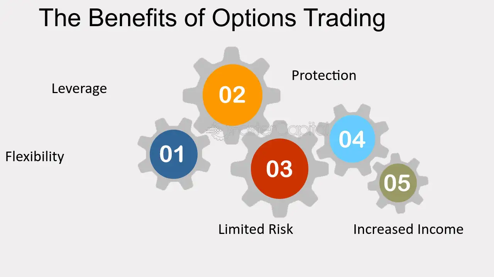

## Table of Contents

## What is options trading and how does it work?

Options trading is a way to invest in the stock market by buying and selling contracts called options. These options give you the right, but not the obligation, to buy or sell a specific stock at a set price before a certain date. There are two types of options: call options, which let you buy a stock, and put options, which let you sell a stock. People use options to make money from stock price movements without having to own the actual stocks.

When you buy an option, you pay a price called the premium. This premium is much lower than the price of the actual stock, so options can be a cheaper way to bet on stock prices. If the stock price moves in the direction you expected, you can make a profit by exercising your option or selling it to someone else. However, if the stock price doesn't move as you hoped, you could lose the money you paid for the option. Options trading can be risky, but it also offers the chance for big rewards if you make the right predictions.

## What are the basic types of options and their uses?

There are two basic types of options: call options and put options. A call option gives you the right to buy a stock at a certain price before a specific date. People buy call options when they think the price of a stock will go up. If the stock price does go up, they can buy the stock at the lower price set in the option and then sell it at the higher market price to make a profit. On the other hand, if the stock price doesn't go up, they can just let the option expire and only lose the money they paid for the option.

A put option gives you the right to sell a stock at a certain price before a specific date. People buy put options when they think the price of a stock will go down. If the stock price does go down, they can buy the stock at the lower market price and then sell it at the higher price set in the option to make a profit. If the stock price doesn't go down, they can let the option expire and only lose the money they paid for the option. Both call and put options are used to make money from stock price movements without having to own the stocks themselves.

## How can options trading help in managing risk?

Options trading can help manage risk by giving you the ability to protect your investments. For example, if you own a stock and you're worried its price might go down, you can buy a put option. This put option lets you sell your stock at a set price, even if the market price drops lower. This way, you limit how much money you could lose. It's like buying insurance for your stock.

Options can also help you make money in different market conditions. If you think a stock's price will stay the same or go down, you can sell a call option. By doing this, you get paid a premium upfront. If the stock price doesn't go up as expected, you keep the premium as profit. This way, you can earn money even when the market isn't moving in your favor. Options give you more ways to manage and reduce risk in your investments.

## What are the potential financial benefits of trading options?

Trading options can help you make money in different ways. When you buy options, you can make big profits if you guess right about where a stock's price will go. For example, if you buy a call option and the stock price goes up a lot, you can buy the stock at a lower price and sell it at the higher market price to make money. This means you can make more money with less money upfront than if you just bought the stock itself. Also, options can be cheaper than buying stocks, so you can start trading with less money.

Options also let you earn money even when stock prices stay the same or go down. If you sell a call option and the stock price doesn't go up much, you keep the money you got from selling the option. This is called the premium. You can also use options to protect your other investments. For example, if you own a stock and you're worried it might go down, you can buy a put option to sell it at a set price. This way, you limit how much money you could lose. So, options give you more ways to make money and manage risk.

## How does leverage in options trading amplify returns?

Leverage in options trading means you can control a big amount of stock with just a little bit of money. When you buy an option, you only pay a small price called the premium. This premium is much less than the cost of the actual stock. So, if the stock price moves in the way you expected, you can make a lot more money compared to if you had bought the stock itself. For example, if you think a stock will go up and you buy a call option, you can make a big profit if the stock price goes up a lot, because you only spent a little on the option.

But leverage can also make your losses bigger if things don't go your way. If the stock price doesn't move how you thought it would, you could lose all the money you paid for the option. This is because the premium you paid is gone if you don't use the option. So, while leverage can help you make more money, it also makes trading riskier. You need to be careful and understand that you can lose more money quickly with options than with just buying stocks.

## What are the tax implications of options trading?

When you make money from trading options, you have to pay taxes on your profits. The tax rules can be different depending on how long you hold the option and whether you are trading as a business or just for fun. If you hold an option for less than a year before selling it, any profit you make is considered a short-term capital gain. This is taxed at your regular income tax rate, which can be pretty high. But if you hold the option for more than a year, any profit is a long-term capital gain, which usually has a lower tax rate.

If you're trading options as a business, things can get a bit more complicated. The IRS might see your trading as a business if you do it a lot and it's your main way of making money. In this case, your profits and losses from options trading are treated as business income and expenses. You can deduct your losses and other trading costs from your income, which can help lower your taxes. It's a good idea to keep good records of all your trades and talk to a tax professional to make sure you're doing everything right.

## How can options be used for income generation?

Options can help you make money regularly by selling options to other people. When you sell a call option, you get paid right away. This money is called a premium. If the stock price doesn't go up much, you keep the premium as profit. This is a good way to make money even when the stock market isn't moving a lot. You can do this over and over again, selling new options each time the old ones expire, to keep making money.

Another way to use options for income is by using a strategy called a covered call. If you own a stock, you can sell call options on that stock. You still get the premium right away. If the stock price stays the same or goes down a bit, you keep the premium and the stock. If the stock price goes up a lot and the buyer wants to buy the stock from you, you still make money because you sell the stock at a higher price than you bought it. This way, you can make extra money on top of any gains from the stock itself.

## What strategies can beginners use to start trading options safely?

If you're new to options trading, start with simple strategies like buying call or put options. Buying a call option means you think the stock price will go up. If it does, you can buy the stock at a lower price and sell it at the higher market price to make a profit. Buying a put option means you think the stock price will go down. If it does, you can sell the stock at a higher price than the market price and make money. These strategies are easy to understand and help you learn how options work without too much risk.

Another safe way to start is by using a covered call strategy. This means you own a stock and sell call options on it. You get paid right away when you sell the option, which is called the premium. If the stock price doesn't go up much, you keep the premium as profit. If the stock price goes up a lot and the buyer wants to buy the stock from you, you still make money because you sell the stock at a higher price than you bought it. This way, you can make extra money on top of any gains from the stock itself. Both of these strategies help you learn options trading while keeping your risk low.

## How do advanced options strategies like spreads and straddles work?

Spreads and straddles are more advanced options strategies that can help you make money in different ways. A spread involves buying and selling options at the same time but with different prices or expiration dates. For example, in a bull call spread, you buy a call option at a lower price and sell another call option at a higher price on the same stock. If the stock price goes up but not too much, you can make money because the option you bought goes up in value more than the one you sold. This can help you limit your risk because you're not betting all your money on one option.

A straddle is another advanced strategy where you buy both a call option and a put option on the same stock with the same expiration date and price. You do this when you think the stock price will move a lot, but you're not sure which way. If the stock price goes up a lot, the call option makes money. If it goes down a lot, the put option makes money. The tricky part is that the stock needs to move a lot in either direction to cover the cost of both options. These strategies can be more complicated, but they give you more ways to make money depending on what the stock market does.

## What are the common pitfalls and how can they be avoided in options trading?

One common pitfall in options trading is not understanding how options work. Many people start trading without knowing the basics, like what call and put options are, how to use them, and what affects their prices. This can lead to big losses because they might buy options at the wrong time or for the wrong reasons. To avoid this, take time to learn about options. Read [books](/wiki/algo-trading-books), watch videos, and maybe even take a [course](/wiki/best-algorithmic-trading-courses). Make sure you understand the risks before you start trading with real money.

Another pitfall is using too much leverage. Options let you control a lot of stock with a little money, which can be good but also risky. If the stock price doesn't move the way you thought, you can lose all the money you put into the option. To avoid this, start small. Don't put all your money into one trade. Use only a small part of your money for options trading, and always have a plan for what you'll do if things don't go your way. This way, you can learn and grow without losing too much.

## How does market volatility affect options trading and how can it be used to an advantage?

Market [volatility](/wiki/volatility-trading-strategies), which means how much and how fast stock prices change, can really shake up options trading. When the market is volatile, the prices of options can go up and down a lot. This is because options are like bets on where the stock price will go, and when the market is moving a lot, those bets can be riskier. So, options can become more expensive because people want to be paid more for taking on that risk. But this also means that if you're good at guessing where the market will go, you can make more money because the potential rewards are bigger.

You can use market volatility to your advantage by [picking](/wiki/asset-class-picking) the right options strategies. For example, if you think the market will be very volatile but you're not sure which way it will go, you can use a strategy called a straddle. This means you buy both a call option and a put option on the same stock. If the stock price moves a lot in either direction, one of your options will make money, and it could be enough to cover the cost of both options and then some. Another way is to sell options when volatility is high because you can get a bigger premium, but this is riskier because you need to be ready for big price swings.

## What role does options trading play in a diversified investment portfolio?

Options trading can be a helpful part of a diversified investment portfolio. It lets you make money in different ways than just buying and holding stocks. For example, you can use options to bet on where a stock's price will go without owning the stock itself. This can help you make money even when the stock market is not doing well. Also, options can be used to protect your other investments. If you're worried that a stock you own might go down, you can buy a put option to limit how much money you could lose. This makes your portfolio safer because you're not putting all your eggs in one basket.

Using options in your portfolio can also help you take advantage of market changes. If you think the market will be very up and down, you can use strategies like straddles to make money no matter which way the market goes. And if you want to make some extra money, you can sell options to other people and get paid right away. This can add a steady stream of income to your portfolio. But remember, options can be risky, so it's important to use them carefully and not put too much of your money into them. This way, options can help you build a stronger and more flexible investment portfolio.

## References & Further Reading

[1]: Bergstra, J., Bardenet, R., Bengio, Y., & Kégl, B. (2011). ["Algorithms for Hyper-Parameter Optimization."](https://dl.acm.org/doi/10.5555/2986459.2986743) Advances in Neural Information Processing Systems 24.

[2]: ["Advances in Financial Machine Learning"](https://www.amazon.com/Advances-Financial-Machine-Learning-Marcos/dp/1119482089) by Marcos Lopez de Prado

[3]: ["Evidence-Based Technical Analysis: Applying the Scientific Method and Statistical Inference to Trading Signals"](https://www.amazon.com/Evidence-Based-Technical-Analysis-Scientific-Statistical/dp/0470008741) by David Aronson

[4]: ["Machine Learning for Algorithmic Trading"](https://github.com/stefan-jansen/machine-learning-for-trading) by Stefan Jansen

[5]: ["Quantitative Trading: How to Build Your Own Algorithmic Trading Business"](https://www.amazon.com/Quantitative-Trading-Build-Algorithmic-Business/dp/1119800064) by Ernest P. Chan

[6]: Hull, J. C. (2017). ["Options, Futures, and Other Derivatives"](https://www.semanticscholar.org/paper/Options%2C-Futures%2C-and-Other-Derivatives-Hull/89bdee500c8623864fc9eb7a471546aa713acc44). Pearson

[7]: Aldridge, I. (2013). ["High-Frequency Trading: A Practical Guide to Algorithmic Strategies and Trading Systems"](https://www.ahmetbeyefendi.com/wp-content/uploads/2020/07/High-Frequency-Trading-Irene-Aldridge.pdf). Wiley

[8]: Pardo, R. (2008). ["The Evaluation and Optimization of Trading Strategies"](https://onlinelibrary.wiley.com/doi/book/10.1002/9781119196969). Wiley

[9]: Sinclair, E. (2013). ["Options Trading: Strategies for Profiting with Options"](https://books.google.com/books/about/Option_Trading.html?id=uWxHEvjPSKAC). Wiley