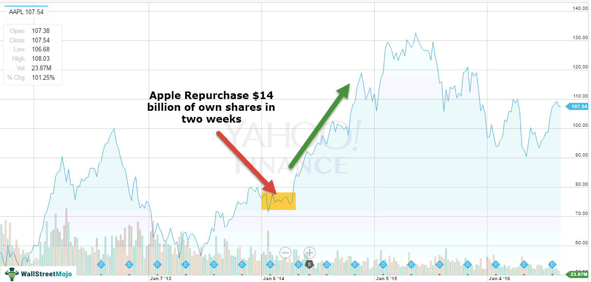

## Table of Contents

## What is a stock share repurchase?

A stock share repurchase, also known as a buyback, is when a company buys back its own shares from the market. This means the company is taking money it has and using it to buy its own stock, reducing the number of shares that are available to the public. Companies might do this for different reasons, like if they think their stock is a good investment or if they want to return money to shareholders.

When a company does a buyback, it can affect the stock price and the value of the remaining shares. With fewer shares available, the price of each share might go up because there's less supply. This can be good for shareholders because their shares might be worth more. But, it also means the company is spending money that could be used for other things, like growing the business or paying down debt. So, it's important for companies to think carefully about whether a buyback is the best use of their money.

## Why do companies buy back their own shares?

Companies buy back their own shares for a few main reasons. One big reason is to increase the value of the remaining shares. When a company buys back its shares, it reduces the total number of shares out there. With fewer shares available, the price of each share can go up because there's less supply. This can make shareholders happy because their shares are worth more. Another reason is that the company might think its own stock is a good investment. If the company believes its stock is undervalued, it can buy back shares as a way to invest in itself.

Another reason companies do buybacks is to return money to shareholders. Instead of paying dividends, which are regular payments to shareholders, a company might choose to buy back shares. This gives shareholders the option to sell their shares back to the company if they want to. It's another way to give money back to investors. However, it's important for companies to think carefully about buybacks. They need to make sure they're not spending money they might need for other things, like growing the business or paying off debts.

## How does a share repurchase affect the stock price?

When a company buys back its own shares, it can make the stock price go up. This happens because there are fewer shares available in the market. If the number of shares goes down but the company's value stays the same, each share becomes more valuable. It's like if you have a pizza and you cut it into fewer slices, each slice gets bigger. So, shareholders who keep their shares might see the value of their investment go up.

However, a share repurchase doesn't always make the stock price go up right away. Sometimes, the market might not like the buyback if they think the company is spending money it shouldn't. If investors think the company should be using that money for other things, like growing the business or paying off debts, the stock price might even go down. It all depends on what investors think about the buyback and the company's overall situation.

## What are the different methods of share repurchases?

Companies can buy back their shares in a few different ways. One way is through open market purchases. This means the company buys its shares on the stock market, just like any other investor would. They might do this slowly over time, or they might buy a lot of shares all at once. Another way is through a tender offer. In a tender offer, the company tells its shareholders that it wants to buy back a certain number of shares at a specific price. Shareholders can choose to sell their shares back to the company at that price if they want to.

Another method is called a Dutch auction. This is a special kind of tender offer where the company says it will buy back shares at a range of prices. Shareholders tell the company how many shares they want to sell and at what price. The company then figures out the lowest price that lets it buy back the number of shares it wants. Everyone who offered to sell at that price or lower gets to sell their shares. Each of these methods has its own pros and cons, and companies choose the one that fits best with their goals and the current market situation.

## Can share repurchases increase shareholder value?

Share repurchases can increase shareholder value by making each share worth more. When a company buys back its shares, it reduces the total number of shares out there. If the company's value stays the same but there are fewer shares, each share becomes more valuable. It's like if you have a pizza and you cut it into fewer slices, each slice gets bigger. This can make shareholders happy because the value of their investment goes up.

However, whether a buyback actually increases shareholder value depends on a lot of things. If the company uses money it needs for other things, like growing the business or paying off debts, to buy back shares, it might not be a good idea. Also, if the market thinks the company is making a bad decision by doing a buyback, the stock price might not go up. It all depends on what investors think about the buyback and the company's overall situation.

## What are the tax implications of share repurchases for investors?

When a company buys back its shares, it can affect how much tax investors have to pay. If an investor decides to sell their shares back to the company during a buyback, they might have to pay capital gains tax. This tax is based on how much the shares have gone up in value since the investor bought them. If the shares have gone up a lot, the investor might have to pay a bigger tax. But, if the shares have gone down in value, the investor might be able to use the loss to lower their taxes on other investments.

Another thing to think about is how share repurchases compare to dividends. When a company pays dividends, investors have to pay taxes on that money right away. But with a buyback, investors only have to pay taxes if they sell their shares. This can be good for investors because they can choose when to sell and pay taxes. If they think taxes might go down in the future, they can wait to sell their shares and maybe pay less tax. So, buybacks can be a way for companies to return money to investors without making them pay taxes right away.

## How do share repurchases impact a company's earnings per share (EPS)?

Share repurchases can make a company's earnings per share (EPS) go up. EPS is the amount of money a company makes for each share of its stock. When a company buys back its shares, it reduces the total number of shares out there. If the company's total earnings stay the same but there are fewer shares, the earnings per share will be higher. It's like if you have a pizza and you cut it into fewer slices, each slice gets bigger.

However, it's important to think about why the EPS is going up. If the company is using money it needs for other things, like growing the business or paying off debts, to buy back shares, it might not be a good idea in the long run. Also, if the market thinks the company is making a bad decision by doing a buyback, the stock price might not go up even if the EPS does. So, while share repurchases can make EPS look better, it's not always the best way for a company to use its money.

## What are the potential drawbacks of share repurchases?

Share repurchases can have some downsides for a company. One big problem is that the company might be using money it needs for other important things, like growing the business or paying off debts. If the company spends too much money on buying back shares, it might not have enough left for other things that could help it do better in the future. Also, if the market thinks the company is making a bad decision by doing a buyback, the stock price might go down instead of up. This can happen if investors think the company should be using its money differently.

Another issue is that share repurchases can make the company's earnings per share (EPS) look better, but this might not be good for the company in the long run. If the company is just buying back shares to make its EPS go up, it might not be focusing on other ways to make the business stronger. Also, if the company buys back shares when the stock price is high, it might end up spending too much money. This can be a problem if the stock price goes down later, and the company could have used that money in a better way.

## How can share repurchases be used as a signal of company confidence?

When a company buys back its own shares, it can show that the company's leaders believe in its future. They might think the stock is a good deal and worth investing in. If the company's leaders are willing to use the company's money to buy its own stock, it sends a message to investors that they think the company is doing well and will keep doing well. This can make investors feel more confident about the company and might even make them want to buy more shares.

However, it's important to remember that buying back shares isn't always a sure sign of confidence. Sometimes, companies might do buybacks for other reasons, like to make their earnings per share look better or because they don't have better ways to use their money. So, while a buyback can be a positive signal, investors should look at the whole picture and not just focus on the buyback itself. They should think about the company's overall situation and other things that might affect its future.

## What role do share repurchases play in corporate governance?

Share repurchases are a way for companies to manage their stock and can show how well they are being run. When a company's leaders decide to buy back shares, they are saying they think the company is doing well and its stock is a good deal. This can make shareholders feel good about the company and trust its leaders more. But, share repurchases can also be used in ways that might not be good for everyone. If leaders are buying back shares just to make their earnings per share look better or to get a quick boost in the stock price, it might not be the best use of the company's money.

It's important for companies to think carefully about why they are doing a buyback. Good corporate governance means making decisions that are best for the company and its shareholders in the long run. If a buyback is done for the right reasons and helps the company grow and be strong, it can be a good thing. But if it's done just to make things look good in the short term, it might not be the best choice. Shareholders should keep an eye on why their company is doing a buyback and make sure it's part of a smart plan for the future.

## How do share repurchases affect the company's capital structure?

When a company buys back its shares, it changes how its money is set up. This is called the capital structure. A company's capital structure is made up of debt and equity. When a company uses its money to buy back shares, it's using cash or taking on more debt to do it. This means the company might have less cash on hand or more debt to pay back. If the company uses a lot of its cash or takes on a lot of debt to buy back shares, it can make the company's financial situation riskier. 

On the other hand, buying back shares can also make the company's equity part of the capital structure smaller. When the company buys back its shares, the total number of shares goes down. This can make each share worth more, but it also means the company has less equity. If the company is using debt to buy back shares, it might end up with more debt compared to equity. This can change how risky the company looks to investors and lenders. So, share repurchases can change the balance between debt and equity in a company's capital structure, which can affect how the company is run and how it grows in the future.

## What are some case studies of successful share repurchase programs?

One good example of a successful share repurchase program is Apple. Apple started buying back its shares in 2012 and has spent hundreds of billions of dollars on buybacks. The company used its big pile of cash to buy back shares when it thought the stock was a good deal. This helped make each share worth more because there were fewer shares out there. Apple's stock price went up a lot during this time, and shareholders were happy because their investments grew. Apple's buyback program showed that the company was confident in its future and wanted to give money back to shareholders in a smart way.

Another example is Microsoft. Microsoft has been buying back its shares for many years, and it has spent a lot of money on buybacks. The company used its strong cash flow to buy back shares, which helped make each share more valuable. Microsoft's buybacks were part of a bigger plan to return money to shareholders and show confidence in the company's future. The stock price went up over time, and shareholders saw their investments grow. Microsoft's successful buyback program showed that the company was using its money wisely and focusing on making shareholders happy.

## References & Further Reading

[1]: ["Advances in Financial Machine Learning"](https://www.amazon.com/Advances-Financial-Machine-Learning-Marcos/dp/1119482089) by Marcos Lopez de Prado

[2]: ["Evidence-Based Technical Analysis: Applying the Scientific Method and Statistical Inference to Trading Signals"](https://www.amazon.com/Evidence-Based-Technical-Analysis-Scientific-Statistical/dp/0470008741) by David Aronson

[3]: ["Machine Learning for Algorithmic Trading"](https://github.com/stefan-jansen/machine-learning-for-trading) by Stefan Jansen

[4]: ["Quantitative Trading: How to Build Your Own Algorithmic Trading Business"](https://www.amazon.com/Quantitative-Trading-Build-Algorithmic-Business/dp/1119800064) by Ernest P. Chan

[5]: Eccles, R. G., Lanes, K. L., & Wilson, T. C. (1999). ["Are You Paying Too Much for That Acquisition?"](https://pubmed.ncbi.nlm.nih.gov/10539205/) Harvard Business Review.

[6]: Fried, J. M. (2005). ["Informed Trading and False Signaling with Open Market Repurchases"](https://papers.ssrn.com/sol3/papers.cfm?abstract_id=564682) The Journal of Financial Research.

[7]: Kahle, K. M. (2002). ["When a Buyback Isn’t a Buyback: Open Market Repurchases and Employee Options"](https://www.sciencedirect.com/science/article/pii/S0304405X01000952) The Journal of Financial Economics.

[8]: Myers, S. C. (1984). ["The Capital Structure Puzzle"](https://onlinelibrary.wiley.com/doi/full/10.1111/j.1540-6261.1984.tb03646.x) National Bureau of Economic Research.

[9]: Skinner, D. J. (2008). ["The Evolving Relation Between Earnings, Dividends, and Stock Repurchases"](https://www.sciencedirect.com/science/article/pii/S0304405X07002334) The Review of Financial Studies.