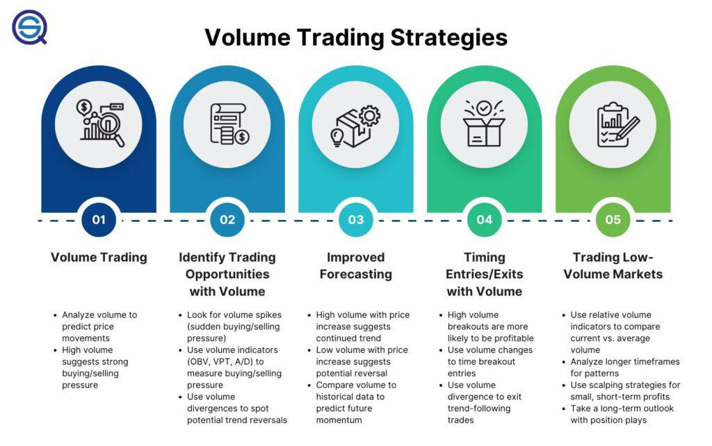

## Table of Contents

## What are low volume stocks?

Low volume stocks are stocks that don't have many buyers and sellers trading them each day. When a stock has low volume, it means fewer shares are being traded compared to other stocks. This can make it harder to buy or sell the stock quickly because there aren't as many people interested in trading it.

Because of the low number of trades, the price of low volume stocks can change a lot in a short time. If someone wants to buy or sell a lot of shares, it can move the price up or down quickly. This can be risky for investors because the stock price might be more unpredictable. It's important for investors to understand these risks before they decide to trade low volume stocks.

## How can beginners identify low volume stocks?

Beginners can identify low volume stocks by looking at the average daily trading volume of a stock. This information is usually available on financial websites and stock market apps. The average daily trading volume is the number of shares that are traded each day, on average. If a stock has a low average daily trading volume, it means it's a low volume stock. A good rule of thumb is to consider stocks with less than 100,000 shares traded per day as low volume.

Another way to spot low volume stocks is by watching the stock's price movements. Low volume stocks often have big price swings because there are fewer trades happening. If you see a stock's price going up and down a lot in a short time, it might be because it's a low volume stock. This can be a sign that the stock is not very liquid, meaning it's harder to buy and sell quickly. By keeping an eye on both the trading volume and the price movements, beginners can get a better sense of which stocks are low volume.

## What are the potential benefits of trading low volume stocks?

Trading low volume stocks can sometimes lead to big profits. Because there are fewer people trading these stocks, a small number of trades can cause the price to go up a lot. If you buy a low volume stock at a low price and then the price goes up because of a few trades, you can make a good amount of money when you sell it. This is why some people like trading low volume stocks - the chance to make a big return on their investment.

Another benefit of trading low volume stocks is that they can sometimes be overlooked by other investors. Big investors and professional traders often focus on stocks with high trading volumes because they are easier to buy and sell. This means that low volume stocks might be undervalued, or priced lower than they should be. If you can find a low volume stock that is undervalued and then the price goes up, you can make money by buying it at a low price and selling it later at a higher price.

## What risks are associated with trading low volume stocks?

Trading low volume stocks can be risky because they are not traded often. When you want to buy or sell a low volume stock, it might be hard to find someone to trade with. This can make it take longer to buy or sell the stock, and you might not get the price you want. If you need to sell the stock quickly, you might have to sell it for less money than you wanted.

Another risk is that the price of low volume stocks can change a lot in a short time. Because there are not many trades, just a few people buying or selling can make the price go up or down a lot. This can be scary because you might lose money if the price goes down suddenly. It's hard to predict what will happen with low volume stocks, so they can be more unpredictable than other stocks.

Also, low volume stocks can be more likely to be affected by things like rumors or news. Because fewer people are watching these stocks, a small piece of news can make a big difference in the price. This can make trading low volume stocks even riskier because the price might change a lot based on things that are hard to predict.

## How does liquidity affect the trading of low volume stocks?

Liquidity is how easy it is to buy or sell a stock. When a stock has low volume, it means it's not very liquid. This makes it harder to trade because there are not many people wanting to buy or sell the stock. If you want to sell your low volume stock, you might have to wait a long time to find someone who wants to buy it. And when you do find someone, you might have to sell it for less money than you wanted because there are not many buyers.

Because low volume stocks are not very liquid, the price can change a lot. Just a few people buying or selling can make the price go up or down quickly. This can be risky because if you need to sell your stock fast, you might lose money if the price goes down suddenly. It's important to think about liquidity when trading low volume stocks because it can affect how easy it is to trade and how much money you might make or lose.

## Can low volume stocks offer higher returns compared to high volume stocks?

Low volume stocks can sometimes offer higher returns than high volume stocks. This is because there are fewer people trading these stocks, so a small number of trades can make the price go up a lot. If you buy a low volume stock at a low price and then the price goes up because of a few trades, you can make a good amount of money when you sell it. This is why some people like trading low volume stocks - the chance to make a big return on their investment.

However, trading low volume stocks is riskier. The price of these stocks can change a lot in a short time because there are not many trades. If the price goes down suddenly, you might lose money. Also, it can be hard to find someone to buy or sell the stock with you because there are fewer people trading. This means you might have to wait longer to trade or sell the stock for less money than you wanted. So, while low volume stocks can offer higher returns, they also come with more risk.

## What strategies are effective for trading low volume stocks?

When trading low volume stocks, one effective strategy is to do a lot of research before you buy. Look for low volume stocks that might be undervalued, which means they are priced lower than they should be. This can happen because big investors and professional traders often ignore low volume stocks. If you find a good undervalued stock, you can buy it at a low price and then sell it later when the price goes up. Another part of this strategy is to keep an eye on the news and rumors that can affect the stock price. Because low volume stocks can be moved a lot by just a few trades, staying informed can help you decide when to buy or sell.

Another strategy is to use limit orders instead of market orders when trading low volume stocks. A limit order lets you set the price you want to buy or sell the stock at. This can help you avoid the big price swings that can happen with low volume stocks. If you use a market order, you might end up buying or selling at a price that's a lot different from what you expected because the price can change quickly. By using limit orders, you can have more control over the price you trade at, which can help you manage the risks of trading low volume stocks.

Patience is also key when trading low volume stocks. Because these stocks are not traded often, it can take longer to find someone to buy or sell with. You might need to wait for the right time to make your trade. This means you should be ready to hold onto the stock for a while if you need to. Being patient can help you get a better price when you do trade, and it can help you avoid making quick decisions that might lose you money.

## How does market volatility impact low volume stocks?

Market volatility can have a big effect on low volume stocks. When the market is volatile, it means the prices of stocks are going up and down a lot. For low volume stocks, this can make the price change even more because there are not many people trading them. Just a few people buying or selling can make the price of a low volume stock go up or down a lot. This can be risky because if you own a low volume stock and the market gets volatile, the price might drop suddenly, and you could lose money.

On the other hand, market volatility can also offer chances to make money with low volume stocks. If you think the price of a low volume stock will go up because of market volatility, you can buy it at a low price and then sell it later when the price goes up. But this is tricky because the price can be hard to predict. You need to watch the market closely and be ready to make quick decisions. Trading low volume stocks during times of high market volatility can lead to big wins, but it also comes with a lot of risk.

## What are the best times to trade low volume stocks?

The best times to trade low volume stocks are usually during the regular trading hours of the stock market, which are from 9:30 AM to 4:00 PM Eastern Time in the United States. This is when most trading happens, so you might find more people willing to buy or sell low volume stocks. Also, trading during the first and last hour of the trading day can be good because more people are active in the market then. These times can give you a better chance to buy or sell at the price you want.

Another good time to trade low volume stocks is when there is news or events that might affect the stock's price. If there is news about the company or the industry, it can make more people interested in trading the stock, even if it's usually low volume. This can make it easier to find someone to trade with and might help you get a better price. Just remember, news can also make the price go up or down a lot, so you need to be ready for that.

## How can one use technical analysis with low volume stocks?

Using technical analysis with low volume stocks can help you make better trading decisions. Technical analysis is when you look at charts and patterns to guess where the stock price might go next. With low volume stocks, you can use tools like moving averages, which help smooth out the price changes over time, to see if the stock is going up or down. You can also look at support and resistance levels, which are prices where the stock often stops going down or up. These tools can help you find good times to buy or sell the stock, even if it doesn't trade a lot.

But, you need to be careful when using technical analysis with low volume stocks because they can be more unpredictable. The price can change a lot because of just a few trades, so the patterns you see on the charts might not be as reliable as they are with high volume stocks. It's a good idea to use technical analysis along with other information, like news about the company or the industry, to make your trading decisions. By combining different kinds of information, you can get a better idea of what might happen with the stock price.

## What are some advanced techniques for managing risk when trading low volume stocks?

One advanced technique for managing risk when trading low volume stocks is to use stop-loss orders. A stop-loss order is a way to tell your broker to sell the stock if it goes down to a certain price. This can help you limit how much money you might lose if the price drops suddenly. Because low volume stocks can change a lot in a short time, setting a stop-loss order can be a smart way to protect your investment. You need to think carefully about where to set the stop-loss price because setting it too close to the current price might make you sell the stock too soon, but setting it too far away might not protect you enough.

Another technique is to diversify your investments. This means not putting all your money into just one or two low volume stocks. Instead, you can spread your money across different stocks, including some that are more liquid and have higher trading volumes. This way, if one low volume stock loses value, you won't lose all your money. Diversifying can help balance out the risks of trading low volume stocks. It's also a good idea to keep some of your money in safer investments, like bonds or savings accounts, so you have a cushion if things go wrong with your stocks.

## How do regulatory changes influence the trading of low volume stocks?

Regulatory changes can have a big impact on trading low volume stocks. When the rules about how stocks can be traded change, it can make it easier or harder to buy and sell these stocks. For example, if new rules make it harder for small companies to list their stocks on the market, there might be fewer low volume stocks to trade. Also, if the rules change about how much information companies have to share with investors, it can affect how much people trust low volume stocks. If people feel like they don't have enough information, they might be less likely to trade these stocks, which can make them even less liquid.

On the other hand, some regulatory changes can help low volume stocks. If the rules make it easier for small companies to get their stocks on the market, there might be more low volume stocks for people to trade. Also, if the rules help make sure that companies share more information with investors, it can make people feel more confident about trading low volume stocks. This can lead to more people trading these stocks, which can make them more liquid and easier to buy and sell. So, it's important to keep an eye on regulatory changes because they can change how you trade low volume stocks.

## What are the best practices for risk management?

Effective risk management is crucial in trading low volume stocks, especially when combining such investments with algorithmic trading strategies. Implementing robust techniques like stop-loss orders and position sizing can help mitigate potential downsides. Stop-loss orders automatically sell a stock when its price falls below a predetermined level, minimizing losses. For instance, if a stock is purchased at $50, a stop-loss might be set at $45, meaning if the stock price drops to $45, the stock is sold to prevent further losses.

Position sizing is another fundamental risk management technique, determining the size of a trade based on risk tolerance and total portfolio size. An investor might use the formula:

$$
\text{Position Size} = \frac{\text{Account Risk} \times \text{Account Balance}}{\text{Trade Risk}}
$$

where $\text{Account Risk}$ is the percentage of the portfolio the investor is willing to risk on a single trade, and $\text{Trade Risk}$ is the difference between the entry price and the stop-loss price multiplied by the number of shares.

Diversification is essential for spreading risk exposure. By allocating investments across various sectors, industries, and asset classes, the negative performance of one investment can potentially be offset by positive performance in another. For example, an investor might distribute capital between technology stocks, healthcare stocks, and government bonds, reducing the impact of sector-specific downturns.

Continuous monitoring and adaptation of strategies are vital in response to market performance and unforeseen events. Markets are dynamic, influenced by economic indicators, geopolitical events, and technological advancements. Algorithms in trading strategies should be tested and updated continually to accommodate changing market conditions. In Python, investors can use libraries like Pandas for data analysis and Backtrader for [backtesting](/wiki/backtesting) trading strategies, enabling them to refine and adapt their approaches.

In summary, implementing robust risk management techniques such as stop-loss orders, position sizing, and diversification, along with continuous strategy assessment, can significantly enhance the resilience and potential success of investments in low volume stocks, especially when using algorithmic trading strategies.

## References & Further Reading

[1]: Bergstra, J., Bardenet, R., Bengio, Y., & Kégl, B. (2011). ["Algorithms for Hyper-Parameter Optimization."](https://dl.acm.org/doi/10.5555/2986459.2986743) Advances in Neural Information Processing Systems 24.

[2]: ["Advances in Financial Machine Learning"](https://www.amazon.com/Advances-Financial-Machine-Learning-Marcos/dp/1119482089) by Marcos Lopez de Prado

[3]: ["Evidence-Based Technical Analysis: Applying the Scientific Method and Statistical Inference to Trading Signals"](https://www.amazon.com/Evidence-Based-Technical-Analysis-Scientific-Statistical/dp/0470008741) by David Aronson

[4]: ["Machine Learning for Algorithmic Trading"](https://github.com/stefan-jansen/machine-learning-for-trading) by Stefan Jansen

[5]: ["Quantitative Trading: How to Build Your Own Algorithmic Trading Business"](https://github.com/LucindaYa/quant-resources/blob/master/Quantitative%20Trading%20How%20to%20Build%20Your%20Own%20Algorithmic%20Trading%20Business.pdf) by Ernest P. Chan