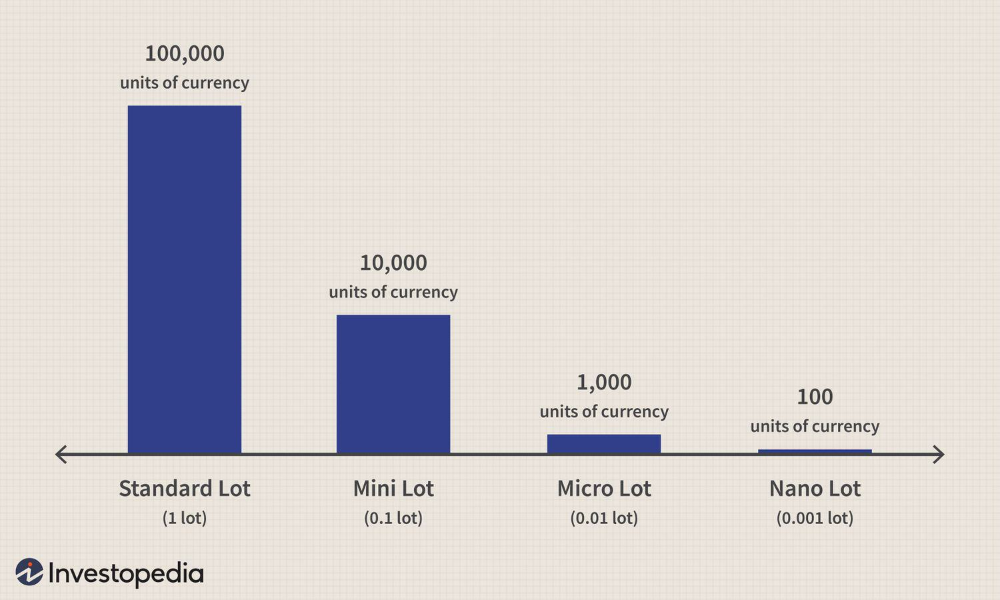

Forex trading is an expansive financial domain that facilitates the buying and selling of global currencies. This investment avenue is dynamic, predominantly driven by the fluctuating exchange rates of currency pairs, thus offering lucrative opportunities for investors. A fundamental aspect of forex trading is its accessibility through mini forex accounts, which serve as an entry-level option for novice traders. These accounts require a smaller initial investment and allow for trading smaller lot sizes, specifically units of 10,000 as opposed to the standard 100,000 in regular accounts. This reduces financial exposure and allows traders to develop and test their strategies with reduced capital risk.

Algorithmic trading, or algo trading, complements development in trading by leveraging the power of technology for executing orders at optimal speed and efficiency. This method employs computer programs designed to follow specific trading criteria, eliminating emotional biases that often impair decision-making processes. The algorithmic approach allows traders to capitalize on minute market movements, analyze large volumes of data, and implement complex strategies quickly and precisely.



In this article, we will investigate the strategic advantages of integrating forex trading with mini accounts and algorithmic trading methodologies. Understanding how these components interact can provide traders with a balanced framework, enhancing profitability while controlling risk. As the financial landscape evolves, the fusion of these trading practices becomes increasingly significant for achieving sustainable gains amidst currency market fluctuations.

## Table of Contents

## Understanding Forex Trading and Mini Forex Accounts

Forex trading involves the buying and selling of currency pairs with the objective of making a profit from fluctuations in exchange rates. The forex market operates as a global decentralized marketplace where currencies are traded, and it is recognized as the largest financial market in the world, surpassing stock markets in terms of trading volume. The fundamental principle of forex trading is to purchase a currency pair at a lower price and sell it at a higher price, or vice versa, to gain from the differences in exchange rates.

Mini forex accounts provide an entryway to the forex market with significantly reduced financial exposure. Unlike standard forex accounts, which typically trade in lot sizes of 100,000 units, mini forex accounts allow traders to engage in trading with smaller lot sizes of 10,000 units. This reduced lot size minimizes the risk exposure for traders, making it an attractive option for beginners who are still learning the dynamics of the forex market.

One of the primary advantages of mini forex accounts is their low initial deposit requirement. This characteristic makes them particularly accessible to new traders, as it offers a cost-effective way to start trading without committing substantial amounts of capital. By lowering the financial barrier to entry, mini forex accounts enable traders to practice and experiment with trading strategies in a real-market environment. 

These accounts are especially beneficial for individuals who are interested in familiarizing themselves with [forex](/wiki/forex-system) trading mechanics and testing different strategies before transitioning to standard accounts. Furthermore, mini forex accounts offer traders the opportunity to hone their skills in position sizing and risk management. Overall, by providing a low-risk platform for learning and experimentation, mini forex accounts serve as a valuable tool for traders looking to gain experience in the forex market.

## Advantages of Mini Forex Accounts

Mini forex accounts offer several distinct advantages that appeal particularly to new traders and those seeking to mitigate risk. One of the primary benefits of these accounts is their ability to reduce financial exposure, which is critical in the volatile foreign exchange market. By allowing traders to engage with smaller lot sizes of 10,000 units, mini forex accounts significantly minimize the amount of capital that is put at risk in each trade. This feature is especially advantageous for beginners who are still learning the dynamics of forex trading and wish to experiment without the fear of large financial losses.

The use of smaller lot sizes in mini accounts provides traders with better control over position sizing, a crucial aspect of effective risk management. Position sizing involves determining the amount of capital to allocate to a particular trade, which can influence the trader’s overall risk exposure. By trading in smaller lot sizes, traders can allocate their capital more precisely, tailoring their investment to match their risk tolerance and financial goals. This allows for more strategic decision-making concerning which trades to pursue and how much capital to commit.

Moreover, mini forex accounts facilitate greater customization in trades. This flexibility enables traders to make precise adjustments based on the prevailing market conditions. For instance, if the market is experiencing high [volatility](/wiki/volatility-trading-strategies), a trader with a mini forex account can quickly modify their positions to protect their investments or capitalize on potential profit opportunities. This ability to tailor trades to specific conditions enhances a trader’s capability to respond adeptly to market fluctuations, which is vital for long-term success in forex trading. 

In summary, the diminished financial exposure, enhanced control over position sizing, and increased trade customization make mini forex accounts a prudent choice for traders aiming to develop their skills while managing risk effectively. These advantages underscore the suitability of mini accounts as a stepping stone into the forex market, particularly for those who are new to trading or cautious about the level of risk they wish to undertake.

## Exploring Algorithmic Trading

Algorithmic trading employs computer programs to execute trades according to pre-defined criteria, fundamentally transforming how trading operates by removing human emotions from decision-making processes. This approach leverages the computational power of machines to enhance trading efficiency, allowing for rapid execution of trades, high precision, and the capacity to process vast amounts of market data in real-time. This capability is especially crucial in the foreign exchange (forex) market, where prices can change in fractions of a second.

One of the primary advantages of [algorithmic trading](/wiki/algorithmic-trading) is its ability to improve speed. Computers can place orders within milliseconds, providing a significant advantage in fast-moving markets. This speed enables traders to capitalize on fleeting opportunities that might otherwise be missed with manual trading.

Precision is another critical aspect. Algorithms can execute trades with exact specifications without the possibility of human error, such as misclicks or order entry mistakes. This accuracy is vital in maintaining consistency across trading strategies, ensuring that predefined conditions are consistently met.

Algorithmic trading also excels in data analysis. By leveraging advanced computational algorithms, traders can analyze large data sets to identify patterns and trends that inform trading strategies. This data-driven approach can lead to more informed decisions and potentially more profitable trades.

Several popular algorithmic trading strategies are employed in the forex market:

1. **Trend-Following**: This strategy involves creating algorithms that detect and exploit trends in the market. A trend-following algorithm might use moving averages to identify when a currency pair is in an uptrend or downtrend and then place trades in the direction of the established trend.

2. **Mean Reversion**: Mean reversion strategies are based on the assumption that prices will eventually return to a historical mean or average level. Algorithms detect and trade on price deviations from the norm, assuming that there will be a correction to the mean.

3. **Arbitrage**: Arbitrage involves exploiting price discrepancies in different markets or securities for the same asset. Algorithms designed for arbitrage must execute trades rapidly to take advantage of small, often fleeting price differences.

To illustrate the implementation of a simple mean reversion strategy in Python, consider the following pseudocode:

```python
import numpy as np

def calculate_moving_average(prices, window_size):
    return np.convolve(prices, np.ones(window_size)/window_size, mode='valid')

def mean_reversion_strategy(prices, window_size):
    moving_average = calculate_moving_average(prices, window_size)
    signals = []

    for price, average in zip(prices[window_size-1:], moving_average):
        if price < average:
            signals.append('buy')  # Buy when price falls below average
        elif price > average:
            signals.append('sell')  # Sell when price rises above average
        else:
            signals.append('hold')

    return signals

# Example usage
prices = [1.2, 1.3, 1.25, 1.22, 1.28, 1.35, 1.32, 1.31, 1.4]
signals = mean_reversion_strategy(prices, window_size=3)
print(signals)
```

This basic example demonstrates how an algorithm can automate decisions based on historical price data. While this is a simplistic model, real-world applications can become much more complex, incorporating advanced statistical and [machine learning](/wiki/machine-learning) techniques. Algorithmic trading has redefined financial markets by offering efficiency and precision unmatched by human capabilities.

## Benefits of Combining Mini Forex Accounts with Algo Trading

Combining mini forex accounts with algorithmic trading strategies brings several notable benefits to traders, particularly those who are still acclimatizing to the forex market. Mini forex accounts allow traders to operate with smaller lot sizes, typically 10,000 units, instead of the standard lot size of 100,000 units. This reduces the financial exposure and provides a controlled environment where traders can experiment with various algorithmic strategies without the fear of significant financial loss.

The use of mini accounts as a testing ground aligns well with the iterative nature of algorithm development. Traders can fine-tune their algorithms in this environment, ensuring that strategies are efficient and effective under different market conditions. By using real trades to test their algorithms, traders can gain valuable insights and make necessary adjustments to enhance strategy performance.

Algorithmic trading, in conjunction with mini forex accounts, offers robust tools for [backtesting](/wiki/backtesting) and strategy optimization. Backtesting involves applying trading algorithms to historical data to evaluate how a strategy would have performed in the past. This process is crucial for identifying the strengths and weaknesses of a trading strategy before deploying it in live markets. Through backtesting, traders can optimize parameters and refine their decision-making processes. For instance, Python libraries such as `pandas` and `[backtrader](/wiki/backtrader)` provide powerful platforms for conducting thorough backtesting:

```python
import backtrader as bt
import pandas as pd

# Define a simple moving average strategy
class SmaCross(bt.SignalStrategy):
    def __init__(self):
        sma1, sma2 = bt.ind.SMA(period=10), bt.ind.SMA(period=30)
        self.signal_add(bt.SIGNAL_LONG, bt.ind.CrossOver(sma1, sma2))

# Create a Cerebro entity
cerebro = bt.Cerebro()
cerebro.addstrategy(SmaCross)

# Load data
data = bt.feeds.PandasData(dataname=pd.read_csv('forex_data.csv'))
cerebro.adddata(data)

# Run backtest
cerebro.run()
cerebro.plot()
```

By leveraging the manageable risk levels of mini accounts, traders can cautiously test and optimize their algorithms, ensuring they are equipped to handle live trading scenarios. This meticulous approach helps in maximizing profitability by reducing potential risks. Moreover, algorithmic trading's ability to systematically analyze large volumes of data and execute trades without emotional bias offers a strategic advantage. This combination allows traders to make data-driven decisions that can enhance their overall trading performance in the forex market.

## Overcoming Challenges in Algo Trading

Algorithmic trading, while offering significant advantages in speed and precision, presents several challenges that traders must address to ensure successful implementation. One of the primary challenges is the need for a deep understanding of programming and algorithm maintenance. Developing a robust algorithm requires proficiency in coding languages such as Python, C++, or Java, which enable traders to translate their trading strategies into executable instructions. Moreover, maintaining these algorithms involves regular updates and optimizations to adapt to changing market conditions and to fix any identified errors or inefficiencies.

Reliance on technology introduces the critical necessity for robust systems and reliable backup measures. Technical failures can disrupt trading activities, potentially leading to significant financial losses. To mitigate such risks, traders should invest in high-quality hardware and secure data centers, ensuring that trading systems are resilient to hardware malfunctions and external threats such as cyberattacks. Implementing automated backup systems and failover mechanisms is crucial for maintaining continuous operations and safeguarding data integrity.

Comprehensive risk management techniques are a vital component of effective algorithmic trading. Algorithms must be designed to account for market volatility and unpredictability, which can affect the stability and performance of trading strategies. By incorporating sophisticated risk management frameworks, traders can better navigate adverse market conditions. Techniques such as stop-loss orders, position sizing, and diversification help manage risk exposure. Moreover, incorporating real-time data analysis into algorithms allows for adaptive responses to market fluctuations, enhancing the system's ability to minimize potential losses.

Python, for instance, is commonly used for such risk management tasks due to its extensive libraries and tools. Here's a basic example of handling risk with a stop-loss mechanism using Python:

```python
def execute_trade(symbol, entry_price, stop_loss, take_profit):
    current_price = get_current_market_price(symbol)

    if current_price <= stop_loss:
        close_trade(symbol)
        print("Trade closed at stop-loss level.")

    elif current_price >= take_profit:
        close_trade(symbol)
        print("Trade closed at take-profit level.")
    else:
        print("Trade is still open.")

# Example usage
execute_trade("EUR/USD", 1.1000, 1.0950, 1.1100)
```

This snippet illustrates a basic approach to automating trade decisions based on current market prices relative to predetermined stop-loss and take-profit levels. It demonstrates how traders can apply programming to build safer trading environments by automating essential risk management tasks.

Addressing these challenges is critical for deploying effective algorithmic trading systems. Understanding the technical complexities, ensuring system reliability, and implementing robust risk management are essential steps for traders aiming to capitalize on the benefits of automated trading in the forex market.

## Conclusion

Forex trading with mini forex accounts provides an accessible and secure starting point for newcomers, allowing them to gain experience and understanding of the currency market with reduced risk. These accounts require a lesser capital commitment, which is significantly beneficial for beginners seeking to build confidence and develop strategic skills. Mini forex accounts help traders familiarize themselves with market dynamics, risk management, and trading platforms at a manageable scale, preparing them for larger trading activities.

Meanwhile, algorithmic trading facilitates enhanced decision-making by offering automation capabilities. The deployment of computer algorithms enables trades to be executed based on predefined rules, optimizing the trading process by eliminating human errors and emotions. Algo trading is characterized by its ability to process and analyze vast datasets swiftly, ensuring traders can capitalize on opportunities within milliseconds. This swift execution capability, when combined with data-driven strategies, results in increased accuracy and potentially higher returns.

When mini forex accounts are combined with algorithmic trading, traders have the opportunity to optimize their strategies while benefiting from controlled risk exposure. This combination allows traders to conduct backtesting and optimization of algorithms in real-time with manageable financial stakes, thus refining their strategies and improving profitability. By leveraging the computational power of algorithms and the secure entry point provided by mini forex accounts, traders can maximize their potential gains while mitigating overall risks.

To fully capitalize on these advantages, traders need to comprehend both the benefits and the inherent challenges associated with algorithmic trading, such as technological dependencies and the necessity of robust risk management frameworks. Overcoming these challenges requires knowledge in coding and algorithm design, as well as ensuring proper system redundancies to protect against unforeseen technical failures. By effectively addressing these challenges, traders can adeptly harness the strengths of mini forex accounts and algorithmic trading, positioning themselves to achieve their financial goals in the competitive forex market.

## References & Further Reading

[1]: Bergstra, J., Bardenet, R., Bengio, Y., & Kégl, B. (2011). ["Algorithms for Hyper-Parameter Optimization."](https://dl.acm.org/doi/10.5555/2986459.2986743) Advances in Neural Information Processing Systems 24.

[2]: ["Advances in Financial Machine Learning"](https://www.amazon.com/Advances-Financial-Machine-Learning-Marcos/dp/1119482089) by Marcos Lopez de Prado

[3]: ["Evidence-Based Technical Analysis: Applying the Scientific Method and Statistical Inference to Trading Signals"](https://www.amazon.com/Evidence-Based-Technical-Analysis-Scientific-Statistical/dp/0470008741) by David Aronson

[4]: ["Machine Learning for Algorithmic Trading"](https://github.com/stefan-jansen/machine-learning-for-trading) by Stefan Jansen

[5]: ["Quantitative Trading: How to Build Your Own Algorithmic Trading Business"](https://www.amazon.com/Quantitative-Trading-Build-Algorithmic-Business/dp/1119800064) by Ernest P. Chan