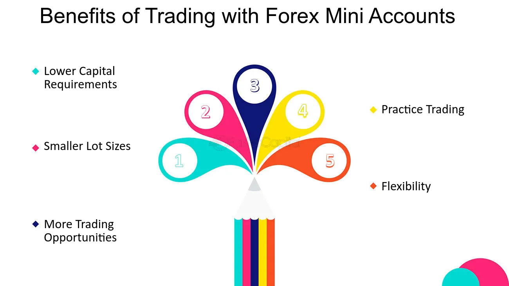

## Table of Contents

## What is a mini forex account and how does it differ from a standard account?

A mini forex account is a type of trading account that allows traders to trade with smaller amounts of money compared to a standard account. In a mini account, the standard lot size is typically 10,000 units of the base currency, whereas in a standard account, it is 100,000 units. This makes mini accounts more accessible for beginners or those who want to trade with less risk, as they require less capital to start trading.

The main difference between a mini forex account and a standard account is the lot size and the amount of money needed to open and maintain the account. Because of the smaller lot size, the potential profits and losses in a mini account are also smaller compared to a standard account. This can be beneficial for traders who are still learning and want to practice trading without risking large sums of money. However, both types of accounts offer the same trading opportunities and access to the forex market, so traders can choose the one that best fits their needs and risk tolerance.

## How can a mini forex account help beginners learn to trade forex?

A mini forex account can help beginners learn to trade forex by allowing them to start with less money. Instead of needing a lot of money to open a standard account, a mini account lets you trade with smaller amounts. This means you can practice trading without risking too much money. It's like learning to ride a bike with training wheels – you can get the feel of trading without the big risks.

Also, because the lot sizes are smaller in a mini account, the profits and losses are smaller too. This can make beginners feel more comfortable as they learn. They can try different strategies and see how the market moves without worrying about losing a lot of money. Over time, as they get better and more confident, they can move to a standard account if they want to.

## What are the typical lot sizes and leverage options available with mini forex accounts?

In a mini [forex](/wiki/forex-system) account, the typical lot size is 10,000 units of the base currency. This is smaller than the 100,000 units used in a standard account. The smaller lot size means that each trade involves less money, making it easier for beginners to start trading without needing a large amount of capital.

Leverage options for mini forex accounts can vary depending on the broker, but they often range from 1:50 to 1:400. Leverage lets you control a larger position with less money. For example, with 1:100 leverage, you can control a $10,000 position with just $100. This can increase your potential profits, but it also increases the risk, so it's important to use leverage carefully.

## How do the costs and fees associated with mini forex accounts compare to standard accounts?

The costs and fees for mini forex accounts are generally similar to those of standard accounts, but the amounts can be smaller because of the smaller trade sizes. For example, the spread, which is the difference between the buy and sell price of a currency pair, might be the same percentage for both types of accounts. But because mini accounts trade in smaller lots, the actual dollar amount you pay in spreads will be less. Also, some brokers might charge a commission per trade, and this fee could be the same for both account types, but again, the smaller trade size in a mini account means you're paying that fee on a smaller amount of money.

Another cost to consider is the swap or rollover fee, which is charged if you keep a position open overnight. This fee can be the same for both mini and standard accounts, but again, the impact on your account will be smaller with a mini account because you're trading less money. Overall, while the fees and costs might be structured similarly between mini and standard accounts, the smaller trade sizes in mini accounts mean that the actual costs you pay out of pocket will usually be lower. This can make mini accounts a more cost-effective choice for beginners or those trading with less capital.

## What risk management benefits does a mini forex account offer to traders?

A mini forex account helps traders manage their risks better because it lets them trade with smaller amounts of money. This means if the market moves against them, they won't lose as much money as they would with a standard account. It's like practicing with a smaller bike before riding a big one. This smaller risk can make traders feel more comfortable and confident as they learn how to trade.

Also, because the lot sizes are smaller, traders can test out different trading strategies without risking too much. They can see how different approaches work in real market conditions without putting a lot of money on the line. This helps them learn what works and what doesn't, so they can improve their skills slowly and safely. Over time, this practice can lead to better risk management and more successful trading.

## How can trading with a mini forex account improve a trader's strategy development?

Trading with a mini forex account helps traders develop their strategies by letting them try out different ideas without risking a lot of money. Because mini accounts have smaller lot sizes, the amount of money involved in each trade is less. This means traders can experiment with different strategies, like when to buy or sell, without worrying about big losses. They can see how their strategies work in real market conditions and learn from their mistakes without losing too much money.

This practice helps traders get better at planning their moves and understanding the market. Over time, they can fine-tune their strategies, figuring out what works best for them. As they get more confident and experienced, they can start using bigger trades or even switch to a standard account. But the key is that starting with a mini account gives them a safe space to learn and improve their trading skills.

## What psychological benefits might traders experience when starting with a mini forex account?

Starting with a mini forex account can help traders feel less stressed about trading. Because the amount of money involved in each trade is smaller, traders don't have to worry as much about losing a lot of money. This lower risk can make them feel more relaxed and confident as they learn how to trade. It's like practicing a sport with smaller equipment before using the full-sized gear – it's less intimidating and more fun.

As traders gain experience and see that they can handle the ups and downs of the market without big losses, their confidence grows. This confidence can make them feel more in control and less afraid of making mistakes. Over time, this positive experience can help them develop a healthier mindset about trading, making them more likely to stick with it and improve their skills.

## How does the accessibility of mini forex accounts impact market participation?

Mini forex accounts make it easier for more people to join the forex market. They need less money to start trading, so people who don't have a lot of money can still try trading. This means more people can learn about forex and decide if they want to trade more seriously. It's like opening a door that was a bit closed before, letting more people in.

Because more people can start trading with mini accounts, the overall number of traders in the market goes up. This can make the market more active and lively. When more people are trading, it can lead to more ideas and strategies being shared, which can help everyone learn and grow. So, mini accounts not only help individuals but also make the whole forex market more diverse and interesting.

## What are the potential limitations or drawbacks of using a mini forex account?

Using a mini forex account can have some limitations. One big one is that the potential profits are smaller because the lot sizes are smaller. If you want to make a lot of money quickly, a mini account might not be the best choice because the gains are not as big as with a standard account. Also, some brokers might offer fewer features or tools for mini accounts compared to standard accounts, which could make it harder to trade effectively.

Another drawback is that even though the risks are smaller with a mini account, you still need to be careful. It's easy to think that because you're trading less money, it doesn't matter if you make mistakes. But if you get used to risky trading habits with a mini account, it could be a problem if you switch to a standard account later. Plus, some brokers might have higher fees or spreads for mini accounts, which could eat into your profits over time.

## How can experienced traders use mini forex accounts to test new trading techniques?

Experienced traders can use mini forex accounts to test new trading techniques without risking a lot of money. Because mini accounts have smaller lot sizes, each trade involves less money. This means that if a new strategy doesn't work out, the trader won't lose as much as they would with a standard account. It's like trying out a new recipe with small portions before cooking a big meal for a party. This lower risk allows traders to experiment with different approaches and see how they perform in real market conditions.

By using a mini account, experienced traders can also fine-tune their strategies over time. They can make small changes and see how those changes affect their trades. This gradual approach helps them understand what works best without the pressure of big losses. As they gather more data and gain confidence in their new techniques, they can then decide if they want to apply these strategies on a larger scale with a standard account.

## What advanced features might be available in mini forex accounts that can benefit expert traders?

Mini forex accounts can have some advanced features that help expert traders. One feature is access to real-time market data and advanced charting tools. These tools let traders see what's happening in the market right away and make better decisions. Another feature is the ability to use automated trading systems, like expert advisors. These systems can do trades for the trader based on set rules, which can save time and help with testing new strategies.

Also, some mini accounts offer risk management tools, like stop-loss orders and take-profit orders. These tools help traders set limits on how much they can lose or gain on a trade. This is important for expert traders who want to control their risks carefully. Even though mini accounts are smaller, they can still give traders the advanced tools they need to trade well and test new ideas without using a lot of money.

## How do mini forex accounts fit into a broader trading and investment portfolio strategy?

Mini forex accounts can be a good part of a bigger trading and investment plan. They let traders start with less money, so it's easier to try new things without big risks. If you're building a portfolio, you might want to use a mini account to test out forex trading while keeping the rest of your investments safe. This way, you can learn and grow your skills without putting all your money into one thing.

As you get better at trading with a mini account, you can start to see how it fits into your overall plan. You might decide to move some of your money from other investments into forex, or maybe you'll keep the mini account as a way to keep learning and trying new strategies. Either way, having a mini account gives you flexibility and a chance to diversify your portfolio without big risks.

## References & Further Reading

[1]: Bergstra, J., Bardenet, R., Bengio, Y., & Kégl, B. (2011). ["Algorithms for Hyper-Parameter Optimization."](https://dl.acm.org/doi/10.5555/2986459.2986743) Advances in Neural Information Processing Systems 24.

[2]: ["Advances in Financial Machine Learning"](https://www.amazon.com/Advances-Financial-Machine-Learning-Marcos/dp/1119482089) by Marcos Lopez de Prado

[3]: ["Evidence-Based Technical Analysis: Applying the Scientific Method and Statistical Inference to Trading Signals"](https://www.amazon.com/Evidence-Based-Technical-Analysis-Scientific-Statistical/dp/0470008741) by David Aronson

[4]: ["Machine Learning for Algorithmic Trading"](https://github.com/stefan-jansen/machine-learning-for-trading) by Stefan Jansen

[5]: ["Quantitative Trading: How to Build Your Own Algorithmic Trading Business"](https://www.amazon.com/Quantitative-Trading-Build-Algorithmic-Business/dp/1119800064) by Ernest P. Chan