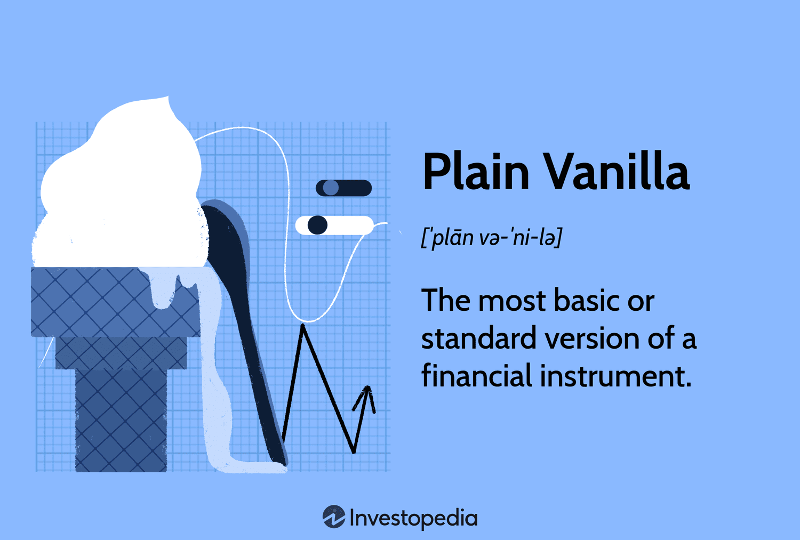

## Table of Contents

## What is a plain vanilla bond?

A plain vanilla bond is a simple type of bond that doesn't have any special features. It's like the basic version of a bond. When you buy a plain vanilla bond, you lend money to the issuer, which could be a government or a company. In return, the issuer promises to pay you back the full amount you lent them, called the principal, on a specific date in the future. They also agree to pay you interest regularly, usually every six months, until that date comes.

These bonds are popular because they are easy to understand and predictable. The interest rate, or coupon rate, stays the same throughout the life of the bond. This means you know exactly how much money you will get and when you will get it. Plain vanilla bonds are a safe choice for people who want a steady income from their investments without taking on too much risk.

## How does a plain vanilla bond differ from other types of bonds?

A plain vanilla bond is different from other types of bonds because it's the simplest kind. It has a fixed interest rate that doesn't change, and it pays back the principal amount when it matures. Other bonds, like zero-coupon bonds, don't pay interest until they mature. Instead, they are sold at a discount and the full value is paid back at the end. Convertible bonds give you the option to turn your bond into shares of the company's stock, which can be good if the company does well.

Then there are callable bonds, which the issuer can decide to pay back before the bond matures. This can be bad for the investor if interest rates go down because they might not get as good a deal on a new bond. Floating rate bonds have interest rates that change based on market rates, so the payments you get can go up or down. Plain vanilla bonds are easier to understand and predict, making them a safer choice for people who want steady income without the extra risks that come with other types of bonds.

## What are the basic features of a plain vanilla bond?

A plain vanilla bond is a basic type of bond that's easy to understand. When you buy one, you're lending money to the issuer, which could be a government or a company. The issuer promises to pay you back the full amount you lent them, called the principal, on a set date in the future. They also agree to pay you interest regularly, usually every six months, until that date arrives. This interest rate, or coupon rate, stays the same the whole time you own the bond.

These bonds are popular because they're predictable. You know exactly how much money you'll get and when you'll get it. This makes them a safe choice for people who want a steady income from their investments without taking on too much risk. Unlike other types of bonds, plain vanilla bonds don't have any special features that could change how much you earn or when you get your money back.

## What are the main benefits of investing in plain vanilla bonds?

Investing in plain vanilla bonds can be a smart choice for people who want a steady and predictable income. These bonds pay a fixed interest rate, so you know exactly how much money you'll get and when you'll get it. This makes them a safe option if you're looking for a reliable way to earn money without taking on too much risk. Plus, because they're simple and easy to understand, you don't need to be an expert to invest in them.

Another benefit of plain vanilla bonds is that they can help you balance out riskier investments in your portfolio. If you have money in stocks or other investments that can go up and down a lot, plain vanilla bonds can provide a stable source of income. This can help you feel more secure, knowing that part of your money is in something that won't change much. Overall, these bonds are a good choice for anyone looking for a straightforward and dependable way to invest their money.

## How do plain vanilla bonds contribute to portfolio diversification?

Plain vanilla bonds help with portfolio diversification because they add a stable and predictable part to your investments. If you have money in stocks or other things that can change a lot in value, adding plain vanilla bonds can balance things out. They pay a fixed interest rate, so you know exactly how much money you'll get and when you'll get it. This can make your overall investment less risky because it's not all going up and down with the market.

By including plain vanilla bonds in your portfolio, you spread out your risk. If the stock market goes down, the bonds will still pay you the same amount of interest. This can help cushion the blow if other parts of your investments lose value. Plus, because these bonds are simple and easy to understand, you don't need to be an expert to use them to make your portfolio more diverse and safer.

## What role do plain vanilla bonds play in risk management?

Plain vanilla bonds help manage risk by adding a stable part to your investments. If you have money in things like stocks that can go up and down a lot, plain vanilla bonds can balance that out. They pay a fixed interest rate, so you know exactly how much money you'll get and when you'll get it. This makes your overall investment less risky because not all of it is changing with the market.

By including plain vanilla bonds in your portfolio, you spread out your risk. If the stock market goes down, the bonds will still pay you the same amount of interest. This can help cushion the blow if other parts of your investments lose value. Plus, because these bonds are simple and easy to understand, you don't need to be an expert to use them to make your investments safer.

## How can plain vanilla bonds be used to generate steady income?

Plain vanilla bonds can be a great way to get steady income. When you buy a plain vanilla bond, you're lending money to a government or a company. They promise to pay you back the full amount you lent them, called the principal, on a certain date in the future. But until that date comes, they also agree to pay you interest regularly, usually every six months. This interest rate, or coupon rate, stays the same the whole time you own the bond. So, you know exactly how much money you'll get and when you'll get it.

This makes plain vanilla bonds a reliable choice for people who want a steady income without taking on too much risk. If you're retired or just looking for a predictable way to earn money, these bonds can help. They're simple and easy to understand, so you don't need to be an expert to invest in them. By adding plain vanilla bonds to your investments, you can have a steady source of income that doesn't change much, even if other parts of your investments go up and down.

## What are the tax implications of investing in plain vanilla bonds?

When you invest in plain vanilla bonds, you need to think about taxes. The interest you get from the bonds is usually taxed as regular income. This means you'll have to pay taxes on that interest every year, just like you do with your salary. The tax rate depends on your income and where you live. If you buy bonds from the government, like U.S. Treasury bonds, the interest might be free from state and local taxes, but you still have to pay federal taxes on it.

When the bond matures and you get your principal back, that part isn't usually taxed. But if you sell the bond before it matures and make a profit, that profit is taxed as a capital gain. The tax rate on capital gains can be different from the tax rate on your regular income. It's a good idea to talk to a tax advisor to understand how investing in plain vanilla bonds will affect your taxes, because the rules can change and everyone's situation is different.

## How does the interest rate environment affect the performance of plain vanilla bonds?

The interest rate environment can really change how well plain vanilla bonds do. When interest rates go up, new bonds start paying more interest. This makes the old bonds you have, which pay less interest, less valuable. People might not want to buy your old bonds because they can get new ones that pay more. So, if you want to sell your old bonds before they mature, you might have to sell them for less money. This is called a decrease in the bond's market value.

On the other hand, when interest rates go down, your old bonds become more valuable. They pay more interest than the new bonds being sold. So, if you want to sell your old bonds, you might be able to sell them for more money. This is because people will want to buy your bonds to get that higher interest rate. But if you keep your bonds until they mature, the interest rate environment doesn't change how much money you get back. You'll still get the same interest payments and the full principal at the end, no matter what happens with interest rates.

## What are the considerations for holding plain vanilla bonds to maturity versus trading them?

When you hold plain vanilla bonds until they mature, you know exactly how much money you'll get and when you'll get it. You'll get regular interest payments, usually every six months, and at the end, you'll get all your money back. This is a good choice if you want a steady income and don't want to worry about the bond's value going up and down. Holding bonds to maturity is safer because you don't have to worry about changes in interest rates affecting how much money you get. It's like having a savings account with a fixed interest rate.

If you decide to trade plain vanilla bonds before they mature, you're taking on more risk. The value of your bonds can change based on what's happening with interest rates. If rates go up, the value of your bonds might go down, and you might have to sell them for less than you paid. But if rates go down, the value of your bonds might go up, and you could sell them for more. Trading bonds can be a way to make more money, but it's not as predictable as holding them to maturity. You need to be ready for the value of your bonds to change and be okay with that risk.

## How do credit ratings impact the yield and risk of plain vanilla bonds?

Credit ratings tell you how likely it is that the issuer of a plain vanilla bond will be able to pay you back. If a bond has a high credit rating, it means the issuer is seen as very reliable and less likely to miss payments or go bankrupt. Because of this, high-rated bonds usually have lower yields. This is because investors don't need as much reward for taking on less risk. So, if you buy a bond with a high credit rating, you might get less interest, but it's a safer investment.

On the other hand, if a bond has a low credit rating, it means there's a higher chance the issuer might not be able to pay you back. To make up for this higher risk, these bonds usually offer higher yields. Investors want more reward for taking on more risk. So, if you buy a bond with a low credit rating, you might get more interest, but there's also a bigger chance you could lose your money if the issuer can't pay. Credit ratings help you understand the balance between risk and reward when you're thinking about buying plain vanilla bonds.

## What advanced strategies can investors use with plain vanilla bonds to optimize returns?

Investors can use a strategy called laddering to optimize returns with plain vanilla bonds. Laddering means buying bonds that mature at different times. For example, you might buy some bonds that mature in one year, some in two years, and some in three years. This way, you get money back at different times, which can help you take advantage of changing interest rates. When a bond matures, you can use the money to buy a new bond with a higher interest rate if rates have gone up. This can help you earn more over time and also gives you more flexibility with your money.

Another strategy is called bond swapping. This means selling one bond and using the money to buy another bond that might offer a better return or fit better with your investment goals. For example, if interest rates go up, you might sell a bond with a lower interest rate and buy a new one with a higher rate. Or, if you think a bond's credit rating might go down, you could sell it and buy a bond with a more stable rating. Bond swapping can help you adjust your portfolio to get the best possible returns while managing risk.

## What are the benefits of fixed-income bond investment?

Fixed-income investments, such as plain vanilla bonds, are highly valued for their ability to provide a stable and reliable income stream. These characteristics make them particularly attractive to retirees and income-focused investors who prioritize predictable cash flows over capital appreciation. Plain vanilla bonds, offering set coupon payments and a defined maturity date, help mitigate the uncertainties often associated with other forms of investment, such as equities.

One of the main advantages of investing in plain vanilla bonds is their predictability. Unlike equities, whose returns can be subject to significant [volatility](/wiki/volatility-trading-strategies) due to fluctuations in market sentiment or economic conditions, plain vanilla bonds offer a fixed income that can be counted on throughout the bond's duration. This characteristic makes them a cornerstone for investors seeking to construct a portfolio with lower volatility and stable returns.

In addition to their predictable income, fixed-income investments can act as a shield against the changing tide of interest rates. In a rising [interest rate](/wiki/interest-rate-trading-strategies) environment, the value of existing bonds typically falls since newer issuances might offer higher coupon rates. However, the certainty that comes with receiving fixed coupon payments regardless of market interest rates provides a sense of security. For investors holding the bonds to maturity, the regular income remains unchanged, and the principal amount is returned in full, assuming no default occurs.

The security provided by plain vanilla bonds is expressed mathematically by their convexity and duration, which measure the bond's sensitivity to interest rate changes. Duration, for instance, acts as an estimate of the bond's price reaction to changes in interest rates:

$$
\Delta P \approx - D \times \Delta y
$$

where $\Delta P$ is the change in price, $D$ is the duration, and $\Delta y$ is the change in yield. Bonds with lower durations are less sensitive to interest rate changes, and plain vanilla bonds typically have moderate duration levels, further ensuring investor confidence in their stability.

In conclusion, fixed-income investments like plain vanilla bonds provide a reliable income stream and an avenue for financial security, especially during periods of economic uncertainty or rising interest rates. Their predictability and reduced volatility make them an essential component of a diversified investment portfolio.

## How do Plain Vanilla Bonds compare to Exotic Bonds?

Plain vanilla bonds and exotic bonds represent two distinct categories of fixed-income securities, each with its own characteristics and risk profiles. Plain vanilla bonds feature fixed coupon rates and predetermined maturity dates. They are designed to provide steady and predictable income streams to investors. The simplicity of these bonds makes them an appealing option for those seeking lower-risk investments.

In contrast, exotic bonds come with additional features that introduce complexity and, potentially, higher returns. These may include variable interest rates, call or put options, and convertibility into equity. Such features provide opportunities for greater yields but also elevate the investment's risk profile. For instance, a convertible bond allows the holder to convert the bond into a specified number of shares of the issuing company, thus exposing the investor to the potential volatility of the equity market.

Another common feature in exotic bonds is the floating interest rate, which adjusts based on benchmark interest rates. While this can be advantageous in a rising rate environment, it also adds an element of uncertainty to the future income stream, making these bonds less predictable than their plain vanilla counterparts. In mathematical terms, the yield of a floating rate bond can be expressed as:

$$
\text{Yield} = \text{Reference Rate} + \text{Spread}
$$

where the reference rate might be an index like LIBOR (London Interbank Offered Rate) and the spread is an additional yield margin.

For many investors, the allure of potential higher returns must be balanced against the increased risk and complexity of exotic bonds. Plain vanilla bonds provide straightforward investment opportunities where expected returns can be calculated with greater certainty. While exotic bonds may suit risk-tolerant investors who understand the nuances of their features, plain vanilla bonds remain the preference for those valuing stability and transparency in their investment strategies.

Overall, the choice between plain vanilla and exotic bonds depends on the investor's risk appetite, investment objectives, and the broader economic environment. For risk-averse individuals and those who favor predictability, plain vanilla bonds often present a more suitable investment option.

## References & Further Reading

[1]: Fabozzi, F. J. (2012). ["Bond Markets, Analysis, and Strategies."](https://books.google.com/books/about/Bond_Markets_Analysis_and_Strategies_ten.html?id=bQpNEAAAQBAJ) Pearson Education.

[2]: Hull, J. C. (2018). ["Options, Futures, and Other Derivatives."](https://www.semanticscholar.org/paper/Options%2C-Futures%2C-and-Other-Derivatives-Hull/89bdee500c8623864fc9eb7a471546aa713acc44) Pearson.

[3]: Lopez de Prado, M. (2018). ["Advances in Financial Machine Learning."](https://www.amazon.com/Advances-Financial-Machine-Learning-Marcos/dp/1119482089) Wiley.

[4]: Aronson, D. R. (2007). ["Evidence-Based Technical Analysis: Applying the Scientific Method and Statistical Inference to Trading Signals."](https://www.amazon.com/Evidence-Based-Technical-Analysis-Scientific-Statistical/dp/0470008741) Wiley.

[5]: Chan, E. P. (2008). ["Quantitative Trading: How to Build Your Own Algorithmic Trading Business."](https://github.com/ftvision/quant_trading_echan_book) Wiley.

[6]: Tuckman, B. (2012). ["Fixed Income Securities: Tools for Today's Markets."](https://www.amazon.com/Fixed-Income-Securities-Todays-Markets/dp/0470891696) Wiley.

[7]: Jansen, S. (2018). ["Machine Learning for Algorithmic Trading."](https://github.com/stefan-jansen/machine-learning-for-trading) Packt Publishing.