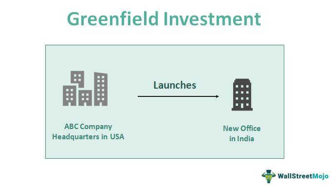

Greenfield investments and algorithmic trading are significant components in the landscape of foreign direct investments (FDI). These investment strategies represent distinct yet interconnected dimensions, each offering opportunities and challenges that merit detailed consideration.

Greenfield investments involve establishing new operations or facilities from the ground up in a foreign location. This approach provides companies with the autonomy to tailor operations, marketing strategies, and product offerings to the specific needs of local markets. By doing so, firms can better align their strategies with corporate objectives and local demand dynamics. However, this method also presents challenges, such as high initial costs and extensive regulatory considerations, particularly in emerging markets where these investments are commonly employed for market penetration.



Conversely, algorithmic trading introduces a sophisticated, data-driven methodology for making strategic investment decisions. Leveraging technological advancements, algorithmic trading analyzes vast amounts of market data, economic indicators, and geopolitical conditions to provide insights into potential investment opportunities. This capability proves invaluable in assessing the viability of greenfield and other investment types, enabling companies to make informed decisions grounded in quantitative analysis.

Combining the autonomy and customization potential of greenfield investments with the analytical precision of algorithmic trading offers a comprehensive framework for navigating the complexities of FDI. This article explores the multifaceted nature of these strategic choices, providing a nuanced perspective on their impacts and relevance in today's global economy.

## Table of Contents

## Understanding Greenfield Investments

Greenfield investments refer to the strategic decision by a company to establish a new facility or business operation from scratch in a foreign country. This mode of foreign direct investment provides the investing company with unparalleled control over its operations, allowing the organization to implement tailored strategies that align with its broader corporate goals. Because of this level of control, companies can ensure that every aspect of the business, from supply chain logistics to human resources practices, reflects their standards and objectives.

The primary motivation for many companies to engage in greenfield investments is market penetration. By entering a new market, especially within emerging economies, companies gain the opportunity to establish a strong presence and brand recognition from the onset. This involves customizing everything from marketing strategies and branding to the products and services offered, ensuring that they are tuned to meet the specific demands and preferences of local consumers.

Establishing operations from the ground up allows businesses to configure their processes to align with local laws, cultural expectations, and economic conditions. For example, supply chains can be optimized to leverage regional resources and distribution networks effectively. This adaptability can significantly enhance competitiveness by producing goods or services that are closely aligned with local consumer needs and market trends.

Moreover, greenfield investments are often accompanied by the opportunity to introduce innovative processes or business models that might not be feasible in an existing establishment. By leveraging cutting-edge technology and novel concepts, companies can potentially revolutionize local markets, providing them a competitive edge over local players.

## Benefits of Greenfield Investments

Greenfield investments offer several compelling benefits that make them attractive to multinational corporations seeking to expand their presence in foreign markets. One of the foremost advantages is the high degree of control they afford investors. Companies undertaking greenfield investments can dictate every aspect of operations and strategy. This includes the design and layout of facilities, hiring policies, and the implementation of corporate processes and protocols. Such control is invaluable for aligning operations with overarching corporate goals and standards, ensuring consistency in quality and brand image across international borders.

Another significant benefit is the ability to tailor marketing strategies and product offerings specifically to the local market. Unlike acquisitions, where existing brand perceptions may impede new strategies, greenfield projects allow companies to build a brand identity from the ground up. This enables them to fine-tune their offerings according to local consumer preferences, cultural nuances, and market dynamics. Consequently, businesses can establish stronger connections with local consumers, which can lead to greater market penetration and customer loyalty.

Moreover, greenfield investments often come with the potential for tax incentives and government support. Many countries, particularly those with emerging economies, actively seek to attract foreign direct investments by offering financial advantages such as tax breaks, subsidies, or reduced land costs. These incentives are designed to create a favorable business environment, enabling companies to reduce initial capital expenditures and improve their return on investment. Governments may also provide support in the form of infrastructure development or simplified regulatory processes, further enhancing the attractiveness of greenfield investment projects.

## Risks of Greenfield Investments

Greenfield investments, while offering significant control and customization, also present several risks that investors must consider. One of the primary challenges is the high initial cost and prolonged setup time associated with building new facilities from the ground up. Unlike acquisitions or joint ventures, greenfield projects require substantial capital expenditures on land, construction, and infrastructure. These financial commitments can be considerable, impacting the [liquidity](/wiki/liquidity-risk-premium) and financial strategy of the investing company. Additionally, the time required to establish operations and achieve operational efficiency can be lengthy, during which businesses may face potential revenue losses and delays.

Furthermore, greenfield investments expose companies to increased political and market risks. Operating in a foreign country means navigating an unfamiliar political landscape, where changes in government, policy, or regulatory environments can significantly impact business operations and profitability. Market risks, including fluctuations in demand, currency exchange rates, and economic stability, can also pose challenges for greenfield ventures. Divesting from these investments can be complex and costly, as the infrastructure and assets are location-specific and may not be easily transferred or sold.

Another critical risk involves regulatory hurdles and the necessity for comprehensive market research before entry. Foreign investments often require compliance with diverse local regulations, ranging from environmental standards to labor laws. Navigating these regulations can require significant legal and operational expertise and might involve unexpected compliance costs. Moreover, to mitigate these risks, companies must undertake thorough market research to understand local consumer behavior, competitive dynamics, and cultural nuances. This research is vital to tailoring operations and strategies to the local context, but it can add to the initial investment burden and delay market entry.

In summary, while greenfield investments can provide strategic advantages, the associated risks highlight the importance of careful planning and thorough analysis. Investors must weigh these factors against their long-term objectives and assess whether the potential rewards justify the inherent risks and costs involved.

## The Role of Algorithmic Trading in Investment Decisions

Algorithmic trading, often referred to as algo trading, represents a sophisticated method of executing orders using pre-programmed trading instructions. These instructions are based on variables such as time, price, [volume](/wiki/volume-trading-strategy), and other mathematical models. In the context of investment decisions, especially concerning greenfield investments, [algorithmic trading](/wiki/algorithmic-trading) offers a methodical, data-driven approach to assess potential opportunities.

The primary advantage of algorithmic trading in evaluating investments is its ability to process vast amounts of data efficiently. Through the analysis of economic indicators, these algorithms can gauge the economic stability and potential growth of target markets. For instance, macroeconomic factors such as GDP growth rates, inflation, and employment levels can be systematically integrated into models to forecast market conditions favorable for greenfield investments.

Additionally, algorithmic trading leverages historical data to discern trends and patterns that can signal potential success or risks. By evaluating past market behaviors, algorithms can provide predictive insights, allowing investors to preemptively identify and mitigate risks associated with new market entries. This capability is particularly beneficial in volatile emerging markets where political and economic landscapes are frequently shifting.

Geopolitical factors also play a critical role in greenfield investment strategies. Algorithmic models can incorporate elements such as regulatory changes, trade policies, and diplomatic relations. By continuously scanning news articles, reports, and social media feeds, sentiment analysis can be performed, offering insights into potential geopolitical disruptions that may affect investment viability.

From a technical perspective, these algorithms can range from simple rule-based systems to complex models utilizing [machine learning](/wiki/machine-learning) techniques like neural networks and natural language processing (NLP). Python, a programming language favored for its versatility and extensive libraries, can be utilized to develop such algorithms. For example:

```python
import pandas as pd
from sklearn.ensemble import RandomForestRegressor

# Load economic indicators and market data
data = pd.read_csv('market_data.csv')

# Features: economic indicators and geopolitical factors
X = data[['gdp_growth', 'inflation', 'employment_rate', 'political_stability']]

# Target variable: success probability of investment
y = data['success_probability']

# Train the model
model = RandomForestRegressor()
model.fit(X, y)

# Predict success probability for new market entry
new_market_data = {'gdp_growth': 3.5, 'inflation': 2.1, 'employment_rate': 95.0, 'political_stability': 0.8}
success_probability = model.predict(pd.DataFrame([new_market_data]))

print(f"Predicted Success Probability: {success_probability[0]}")
```

In conclusion, algorithmic trading is a potent tool for investors focusing on greenfield investments by transforming raw data into actionable insights. Its ability to analyze complex datasets, predict market trends, and consider geopolitical factors enables a more informed and strategic approach to foreign direct investments.

## Conclusion

Greenfield investments and algorithmic trading significantly influence foreign investment strategies. Greenfield investments offer businesses the opportunity to exercise complete control over their operations in new markets, enabling them to tailor their strategies to local demands and regulatory environments. This customized approach can lead to a competitive edge in emerging markets, aligning with corporate growth objectives. However, these investments also present notable challenges. The high upfront costs and extended timeframes required to establish new facilities can strain resources. Additionally, the complexities of navigating political and market risks require careful consideration. 

On the other hand, algorithmic trading empowers investors with advanced data analysis capabilities, enhancing the decision-making process. By evaluating complex datasets on economic indicators, market dynamics, and geopolitical variables, algorithms provide predictive insights that can guide investment choices, including greenfield ventures. This technology offers a strategic advantage in identifying viable opportunities and mitigating risks in foreign investment landscapes.

Ultimately, the choice between greenfield investments and leveraging algorithmic trading requires a strategic balance between the benefits of operational control and the realities of financial and regulatory hurdles. Investors must weigh these factors carefully, understanding that the optimal approach may involve integrating both elements to achieve sustainable growth in foreign markets.

## References & Further Reading

Caves, R. E. (1996). *Multinational Enterprise and Economic Analysis*. Cambridge University Press. This seminal work explores the economic dynamics of multinational enterprises (MNEs), providing a comprehensive framework for understanding their strategies and operations. It highlights the economic rationale behind greenfield investments and other types of foreign direct investments (FDI), aiding in the decision-making process of international businesses.

Lopez de Prado, M. (2018). *Advances in Financial Machine Learning*. Wiley. This book is an essential resource for understanding the innovative applications of machine learning in finance, including algorithmic trading. It covers techniques that can be leveraged to evaluate investment opportunities, optimize trading strategies, and improve the predictive accuracy of financial models, making it particularly relevant for assessing the merits of greenfield investments using data-driven approaches.

Dunning, J. H. (1992). *Multinational Enterprises and the Global Economy*. Addison-Wesley. Dunning's comprehensive examination of the global economy offers valuable insights into the strategies of multinational corporations. It discusses various factors influencing foreign investments, such as the role of technology, market conditions, and geopolitical considerations. This book serves as a critical reference for understanding the broader context within which greenfield investments occur, as well as the impact of algorithmic trading on FDI strategy.

