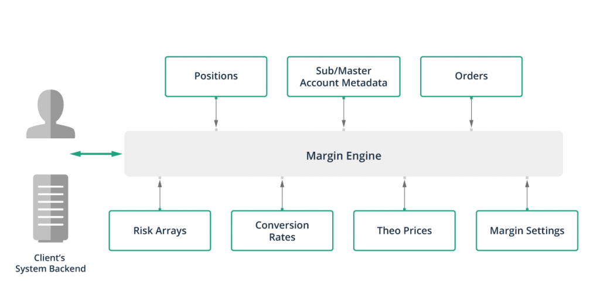

## Table of Contents

## What is the SPAN Margin System?

The SPAN Margin System, or Standard Portfolio Analysis of Risk, is a way that stock exchanges calculate the minimum amount of money that traders need to have in their accounts. This system helps to manage the risk that comes with trading futures and options. Instead of looking at each trade by itself, SPAN looks at all the trades in a portfolio together. This helps to understand the overall risk better and can sometimes lower the amount of money needed as margin.

SPAN works by using computer programs to figure out the possible gains or losses from different market situations. It looks at how prices might change and how that could affect the value of the portfolio. By doing this, SPAN can set a margin requirement that covers the worst possible loss that might happen over a short period, usually one day. This makes trading safer for both the traders and the exchange.

## How does the SPAN Margin System differ from traditional margin systems?

The SPAN Margin System is different from traditional margin systems because it looks at the whole portfolio instead of each trade by itself. Traditional systems usually set a margin for each trade based on how risky that one trade is. But SPAN thinks about how all the trades in a portfolio work together. This can sometimes mean a trader needs less money in their account because the system sees that some trades might balance out the risk of others.

Another big difference is how SPAN uses computer programs to predict possible market changes and figure out the worst-case loss for a portfolio. Traditional systems often use simpler methods, like setting a fixed percentage of the trade value as margin. SPAN's approach can be more accurate because it takes into account many different scenarios and how they might affect the portfolio's value. This makes the margin requirements more tailored to the actual risk involved.

## What are the basic benefits of using the SPAN Margin System for beginners?

For beginners, using the SPAN Margin System can help make trading safer and easier to understand. Instead of worrying about the margin for each trade separately, SPAN looks at all your trades together. This means it can tell if some of your trades might cancel out the risk of others. So, you might need less money in your account than with traditional systems. This can be a big help when you're starting out and don't have a lot of money to put down as margin.

Another benefit is that SPAN uses computers to figure out the worst thing that could happen to your trades in a short time, like one day. This gives beginners a clearer idea of the risks they're taking. Traditional systems might just use a simple rule, like a percentage of the trade value, which doesn't give you as much information. With SPAN, you can feel more confident that you're prepared for possible losses, which can make trading less scary when you're just starting out.

## Can you explain how the SPAN Margin System calculates margin requirements?

The SPAN Margin System calculates margin requirements by looking at all the trades in a trader's portfolio together. It uses computer programs to figure out how much the value of the portfolio might change if the market goes up or down. SPAN looks at different possible market situations, like if prices go up a lot, go down a lot, or stay the same. It then finds the worst-case loss that could happen over a short time, usually one day. This worst-case loss is what the system uses to set the margin requirement.

By doing this, SPAN makes sure that the margin covers the biggest possible loss that could happen to the portfolio. This way, even if the market moves against the trader, there's enough money in their account to handle the loss. This approach is different from traditional systems, which might just take a fixed percentage of each trade's value. SPAN's method is more accurate because it considers how all the trades work together and how they might affect each other.

## What types of financial instruments are compatible with the SPAN Margin System?

The SPAN Margin System is mainly used for futures and options. These are types of financial contracts that let people buy or sell something at a set price in the future. Futures are agreements to buy or sell an asset like a stock or commodity at a specific date, while options give the buyer the right, but not the obligation, to do the same. SPAN looks at how these contracts might change in value and sets the margin based on that.

Besides futures and options, SPAN can also be used for other types of derivatives. Derivatives are financial instruments whose value comes from something else, like stocks or interest rates. This means SPAN can handle a variety of trading products, as long as they are part of a portfolio that can be analyzed for risk. By looking at the whole portfolio, SPAN helps make sure traders have enough money to cover potential losses, no matter what kind of financial instruments they are trading.

## How does the SPAN Margin System help in managing risk?

The SPAN Margin System helps manage risk by looking at all the trades in a trader's portfolio together. Instead of just focusing on each trade by itself, SPAN sees how all the trades might affect each other. This can help traders because some trades might balance out the risk of others. For example, if one trade might lose money if prices go up, another trade might make money if prices go up. By considering this, SPAN can tell traders if they need less money in their account to cover possible losses.

SPAN also uses computers to figure out the worst thing that could happen to the portfolio in a short time, like one day. It looks at different ways the market might change and finds the biggest possible loss. This helps traders know how much money they need to have ready, so they're not caught off guard if the market moves against them. By setting the margin based on this worst-case scenario, SPAN makes sure traders have enough money to handle any losses, which helps keep trading safe and controlled.

## What are the potential cost savings associated with the SPAN Margin System?

The SPAN Margin System can help traders save money by looking at all their trades together instead of one by one. This way, SPAN can see if some trades might cancel out the risk of others. For example, if you have one trade that might lose money if the market goes up, but another trade that might make money if the market goes up, these trades balance each other out. Because of this, SPAN might tell you that you need less money in your account to cover possible losses than you would with traditional systems. This means you can use less of your money as margin, leaving more money free for other trades or investments.

Another way SPAN can save you money is by using computers to figure out the worst thing that could happen to your trades in a short time, usually one day. By looking at many different ways the market might change, SPAN finds the biggest possible loss and sets the margin based on that. This approach is more accurate than just using a simple percentage of each trade's value, which traditional systems might do. Because SPAN's margin requirement is more tailored to the actual risk, you might end up needing less money in your account to trade safely. This can save you money because you're not tying up more cash than you need to.

## How can traders optimize their portfolios using the SPAN Margin System?

Traders can optimize their portfolios using the SPAN Margin System by looking at how all their trades work together. Instead of thinking about each trade by itself, SPAN helps traders see how one trade might help another. For example, if one trade might lose money if the market goes up, but another trade might make money if the market goes up, these trades can balance each other out. By understanding this, traders can put together trades that reduce the overall risk of their portfolio. This can mean they need less money in their account as margin, which frees up more money for other trades or investments.

Another way to optimize a portfolio with SPAN is by using the system's computer programs to predict how the market might change. SPAN looks at many different scenarios to find the worst thing that could happen to the portfolio in a short time, usually one day. By knowing this, traders can adjust their trades to make sure they're ready for the biggest possible loss. This can help them use their money more wisely, making sure they have enough to cover any losses but not more than they need. This careful planning can lead to better use of their trading capital and potentially higher returns.

## What are the advanced features of the SPAN Margin System that experienced traders should know?

Experienced traders should know that the SPAN Margin System has advanced features like scenario analysis, which lets them see how different market changes could affect their whole portfolio. Instead of just guessing what might happen, traders can use SPAN to look at many different situations, like if prices go up a lot, go down a lot, or stay the same. This helps them plan better and make trades that work well together to lower their risk. By understanding these scenarios, traders can make smarter decisions about when to buy or sell and how to balance their portfolio to keep it safe.

Another important feature for experienced traders is how SPAN can handle complex financial instruments like options on futures or multi-leg option strategies. These kinds of trades can be tricky because they depend on many things, like the price of the underlying asset and how much time is left until the option expires. SPAN looks at all these factors together to figure out the margin needed, making sure the trader has enough money to cover any possible losses. This detailed analysis helps experienced traders manage their risk better and take advantage of opportunities in the market that might be too complicated for simpler systems.

## How does the SPAN Margin System integrate with other risk management tools?

The SPAN Margin System works well with other risk management tools by giving a detailed look at the risks in a trader's whole portfolio. For example, it can be used with tools like Value at Risk (VaR), which also tries to guess how much money a trader might lose. SPAN looks at many different ways the market might change and finds the worst thing that could happen to the portfolio in a short time. This information can be used with VaR to make a more complete picture of the risks a trader faces. By using both SPAN and VaR together, traders can understand their risks better and make smarter choices about how to manage their money.

Another way SPAN integrates with other tools is by working with stress testing. Stress testing is when traders try to see what would happen to their portfolio if the market did something really bad, like a big crash. SPAN's computer programs can help with this by showing how the portfolio might react to these extreme situations. Traders can then use this information along with stress test results to plan for the worst and make sure they have enough money to cover any losses. This combination of SPAN and stress testing helps traders be ready for anything the market might throw at them.

## What are the regulatory considerations when using the SPAN Margin System?

When using the SPAN Margin System, traders need to follow the rules set by financial regulators. These rules are there to make sure that trading is safe and fair for everyone. Different countries might have different rules, but they usually want to make sure that traders have enough money in their accounts to cover possible losses. Regulators might check that the SPAN system is being used correctly and that it's setting the right margin amounts. They might also want to see that traders are not taking too much risk, which could hurt the market or other traders.

Regulators might also look at how the SPAN system is set up and used by exchanges. They could check the computer programs that SPAN uses to make sure they are working right and not making mistakes. If there are any problems, regulators might ask for changes to be made. This helps keep the system reliable and trustworthy. By following these rules, traders can use the SPAN Margin System in a way that keeps the market safe and helps them manage their risks better.

## Can you discuss case studies or real-world examples where the SPAN Margin System significantly benefited traders or firms?

One real-world example where the SPAN Margin System benefited traders is at the Chicago Mercantile Exchange (CME). A large hedge fund used SPAN to manage their futures and options portfolio. They found that by using SPAN, they could see how all their trades worked together, which helped them lower their margin requirements. Instead of needing a lot of money tied up in each trade, they could use less money overall. This freed up capital that they could use for other investments, leading to better returns for the fund. The detailed analysis provided by SPAN helped them make smarter trading decisions and manage their risks better.

Another example comes from a smaller trading firm that started using SPAN at the National Stock Exchange of India (NSE). Before using SPAN, they struggled with high margin requirements that limited their ability to trade more actively. After switching to SPAN, they were able to see how their portfolio's risk changed with different market scenarios. This allowed them to balance their trades in a way that reduced the overall risk and lowered their margin needs. With the extra money they saved on margins, the firm was able to increase their trading volume and take advantage of more market opportunities, which led to increased profits.

## References & Further Reading

[1]: Duffy, D. J. (2011). ["Financial Instrument Pricing Using C++."](https://onlinelibrary.wiley.com/doi/book/10.1002/9781119170518) John Wiley & Sons.

[2]: Jarrow, R. A., & Turnbull, S. M. (2000). ["Derivatives Securities."](https://archive.org/details/derivativesecuri0000jarr) South-Western College Publishing.

[3]: Black, F., & Scholes, M. (1973). ["The Pricing of Options and Corporate Liabilities."](https://www.cs.princeton.edu/courses/archive/fall09/cos323/papers/black_scholes73.pdf) The Journal of Political Economy, 81(3), 637-654.

[4]: Chance, D. M., & Brooks, R. (2015). ["An Introduction to Derivatives and Risk Management."](https://books.google.com/books/about/Introduction_to_Derivatives_and_Risk_Man.html?id=b8PgBQAAQBAJ) Cengage Learning.

[5]: Hull, J. C. (2014). ["Options, Futures, and Other Derivatives."](https://elibrary.pearson.de/book/99.150005/9781292410623) Pearson Education.