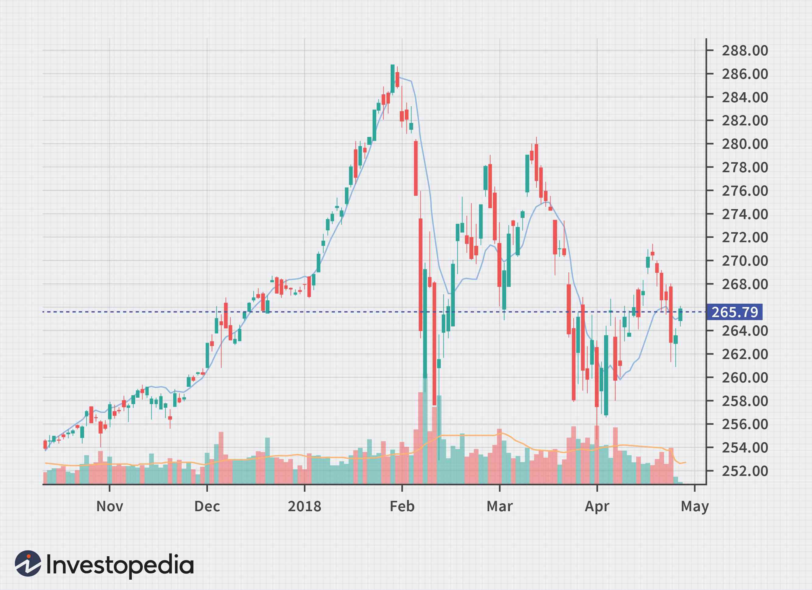

In trading, technical analysis tools are essential for traders looking to identify trends and make informed decisions. These tools facilitate a deeper understanding of market movements and help anticipate future price directions. Among various technical indicators, the Triple Exponential Moving Average (TRIX) serves as a powerful instrument in both identifying market trends and providing momentum signals.

TRIX is valued for its ability to filter out market noise, which often complicates the accurate assessment of asset trends. By applying triple exponential smoothing, TRIX presents a more refined view of an asset's price movements. This characteristic makes it particularly useful in distinguishing meaningful market trends from irrelevant price fluctuations. As its name suggests, TRIX involves the calculation of a triple-smoothed exponential moving average, which enhances its effectiveness in delivering insights into market momentum.



Moreover, TRIX is advantageous not only for its noise-filtering capabilities but also for its potential as a leading indicator. Many traditional indicators tend to lag behind market movements, making them less effective for timely decision-making. In contrast, TRIX's design allows traders to anticipate shifts before they become evident in raw price data, providing an edge in the fast-paced trading environment.

Additionally, TRIX finds significant application in algorithmic trading, where precision and speed are paramount. By integrating TRIX into trading algorithms, traders can automate the process of identifying pivotal market moments, thereby executing trades with enhanced accuracy and efficiency.

This article examines the TRIX indicator, offering insights into its features, benefits, and utilization in algorithmic trading.

## Table of Contents

## Understanding TRIX: The Basics

The Triple Exponential Moving Average (TRIX) is a widely recognized oscillator employed in technical analysis to pinpoint overbought and oversold market conditions. Its primary purpose is to assist traders in making informed decisions by filtering out extraneous market noise and enhancing the visibility of significant trends. TRIX was developed by Jack Hutson and has gained popularity for its ability to provide insights into market momentum.

The fundamental concept behind TRIX is smoothing a moving average exponentially over three iterations. This process significantly reduces minor price fluctuations, which are often misleading, and instead emphasizes the underlying trend. Mathematically, TRIX is calculated by measuring the percentage change between the present and previous values of a triple-smoothed exponential moving average.

To elaborate, the smoothing process involves computing a single exponential moving average (EMA) of price data over a specified period. The resulting EMA is then subjected to another EMA calculation, known as the double EMA. Finally, a third EMA is applied to this double EMA, resulting in the triple EMA that forms the backbone of the TRIX oscillator. The mathematical representation can be summarized as follows, where $\text{EMA}_n$ denotes the exponential moving average over $n$ periods:

1. Calculate the first EMA: 
$$
   \text{First EMA} = \text{EMA}_n(\text{Price})

$$
2. Calculate the second EMA using the first EMA:
$$
   \text{Second EMA} = \text{EMA}_n(\text{First EMA})

$$
3. Calculate the third EMA using the second EMA:
$$
   \text{Third EMA} = \text{EMA}_n(\text{Second EMA})

$$

The core TRIX value is derived by calculating the percentage rate of change between the current and previous triple EMAs:
$$
\text{TRIX} = \left( \frac{\text{Third EMA}_{\text{current}} - \text{Third EMA}_{\text{previous}}}{\text{Third EMA}_{\text{previous}}} \right) \times 100
$$

Through this methodology, TRIX serves as an effective tool for traders, offering clear insights into market [momentum](/wiki/momentum) without the distraction of short-term price movements that can lead to premature or erroneous trading decisions. Its adeptness at recognizing genuine market trends makes it a preferred choice for traders looking to enhance their technical analysis toolkit.

## How TRIX is Calculated

The calculation of the Triple Exponential Moving Average (TRIX) involves a series of exponential moving averages (EMAs) that smooth the asset's closing prices, providing a clearer picture of market momentum by eliminating short-term fluctuations. 

1. **First Step - Initial EMA Calculation**: Begin by calculating an exponential moving average (EMA) of the asset's closing prices over a chosen period. The formula for calculating the EMA is:
$$
   \text{EMA}_n = \left( \frac{p - \text{EMA}_{\text{prev}}}{n+1} \right) + \text{EMA}_{\text{prev}}

$$

   where $p$ is the current closing price, and $n$ is the number of periods. $\text{EMA}_{\text{prev}}$ is the EMA value calculated for the previous period.

2. **Second Step - Double EMA (DEMA)**: Apply the EMA calculation again to the result of the first EMA. This second smoothing further reduces noise and stabilizes the data.
$$
   \text{DEMA}_n = \text{EMA of } \text{EMA}_n

$$

3. **Third Step - Triple EMA (TEMA)**: Perform a third EMA calculation on the DEMA, resulting in a triple smoothed value.
$$
   \text{TEMA}_n = \text{EMA of } \text{DEMA}_n

$$

4. **Final Step - TRIX Calculation**: Calculate the percentage rate of change of the TEMA values. The resulting TRIX value is given by:
$$
   \text{TRIX}_n = \left( \frac{\text{TEMA}_n - \text{TEMA}_{n-1}}{\text{TEMA}_{n-1}} \right) \times 100

$$

This sequence of exponential smoothing serves to filter out minor market oscillations, generating a more reliable signal that reflects more significant trends. The percentage change between consecutive TEMA values provides a momentum indicator, aiding traders in identifying potential reversal or continuation signals in the market. 

For practitioners looking to automate the TRIX calculation using Python, the process can be implemented efficiently using libraries like pandas. Here is an example code snippet:

```python
import pandas as pd

def calculate_trix(prices, period):
    ema1 = prices.ewm(span=period, adjust=False).mean()
    ema2 = ema1.ewm(span=period, adjust=False).mean()
    ema3 = ema2.ewm(span=period, adjust=False).mean()
    trix = 100 * ((ema3 - ema3.shift(1)) / ema3.shift(1))
    return trix

# Example usage:
# prices = pd.Series([...])  # Replace with actual closing price data
# period = 15  # Example period for EMA calculation
# trix_values = calculate_trix(prices, period)
```

This code calculates the TRIX values using pandas' exponential weighted function, offering a streamlined approach suitable for large datasets common in financial data analysis.

## Interpreting TRIX Signals

TRIX values oscillate around a zero line, serving as indicators of market momentum. Positive TRIX values indicate an upward momentum, while negative values suggest a downward momentum. The primary signals derived from TRIX center on crossovers relative to the zero line. A crossover above this line is generally interpreted as a buy signal, suggesting that momentum is shifting upwards and the asset could be entering a bullish trend. Conversely, a crossover below the zero line typically indicates a sell signal, hinting at the potential onset of a bearish trend.

To enhance the reliability of these signals, traders often use a TRIX signal line. This line is typically a moving average of the TRIX itself, which serves to smooth variations and reinforce trend confirmations. This combination allows traders to identify potential reversals and confirm trends more accurately. For example, if the TRIX line crosses above its signal line, it may provide additional confirmation of an upward trend, beyond a simple crossover of the zero line.

The formula for calculating the crossover signals involves extrapolating the points at which the TRIX line intersects both the zero line and the TRIX signal line. Traders can automate this process using algorithms, often employing programming languages like Python for real-time analysis. Here's a basic example of how a TRIX signal might be calculated programmatically:

```python
import pandas as pd

def calculate_trix(data, n):
    ema1 = data['Close'].ewm(span=n, adjust=False).mean()
    ema2 = ema1.ewm(span=n, adjust=False).mean()
    ema3 = ema2.ewm(span=n, adjust=False).mean()
    trix = 100 * (ema3.diff() / ema3.shift(1))
    return trix

def calculate_signal(trix, signal_period):
    return trix.ewm(span=signal_period, adjust=False).mean()

# Example usage:
data = pd.DataFrame({'Close': [ /* insert closing prices here */ ]})
trix = calculate_trix(data, n=14)
signal_line = calculate_signal(trix, signal_period=9)

# Identifying buy and sell signals
buy_signals = (trix > 0) & (trix > signal_line)
sell_signals = (trix < 0) & (trix < signal_line)
```

In practice, traders use these signals to make informed decisions regarding entry and [exit](/wiki/exit-strategy) points in the market. They can also adjust the moving average periods to tailor the sensitivity of the TRIX to specific trading strategies or market conditions.

## Advantages of Using TRIX

The Triple Exponential Moving Average (TRIX) offers several noteworthy advantages, contributing to its popularity among traders. A primary benefit is its ability to filter out market noise through the process of triple smoothing. This method involves using exponential moving averages (EMAs) calculated sequentially—initially on the raw price data, then on the first EMA, and finally on the second EMA. By smoothing the data in this manner, TRIX reduces the impact of minor price fluctuations that might otherwise trigger premature trading signals, thus providing a clearer view of the overall trend and aiding traders in avoiding unnecessary actions.

Moreover, TRIX distinguishes itself from many other indicators by often functioning as a leading indicator of market trends, rather than a lagging one. Lagging indicators, by their nature, tend to confirm trends only after they have begun, potentially delaying traders' reaction times. Conversely, TRIX can provide timely insights into potential trend reversals or continuations, since it measures the rate of change in the triple-smoothed EMA. This characteristic makes it particularly valuable in volatile markets where swift decision-making is critical.

When used effectively in conjunction with other technical indicators and market timing tools, TRIX enhances its predictive power and reduces the likelihood of false signals. Traders often pair TRIX with complementary tools like the Relative Strength Index (RSI) or Moving Average Convergence Divergence (MACD) to cross-verify signals and improve accuracy. This combinatorial approach allows for a more robust analysis, increasing the potential for successful trading outcomes.

Overall, TRIX's ability to provide clear, advanced signals while mitigating noise and false positives is a substantial advantage, particularly for those engaging in both manual and [algorithmic trading](/wiki/algorithmic-trading) strategies.

## TRIX in Algorithmic Trading

In algorithmic trading, the Triple Exponential Moving Average (TRIX) serves as an effective tool due to its capacity to identify significant market movements with precision. The TRIX, being a momentum oscillator, aids traders by automatically executing its calculations, thereby enabling real-time decision-making which is essential in the fast-paced trading environment.

The advantage of automating TRIX in trading algorithms lies in its formula, which involves computing multiple layers of exponential moving averages (EMAs). For illustrative purposes, a Python function can be constructed to demonstrate TRIX calculation:

```python
import pandas as pd

def calculate_trix(prices, period):
    # Calculate first EMA
    ema1 = prices.ewm(span=period, adjust=False).mean()
    # Calculate second EMA from the first EMA
    ema2 = ema1.ewm(span=period, adjust=False).mean()
    # Calculate third EMA from the second EMA
    ema3 = ema2.ewm(span=period, adjust=False).mean()
    # Calculate TRIX values
    trix = ema3.pct_change() * 100
    return trix

# Example usage with closing prices and a period of 15 days
closing_prices = pd.Series([...])  # Insert closing price data here
trix_values = calculate_trix(closing_prices, 15)
```

Through this operational flow, algorithmic trading systems can activate TRIX's momentum signaling capabilities. TRIX identifies the percentage change between current and prior triple Emas, resulting in positive or negative values that oscillate around zero. These TRIX values indicate upward or downward momentum, guiding trade execution with efficiency.

Furthermore, TRIX's ability to smooth out market noise through its triple-smoothing process reduces reaction to minor price fluctuations. This makes TRIX especially beneficial in developing trading algorithms that focus on capitalizing on meaningful market trends while minimizing the occurrence of false signals.

The utility of TRIX in algorithmic routines exemplifies its value as part of more complex automated strategies, enabling traders to enhance their trading efficiency and potentially improving profitability.

## Case Studies and Practical Examples

Examining real-world examples demonstrates how TRIX can be applied to various market conditions. Historical data from major indices, such as the Dow Jones Industrial Average (DJIA), provides valuable insights into the effectiveness of the TRIX indicator in identifying market trends and momentum shifts.

**Historical Analysis with Dow Jones**

Consider the historical performance of the DJIA during significant periods of economic change. By analyzing TRIX values alongside DJIA price movements, traders can observe how TRIX signals potential trend reversals and momentum shifts. For instance, during a period of economic recovery, a rising TRIX value crossing above the zero line would suggest a strengthening upward momentum, providing a buy signal. Conversely, a falling TRIX value crossing below zero during a market downturn would indicate diminishing momentum, suggesting a sell signal.

To illustrate these concepts, a practical examination can be conducted using historical DJIA data. The following Python snippet demonstrates how TRIX calculation can be implemented and visualized:

```python
import pandas as pd
import numpy as np
import matplotlib.pyplot as plt

def calculate_ema(series, period):
    return series.ewm(span=period, adjust=False).mean()

def calculate_trix(data, period):
    ema1 = calculate_ema(data['Close'], period)
    ema2 = calculate_ema(ema1, period)
    ema3 = calculate_ema(ema2, period)
    trix = 100 * (ema3 - ema3.shift(1)) / ema3.shift(1)
    return trix

# Load your historical DJIA data into a DataFrame
data = pd.read_csv('djia.csv')

# Calculate TRIX with a typical period of 15 days
data['TRIX'] = calculate_trix(data, 15)

# Plotting
plt.figure(figsize=(14,7))
plt.title('DJIA Closing Prices and TRIX Indicator')
plt.plot(data['Date'], data['Close'], label='DJIA Closing Prices')
plt.plot(data['Date'], data['TRIX'], label='TRIX', color='orange')
plt.axhline(0, color='gray', linestyle='--', linewidth=1)
plt.legend()
plt.show()
```

In this example, a 15-day TRIX is calculated for the DJIA closing prices. The plotted results illustrate how TRIX responds to changes in market momentum, providing traders with visually accessible insights into potential market movements.

**Application in Diverse Market Conditions**

TRIX's utility is not limited to indices like the DJIA; its applicability extends across different asset classes and market conditions. For example, in volatile markets, TRIX's ability to filter noise enables traders to focus on significant trends, making it a valuable asset for trading equities, commodities, and [forex](/wiki/forex-system).

In practical trading environments, TRIX can be combined with other technical analysis tools to enhance trading strategies. By doing so, traders can confirm signals and reduce the likelihood of false positives, further demonstrating the indicator's reliability and practicality.

## Conclusion

The Triple Exponential Moving Average (TRIX) serves as a crucial tool for traders aiming to understand market trends and momentum. Its unique capability to filter out market noise through triple exponential smoothing makes it highly effective in providing clear and actionable insights. By eliminating minor price fluctuations, TRIX allows traders to focus on significant trends, reducing the likelihood of false signals that can disrupt trading strategies.

As a leading indicator, TRIX offers timely signals that are invaluable in both manual and automated trading strategies. Its ability to forecast market movements before they unfold provides traders with a strategic advantage, enabling them to make informed decisions ahead of the curve. This foresight is particularly beneficial in fast-paced trading environments, where timely decision-making can significantly impact outcomes.

Incorporating TRIX into trading analyses enhances the decision-making process by offering a clearer perspective on market conditions. For manual traders, TRIX can be used to confirm trends and signals from other indicators, while algorithmic traders can automate its calculations for real-time actionable insights. By leveraging TRIX, traders can improve their trading success rates, as it helps in identifying key entry and exit points with greater precision.

In conclusion, the TRIX indicator not only serves as a valuable tool for interpreting market trends but also plays an essential role in refining trading strategies. Whether used in isolation or conjunction with other indicators, TRIX's ability to act as a leading indicator makes it a preferred choice for traders seeking to optimize their trading performance.

## References & Further Reading

[1]: Aronson, D. R. (2007). ["Evidence-Based Technical Analysis: Applying the Scientific Method and Statistical Inference to Trading Signals"](https://onlinelibrary.wiley.com/doi/book/10.1002/9781118268315). Wiley.

[2]: Chan, E. P. (2008). ["Quantitative Trading: How to Build Your Own Algorithmic Trading Business"](https://github.com/ftvision/quant_trading_echan_book). Wiley.

[3]: Jansen, S. ([2020]). ["Machine Learning for Algorithmic Trading"](https://github.com/stefan-jansen/machine-learning-for-trading). Packt Publishing.

[4]: Lopez de Prado, M. (2018). ["Advances in Financial Machine Learning"](https://www.amazon.com/Advances-Financial-Machine-Learning-Marcos/dp/1119482089). Wiley.

[5]: Murphy, J. J. (1999). ["Technical Analysis of the Financial Markets: A Comprehensive Guide to Trading Methods and Applications"](https://archive.org/details/technicalanalysi0000murp). New York Institute of Finance.