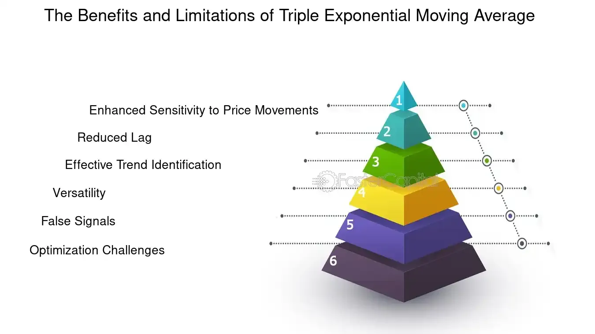

## Table of Contents

## What is a Triple Exponential Moving Average (TEMA)?

A Triple Exponential Moving Average (TEMA) is a type of moving average that helps smooth out price data over time. It is more responsive to price changes than a simple moving average because it uses three layers of exponential moving averages. This makes TEMA useful for traders who want to see trends more quickly and accurately.

TEMA works by first calculating a single exponential moving average (EMA) of the price data. Then, it calculates an EMA of that first EMA, and finally, it calculates an EMA of the second EMA. By combining these three EMAs, TEMA reduces the lag that is common in other types of moving averages, making it a popular choice for technical analysis in trading.

## How does TEMA differ from Simple Moving Average (SMA) and Exponential Moving Average (EMA)?

TEMA, or Triple Exponential Moving Average, is different from a Simple Moving Average (SMA) and an Exponential Moving Average (EMA) because it uses three layers of calculations instead of just one or two. An SMA calculates the average price over a specific period, giving equal weight to each price point. This makes it slower to respond to new price changes. An EMA, on the other hand, puts more weight on recent prices, making it quicker to react to new data compared to an SMA. But TEMA goes even further by using three EMAs, which makes it even faster and more sensitive to price changes than both SMA and EMA.

The main advantage of TEMA over SMA and EMA is that it reduces the lag time in responding to price movements. While an SMA might take longer to show a trend change because it equally considers all data points within its period, and an EMA improves on this by focusing more on recent data, TEMA combines multiple EMAs to further minimize the delay. This makes TEMA particularly useful for traders who need to identify trends as quickly as possible. However, because TEMA is more sensitive, it can also produce more false signals compared to SMA and EMA, so it's important to use it carefully.

## What are the basic steps to calculate a TEMA?

To calculate a Triple Exponential Moving Average (TEMA), you first need to understand how to calculate an Exponential Moving Average (EMA). Start with a set period, like 10 days. Calculate the first EMA of the price data over this period. The formula for the first EMA is: EMA1 = (Price * (2 / (Period + 1))) + (Previous EMA * (1 - (2 / (Period + 1)))). If you don't have a previous EMA, you can use an SMA of the same period as the first EMA value.

Next, you calculate a second EMA using the same period, but this time you use the first EMA values as your data points. This gives you EMA2. Then, you calculate a third EMA, again using the same period, but this time you use the second EMA values as your data points. This gives you EMA3. Finally, to get the TEMA, you use the formula: TEMA = (3 * EMA1) - (3 * EMA2) + EMA3. This final step combines the three EMAs to create a TEMA that is more responsive to price changes than a single EMA or SMA.

## Why might a trader prefer using TEMA over other moving averages?

A trader might prefer using TEMA over other moving averages because it reacts faster to price changes. TEMA uses three layers of calculations, which makes it more sensitive than a Simple Moving Average (SMA) or a single Exponential Moving Average (EMA). This means that when the price of a stock or any other asset starts to move, TEMA will show the trend change more quickly. For traders who need to make quick decisions, this can be a big advantage.

However, TEMA's sensitivity can also be a downside. Because it reacts so quickly, it might give false signals more often than slower moving averages like SMA or EMA. This means traders need to be careful and maybe use other tools along with TEMA to make sure they're not acting on a false signal. But for those who can handle the extra signals and want to catch trends as early as possible, TEMA can be a very useful tool.

## Can you explain how TEMA reduces lag compared to other moving averages?

TEMA reduces lag compared to other moving averages because it uses three layers of calculations instead of just one or two. A Simple Moving Average (SMA) looks at the average price over a set period, but it treats every price the same, so it's slow to show changes. An Exponential Moving Average (EMA) is better because it puts more focus on recent prices, but it still has some delay. TEMA goes further by combining three EMAs, which makes it even faster at showing when prices are changing.

By using three EMAs, TEMA smooths out the data in a way that reduces the time it takes to see a trend. Think of it like this: if you're watching a race, an SMA is like looking at the average position of the runners over the last lap, an EMA is like focusing more on where the runners are right now, and TEMA is like using a special camera that shows you the runners' movements even quicker. This makes TEMA really helpful for traders who need to spot trends as soon as they start, even if it might also show some false signals because it's so sensitive.

## What are the common time periods used for TEMA in trading?

Traders often use different time periods for TEMA depending on what they are looking for. For short-term trading, like [day trading](/wiki/day-trading-spy), a common time period for TEMA is around 5 to 10 days. This shorter period makes the TEMA more sensitive to quick changes in price, which is what day traders need to make fast decisions.

For longer-term trading, like swing trading or investing, traders might use a TEMA with a time period of 20 to 50 days. This longer period makes the TEMA less sensitive to small price changes and more focused on bigger trends over time. It helps traders who want to hold onto their investments for weeks or months to see the overall direction of the market.

## How can TEMA be used to identify market trends?

Traders use TEMA to spot trends in the market by watching how the TEMA line moves over time. If the TEMA line is going up, it means the market might be starting a new upward trend. This can be a signal for traders to buy. On the other hand, if the TEMA line is going down, it could mean the market is starting a downward trend, and traders might want to sell or stay away from buying.

Because TEMA is very quick to show changes, it's good at catching trends early. But it can also give wrong signals sometimes, so traders often use TEMA along with other tools. For example, they might look at other moving averages or use special charts to make sure the trend they see with TEMA is real. This helps them make better decisions about when to buy or sell.

## What are the potential pitfalls or limitations of using TEMA?

One big problem with using TEMA is that it can be too sensitive. Because it reacts so fast to price changes, it might show you a trend that isn't really there. This can trick you into making a trade based on a false signal. If you buy or sell too soon because of a quick change in the TEMA line, you might end up losing money if the market goes the other way.

Another issue is that TEMA can be hard to use by itself. It's best when you use it with other tools, like other moving averages or special charts. If you don't, you might miss important signs that the market is doing something different from what TEMA is showing. So, while TEMA is great for catching trends early, you need to be careful and use it along with other ways to look at the market to make the best choices.

## How can TEMA be integrated into a trading strategy?

Traders can use TEMA in their trading strategy by watching how the TEMA line moves to spot trends early. If the TEMA line starts going up, it could mean the market is starting to go up too, and that might be a good time to buy. If the TEMA line goes down, it might mean the market is going down, and that could be a sign to sell or not buy. But because TEMA can be too sensitive and show false signals, traders should use it with other tools. They might look at other moving averages, like a longer-term SMA or EMA, to see if the trend TEMA shows is real. This helps them make better choices about when to trade.

Another way to use TEMA is to set up trading rules based on how the TEMA line crosses other lines. For example, a trader might decide to buy when the TEMA line crosses above a longer-term moving average, like a 50-day SMA. They might decide to sell when the TEMA line crosses below that same moving average. This kind of rule can help take some of the guesswork out of trading. But traders need to remember that TEMA can give false signals, so they should always check other signs in the market before making a big move. Using TEMA with other tools and setting clear rules can make it a useful part of a trading strategy.

## Can TEMA be used effectively in different markets, such as stocks, forex, and commodities?

Yes, TEMA can be used effectively in different markets like stocks, [forex](/wiki/forex-system), and commodities. It helps traders spot trends early in all these markets because it reacts quickly to price changes. For example, in the stock market, a trader might use TEMA to see if a stock is starting to go up or down. In the forex market, where currencies are traded, TEMA can help spot trends in currency pairs. And in the commodities market, like trading oil or gold, TEMA can show when prices are starting to move in a new direction.

But, it's important to remember that TEMA can be too sensitive and might show false signals. This means traders need to be careful and use other tools along with TEMA to make sure the trends they see are real. In stocks, a trader might use TEMA with a longer-term moving average to check the trend. In forex, they might look at other indicators like the Relative Strength Index (RSI) to confirm what TEMA is showing. And in commodities, they might use charts or other moving averages to make sure the trend TEMA shows is not just a quick change that will go back the other way.

## What are some advanced techniques for optimizing TEMA parameters?

One way to make TEMA work better is by changing its time period to fit the market you're trading in. If you're trading stocks and want to catch quick changes, you might use a shorter time period like 5 or 10 days. But if you're trading commodities and want to see bigger trends over time, you might use a longer time period like 20 or 50 days. You can try different time periods to see which one helps you spot trends the best without getting too many false signals.

Another way to improve TEMA is by using it with other tools. For example, you can use TEMA with a longer-term moving average like a 50-day SMA. When the TEMA line crosses above the SMA, it might be a good time to buy. When it crosses below, it might be a good time to sell. You can also use other indicators like the Relative Strength Index (RSI) to check if the trend TEMA shows is real. By combining TEMA with other tools, you can make better trading choices and avoid getting tricked by false signals.

## How does TEMA perform during high volatility periods compared to other indicators?

During times when the market is moving a lot, TEMA can be really useful because it catches changes in price quickly. Because TEMA uses three layers of calculations, it can show you new trends faster than other moving averages like SMA or EMA. This can be a big help for traders who need to make quick decisions during high [volatility](/wiki/volatility-trading-strategies). But, because TEMA is so sensitive, it might also show you false signals more often. So, you need to be careful and use other tools to make sure the trends you see with TEMA are real.

In comparison, other indicators like the Simple Moving Average (SMA) and the Exponential Moving Average (EMA) might not be as quick to show you what's happening during high volatility. SMA is slow because it looks at the average of all prices over a set time, which can make it hard to spot quick changes. EMA is better because it focuses more on recent prices, but it can still be slower than TEMA. Also, indicators like the Relative Strength Index (RSI) can help you see if a market is overbought or oversold, which can be useful during high volatility, but they don't show you trends as clearly as TEMA does. So, while TEMA can be great for spotting trends fast, you need to use it carefully along with other tools to make the best trading choices during high volatility.

## What are the basics of understanding TRIX?

The Triple Exponential Moving Average (TRIX) is a widely recognized oscillator employed in technical analysis to pinpoint overbought and oversold market conditions. Its primary purpose is to assist traders in making informed decisions by filtering out extraneous market noise and enhancing the visibility of significant trends. TRIX was developed by Jack Hutson and has gained popularity for its ability to provide insights into market momentum.

The fundamental concept behind TRIX is smoothing a moving average exponentially over three iterations. This process significantly reduces minor price fluctuations, which are often misleading, and instead emphasizes the underlying trend. Mathematically, TRIX is calculated by measuring the percentage change between the present and previous values of a triple-smoothed exponential moving average.

To elaborate, the smoothing process involves computing a single exponential moving average (EMA) of price data over a specified period. The resulting EMA is then subjected to another EMA calculation, known as the double EMA. Finally, a third EMA is applied to this double EMA, resulting in the triple EMA that forms the backbone of the TRIX oscillator. The mathematical representation can be summarized as follows, where $\text{EMA}_n$ denotes the exponential moving average over $n$ periods:

1. Calculate the first EMA: 
$$
   \text{First EMA} = \text{EMA}_n(\text{Price})

$$
2. Calculate the second EMA using the first EMA:
$$
   \text{Second EMA} = \text{EMA}_n(\text{First EMA})

$$
3. Calculate the third EMA using the second EMA:
$$
   \text{Third EMA} = \text{EMA}_n(\text{Second EMA})

$$

The core TRIX value is derived by calculating the percentage rate of change between the current and previous triple EMAs:
$$
\text{TRIX} = \left( \frac{\text{Third EMA}_{\text{current}} - \text{Third EMA}_{\text{previous}}}{\text{Third EMA}_{\text{previous}}} \right) \times 100
$$

Through this methodology, TRIX serves as an effective tool for traders, offering clear insights into market [momentum](/wiki/momentum) without the distraction of short-term price movements that can lead to premature or erroneous trading decisions. Its adeptness at recognizing genuine market trends makes it a preferred choice for traders looking to enhance their technical analysis toolkit.

## How is TRIX calculated?

The calculation of the Triple Exponential Moving Average (TRIX) involves a series of exponential moving averages (EMAs) that smooth the asset's closing prices, providing a clearer picture of market momentum by eliminating short-term fluctuations. 

1. **First Step - Initial EMA Calculation**: Begin by calculating an exponential moving average (EMA) of the asset's closing prices over a chosen period. The formula for calculating the EMA is:
$$
   \text{EMA}_n = \left( \frac{p - \text{EMA}_{\text{prev}}}{n+1} \right) + \text{EMA}_{\text{prev}}

$$

   where $p$ is the current closing price, and $n$ is the number of periods. $\text{EMA}_{\text{prev}}$ is the EMA value calculated for the previous period.

2. **Second Step - Double EMA (DEMA)**: Apply the EMA calculation again to the result of the first EMA. This second smoothing further reduces noise and stabilizes the data.
$$
   \text{DEMA}_n = \text{EMA of } \text{EMA}_n

$$

3. **Third Step - Triple EMA (TEMA)**: Perform a third EMA calculation on the DEMA, resulting in a triple smoothed value.
$$
   \text{TEMA}_n = \text{EMA of } \text{DEMA}_n

$$

4. **Final Step - TRIX Calculation**: Calculate the percentage rate of change of the TEMA values. The resulting TRIX value is given by:
$$
   \text{TRIX}_n = \left( \frac{\text{TEMA}_n - \text{TEMA}_{n-1}}{\text{TEMA}_{n-1}} \right) \times 100

$$

This sequence of exponential smoothing serves to filter out minor market oscillations, generating a more reliable signal that reflects more significant trends. The percentage change between consecutive TEMA values provides a momentum indicator, aiding traders in identifying potential reversal or continuation signals in the market. 

For practitioners looking to automate the TRIX calculation using Python, the process can be implemented efficiently using libraries like pandas. Here is an example code snippet:

```python
import pandas as pd

def calculate_trix(prices, period):
    ema1 = prices.ewm(span=period, adjust=False).mean()
    ema2 = ema1.ewm(span=period, adjust=False).mean()
    ema3 = ema2.ewm(span=period, adjust=False).mean()
    trix = 100 * ((ema3 - ema3.shift(1)) / ema3.shift(1))
    return trix

# Example usage:
# prices = pd.Series([...])  # Replace with actual closing price data
# period = 15  # Example period for EMA calculation
# trix_values = calculate_trix(prices, period)
```

This code calculates the TRIX values using pandas' exponential weighted function, offering a streamlined approach suitable for large datasets common in financial data analysis.

## References & Further Reading

[1]: Aronson, D. R. (2007). ["Evidence-Based Technical Analysis: Applying the Scientific Method and Statistical Inference to Trading Signals"](https://onlinelibrary.wiley.com/doi/book/10.1002/9781118268315). Wiley.

[2]: Chan, E. P. (2008). ["Quantitative Trading: How to Build Your Own Algorithmic Trading Business"](https://github.com/ftvision/quant_trading_echan_book). Wiley.

[3]: Jansen, S. ([2020]). ["Machine Learning for Algorithmic Trading"](https://github.com/stefan-jansen/machine-learning-for-trading). Packt Publishing.

[4]: Lopez de Prado, M. (2018). ["Advances in Financial Machine Learning"](https://www.amazon.com/Advances-Financial-Machine-Learning-Marcos/dp/1119482089). Wiley.

[5]: Murphy, J. J. (1999). ["Technical Analysis of the Financial Markets: A Comprehensive Guide to Trading Methods and Applications"](https://archive.org/details/technicalanalysi0000murp). New York Institute of Finance.