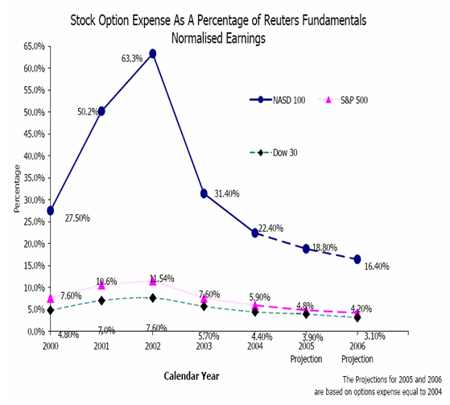

In the fast-evolving landscape of financial trading, stock options and algorithmic trading are increasingly gaining prominence for their ability to enhance investment strategies and unlock financial value. Stock options, as financial derivatives, offer investors the right, but not the obligation, to buy or sell a security at a predetermined price within a specified timeframe. This flexibility provides opportunities for speculative investments and hedging strategies, which can lead to substantial returns and diversified portfolios.

Algorithmic trading, on the other hand, leverages advanced computational algorithms to execute trades based on predetermined criteria like price, timing, and volume. By eliminating emotional biases, algorithmic trading ensures that decisions are data-driven, often resulting in improved trading efficiency and precision. This method is extensively used in high-frequency trading and institutional investing, where speed and accuracy are paramount.



The combined use of stock options and algorithmic trading epitomizes the synergy between these two financial instruments, promising significant advantages for investors. They not only enhance precision in executing trades but also provide a framework for developing strategic, responsive investment approaches that can adapt swiftly to market changes. As we delve into the intricacies of these tools, this article aims to offer a comprehensive guide for investors eager to amplify their financial strategies through technological innovation and advanced trading paradigms.

## Table of Contents

## Understanding Stock Options

Stock options are financial derivatives that grant the holder the right, but not the obligation, to purchase or sell a stock at a predetermined price, known as the strike price, within a specified period. This characteristic makes options versatile instruments in financial markets. Primarily, they are utilized for speculative purposes, allowing investors to bet on the future movement of stock prices with potentially high returns. Additionally, options serve as effective hedging tools, enabling investors to mitigate risk exposure in their portfolios.

The speculative aspect of stock options allows investors to leverage their positions and amplify potential profits. For instance, if an investor anticipates an increase in a stock's price, purchasing a call option could yield substantial gains if the stock price surpasses the strike price. Conversely, put options can be employed to profit from a predicted decline in stock prices.

In terms of hedging, stock options provide a form of insurance against adverse price movements. Investors can use options to protect the value of their assets against potential losses. For example, buying put options on stocks held in a portfolio can limit the downside risk, as the profits from the puts can offset the losses from the declining stock values.

Moreover, the flexibility inherent in stock options allows for a variety of strategic applications that can enhance portfolio diversity. Options can be employed in strategies like straddles and strangles, which involve purchasing both call and put options to capitalize on significant price movements, regardless of direction. This approach can be beneficial during periods of expected [volatility](/wiki/volatility-trading-strategies).

Overall, stock options deliver a strategic advantage by granting investors the ability to tailor their investment approach to suit a wide array of market conditions. Whether the aim is to speculate on stock price movements or to hedge against risks, options provide a mechanism for achieving these financial objectives with greater precision and efficacy.

## Financial Benefits of Stock Options

Stock options are integral tools in the financial markets, offering a blend of flexibility and strategic advantage that can unlock substantial financial benefits for investors. One of the most appealing attributes of stock options is their ability to provide significant returns with a relatively low capital outlay. This is achieved through leverage, where a small initial investment can control a larger position, amplifying potential profits. For instance, purchasing a call option allows an investor to participate in the upside potential of a stock without owning the stock outright, thereby requiring less capital than buying the stock directly.

In terms of strategic flexibility, stock options enable investors to tailor their trading approaches to align with specific market expectations. Investors can craft strategies for bullish, bearish, or neutral markets using a variety of option structures. For example, a bullish investor might use a simple long call strategy, while someone with a bearish outlook might opt for a long put strategy. On the other hand, neutral market conditions can be navigated using strategies like the iron condor or straddle, which profit from stability rather than directional movement.

Another critical advantage of stock options is their capacity to serve as effective hedging instruments. By incorporating options into a diversified portfolio, investors can mitigate potential losses from adverse price movements in the underlying stocks. For example, an investor holding a stock position can purchase put options as insurance against a decline in the stock's price. This reduces the overall market risk, as any losses in the stock can be partially or fully offset by gains in the put options.

Moreover, options can be effectively used in spread strategies to restrict potential loss and profit scenarios within defined bounds, further customizing the risk-return profile of an investment. By employing such strategies, investors can limit their maximum loss to the premium paid for the options, while still maintaining exposure to market movements that can generate returns. This strategic approach enhances the risk management practices within an investor's portfolio.

In summary, stock options provide a versatile framework for investors seeking to optimize their returns and manage risk. Through leverage, strategic flexibility, and hedging capabilities, they offer nuanced control over exposure to market volatility, making them an invaluable component of a sophisticated investor's toolkit.

## Basics of Algorithmic Trading

Algorithmic trading refers to the use of computer algorithms to systematically execute trades within financial markets. These algorithms make decisions based on pre-set criteria, which may include parameters such as price, timing, and [volume](/wiki/volume-trading-strategy). By utilizing algorithms, traders can overcome emotional biases that often affect human decision-making, ensuring that trades are executed based on objective, data-driven criteria. This approach facilitates a high level of precision and can enable faster trades than human traders could achieve on their own.

One significant application of [algorithmic trading](/wiki/algorithmic-trading) is in high-frequency trading ([HFT](/wiki/high-frequency-trading-strategies)), where transactions are conducted at extremely high speeds, often in fractions of a second. These rapid trades are facilitated by the algorithms that continuously scan markets for trading opportunities based on defined parameters. In addition to speed, algorithmic trading systems can handle complex calculations and manage a large volume of trades simultaneously, which is particularly advantageous in high-volume market environments.

Algorithmic trading is also a key component of institutional investing, where large-scale trades are executed by financial institutions such as banks, hedge funds, and pension funds. In this context, algorithms help in achieving execution strategies that minimize market impact and transaction costs, thereby increasing the efficiency and effectiveness of trading strategies.

Beyond execution efficiency, algorithmic trading enhances market efficiency overall by providing [liquidity](/wiki/liquidity-risk-premium). The consistent and predictable participation of algorithms in the market helps stabilize prices by narrowing bid-ask spreads and increasing the depth of the [order book](/wiki/order-book-trading-strategies), making it easier for other market participants to execute their trades.

The use of sophisticated models and programming allows traders to automate decision-making processes. For example, in Python, a basic algorithmic trading strategy can be implemented to identify moving averages:

```python
import pandas as pd

# Load historical stock prices
data = pd.read_csv('stock_data.csv') 
data['Close'] = data['Close'].astype(float)

# Calculate moving averages
data['Short_MA'] = data['Close'].rolling(window=40).mean()
data['Long_MA'] = data['Close'].rolling(window=100).mean()

# Define trading signals
data['Signal'] = 0
data.loc[data['Short_MA'] > data['Long_MA'], 'Signal'] = 1
data.loc[data['Short_MA'] <= data['Long_MA'], 'Signal'] = -1

# Display the data with signals
print(data)
```

This code loads historical stock data, calculates two moving averages, and generates buy or sell signals when the short-term moving average crosses above or below the long-term moving average.

Overall, algorithmic trading represents a shift towards more machine-driven trading processes in financial markets, which broadens the range of possibilities for executing sophisticated trading strategies effectively.

## Advantages of Algorithmic Trading

Algorithmic trading, often known as algo trading or automated trading, provides several advantages that have transformed trading practices, especially in high-frequency domains. One significant advantage is the ability to backtest trading strategies using historical data, which offers traders a statistical edge. Backtesting involves running an algorithm through historical market data to evaluate its feasibility and effectiveness before deploying it in live markets. This process allows traders to validate their strategies against past market conditions and identify potential weaknesses that need adjustment. The capability to iterate on a strategy based on empirical evidence ensures a higher probability of success once the strategy is implemented in real-time trading.

Additionally, algorithmic trading can execute multiple orders simultaneously across various markets, significantly improving trading efficiency. This capability is essential in fragmented and swiftly moving markets, where manual trading would struggle to keep pace. Algorithms can scan diverse market conditions in milliseconds and make split-second decisions, allowing for optimal timing and pricing of orders. This instantaneous processing enables traders to capitalize on fleeting opportunities that manual traders might miss. For instance, in markets where pricing differences exist between exchanges, an algorithm can utilize [arbitrage](/wiki/arbitrage) strategies to exploit these discrepancies efficiently and profitably.

Trade via algorithmic systems not only enhances efficiency but also reduces transaction costs. By executing trades at the best possible prices through sophisticated algorithms, transaction costs are minimized. This process leverages data analytics to determine optimal entry and [exit](/wiki/exit-strategy) points and utilize methodologies such as volume-weighted average price (VWAP) and time-weighted average price (TWAP) to execute large trades without causing substantial market impact. Moreover, algorithms eliminate the potential for human error and emotional decisions, ensuring that trades adhere strictly to pre-set criteria and logic. This precision not only decreases slippage and other implicit costs but also ensures that transaction costs are kept to a minimum by avoiding market overreactions or emotional trading behaviors. 

In conclusion, the advantages of algorithmic trading lie in its ability to provide rigorous [backtesting](/wiki/backtesting), efficient and rapid market engagement, and a significant reduction in transaction costs through enhanced pricing strategies, paving the way for more systematic and disciplined trading approaches.

## Synergy Between Stock Options and Algorithmic Trading

Algorithmic trading, when integrated with stock options, can significantly enhance the identification and execution of profitable trading opportunities. This combination leverages advanced analytics and computational power to refine options strategies for better precision and efficiency.

The use of algorithmic trading in managing stock options allows for advanced data analysis techniques, such as [machine learning](/wiki/machine-learning) and statistical modeling, to sift through vast amounts of market data. These techniques help in identifying trends, patterns, and anomalies that can be translated into profitable trading signals. For example, algorithms can analyze historical options prices, volatility indices, and trading volumes to predict future movements and potential opportunities.

Executions of complex options strategies benefit greatly from this synergy. Algorithmic systems can promptly react to predefined criteria such as price movements, time decay, or volatility changes, and execute trades with minimal latency. This precision is crucial in options trading, where timing and accuracy can greatly impact potential returns. For instance, an options strategy like a straddle, which involves both a call and a put position, can be optimized through algorithms to exploit volatility swings.

Moreover, algorithmic systems provide the ability to automatically adjust options strategies in response to market dynamics. Adapting to rapidly changing conditions is a critical feature, as options trading can be influenced by numerous external factors such as earnings reports, economic data releases, or geopolitical events. Automated trading platforms can recalibrate strategies based on real-time data, ensuring that the trading approach remains optimal under new market conditions.

Python, a popular programming language for algorithmic trading, provides robust libraries and tools to facilitate this integration. With libraries like NumPy, pandas, and scikit-learn, traders can build predictive models and automate trading decisions. For example, the following Python snippet demonstrates a simple framework to backtest an options trading strategy:

```python
import pandas as pd
import numpy as np

# Load historical options data
data = pd.read_csv('options_data.csv')
data['SMA'] = data['price'].rolling(window=20).mean()

# Define a trading signal
def trading_signal(row):
    if row['price'] > row['SMA']:
        return 'buy'
    elif row['price'] < row['SMA']:
        return 'sell'
    else:
        return 'hold'

# Apply the trading signal
data['signal'] = data.apply(trading_signal, axis=1)

# Backtest the strategy
data['returns'] = np.log(data['price'].pct_change() + 1)
data['strategy_returns'] = data['returns'] * (data['signal'].shift(1) == 'buy')

# Calculate cumulative returns
cumulative_returns = data['strategy_returns'].cumsum()
```

This script demonstrates the integration of a simple moving average crossover strategy applied to options data, illustrating how algorithmic trading can be used to optimize decisions and achieve potentially higher returns. By automating the process, traders can remain responsive to market changes without the need for constant manual intervention.

## Implementing Successful Strategies

To effectively leverage stock options and algorithmic trading, investors must establish clear entry and exit strategies. This is essential for capitalizing on market opportunities while minimizing risks. An entry strategy determines when to initiate a trade, and an exit strategy specifies when to close it, ensuring that trades are executed at optimal moments. Key factors influencing these strategies include market conditions, option pricing, and desired risk exposure.

Continuous monitoring and optimization of trading algorithms are pivotal for enhancing performance and profitability. As financial markets are dynamic, algorithms must be regularly reviewed and adjusted to align with current market trends and data. This process involves updating the algorithms’ parameters, ensuring they respond accurately to market movements and remain competitive. Backtesting is a critical component here, allowing investors to test their strategies against historical data. It provides insights into the algorithm's potential performance and highlights areas for improvement.

Scalability and backtesting capabilities are crucial considerations when selecting algorithmic trading platforms. Scalability ensures that the platform can handle increasing trade volumes without sacrificing speed or accuracy. This is particularly important in high-frequency trading environments, where milliseconds can determine profitability. Backtesting capabilities, on the other hand, enable thorough testing of trading strategies over vast sets of historical data. A robust platform should support comprehensive backtesting features, allowing traders to simulate trades under various market conditions to evaluate the effectiveness and reliability of their strategies.

Implementing successful trading strategies requires combining sound financial principles with cutting-edge technological tools. Investors should integrate flexible and adaptive algorithms capable of accommodating the continuous evolution of financial markets. By maintaining clear strategic objectives and leveraging advanced trading platforms, investors can navigate the complexities of stock options and algorithmic trading with greater ease and success.

## Conclusion

The integration of stock options and algorithmic trading presents powerful opportunities for sophisticated investors. By leveraging these advanced financial tools, investors can mitigate emotional biases and enhance precision in trade execution, crucial for navigating today's volatile markets. This combination of technology and financial instruments unlocks significant financial value, offering the potential for higher returns and more strategic risk management.

As technology advances, so too does the potential for crafting innovative investment strategies. High-frequency trading algorithms and complex derivative structures are becoming increasingly accessible, opening up new avenues for financial success. Algorithmic models can analyze market trends and execute trades with unparalleled speed, allowing investors to capitalize on fleeting opportunities in the stock options market.

Furthermore, the ability to backtest strategies against historical data with algorithmic tools provides a statistical foundation for decision-making, increasing the likelihood of successful outcomes. This technological integration enables real-time adaptation to shifting market conditions, ensuring that investment strategies remain robust and responsive. Sophisticated investors who embrace the synergy between stock options and algorithmic trading can carve out competitive advantages in an ever-evolving financial landscape. As we continue to witness rapid technological progress, the breadth of available options for achieving financial objectives will only expand, supporting a diverse range of investor needs and goals.

## References & Further Reading

[1]: Bergstra, J., Bardenet, R., Bengio, Y., & Kégl, B. (2011). ["Algorithms for Hyper-Parameter Optimization."](https://dl.acm.org/doi/10.5555/2986459.2986743) Advances in Neural Information Processing Systems 24.

[2]: ["Advances in Financial Machine Learning"](https://www.amazon.com/Advances-Financial-Machine-Learning-Marcos/dp/1119482089) by Marcos Lopez de Prado

[3]: ["Evidence-Based Technical Analysis: Applying the Scientific Method and Statistical Inference to Trading Signals"](https://www.amazon.com/Evidence-Based-Technical-Analysis-Scientific-Statistical/dp/0470008741) by David Aronson

[4]: ["Machine Learning for Algorithmic Trading"](https://github.com/stefan-jansen/machine-learning-for-trading) by Stefan Jansen

[5]: ["Quantitative Trading: How to Build Your Own Algorithmic Trading Business"](https://www.amazon.com/Quantitative-Trading-Build-Algorithmic-Business/dp/1119800064) by Ernest P. Chan