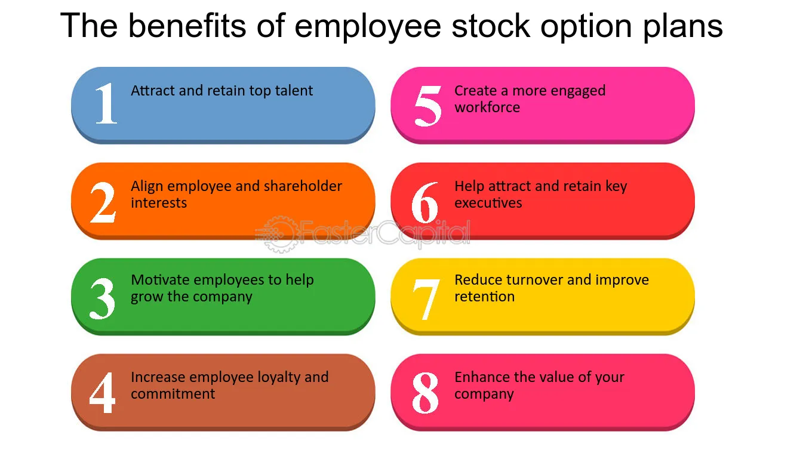

## Table of Contents

## What are stock options and how do they work?

Stock options are a type of financial tool that gives you the right, but not the obligation, to buy or sell a specific stock at a set price within a certain time frame. Imagine you have a friend who owns a bakery and they offer you the chance to buy a cake at a discounted price in the next month. If the cake's price goes up, you can buy it at the lower price you agreed on, which saves you money. But if the price stays the same or goes down, you don't have to buy it. Stock options work in a similar way, but instead of cakes, you're dealing with shares of a company.

There are two main types of stock options: call options and put options. A call option gives you the right to buy a stock at a certain price, called the strike price, before the option expires. If the stock's market price goes above the strike price, you can buy the stock at the lower strike price and then sell it at the higher market price, making a profit. A put option, on the other hand, gives you the right to sell a stock at the strike price. If the stock's market price drops below the strike price, you can buy the stock at the lower market price and then sell it at the higher strike price, again making a profit. Both types of options can be useful depending on whether you think the stock price will go up or down.

## How can stock options be used as a form of compensation?

Stock options are often used by companies as a way to reward their employees. Instead of just giving them more money, the company gives them the right to buy the company's stock at a special price in the future. This can be a big deal because if the company does well and the stock price goes up, the employees can buy the stock at the lower price and then sell it at the higher price, making a profit. It's like getting a bonus that could grow over time. This helps the company save cash and it also motivates employees to work harder because they have a stake in the company's success.

For example, a tech startup might give its engineers stock options as part of their pay. If the startup grows and becomes successful, the stock price could go up a lot. The engineers can then use their options to buy the stock at the old, lower price and sell it at the new, higher price. This way, they share in the company's success. But if the company doesn't do well and the stock price stays the same or goes down, the options might not be worth much. So, it's a bit of a gamble, but it can be a powerful way to align the interests of the employees with those of the company.

## What are the different types of stock options available to employees?

There are two main types of stock options that companies might offer to their employees: Incentive Stock Options (ISOs) and Non-Qualified Stock Options (NSOs). ISOs are usually given to top executives and key employees. They have special tax benefits if certain rules are followed. For example, if you hold onto the stock for at least one year after exercising the option and two years after the option was granted, any profit you make might be taxed at the lower long-term capital gains rate instead of as regular income.

On the other hand, NSOs can be given to any employee and don't have the same tax advantages as ISOs. When you exercise NSOs, the difference between the stock's market price and the price you paid to exercise the option is usually taxed as regular income. This means you might have to pay more in taxes compared to ISOs, but NSOs are easier to get and can be used by a wider range of employees.

Both types of options give employees a chance to share in the company's success, but they come with different rules and tax treatments. It's important for employees to understand these differences so they can make the best choices for their financial situation.

## What are the potential financial benefits of exercising stock options?

Exercising stock options can lead to big financial gains if the company's stock price goes up a lot. Imagine you get stock options with a special price of $10 per share, and later the stock price goes up to $50 per share. If you exercise your options, you can buy the stock at $10 and then sell it at $50, making a $40 profit per share. This is like getting a bonus that grows with the company's success. It can help you save for big things like a house or your kids' college, or just give you more money to enjoy life.

But there are some things to think about. When you exercise stock options, you might have to pay taxes on the profit you make, and that can take a big bite out of your gains. Also, if you need to pay for the shares when you exercise your options, that can be a lot of money upfront. You have to decide if it's worth it, especially if the stock price could go down. But if you believe in the company and think the stock will keep going up, exercising your options could be a smart move to make more money in the long run.

## How do stock options align the interests of employees with those of shareholders?

Stock options help line up what employees want with what shareholders want by giving employees a piece of the company's future success. When employees get stock options, they can buy the company's stock at a special price. If the company does well and the stock price goes up, employees can make money by exercising their options and selling the stock at the higher price. This means employees have a good reason to work hard and help the company grow, just like shareholders who want the stock price to go up so their investment is worth more.

This shared interest makes everyone work together towards the same goal. Employees feel more connected to the company because they have a stake in its success. They might think more about the long-term health of the company, not just their own job. This can lead to better decisions and more effort, which can make the company stronger and more successful. In the end, both employees and shareholders benefit when the company does well, creating a win-win situation.

## What are the tax implications of receiving and exercising stock options?

When you get stock options, you don't have to pay taxes right away. But when you exercise your options, things can get a bit more complicated. If you have Non-Qualified Stock Options (NSOs), the difference between the stock's market price and the price you paid to exercise the option is usually taxed as regular income. This means you'll have to pay income tax on that profit, which could be a lot if the stock price has gone up a lot. You'll need to set aside some money to cover these taxes when you exercise your NSOs.

If you have Incentive Stock Options (ISOs), the tax situation can be different. When you exercise ISOs, you don't have to pay regular income tax on the profit right away. But, you might have to pay something called the Alternative Minimum Tax (AMT), which can be tricky to figure out. If you hold onto the stock for at least one year after exercising the option and two years after the option was granted, any profit you make when you sell the stock could be taxed at the lower long-term capital gains rate. This can save you a lot of money in taxes if you meet these rules. So, it's important to plan carefully and maybe talk to a tax advisor to make sure you understand how ISOs will affect your taxes.

## How can stock options serve as a tool for wealth accumulation over time?

Stock options can be a powerful way to build wealth over time because they give you a chance to buy a company's stock at a lower price than it's worth on the market. If you believe in the company and think its stock will go up, you can exercise your options when the stock price is high. This means you can buy the stock at the lower price you got with your options and then sell it at the higher market price, making a profit. If you keep doing this as the company grows, you can make more and more money. It's like getting a piece of the company's success, and if the company does well over many years, your wealth can grow a lot.

But to really use stock options to build wealth, you need to think about taxes and when to exercise your options. If you have Non-Qualified Stock Options (NSOs), you'll have to pay regular income tax on the profit you make when you exercise them, which can take a big bite out of your gains. If you have Incentive Stock Options (ISOs), you might not have to pay regular income tax right away, but you could have to pay the Alternative Minimum Tax (AMT). If you hold onto the stock for at least one year after exercising and two years after getting the options, you might be able to pay the lower long-term capital gains tax when you sell. Planning carefully and maybe talking to a tax advisor can help you make the most of your stock options and grow your wealth over time.

## What strategies can be employed to maximize the value of stock options?

To make the most out of your stock options, you need to keep an eye on the company's performance and the stock's market price. If you think the stock price will go up a lot in the future, you might want to wait before exercising your options. That way, you can buy the stock at the lower price you got with your options and sell it at a higher price later, making more money. But if you think the stock price might go down or stay the same, it might be better to exercise your options sooner rather than later. Also, think about how long you want to hold onto the stock after you exercise your options. If you can hold onto it for at least a year after exercising and two years after getting the options, you might be able to pay the lower long-term capital gains tax instead of regular income tax, which can save you a lot of money.

Another important thing to think about is taxes. When you exercise Non-Qualified Stock Options (NSOs), you have to pay regular income tax on the profit you make right away, which can be a lot if the stock price has gone up a lot. But if you have Incentive Stock Options (ISOs), you might not have to pay regular income tax right away, but you could have to pay the Alternative Minimum Tax (AMT). Planning when to exercise your options and when to sell the stock can help you save on taxes and make more money. It's a good idea to talk to a tax advisor to figure out the best time to exercise your options and sell the stock, so you can keep as much of your profit as possible.

## How do market conditions affect the value of stock options?

Market conditions can really change how much your stock options are worth. If the market is doing well and people are buying a lot of stocks, the price of the company's stock might go up. This is good for you because you can use your stock options to buy the stock at a lower price and then sell it at the higher market price, making a profit. But if the market is not doing well and people are selling their stocks, the price might go down. This can make your stock options worth less because if the stock price is below the price you can buy it at with your options, you won't make any money by exercising them.

Sometimes, things that affect the whole market, like interest rates or big world events, can also change the value of your stock options. If interest rates go up, people might not want to buy stocks as much, and the stock price could go down. Or if there's a big event like a new law or a war, it can make the market go up and down a lot. This can make it hard to know when to exercise your options. It's important to keep an eye on these things and think about how they might change the value of your stock options over time.

## What are the risks associated with stock options and how can they be mitigated?

Stock options can be risky because their value goes up and down with the stock price. If the stock price goes down a lot, your options might not be worth anything. This can happen if the company doesn't do well or if something bad happens in the market. Also, when you exercise your options, you might have to pay a lot of taxes on the profit you make, which can take away a big part of your gains. If you need to pay for the shares when you exercise your options, that can be a lot of money upfront, and if the stock price goes down after you buy, you could lose money.

To make these risks smaller, you need to keep an eye on the company and the market. If you think the stock price will go up a lot, you might want to wait before exercising your options. But if you think the stock price might go down or stay the same, it might be better to exercise your options sooner. Also, think about taxes. If you have Non-Qualified Stock Options (NSOs), you'll have to pay regular income tax on the profit right away. But if you have Incentive Stock Options (ISOs), you might be able to pay the lower long-term capital gains tax if you hold onto the stock for a certain amount of time. Talking to a tax advisor can help you figure out the best time to exercise your options and sell the stock, so you can keep more of your profit.

## How do stock options impact company culture and employee retention?

Stock options can really change the way people feel about their jobs and the company. When employees get stock options, it's like they're part-owners of the company. This can make them feel more connected and loyal because they want the company to do well so their stock options become more valuable. It's like everyone is on the same team, working together to make the company better. This shared goal can make the workplace feel more positive and energetic, with everyone pulling in the same direction.

Stock options can also help keep employees from leaving. If employees think their stock options will be worth a lot in the future, they might stay with the company longer to see that happen. It's like a reward that gets bigger the longer they stay. This can be good for the company because it keeps experienced people around, which helps the company keep growing and doing well. But if employees don't think the stock options will be worth much, or if they need money right away, they might leave to find a better job. So, it's important for the company to do well and make employees feel like their hard work will pay off in the end.

## What advanced financial models are used to value stock options and predict their performance?

The most common way to value stock options is with a model called the Black-Scholes model. This model looks at things like how much the stock price might change, how long until the option expires, the price you can buy the stock at with the option, and the risk-free [interest rate](/wiki/interest-rate-trading-strategies). It's like a math formula that tries to guess how much an option is worth by thinking about all these different pieces. But the Black-Scholes model assumes the stock price moves in a certain way, which isn't always true in real life. So, it's a good starting point, but it's not perfect.

Another model that's often used is the Binomial model. This one breaks down the time until the option expires into smaller pieces and looks at what might happen to the stock price at each step. It's like playing out different scenarios to see what the option might be worth in the end. The Binomial model can be more accurate than the Black-Scholes model because it can handle more real-life situations, like if the stock price can jump around a lot. Both models help people guess how much their stock options might be worth and when it might be a good time to use them, but they're just tools, and the real world can be different.

## References & Further Reading

[1]: Bergstra, J., Bardenet, R., Bengio, Y., & Kégl, B. (2011). ["Algorithms for Hyper-Parameter Optimization."](https://dl.acm.org/doi/10.5555/2986459.2986743) Advances in Neural Information Processing Systems 24.

[2]: ["Advances in Financial Machine Learning"](https://www.amazon.com/Advances-Financial-Machine-Learning-Marcos/dp/1119482089) by Marcos Lopez de Prado

[3]: ["Evidence-Based Technical Analysis: Applying the Scientific Method and Statistical Inference to Trading Signals"](https://www.amazon.com/Evidence-Based-Technical-Analysis-Scientific-Statistical/dp/0470008741) by David Aronson

[4]: ["Machine Learning for Algorithmic Trading"](https://github.com/stefan-jansen/machine-learning-for-trading) by Stefan Jansen

[5]: ["Quantitative Trading: How to Build Your Own Algorithmic Trading Business"](https://www.amazon.com/Quantitative-Trading-Build-Algorithmic-Business/dp/1119800064) by Ernest P. Chan