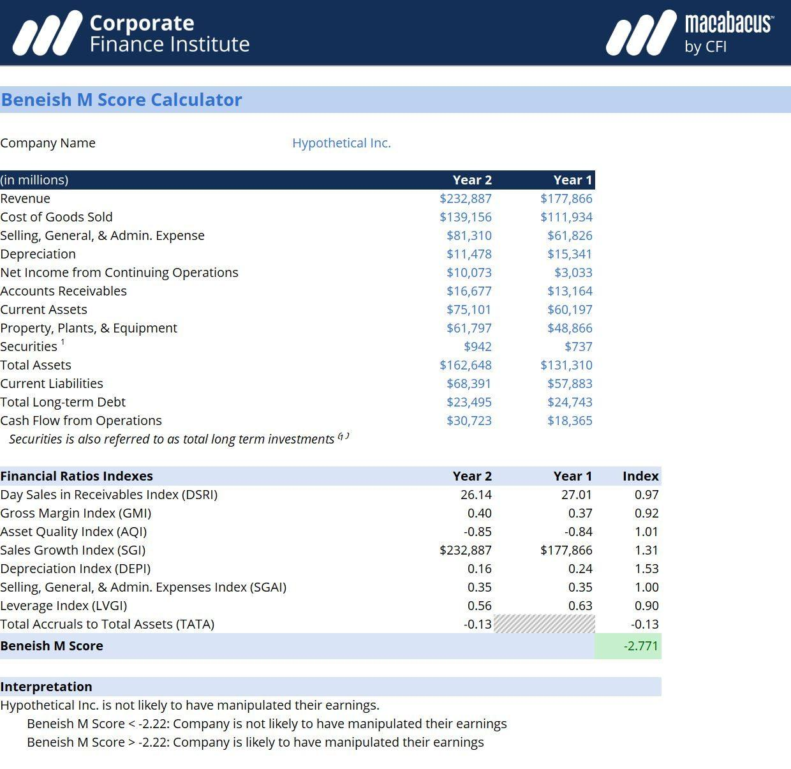

The Beneish M-Score is a widely recognized financial model designed to detect earnings manipulation through the analysis of various financial ratios. Created by Professor Messod Beneish, this model has proven its effectiveness in identifying potential financial fraud, thus becoming a critical tool in forensic accounting and financial analysis. The M-Score's utility is most notably reflected in its application during the Enron scandal, where its predictive capabilities highlighted significant discrepancies before the scandal became public knowledge. This event underscored the importance of the Beneish M-Score as a method for investors to assess the potential risks that arise from earnings manipulation, equipping them with a systematic approach to gauge the financial integrity of companies.

The Beneish Model has gained substantial traction not only in traditional financial analysis but also in modern algorithmic trading strategies. By providing an empirical basis to detect potential manipulation, the M-Score becomes an integral part of decision-making processes where discerning genuine financial health from manipulated figures is paramount. Investors and analysts often incorporate the M-Score into their workflow to preemptively identify red flags that might otherwise go unnoticed until financial statements are thoroughly audited.



Through its quantitative approach, the Beneish M-Score empowers users to make informed investment decisions, offering a statistical glimpse into the likelihood of manipulation. This model continuously remains relevant as it adapts to evolving financial processes and accounting standards, ensuring that it remains a cornerstone in the toolkit of financial professionals aiming to safeguard investment portfolios from unscrupulous corporate practices.

## Table of Contents

## Understanding the Beneish Model

The Beneish Model is a quantitative tool developed to assess the probability of earnings manipulation through the analysis of financial ratios. It is often represented by the M-Score, which is derived by evaluating eight key variables from a company's financial statements. These variables provide insights into different dimensions of the company's financial operations, such as sales and leverage.

The eight variables include:

1. **Days' Sales in Receivables Index (DSRI)**: Measures the ratio of days' sales in receivables compared to the prior year. An increase may suggest revenue inflation.

2. **Gross Margin Index (GMI)**: Compares the gross margin ratio to that of the previous year. A decline in gross margin might indicate cost management issues or sales manipulation.

3. **Asset Quality Index (AQI)**: Examines the proportion of non-current assets other than property, plant, and equipment to total assets, compared to the prior year. A rising AQI can suggest increased capitalizing of expenses.

4. **Sales Growth Index (SGI)**: Analyzes the growth in sales from the previous year. While growth might typically be positive, unusually high growth could be driven by manipulation.

5. **Depreciation Index (DEPI)**: Evaluates the rate of depreciation to the previous period. A lower rate could imply underestimation of asset depreciation.

6. **Sales, General and Administrative expenses Index (SGAI)**: Compares the ratio of SGA expenses to the previous year. Increased SGAI could be due to aggressive accounting practices.

7. **Leverage Index (LVGI)**: Looks at the ratio of total debt to total assets compared to the previous year. Changes might indicate financial distress or manipulation.

8. **Total Accruals to Total Assets (TATA)**: Measures the level of accruals as a proportion of total assets. High accruals could suggest earnings manipulation.

The M-Score itself is calculated using a specific formula that weights each of these variables. The formula for calculating the M-Score (M) is given as follows:

$$

M = -4.84 + 0.920 \times DSRI + 0.528 \times GMI + 0.404 \times AQI + 0.892 \times SGI + 0.115 \times DEPI - 0.172 \times SGAI + 4.679 \times TATA - 0.327 \times LVGI 
$$

An M-Score greater than -2.22 indicates a likelihood of earnings manipulation, signaling potential financial statement fraud. This threshold provides a vital benchmark for analysts and investors, serving as a crucial tool in forensic accounting and investment strategy formulation. By scrutinizing companies through the M-Score, stakeholders can proactively identify companies that may pose a financial risk due to manipulative practices.

## Variables of the Beneish Model

The Beneish Model utilizes eight specific variables—Days' Sales in Receivables Index (DSRI), Gross Margin Index (GMI), Asset Quality Index (AQI), Sales Growth Index (SGI), Depreciation Index (DEPI), Sales General and Administrative Expenses Index (SGAI), Leverage Index (LVGI), and Total Accruals to Total Assets (TATA)—to assess the likelihood of earnings manipulation within financial statements. 

Each of these variables targets distinct facets of a company's financial profile, offering a multifaceted view of potential financial anomalies:

1. **Days' Sales in Receivables Index (DSRI)** assesses the proportion of receivables relative to sales, indicating whether receivables are growing at a suspicious rate compared to sales.

2. **Gross Margin Index (GMI)** examines changes in gross margin over time. A declining gross margin might signal cost manipulation or deterioration in market competitiveness.

3. **Asset Quality Index (AQI)** gauges the proportion of assets skewed towards less tangible items, which could suggest unusual asset inflation.

4. **Sales Growth Index (SGI)** indicates excessive sales growth. Although growth can be positive, disproportionate increases might mask underlying fraudulent activities.

5. **Depreciation Index (DEPI)** compares the depreciation rate in one period to that in another, where a lower rate might imply depreciation policy manipulation to enhance reported earnings.

6. **Sales General and Administrative Expenses Index (SGAI)** assesses changes in expenditure on sales, general, and administration, with an increase possibly indicating aggressive recognition of expenses.

7. **Leverage Index (LVGI)** observes changes in leverage, as a firm with heightened leverage might be more prone to finding income-increasing strategies under financial stress.

8. **Total Accruals to Total Assets (TATA)** focuses on the extent of non-cash earnings relative to total assets, providing insight into the quality and sustainability of earnings reported.

Analyzing these variables for significant year-over-year changes can reveal red flags indicative of potential earnings manipulation. By concentrating on both financial ratios and growth indexes, the Beneish Model provides a robust tool for scrutinizing financial integrity and identifying discrepancies in corporate financial statements.

## Calculating the M-Score

The M-Score is a quantitative measure derived through a specific weighted formula utilizing eight financial ratios. These ratios assess various aspects of a company's financial performance and reveal potential anomalies indicative of earnings manipulation. The formula developed by Professor Messod Beneish is expressed as follows:

$$
M = -4.84 + 0.920 \times \text{DSRI} + 0.528 \times \text{GMI} + 0.404 \times \text{AQI} + 0.892 \times \text{SGI} + 0.115 \times \text{DEPI} - 0.172 \times \text{SGAI} + 4.679 \times \text{TATA} - 0.327 \times \text{LVGI}
$$

Here, each term represents a specific financial metric:

- **DSRI** (Days Sales in Receivables Index)
- **GMI** (Gross Margin Index)
- **AQI** (Asset Quality Index)
- **SGI** (Sales Growth Index)
- **DEPI** (Depreciation Index)
- **SGAI** (Sales, General, and Administrative Expenses Index)
- **TATA** (Total Accruals to Total Assets)
- **LVGI** (Leverage Index)

An M-Score greater than -2.22 indicates that a company might be engaging in earnings manipulation. Accurate calculation of this score is critical, as it provides a statistical foundation for identifying potential accounting irregularities. The effectiveness of the M-Score relies on accurate, up-to-date financial data to ensure a reliable assessment of the company's financial health. 

Investors and analysts utilize the M-Score to preemptively identify risks before financial statements undergo complete scrutiny or audits. Through this proactive approach, stakeholders can flag suspicious financial practices early, enabling them to make more informed decisions. The M-Score serves as a valuable tool in an investor's arsenal, complementing other financial analyses to offer a comprehensive view of a company's financial integrity.

## Real-World Applications of the Beneish Model

The Beneish Model has established its relevance through various real-world applications that highlight its effectiveness in scrutinizing financial records for possible earnings manipulation. Its significant role in the early identification of the Enron scandal remains one of the most notable examples. Business students, familiar with the model, effectively utilized it to flag potential accounting irregularities in Enron’s financial statements before the scandal became public knowledge. This early detection underscores the model's capability in recognizing accounting inconsistencies that suggest manipulation.

Investment firms have increasingly integrated the Beneish M-Score into their risk assessment protocols. By deploying this model, these firms aim to quantify and manage potential risks associated with earnings manipulation. The M-Score serves as an invaluable tool for identifying anomalies that could signify deeper financial integrity issues. By examining the historical M-Scores of companies, investment analysts can gain insights into a company’s compliance with standard accounting practices. This analysis of M-Score trends can help delineate patterns indicating financial stability or potential looming financial misrepresentation.

Organizations are also adapting the Beneish Model to stay consistent with evolving accounting standards. As these standards develop, recalibration of the model's parameters ensures its continued relevance and accuracy. This adaptability allows companies to maintain robust internal controls against fraud—a reflection of the model’s importance in shaping comprehensive fraud prevention frameworks.

The Beneish Model's strategic significance is further accentuated within proactive fraud prevention strategies. By functioning as an early-warning mechanism, it allows organizations to implement timely interventions to mitigate any adverse financial activities. Its function as an anticipatory tool is essential for sustainable financial governance, reinforcing the importance of preemptive measures in safeguarding against fiscal misreporting.

These applications demonstrate the multifaceted utility of the Beneish Model across different sectors, cementing its position as a key instrument in financial analysis and fraud detection.

## Algorithmic Trading and the Beneish Model

Algorithmic trading has transformed financial markets by using automated systems to execute trades based on mathematical models and statistical analyses. Within this domain, the Beneish M-Score has emerged as a valuable tool for enhancing risk prediction strategies. By integrating the M-Score into trading algorithms, traders create a systematic mechanism to detect signs of earnings manipulation, which consequently informs and refines buy or sell decisions.

The M-Score, developed by Professor Messod Beneish, assesses the likelihood of a company engaging in earnings manipulation by analyzing specific financial ratios. When incorporated into trading algorithms, this score provides a robust, data-driven basis for evaluating a company's financial health, thus allowing traders to identify potential red flags before they manifest in verified financial statements. For example, an unusually high M-Score might prompt a trader to reconsider a long position or anticipate increased [volatility](/wiki/volatility-trading-strategies).

The integration of the M-Score into trading strategies complements [fundamental analysis](/wiki/fundamental-analysis) by adding a layer of scrutiny that might not be apparent through traditional financial metrics alone. Algorithmic traders often use Python, due to its vast libraries and ease of use, to program these sophisticated models. Below is a simplified example of how a Python script might assess a stock's financial health using the M-Score:

```python
# Example: Simplified M-Score Calculation
def calculate_m_score(dsri, gmi, aqi, sgi, depi, sgai, lvgi, tata):
    m_score = (
        -4.84
        + 0.920 * dsri
        + 0.528 * gmi
        + 0.404 * aqi
        + 0.892 * sgi
        + 0.115 * depi
        - 0.172 * sgai
        + 4.679 * tata
        - 0.327 * lvgi
    )
    return m_score

# Example usage
dsri, gmi, aqi, sgi, depi, sgai, lvgi, tata = (1.05, 1.04, 1.02, 1.10, 0.98, 1.0, 1.02, 0.03)
m_score = calculate_m_score(dsri, gmi, aqi, sgi, depi, sgai, lvgi, tata)

if m_score > -2.22:
    print("Alert: High likelihood of earnings manipulation detected.")
```

This example demonstrates the straightforward way in which algorithms can be employed to utilize the M-Score in evaluating complex financial data, streamlining the decision-making process for traders.

Furthermore, the Beneish Model not only aids in detecting fraudulent activities but is also instrumental for algo traders in developing comprehensive trading strategies. By incorporating such financial scrutiny measures, traders improve the robustness of their quantitative models, ensuring a more nuanced approach to investment decisions that accounts for both quantitative metrics and potential manipulation risks. This dual emphasis on data integrity and financial health allows for a more rigorous evaluation of investment opportunities, contributing to more informed and effective trading strategies.

## Limitations and Considerations

The Beneish M-Score is a powerful tool used in financial analysis to detect potential earnings manipulation. However, like any analytical tool, it has its limitations and considerations that must be accounted for to ensure accurate results.

The M-Score should not be relied upon in isolation. It is most effective when used alongside other financial analysis tools to provide a comprehensive view of a company's financial health. This holistic approach helps to cross-verify findings, reducing the likelihood of misinterpretation and enhancing decision-making processes.

One of the main concerns with the Beneish Model is the possibility of false positives. These occur when the M-Score indicates potential manipulation, but further investigation reveals no actual misconduct. False positives can arise if the financial context or the industry-specific economic conditions influencing a company's performance are not fully understood. For instance, significant changes in sales growth or margins could be due to strategic business decisions rather than manipulation.

Each of the eight variables in the Beneish Model carries a different weight and significance. Therefore, it is essential to carefully interpret these variables to ascertain the actual risk of fraud. The formula for the M-Score is:

$$
M\text{-Score} = -4.84 + 0.92 \times DSRI + 0.528 \times GMI + 0.404 \times AQI + 0.892 \times SGI + 0.115 \times DEPI - 0.172 \times SGAI + 4.679 \times TATA - 0.327 \times LVGI
$$

where each coefficient reflects the variable's contribution to the likelihood of earnings manipulation. Misjudging these weights can lead to incorrect assessments of a company's financial practices.

Importantly, the Beneish M-Score serves as a screening tool rather than a definitive judgment of financial manipulation. It flags areas of concern that merit further investigation but does not provide conclusive proof of misconduct. As such, when a high M-Score is detected, it should prompt a more thorough examination of the company's financials and context.

Finally, the ongoing evaluation of the Beneish Model's applicability is crucial as financial environments evolve. Changes in accounting standards, industry practices, and economic conditions can impact the reliability and relevance of the M-Score. Continuous education and adaptation of the model are necessary to maintain its effectiveness and ensure it serves its purpose in a dynamic financial landscape. 

In summary, while the Beneish M-Score is an invaluable tool for detecting potential earnings manipulation, it requires careful and informed application to maximize its utility and minimize the risk of errors.

## Conclusion

The Beneish M-Score stands as a crucial tool in the landscape of financial analysis and fraud detection. By providing a rigorous quantitative approach to identifying the likelihood of earnings manipulation, it allows investors and analysts to detect potential accounting irregularities before they surface through verified financial reporting. When integrated into trading strategies, the M-Score offers a method to enhance investment decisions through targeted risk assessment, thereby safeguarding portfolios against financial misrepresentation.

The dynamic nature of financial markets necessitates ongoing education and adaptation of models like the Beneish M-Score. As accounting standards and regulatory environments evolve, so too must the methods used to evaluate financial statement integrity. Keeping abreast of modifications and developments in the model is vital for ensuring its applicability and accuracy in modern finance.

Forensic accountants, financial analysts, and traders alike can derive significant benefits from a comprehensive understanding of the Beneish Model. Its use not only aids in scrutinizing companies for potential red flags but also complements other analytical tools to provide a fuller financial picture. Continual learning and adaptation of the M-Score are essential, as it remains an integral component of a robust financial analysis toolkit.

In conclusion, the Beneish M-Score's effectiveness depends on staying informed about its methodological advancements, ensuring its continuous relevance in diverse financial landscapes. With proper integration and understanding, it can significantly enhance the ability to make informed, prudent investment decisions, serving as a beacon for financial transparency and accountability.

## References & Further Reading

[1]: Beneish, M. D. (1999). ["The Detection of Earnings Manipulation."](https://www.researchgate.net/publication/252059255_The_Detection_of_Earnings_Manipulation) Financial Analysts Journal, 55(5), 24-36.

[2]: Dechow, P. M., Ge, W., & Schrand, C. (2010). ["Understanding earnings quality: A review of the proxies, their determinants and their consequences."](https://www.sciencedirect.com/science/article/pii/S0165410110000339) Journal of Accounting and Economics, 50(2-3), 344-401.

[3]: Beneish, M. D., Lee, C. M., & Nichols, D. C. (2013). ["Earnings Manipulation and Expected Returns."](https://www.tandfonline.com/doi/abs/10.2469/faj.v69.n2.1) Financial Analysts Journal, 69(2), 57-82.

[4]: ["Forensic Analytics: Methods and Techniques for Forensic Accounting Investigations"](https://www.amazon.com/Forensic-Analytics-Techniques-Accounting-Investigations/dp/1119585767) by Mark J. Nigrini

[5]: Healy, P. M., & Wahlen, J. M. (1999). ["A Review of the Earnings Management Literature and Its Implications for Standard Setting."](https://publications.aaahq.org/accounting-horizons/article/13/4/365/1634/A-Review-of-the-Earnings-Management-Literature-and) Accounting Horizons, 13(4), 365-383.