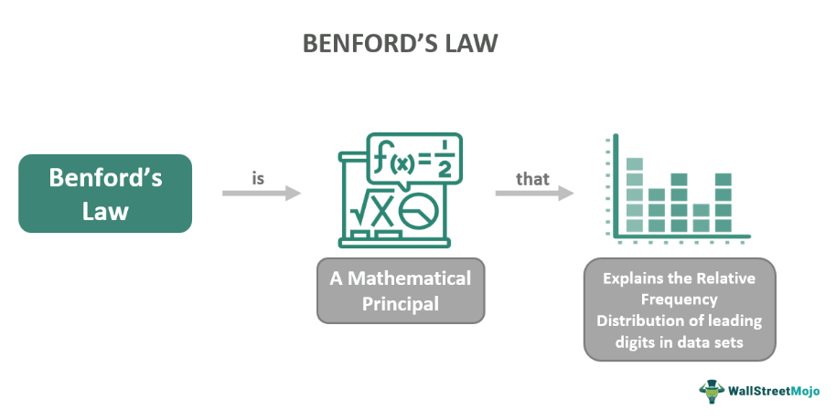

## Table of Contents

## What is Benford's Law?

Benford's Law is a mathematical rule that says in many sets of numbers, the first digit is more likely to be a 1 than a 2, a 2 than a 3, and so on, all the way up to 9. This might sound strange, but it happens in lots of real-world data, like population numbers, stock prices, and even the lengths of rivers. The chance of a number starting with 1 is about 30%, while the chance of it starting with 9 is only about 5%.

This law is useful for spotting fake data or fraud. If someone is making up numbers, they might not follow Benford's Law because people often pick numbers evenly. For example, if you're checking a company's financial records and the first digits don't follow this pattern, it could mean the numbers were invented. This helps detectives and auditors find out if someone is cheating or lying with numbers.

## How does Benford's Law apply to financial data?

Benford's Law can be used to check if financial data is real or made up. In real financial data, like company earnings or expenses, the first digit of numbers often follows a special pattern. According to Benford's Law, numbers starting with 1 appear about 30% of the time, while numbers starting with 9 show up only about 5% of the time. If someone is making up financial numbers, they might not know about this pattern and could pick numbers that start with each digit about the same amount of time. This can be a clue that the data might not be real.

Auditors and investigators use Benford's Law to spot possible fraud in financial records. For example, if a company's sales figures or expense reports don't follow Benford's Law, it might mean someone is trying to hide something or lie about the numbers. By comparing the first digits of the financial data to what Benford's Law predicts, auditors can decide if they need to look closer at the records. This helps them find out if there's any cheating or mistakes in the financial data.

## What is Bitcoin and how is its price determined?

Bitcoin is a type of digital money that people can use to buy things online. It's different from regular money because it's not controlled by any government or bank. Instead, it uses a technology called blockchain, which is like a big, shared notebook that keeps track of all Bitcoin transactions. Anyone can use Bitcoin by setting up a digital wallet on their computer or phone.

The price of Bitcoin is decided by what people are willing to pay for it, just like with other things you buy and sell. If more people want to buy Bitcoin than sell it, the price goes up. If more people want to sell it than buy it, the price goes down. Many things can affect how much people want Bitcoin, like news about it, new laws, or even what famous people say about it. Because Bitcoin is not controlled by any one group, its price can change a lot and be hard to predict.

## What are the basic principles of price manipulation in financial markets?

Price manipulation in financial markets happens when people try to control the price of something to make money unfairly. They might do this by spreading false information, making lots of trades to make it look like the price is going up or down, or working together with others to control the market. This is against the rules because it's not fair to other people who are trying to buy or sell honestly.

The main idea behind price manipulation is to trick other people into thinking the price is different from what it really should be. For example, if someone wants to sell something at a higher price, they might buy a lot of it to make the price go up, then sell it when other people start buying because they think the price will keep going up. This can hurt the market because it makes it hard for people to trust the prices they see.

## How can Benford's Law be used to detect anomalies in Bitcoin's price data?

Benford's Law can help find strange things in Bitcoin's price data by looking at the first numbers of the prices. This law says that in real data, numbers starting with 1 should show up about 30% of the time, while numbers starting with 9 should appear only about 5% of the time. If Bitcoin's price data does not follow this pattern, it might mean someone is trying to mess with the prices or the data is not real.

For example, if someone is trying to make Bitcoin's price look like it's going up by buying a lot of it, the first numbers of the price might not follow Benford's Law. If the first numbers are spread out evenly instead of following the law's pattern, it could be a sign that someone is trying to trick people. This can help people who study the market to spot when something fishy might be going on with Bitcoin's prices.

## What specific studies have been conducted on Bitcoin's price using Benford's Law?

Researchers have looked at Bitcoin's price to see if it follows Benford's Law. One study done by a group of scientists in 2018 checked Bitcoin's price data from 2010 to 2017. They found that Bitcoin's prices did follow Benford's Law most of the time, which means the prices were likely real and not made up. This study showed that even though Bitcoin's price can jump around a lot, it still follows the same patterns as other real data.

Another study from 2020 looked at how well Benford's Law could spot if someone was trying to mess with Bitcoin's price. The researchers used data from 2013 to 2019 and found some times when the first numbers of Bitcoin's price did not follow Benford's Law. This could mean that there were moments when someone might have been trying to change the price in a way that was not fair. Both studies help show that Benford's Law can be a useful tool to check if Bitcoin's price data is real or if someone is trying to trick people.

## What were the findings of these studies regarding Bitcoin's price manipulation?

The 2018 study found that Bitcoin's prices mostly followed Benford's Law from 2010 to 2017. This means the prices were likely real and not made up. Even though Bitcoin's price can change a lot, it still followed the same patterns as other real data. This study showed that Benford's Law can be a good way to check if Bitcoin's price data is real.

The 2020 study looked at Bitcoin's price from 2013 to 2019 to see if Benford's Law could spot price manipulation. They found some times when the first numbers of Bitcoin's price did not follow Benford's Law. This could mean that there were moments when someone might have been trying to change the price in a way that was not fair. Both studies help show that Benford's Law can be a useful tool to check if Bitcoin's price data is real or if someone is trying to trick people.

## How reliable is Benford's Law as a tool for detecting financial manipulation?

Benford's Law is a good tool for spotting financial manipulation, but it's not perfect. It works by checking if the first numbers in a set of data follow a special pattern. If the numbers don't follow this pattern, it might mean someone is trying to trick people by making up numbers. This can be really helpful for people like auditors who need to check if financial data is real or fake. But, Benford's Law is just one tool, and it's best used with other ways of checking data to make sure the results are right.

Sometimes, Benford's Law can give false alarms. This means it might say there's a problem when there isn't one. For example, if the data set is too small or if the numbers don't fit the kind of data Benford's Law works best with, it might not be accurate. So, while Benford's Law can help find possible cheating or mistakes, it's important to use it carefully and check the results with other methods to be sure.

## What are the limitations and criticisms of applying Benford's Law to Bitcoin's price data?

Benford's Law can help find strange things in Bitcoin's price data, but it has some problems. One big problem is that Bitcoin's prices can jump around a lot, and this might make it hard for Benford's Law to work well. If the data set is too small or if the prices change too quickly, Benford's Law might not see the right pattern. Also, Bitcoin's price can be affected by many things, like news or what people say on the internet, which might mess up the pattern Benford's Law looks for.

Another issue is that Benford's Law is just one tool, and it can give false alarms. This means it might say there's a problem when there isn't one. If people only use Benford's Law to check Bitcoin's price, they might think something is wrong when it's actually okay. To be sure, it's better to use Benford's Law with other ways of checking the data. This helps make sure the results are right and not just a mistake.

## Can Benford's Law be used in real-time to monitor Bitcoin's price for signs of manipulation?

Benford's Law can be used to check Bitcoin's price for signs of manipulation, but using it in real-time is tricky. The law works by looking at the first numbers of prices over a long time to see if they follow a special pattern. If someone is trying to trick people by changing the price, the first numbers might not match this pattern. But, Bitcoin's price can change very quickly, and it might be hard to see the pattern clearly in real-time. Also, Benford's Law needs a lot of data to work well, and real-time data might not be enough.

Using Benford's Law in real-time to watch Bitcoin's price would need a computer system that can look at the prices as they come in and check them against the pattern. Even if you could do this, there's a chance the system might make mistakes and say there's a problem when there isn't one. So, while Benford's Law can help find signs of manipulation, it's better to use it along with other ways of checking the data to be sure.

## What other methods are used alongside Benford's Law to analyze Bitcoin's price integrity?

Besides Benford's Law, people use other ways to check if Bitcoin's price is real or if someone is trying to trick people. One way is to look at trading data to see if there are strange patterns, like a lot of trades happening at the same time or prices moving in ways that don't make sense. Another way is to use computer programs that can spot when someone might be trying to change the price on purpose. These programs look for things like big orders that are placed and then taken away quickly, which can be a sign of someone trying to control the price.

Also, people check the news and what people are saying on the internet to see if there's anything that might be making the price go up or down in a way that's not fair. If there's a lot of talk about Bitcoin on social media or if there's news that's not true, it might be a sign that someone is trying to trick people into buying or selling Bitcoin. By using these different ways together with Benford's Law, people can get a better idea of whether Bitcoin's price is being manipulated or if it's just changing because of normal market things.

## How do regulatory bodies and financial analysts interpret the results of Benford's Law in the context of cryptocurrency?

Regulatory bodies and financial analysts use Benford's Law to help check if the prices of cryptocurrencies like Bitcoin are real or if someone might be trying to trick people. They look at the first numbers of the prices to see if they follow a special pattern. If the numbers don't match this pattern, it might mean someone is messing with the prices. But, they know that Benford's Law is just one tool and it's not perfect. They use it along with other ways of checking the data to make sure they don't miss anything important.

Sometimes, the results from Benford's Law can be confusing. If the data set is too small or if the prices change too quickly, Benford's Law might not work well. So, regulatory bodies and financial analysts are careful when they use it. They also look at other things, like trading patterns and what people are saying on the internet, to get a full picture. By using all these different ways together, they can better understand if there's any cheating going on with [cryptocurrency](/wiki/cryptocurrency) prices.

## What is Benford's Law and how can it be understood?

Benford's Law is a fascinating mathematical principle that describes the frequency distribution of leading digits in many naturally occurring datasets. According to this law, lower digits are more likely to occur as the leading digit. For instance, the digit 1 should appear as the leading digit approximately 30% of the time, with the likelihood decreasing progressively for higher digits. This counterintuitive pattern is often observed in various datasets, such as socio-economic data, physical constants, and even certain financial data. Mathematically, if the leading digit is denoted by $d$, the probability $P(d)$ of $d$ appearing as the leading digit can be expressed by the formula:

$$

P(d) = \log_{10}(d+1) - \log_{10}(d) = \log_{10} \left( 1 + \frac{1}{d} \right) 
$$

Where $d$ ranges from 1 to 9. This formulation implies that $P(1) \approx 0.301$, $P(2) \approx 0.176$, and so on, decreasing as $d$ increases.

The phenomenon was initially noticed by Simon Newcomb in 1881, who observed that the earlier pages of logarithm [books](/wiki/algo-trading-books) were more worn than the later ones, suggesting more frequent use of numbers with smaller leading digits. It was later formalized by physicist Frank Benford in 1938 after he studied an extensive range of datasets and published his findings confirming this pattern across different types of data. 

Benford's Law serves as a useful tool for detecting anomalies and potential manipulations in datasets. Datasets that deviate significantly from this expected distribution might suggest errors, unusual patterns, or even fraudulent activity. This characteristic makes Benford's Law a valuable asset in auditing processes, fraud detection, and in the analysis of data authenticity across various fields, including finance and accounting. The application of Benford's Law extends beyond mere curiosity; it provides a statistical baseline against which the integrity of data can be assessed.

## References & Further Reading

[1]: Peterson, T. (2020). ["Bitcoin: A Data Based Insight Into Price Manipulation."](https://www.tandfonline.com/doi/full/10.1080/13504851.2020.1861183)

[2]: Newcomb, S. (1881). ["Note on the Frequency of Use of the Different Digits in Natural Numbers."](https://pdodds.w3.uvm.edu/research/papers/others/1881/newcomb1881a.pdf) American Journal of Mathematics, 4(1), 39–40.

[3]: Benford, F. (1938). ["The Law of Anomalous Numbers."](https://ui.adsabs.harvard.edu/abs/1938PAPhS..78..551B/abstract) Proceedings of the American Philosophical Society, 78(4), 551-572.

[4]: Lo, A. W., & MacKinlay, A. C. (1997). ["Stock Market Prices Do Not Follow Random Walks: Evidence from a Simple Specification Test."](https://academic.oup.com/rfs/article-abstract/1/1/41/1601244) The Review of Financial Studies, 1(1), 41-66.

[5]: Vidan, G., & Lehdonvirta, V. (2019). ["Mine the Gap: Bitcoin and the Maintenance of Trustlessness."](https://journals.sagepub.com/doi/10.1177/1461444818786220) Social Studies of Science, 49(5), 750-774.