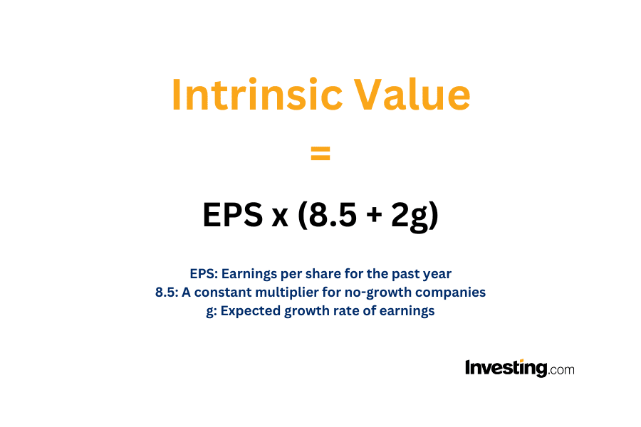

Investing in the stock market can seem daunting for beginners, but with the right strategies, anyone can learn to invest successfully. One such strategy is the Benjamin Graham Formula, a time-tested method for identifying undervalued stocks. Benjamin Graham, known as the 'father of value investing,' developed this approach, which has influenced numerous investors, including Warren Buffett. By focusing on the intrinsic value of stocks, Graham's methodology guides investors in making informed decisions that emphasize long-term gains and financial security.

The Benjamin Graham Formula enables investors to assess whether a stock is undervalued by calculating its intrinsic value using key financial metrics. This provides a systematic approach to identifying investment opportunities that may not be immediately apparent through traditional valuation methods. With the advent of modern financial tools, such as InvestingPro, investors can now apply this formula more efficiently and accurately. By leveraging technology, they can create custom screening parameters that align with Graham's criteria, allowing for more precise identification of potential investments.

This article aims to demystify the stock market for both novice and experienced traders by providing actionable insights using Benjamin Graham’s principles. By understanding and applying these strategies, investors can build a robust investment strategy tailored to their financial goals and risk tolerance. Whether you are just starting or seeking to enhance your existing portfolio, the insights provided herein will aid in navigating the complexities of the stock market with confidence.

## Table of Contents

## The Benjamin Graham Formula

The Benjamin Graham Formula is an essential tool in fundamental analysis, focused on determining a stock's intrinsic value. Developed by Benjamin Graham, this formula helps investors identify stocks that are undervalued by the market, offering the potential for significant growth. By assessing intrinsic value, investors can make informed decisions on whether a stock is priced correctly relative to its current market value.

Originally, the formula was crafted to incorporate specific metrics such as earnings per share (EPS) and the expected growth rate of a company. Graham's original formula is expressed as:

$$
V = \dfrac{EPS \times (8.5 + 2g)}{Y}
$$

Where:
- $V$ is the intrinsic value of the stock.
- $EPS$ is the earnings per share.
- $8.5$ is the price-to-earnings (P/E) ratio of a company with zero growth.
- $g$ is the expected annual growth rate of EPS.
- $Y$ is the current yield on AAA corporate bonds.

This original formula was beneficial in stable market conditions. However, to adapt to changing market dynamics and account for inflation, Graham's formula was later revised. The revised formula integrates adjustments to yield to more accurately reflect the relationship between interest rates and stock value. The modern adaptation is often presented as:

$$
V = EPS \times (8.5 + 2g) \times 4.4 \times \dfrac{Y_{\text{current}}}{Y}
$$

Where $Y_{\text{current}}$ is the current yield on AAA corporate bonds, which adjusts the formula for contemporary interest rates.

These formulas provide investors with a quantitative method to evaluate whether a stock is undervalued or overvalued, facilitating better investment decisions in both stable and volatile market environments. By leveraging such formulas, investors aim to establish a margin of safety, thereby mitigating potential risks associated with market price fluctuations.

## What Is the Benjamin Graham Formula?

The Benjamin Graham Formula is a methodology devised by Benjamin Graham to assess the intrinsic value of a stock, helping investors determine if it is fairly priced. The primary aim of this formula is to identify undervalued stocks with potential for growth by analyzing key financial metrics.

One of the central components of the Graham Formula is the Earnings Per Share (EPS), which provides insights into a company's profitability on a per-share basis. This metric serves as an indicator of the company’s financial health and its ability to generate earnings for shareholders. Alongside EPS, the expected growth rate of a company’s earnings is integrated into the formula. This projected growth rate is typically forecasted over the next 7 to 10 years and reflects the anticipated increase in the company’s profitability.

Mathematically, the original formula developed by Graham can be expressed as:

$$
V = \frac{EPS \times (8.5 + 2g)}{Y}
$$

where:
- $V$ is the intrinsic value of the stock.
- $EPS$ is the earnings per share.
- $g$ is the expected growth rate (as a percentage).
- $Y$ represents the yield of AAA corporate bonds.

The concept of a margin of safety is integral to the formula, as it offers a cushion against market [volatility](/wiki/volatility-trading-strategies) and errors in valuation calculations. This principle advocates for purchasing stocks at prices significantly below their calculated intrinsic value, thereby minimizing potential losses due to unforeseen market fluctuations or errors in the assumptions underlying the intrinsic value calculation.

By employing the Benjamin Graham Formula, investors are equipped to make informed decisions regarding stock investments, assessing not only the potential for earnings growth but also incorporating safeguards against inherent market uncertainties.

## Key Components of the Formula

The key components of the Benjamin Graham Formula are Earnings per Share (EPS), Growth Rate, and Margin of Safety. These elements play a pivotal role in determining the intrinsic value of a stock and ultimately assist investors in making informed decisions.

**Earnings per Share (EPS):** EPS is a crucial metric that indicates a company's profitability on a per-share basis. It is calculated by dividing the company's net profit by the number of outstanding shares. A higher EPS suggests better profitability and can be a positive indicator for investors. The formula for calculating EPS is:

$$
\text{EPS} = \frac{\text{Net Income} - \text{Preferred Dividends}}{\text{Average Outstanding Shares}}
$$

By analyzing EPS, investors gain insights into the company's financial health and operational efficiency, aiding in evaluating whether the stock is undervalued or overvalued.

**Growth Rate:** The growth rate reflects the projected future earnings growth of a company over the next 7 to 10 years. This component is integral to estimating the potential increase in EPS over time. A consistent growth rate can indicate strong future performance and potential for capital appreciation. The compound annual growth rate (CAGR) formula can be used to project future EPS growth:

$$
\text{CAGR} = \left( \frac{\text{Ending Value}}{\text{Starting Value}} \right)^{\frac{1}{\text{Number of Years}}} - 1
$$

A company's anticipated growth can significantly affect its valuation, making the growth rate an essential element of stock assessment.

**Margin of Safety:** This principle is designed to protect investors against calculation errors and unforeseen market downturns. Benjamin Graham emphasized the importance of purchasing stocks at a significant discount to their intrinsic value to minimize risk. The margin of safety acts as a buffer between the intrinsic value calculated and the market price, providing additional security against unexpected market fluctuations. Graham recommended a margin of safety to mitigate potential uncertainties and safeguard investments, thus enhancing long-term financial security.

Incorporating these components into the Benjamin Graham Formula allows investors to assess the intrinsic value of a stock more accurately and determine its investment potential, especially when considering value investment strategies.

## Who Is Benjamin Graham?

Benjamin Graham, widely recognized as the 'Father of Value Investing,' made significant contributions to the field of investment with his development of a systematic and analytical approach to stock investing. He authored seminal texts, most notably 'The Intelligent Investor,' which continues to be regarded as an essential resource for both novice and seasoned investors. Born in 1894, Graham's methodologies have laid the foundation for what is now known as value investing, a philosophy centered around identifying undervalued securities through careful financial analysis.

Graham's investment philosophy emphasizes thorough analysis of financial statements and market conditions to understand a stock's intrinsic value. By determining this intrinsic value, investors can make informed decisions about whether a stock is undervalued or overvalued, leading to more strategic investment choices. His approach advocates for disciplined investing, with a focus on long-term gains rather than short-term market fluctuations.

A key component of Graham's strategy is the concept of a 'margin of safety.' This principle advises investors to purchase stocks at prices significantly below their intrinsic value to provide a buffer against errors in calculation or unforeseen market downturns. This margin of safety reduces risk and increases the potential for future profitability.

Graham's principles have significantly influenced many successful investors, including Warren Buffett, who considers 'The Intelligent Investor' and Graham's teachings as the cornerstone of his own investment strategy. By emphasizing rigorous analysis and risk management, Graham's approach remains relevant in today's financial markets, guiding investors towards achieving sustainable long-term financial success.

## Understanding The Intelligent Investor

"The Intelligent Investor," authored by Benjamin Graham, serves as a seminal text within the domain of value investing. This work is highly regarded for its enduring advice, which remains applicable despite the evolving nature of financial markets. A core tenet of the book is the concept of a margin of safety, a principle that Graham champions as essential for prudent investing. This concept involves purchasing securities at a significant discount to their intrinsic value, thereby safeguarding against potential errors in valuation or unforeseen market fluctuations.

Graham's narrative is constructed around the idea that the stock market is inherently volatile and that investors must equip themselves with strategies to mitigate associated risks. Rather than reacting to market movements driven by speculative excitement, "The Intelligent Investor" encourages readers to adopt a disciplined approach grounded in [fundamental analysis](/wiki/fundamental-analysis). Such an approach involves a comprehensive assessment of a company’s financial health, earnings stability, and growth potential.

The text also provides detailed methodologies for building long-term wealth. These include diversification, consistent saving, and a focus on long-term performance rather than short-term gains. Graham illustrates that a well-considered investment strategy, augmented by patience and rational decision-making, can lead to substantial financial success. By adhering to these principles, investors can achieve returns that consistently outperform market averages without succumbing to speculative pressures. Consequently, "The Intelligent Investor" remains a cornerstone guide for those seeking to adopt a value-oriented approach to investing.

## Applying the Benjamin Graham Formula in Stock Screening

Modern financial tools have significantly simplified the process of applying the Benjamin Graham Formula for stock screening. One such tool, InvestingPro, provides investors with the capability to create custom screeners to identify undervalued stocks that align with Graham’s value investing principles.

Building a custom screener involves setting specific criteria based on metrics crucial to the Benjamin Graham Formula. These criteria typically include Earnings per Share (EPS), the projected growth rate of a company, and a margin of safety to protect against market volatility and miscalculations. Here’s a practical approach to using InvestingPro for this purpose:

1. **Define Screening Criteria**: The first step is to define the parameters that represent Graham’s formula. This includes:
   - **EPS**: Set a threshold for a company’s EPS to ensure profitability.
   - **Growth Rate**: Define an expected growth rate over a specified period, such as 7 to 10 years.
   - **Margin of Safety**: Incorporate this by setting a discount on the intrinsic value derived from the formula.

2. **Set Up the Screener**: Use InvestingPro’s features to set these parameters in a custom screener. The platform allows input of various financial metrics and conditions, making it versatile in identifying stocks that meet Graham’s criteria.

3. **Data Input and Formula Application**: Applying the formula through InvestingPro involves inputting current stock data. For instance, if the formula is given as:
$$
   V = \frac{{EPS \times (8.5 + 2g)}}{Y}

$$
   Where $V$ is intrinsic value, $EPS$ is earnings per share, $g$ is the expected growth rate, and $Y$ is the yield on AAA rated corporate bonds.

4. **Analysis of Screener Results**: After configuring the screener, run it to list stocks that meet the set criteria. Analyze the resulting data to evaluate which stocks present opportunities as undervalued investments based on the calculated intrinsic value.

5. **Continuous Monitoring and Adjustment**: Market conditions and company performances fluctuate. Regularly update the criteria and reassess stocks to align with current market realities, ensuring that the screener remains effective in identifying valuable investment options.

Overall, InvestingPro and similar financial tools empower investors to efficiently leverage the Benjamin Graham Formula, providing a hands-on approach to value investing. By filtering through vast amounts of market data, investors can focus on stocks with potential, ensuring a fundamentally sound investment strategy.

## Practical Steps for Implementing the Strategy

To implement the Benjamin Graham Formula in your investment strategy, begin by accessing a stock screening tool that offers customization options, such as InvestingPro. Here's a step-by-step guide to setting up a custom screener that aligns with Graham's metrics:

1. **Log into the Stock Screening Tool:**
   Access your account on a stock screening platform like InvestingPro, which provides comprehensive tools for analyzing stocks based on fundamental data.

2. **Create a Custom Screener:**
   Set up a new screener by inputting the criteria derived from the Benjamin Graham Formula. Focus on the following key metrics:
   - **Earnings Per Share (EPS):** Input the latest EPS figures, which indicate a company's profitability on a per-share basis.
   - **Expected Growth Rate (g):** Estimate the future growth rate over the next 7 to 10 years. This can be based on historical growth rates or projections from financial analysts.
   - **Intrinsic Value Calculation:** Use the Graham Formula to calculate intrinsic value:
$$
     V = \frac{EPS \times (8.5 + 2g)}{Y}

$$
     Where $V$ is the intrinsic value, $EPS$ is earnings per share, $g$ is the projected growth rate, and $Y$ is the current yield of AAA corporate bonds. By using this formula, you can gauge whether a stock is undervalued relative to its growth prospects.

3. **Apply the Margin of Safety:**
   To safeguard against inaccuracies in estimation, apply a margin of safety by selecting stocks that trade at a significant discount to their calculated intrinsic value. Typically, a margin of safety of around 25-30% is recommended to account for potential overestimations in growth projections or unforeseen market events.

4. **Run the Screener:**
   Once you've inputted the necessary metrics, execute the screener to identify stocks that meet the criteria for undervaluation according to the Benjamin Graham Formula. The tool will filter and provide a list of potential investment opportunities.

5. **Assess Fair Value with Additional Analysis:**
   With the list of stocks generated from the screener, conduct further analysis to validate the selections. This can include reviewing financial statements, understanding the competitive landscape, and considering qualitative factors such as management competency and industry outlook. Additionally, compare the intrinsic value with the current market price to ensure it aligns with the calculated valuation.

By following these steps, investors can effectively integrate the Benjamin Graham Formula into their stock screening process, helping to identify undervalued stocks with the potential for growth while minimizing risk through disciplined analysis.

## Investing for Beginners: Tips & Trading Strategies

Investing in the stock market can be a rewarding endeavor, especially when adopting value investing principles outlined in classic texts such as Benjamin Graham's "The Intelligent Investor." For beginners, immersing oneself in these principles forms the foundation of a sound investing strategy. The core idea revolves around buying stocks that are undervalued compared to their intrinsic worth, thus offering a margin of safety.

To embark on this journey, beginners are encouraged to start small, ideally utilizing simulated trading platforms before committing real capital. These platforms provide a risk-free environment to practice trading, understand market dynamics, and refine investment strategies without the fear of financial loss. By interacting with virtual portfolios, novice investors can experiment with different approaches and track their performance over time, gaining confidence before entering the actual markets.

One of the key strategies in investing is portfolio diversification. By spreading investments across various asset classes and sectors, investors can mitigate risk and protect against significant losses. Diversification helps balance a portfolio's overall volatility, as the decline in one asset may be offset by gains in another. This approach aligns with a disciplined investing strategy, which is crucial for long-term success.

A disciplined strategy involves setting clear financial goals, adhering to a well-researched investment plan, and resisting the temptation to react impulsively to market fluctuations. This discipline ensures that investors focus on long-term gains rather than short-term market movements, effectively harnessing the power of compound interest.

In summary, for beginner investors, the path to successful investing is grounded in education and practice. By understanding and applying the principles of value investing, starting with small, simulated investments, and maintaining a diversified and disciplined approach, investors can build a solid foundation for achieving their financial objectives.

## Conclusion

The Benjamin Graham Formula remains a valuable method for identifying undervalued stocks, leveraging fundamental analysis to determine a stock's intrinsic value. This approach enables investors to make informed decisions based on a thorough comparison between intrinsic value and current market price. As a cornerstone of value investing, Graham's principles emphasize rigorous analysis and a focus on long-term investment horizons. By integrating a margin of safety, this formula helps mitigate risks related to market volatility and unforeseen economic shifts.

Implementing Graham's strategies empowers investors to craft a disciplined investment plan, prioritizing thorough research and sound judgment over speculative strategies. Modern tools such as InvestingPro facilitate the application of Graham’s methodologies, allowing investors to screen for stocks meeting specific criteria and adjust for various market conditions with advanced functionalities. By leveraging these resources, investors can streamline their stock selection process, better aligning their portfolios with fundamental investing principles to achieve financial stability and growth.

## References & Further Reading

[1]: Graham, B. (1949). ["The Intelligent Investor."](https://en.wikipedia.org/wiki/The_Intelligent_Investor) Harper & Brothers.

[2]: Graham, B., & Dodd, D. L. (1934). ["Security Analysis."](https://www.amazon.com/Security-Analysis-Classic-Benjamin-Graham/dp/0070244960) McGraw-Hill Education.

[3]: ["Investing Pro."](https://www.investing.com/academy/investing-pro/get-started-with-investingpro/) Comprehensive financial tool for stock analysis and screening.

[4]: `"Margin of Safety` by Seth Klarman, a well-regarded book on value investing and risk management strategies. 

[5]: Greenwald, B. C., Kahn, J., Sonkin, P. D., & van Biema, M. (2001). ["Value Investing: From Graham to Buffett and Beyond."](https://www.amazon.com/Value-Investing-Graham-Buffett-Beyond/dp/0471463396) Wiley Finance.

[6]: Damodaran, A. (2002). ["Investment Valuation: Tools and Techniques for Determining the Value of Any Asset."](https://archive.org/details/investmentvaluat0000damo_n6k9) Wiley Finance.

[7]: [Morningstar](https://www.morningstar.com/), a widely-used platform for stock analysis and valuation insights.