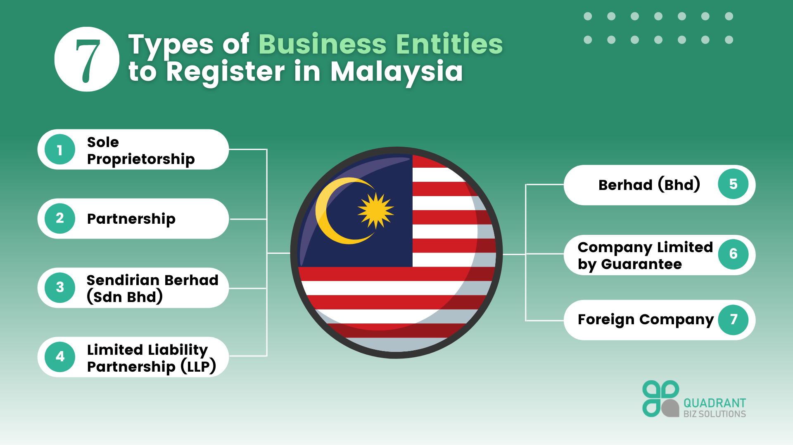

## Table of Contents

## What does 'Berhad' (BHD) mean in the context of Malaysian companies?

In Malaysia, 'Berhad' or 'BHD' is a term used at the end of a company's name. It means the company is a public limited company. This is similar to 'PLC' in the UK or 'Inc.' in the US. When a company adds 'Berhad' to its name, it shows that the company has shares that can be bought and sold by the public.

Adding 'Berhad' to a company's name is important because it tells people that the company follows certain rules set by the government. These rules help protect the people who buy the company's shares. So, when you see 'Berhad' in a company's name, you know it is a big company that is open to public investment and follows strict regulations.

## How is a Berhad company different from a private limited company in Malaysia?

A Berhad company in Malaysia is different from a private limited company mainly because a Berhad company can sell its shares to the public. This means anyone can buy shares in a Berhad company, and these shares can be traded on the stock market. On the other hand, a private limited company cannot sell its shares to the public. Only a small group of people, usually the founders and investors, can own shares in a private limited company.

Another difference is the level of regulation. Berhad companies have to follow strict rules set by the government and the stock exchange. They need to share a lot of information with the public, like financial reports and company news. This is to make sure that people who buy shares know what is going on with the company. Private limited companies do not have to share as much information. They have less strict rules because their shares are not open to the public.

In summary, Berhad companies are bigger and more open to the public, while private limited companies are smaller and more private. The choice between the two depends on the company's goals and how much they want to grow and be known to the public.

## What are the legal requirements to register a company as Berhad in Malaysia?

To register a company as Berhad in Malaysia, you need to follow some important steps. First, you need to get approval from the Securities Commission Malaysia (SC). This is a big step because the SC checks if your company is ready to go public. You also need to prepare a lot of documents like a prospectus, which tells people about your company and what they can expect if they buy shares. After the SC approves, you can apply to the Companies Commission of Malaysia (SSM) to change your company's name to include 'Berhad'.

Once you get the approval from the SSM, you need to meet some more rules. You have to have a minimum amount of paid-up capital, which means you need to have enough money in the company. You also need to have at least two directors, and at least one of them must be a Malaysian citizen or permanent resident. After all these steps, your company can list its shares on the stock exchange, like Bursa Malaysia. This lets the public buy your shares and become part of your company.

## Can you explain the process of converting a private limited company to a Berhad company?

To convert a private limited company to a Berhad company in Malaysia, the first step is to get approval from the Securities Commission Malaysia (SC). This is important because the SC checks if your company is ready to go public. You need to prepare a lot of documents, like a prospectus, which tells people about your company and what they can expect if they buy shares. Once the SC approves, you can apply to the Companies Commission of Malaysia (SSM) to change your company's name to include 'Berhad'.

After getting approval from the SSM, you need to meet some more rules. You have to have a minimum amount of paid-up capital, which means you need to have enough money in the company. You also need to have at least two directors, and at least one of them must be a Malaysian citizen or permanent resident. Once you meet all these requirements, your company can list its shares on the stock exchange, like Bursa Malaysia. This lets the public buy your shares and become part of your company.

## What are the financial reporting obligations for a Berhad company?

A Berhad company in Malaysia has to follow strict rules about sharing its financial information. They need to prepare and share their financial statements every year. This includes things like how much money the company made, how much it spent, and what it owns or owes. These statements must follow the rules set by the Malaysian Accounting Standards Board (MASB) and the Companies Act 2016. The company also has to get these statements checked by an outside auditor to make sure they are correct and honest.

Besides the yearly reports, Berhad companies also have to share quarterly reports. These reports give updates on the company's financial health every three months. This helps people who own shares to know how the company is doing more often. If there are any big changes or important news, the company must tell the stock exchange, Bursa Malaysia, right away. This is to make sure everyone knows what is happening with the company and can make good choices about their shares.

## How does being a Berhad company affect the governance and management structure?

Being a Berhad company changes how the company is run and managed. It has to follow strict rules set by the government and the stock exchange. This means the company needs to have a board of directors who make big decisions. At least two directors are needed, and one of them must be a Malaysian citizen or permanent resident. The board has to make sure the company follows all the rules and does what is best for the people who own shares.

The management structure also changes because the company has to be more open about what it does. The CEO and other top managers have to work closely with the board of directors. They need to share a lot of information with the public, like financial reports and company news. This helps people who own shares know what is going on and make good choices. Being a Berhad company means more people are watching what the company does, so the management has to be careful and responsible.

## What are the advantages of listing a company as Berhad on the Malaysian stock exchange?

Listing a company as Berhad on the Malaysian stock exchange can help the company grow. When a company goes public, it can sell shares to people and get more money. This money can be used to buy new things, start new projects, or grow the business in new ways. Being a Berhad company also makes the company more well-known. More people know about the company, which can help it find new customers and partners.

Another advantage is that being a Berhad company can make it easier to get loans. Banks and other lenders might see the company as less risky because it follows strict rules and shares a lot of information with the public. This can help the company borrow money at lower interest rates. Also, the people who own shares can sell them if they want to, which can make them happy and more likely to keep supporting the company.

## Can you provide examples of well-known Berhad companies in Malaysia?

Some well-known Berhad companies in Malaysia include Maybank Berhad and Petronas Dagangan Berhad. Maybank Berhad is a big bank that helps people and businesses with their money. It is one of the biggest banks in Malaysia and has many branches all over the country. Petronas Dagangan Berhad is a company that sells petrol and other things people need for their cars. It is part of the Petronas group, which is owned by the Malaysian government.

Another famous Berhad company is Tenaga Nasional Berhad, which is the main company that gives electricity to homes and businesses in Malaysia. It is very important because it keeps the lights on and helps the country run. These companies are all listed on the stock exchange, so people can buy shares in them and become part owners.

## What are the common challenges faced by Berhad companies in terms of compliance and regulation?

Berhad companies in Malaysia face many challenges when it comes to following the rules. They have to share a lot of information with the public, like financial reports every year and every three months. This can be hard because they need to make sure all the numbers are correct and honest. They also have to get these reports checked by an outside auditor, which takes time and money. If they make a mistake, they could get in trouble with the government or the stock exchange.

Another challenge is keeping up with all the new rules that come out. The government and the stock exchange are always making new rules to make sure companies are fair and honest. Berhad companies need to stay on top of these changes and make sure they are following them. This means they have to spend a lot of time and money on lawyers and other experts to help them understand and follow the rules. If they don't, they could face fines or other punishments.

## How do Berhad companies typically structure their board of directors?

Berhad companies in Malaysia usually have a board of directors to help run the company. They need at least two directors, and one of them must be a Malaysian citizen or permanent resident. The board is made up of different kinds of directors, like executive directors who work in the company every day, and non-executive directors who give advice but don't work there every day. Some of the non-executive directors are independent, which means they don't have a close relationship with the company. This helps them give honest advice and make sure the company is doing what is best for the people who own shares.

The board of directors in a Berhad company has important jobs. They make big decisions about the company, like what new projects to start or how to spend the company's money. They also have to make sure the company follows all the rules set by the government and the stock exchange. This means they need to meet often to talk about the company's plans and check on how things are going. By having a good board of directors, a Berhad company can make sure it is run well and is fair to everyone who owns shares.

## What impact does the Berhad status have on a company's ability to raise capital?

When a company becomes a Berhad company, it can raise more money easily. This is because it can sell shares to the public on the stock exchange. More people can buy these shares, so the company can get a lot of money. This money can be used to grow the business, start new projects, or buy new things. Being a Berhad company also makes it easier to get loans from banks. Banks see Berhad companies as less risky because they follow strict rules and share a lot of information with the public. This can help the company get loans at lower interest rates.

However, being a Berhad company also means more rules to follow. The company has to share a lot of financial information with the public, like yearly and quarterly reports. This can be hard because the company needs to make sure all the numbers are correct. They also have to pay for an outside auditor to check these reports, which costs money. If the company makes a mistake, it could get in trouble with the government or the stock exchange. So, while being a Berhad company helps raise money, it also comes with a lot of work to stay in line with the rules.

## How do international investors perceive Berhad companies compared to other types of corporations?

International investors often see Berhad companies as more trustworthy and stable than other types of corporations. This is because Berhad companies have to follow strict rules set by the Malaysian government and the stock exchange. They need to share a lot of financial information with the public, which helps investors know what is going on with the company. This openness makes investors feel more confident about putting their money into a Berhad company. Also, because Berhad companies are listed on the stock exchange, it is easier for international investors to buy and sell shares.

However, Berhad companies can also seem more complicated to international investors. They have to follow a lot of rules, which can be hard to understand if you are not from Malaysia. This might make some investors nervous because they are not sure if the company is doing everything right. But, if investors take the time to learn about these rules, they might see that Berhad companies are a good choice because they are well-regulated and have a lot of information available. Overall, Berhad companies can be attractive to international investors who value transparency and stability.

## References & Further Reading

[1]: ["Bursa Malaysia"](https://www.bursamalaysia.com/) - Official website of Bursa Malaysia, where BHD companies are listed and traded.

[2]: Deaves, R. (2006). ["Quantitative Analysis, Derivatives Modeling, and Trading Strategies: In the Presence of Counterparty Credit Risk for the Fixed-income Market and beyond"](https://www.cambridge.org/core/journals/journal-of-the-economic-science-association/article/designfeatures-of-bubbleprone-experimental-asset-markets-with-a-constant-fv/D4C89C64AB2699A11DB1246B2B645826) by Edward E. Qian, Ronald N. Hua, and Eric H. Sorensen.

[3]: Mak, Y.T., Deo, H., & Chia, M.I.T. (1999). ["Corporate Governance and Shareholder Value in Malaysia"](https://onlinelibrary.wiley.com/doi/book/10.1002/3527600418) - A study on the impact of corporate governance practices on shareholder value in Malaysian companies.

[4]: ["Global Algorithmic Trading Market"](https://www.fortunebusinessinsights.com/algorithmic-trading-market-107174) by Research and Markets - Detailed analysis of trends and developments in algorithmic trading. 

[5]: ["The Edge Markets"](https://theedgemalaysia.com/) - Malaysia's premium business and financial news portal, featuring analysis on BHD companies and market trends.