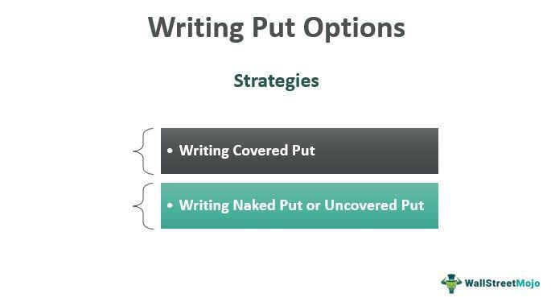

Financial derivatives are essential components of modern financial markets, serving as tools for investors to manage risks and engage in strategic asset positioning. These instruments derive their value from underlying assets, such as stocks, bonds, commodities, or currencies, and are utilized for hedging risks, speculating on future price movements, or arbitrage opportunities. Among the diverse range of financial derivatives, one notable type is the Bermuda option. This derivative combines aspects of American and European options, offering exercise flexibility on specified dates before expiration.

Bermuda options are particularly valuable in markets that deal with interest rates, foreign exchange, bonds, and equities, providing strategic benefits due to their structured exercise opportunities. Understanding the intricacies of Bermuda options, alongside other derivatives, requires an appreciation of their pricing models, market applications, and trading strategies.



In this article, we will address the key types of financial derivatives, elaborate on the characteristics and functions of Bermuda options, and examine how algorithmic trading enhances trading efficiency in derivatives markets.

## Table of Contents

## Understanding Financial Derivatives

Financial derivatives are financial instruments whose value is dependent on the value of underlying assets such as stocks, bonds, commodities, or currencies. These derivatives are vital in today's financial markets, offering various functions like risk management, price discovery, and access to a broader range of financial opportunities. Derivatives can be categorized into several main types, each serving different purposes: options, futures, forwards, and swaps.

**Options** are contracts that provide the buyer the right, but not the obligation, to buy or sell an asset at a predetermined price on or before a specified date. Options are primarily used for hedging and speculative purposes, allowing investors to manage potential price risks in an asset or to speculate on its future movements. Two basic types of options are call options, which grant the right to buy, and put options, which grant the right to sell. 

**Futures** are standardized contracts obligating the buyer to purchase, or the seller to sell, a specific asset at a predetermined future date and price. Unlike options, futures contracts require the transaction to occur, providing a firm commitment in the respective market. Futures are commonly used for hedging risks associated with fluctuations in commodity prices, interest rates, and currency exchange rates. These contracts are typically traded on exchanges and involve standardized terms.

**Forwards** are similar to futures contracts but are typically executed over-the-counter (OTC), meaning they are not traded on exchanges and can be customized to fit the needs of the parties involved. Forwards provide customizable agreements, which makes them suitable for specific needs, but they come with a higher degree of counterparty risk due to the lack of a centralized clearinghouse. Forwards, like futures, are used to hedge or speculate on the future price of an asset.

**Swaps** are another type of derivative involving the exchange of cash flows or other financial instruments between two parties. The most common type is an interest rate swap, where parties exchange fixed-rate interest payments for floating-rate ones, often to manage exposure to interest rate fluctuations. Swaps are used for hedging risks and improving capital efficiency.

Each derivative type plays significant roles in varied contexts:

1. **Hedging**: Investors and corporations use derivatives to reduce the risk of adverse price movements in an asset. For example, a farmer might use futures contracts to lock in the price of their crops, thus hedging against a fall in agricultural prices.

2. **Speculation**: Traders often engage in derivatives trading to bet on the future direction of market prices. Due to leverage inherent in derivatives, they can amplify returns though also increasing the potential for large losses.

3. **Arbitrage**: Traders exploit price discrepancies of an asset in different markets or derivative forms to achieve risk-free profits. By carefully analyzing market differences, opportunities for arbitrage can be identified and exploited through the use of derivatives.

Derivatives play a critical role in the financial ecosystem by improving [liquidity](/wiki/liquidity-risk-premium) and enhancing the efficiency of financial markets. They facilitate the management of financial risks inherent in market transactions, allowing individuals and institutions to execute complex trading strategies and manage financial exposures effectively.

## What Are Bermuda Options?

Bermuda options are a form of exotic option standing as an intermediary variant between American and European options. The defining characteristic of Bermuda options is their exercisability on predetermined dates prior to their expiration, typically structured in monthly increments. This offers increased flexibility over European options, which only allow execution on the expiration date, while imposing less frequent exercise opportunities than American options, which may be exercised at any point up until expiration.

The hybrid nature of Bermuda options provides several strategic advantages. These options are valuable in trading scenarios where investors seek a balance between the higher cost of American options, due to their full flexibility, and the limitations posed by European options with their single exercise date. Consequently, Bermuda options can be seen as a cost-effective tool for risk management and capitalizing on market movements that may not precisely coincide with the rigid timelines of European options.

Bermuda options find practical applications across various financial markets, including those involving interest rates, foreign exchange ([forex](/wiki/forex-system)), bonds, and stocks. In the [interest rate](/wiki/interest-rate-trading-strategies) markets, for instance, they prove useful as they allow investors to adjust positions at various points as significant economic data releases unfold. In forex trading, these options can provide an effective means to manage exposures to currency fluctuations over specified periods.

The pricing of Bermuda options, due to their exercisability feature, often requires more sophisticated models than standard options. The valuation typically leverages methods that can account for the multiple exercise opportunities, such as lattice-based methods or numerical solutions to the associated partial differential equations. This complexity reflects the necessity to understand the probabilistic and temporal components inherent in the multiple exercise dates of Bermuda options.

In summary, the strategic flexibility of Bermuda options makes them a popular choice among traders who wish to maintain a balance between cost and exercise frequency. Their presence in diverse markets underscores their adaptability and value as financial instruments for a broad spectrum of trading and hedging strategies.

## Advantages and Disadvantages of Bermuda Options

Bermuda options are financial derivatives with characteristics that position them between American and European options. They offer several advantages for investors looking to either hedge risks or take positions in various asset markets.

One of the primary advantages of Bermuda options is their lower premium costs compared to American options. The lower premium arises because Bermuda options can only be exercised on specific dates, rather than any time before the expiration date, thereby reducing the flexibility and, consequently, the cost. This makes them more cost-effective for traders while still offering more flexibility than European options, which can only be exercised at maturity.

In terms of exercise flexibility, Bermuda options provide more opportunities than European options. While European options restrict exercise to the expiration date, Bermuda options allow for exercise on several predetermined dates throughout the option's life. This feature offers investors some level of flexibility to respond to market movements without incurring the higher costs associated with American options.

However, Bermuda options are not without their drawbacks. A significant limitation is the restricted number of exercise dates, which might result in missing optimal trading conditions that arise between these dates. If the market moves favorably outside the predetermined exercise dates, the investor might not be able to capitalize on these movements, missing potential profit opportunities.

Another challenge with Bermuda options is their pricing complexity. The pricing models for Bermuda options need to account for the blend of American and European exercise features. Traditional models like Black-Scholes need to be adjusted to incorporate the unique characteristics of Bermuda options. These pricing models often require numerical methods, such as binomial trees or finite difference methods, to accurately evaluate Bermuda options. This added complexity can result in increased computational resources and the need for robust algorithmic frameworks: 

```python
import numpy as np

def bermuda_option_pricing(S, K, T, r, q, sigma, exercise_dates):
    # S: Current stock price
    # K: Strike price
    # T: Time to maturity in years
    # r: Risk-free interest rate
    # q: Dividend yield
    # sigma: Volatility
    # exercise_dates: List of allowable exercise times as fractions of T

    n = 1000  # Number of time steps
    dt = T / n
    u = np.exp(sigma * np.sqrt(dt))
    d = 1 / u
    p = (np.exp((r - q) * dt) - d) / (u - d)

    option_values = np.zeros((n+1, n+1))

    # Populate terminal node option values
    for i in range(n+1):
        option_values[i, n] = max(0, S * (u ** i) * (d ** (n-i)) - K)

    # Backtrack to calculate option value at t=0
    for j in range(n-1, -1, -1):
        for i in range(j+1):
            early_exercise = float(i/n in exercise_dates) * max(0, S * (u ** i) * (d ** (j-i)) - K)
            hold = np.exp(-r * dt) * (p * option_values[i+1, j+1] + (1-p) * option_values[i, j+1])
            option_values[i, j] = max(hold, early_exercise)

    return option_values[0, 0]

# Example parameters
current_price = 100
strike_price = 105
time_to_maturity = 1  # in years
risk_free_rate = 0.05
dividend_yield = 0.02
volatility = 0.2
allowed_exercise_dates = [0.25, 0.5, 0.75]  # e.g., quarterly

option_price = bermuda_option_pricing(current_price, strike_price, time_to_maturity, 
                                      risk_free_rate, dividend_yield, volatility, 
                                      allowed_exercise_dates)
print(f"Bermuda option price: {option_price}")
```

Overall, Bermuda options provide a useful balance of flexibility and cost-effectiveness, but they require sophisticated pricing models to fully assess their value and risks.

## Algorithmic Trading and Financial Derivatives

Algorithmic trading involves the use of computer algorithms to automate the execution of trades based on predefined criteria and strategies. This approach allows for the rapid processing of complex financial data, enabling traders to capitalize on market fluctuations with precision and speed. The implementation of [algorithmic trading](/wiki/algorithmic-trading) in financial derivatives, such as Bermuda options, significantly enhances the efficiency and effectiveness of trading activities.

Bermuda options, an exotic type of derivative, benefit from algorithmic trading through the ability to analyze large datasets and identify trends in market movements. Algorithms are capable of swiftly processing historical data, news feeds, and real-time market information to detect patterns that may indicate favorable trading opportunities. This capability is crucial for Bermuda options, where the timing of exercise is flexible within specified intervals, and identifying the optimal moments to exercise is essential for maximizing returns.

Advanced mathematical models are applied algorithmically to Bermuda options to achieve precise pricing and valuation. Among these, the modified Black-Scholes model and the Binomial model are prevalent. The Black-Scholes model, originally formulated for European options, is adapted for the unique features of Bermuda options by incorporating the capability to exercise at multiple points before expiration. The formula used in this context is:

$$
C = \sum_{i=1}^{N} p(i) \cdot B
$$

Where:
- $C$ represents the option’s price,
- $p(i)$ is the probability of exercising at the $i$th available date,
- $B$ is the present value of the payoff at the $i$th exercise date.

The Binomial model, on the other hand, constructs a lattice of potential future prices and evaluates the option at each node, incorporating the ability to exercise at specific times. This is implemented by recursively computing the option value backwards from expiration to the present time, considering both the probability of price movements and the multiple exercise dates specific to Bermuda options.

Python implementations of these models utilize libraries such as NumPy and SciPy to efficiently handle the computational demands. An example of a simple Binomial model for pricing a Bermuda option might involve constructing a binary tree to represent possible future asset prices and calculating option values at the nodes:

```python
import numpy as np

def binomial_bermuda_option(S, K, T, r, sigma, steps, exercise_dates):
    dt = T/steps
    u = np.exp(sigma * np.sqrt(dt))
    d = 1/u
    q = (np.exp(r*dt) - d) / (u - d)

    # Initialize asset prices at maturity
    asset_prices = np.array([S * (u**j) * (d**(steps-j)) for j in range(steps+1)])

    # Option value at maturity
    option_values = np.maximum(asset_prices - K, 0)

    for i in range(steps-1, -1, -1):
        option_values = np.exp(-r*dt) * (q * option_values[1:i+2] + (1-q) * option_values[0:i+1])
        # Exercise option at allowable dates
        if i in exercise_dates:
            option_values = np.maximum(option_values, asset_prices[0:i+1] - K)

    return option_values[0]

S = 100  # Current stock price
K = 100  # Strike price
T = 1    # Time to maturity in years
r = 0.05 # Risk-free interest rate
sigma = 0.2 # Volatility
steps = 100 # Number of steps in the binomial tree
exercise_dates = [20, 40, 60, 80, 100] # Allowable exercise dates

option_price = binomial_bermuda_option(S, K, T, r, sigma, steps, exercise_dates)
```

The code above defines a function to calculate the price of a Bermuda option through a Binomial model. By automating the calculation, traders can quickly evaluate numerous scenarios to derive strategic advantages in the market. As algorithmic trading continues to evolve, its integration with financial derivatives like Bermuda options promises even greater precision and agility in trading strategy execution.

## Implementing Trading Strategies with Bermuda Options

To effectively trade Bermuda options, investors employ a range of strategies that consider both the unique flexibility of Bermuda options and prevailing market conditions. Among these, the long straddle is a popular choice, designed to hedge against market [volatility](/wiki/volatility-trading-strategies). 

A long straddle strategy involves purchasing both a call and a put option with the same strike price and expiration date. The goal is to profit from significant price movements, regardless of the direction. This strategy benefits particularly from the ability of Bermuda options to be exercised on specific dates, providing opportunities to capitalize on price shifts within those periods.

Choosing the right strategy necessitates a thorough understanding of market conditions, including factors such as volatility, interest rates, and economic indicators. Additionally, investors must assess their risk tolerance and the specific characteristics of the Bermuda options they hold, including the predetermined exercise dates that might affect potential profits or losses.

Developing a sound Bermuda options trading strategy often involves integrating technical analysis with insights from algorithmic trading systems. Technical analysis can help identify patterns and trends, providing a foundation for predicting price movements. For instance, investors might analyze moving averages, Bollinger Bands, or other indicators to gauge market trends.

Algorithmic trading systems enhance this analysis by processing large datasets and executing trades at optimal times. Algorithms can apply advanced models, such as modified versions of Black-Scholes or binomial models, to evaluate the pricing and timing for exercising Bermuda options accurately. Here is a simple Python example demonstrating how one might begin to code an evaluation system for Bermuda options using a binomial approach:

```python
import numpy as np

def binomial_bermuda_option(S0, K, r, T, sigma, N, exercise_dates):
    dt = T / N
    u = np.exp(sigma * np.sqrt(dt))
    d = 1 / u
    p = (np.exp(r * dt) - d) / (u - d)

    # Create asset price tree
    asset_prices = np.zeros((N + 1, N + 1))
    asset_prices[0, 0] = S0
    for i in range(1, N + 1):
        for j in range(i + 1):
            asset_prices[j, i] = S0 * (u ** j) * (d ** (i - j))

    # Option value tree
    option_values = np.zeros_like(asset_prices)

    # Initialize option values at maturity
    option_values[:, N] = np.maximum(0, asset_prices[:, N] - K)

    # Backward induction for option valuation
    for i in range(N - 1, -1, -1):
        for j in range(i + 1):
            is_exercise_date = i * dt in exercise_dates
            value_if_held = np.exp(-r * dt) * (p * option_values[j + 1, i + 1] + (1 - p) * option_values[j, i + 1])
            if is_exercise_date:
                value_if_exercised = np.maximum(0, asset_prices[j, i] - K)
                option_values[j, i] = np.maximum(value_if_exercised, value_if_held)
            else:
                option_values[j, i] = value_if_held

    return option_values[0, 0]

# Parameters
S0 = 100  # initial stock price
K = 100   # strike price
r = 0.05  # risk-free rate
T = 1     # time to maturity
sigma = 0.2  # volatility
N = 50    # number of steps
exercise_dates = np.array([0.25, 0.5, 0.75])  # exercise opportunities

option_price = binomial_bermuda_option(S0, K, r, T, sigma, N, exercise_dates)
print("Bermuda Option Price:", option_price)
```

In this code, we utilize basic parameters such as initial stock price (S0), strike price (K), risk-free rate (r), time to maturity (T), volatility (sigma), and the number of binomial steps (N). The `exercise_dates` array specifies the points at which the Bermuda option can be exercised. This example demonstrates how computational techniques can aid in evaluating Bermuda options, providing traders with the necessary data to inform strategy decisions.

## Conclusion

Bermuda options offer a strategic blend of features from both American and European options, marking them as a sophisticated tool for managing financial risk and enhancing potential returns. Their structured exercise opportunities provide investors with a unique balance of flexibility and cost-effectiveness, making them an attractive choice in diverse markets like interest rates, forex, bonds, and stocks. Understanding the intricacies of these options can greatly enhance an investor’s or trader’s toolkit, highlighting the broader necessity of a solid grasp on various financial derivatives to drive trading efficiency.

The integration of advanced algorithmic trading techniques significantly enhances the efficacy of using Bermuda options. By enabling precise and rapid execution of trading strategies, algorithmic systems can efficiently assess large datasets, providing valuable insights into market trends and price movements. These systems often apply complex pricing models, such as modified versions of the Black-Scholes or Binomial models, to accurately determine the value and optimal exercise strategy for Bermuda options. This heightened level of precision and agility not only improves the accuracy of valuations but also optimizes the timing of trades, ensuring that opportunities are seized promptly.

As financial markets continually evolve, the importance of sophisticated instruments like Bermuda options and the role of algorithmic trading in refining strategies and execution cannot be overstated. Together, they represent the cutting edge of risk management and return optimization in the derivatives market, underscoring the dynamic and intricate nature of modern financial trading.

## References & Further Reading

[1]: Hull, J. C. (2017). ["Options, Futures, and Other Derivatives"](https://www.semanticscholar.org/paper/Options%2C-Futures%2C-and-Other-Derivatives-Hull/89bdee500c8623864fc9eb7a471546aa713acc44). Pearson Education.

[2]: Espen Gaarder Haug (2007). ["The Complete Guide to Option Pricing Formulas"](https://www.amazon.com/Complete-Guide-Option-Pricing-Formulas/dp/0071389970). McGraw-Hill.

[3]: Glasserman, P. (2004). ["Monte Carlo Methods in Financial Engineering"](https://archive.org/details/montecarlomethod0000glas). Springer.

[4]: Broadie, M., & Detemple, J. (1996). ["American Option Valuation: New Bounds, Approximations, and a Comparison of Existing Methods."](https://www.semanticscholar.org/paper/American-Option-Valuation%3A-New-Bounds%2C-and-a-of-Broadie-Detemple/869fdc89d5d8824c25691d52d14d460f6977dd3a) Management Science, 41(5), 845-864.

[5]: Wilmott, P. (2006). ["Paul Wilmott Introduces Quantitative Finance"](https://www.amazon.com/Paul-Wilmott-Quantitative-Finance-Set/dp/0470018704). Wiley.