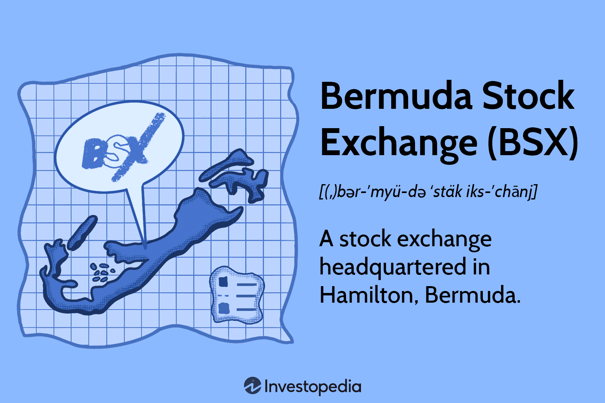

## Table of Contents

## What is the Bermuda Stock Exchange?

The Bermuda Stock Exchange, often called the BSX, is a stock exchange located in Bermuda. It started in 1971 and helps companies list their stocks and bonds so people can buy and sell them. The BSX is important because it helps companies raise money and lets investors trade in a safe and organized way.

The BSX is known for being one of the world's leading fully electronic offshore securities exchanges. This means that all trading happens using computers, which makes it fast and efficient. The exchange also follows strict rules to make sure everything is fair and transparent for everyone involved.

## Where is the Bermuda Stock Exchange located?

The Bermuda Stock Exchange, or BSX, is located in the city of Hamilton, which is the capital of Bermuda. Bermuda is a small island in the North Atlantic Ocean, and Hamilton is right in the middle of the island.

The BSX office is found at 30 Victoria Street in Hamilton. This location is easy to find and is in a busy part of the city, making it convenient for people who want to visit or work there.

## When was the Bermuda Stock Exchange established?

The Bermuda Stock Exchange, or BSX, was established in 1971. This means it has been helping companies and investors for over 50 years. 

The BSX is important because it gives companies a place to list their stocks and bonds. This helps companies get money they need to grow, and it lets people buy and sell these investments easily.

## What types of securities are traded on the Bermuda Stock Exchange?

The Bermuda Stock Exchange, or BSX, trades different types of securities. These include stocks, which are shares in a company that people can buy and sell. When you buy a stock, you own a small piece of that company. The BSX also trades bonds, which are like loans that companies or governments sell to people. When you buy a bond, you are lending money and will get it back with interest after a certain time.

Besides stocks and bonds, the BSX also trades other types of securities like mutual funds and exchange-traded funds (ETFs). Mutual funds are a way for people to invest in a mix of different stocks and bonds managed by professionals. ETFs are similar but can be traded like stocks during the day. The BSX makes sure all these trading activities happen in a safe and fair way for everyone involved.

## How does the Bermuda Stock Exchange contribute to the global financial market?

The Bermuda Stock Exchange, or BSX, helps the global financial market by being a place where companies from around the world can list their stocks and bonds. This is important because it gives these companies a way to raise money they need to grow their business. When companies list on the BSX, they can attract investors from different countries, which makes the global market more connected. The BSX is known for being safe and following strict rules, so investors feel confident when they trade there.

The BSX also helps the global market by offering a variety of securities like stocks, bonds, mutual funds, and ETFs. This variety gives investors more choices and helps them spread their investments across different types of assets. Since the BSX is fully electronic, trading can happen quickly and efficiently, which is important in today's fast-paced financial world. By providing a reliable and efficient platform, the BSX plays a key role in making the global financial market work smoothly and effectively.

## What are the listing requirements for companies on the Bermuda Stock Exchange?

To list on the Bermuda Stock Exchange, or BSX, a company needs to meet certain rules. First, the company must have a minimum of three years of operating history. This shows that the company is stable and has been working for a while. The company also needs to have enough money, usually at least $500,000 in shareholders' equity. This money helps make sure the company is financially strong enough to be on the exchange. 

Another important rule is that the company must have at least 25 shareholders, and these shareholders must own at least 25% of the company's shares. This helps make sure that the company's shares are spread out among different people, which is good for trading. The company also needs to follow all the laws and rules of Bermuda and the BSX, including reporting their financial information regularly. This keeps everything fair and open for everyone who wants to buy or sell the company's shares.

## How does the Bermuda Stock Exchange regulate trading activities?

The Bermuda Stock Exchange, or BSX, makes sure trading is safe and fair by following strict rules. They watch over all trading activities to make sure no one is cheating or breaking the rules. If someone does something wrong, the BSX can take action to stop it. They also have a team that checks all the information companies give out to make sure it's true and complete. This helps keep everything honest and open for everyone trading on the exchange.

The BSX also uses technology to help regulate trading. Since all trading happens on computers, the BSX can use special software to watch for any strange trading patterns or signs of trouble. This technology helps them catch problems quickly and keep the market running smoothly. By using both rules and technology, the BSX makes sure that trading on their exchange is safe and fair for everyone involved.

## What are the trading hours of the Bermuda Stock Exchange?

The Bermuda Stock Exchange, or BSX, is open for trading from Monday to Friday. The trading hours are from 10:00 AM to 4:00 PM, Bermuda time. This means that people can buy and sell stocks, bonds, and other securities during these hours.

These hours are set to match the working day in Bermuda. It makes it easy for people in Bermuda and other places to trade during their normal business hours. The BSX being open during these times helps everyone who wants to trade on the exchange.

## What is the BSX Index and how is it calculated?

The BSX Index is like a scorecard for the Bermuda Stock Exchange. It shows how well the stocks listed on the BSX are doing overall. When people look at the BSX Index, they can see if the stocks are going up or down, which helps them understand how the market is doing.

The BSX Index is calculated by looking at the prices of a group of stocks that are part of the index. These stocks are chosen because they are important and represent different parts of the market. The index starts with a base value, and then it goes up or down based on how the prices of these stocks change. This way, the BSX Index gives a quick snapshot of the market's health.

## How does the Bermuda Stock Exchange support economic development in Bermuda?

The Bermuda Stock Exchange, or BSX, helps Bermuda's economy grow by giving companies a place to raise money. When a company lists its stocks or bonds on the BSX, it can get money from investors. This money helps the company expand, hire more people, and bring new ideas to life. As these companies grow, they create jobs and boost the local economy. This makes Bermuda a better place to live and work because more people have jobs and the economy is stronger.

The BSX also brings more business to Bermuda by attracting companies from other countries to list their securities there. This makes Bermuda more important in the global financial world. When foreign companies list on the BSX, they often need services from local businesses, like lawyers and accountants. This creates more jobs and helps local businesses grow. By being a respected and well-regulated exchange, the BSX helps make Bermuda's economy more stable and attractive to investors from around the world.

## What are the major challenges faced by the Bermuda Stock Exchange?

One big challenge for the Bermuda Stock Exchange, or BSX, is competition from bigger stock exchanges around the world. Places like New York and London have a lot more companies listed and more people trading. This makes it hard for the BSX to attract new companies and investors. The BSX needs to find ways to stand out and show why it's a good place to list and trade securities.

Another challenge is keeping up with new technology. The BSX uses computers for all its trading, but technology changes fast. They need to keep their systems safe and up-to-date so people can trust them. This can be expensive and take a lot of work. The BSX also has to make sure it follows all the rules and keeps everything fair, which can be tough when things change quickly in the world of finance.

Lastly, the BSX needs to stay important in the global market. This means they have to keep attracting companies from around the world to list their stocks and bonds. If fewer companies list on the BSX, it can be harder for them to stay a big player in the financial world. The BSX works hard to show that it's a safe and good place for companies and investors, but it's a challenge to keep that reputation strong.

## How does the Bermuda Stock Exchange compare to other international stock exchanges in terms of market performance and size?

The Bermuda Stock Exchange, or BSX, is much smaller than big international stock exchanges like the New York Stock Exchange (NYSE) or the London Stock Exchange (LSE). The BSX has fewer companies listed and less trading happening every day. For example, the NYSE has thousands of companies listed and billions of dollars traded every day, while the BSX has a much smaller number of listings and trading [volume](/wiki/volume-trading-strategy). This makes the BSX a smaller player in the global market, but it still plays an important role for companies and investors in Bermuda and around the world.

In terms of market performance, the BSX can be more stable because it's smaller and less affected by big changes in the global market. When big stock exchanges go through ups and downs, the BSX might not feel these changes as much. This can be good for investors who want a safer place to trade. However, the smaller size also means there are fewer investment options and less [liquidity](/wiki/liquidity-risk-premium), which can make it harder for investors to buy and sell quickly. Overall, the BSX offers a different kind of opportunity compared to the bigger, more volatile international exchanges.

## References & Further Reading

[1]: Lopez de Prado, M. (2018). ["Advances in Financial Machine Learning"](https://www.amazon.com/Advances-Financial-Machine-Learning-Marcos/dp/1119482089). Wiley.

[2]: Aronson, D. R. (2007). ["Evidence-Based Technical Analysis: Applying the Scientific Method and Statistical Inference to Trading Signals"](https://onlinelibrary.wiley.com/doi/book/10.1002/9781118268315). Wiley.

[3]: Jansen, S. (2020). ["Machine Learning for Algorithmic Trading"](https://github.com/stefan-jansen/machine-learning-for-trading). Packt Publishing.

[4]: Chan, E. P. (2009). ["Quantitative Trading: How to Build Your Own Algorithmic Trading Business"](https://github.com/ftvision/quant_trading_echan_book). Wiley.

[5]: World Federation of Exchanges. ["The World Federation of Exchanges - Bermuda Stock Exchange Profile"](https://www.world-exchanges.org/).