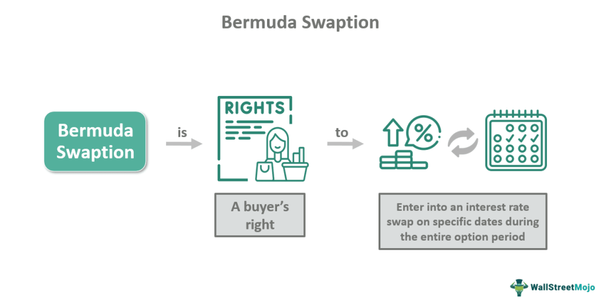

## Table of Contents

## What is a Bermuda Swaption?

A Bermuda Swaption is a type of financial option that gives the holder the right, but not the obligation, to enter into an interest rate swap on specific dates before the option expires. Unlike a regular swaption, which can only be exercised at the end of its term, a Bermuda Swaption can be exercised on several pre-determined dates. This flexibility makes it useful for managing interest rate risks over time.

Think of it like having multiple chances to make a decision about entering into a swap agreement. If interest rates move in a way that benefits you, you can choose to exercise the option on one of the allowed dates. If not, you can wait for the next opportunity or let the option expire without using it. This feature can be particularly helpful for businesses and investors who need to plan for future interest rate changes but want some control over when they act.

## How does a Bermuda Swaption differ from a European and American Swaption?

A Bermuda Swaption is different from a European and American Swaption mainly because of when you can use it. A European Swaption can only be used on its expiration date. This means you have to wait until the end of the option's life to decide if you want to enter into the swap. On the other hand, an American Swaption gives you more freedom because you can use it any time before it expires. This is useful if you need to act quickly when interest rates change.

A Bermuda Swaption falls in between these two. It lets you use the option on certain dates before it expires, but not any time like an American Swaption. These dates are set in advance, so you have more chances to act than with a European Swaption, but fewer than with an American one. This can be helpful if you want some flexibility but also need to plan around specific times.

## What are the common uses of Bermuda Swaptions in financial markets?

Bermuda Swaptions are often used by companies and investors to manage their exposure to interest rate changes. Imagine a company that has taken out a loan with a floating interest rate. If they think interest rates might go up, they can use a Bermuda Swaption to lock in a fixed rate at certain times in the future. This way, they can protect themselves from rising rates and plan their finances better. It's like having a safety net that they can use when it's most beneficial for them.

Another common use is for investors who want to take advantage of interest rate movements. If an investor believes rates will fall, they might buy a Bermuda Swaption to enter into a swap that benefits from lower rates. They can choose to exercise the option on one of the pre-set dates if their prediction comes true. This gives them the flexibility to act on their market views without committing to a swap right away. It's a strategic tool that helps them make the most of their investment decisions.

## What are the key features that define the style of a Bermuda Swaption?

The key feature that defines the style of a Bermuda Swaption is its exercise schedule. Unlike a European Swaption, which can only be exercised on its expiration date, a Bermuda Swaption allows the holder to exercise the option on several pre-determined dates before it expires. This gives the holder more flexibility than a European Swaption but less than an American Swaption, which can be exercised at any time before expiration.

This exercise schedule makes Bermuda Swaptions useful for managing interest rate risks over time. If interest rates move in a way that benefits the holder, they can choose to exercise the option on one of the allowed dates. If not, they can wait for the next opportunity or let the option expire without using it. This feature is particularly helpful for businesses and investors who need to plan for future interest rate changes but want some control over when they act.

## How is the pricing of a Bermuda Swaption affected by its exercise dates?

The pricing of a Bermuda Swaption is influenced a lot by when you can use it. These exercise dates are important because they give you more chances to act on interest rate changes than a European Swaption, but fewer than an American Swaption. If the exercise dates are spread out and cover times when interest rates might change a lot, the Bermuda Swaption could be more valuable. This is because you have more opportunities to use the option when it's most beneficial for you.

On the other hand, if the exercise dates are too far apart or don't match up well with when you expect interest rates to change, the Bermuda Swaption might not be as valuable. The pricing model takes into account how likely it is that you'll want to use the option on one of these dates. If the dates are not well-timed, the option might be cheaper because it's less likely to be used. So, the exercise dates play a big role in deciding how much a Bermuda Swaption is worth.

## What are the basic models used for pricing Bermuda Swaptions?

The basic models used for pricing Bermuda Swaptions are the Black model and the LIBOR market model. The Black model is simpler and treats the interest rate as a single variable that follows a lognormal distribution. It's easy to use and works well for European Swaptions, but it can be less accurate for Bermuda Swaptions because it doesn't account for the multiple exercise dates. The LIBOR market model, on the other hand, is more complex but better suited for Bermuda Swaptions. It models the entire yield curve and can handle the multiple exercise dates more accurately by simulating different interest rate paths.

The LIBOR market model works by simulating many possible future paths of interest rates and then calculating the value of the swaption for each path. This approach takes into account the flexibility of exercising the option on different dates, which is crucial for Bermuda Swaptions. While it's more computationally intensive than the Black model, it provides a more accurate valuation because it considers the impact of the exercise dates on the option's value. Both models are used in practice, but the choice depends on the need for accuracy versus the complexity of the calculation.

## How do interest rate models impact the valuation of Bermuda Swaptions?

Interest rate models are super important for figuring out how much a Bermuda Swaption is worth. These models help predict what interest rates might do in the future. For a Bermuda Swaption, this is key because you can use it on certain dates before it runs out. If the model says interest rates will change a lot, the swaption might be worth more because you have more chances to use it when it's good for you. The Black model is simple and looks at interest rates as one thing that moves in a certain way. But it's not always the best for Bermuda Swaptions because it doesn't consider all the different times you can use the option.

The LIBOR market model is more complicated but works better for Bermuda Swaptions. It looks at the whole interest rate curve and runs lots of different scenarios to see what might happen. This way, it can figure out the best times to use the swaption, which makes the pricing more accurate. The model takes into account that you might want to use the option at different times, so it's really good for understanding how valuable the flexibility of a Bermuda Swaption is. Both models are used, but the LIBOR market model gives a better picture because it matches the way Bermuda Swaptions work.

## What role does volatility play in the pricing of Bermuda Swaptions?

Volatility is a big deal when it comes to figuring out how much a Bermuda Swaption is worth. It's all about how much interest rates might jump around in the future. If the interest rates are expected to be really up and down, the swaption could be worth more. That's because the more the rates change, the more chances you have to use the swaption at a good time. The models that price these swaptions, like the Black model and the LIBOR market model, take this volatility into account. They look at how likely big changes in interest rates are and how that affects when you might want to use your swaption.

In simpler terms, if interest rates are expected to be all over the place, the value of your Bermuda Swaption goes up. This is because you have more opportunities to make a move that benefits you. The models that help price these swaptions consider this by running lots of different scenarios to see how things might play out. So, when interest rates are expected to be volatile, the swaption's price reflects that because it's more likely you'll find a good time to use it.

## Can you explain the impact of the term structure of interest rates on Bermuda Swaption pricing?

The term structure of interest rates is like a map that shows what interest rates are expected to be in the future at different times. For a Bermuda Swaption, this map is really important because you can use the swaption on certain dates before it expires. If the term structure shows that interest rates are going to change a lot over time, the swaption might be worth more. That's because you have more chances to use it when the rates are good for you. The pricing models, like the LIBOR market model, look at this term structure to figure out the best times to use the swaption and how much it should cost.

Think of it this way: if the term structure says that interest rates are going to go up and down a lot, your Bermuda Swaption becomes more valuable. You can wait for the right moment to use it, based on what the term structure predicts. The models that price these swaptions run lots of different scenarios using the term structure to see how things might play out. So, the term structure helps decide when you might want to use your swaption and how much it's worth because it gives you a peek into the future of interest rates.

## How do market participants hedge positions in Bermuda Swaptions?

Market participants hedge positions in Bermuda Swaptions by using other financial instruments that help reduce their risk. They might use interest rate swaps, which are agreements to exchange interest rate payments over time. If a participant thinks interest rates will go up, they could enter into a swap that benefits them if rates do rise. This way, if they need to use their Bermuda Swaption because rates are high, the swap helps cover any losses they might face.

Another way to hedge is by using other types of options, like European or American Swaptions. These options can be used to offset the risks of the Bermuda Swaption. For example, if a participant is worried about rates falling, they might buy a European Swaption that pays off if rates drop. By combining different types of options, they can create a strategy that protects them no matter which way interest rates move. This helps them manage their risk and make the most of their Bermuda Swaption.

## What advanced numerical methods are used to price Bermuda Swaptions accurately?

To price Bermuda Swaptions accurately, market participants often use advanced numerical methods like the Least Squares Monte Carlo (LSM) method. This method is great because it can handle the fact that you can use a Bermuda Swaption on different dates. It works by running lots of different scenarios of what interest rates might do in the future. For each scenario, it figures out the best time to use the swaption. By doing this over and over, it can give a good estimate of what the swaption is worth. The LSM method is really useful because it can deal with the tricky parts of pricing Bermuda Swaptions, like deciding when to use them.

Another method used is the Finite Difference Method. This one breaks down the problem into smaller pieces and solves it step by step. It looks at how the value of the swaption changes over time and with different interest rates. By doing this, it can figure out the best times to use the swaption and how much it should be worth. The Finite Difference Method is good for understanding how the swaption's value changes with different scenarios, making it another powerful tool for pricing Bermuda Swaptions accurately. Both methods help market participants get a better handle on the value of their swaptions and make smarter decisions.

## How do regulatory requirements influence the pricing and trading of Bermuda Swaptions?

Regulatory requirements can really change how Bermuda Swaptions are priced and traded. Rules like the ones from the Dodd-Frank Act in the U.S. or the European Market Infrastructure Regulation (EMIR) in Europe make it so that more trades have to go through clearing houses. This can make things safer, but it also means there are more costs and steps to take. Because of these rules, the price of a Bermuda Swaption might go up a bit because you have to pay for the clearing and other stuff. Also, these rules can make the market less flexible, which can affect how much people want to trade these swaptions.

On top of that, regulations can change how much risk banks and other traders are willing to take. If the rules are strict, traders might be more careful and not want to trade as much. This can make the market for Bermuda Swaptions smaller and less active. When fewer people are trading, it can be harder to find a good price for your swaption. So, the rules can make a big difference in how much a Bermuda Swaption is worth and how easy it is to trade them.

## What are Financial Derivatives and Options and how can they be understood?

Financial derivatives are intricate financial instruments used in investment and risk management strategies. They derive their value from the performance of an underlying asset, which can range from commodities and currencies to interest rates and market indices. The versatility of financial derivatives makes them indispensable tools in global financial markets.

Options are a fundamental type of derivative, providing the holder with the right, but not the obligation, to buy or sell an underlying asset at a predetermined price, known as the strike price, on or before a specific date, referred to as the expiration date. This flexibility allows investors to hedge potential losses or speculate on future price movements. Options are categorized primarily into two types: call options, which give the right to purchase, and put options, which give the right to sell.

Swaptions, on the other hand, combine the features of options and swaps, providing a sophisticated mechanism for [interest rate](/wiki/interest-rate-trading-strategies) management. A swaption offers the purchaser the right to enter into an interest rate swap agreement on a predetermined future date. In an interest rate swap, two parties exchange cash flows based on different interest rate benchmarks, typically switching between fixed and floating rates. This contract allows for strategic adjustments to an entity's exposure to interest rate fluctuations.

The strategic advantage of swaptions lies in their capacity to offer flexibility in managing interest rate risk. By allowing a future swap agreement, they give financial institutions and corporate treasurers the flexibility to lock in interest rates at a future date, aligning with anticipated changes in the market. This capability is particularly valued in volatile or uncertain economic conditions, where future interest rate movements can drastically impact financial performance.

The valuation of options and swaptions involves complex mathematical modeling, which generally takes into account factors such as the current price of the underlying asset, the [volatility](/wiki/volatility-trading-strategies) inherent in that asset, the time remaining to expiration, interest rates, and potential dividends or yields. In the case of options, models such as the Black-Scholes formula are commonly applied:

$$
C = S_0 N(d_1) - X e^{-rT} N(d_2)
$$

where:
- $C$ is the call option price,
- $S_0$ is the current stock price,
- $X$ is the strike price,
- $r$ is the risk-free interest rate,
- $T$ is the time to expiration,
- $N()$ is the cumulative distribution function of the standard normal distribution,
- $d_1$ and $d_2$ are intermediary calculations based on $S_0$, $X$, $r$, $T$, and the asset's volatility.

Swaptions require more comprehensive models due to the complexity of interest rate paths and their influence on financial contracts. Models like the Hull-White or LMM (Libor Market Model) are used to simulate future interest rate scenarios and determine the swaption's fair value. These models consider variables such as the swap rate volatility and the correlation between different interest rate movements over time.

In summary, financial derivatives like options and swaptions provide critical tools for risk management and speculative opportunities, with their value and utility tied to mathematical models that capture the nuances of market behavior and future projections.

## References & Further Reading

[1]: ["Options, Futures, and Other Derivatives"](https://www.amazon.com/Options-Futures-Other-Derivatives-10th/dp/013447208X) by John C. Hull

[2]: Andersen, L., & Piterbarg, V. (2010). ["Interest Rate Modeling"](https://www.amazon.com/Interest-Rate-Modeling-Structure-Models/dp/0984422110). Atlantic Financial Press.

[3]: Jäckel, P. (2002). ["Monte Carlo Methods in Finance"](https://www.amazon.com/Monte-Carlo-Methods-Finance-Jaeckel/dp/047149741X). Wiley.

[4]: Brace, A., Gatarek, D., & Musiela, M. (1997). ["The Market Model of Interest Rate Dynamics"](https://www.academia.edu/76804964/The_Market_Model_of_Interest_Rate_Dynamics), Mathematical Finance.

[5]: Glasserman, P. (2003). ["Monte Carlo Methods in Financial Engineering"](https://link.springer.com/book/10.1007/978-0-387-21617-1). Springer.

[6]: Rebonato, R. (2012). ["Modern Pricing of Interest-Rate Derivatives: The LIBOR Market Model and Beyond"](https://www.jstor.org/stable/j.ctt7rpkk). Princeton University Press.