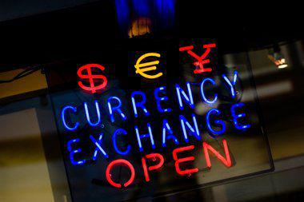

Bermuda, a British Overseas Territory occupying a strategic position in the North Atlantic Ocean, has cultivated a rich historical tapestry shaped by its colonial associations and pivotal trade route positioning. This article investigates into the development of Bermuda's distinct economic identity, tracing its roots back to the colonial era and highlighting the transformation of its monetary system. Central to this narrative is the evolution from the Bermudian pound to the Bermudian Dollar (BMD), which symbolizes Bermuda’s deliberate economic realignment from its British colonial legacy towards a more integrated relationship with the United States.

The BMD emerged in 1970, succeeding the Bermudian pound, in a move that strategically anchored Bermuda’s economic activities closer to the US market by establishing a 1:1 peg with the US Dollar. This shift not only facilitated smoother trade and tourism dynamics due to the dollar parity but also positioned Bermuda to better align itself economically in the Western Hemisphere's competitive landscape, dominated by US financial systems.



Understanding the BMD's conversion from the Bermudian pound reveals insights into Bermuda’s pursuit of economic stability and operational efficiency. This transition was not just a currency swap but a declaration of intent to bolster its economic sovereignty while maintaining substantial ties with the US, its main trading partner.

In the contemporary financial arena, the fixed exchange rate system of the BMD introduces unique opportunities and challenges, particularly in the sphere of algorithmic trading. The stable relationship between the BMD and USD offers intriguing prospects for algorithm-driven trading strategies, which can capitalize on the predictability of dollar parity while navigating the intricacies of Bermuda's financial markets.

Throughout this article, we will explore each facet of Bermuda’s history and economic evolution, emphasizing the significance of its currency journey and the modern implications of algorithmic trading involving the BMD. This exploration offers insight into Bermuda’s distinctive position as a small but economically significant player on the global stage.

## Table of Contents

## A Glimpse into Bermuda's History

Bermuda, located in the North Atlantic Ocean, has a history intertwined with significant global maritime routes and colonial pursuits. First discovered in 1505 by the Spanish navigator Juan de Bermúdez, the island was initially uninhabited. However, its strategic location midway between Europe and the Caribbean soon made it a crucial point for transatlantic navigation.

In 1609, Bermuda gained prominence when the British ship Sea Venture, en route to Jamestown, Virginia, was shipwrecked on its reefs. This event marked the beginning of permanent settlement by the British. The survivors of the shipwreck eventually established the first British colony on the island in 1612, and Bermuda became an important stopover for ships crossing the Atlantic. Throughout the 17th and 18th centuries, it developed a robust maritime industry, supported by its shipbuilding expertise and the navigational skills of its mariners.

The colonial era saw Bermuda as a strategic node in the broader British imperial system, with its economy heavily reliant on tobacco cultivation, salt production, and the transshipment of goods. Its location made it a critical naval base during periods of maritime conflict, including the American Revolution and the War of 1812, when it served as a hub for British naval operations.

Despite its status as a British Overseas Territory, Bermuda has cultivated a highly developed democratic system, characterized by its own parliament, the House of Assembly, established in 1620. The island enjoys a significant degree of self-governance, while defense and international relations remain under British jurisdiction. Over the years, Bermuda's political landscape has evolved, with its governance system adapting to contemporary democratic norms, blending historical legacies with modern political institutions.

## The Evolution of Bermudian Currency

The Bermudian Dollar (BMD) became the official currency of Bermuda in 1970, marking a significant shift in the island's financial landscape. Before the adoption of the BMD, Bermuda utilized the Bermudian pound, which was tied to the British pound sterling. This pegging reflected Bermuda's status as a British Overseas Territory, closely linked to the economic practices of the United Kingdom.

The transition from the Bermudian pound to the Bermudian Dollar represented a strategic move towards closer economic ties with the United States. By pegging the BMD to the US Dollar at a 1:1 ratio, Bermuda facilitated easier trade and financial interactions with its major trading partner, creating a more accessible environment for American tourists and investors. This alignment with the US economy highlighted the island's reliance on American economic activities and tourism, which remain a significant part of Bermuda's economic framework today.

The introduction of the BMD was also part of a broader global transition towards decimalization in currencies. Many countries around the world began shifting their currency systems to decimal-based systems in the mid to late 20th century. This trend was driven by the need for simplification and standardization in financial transactions, which facilitated easier trade and international financial operations. Decimalization made currencies easier to use in daily transactions, aligning them more effectively with global financial systems.

In summary, the evolution of Bermuda's currency from the Bermudian pound to the Bermudian Dollar was not only a reflection of a desire for economic realignment but also part of a larger global movement towards simpler, more efficient currency systems. Through such strategic alignment with the US Dollar, the BMD has effectively supported Bermuda's economic growth by anchoring it firmly in a stable and familiar economic zone.

## Understanding the Bermudian Dollar (BMD)

The Bermudian Dollar (BMD) closely resembles the US Dollar in its structure and usage, being divided into 100 cents and designated as BD$ to eliminate confusion with other dollar-denominated currencies. This similarity extends beyond its subdivision to its fixed exchange rate relationship with the US Dollar, maintaining a 1:1 parity. As such, one Bermudian Dollar is always equivalent to one US Dollar, a feature that simplifies many economic activities within Bermuda.

Unlike many other currencies, the BMD is generally not traded on international foreign exchange markets. Instead, it functions primarily within the confines of Bermuda, where it facilitates local transactions. However, the widespread acceptance of US Dollars on the island mitigates the need for BMD to circulate internationally. Both tourists and investors benefit from the convenience this acceptance provides, as they can use US Dollars to transact seamlessly without the necessity to exchange them for BMD.

The fixed exchange rate of the BMD to USD offers stability and predictability, which are advantageous for economic planning and investments. This stability is particularly appealing to American tourists and businesses familiar with the US Dollar, enhancing Bermuda's attractiveness as a travel and trade destination. For investors, understanding the fixed nature of the BMD is essential, as it poses unique considerations and opportunities that differ from those currencies subject to market fluctuations.

In conclusion, while the Bermudian Dollar is not a player in the global currency markets, its structural and functional similarities to the US Dollar, coupled with a stable exchange environment, play a critical role in the economic activities of Bermuda.

## Economic Significance of the BMD

The Bermudian Dollar (BMD) occupies a pivotal role in Bermuda’s economic framework, serving as a bridge that aligns closely with the economic dynamics of the United States. Given Bermuda's geographical and economic positioning, the island's economy is significantly influenced by its proximity to and relationship with the US. Approximately 75% of Bermuda's tourism and import activities are directly tied to the American market. This heavy reliance outlines a critical dependency not only for economic stability but also for growth opportunities within Bermuda.

The BMD’s 1:1 peg with the US Dollar represents a strategic simplification that enhances Bermuda’s attractiveness to American tourists and businesses. For American visitors, this simplifies financial transactions, effectively eliminating the need for currency exchange and mitigating concerns about fluctuating exchange rates. This parity serves to boost consumer confidence, allowing tourists to focus on leisure and exploration without monetary considerations, thereby enhancing Bermuda's competitiveness as a prime tourist destination.

Moreover, BMD's parity with the USD fosters an environment conducive to trade. For importers and exporters operating between the two regions, the currency stability mitigates the risks associated with exchange rate [volatility](/wiki/volatility-trading-strategies). Consequently, businesses can better forecast costs, revenues, and risks, promoting a more predictable economic landscape that can attract further investments.

The strategic alignment of the BMD with the USD underscores the importance of understanding this relationship for both tourists and investors alike. It creates a financial ecosystem that leverages US economic [momentum](/wiki/momentum) and stability, which is particularly crucial given Bermuda's limited domestic market size. The BMD not only acts as the backbone of domestic transactions but also as a symbol of economic integration with one of the world’s largest economies.

## Algorithmic Trading and BMD

Algorithmic trading involves the use of computer systems and pre-programmed trading instructions to execute trades across currencies, including the Bermudian Dollar (BMD). This form of trading capitalizes on the speed and efficiency of computers to exploit market conditions that may be less visible to human traders.

Given the BMD's status as a pegged currency, with its exchange rate fixed at 1:1 to the US Dollar (USD), [algorithmic trading](/wiki/algorithmic-trading) strategies primarily target patterns correlated with the USD's movements rather than seeking opportunities in BMD value fluctuations themselves. Forex algorithms that trade BMD often integrate economic indicators affecting the USD, such as U.S. Federal Reserve [interest rate](/wiki/interest-rate-trading-strategies) decisions, economic data releases, or geopolitical events, to make informed decisions.

Algorithmic strategies might include mean reversion or trend-following approaches. For example, a basic mean reversion model anticipates that if the USD/BMD's price deviates significantly from its historical mean price, it will eventually revert to that mean. Python provides libraries such as NumPy and pandas which traders can use to implement these strategies:

```python
import numpy as np
import pandas as pd
from statsmodels.tsa.stattools import adfuller

# Generate a sample dataset simulating USD/BMD prices
data = pd.Series(np.random.normal(1, 0.01, 1000))

# Calculate rolling mean and standard deviation
rolling_mean = data.rolling(window=20).mean()
rolling_std = data.rolling(window=20).std()

# Define mean reversion strategy
def mean_reversion_strategy(data, threshold=0.01):
    std_dev = rolling_std.mean()
    signals = (data - rolling_mean) / std_dev
    trade_signals = signals.apply(lambda x: 'buy' if x < -threshold else 'sell' if x > threshold else 'hold')
    return trade_signals

# Apply strategy
trade_signals = mean_reversion_strategy(data)
print(trade_signals)
```

Bermuda's financial institutions, such as the Bermuda Stock Exchange (BSX), provide platforms that support algorithmic trading. The BSX has increasingly embraced technological advancements, offering a robust trading environment where algorithmic strategies can be efficiently executed. While the BSX is not primarily a [forex](/wiki/forex-system) market, its infrastructure supports a range of financial instruments that may appeal to algorithmic traders looking for equity or bond opportunities alongside forex.

Moreover, the predictability of the BMD/USD exchange rate can make it an attractive asset for risk-averse investors leveraging algorithmic trading. While there are fewer opportunities for [arbitrage](/wiki/arbitrage) due to the fixed exchange rate, the stability allows for secure and consistent transactional frameworks appealing to institutional investors and hedge funds deploying low-risk management strategies.

Overall, while the algorithmic trading of currencies like the BMD is unique due to its pegged nature, it offers a substantial avenue for strategic investment utilizing technological trading advantages in Bermuda's financial markets.

## Conclusion

Bermuda's history and economic identity offer a distinct narrative in the context of global currencies, characterized by its transition from a colonial economy to a modern financial system anchored by the Bermudian Dollar (BMD). The BMD's fixed 1:1 exchange rate with the US Dollar provides significant stability to Bermuda’s economy, facilitating seamless trade and tourism transactions primarily with its largest economic partner, the United States. This stability is advantageous, fostering confidence in the Bermudian market and encouraging tourism, which is a critical component of the island's economy. However, it also presents unique challenges in financial trading scenarios, as the currency's movement is inherently tied to the fluctuations and policies impacting the US Dollar.

The exploration of the Bermudian Dollar through algorithmic trading reveals potential opportunities for innovative investment strategies. Given the BMD's stable and predictable nature due to its peg, algorithmic trading can leverage this stability to focus on specific pattern recognition tied to broader market movements or anomalies in USD valuation. Such strategies may include arbitrage trading, [statistical arbitrage](/wiki/statistical-arbitrage), or using [machine learning](/wiki/machine-learning) models to predict minor fluctuations that can be profitable in high-frequency trading environments. Furthermore, the presence of the Bermuda Stock Exchange provides a sophisticated platform where these strategies can be employed effectively to capitalize on Bermuda's economic structure.

In conclusion, while the Bermudian Dollar offers a unique case of economic stability in a global context, it also presents specific challenges and opportunities for traders and investors looking to implement algorithmic strategies. The inherent stability offers a secure foundation for those willing to innovate within the constraints of its fixed exchange mechanism, potentially unveiling lucrative avenues in a largely untapped market.

## References & Further Reading

[1]: ["Advances in Financial Machine Learning"](https://www.amazon.com/Advances-Financial-Machine-Learning-Marcos/dp/1119482089) by Marcos Lopez de Prado

[2]: ["Evidence-Based Technical Analysis: Applying the Scientific Method and Statistical Inference to Trading Signals"](https://www.amazon.com/Evidence-Based-Technical-Analysis-Scientific-Statistical/dp/0470008741) by David Aronson

[3]: ["Machine Learning for Algorithmic Trading"](https://github.com/stefan-jansen/machine-learning-for-trading) by Stefan Jansen

[4]: ["Quantitative Trading: How to Build Your Own Algorithmic Trading Business"](https://www.amazon.com/Quantitative-Trading-Build-Algorithmic-Business/dp/1119800064) by Ernest P. Chan

[5]: ["History of Bermuda"](https://en.wikipedia.org/wiki/History_of_Bermuda) - Encyclopaedia Britannica

[6]: Kennedy, J. C. G. (1970). "Decimalisation in the United Kingdom." The Manchester School, 38(3), 255-265. (Discusses global currency decimalization, relevant to Bermuda's adoption of a decimalized system)