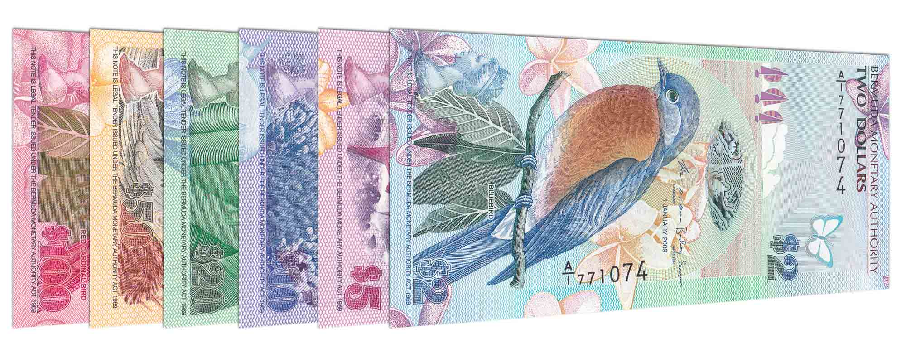

## Table of Contents

## What is the Bermudian Dollar?

The Bermudian Dollar is the official currency used in Bermuda, a small island in the Atlantic Ocean. It is also known as the Bermuda Dollar. The symbol for the Bermudian Dollar is $ or BD$, and it is divided into 100 cents. The Bermudian Dollar is issued by the Bermuda Monetary Authority, which is responsible for managing the currency and maintaining its stability.

The Bermudian Dollar is pegged to the United States Dollar at a 1:1 exchange rate. This means that one Bermudian Dollar is always equal to one US Dollar. This peg helps to keep the value of the Bermudian Dollar stable, which is important for Bermuda's economy because it relies heavily on tourism and international business. Both US Dollars and Bermudian Dollars are widely accepted in Bermuda, making it convenient for visitors and residents alike.

## What is the symbol and currency code for the Bermudian Dollar?

The symbol for the Bermudian Dollar is either $ or BD$. The $ symbol is used commonly, but to avoid confusion with other currencies like the US Dollar, BD$ is also used.

The currency code for the Bermudian Dollar is BMD. This code is used internationally to identify the Bermudian Dollar in financial transactions and on currency exchange platforms.

## How is the Bermudian Dollar used in Bermuda?

In Bermuda, people use the Bermudian Dollar every day to buy things like food, clothes, and other stuff they need. Shops, restaurants, and businesses in Bermuda take both Bermudian Dollars and US Dollars because they are worth the same. This makes it easy for tourists who visit the island to use their money without changing it.

The Bermudian Dollar is made by the Bermuda Monetary Authority, which is like a special bank that looks after the money. They make sure there is enough money for everyone and that it stays the same value as the US Dollar. Because Bermuda's economy depends a lot on tourists and big businesses from other countries, keeping the money stable is really important.

## What is the exchange rate of the Bermudian Dollar to the US Dollar?

The Bermudian Dollar and the US Dollar have the same value. This means that one Bermudian Dollar is always equal to one US Dollar. This is called a "peg," where the value of one currency is fixed to another.

Because of this peg, people in Bermuda can use both Bermudian Dollars and US Dollars to buy things. It makes it easy for tourists who visit Bermuda because they don't need to change their money. The Bermuda Monetary Authority makes sure that this exchange rate stays the same, which helps keep Bermuda's economy stable.

## When was the Bermudian Dollar first introduced?

The Bermudian Dollar was first introduced on February 6, 1970. Before that, Bermuda used the Bermudian pound, which was connected to the British pound. The change to the Bermudian Dollar happened because Bermuda wanted to make its money more stable and easier to use with the US Dollar.

When the Bermudian Dollar started, it was set to be the same value as the US Dollar. This was done to help Bermuda's economy, which depends a lot on tourists and businesses from other countries. The Bermuda Monetary Authority was created to look after the Bermudian Dollar and make sure it stays the same value as the US Dollar.

## What historical events have influenced the Bermudian Dollar?

The Bermudian Dollar was introduced in 1970, replacing the Bermudian pound. Before that, Bermuda used the Bermudian pound because it was a British colony, and the pound was linked to the British pound. But, Bermuda wanted to make its money more stable and easier to use with the US Dollar. So, they changed to the Bermudian Dollar and set it to be worth the same as the US Dollar. This helped Bermuda's economy because a lot of tourists and businesses from other countries come to Bermuda.

Since the Bermudian Dollar started, it has always been tied to the US Dollar. This means that no matter what happens with other money around the world, one Bermudian Dollar is always worth one US Dollar. This has kept Bermuda's money stable, which is good for the island's economy. The Bermuda Monetary Authority was set up to watch over the Bermudian Dollar and make sure it stays the same value as the US Dollar. This has been important for Bermuda, especially since the island depends a lot on tourism and international business.

## How has the value of the Bermudian Dollar changed over time?

Since the Bermudian Dollar started in 1970, its value has stayed the same as the US Dollar. This means that one Bermudian Dollar is always worth one US Dollar. This happened because Bermuda wanted to keep its money stable and easy to use for tourists and businesses from other countries. The Bermuda Monetary Authority makes sure that this stays true, and they work hard to keep the value the same.

Because the Bermudian Dollar is tied to the US Dollar, it doesn't go up or down like other money around the world. This has been good for Bermuda's economy because it makes it easier for people to come and spend money on the island. It also helps businesses that come from other countries because they know exactly how much their money is worth in Bermuda.

## What are the denominations of the Bermudian Dollar?

The Bermudian Dollar comes in different sizes of money. For paper money, there are bills that are worth 2, 5, 10, 20, 50, and 100 Bermudian Dollars. These bills have different colors and pictures on them to help people tell them apart. For smaller amounts of money, there are coins. The coins are worth 1, 5, 10, 25, and 50 cents, and there is also a 1 Dollar coin.

All of these different sizes of money make it easy for people in Bermuda to buy things they need. Whether someone is buying a big thing like a car or a small thing like a candy, they can use the right size of money. The Bermuda Monetary Authority makes sure there are enough of these different sizes of money for everyone in Bermuda to use.

## Who issues the Bermudian Dollar?

The Bermudian Dollar is issued by the Bermuda Monetary Authority. This special group is like a bank that looks after all the money in Bermuda. They make sure there is enough money for everyone and that it stays the same value as the US Dollar.

The Bermuda Monetary Authority is important because it helps keep Bermuda's economy stable. Bermuda depends a lot on tourists and big businesses from other countries, so having a stable currency is really helpful. By making sure the Bermudian Dollar stays the same as the US Dollar, the Bermuda Monetary Authority makes it easy for people to use their money in Bermuda.

## How is the Bermudian Dollar regulated?

The Bermudian Dollar is regulated by the Bermuda Monetary Authority. This group makes sure that the money in Bermuda stays stable and is the same value as the US Dollar. They do this by controlling how much money is made and by keeping an eye on the economy. The Bermuda Monetary Authority is like a special bank that looks after all the money in Bermuda, making sure there's enough for everyone and that it doesn't change in value.

Because Bermuda's economy depends a lot on tourists and businesses from other countries, having a stable currency is really important. The Bermuda Monetary Authority helps keep the economy strong by making sure that one Bermudian Dollar is always worth one US Dollar. This makes it easy for people to come to Bermuda and spend their money without worrying about changes in the value of the currency.

## What are the economic factors affecting the Bermudian Dollar?

The Bermudian Dollar's value stays the same as the US Dollar because it is pegged to it. This means that no matter what happens in the world, one Bermudian Dollar is always worth one US Dollar. The Bermuda Monetary Authority makes sure this happens by controlling how much money is made and by watching the economy closely. They do this because Bermuda's economy depends a lot on tourists and big businesses from other countries. If the value of the money changed a lot, it could make it hard for these people to come and spend their money in Bermuda.

Because of this peg, the main economic [factor](/wiki/factor-investing) that affects the Bermudian Dollar is the value of the US Dollar. If the US Dollar goes up or down, the Bermudian Dollar goes up or down with it. But since Bermuda uses both US Dollars and Bermudian Dollars, this doesn't cause big problems. The stability of the Bermudian Dollar helps keep Bermuda's economy strong and makes it easier for people to come and spend money on the island.

## How does the Bermudian Dollar compare to other Caribbean currencies?

The Bermudian Dollar is different from many other Caribbean currencies because it is tied to the US Dollar. This means that one Bermudian Dollar is always worth one US Dollar. Many other Caribbean countries have their own money that can change in value compared to the US Dollar. For example, the Jamaican Dollar, the Bahamian Dollar, and the Eastern Caribbean Dollar are all used in different Caribbean countries, but they do not stay the same value as the US Dollar. The Bahamian Dollar is also pegged to the US Dollar, but others like the Jamaican Dollar can go up or down.

Because the Bermudian Dollar is pegged to the US Dollar, it makes it easier for tourists and businesses from other countries to come to Bermuda. They know exactly how much their money is worth in Bermuda, so they don't have to worry about changes in the value of the money. This is different from other Caribbean countries where the value of the local money can change, which might make it harder for people to plan their trips or do business there. The stability of the Bermudian Dollar helps Bermuda's economy stay strong and makes it a more attractive place for visitors and investors.

## References & Further Reading

[1]: ["Advances in Financial Machine Learning"](https://www.amazon.com/Advances-Financial-Machine-Learning-Marcos/dp/1119482089) by Marcos Lopez de Prado

[2]: ["Evidence-Based Technical Analysis: Applying the Scientific Method and Statistical Inference to Trading Signals"](https://www.amazon.com/Evidence-Based-Technical-Analysis-Scientific-Statistical/dp/0470008741) by David Aronson

[3]: ["Machine Learning for Algorithmic Trading"](https://github.com/stefan-jansen/machine-learning-for-trading) by Stefan Jansen

[4]: ["Quantitative Trading: How to Build Your Own Algorithmic Trading Business"](https://www.amazon.com/Quantitative-Trading-Build-Algorithmic-Business/dp/1119800064) by Ernest P. Chan

[5]: ["History of Bermuda"](https://en.wikipedia.org/wiki/History_of_Bermuda) - Encyclopaedia Britannica

[6]: Kennedy, J. C. G. (1970). "Decimalisation in the United Kingdom." The Manchester School, 38(3), 255-265. (Discusses global currency decimalization, relevant to Bermuda's adoption of a decimalized system)