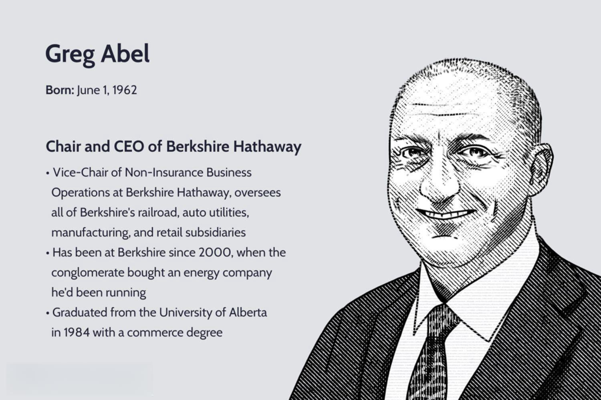

The world of trading has undergone a tremendous transformation with the continuous advancement of technology. Central to this revolution is algorithmic trading, which utilizes computer algorithms to automate trading decisions and strategies, increasing efficiency and precision in the markets. A pivotal figure in driving these advancements is Bernard Dan, whose distinguished career in the futures and trading industry showcases a series of notable achievements and contributions, particularly in algorithmic trading.

Throughout his career, Bernard Dan has significantly impacted trading platforms and the broader financial world. His influence spans executive roles in leading trading firms and notable advisory positions, highlighting his substantial role in the industry's evolution. His work has paved the way for more sophisticated, efficient trading practices, and his expertise continues to shape the future of financial markets.

This article focuses on Bernard Dan's journey in the trading industry, exploring his milestones, leadership roles, and the groundbreaking changes he has championed in algorithmic trading. It aims to highlight how his efforts have advanced market systems, contributing to transparency, efficiency, and fairness across global markets.

## Table of Contents

## Background and Career Path

Bernard Dan's career in the financial and trading industries can be traced back to his academic roots in accounting at St. John's University. This foundational education paved the way for his entry into the complex world of trading and financial markets.

In the early stages of his career, Dan held significant positions at the National Futures Association, where he contributed to the regulation and modernization of futures trading practices. His work there was augmented by his experience at Schultz & Chez, LLP, where he further honed his skills in financial regulation and compliance.

In 1985, Dan joined Cargill Investor Services, marking a significant step in his career trajectory. At Cargill, he undertook various roles, displaying a noteworthy blend of operational and leadership capabilities. His performance and strategic vision culminated in his appointment as CEO, where he oversaw significant expansions and improvements in the firm's operations, particularly in proprietary trading and risk management.

Following his success at Cargill, Bernard Dan moved to the Chicago Board of Trade (CBOT), serving as President and CEO. His tenure at CBOT was transformative; he played a pivotal role in the exchange's evolution from a member-owned organization to a public company. Under his leadership, CBOT achieved a historic milestone by going public in 2005, enhancing its competitiveness and global influence. Additionally, Dan was instrumental in the merger with the Chicago Mercantile Exchange, which formed the CME Group, setting a new standard in the futures trading industry.

After his impactful tenure at CBOT, Bernard Dan became CEO of MF Global, where he focused on integrating and streamlining the company's global operations. His expertise in futures trading and risk management was crucial during his time there, although he stepped down from this position in 2010. Dan's leadership at these prominent firms underscores his profound impact on the financial trading landscape.

## Leadership at the Chicago Board of Trade

Bernard Dan played a pivotal role in the transformation of the Chicago Board of Trade (CBOT) during his tenure as CEO. Under his strategic guidance, the CBOT transitioned from a member-owned cooperative to a publicly traded company, a significant shift that occurred when the organization went public in 2005. This move allowed CBOT to access wider capital markets, enhance its infrastructure, and become more competitive within the global trading landscape.

Dan's leadership was crucial in overseeing the monumental merger of the CBOT with the Chicago Mercantile Exchange (CME), resulting in the formation of the CME Group. This merger was a landmark event in the trading industry, creating one of the largest and most diverse derivatives marketplaces globally. The integration of these two historic exchanges facilitated greater efficiencies and a broader range of trading products and services. 

Through these strategic developments, Bernard Dan laid a robust foundation for the CBOT, contributing significantly to its evolution into a global leader in futures trading. This transformation allowed for the expansion of electronic trading platforms, improving [liquidity](/wiki/liquidity-risk-premium) and accessibility for traders worldwide. His visionary leadership provided a blueprint for other trading organizations seeking to modernize and adapt to the fast-paced changes in financial markets.

## Role in Algorithmic Trading

Bernard Dan has been a significant figure in the advancement of [algorithmic trading](/wiki/algorithmic-trading) through his leadership and strategic roles at various trading firms. At Sun Trading, Dan played a pivotal role in fostering a culture of innovation within proprietary trading. By leveraging algorithmic strategies, he enhanced market performance and efficiency, utilizing sophisticated quantitative methods and high-speed execution to optimize trading outcomes. Dan's approach emphasized the integration of advanced data analytics and [machine learning](/wiki/machine-learning) techniques to predict market movements, allowing Sun Trading to stay competitive in a rapidly evolving market landscape.

In his capacity as an advisor to OneChronos, Dan continues to influence the future of algorithmic trading by championing the development of AI-driven trading platforms. OneChronos focuses on using [artificial intelligence](/wiki/ai-artificial-intelligence) and machine learning to create more efficient and intelligent trading systems. These systems are designed to analyze large data sets in real-time, identifying patterns and executing trades with precision. Dan's insights and experience in the industry have been instrumental in guiding OneChronos' strategy, particularly in the advancement of expressive bidding and smart market technologies.

Expressive bidding and smart market technologies that Dan supports are revolutionizing how orders are matched and executed. Expressive bidding allows traders to communicate complex preferences and constraints within their bids, facilitating better price discovery and matching outcomes. This approach contrasts with traditional limit orders that provide limited information to the market. By enabling more expressive communication of trader intentions, market efficiency improves, resulting in reduced transaction costs and enhanced liquidity.

Smart market technologies, a focus of Dan's advisory work, involve the use of algorithms to dynamically adjust trading parameters based on real-time market conditions. These technologies improve decision-making processes by providing traders with optimal execution paths. The algorithms assess various factors such as [volatility](/wiki/volatility-trading-strategies), order flow, and historical data to determine the best execution strategies. This approach not only improves trading efficiency but also minimizes risk exposure, aligning with Dan's vision of a more robust and adaptive trading environment.

Through his strategic leadership and advisory roles, Bernard Dan has significantly impacted the evolution of algorithmic trading. His work continues to drive innovation, ensuring that trading platforms are not only faster and more accurate but also more adaptive to the needs of modern market participants.

## Advisory and Board Roles

Bernard Dan has played a pivotal role in the evolution of futures and trading industries through his involvement in various advisory and board capacities. His strategic insights have been instrumental in shaping policies and driving the direction of these financial sectors.

Dan's leadership is evident through his connections with key industry organizations such as New York Portfolio Clearing, the Depository Trust & Clearing Corporation (DTCC), and the Futures Industry Association (FIA). These organizations are central to the structuring and functioning of financial markets, providing critical services like clearing, settlement, and advocating for industry standards.

At New York Portfolio Clearing, Dan contributed to enhancing the clearing processes, ensuring they met the evolving needs of market participants. His work with the DTCC supported improvements in trade processing, risk management, and infrastructure resilience, vital for maintaining confidence in the financial system.

Serving as a senior advisor to OneChronos’ Board of Directors, Bernard Dan continues to drive innovation in algorithmic trading. OneChronos is known for leveraging advanced AI-driven platforms that optimize trade execution. Dan’s guidance has been crucial in developing these technologies, which rely on sophisticated algorithms to match and execute orders efficiently. His influence aids in promoting the adoption of smart market technologies, fostering an environment where adaptive and intelligent trading systems can thrive.

Through his board memberships, Bernard Dan has been a vocal advocate for practices that prioritize transparency, efficiency, and equity in trading. His efforts align with a broader industry push towards building frameworks that not only meet regulatory standards but also enhance the overall integrity and accessibility of financial markets globally.

## Educational and Personal Contributions

Beyond his notable professional achievements in the trading industry, Bernard Dan has made significant contributions to education and community development. His commitment to fostering educational growth is evident through his service on the boards of prestigious institutions such as Fenwick High School and St. John’s University. These roles allow him to influence educational strategies and policies, ensuring that institutions are well-equipped to prepare students for future challenges.

A dedicated advocate for youth education, Dan has also been involved with Operation Hope, an organization focused on financial literacy and economic empowerment. His participation reflects his commitment to improving financial literacy among young people, particularly in the Midwest region. By supporting programs that teach essential financial skills, Dan helps equip the next generation with the knowledge necessary to navigate the complexities of modern financial systems.

Furthermore, as an Eagle Scout, Dan embodies the values of leadership, service, and community involvement. His personal ethos dovetails with his professional endeavors, highlighting a consistent dedication to development and mentorship. These contributions underscore Dan's broader philosophy of fostering growth in both individual and organizational contexts, reflecting a commitment that extends well beyond the trading floor.

Through these educational and community initiatives, Bernard Dan continues to influence and inspire future generations, demonstrating that leadership is as much about uplifting others as it is about professional success. His efforts make clear that the true measure of influence includes the ability to empower and educate those who will shape the future.

## Conclusion

Bernard Dan's legacy in the trading and financial industries is characterized by a blend of innovation and adept leadership that has significantly influenced algorithmic trading. Throughout his career, Dan has demonstrated an exceptional ability to navigate and enhance complex market systems. This expertise has left a lasting impact on every organization he has been involved with, transforming their operations and positioning them at the forefront of the trading industry.

Dan's continued influence as an advisor and thought leader is poised to drive further advancements in algorithmic trading technology. His strategic insights and dedication to fostering innovation ensure that trading platforms evolve to meet the demands of modern financial markets. His role in developing AI-driven trading solutions, such as those at OneChronos, exemplifies his forward-thinking approach, prioritizing efficiency and transparency.

For future generations of finance and trading professionals, Bernard Dan's story is an inspiring testament to the power of visionary leadership and commitment to progress. His achievements offer a roadmap for those aspiring to make a meaningful impact in the world of trading, demonstrating the importance of continuous evolution and adaptation in a rapidly changing industry landscape.

## References & Further Reading

[1]: Bergstra, J., Bardenet, R., Bengio, Y., & Kégl, B. (2011). ["Algorithms for Hyper-Parameter Optimization."](https://dl.acm.org/doi/10.5555/2986459.2986743) Advances in Neural Information Processing Systems 24.

[2]: ["Advances in Financial Machine Learning"](https://www.amazon.com/Advances-Financial-Machine-Learning-Marcos/dp/1119482089) by Marcos Lopez de Prado

[3]: ["Evidence-Based Technical Analysis: Applying the Scientific Method and Statistical Inference to Trading Signals"](https://www.amazon.com/Evidence-Based-Technical-Analysis-Scientific-Statistical/dp/0470008741) by David Aronson

[4]: ["Machine Learning for Algorithmic Trading"](https://github.com/stefan-jansen/machine-learning-for-trading) by Stefan Jansen

[5]: ["Quantitative Trading: How to Build Your Own Algorithmic Trading Business"](https://www.amazon.com/Quantitative-Trading-Build-Algorithmic-Business/dp/1119800064) by Ernest P. Chan