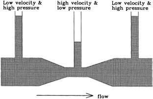

## Table of Contents

## What is Bernoulli's Hypothesis?

Bernoulli's Hypothesis, also known as Bernoulli's Principle, is a concept in fluid dynamics that explains how the speed of a fluid affects its pressure. It states that an increase in the speed of a fluid occurs simultaneously with a decrease in pressure or a decrease in the fluid's potential energy. This principle is named after Daniel Bernoulli, a Swiss mathematician who published it in his book "Hydrodynamica" in 1738.

This hypothesis is commonly used to explain how airplanes can fly. The shape of an airplane's wing, called an airfoil, is designed so that air flows faster over the top of the wing than underneath it. According to Bernoulli's Hypothesis, the faster air on top of the wing has lower pressure than the slower air below it. This difference in pressure creates lift, which helps the airplane to rise into the air.

## Who was Daniel Bernoulli and what was his contribution to the hypothesis?

Daniel Bernoulli was a Swiss mathematician and physicist born in 1700. He came from a family of famous mathematicians and scientists. Daniel studied many different subjects, but he became well-known for his work in fluid dynamics, which is the study of how liquids and gases move.

Bernoulli's big contribution was his hypothesis, now called Bernoulli's Principle. He wrote about it in his book "Hydrodynamica" in 1738. The principle says that when a fluid, like air or water, moves faster, its pressure goes down. This idea helps explain many things, like how airplanes fly. When air moves faster over the top of a wing, the pressure there is lower than below the wing, which creates lift and helps the plane stay in the air.

## How does Bernoulli's Hypothesis relate to probability theory?

Daniel Bernoulli, the person behind Bernoulli's Hypothesis, also made big contributions to probability theory. His most famous work in this area is called the "Bernoulli Trials." These are experiments where you do the same thing over and over, and each time you have the same chance of getting a certain result. For example, flipping a coin many times is a Bernoulli Trial because each flip has the same chance of landing heads or tails.

Bernoulli's work on probability helped him come up with the "Law of Large Numbers." This law says that if you do a lot of Bernoulli Trials, the average of your results will get closer and closer to the expected value. For example, if you flip a coin a million times, you should get close to half heads and half tails. This idea is really important in [statistics](/wiki/bayesian-statistics) and helps us understand how likely things are to happen when we do them many times.

## Can you explain the basic mathematical formulation of Bernoulli's Hypothesis?

Bernoulli's Hypothesis can be explained with a simple equation that shows how the speed of a fluid affects its pressure. The basic formula is: P + 1/2ρv^2 + ρgh = constant. Here, P is the pressure of the fluid, ρ (rho) is the density of the fluid, v is the speed of the fluid, g is the acceleration due to gravity, and h is the height of the fluid above some reference point. This equation says that the sum of the pressure, the kinetic energy per unit volume (1/2ρv^2), and the potential energy per unit volume (ρgh) is always the same at any point in the fluid.

In simpler terms, if the speed of the fluid (v) goes up, the pressure (P) must go down to keep the total energy the same. This is why Bernoulli's Hypothesis is important for things like airplane wings. When air moves faster over the top of the wing, the pressure there drops, creating a difference in pressure that lifts the plane. This principle helps explain how changes in speed and pressure work together in fluids.

## What are the key assumptions behind Bernoulli's Hypothesis?

Bernoulli's Hypothesis works well when we make a few important guesses about the fluid we're looking at. One big guess is that the fluid is ideal, which means it has no stickiness or friction. This makes it easier to figure out how the fluid moves because we don't have to worry about things like the fluid slowing down or getting stuck to surfaces. Another guess is that the fluid is not changing its density much. This means the fluid stays the same weight throughout, which helps keep the math simple.

Another important guess is that the flow of the fluid is steady. This means that at any point in the fluid, the speed and pressure stay the same over time. If the flow was changing a lot, it would be hard to use Bernoulli's Hypothesis because the pressure and speed would be all over the place. These guesses help make Bernoulli's Hypothesis a useful tool for understanding how fluids move and how changes in speed affect pressure.

## How is Bernoulli's Hypothesis applied in real-world scenarios?

Bernoulli's Hypothesis is used a lot in real life, especially when it comes to things that fly. Think about airplanes. The wings of an airplane are shaped in a special way so that air moves faster over the top of the wing than underneath it. According to Bernoulli's Hypothesis, when air moves faster, its pressure drops. So, the pressure on top of the wing is lower than the pressure underneath, and this difference in pressure helps lift the airplane into the sky. This is why Bernoulli's Hypothesis is so important in making sure airplanes can fly safely and efficiently.

Another place you see Bernoulli's Hypothesis in action is in sports, like soccer or baseball. When a soccer player kicks the ball, they often make it spin. The spinning ball causes the air to move faster on one side than the other, creating a difference in pressure. This difference in pressure makes the ball curve in the air, which can help players score goals or make tricky passes. In baseball, pitchers use the same idea to make the ball move in ways that can be hard for batters to hit. So, whether it's flying in the sky or curving on a field, Bernoulli's Hypothesis helps explain how things move through the air.

## What are the limitations of Bernoulli's Hypothesis?

Bernoulli's Hypothesis is really useful, but it doesn't work perfectly in every situation. One big problem is that it assumes the fluid is ideal, meaning it has no friction or stickiness. In real life, fluids like air and water do have some friction, which can slow them down and change how they move. This means that Bernoulli's Hypothesis might not give the exact right answer when we're dealing with real fluids that have friction.

Another limitation is that Bernoulli's Hypothesis works best when the fluid is moving in a steady way, meaning the speed and pressure stay the same over time. But in real life, things like turbulence can make the fluid's movement very uneven. When the flow is not steady, Bernoulli's Hypothesis can't explain what's happening as well. So, while it's a great tool for understanding many situations, it's important to remember its limits and use it carefully when the conditions aren't perfect.

## How does Bernoulli's Hypothesis differ from other probability theories?

Bernoulli's Hypothesis, or Bernoulli's Principle, is all about how fluids move and how their speed affects their pressure. It doesn't have anything to do with probability directly. Instead, it's a rule in physics that helps us understand why airplanes can fly or why a soccer ball curves in the air. The hypothesis says that when a fluid like air or water speeds up, its pressure goes down. This idea is very different from probability theories, which deal with how likely things are to happen.

On the other hand, Daniel Bernoulli, the person who came up with Bernoulli's Hypothesis, also worked on probability. He came up with the idea of Bernoulli Trials, which are experiments where you do the same thing over and over, like flipping a coin. Each time you do the experiment, you have the same chance of getting a certain result. This is part of probability theory, which is about figuring out chances and how often something might happen. So, while Bernoulli's Hypothesis is about fluid dynamics, Bernoulli's work in probability is about understanding and predicting the outcomes of repeated events.

## Can you discuss any major criticisms or controversies surrounding Bernoulli's Hypothesis?

Bernoulli's Hypothesis is a very useful idea, but it has some limits that people sometimes criticize. One big criticism is that it assumes the fluid is ideal, meaning it has no friction or stickiness. In real life, fluids like air and water do have friction, which can change how they move. This means that Bernoulli's Hypothesis might not give the exact right answer when we're dealing with real fluids. Another criticism is that it works best when the fluid is moving in a steady way, but in real life, things like turbulence can make the fluid's movement very uneven. When the flow is not steady, Bernoulli's Hypothesis can't explain what's happening as well.

Despite these criticisms, Bernoulli's Hypothesis is still very important and widely used. It helps explain many things, like how airplanes fly and why a soccer ball curves in the air. Scientists and engineers know about its limits and use it carefully, often combining it with other theories to get more accurate results. So, while it's not perfect, Bernoulli's Hypothesis remains a key tool in understanding fluid dynamics and has helped make many important discoveries and inventions possible.

## What are some advanced applications of Bernoulli's Hypothesis in fields like economics or engineering?

In engineering, Bernoulli's Hypothesis is used in many cool ways. One important use is in designing airplane wings and jet engines. The shape of an airplane's wing is made so that air moves faster over the top than the bottom, making the pressure lower on top. This difference in pressure lifts the airplane up into the sky. Engineers also use Bernoulli's Hypothesis when designing things like car spoilers and even the pipes that [carry](/wiki/carry-trading) water or gas. They need to know how the speed of the fluid affects its pressure to make sure everything works right and safely.

In economics, Bernoulli's Hypothesis might not seem like it fits at first, but it can actually help with some ideas. For example, some economists use it to think about how information flows through a market. Just like how air moves faster over a wing, information can move quickly through a market, affecting prices and decisions. This idea helps economists understand how markets work and how to make them more efficient. So, even though Bernoulli's Hypothesis started in physics, it can be used in other fields to solve different kinds of problems.

## How has Bernoulli's Hypothesis evolved since its inception?

Since Daniel Bernoulli first wrote about his hypothesis in 1738, scientists and engineers have learned a lot more about how it works and where it fits best. At first, Bernoulli's Hypothesis was a big new idea that helped explain how fluids move and how their speed affects their pressure. Over time, people realized that it works best when the fluid is moving in a steady way and when the fluid has no friction or stickiness. These limits helped scientists understand that Bernoulli's Hypothesis is a great tool, but it's not perfect for every situation.

As science and technology have grown, Bernoulli's Hypothesis has been used in more and more places. Engineers use it to design things like airplane wings, car spoilers, and even the pipes that carry water or gas. They've learned how to combine Bernoulli's Hypothesis with other theories to get more accurate results, especially when dealing with real fluids that have friction. In other fields like economics, people have started using the ideas behind Bernoulli's Hypothesis to understand how information moves through markets. So, while the basic idea hasn't changed, the way we use and think about Bernoulli's Hypothesis has evolved a lot since it was first introduced.

## What are current research trends or future directions related to Bernoulli's Hypothesis?

Right now, scientists are looking at ways to make Bernoulli's Hypothesis work better in real-life situations. They know that the hypothesis works well when the fluid is moving smoothly and has no friction, but in the real world, fluids like air and water do have friction. So, researchers are trying to figure out how to adjust Bernoulli's Hypothesis to account for this friction. They're using computer simulations and new math models to understand how fluids move in more complex ways, like when they're turbulent or when they're flowing through different shapes of pipes and channels.

In the future, Bernoulli's Hypothesis might be used in even more fields. For example, engineers are working on new designs for wind turbines and hydroelectric dams, where understanding how air and water move can make these machines more efficient. Also, in medicine, researchers are looking at how Bernoulli's Hypothesis can help with things like blood flow in the body. By understanding how blood moves through arteries and veins, doctors might be able to find new ways to treat diseases. So, while Bernoulli's Hypothesis has been around for a long time, it's still helping us learn new things and solve new problems.

## What is Bernoulli's Hypothesis?

Bernoulli's Hypothesis, formulated by Daniel Bernoulli, presents a pioneering approach to understanding human behavior in decision-making scenarios characterized by uncertainty. This hypothesis fundamentally shifts the focus from merely assessing possible monetary outcomes to considering the potential utility derived from risky actions. 

At the core of Bernoulli's Hypothesis is the concept of expected utility, wherein the value of a decision is perceived not solely in terms of its monetary gain or loss but rather the subjective satisfaction or utility it provides to an individual. Mathematically, this is represented through the expected utility function:

$$
U(x) = \sum_{i=1}^{n} p_i u(x_i)
$$

where $U(x)$ is the expected utility, $p_i$ represents the probability of an outcome $x_i$, and $u(x_i)$ is the utility function for that outcome.

This hypothesis elucidates critical behavioral phenomena including risk aversion, where individuals favor safer outcomes over riskier ones with identical expected monetary value. Bernoulli demonstrated that as wealth increases, the additional utility gained from incremental wealth decreases; a concept known as diminishing marginal utility. The utility function typically exhibits a concave shape, reflecting this diminishing return:

$$
U(w) = \log(w)
$$

where $w$ denotes wealth, acknowledging that additional increments of wealth confer progressively less marginal utility.

The implications of Bernoulli's Hypothesis extend into financial decision-making, providing a psychological perspective on how individuals evaluate risk in terms of subjective satisfaction rather than just absolute monetary value. It explains why some individuals may reject favorable bets based on potential monetary benefits due to perceived risks outweighing their utility gains. Understanding this hypothesis assists in discerning the complex interplay between perceived utility and decision-making, offering insights critical for financial strategists and economists aiming to predict market behaviors influenced by individual risk preferences.

## What is Bernoulli's Principle?

Bernoulli's Principle is a foundational concept in the field of fluid dynamics, detailing the inverse relationship between the velocity of a fluid and its pressure. Essentially, within a streamline flow, an increase in the fluid’s velocity results in a decrease in its pressure, and vice versa. This principle can be derived from the law of conservation of energy, applied to a moving fluid.

Consider a fluid flowing through a pipe of varying diameter. According to Bernoulli's equation, which is an expression of the principle, the total mechanical energy along a streamline remains constant. This energy balance is expressed as:

$$
P + \frac{1}{2} \rho v^2 + \rho gh = \text{constant}
$$

Here, $P$ represents the fluid pressure, $\rho$ is the fluid density, $v$ is the velocity of the fluid, $g$ is the acceleration due to gravity, and $h$ is the elevation height of the fluid. The three terms in the equation represent the pressure energy, kinetic energy, and potential energy per unit [volume](/wiki/volume-trading-strategy) respectively.

One of the most well-known applications of Bernoulli's Principle is the lift generated by airplane wings. As air travels over the curved top surface of a wing, it moves faster than the air traveling beneath the wing. According to Bernoulli's Principle, this increase in velocity results in a decrease in pressure above the wing, thus creating lift.

In engineering applications, Bernoulli's Principle is crucial for understanding fluid flow in pipelines. When the diameter of a pipe decreases, the velocity of the fluid must increase to satisfy the continuity equation of mass conservation, leading to a corresponding drop in pressure. This understanding helps in the design of various pipe systems to ensure efficient and safe transport of fluids.

These applications underscore the principle’s role in highlighting the trade-offs between kinetic and potential energies within a fluid in motion, helping to explain and predict fluid behavior in diverse scenarios.

## References & Further Reading

[1]: Bernoulli, D. (1954). ["Exposition of a New Theory on the Measurement of Risk."](https://www.semanticscholar.org/paper/Exposition-of-a-New-Theory-on-the-Measurement-of-Bernoulli/ef512f15aa1c294c7575aa329a7fecd80be6633b) Econometrica, 22(1), 23–36.

[2]: Pareto, L. (2013). ["Expected Utility Hypothesis."](https://en.wikipedia.org/wiki/Expected_utility_hypothesis) Springer, Encyclopedia of Behavioral Medicine.

[3]: Malkiel, B. G. (2019). ["A Random Walk Down Wall Street: The Time-Tested Strategy for Successful Investing"](https://www.amazon.com/Random-Walk-Down-Wall-Street/dp/1324002182) (12th ed.). W. W. Norton & Company.

[4]: White, E. (2018). ["Fluid Mechanics"](https://www.mheducation.com/highered/product/Fluid-Mechanics-White.html) (3rd ed.). McGraw-Hill Education.

[5]: Wilmott, P. (2006). ["Paul Wilmott Introduces Quantitative Finance"](https://www.amazon.com/Paul-Wilmott-Quantitative-Finance-Set/dp/0470018704) (2nd ed.). Wiley.

[6]: Pindyck, R. S., & Rubinfeld, D. L. (2017). ["Microeconomics"](https://archive.org/details/microeconomics0007pind) (9th ed.). Pearson.