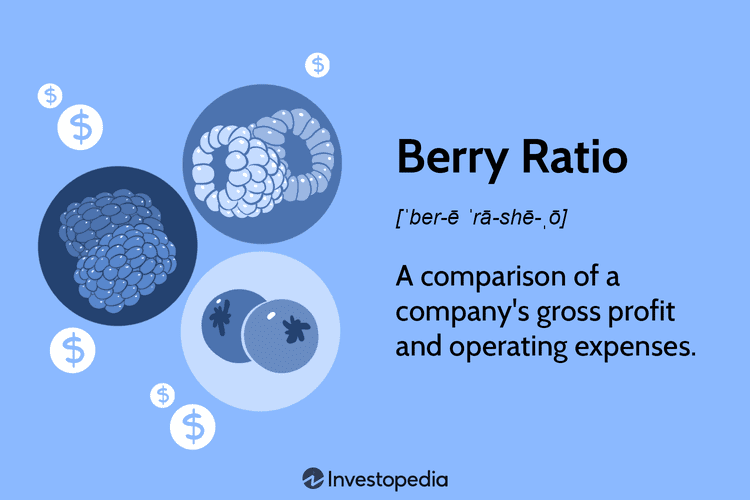

The world of financial analysis is evolving continuously, driven by the desire to fine-tune methodologies and metrics that capture an entity's profitability and operational performance. Among the metrics garnering increasing attention is the Berry Ratio. This financial ratio, rooted in the complexities of transfer pricing, evaluates a company's gross profit against its operating expenses, thereby offering insights into its value-adding capabilities. Recent developments in financial analysis have expanded the Berry Ratio's use beyond its original context, notably finding applications in algorithmic trading, a sector that relies heavily on precise metrics to inform decision-making processes.

Understanding the fundamentals of the Berry Ratio is invaluable for financial analysts and investors, as it can serve as a viable tool for improvement in profitability measurement. The ability to interpret this ratio can yield significant insights, allowing analysts to assess financial strength and potential vulnerabilities comprehensively. As we explore the formula, interpretation, and strategic application of the Berry Ratio, we highlight its potential to enhance the performance of algorithmic trading strategies. Armed with this knowledge, investors and traders can make more informed and potentially lucrative decisions in an ever-changing financial landscape.



## Table of Contents

## Understanding the Berry Ratio

The Berry Ratio is a financial tool designed to evaluate a company's ability to add value through its operations by comparing gross profit to operating expenses. The formula for the Berry Ratio is:

$$
\text{Berry Ratio} = \frac{\text{Gross Profit}}{\text{Operating Expenses}}
$$

This metric was introduced by Dr. Charles Berry primarily for transfer pricing purposes, which involves determining the appropriate pricing of goods and services exchanged between divisions of multinational companies. The Berry Ratio specifically measures a company's value-adding capabilities by determining whether the gross profit generated is sufficient to cover its operating expenses. A Berry Ratio greater than 1 suggests that the company generates sufficient profit from its core activities and demonstrates financial health and operational efficiency. Conversely, a ratio below 1 signals that operating expenses may outstrip gross profit, indicating potential financial strain.

Understanding the Berry Ratio becomes particularly advantageous in financial analysis for several reasons. Firstly, it provides a straightforward way to evaluate the profit structure of companies, especially in sectors where effective cost management is a critical component of financial success. Additionally, the Berry Ratio's simplicity and focus on operational efficiency make it a valuable complement to other financial metrics in an analyst's toolkit. By enabling comparisons over time or between companies with similar operational models, the Berry Ratio offers insights into relative financial performance and value addition.

Overall, mastering the Berry Ratio's fundamentals can aid financial professionals in making more nuanced evaluations of a company's operational strength, beyond the more commonly used profitability ratios.

## Formula and Calculation of the Berry Ratio

Calculating the Berry Ratio involves a simple formula, where the gross margin is divided by operating expenses. This financial metric provides insight into a company's efficiency in generating gross profit from its operating costs.

### Formula

The Berry Ratio is calculated using the following formula:

$$
\text{Berry Ratio} = \frac{\text{Gross Margin}}{\text{Operating Expenses}}
$$

where:
- **Gross Margin** is defined as total sales minus the cost of goods sold (COGS). It represents the residual profit after covering the production cost of the goods sold.
- **Operating Expenses** include all the costs incurred in the day-to-day functioning of a business, such as wages, rent, utilities, and administrative expenses.

### Calculation Steps

#### Example

Consider a company with the following financial data:

- Total Sales: $500,000
- Cost of Goods Sold (COGS): $300,000
- Operating Expenses: $100,000

1. **Calculate Gross Margin**
$$
   \text{Gross Margin} = \text{Total Sales} - \text{COGS} 

$$
$$
   \text{Gross Margin} = 500,000 - 300,000 = 200,000

$$

2. **Calculate the Berry Ratio**
$$
   \text{Berry Ratio} = \frac{\text{Gross Margin}}{\text{Operating Expenses}} 

$$
$$
   \text{Berry Ratio} = \frac{200,000}{100,000} = 2

$$

This Berry Ratio of 2 indicates that for every dollar spent on operating expenses, the company generates $2 in gross profit, suggesting a strong capacity to cover its operating costs.

#### Python Code Example

For further illustration, here's how you might perform this calculation using Python:

```python
# Financial data
total_sales = 500000
cogs = 300000
operating_expenses = 100000

# Calculate Gross Margin
gross_margin = total_sales - cogs

# Calculate Berry Ratio
berry_ratio = gross_margin / operating_expenses

print("Gross Margin:", gross_margin)
print("Berry Ratio:", berry_ratio)
```

This Python code snippet outputs the gross margin and Berry Ratio, providing a straightforward way to apply this calculation across different datasets or scenarios. The Berry Ratio thus serves as a valuable tool in financial analysis, helping to assess a company's profitability and operational efficiency.

## Applications in Financial Analysis

While its original use was in transfer pricing, the Berry Ratio has broadened its scope as a valuable tool in financial analysis. This metric primarily focuses on understanding a company’s profitability and operational efficiency by comparing its gross profit to its operating expenses. Such insights are particularly crucial in sectors where cost management is intricate, and companies strive to maximize value addition and efficiency.

One of the key applications of the Berry Ratio in financial analysis is its ability to offer clarity regarding a company's value-adding capabilities. By assessing the gross profit — which is the revenue remaining after subtracting the cost of goods sold — relative to operating expenses, analysts can ascertain how effectively a company is converting its expenditures into profitable outcomes. Mathematically, this is represented as:

$$
\text{Berry Ratio} = \frac{\text{Gross Profit}}{\text{Operating Expenses}}
$$

A Berry Ratio greater than one generally signifies that a company is generating enough gross profit to cover its operating costs, indicating robust financial health. Conversely, a ratio below one can suggest that the company is potentially overextending itself on operational spending without commensurate gross profit, which may lead to profitability issues.

In practice, the Berry Ratio is particularly useful for comparing financial health across businesses that operate under similar structures but may have different scales of operation. For instance, in industries such as retail or manufacturing, where multiple companies might have similar business models but varying scales, the Berry Ratio serves as a normalized metric that allows for direct comparison of their operational efficiency and value creation.

By focusing on this ratio, analysts can better understand the cost structures and profitability dynamics within an industry, enabling more informed and strategic decision-making. Moreover, this metric can assist in identifying potential areas for improvement or risk, making it a significant tool for financial analysts looking to enhance their analytical frameworks. As such, integrating the Berry Ratio into broader financial analysis workflows can provide deeper insights into a company's ability to manage costs and generate profits effectively, making it a valuable component of comprehensive financial assessment.

## Leveraging Berry Ratio in Algorithmic Trading

Algorithmic trading uses various metrics to evaluate performance and mitigate risk. The Berry Ratio can be a valuable addition to these metrics, helping traders assess profitability by comparing gross margins to operating expenses. Understanding a company's profitability on this granular level can clarify decisions when determining the viability of potential investments or trades.

Integrating the Berry Ratio into [algorithmic trading](/wiki/algorithmic-trading) strategies involves using this ratio as a signal to adjust positions in response to changes in financial health. For instance, a high Berry Ratio may suggest a strong ability to generate profit from current operating expenses, prompting an algorithm to increase positions in a profitable company. Conversely, a low Berry Ratio could trigger a sell-off or short position, reflecting potential inefficiencies or overvaluation.

When combined with traditional metrics like the Sharpe Ratio and Maximum Drawdown, the Berry Ratio enhances performance assessment. The Sharpe Ratio evaluates risk-adjusted returns, offering insight into how much risk is taken for a given level of return. Maximum Drawdown quantifies the maximum loss from peak to trough, helping traders understand the potential downside risk. Together with these metrics, the Berry Ratio provides a more comprehensive view of a company's operational efficiency and risk profile, allowing for more nuanced trading strategies.

To illustrate the utility of the Berry Ratio in algorithmic trading strategies, consider a Python algorithm designed to incorporate this ratio with other financial metrics:

```python
import numpy as np
import pandas as pd

def calculate_berry_ratio(gross_profit, operating_expenses):
    return gross_profit / operating_expenses if operating_expenses != 0 else np.nan

def trading_decision(berry_ratio, sharpe_ratio, max_drawdown):
    if berry_ratio > 1 and sharpe_ratio > 0.5 and max_drawdown < 0.2:
        return "Buy"
    elif berry_ratio < 1 or sharpe_ratio < 0.2 or max_drawdown > 0.5:
        return "Sell"
    else:
        return "Hold"

# Example financial data
gross_profit = pd.Series([200000, 180000, 220000])
operating_expenses = pd.Series([160000, 150000, 180000])
sharpe_ratios = pd.Series([0.6, 0.4, 0.7])
max_drawdowns = pd.Series([0.15, 0.25, 0.18])

berry_ratios = calculate_berry_ratio(gross_profit, operating_expenses)
decisions = [trading_decision(berry, sharpe, drawdown) 
             for berry, sharpe, drawdown in zip(berry_ratios, sharpe_ratios, max_drawdowns)]

for i, decision in enumerate(decisions):
    print(f"Period {i+1}: Berry Ratio = {berry_ratios[i]:.2f}, Decision = {decision}")
```

This simple model considers the Berry Ratio alongside the Sharpe Ratio and Maximum Drawdown. By establishing conditions for buying, selling, or holding, it aims to leverage a company's profitability and operational efficiency within broader trading contexts.

In summary, the Berry Ratio offers a unique perspective on operational profitability that, when integrated with other metrics, strengthens algorithmic trading strategies. As algorithmic trading continues to evolve, incorporating multi-layered financial analyses becomes not just beneficial but essential in navigating increasingly complex financial landscapes.

## Conclusion

In the fast-paced world of finance, having diverse analytical tools can provide a competitive edge. The Berry Ratio, although underutilized, offers significant insights into profitability and operational efficiency. By evaluating the relationship between gross profit and operating expenses, this ratio aids in identifying the value-adding capabilities of a business, an aspect crucial for investors and analysts seeking to optimize their evaluations.

Its application in algorithmic trading can enhance decision-making by adding layers of analysis. Algorithmic trading strategies thrive on metrics that aid in accurately assessing financial health and potential risks. Incorporating the Berry Ratio into these strategies provides an additional measure to evaluate the profitability of investment choices, complementing traditional metrics such as the Sharpe Ratio and Maximum Drawdown. This inclusion allows traders to make more comprehensive assessments of the underlying value of their trades, which can lead to more optimized trading decisions.

As financial markets continue evolving, integrating versatile metrics like the Berry Ratio is vital in crafting optimized trading strategies. Through its ability to highlight both profitability and operational efficiency, the Berry Ratio enables market participants to refine their analytical frameworks, ultimately enhancing performance and resilience in volatile market conditions.

## References & Further Reading

[1]: Berry, C. H. (1972). ["Corporate Growth and Diversification."](https://www.jstor.org/stable/pdf/724951.pdf) Princeton University Press.

[2]: Eden, L., & Smith, L. A. (2001). ["The Methods and Uses of Comparable Transaction-based Transfer Pricing."](https://www.researchgate.net/publication/347941680_Transfer_Pricing_Purpose_of_Determination_and_Factors_Affecting_Transfer_Pricing_Determination) Journal of International Management, 7(4), 353-368.

[3]: Kazemi, H., & Markowitz, H. M. (2003). ["Systemic Risk and Alternative Investment Strategies."](https://people.umass.edu/~kazemi/An%20Introduction%20to%20Risk%20Parity.pdf) Financial Analysts Journal, 59(4), 16-24.

[4]: ["Transfer Pricing Manual: OECD Guidelines for Multinational Enterprises and Tax Administrations."](https://www.oecd.org/en/publications/oecd-transfer-pricing-guidelines-for-multinational-enterprises-and-tax-administrations-2022_0e655865-en.html) OECD Publishing.

[5]: ["Fundamentals of Algorithmic Trading"](https://www.tejwin.com/en/insight/what-is-algorithmic-trading-a-beginners-guide-to-algorithmic-trading-including-tutorials-pros-and-cons-and-common-strategies/) by R. Komstadius.