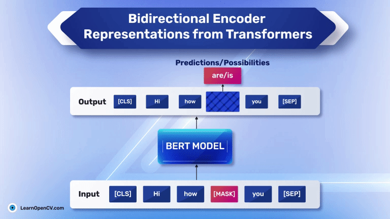

## Table of Contents

## What is BERT and what does it stand for?

BERT is a type of artificial intelligence model used for understanding and processing human language. It stands for Bidirectional Encoder Representations from Transformers. This model is special because it looks at words in a sentence from both directions, left to right and right to left, at the same time. This helps BERT understand the context of words better than older models that only looked in one direction.

BERT is used in many applications like search engines, where it helps understand what people are searching for more accurately. It can also help in translating languages or answering questions by figuring out the meaning of the entire sentence, not just individual words. By training on a huge amount of text, BERT learns how words relate to each other in different contexts, making it very useful for tasks that involve understanding human language.

## Who developed BERT and when was it introduced?

BERT was developed by researchers at Google. The team behind BERT included Jacob Devlin, Ming-Wei Chang, Kenton Lee, and Kristina Toutanova. They introduced BERT to the world in 2018. The idea behind BERT was to create a model that could understand the context of words in a sentence better than previous models.

The introduction of BERT was a big step forward in the field of natural language processing. Before BERT, most models looked at words in one direction, either left to right or right to left. BERT's ability to look at words from both directions at the same time made it much better at understanding the meaning of sentences. This was especially helpful for tasks like answering questions, translating languages, and improving search engine results.

## How does BERT differ from previous language models?

BERT differs from previous language models mainly in how it understands words in a sentence. Before BERT, most models looked at words in one direction, either from left to right or right to left. This meant they could only understand the context of a word based on the words that came before it or after it, but not both at the same time. BERT changed this by using a method called bidirectional context, which means it looks at the words before and after a target word at the same time. This helps BERT understand the full context of a word in a sentence, making it better at understanding what people mean when they write or speak.

Another big difference is how BERT was trained. Previous models often needed a lot of specific data for each task they were meant to do, like answering questions or translating languages. BERT, on the other hand, was first trained on a huge amount of general text from the internet. This is called pre-training. After pre-training, BERT can be fine-tuned for specific tasks with much less data than before. This makes BERT very versatile and able to be used for many different language tasks without needing to start from scratch each time.

## What is the main advantage of BERT being bidirectional?

The main advantage of BERT being bidirectional is that it can understand words in a sentence much better. Before BERT, other models could only look at words from one direction, either from left to right or right to left. This meant they could only see half the context of a word. But BERT looks at the words before and after a target word at the same time. This helps BERT understand the full meaning of a sentence, not just the individual words.

For example, if someone types "The bank is closed," BERT can tell if "bank" means a financial institution or the side of a river based on the other words in the sentence. This makes BERT really good at tasks like answering questions, translating languages, and improving search engine results. By understanding the whole context, BERT can provide more accurate and helpful responses.

## Can you explain the two steps involved in BERT's training process?

The first step in BERT's training process is called pre-training. During this step, BERT learns from a huge amount of text from the internet. It doesn't focus on any specific task but instead tries to understand how words relate to each other in different contexts. BERT uses two special tasks during pre-training: one is called Masked Language Model (MLM), where it tries to predict missing words in a sentence, and the other is Next Sentence Prediction (NSP), where it learns to tell if two sentences follow each other in a text. This pre-training helps BERT understand a lot about language without needing specific tasks.

After pre-training, the second step is fine-tuning. In this step, BERT is trained on a smaller dataset that is specific to the task it needs to do, like answering questions or translating languages. Fine-tuning adjusts BERT's understanding to be better at the specific task. It uses the knowledge it gained from pre-training to quickly learn how to do the new task well. This two-step process makes BERT very flexible and good at many different language tasks because it can start with a broad understanding of language and then specialize in whatever is needed.

## What are the specific tasks BERT was pre-trained on?

During BERT's pre-training, it was trained on two specific tasks to help it understand language better. The first task is called Masked Language Model (MLM). In this task, BERT learns to predict missing words in a sentence. Some words in the sentence are hidden or "masked," and BERT tries to guess what those words should be based on the other words around them. This helps BERT understand how words relate to each other in different contexts.

The second task is called Next Sentence Prediction (NSP). In this task, BERT learns to tell if two sentences follow each other in a text. It looks at pairs of sentences and decides if the second sentence comes right after the first one or not. This helps BERT understand the flow of language and how sentences connect to each other. By doing these two tasks during pre-training, BERT gets a good sense of language before it is fine-tuned for specific jobs.

## How does BERT handle input text and what is the importance of [CLS] and [SEP] tokens?

BERT takes in text by breaking it into smaller parts called tokens. Each token is a word or a part of a word. To help BERT understand where one sentence ends and another begins, special tokens are added to the text. The [CLS] token is added at the start of the text. It's important because it helps BERT make sense of the whole text when it's doing tasks like answering questions or classifying text. The [SEP] token is added between sentences. It tells BERT where one sentence ends and another starts, which is useful for understanding how sentences connect.

For example, if you give BERT two sentences, "I like to read [books](/wiki/algo-trading-books)" and "They are very interesting," the text would look like this: ```[CLS] I like to read books [SEP] They are very interesting [SEP]```. The [CLS] token at the start helps BERT understand the overall meaning, and the [SEP] tokens help it see where each sentence begins and ends. This way, BERT can better understand the context and relationships between words and sentences, making it good at many language tasks.

## What are some common applications of BERT in natural language processing?

BERT is used in many ways to help understand and process human language. One common use is in search engines. When you type something into a search engine, BERT helps it understand what you really mean. This makes the search results more accurate and helpful. For example, if you search for "banks near the river," BERT can tell you're looking for places by the water, not financial institutions. This makes the search better for everyone.

Another way BERT is used is in answering questions. When you ask a question, BERT can understand the whole sentence and figure out the right answer. This is useful in things like customer service chatbots or virtual assistants. They can give you better answers because they understand your question more fully. BERT also helps in translating languages. It can make translations sound more natural because it understands the context of the whole sentence, not just individual words.

## How can BERT be fine-tuned for specific tasks and what are the steps involved?

Fine-tuning BERT for specific tasks involves taking the pre-trained model and adjusting it to perform well on a particular job. You start with the BERT model that has already learned a lot about language from the pre-training step. Then, you give it a smaller dataset that is specifically for the task you want it to do, like answering questions or classifying text. You train BERT on this new dataset, but you don't start from scratch. Instead, you use the knowledge it already has and fine-tune it to get better at the new task. This usually involves running the model through the new dataset several times, adjusting the model's parameters a little bit each time to make it better at the specific task.

The steps to fine-tune BERT are straightforward. First, you prepare your dataset for the specific task. This means making sure the data is in the right format and that it includes examples of the task you want BERT to do. Then, you add a new layer on top of the pre-trained BERT model. This layer is called the task-specific layer, and it helps BERT understand what to do with the new task. You then train this new model on your dataset, adjusting the parameters to make it better at the task. Finally, you test the model to see how well it performs. If it's not good enough, you might need to train it some more or adjust the dataset. This way, BERT can be used for many different tasks, making it very useful in many areas of natural language processing.

## What are some of the limitations or challenges faced when using BERT?

One challenge of using BERT is that it needs a lot of computer power. BERT is a big model with many parts, so it takes a lot of time and strong computers to train it. This can make it hard for people who don't have access to powerful computers to use BERT. Also, because BERT looks at words from both directions, it can be slower than models that only look in one direction. This can be a problem if you need quick answers or if you're working with a lot of text.

Another limitation is that BERT can have trouble understanding very long texts. BERT has a limit on how many words it can look at at once, usually around 512 tokens. If you have a longer text, you might need to break it into smaller parts, which can make it harder for BERT to understand the whole context. Also, even though BERT is good at understanding language, it can still make mistakes, especially with words or phrases it hasn't seen before during training. This means it might not always understand new or rare language as well as common language.

## How does BERT's performance compare to other models like ELMo and ULMFiT?

BERT performs better than models like ELMo and ULMFiT in many language tasks. One reason is that BERT looks at words in a sentence from both directions at the same time. This helps BERT understand the context of words better than ELMo, which looks at words in two directions but not at the same time, and ULMFiT, which only looks at words from left to right. For example, in tasks like answering questions or understanding the meaning of sentences, BERT often gives more accurate answers because it understands the whole sentence better.

However, BERT also has some challenges that ELMo and ULMFiT don't have as much. BERT needs a lot of computer power to train and run, which can be a problem for people without strong computers. ELMo and ULMFiT are easier to use because they don't need as much power. Also, BERT can have trouble with very long texts because it has a limit on how many words it can look at at once. ELMo and ULMFiT can handle longer texts better, but they might not understand the context as well as BERT does.

## What advancements or variations have been made to BERT since its initial release?

Since BERT was first released, many new versions and improvements have been made to make it even better at understanding language. One popular version is called RoBERTa, which stands for Robustly Optimized BERT Approach. RoBERTa is like BERT but it was trained on more data and for longer. This made RoBERTa even better at understanding text. Another version is ALBERT, which stands for A Lite BERT. ALBERT is smaller and uses less computer power than BERT, making it easier for more people to use. There's also DistilBERT, which is a smaller version of BERT that runs faster but still keeps most of BERT's understanding power.

Another advancement is called BERTweet, which was made to understand the short and informal language people use on Twitter. BERTweet was trained on a lot of tweets, so it's good at understanding things like hashtags and emojis. There's also a multilingual version of BERT called mBERT, which can understand and work with many different languages at the same time. This is helpful for tasks like translating languages or understanding text from different parts of the world. Each of these new versions tries to solve different problems or make BERT easier to use, showing how much the field of language understanding is growing and changing.