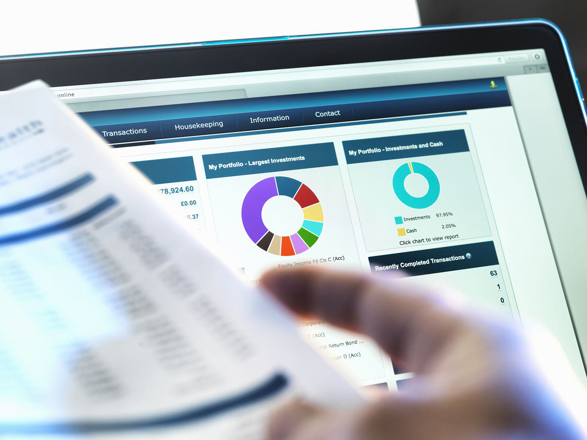

## Table of Contents

## What is a Bespoke CDO?

A Bespoke CDO, or Bespoke Collateralized Debt Obligation, is a type of financial product that is customized for a specific investor or group of investors. Unlike standard CDOs, which are created and sold to the general market, a bespoke CDO is tailored to meet the specific needs and risk preferences of its buyer. This customization can involve selecting particular assets, such as loans or bonds, to be included in the CDO, and structuring the product in a way that aligns with the investor's investment goals.

These financial instruments are often used by large investors, like hedge funds or banks, who want to manage their exposure to credit risk in a more precise way. By working closely with the issuer, the investor can influence the composition of the CDO, potentially increasing the chances of achieving their desired financial outcomes. However, bespoke CDOs can also be complex and carry significant risks, as their performance is closely tied to the underlying assets and the specific structure of the product.

## What is a Bespoke Tranche Opportunity?

A Bespoke Tranche Opportunity is a special type of investment that is made just for one investor or a small group of investors. It's like a custom-made financial product where the investor can pick what goes into it and how it's set up. This is different from regular investments that are made for anyone to buy. With a Bespoke Tranche Opportunity, the investor works closely with the people who create it to make sure it fits their needs and goals.

These opportunities are often used by big investors, like hedge funds or banks, who want to manage their risks in a very specific way. They can choose the kinds of loans or bonds that go into the investment and decide how the money will be paid back. This can help them reach their financial goals better. But, these investments can be tricky and risky because they depend a lot on what's inside them and how they're put together.

## How do Bespoke CDOs and Bespoke Tranche Opportunities differ in structure?

Bespoke CDOs and Bespoke Tranche Opportunities are both custom-made financial products, but they have some key differences in how they are structured. A Bespoke CDO is a type of Collateralized Debt Obligation that is made just for one investor or a small group. It's like a big pool of loans or bonds that are put together and then split into different pieces, called tranches. Each tranche has a different level of risk and return, and the investor can pick which tranches they want to buy based on their goals.

On the other hand, a Bespoke Tranche Opportunity is more focused on a single tranche within a larger CDO or similar product. Instead of buying a whole CDO, the investor works with the issuer to create a specific tranche that fits their needs. This tranche can be tailored to have the right mix of risk and return that the investor wants. So, while a Bespoke CDO gives the investor control over the whole product, a Bespoke Tranche Opportunity lets them focus on customizing just one part of it.

## What are the primary risks associated with investing in Bespoke CDOs?

Investing in Bespoke CDOs can be risky because they are custom-made and complex. Since they are made just for one investor or a small group, the mix of loans or bonds inside them can be hard to understand. If the loans or bonds do not do well, the whole Bespoke CDO can lose value. This means the investor could lose a lot of money. Also, because they are custom-made, it can be hard to sell them to someone else if the investor wants to get out of the investment.

Another big risk is that Bespoke CDOs can be affected by changes in the market or the economy. If interest rates go up or the economy goes down, the value of the loans or bonds inside the CDO can drop. This can hurt the value of the Bespoke CDO. Also, because these products are so customized, it can be hard to know exactly how they will perform. This uncertainty can make them even riskier.

## What are the primary risks associated with investing in Bespoke Tranche Opportunities?

Investing in Bespoke Tranche Opportunities can be risky because they are made just for one investor or a small group. Since they focus on a specific part of a bigger product, like a CDO, they can be hard to understand. If the loans or bonds in that part do not do well, the Bespoke Tranche Opportunity can lose a lot of value. This means the investor could lose money. Also, because these tranches are custom-made, it can be hard to sell them to someone else if the investor wants to get out of the investment.

Another big risk is that Bespoke Tranche Opportunities can be affected by changes in the market or the economy. If interest rates go up or the economy goes down, the value of the loans or bonds inside the tranche can drop. This can hurt the value of the Bespoke Tranche Opportunity. Because these products are so customized, it can be hard to know exactly how they will perform. This uncertainty can make them even riskier.

## How do the return profiles of Bespoke CDOs compare to Bespoke Tranche Opportunities?

The return profiles of Bespoke CDOs and Bespoke Tranche Opportunities can be different because of how they are made. A Bespoke CDO is like a big pool of loans or bonds that is split into different pieces, called tranches. Each tranche can have its own return, depending on how risky it is. Because the investor can pick which tranches to buy, they can mix and match to try to get the return they want. This means the return profile of a Bespoke CDO can be very flexible and tailored to what the investor is looking for.

A Bespoke Tranche Opportunity, on the other hand, is focused on just one piece of a bigger product. This means the return profile is more specific to that one tranche. The investor can still customize this tranche to fit their goals, but the return will depend a lot on how well the specific loans or bonds in that tranche do. So, the return profile of a Bespoke Tranche Opportunity can be more predictable in some ways, but it also depends more on the performance of a smaller set of assets.

## What types of investors typically engage with Bespoke CDOs versus Bespoke Tranche Opportunities?

Investors who typically engage with Bespoke CDOs are usually big players like hedge funds, banks, or other large financial institutions. They have the resources and expertise to understand the complex nature of these custom-made financial products. These investors want to have control over the whole pool of assets in the CDO and can mix and match different tranches to meet their specific investment goals. They are willing to take on the risks because they believe they can manage them and achieve higher returns.

On the other hand, investors who engage with Bespoke Tranche Opportunities are often looking for a more focused approach. These investors might also be large institutions, but they could be smaller or more specialized compared to those dealing with full Bespoke CDOs. They want to customize just one part of a larger product to fit their specific needs. This allows them to manage their risk and return in a more targeted way, focusing on the performance of a specific tranche rather than the entire CDO.

## What are the key regulatory considerations for Bespoke CDOs?

Regulatory considerations for Bespoke CDOs are important because these products are complex and can be risky. Regulators want to make sure that investors understand what they are buying and that the market is fair. One key regulation is the Dodd-Frank Act in the United States, which requires more transparency and reporting for these types of financial products. This means that issuers of Bespoke CDOs have to provide detailed information about the assets inside the CDO and how it is structured. This helps investors make better decisions and reduces the chance of fraud or hidden risks.

Another important consideration is the risk retention rules, which require the issuer of a Bespoke CDO to keep a part of the product. This is to make sure that the issuer has a stake in how well the CDO does, which can help align their interests with those of the investors. Regulators also keep an eye on the credit ratings of Bespoke CDOs to make sure they are accurate and not misleading. Overall, these regulations aim to protect investors and keep the financial system stable by making sure that Bespoke CDOs are managed and sold responsibly.

## What are the key regulatory considerations for Bespoke Tranche Opportunities?

Regulatory considerations for Bespoke Tranche Opportunities are important because these products are custom-made and can be risky. Regulators want to make sure that investors know what they are buying and that the market is fair. One key rule is the Dodd-Frank Act in the United States, which says that issuers of Bespoke Tranche Opportunities have to give detailed information about the assets in the tranche and how it is set up. This helps investors make better choices and stops people from hiding risks or doing anything dishonest.

Another important rule is about risk retention, which means the issuer has to keep some of the Bespoke Tranche Opportunity for themselves. This makes sure that the issuer cares about how well the tranche does, which can help make sure their goals match up with the investors' goals. Regulators also check the credit ratings of Bespoke Tranche Opportunities to make sure they are correct and not misleading. These rules are all about protecting investors and keeping the financial system stable by making sure Bespoke Tranche Opportunities are handled and sold in a responsible way.

## How can investors assess the performance of Bespoke CDOs?

Investors can assess the performance of Bespoke CDOs by looking at the performance of the loans or bonds inside the CDO. If these assets are doing well, it means the Bespoke CDO is likely doing well too. Investors should keep an eye on things like how many loans are being paid back on time, how the interest rates are affecting the value of the bonds, and if there are any big changes in the economy that could hurt the CDO. They can also use reports from the issuer of the CDO, which should give them updates on how the CDO is doing.

Another way to assess the performance is by looking at the credit ratings of the Bespoke CDO. These ratings are given by special companies that check how risky the CDO is. If the rating goes up, it means the CDO is doing better. If it goes down, it means there might be more risk. Investors should also talk to experts who understand these products well, because Bespoke CDOs can be tricky and it helps to get advice from people who know what they're doing. By keeping track of these things, investors can get a good idea of how their Bespoke CDO is performing.

## How can investors assess the performance of Bespoke Tranche Opportunities?

Investors can assess the performance of Bespoke Tranche Opportunities by looking at how well the specific loans or bonds inside the tranche are doing. If these assets are being paid back on time and their value is going up, it's a good sign that the Bespoke Tranche Opportunity is doing well. Investors should also pay attention to things like changes in interest rates and the overall economy, as these can affect the value of the tranche. They can get regular updates from the issuer of the Bespoke Tranche Opportunity, which will give them information on how the tranche is performing.

Another way to assess the performance is by checking the credit ratings of the Bespoke Tranche Opportunity. These ratings are given by special companies that look at how risky the tranche is. If the rating goes up, it means the tranche is doing better, and if it goes down, it means there might be more risk. Talking to experts who understand these products can also help investors get a better idea of how their Bespoke Tranche Opportunity is doing. By keeping an eye on these things, investors can figure out if their investment is on track or if they need to make changes.

## What advanced strategies can be employed to optimize returns from Bespoke CDOs and Bespoke Tranche Opportunities?

To optimize returns from Bespoke CDOs, investors can use a few smart strategies. One way is to carefully pick the mix of loans and bonds inside the CDO. By choosing assets that are likely to do well, investors can make the whole CDO more profitable. Another strategy is to use different tranches to balance risk and return. By putting money into both high-risk and low-risk tranches, investors can aim for higher returns while still protecting their investment. It's also important to keep an eye on the market and adjust the CDO's structure if things change. This might mean selling some assets and buying new ones to keep the CDO performing well.

For Bespoke Tranche Opportunities, investors can focus on [picking](/wiki/asset-class-picking) the right tranche to match their goals. By customizing the tranche to include the best-performing loans or bonds, they can increase their chances of getting good returns. Another strategy is to use hedging to protect against risks. This means buying other investments that will go up in value if the tranche goes down. This can help balance out losses and keep the overall return strong. Regularly checking the performance of the tranche and making changes as needed can also help keep the investment on track and maximize returns.

## References & Further Reading

[1]: Gorton, G. B. (2012). ["Misunderstanding Financial Crises: Why We Don't See Them Coming."](https://archive.org/details/misunderstanding0000gort) Princeton University Press.

[2]: Lucas, D., Goodman, L., & Fabozzi, F. (2006). ["Collateralized Debt Obligations: Structures and Analysis."](https://onlinelibrary.wiley.com/doi/book/10.1002/9781119201311) Wiley Finance.

[3]: Tett, G. (2009). ["Fool's Gold: The Inside Story of J.P. Morgan and How Wall St. Greed Corrupted Its Bold Dream and Created a Financial Catastrophe."](https://pmc.ncbi.nlm.nih.gov/articles/PMC4939913/) Free Press.

[4]: Pyrros, D. (2009). ["Synthetic CDOs: Modelling, Valuation and Risk Management."](https://books.google.com/books/about/Synthetic_CDOs.html?id=pmP46Krey80C) Palgrave Macmillan.