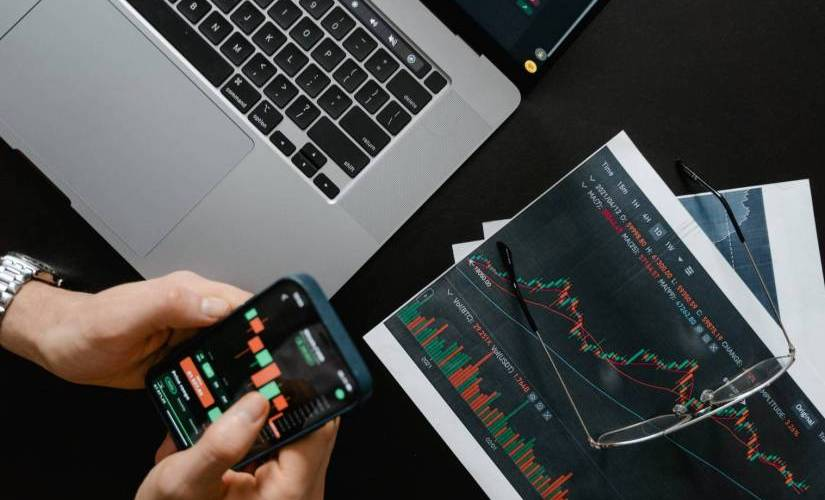

## Table of Contents

## What are the basics of trading that a beginner should learn?  

For someone just starting out, the basics of trading are the foundation you’ll build everything else on. First, you need to understand what trading actually is: buying and selling assets—like stocks, currencies, or commodities—to make a profit based on price changes. It’s not about owning something long-term like an investor might; it’s about timing the market.

You’ll want to grasp key concepts like **supply and demand**—prices go up when more people want to buy than sell, and down when the opposite happens. Then there’s the idea of **markets** themselves: stocks trade on exchanges like the NYSE, forex (currency) happens 24/5 globally, and crypto runs on decentralized platforms. Each has its own vibe and rules.

Next, get familiar with **order types**. A market order buys or sells instantly at the current price, while a limit order sets a specific price you’re willing to trade at. Beginners often trip up here, so knowing these prevents costly mistakes.

**Charts and price movements** are huge too. Learn to read a basic candlestick chart—it shows you opening, closing, high, and low prices over time. Terms like “bullish” (price going up) and “bearish” (price dropping) will pop up constantly.

Don’t skip **risk management**—this is make-or-break. You should never risk more than you can afford to lose, and a simple rule like “only risk 1-2% of your account per trade” can save you from blowing up early.

Lastly, wrap your head around **brokerage accounts** and **fees**. You’ll need a platform to trade on, and they’ll charge commissions or spreads (the difference between buy and sell prices). Pick one that’s beginner-friendly but doesn’t nickel-and-dime you.

That’s the starter pack. It’s less about memorizing and more about getting comfortable with how it all fits together before jumping in.

## How do I choose the right trading course for my skill level?  

Picking the right trading [course](/wiki/best-algorithmic-trading-courses) depends on where you’re at and what you’re aiming for, so it’s about matching your current skills to the course’s focus. If you’re a beginner—say, you barely know a stock from a [forex](/wiki/forex-system) pair—look for something that starts with the basics: how markets work, simple strategies, and terms like “bid” or “leverage.” These courses should feel like they’re walking you through step-by-step, not throwing you into the deep end with jargon or complex math.

If you’ve got some experience—maybe you’ve made a few trades or can read a chart—go for an intermediate course. These usually dive into specific strategies (like swing trading or technical analysis) and assume you’re past needing “what’s a broker” explained. Check the syllabus or reviews to see if it builds on what you already know without repeating too much.

For advanced traders, you’re looking at niche or high-level stuff: [algorithmic trading](/wiki/algorithmic-trading), options spreads, or mastering risk in volatile markets like crypto. These courses should challenge you with real-world application—think live trading examples or deep dives into tools like TradingView—and not waste time on beginner fluff.

A quick way to judge fit is to look at the course’s target audience (usually in the description) and prerequisites. If it says “no experience needed,” it’s beginner-tier. If it’s tossing around terms like “Fibonacci retracement” or “hedging” upfront, it’s likely intermediate or higher. Sample a free lesson if they offer one—does it click, or are you lost? Also, consider your goals: [day trading](/wiki/day-trading-spy), long-term gains, or just understanding markets. A course misaligned with that will feel frustrating no matter your level.

Peer feedback helps too—look for reviews from people at your stage. A course that’s gold for pros might overwhelm a newbie, and one that’s perfect for beginners might bore someone seasoned. Match the pace and depth to where you’re standing, and you’ll get the most out of it.

## What are the key differences between free and paid trading courses?  

Free and paid trading courses differ mainly in depth, structure, and support—each has its strengths, but it’s about what you’re willing to trade off. Free courses, often found on YouTube, blogs, or platforms like Coursera’s audit mode, give you the basics without costing a dime. They’re usually broad overviews—think intros to trading concepts, simple strategies like moving averages, or how to set up a broker account. The upside is accessibility; anyone can jump in. But they’re often light on detail, lack personalized guidance, and might not update with market changes. You’re also on your own to sift through what’s legit—some free stuff is just bait to upsell you later.

Paid courses, whether they’re $50 or $500, typically offer more meat. You’re paying for structure—think step-by-step modules, quizzes, or even live sessions. They often go deeper into specific topics like risk management, advanced chart patterns, or niche markets (crypto, options). Instructors might be vetted pros with real trading creds, and you could get extras like community access, trade simulators, or one-on-one feedback. The catch? Quality varies wildly—some are overpriced repackaged basics—and you’re locked into their framework, which might not fit your style.

Time commitment’s another split. Free courses let you dip in and out, no pressure. Paid ones often demand you follow their pace, especially with live cohorts or deadlines. Support’s a biggie too—free rarely offers direct help, while paid might give you email Q&A or Discord groups. Cost aside, free leans on your self-discipline to fill gaps; paid bets on curated content to fast-track you. It’s less about “better” and more about whether you need a hand-held journey or can DIY it with scattered resources.

## Which trading strategies should a beginner focus on mastering?  

For beginners, the goal is to start with trading strategies that are straightforward, forgiving, and build confidence without overwhelming you. Here are a few to focus on mastering early:

**Trend Following** is a solid pick. It’s about spotting when prices are consistently moving up (bullish) or down (bearish) and riding that wave. You use simple tools like moving averages—say, a 50-day crossing over a 200-day signals “buy”—to confirm the trend. It’s beginner-friendly because it’s visual, doesn’t need split-second timing, and teaches you patience while markets do their thing.

**Breakout Trading** is another good one. This is when you wait for a price to bust through a key level—like a high it’s hit before (resistance) or a low it’s bounced off (support)—and trade in that direction. Think buying when a stock jumps past $50 after stalling there repeatedly. It’s intuitive: big moves often follow breakouts. Just watch for false signals, which you’ll learn to spot with practice.

**Swing Trading** fits if you don’t want to stare at screens all day. You’re aiming to catch price “swings” over a few days or weeks, buying low and selling higher (or vice versa). It leans on basic chart patterns—like double bottoms or head-and-shoulders—and teaches you to read momentum without needing crazy precision. It’s less stressful than day trading for newbies.

**Position Trading** takes it even slower. You hold for weeks or months, betting on bigger trends—like a company’s growth or a sector heating up. It’s almost investing with an exit plan. Beginners like it because it’s low-maintenance and forces you to think bigger-picture, not just chase daily noise.

Stick to these because they don’t need advanced math or lightning-fast moves. Focus on one or two, practice with paper trading (fake money), and get comfy with how they play out. They’ll teach you market behavior, timing, and discipline—core skills that scale up later. Avoid stuff like [scalping](/wiki/gamma-scalping) or options until you’ve got these down; those can burn you quick if you’re green.

## How can I evaluate the credibility of a trading course instructor?  

Evaluating a trading course instructor’s credibility comes down to digging into their track record, transparency, and how they present themselves—gut checks matter too. Start with their **experience**. Do they have real-world trading history, or are they just parroting theory? Look for specifics: years in the game, markets they’ve traded (stocks, forex, crypto), or even a verifiable portfolio. If they’re vague—like “I’ve made millions!” with no proof—red flag.

Next, check their **results**. A legit instructor might share past trades or performance stats, even if it’s not all wins—losses show they’re human. Be wary of anyone flashing Lambos or promising riches without evidence; real traders don’t need to flex like that. Some post trade recaps on social media or blogs—cross-check those for consistency.

**Reputation** is key. Search their name online, especially on platforms like X or trading forums. What are students saying? Look for unfiltered takes—glowing reviews on their own site can be curated, but raw chatter elsewhere cuts through the noise. If they’ve got a history of lawsuits, scams, or disappearing after hype, it’ll surface.

Their **teaching style** hints at credibility too. Do they explain concepts clearly, or lean on jargon to sound smart? A good instructor breaks things down without dodging questions. Free content—like a webinar or YouTube vid—can show if they actually know their stuff or just sell dreams.

Finally, **credentials** aren’t everything, but they help. Certifications (like CFA or CMT) or ties to legit firms add weight. No formal creds? Fine, if their practical success backs them up. Cross-reference claims with public records or industry contacts if you can.

Trust your nose - if they’re more salesman than teacher, or their story smells off, walk away. Solid instructors don’t need to oversell; their knowledge does the talking.

## What role does risk management play in trading education?  

Risk management is the backbone of trading education—it’s what keeps you in the game long enough to actually learn anything. Without it, you’re just gambling, and the market doesn’t care how smart you think you are. It’s about controlling how much you can lose before you even think about winning, which is why it’s drilled into any decent trading course.

At its core, it teaches you to **limit losses**. Markets are unpredictable—prices can tank on news, a bad trade, or just random noise. A beginner might bet half their account on one move and get wiped out. Risk management says, “Nah, cap it at 1-2% per trade.” That way, even a string of losses won’t end you. It’s less sexy than chasing gains, but it’s survival.

It also forces you to **size your trades right**. You learn position sizing—how much to buy based on your account and stop-loss (the price where you’ll cut a losing trade). Say you’ve got $10,000 and risk 1% ($100). If your stop-loss is $1 below entry, you buy 100 shares, not 1,000. This math keeps emotions in check; no panic-selling or overbetting.

Then there’s **psychology**. Trading education hammers risk management because it trains you to handle fear and greed—emotions that wreck newbies. Knowing you’ve got a plan (like a stop-loss or a risk-reward ratio of 1:2) stops you from holding a loser too long or cashing out too early. It’s less about the market and more about mastering yourself.

It ties into **strategy too**. A course might teach trend-following or breakouts, but risk management decides if they work for you. High-win-rate strategies might tolerate tighter risks; long-shot plays need stricter limits. Without this lens, you’re blind to what’s sustainable.

In short, it’s the difference between a trader and a dreamer. Education without it is just theory—risk management makes it real, keeping your capital alive so you can grow. Ignore it, and you’re out before you start.

## Are there trading courses tailored to specific markets like stocks, forex, or crypto?  

Yes, there are trading courses tailored to specific markets like stocks, forex, or crypto, and they’re designed to match the unique quirks of each. Stock trading courses, for instance, often focus on company fundamentals—think earnings reports, P/E ratios, and sector trends—alongside technical analysis like chart patterns or [volume](/wiki/volume-trading-strategy) spikes. They’re built for a market that’s tied to business performance and economic cycles, so you’ll see lessons on things like dividend plays or how to trade earnings season.

Forex courses zero in on currency pairs and the global forces driving them—interest rates, central bank moves, geopolitical events. They’ll teach you about leverage (which can be sky-high in forex), pips, and reading economic calendars. The 24/5 nature of forex means strategies often revolve around timing major sessions like London or New York opens, and you’ll get tools like MetaTrader drilled into you.

Crypto courses are a different beast. They tackle a market that’s 24/7, wildly volatile, and less tethered to traditional economics. You’ll learn about blockchain basics, wallet security, and trading altcoins versus majors like Bitcoin or Ethereum. They often lean hard into technical analysis—think support/resistance or RSI—since fundamentals can be murkier, and sentiment drives a lot. Some even cover DeFi or spotting pump-and-dumps, which are crypto-specific headaches.

Plenty of platforms cater to these niches. Udemy has beginner-friendly options like “Stock Market from Scratch” or “Cryptocurrency Fundamentals.” Forex.com offers free forex-focused modules, while places like Asia Forex Mentor dive deep into currency strategies. For crypto, Rekt Capital or TodayTrader specialize in altcoin and Bitcoin tactics. Each market’s courses reflect its pace, risks, and tools—stocks are steady, forex is global, crypto’s the wild west. Pick based on what market vibes with you.

## How much time should I expect to invest in a trading course?  

How much time you’ll invest in a trading course depends on its format, depth, and your starting point, but it’s usually a mix of upfront learning and ongoing practice. For a beginner course—say, an intro to stocks or forex—you’re looking at **10-20 hours** of core content. That’s video lessons, quizzes, or reading spread over a few weeks if it’s self-paced, or condensed into days for a live bootcamp. Add another **10-15 hours** messing around with demo accounts to test what you’ve learned. So, call it 20-35 hours total to get comfortable.

Intermediate courses, like ones on swing trading or technical analysis, step it up—think **20-40 hours** of material. They assume you know the basics, so they pile on strategies, tools, and case studies. Practice doubles here—another **20-40 hours**—because you’re refining timing and spotting patterns in real-time charts. You’re in for 40-80 hours over a month or two if you’re serious.

Advanced courses—options, algo trading, or crypto scalping—can demand **50-100 hours**. They’re dense, with live trading sessions, complex math, or coding (for algos). Practice is endless—easily **50+ hours**—since mastery means executing under pressure. This could stretch over months, especially if you’re balancing a job.

Your pace matters too. Self-learners on Udemy might spread 20 hours over six weeks; a full-time student could crush it in days. Live courses (like a 5-day workshop) compress it but expect full focus—8 hours daily. Realistically, budget **1-3 months** for most courses, including practice, unless you’re all-in with no distractions. The catch? Learning doesn’t stop—markets evolve, so you’re tweaking what you know forever. Start small, commit consistent chunks (2-3 hours a week), and scale up as it clicks.

## What practical tools or platforms should a good trading course teach?  

A good trading course should teach practical tools and platforms that let you analyze markets, execute trades, and manage risk—stuff you’ll actually use day-to-day. Here’s what they should cover:

**Charting Platforms** like **TradingView** are a must. It’s where you’ll spot trends, draw support/resistance, and test indicators—think moving averages, RSI, or MACD. A course should show you how to customize charts, set alerts, and read candlesticks, not just point you at it. It’s beginner-friendly but scales up for pros.

**Brokerage Platforms**—think **Thinkorswim (TD Ameritrade)**, **MetaTrader 4/5 (MT4/5)**, or **Interactive Brokers**—are non-negotiable. They’re your gateway to placing trades. Courses should walk you through setting up accounts, placing market/limit orders, and using stop-losses. MT4/5 is big for forex; Thinkorswim shines for stocks and options with built-in scanners.

**Market Scanners** like **Finviz** or **Trade Ideas** help you find opportunities. A course should teach you how to filter stocks by volume, price, or volatility—say, “show me stocks up 5% today under $50.” It’s about efficiency; you can’t watch everything manually.

**Risk Management Tools** are clutch. Excel or apps like **Myfxbook** (for forex) track your trades, wins, losses, and risk-per-trade. A course should show you how to calculate position size—e.g., risking $50 on a $5 stop-loss means 10 shares—and analyze performance to spot weak spots.

**News Aggregators** like **Bloomberg Terminal** (pricey) or freebies like **Yahoo Finance** keep you in the loop. They should teach you how to skim earnings, Fed announcements, or crypto hacks—stuff that moves prices fast.

For crypto, **Coinigy** or **Blockfolio** might pop up, tying exchange APIs to track volatile coins. Advanced courses might toss in **Python** or **MQL4** for coding strategies—practical if you’re into algos.

The best courses don’t just name-drop—they demo these live, showing workflows like “scan with Finviz, chart on TradingView, trade via Thinkorswim.” Hands-on beats theory every time. Stick to courses that match your market (MT4 for forex, Binance for crypto) and skip ones vague about tools—you’ll need this kit to trade, not just study.

## What are the signs of a trading course scam to avoid?  

Spotting a trading course scam is about trusting your gut while keeping an eye on red flags. First, if they’re promising you’ll get rich quick—like “millionaire in 30 days” or “guaranteed profits”—run. Trading’s a grind, not a lottery ticket; legit courses talk probabilities, not certainties. Next, check the instructor. If they’re flaunting Lambos and private jets but can’t show a verifiable trading track record, they’re likely selling hype, not skill. Real pros don’t need to flex—they’ve got results.

Look at the sales pitch. High-pressure tactics like “limited spots” or “price doubles tomorrow” scream manipulation. Scammers thrive on FOMO. If the course is light on details—vague about what you’ll actually learn, no syllabus, just buzzwords like “secret system”—it’s probably thin air. Legit ones outline specific skills, like technical analysis or risk management, not some mystical formula.

Price is a clue, too. Dirt-cheap courses ($20 for “everything”) often deliver generic fluff or upsell you later. On the flip side, crazy-high prices (thousands upfront) with no refunds or previews can signal a cash grab—especially if they dodge questions about content. Testimonials? If they’re all glowing 5-stars with no substance (“Changed my life!”), they’re likely fake. Real reviews have grit—some wins, some gripes.

Finally, dig into their community or support. Scams often ghost you post-payment—no real mentorship, dead forums, or canned replies. Cross-check the course name or instructor online or on platforms like X for unfiltered opinions. If it’s littered with complaints about non-delivery or shady billing, you’ve got your answer. Trust the smell test—if it feels off, it probably is.

## How can I measure my progress after completing a trading course?

Measuring your progress after a trading course comes down to tracking tangible outcomes and self-assessing your skills, not just hoping you "feel smarter." Start with your trading performance if you’re putting money on the line. Look at your win rate—how many trades profit versus lose—and your risk-reward ratio, like whether you’re consistently making more on winners than you lose on losers. A course worth its salt should leave you better at spotting setups and cutting losses, so compare your stats pre- and post-course. Even a small uptick, say from a 30% to 40% win rate, shows growth.

If you’re not trading live yet, use a simulator. Most decent platforms (Thinkorswim, TradingView) let you paper trade. Test the strategies you learned—say, a moving average crossover or [breakout](/wiki/breakout-trading) play—and log your results over 20-50 trades. Consistency matters more than one big win; are you executing the plan without hesitation? That’s progress.

Beyond numbers, gauge your decision-making. Can you read a chart faster—spot support, resistance, or volume spikes without second-guessing? Do you understand why a trade failed instead of just shrugging? A good course sharpens your reasoning, so keep a journal. Write down your trade logic before and after; if your “whys” get clearer and less emotional, you’re leveling up.

Test your knowledge, too. Take a concept from the course—like options Greeks or trend analysis—and explain it to someone (or yourself in a mirror). If you stumble, revisit it. Progress isn’t just profits; it’s confidence in the tools you’ve got. Lastly, set a benchmark. Before the course, maybe you blew up a demo account in a week; now, can you grow it 5% in a month? Hard data beats vague vibes every time.

## In-depth reviews of top algorithmic trading courses

Navigating through the sea of available algorithmic trading courses can be overwhelming. Consequently, we've meticulously reviewed top courses, assessing their depth, usability, and real-world applicability, to equip you with the information needed to make an informed decision.

### AI & Algo Trading (Papers With Backtest)

- **Course Overview**: This course offers an in-depth exploration of financial research papers, focusing on replicating and backtesting the strategies discussed. It equips learners with the skills to critically evaluate and implement quantitative strategies from academic literature.
- **Platform**: [https://paperswithbacktest.com/course](https://paperswithbacktest.com/course)
- **Course Curriculum**: Covers a wide range of topics, including data sourcing, strategy implementation, backtesting, and performance analysis using Python and various financial libraries.
    
    - [AI & Algo Trading course roadmap](https://paperswithbacktest.com/course)
    - [Developing the Mindset of a Successful Trader](https://blog.paperswithbacktest.com/p/developing-the-mindset-of-a-successful): Focuses on cultivating the mental attitude and discipline required for long-term trading success.
    - [Overcome Procrastination Forever](https://blog.paperswithbacktest.com/p/overcome-procrastination-forever): Offers strategies to eliminate procrastination and enhance productivity in trading and research.
    - [How to Collect Data for Backtesting](https://blog.paperswithbacktest.com/p/how-to-collect-data-for-backtesting): Guides on sourcing and gathering reliable data for backtesting trading strategies.
    - [Introducing Hugging Face as an Open-Source Tool](https://blog.paperswithbacktest.com/p/introducing-hugging-face-as-an-open): Explores the use of Hugging Face's tools in the context of financial and trading applications.
    - [A Complete Introduction to Python for Finance](https://blog.paperswithbacktest.com/p/a-complete-introduction-to-python): Provides a foundational understanding of Python programming tailored for financial applications.
    - [Quantitative Precision: Statistics for Finance](https://blog.paperswithbacktest.com/p/quantitative-precision-statistics): Covers essential statistical concepts and methods for quantitative finance.
    - [The Power of Visualization in AI](https://blog.paperswithbacktest.com/p/the-power-of-visualization-in-ai): Discusses how visualization techniques enhance the interpretability and effectiveness of AI models in finance.
    - [Basics of AI for Algorithmic Trading](https://blog.paperswithbacktest.com/p/basics-of-ai-for-algorithmic-trading): Introduces fundamental AI concepts applied to algorithmic trading.
    - [Data Sources for Financial Research](https://blog.paperswithbacktest.com/p/data-sources): Reviews various sources for obtaining financial data crucial for research and backtesting.
    - [Mastering Data Preparation: The Key to Accurate Backtesting](https://blog.paperswithbacktest.com/p/mastering-data-preparation-the-key): Emphasizes the importance of proper data preparation for reliable backtesting results.
    - [Backtesting a Trading Strategy on Historical Data](https://blog.paperswithbacktest.com/p/backtesting-a-trading-strategy-on): Demonstrates the process of testing a trading strategy using historical market data.
    - [Execute Your Trades at Lower Cost](https://blog.paperswithbacktest.com/p/execute-your-trades-at-lower-cost): Explores techniques for reducing transaction costs in trading.
    - [Predicting Market Dynamics: The Importance of Feature Selection](https://blog.paperswithbacktest.com/p/predicting-market-dynamics-the-importance): Discusses the role of feature selection in improving market predictions.
    - [The Art of Alpha Generation: Methods and Techniques](https://blog.paperswithbacktest.com/p/the-art-of-alpha-generation-method): Covers various approaches to generating alpha in trading strategies.
    - [Trading Signals: An Introduction](https://blog.paperswithbacktest.com/p/trading-signals-an-introduction): Introduces the concept and development of trading signals for algorithmic strategies.
    - [Original Ideas of Predictors for Market Movements](https://blog.paperswithbacktest.com/p/original-ideas-of-predictors-for): Presents innovative predictors that can be used to anticipate market movements.
    - [Fundamentals of Machine Learning for Finance](https://blog.paperswithbacktest.com/p/fundamentals-of-machine-learning): Provides an overview of machine learning principles relevant to financial applications.
    - [Harnessing Supervised Learning for Predictive Models](https://blog.paperswithbacktest.com/p/harnessing-supervised-learning-for): Focuses on using supervised learning techniques to create predictive financial models.
    - [Unveiling Patterns with Unsupervised Learning](https://blog.paperswithbacktest.com/p/unveiling-patterns-with-unsupervised): Explores the use of unsupervised learning to identify patterns in financial data.
    - [Algorithmic Trading Enhancement Through Machine Learning](https://blog.paperswithbacktest.com/p/algorithmic-trading-enhancement-through): Discusses how machine learning can improve the effectiveness of algorithmic trading strategies.
    - [Machine Learning Models: Reinforcement Learning in Trading](https://blog.paperswithbacktest.com/p/machine-learning-models-reinforcement): Introduces reinforcement learning and its application in trading environments.
    - [Machine Learning Tools for Quantitative Research](https://blog.paperswithbacktest.com/p/machine-learning-tools): Reviews essential machine learning tools for conducting quantitative research in finance.
    - [Demystifying Data Modeling for Algorithmic Trading](https://blog.paperswithbacktest.com/p/demystifying-data-modeling-for-algorithmic): Explains the process and importance of data modeling in the development of algorithmic trading strategies.
    - [How to Source Trading Strategy Ideas](https://blog.paperswithbacktest.com/p/how-to-source-trading-strategy-ideas): Offers insights into generating and sourcing innovative trading strategy ideas.
    - [Deep Learning Insights for Algorithmic Trading](https://blog.paperswithbacktest.com/p/deep-learning-insights-for-algorithmic): Covers the application of deep learning techniques in the development of sophisticated trading algorithms.
- **Unique Selling Points**: Provides a hands-on approach to learning by guiding students through the process of replicating actual research, thus bridging the gap between academic theory and practical trading applications.
- **Duration & Flexibility**: Self-paced, with a recommended completion time of approximately 2-4 months depending on the learner's background and commitment.
- **Pricing**: Free access to some lectures, $10 per month for premium access.
- **Real Student Reviews**: Highly praised for its practical approach and the depth of understanding it fosters, though some users suggest that prior experience in both finance and programming enhances the learning experience.
- **Final Verdict**: An excellent choice for aspiring quants and finance professionals who wish to deepen their understanding of financial research and gain practical experience in strategy implementation.

### Machine Learning for Trading (Coursera)

- **Course Overview**: A blend of finance theory and computational skills, this course imparts knowledge on employing machine learning techniques to manage investment portfolios.
- **Platform**: [Coursera](https://www.coursera.org/specializations/machine-learning-trading)
- **Course Curriculum**: investigates into investment strategies, machine learning algorithms, Python, and more.
- **Unique Selling Points**: Convergence of traditional finance principles with modern machine learning applications, with case studies on real financial data.
- **Duration & Flexibility**: Approximately 3 months, self-paced.
- **Pricing**: Free access to lectures, paid certification.
- **Real Student Reviews**: Applauded for merging theoretical knowledge with practical skills, yet some desire more depth in trading strategies.
- **Final Verdict**: Ideal for those at the intersection of finance and data science, seeking to apply machine learning to investment strategies.

### Algorithmic Trading for Everyone (Udemy)

- **Course Overview**: Meant to demystify algorithmic trading, this course offers insights into developing one's own trading bot.
- **Platform**: [Udemy](https://www.udemy.com/course/algorithmic-trading-for-beginners-from-zero-to-hero/)
- **Course Curriculum**: From the basics of algorithmic trading, Python coding to strategy development, and risk management.
- **Unique Selling Points**: No prior coding experience required; provides a simplified approach to algorithmic trading.
- **Duration & Flexibility**: 3 hours, self-paced.
- **Pricing**: Varies ($20 - $200), subject to Udemy's frequent sales.
- **Real Student Reviews**: Heralded for its simplicity and beginners’ friendliness, though seasoned traders might seek more depth.
- **Final Verdict**: Tailored for beginners and those looking to understand algorithmic trading without diving too deep into complexities.

### Algorithmic Trading & Quantitative Analysis Using Python (Udemy)

- **Course Overview**: A deep dive into quantitative analysis and algorithmic trading using Python.
- **Platform**: [Udemy](https://www.udemy.com/course/algorithmic-trading-quantitative-analysis-using-python/)
- **Course Curriculum**: Covers Python programming, usage of quantitative indicators, and developing algorithmic trading strategies.
- **Unique Selling Points**: A thorough exploration of quantitative indicators and Python programming for trading.
- **Duration & Flexibility**: 16.5 hours, self-paced.
- **Pricing**: Varies, also subject to discounts.
- **Real Student Reviews**: Commended for the extensive coverage of quantitative indicators; beginners may find it intensive.
- **Final Verdict**: Suited for individuals with a basic understanding of Python and desire a detailed comprehension of quantitative trading.

### Algorithmic Trading Strategies (Oxford Algorithmic Trading Programme)

- **Course Overview**: A multifaceted course that ventures into algorithmic trading strategies and their practical applications in financial markets.
- **Platform**: [Oxford](https://www.sbs.ox.ac.uk/programmes/executive-education/online-programmes/oxford-algorithmic-trading-programme)
- **Course Curriculum**: Integrates traditional trading strategies with algorithms, backtesting, and real-time execution of strategies, all under the guidance of Oxford faculty.
- **Unique Selling Points**: Accredited by a renowned institution and offers interactive, high-stakes trading simulations for practical experience.
- **Duration & Flexibility**: 6 weeks, with a fixed schedule.
- **Pricing**: High-tier (exact pricing can be found on the platform).
- **Real Student Reviews**: Esteemed for its rigorous curriculum and real-world applicability, though it comes at a premium price.
- **Final Verdict**: Best suited for serious professionals looking to elevate their algorithmic trading strategies with an academically rigorous and practically applicable course.

### Professional Certificate in Machine Learning and Finance (NYU)

- **Course Overview**: Merging machine learning with finance, this course teaches students to create algorithmic trading strategies and decision-making models using ML.
- **Platform**: [New York University (NYU)](https://www.sps.nyu.edu/professional-pathways/courses/FINA1/FINA1-CE9315-machine-learning-in-finance.html)
- **Course Curriculum**: Encompasses financial concepts, Python programming, machine learning, and algorithmic trading model creation.
- **Unique Selling Points**: Facilitated by NYU professors, providing a blend of academic and practical insight into using ML in finance.
- **Duration & Flexibility**: 3-4 months, fixed schedule.
- **Pricing**: Premium pricing (details on NYU's website).
- **Real Student Reviews**: Acclaimed for its depth and expert-led instructions, albeit requiring substantial investment.
- **Final Verdict**: Intended for individuals or professionals aiming to deeply understand and apply ML in finance, provided they are ready for the financial and time investment.

### Advanced Algorithmic Trading (QuantStart)

- **Course Overview**: Delivers a deep dive into the technical and strategic aspects of creating robust algorithmic trading strategies.
- **Platform**: [QuantStart](https://www.quantstart.com/advanced-algorithmic-trading-ebook/)
- **Course Curriculum**: Involves strategy development, backtesting, and addressing common problems like overfitting.
- **Unique Selling Points**: Packed with real-trading examples and detailed strategy development techniques.
- **Duration & Flexibility**: Self-paced.
- **Pricing**: Mid-tier pricing (specific pricing on the website).
- **Real Student Reviews**: Praised for its practical strategy development insights, though might be a bit technical for absolute beginners.
- **Final Verdict**: Ideal for those with some foundational trading knowledge, seeking in-depth technical strategy development skills.

### Special Mention

[**Introduction to Trading, Machine Learning & GCP**](https://www.coursera.org/learn/introduction-trading-machine-learning-gcp) is another noteworthy free course available on **Coursera**, which infuses trading knowledge with machine learning applications and leverages Google Cloud Platform's capabilities. Beginners may find it a bit steep in terms of technological aspects, but for those with a basic understanding of trading and machine learning principles, it can be a gateway to advanced algorithmic trading strategies employing modern tech. Free access to course materials with an optional paid certificate provides flexibility to learners looking to either explore or gain certification.

[**Python for Finance and Algorithmic Trading**](https://www.udemy.com/course/python-for-finance-and-trading-algorithms/) from **Udemy** takes learners through Python programming, specifically tailored for trading. This course finds its niche in making Python programming accessible for traders and finance professionals, eliminating the usual jargon and ensuring concepts are applicable in practical trading scenarios. It presents an excellent step for beginners to get acquainted with algorithmic trading using Python, offering periodic free access and substantial discounts.

### Algorithmic Trading with Modern Technologies

Venturing into a more specialized domain, [**Machine learning and Reinforcement Learning in Finance**](https://www.coursera.org/specializations/machine-learning-reinforcement-finance) by **Coursera** extends an intricate exploration of how ML and [reinforcement learning](/wiki/reinforcement-learning) can be harnessed in devising sophisticated trading strategies. The course meticulously traverses through various ML models, ensuring traders understand their underpinning principles and application in trading. Notably, it investigates into reinforcement learning, exploring how algorithms can learn optimal actions based on historical data, thereby promising enhanced profitability and risk management in trading ventures.

For an even deeper dive into AI, [**Artificial Intelligence for Trading**](https://www.udacity.com/course/ai-for-trading--nd880) by **Udacity** propounds extensive insights into how AI can transform trading strategies and decision-making processes. It underscores the utilization of AI in extracting, analyzing, and leveraging vast datasets to formulate predictions and execute trades, providing traders with an edge in navigating through the voluminous data prevalent in today’s digital trading environments. The course further elucidates on crafting AI-driven alpha [factor](/wiki/factor-investing)s, ensuring that trading strategies are not only data-driven but also dynamically adaptive to market oscillations.

Always consider your foundational knowledge in both trading and technology, aligning course selections with not just immediate learning goals but also future applicability in trading endeavors.

## Beyond courses: Blogs and communities for continued learning

Engaging with dynamic learning platforms like blogs and communities enables algorithmic traders to stay abreast of industry trends, insights, and ongoing dialogues in the ever-evolving financial landscape.

[**QuantInsti’s Blog**](https://blog.quantinsti.com/) serves as a reservoir of knowledge for quant and algo traders, offering meticulous insights into algorithmic trading strategies, quantitative trading technologies, and financial analytics. The blog routinely features experts, imparting specialized knowledge on varied topics ranging from Python, Machine Learning in trading, and high-frequency trading strategies to much more.

Another commendable platform, [**Experfy Insights**](https://resources.experfy.com/), brings together thought leaders in AI, Big Data, and IoT, providing comprehensive articles, interviews, and webinars that explore the fusion of technology and finance. It presents a holistic view of how technology impacts trading and investments, delivering in-depth analyses of recent advancements, best practices, and future trends.

Similarly, [**QuantStart**](https://www.quantstart.com/), an algorithmic trading resource, dives deep into quantitative finance, algo trading, and programming for finance enthusiasts and professionals. This blog provides tutorials, articles, and code samples related to Python, R, and modern quantitative analysis. QuantStart also explores complex mathematical and financial theories, breaking them down for traders at every level to comprehend and apply.

Moreover, being an active participant in trading communities and forums like [**Elite Trader**](https://www.elitetrader.com/et/) or [**Reddit’s Algo Trading**](https://www.reddit.com/r/algotrading/) enables traders to engage in real-time discussions, seek advice, and share experiences. Such forums act as melting pots of live trading experiences, expert advice, and peer support, essential for troubleshooting, deriving new strategies, and understanding real-world market scenarios. Engaging in these communities fosters a practical learning environment, where theoretical knowledge from courses converges with real-world application and experience.

Traders, therefore, must actively intertwine course learning with continuous self-education through blogs and community participation, to holistically assimilate algorithmic trading’s expansive knowledge domain.

## References & further reading

[1]: Chlistalla, M. (2011). [High-frequency trading. Better than its reputation?](https://c.mql5.com/forextsd/forum/168/high-frequency_trading_-_better_than_its_reputation.pdf). Deutsche Bank Research, Frankfurt am Main, Germany.

[2]: Aldridge, I. (2013). [High-frequency trading: a practical guide to algorithmic strategies and trading systems](https://www.amazon.com/High-Frequency-Trading-Practical-Algorithmic-Strategies/dp/1118343506). John Wiley & Sons.