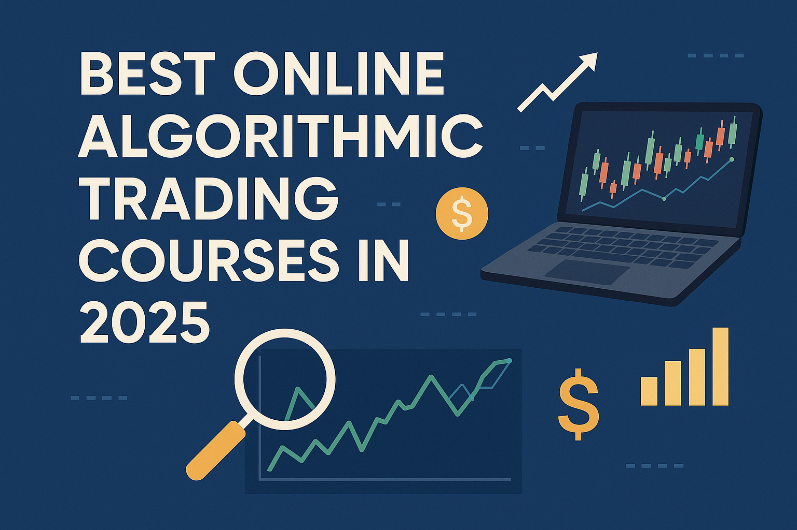

## Table of Contents

Algorithmic trading – using computer algorithms to automate trade execution – has become a game-changer in modern finance. It enables high-speed, precise trading decisions and minimizes human error or emotional bias. In fact, as of the mid-2020s, roughly 70% of U.S. stock market trading volume is driven by algorithms. This surge in automated trading has created strong demand for skilled algorithmic traders and quantitative analysts. Below, we present a comprehensive, up-to-date guide to the best globally available online courses for algorithmic trading in 2025. Whether you’re a beginner looking to get started or an experienced professional seeking advanced skills, these courses (from reputable platforms like Coursera, Udemy, edX, and renowned universities) will help you master algorithmic trading.

## What is Algorithmic Trading and Why It Matters?

Algorithmic trading (or “algo trading”) is the process of using pre-programmed computer strategies to execute trades based on defined criteria (such as timing, price, or quantity). Traders develop algorithms using technical indicators, quantitative models, or even artificial intelligence to automatically buy and sell assets at optimal moments. The advantages are significant: algorithms can analyze data and react to market conditions in milliseconds, seizing opportunities faster than any human. They also enforce discipline by sticking to predefined rules, thus removing emotion-driven decisions from trading.

This approach matters because electronic and algorithmic trading now dominate global markets. Major stock exchanges operate as electronic limit order books, and institutional investors (like hedge funds and banks) rely on complex algorithms for everything from high-frequency trading to portfolio rebalancing. For traders, this means that understanding how algorithms work is essential to stay competitive. Learning algorithmic trading equips you to design, test, and deploy automated strategies that can trade 24/7, exploit minute price inefficiencies, and manage risk at scale. In short, mastering algorithmic trading is now a crucial skill for finance professionals and independent traders alike, and the courses below will help you do exactly that.

## Top Algorithmic Trading Courses (Online) for 2025

The following online courses and programs represent the top-rated and most comprehensive offerings in algorithmic trading as of 2025. We’ve compared their providers, levels, curriculum highlights, pricing, duration, and certification to help you find the best fit. Each course is 100% online and globally accessible, and we’ve included options for all experience levels – beginner, intermediate, and advanced (including specialized programs for professionals).

### 1. AI & Algo Trading - Papers With Backtest

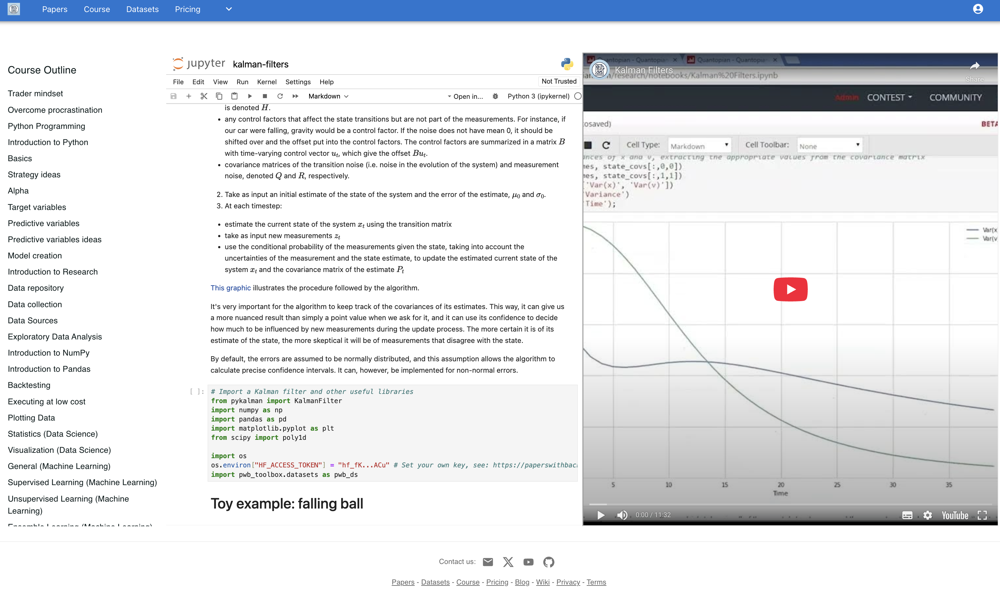

**Url:** [Papers with Backtest](https://paperswithbacktest.com/course)

**Provider:** Papers with Backtest (Independent research and education platform)  

**Level:** Beginner to Intermediate (ideal for retail traders and aspiring quants)  

**Duration:** Ongoing – new material every month (estimated 4–8 hours/month)  

**Pricing:** **$20/month** (cancel anytime)  

**Certification:** No formal certificate; access includes monthly strategy PDFs, video walkthroughs, and code  

**Curriculum Highlights:** *Papers with Backtest* is a unique educational platform offering **monthly deep dives into algorithmic trading strategies**. Each month, subscribers receive:

- A professionally written strategy paper summarizing the academic and practical logic behind a specific quant strategy (e.g., momentum, volatility breakout, mean reversion, etc.)
- A **step-by-step video** walkthrough explaining the theory and implementation
- Fully commented Python **backtest code** using Pandas, Backtrader, or similar tools
- Bonus content like **real-world datasets**, curated backtest results, performance discussion, and sometimes strategy variants (e.g., tweaks for ETFs or crypto)

The goal is to **learn by doing** – each module focuses on **one well-researched strategy**, inspired by academic finance papers or hedge fund techniques, with live implementation. Over time, users build a library of backtested strategies and Python templates.

The course is designed for self-paced learning. Subscribers can access all past issues while subscribed. It’s ideal for those who prefer to learn through concrete examples rather than long lecture series.

**Why it’s valuable:** For only $20/month, this course offers **practical insights into how real quant strategies work**, how to code them, and how to validate them. It’s especially useful for:

- Retail traders wanting to **expand their playbook** of strategies
- Self-taught coders looking to apply Python to trading
- Learners interested in **interpreting academic finance research** and translating it into algo code

There’s no certificate, but the **hands-on backtests and Python code** are valuable assets for a trading portfolio or job applications. Newcomers can learn at their own pace, and more advanced traders can use it to explore new ideas every month.

### 2. Oxford Algorithmic Trading Programme (University of Oxford)

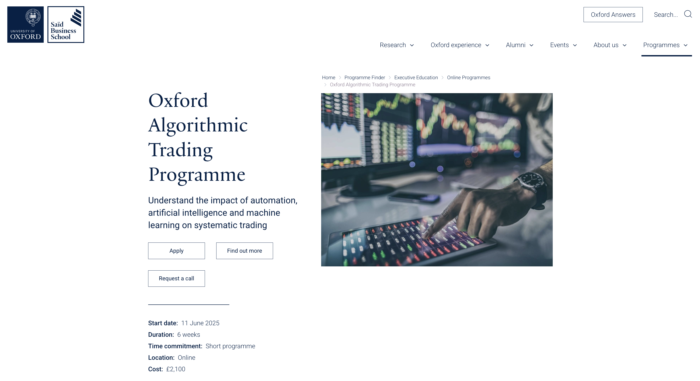

**Url:** [Oxford Algorithmic Trading Programme](https://www.sbs.ox.ac.uk/programmes/executive-education/online-programmes/oxford-algorithmic-trading-programme)

**Provider:** Oxford Saïd Business School (Executive Education), delivered via GetSmarter  

**Level:** Intermediate/Executive (Finance professionals and aspiring quants; *non-coding*)  

**Duration:** 6 weeks, ~8–10 hours per week  

**Pricing:** £2,100 (approximately \$2,500)  

**Certification:** Yes – Certificate of completion from University of Oxford (Saïd Business School)  

**Curriculum Highlights:** This acclaimed executive program offers a **broad, strategic overview** of algorithmic trading without heavy coding requirements. It begins with **classical and behavioral finance theory** tailored to trading, then covers the design of systematic trading strategies and **hedge fund techniques** in depth. You will learn the **“rules” behind successful algorithmic strategies**, how to evaluate algorithmic trading models, and explore case studies on what differentiates top-performing hedge funds. Optional Python exercises are included (e.g. building a simple momentum model) to apply concepts, but coding experience isn’t required – making this course accessible to traders, investors, and finance professionals from non-programming backgrounds. The final module looks ahead at **emerging trends** like AI, robo-advisors, and cryptocurrency in trading, ensuring the content is up-to-date. Students learn through video lectures, case studies, and assignments, with access to Oxford’s online campus and support team. **Why it’s great:** Oxford’s program is **highly regarded** for its academic rigor and industry relevance, and **adds a prestigious credential** to your CV. It’s ideal for those who want a solid grounding in systematic trading principles and the **credibility of a top university**, without delving into too much programming. *(Next session starts June 2025, reflecting current availability.)*

### 3. Udacity “Artificial Intelligence for Trading” Nanodegree

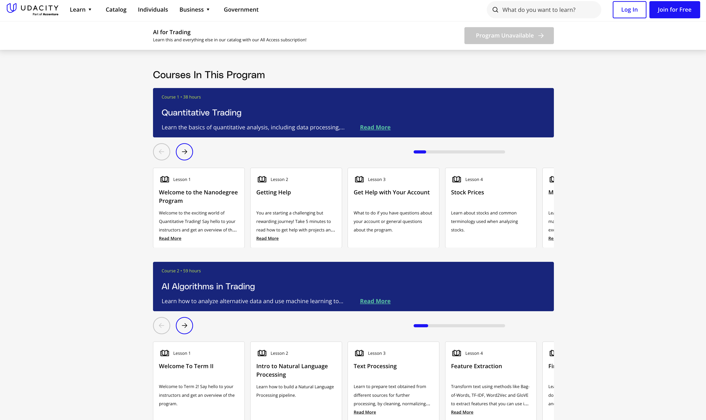

**Url:** [Udacity AI for Trading](https://www.udacity.com/course/ai-for-trading-nanodegree--nd880)

**Provider:** Udacity (Nanodegree program, with industry expert instructors)  

**Level:** Intermediate to Advanced (strong Python and math recommended)  

**Duration:** ~6 months (estimated at 10 hrs/week, self-paced)  

**Pricing:** Approximately \$1,999 for the full program (two 3-month terms at \$999 each). Monthly pay-as-you-go options available.  

**Certification:** Yes – Udacity Nanodegree Certificate upon completion of all projects  

**Curriculum Highlights:** This Nanodegree is an **in-depth, project-based training** that transforms you into a “coding super trader”. It covers **quantitative trading and AI from the ground up**, heavily using Python. Early modules focus on **financial Python programming, trading signals, and momentum strategies** – for example, the first project has you develop a momentum trading strategy after learning to generate trading signals from stock data. You’ll then dive into **portfolio optimization and risk management**, constructing portfolios of stocks and ETFs, and explore factor investing and alpha research. Advanced topics include **natural language processing for sentiment analysis**, where you’ll use NLP to create trading signals from news text, and **signal processing & backtesting** techniques to rigorously evaluate your algorithms. A large portion of the program is devoted to **machine learning in trading**: you'll implement deep learning models and even reinforcement learning for trading simulations. The curriculum is extremely hands-on – with multiple **real-world projects** (each reviewed by Udacity mentors) that build a portfolio of work. For instance, you will backtest strategies, build an ML-based trading model, and simulate trades on historical data. Udacity also provides one-on-one mentor support, Q&A, and career services (like resume reviews), making it more interactive than a typical online course. **Why it stands out:** This Nanodegree is one of the **most comprehensive and rigorous** trainings in AI-powered trading available online. It’s essentially equivalent to a semester-long intensive program, packing **cutting-edge content** (NLP, deep learning, reinforcement learning) into a structured curriculum. If you have the time and background to commit, it’s **excellent for developing practical algo trading skills with AI**. (Udacity reports ~6 months to finish; many graduates find it well worth the investment for the depth of material.)

### 4. EDHEC “Investment Management with Python and Machine Learning” Specialization (Coursera)

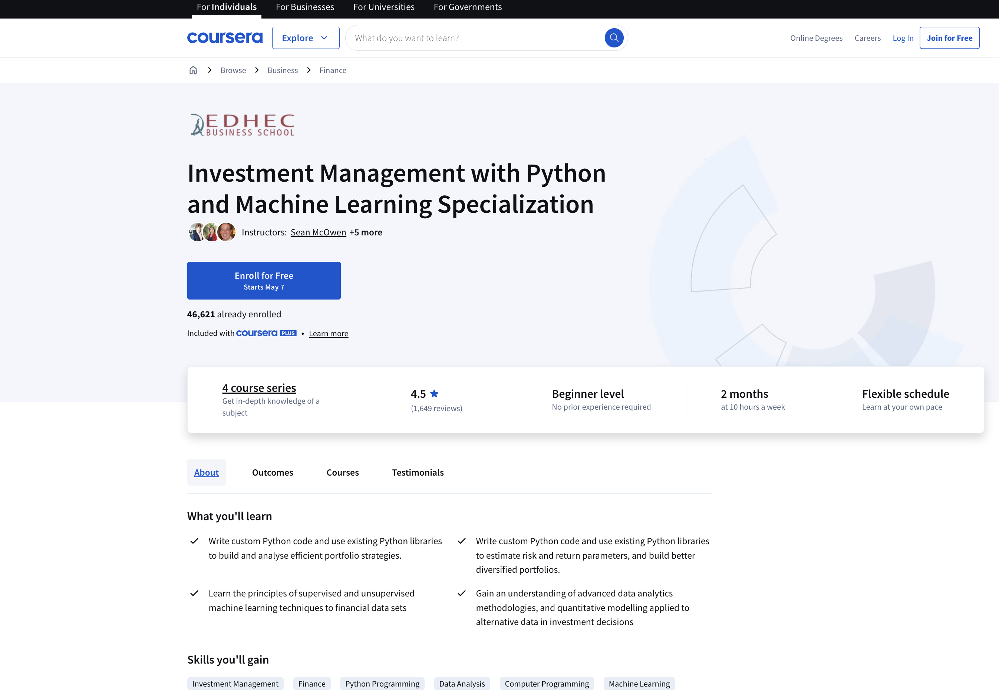

**Url:** [EDHEC Investment Management with Python and Machine Learning](https://www.coursera.org/specializations/investment-management-python-machine-learning)

**Provider:** EDHEC Business School (France) – offered on Coursera  

**Level:** Beginner-friendly to Intermediate (starts from basics; some Python is taught along the way)  

**Duration:** ~4 courses, ~80 hours total (approx. 3-4 months at your own pace)  

**Pricing:** Coursera subscription (Coursera Plus or ~$49/month; **financial aid** available). The content can be audited free (no certificate).  

**Certification:** Yes – Certificate for each course and a Specialization certificate (issued by EDHEC via Coursera)  

**Curriculum Highlights:** This highly-rated specialization (created by EDHEC-Risk Institute) provides a **comprehensive introduction to quantitative finance and data science for trading**. It has a **triple focus**: (1) core investment theory, (2) practical implementation, and (3) Python programming for AI/ML in finance. The coursework is divided into four sequential MOOCs:

- *Course 1:* **Introduction to Portfolio Construction and Analysis with Python** – Covers the foundations of modern portfolio theory (efficient frontier, risk-return tradeoff) and teaches you to use Python for portfolio optimization and risk estimation. You’ll write code to calculate asset returns, build diversified portfolios, and visualize performance.
- *Course 2:* **Advanced Portfolio Construction and Analysis with Python** – Builds on the first course with more complex portfolio techniques and optimization under real-world constraints. You continue to deepen Python skills (NumPy, Pandas) while learning advanced concepts like factor investing and portfolio analytics.
- *Course 3:* **Python and Machine Learning for Asset Management** – Introduces machine learning applications in trading and investment management. You’ll learn algorithms for regression, classification, and clustering applied to financial datasets. Topics include building predictive models for asset prices, algorithmic trading strategies based on ML signals, and performance evaluation.
- *Course 4:* **Machine Learning for Investment Management with Alternative Data** – Focuses on using alternative datasets (e.g., text data, ESG data) and advanced ML (including reinforcement learning) to enhance trading strategies. This capstone-style course ties together all prior learning.
Throughout the specialization, **hands-on labs and projects** reinforce skills – you will code trading strategies, backtest them, and apply machine learning models to financial data. The content is taught by professors and industry experts from EDHEC and even features insights from practitioners and *Princeton University* collaborators. Despite using Python heavily, the program is **designed to be accessible to beginners**, teaching coding and math concepts as needed. By the end, you’ll have a solid grasp of how to combine *investment theory* with *Python-driven analytics* to manage portfolios and strategies. **Why choose this:** Backed by a top finance school, this specialization is excellent for building a **strong foundation in quantitative trading/finance**. It’s one of the **best university-led programs** blending finance and machine learning. The paced structure (short courses) means you can start from scratch and steadily progress to advanced topics, earning multiple certificates along the way. It’s ideal for learners who want academic rigor and practical coding skills for trading, at an affordable price point (or free to learn). 

### 5. Electronic Trading in Financial Markets – New York Institute of Finance (NYIF)

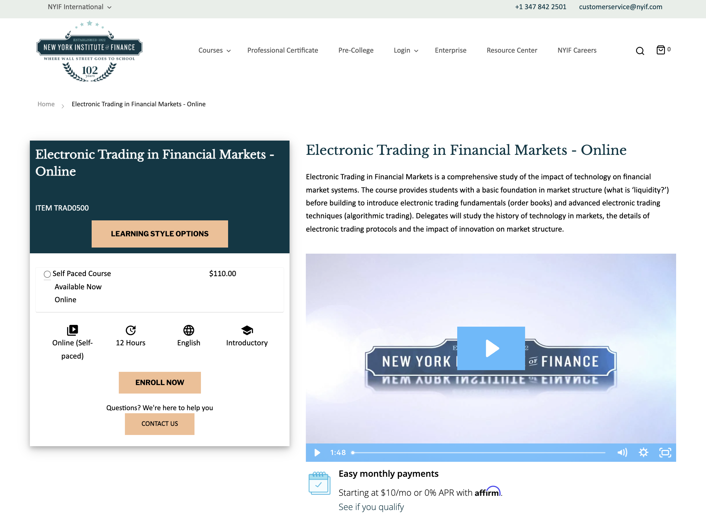

**Url:** [Electronic Trading in Financial Markets](https://www.nyif.com/electronic-trading-in-financial-markets-online.html)

**Provider:** New York Institute of Finance, available via **edX** (online self-paced course)  

**Level:** Beginner (Introductory – suitable for traders, finance professionals, even regulators)  

**Duration:** ~12 hours of material (self-paced)  

**Pricing:** *Audit for free* on edX; optional certificate costs around \$199 (edX pricing)  

**Certification:** Yes – NYIF/edX Certificate if you complete and pay  

**Curriculum Highlights:** This course offers a thorough introduction to the **world of electronic and algorithmic trading** from a markets perspective. Created by NYIF (a venerable institution training Wall Street since 1922), it emphasizes **market structure and trading mechanics** over programming. You’ll start by learning how electronic financial markets operate: the course covers different **market structures, order types, and how electronic order books work**. It explains the **technology behind trade execution**, the roles of exchanges and dark pools, and the limitations and advantages of various electronic trading systems. As you progress, it delves into more advanced topics such as:

- **Trading large volumes electronically:** How traders execute big orders using methods like slicing, **benchmark algorithms** (VWAP, TWAP, etc.), and other execution strategies.
- **Fixed Income Electronic Trading:** A look at how bond markets handle electronic trading, which has unique challenges compared to equities.
- **Latest FinTech innovations:** Exploration of how innovations like blockchain, AI, and other fintech developments are opening new possibilities in electronic trading.
Throughout, the course provides historical context (the evolution from open-outcry to fully electronic markets) and uses real-world examples. **Why it’s useful:** If you want to understand the **“plumbing” of algorithmic trading** – i.e. how trades are routed and executed in today’s markets – this short course is ideal. It’s especially valuable for **beginners** to gain context before diving into coding algorithms. By covering **essential trading concepts** (market impact, liquidity, order types, etc.), it gives you a strong conceptual foundation. Reviewers note NYIF’s experience shows in the content quality. Upon completion, you’ll better grasp *where and how your algorithms operate* in the real financial markets. (No programming is involved, making it complementary to the more coding-focused courses on this list.)

### 6. Machine Learning and Reinforcement Learning in Finance Specialization (NYU Tandon/Coursera)

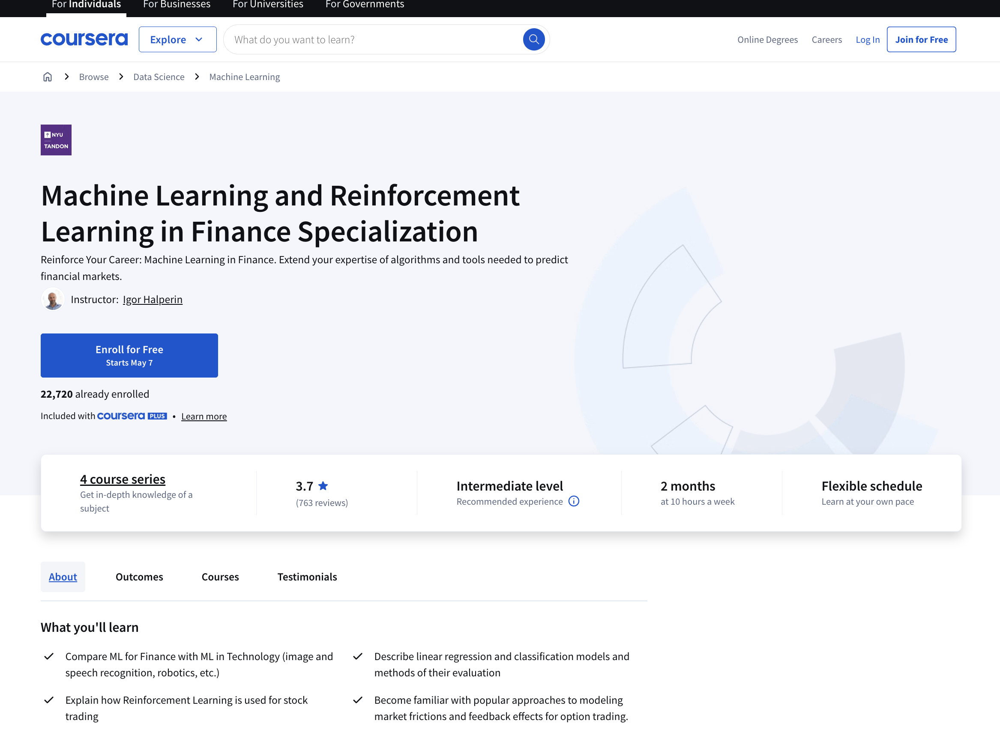

**Url:** [Machine Learning and Reinforcement Learning in Finance](https://www.coursera.org/specializations/machine-learning-reinforcement-finance)

**Provider:** New York University (Tandon School of Engineering) – offered on Coursera  

**Level:** Intermediate/Advanced (ideal for those with some programming and math background)  

**Duration:** ~4 courses, roughly 80 hours total (self-paced; ~4 months at ~5-6 hrs/week)  

**Pricing:** Coursera subscription (~\$49/month) or Coursera Plus; audit available free (no cert)  

**Certification:** Yes – Specialization certificate from NYU (via Coursera)  

**Curriculum Highlights:** Developed by NYU’s engineering faculty, this specialization is a deep dive into applying **machine learning techniques to trading and finance**. It’s structured as a **series of courses** that progressively build your expertise:

- **Fundamentals of Machine Learning in Finance:** Introduces core ML concepts (supervised vs. unsupervised learning, regression, classification) in a financial context. You’ll learn how techniques like linear regression or logistic classification can be used for predicting asset prices or credit risk. Basic Python examples are included to solidify understanding.
- **Guided Tour of Machine Learning in Finance:** Explores practical applications of ML in trading strategies and risk management. You study real use cases of algorithmic trading driven by ML, and learn about model evaluation and performance analysis specific to financial data.
- **Reinforcement Learning in Finance:** Focuses on reinforcement learning (RL) algorithms and their unique suitability for trading decisions. You’ll understand how RL agents can be trained to optimize trading strategies through trial and error. The course covers policy and value iteration, Q-learning, and deep reinforcement learning, all in a finance setting. For example, you learn to apply RL for **portfolio optimization and trade execution**, where an agent learns the best trading actions to maximize returns or minimize risk.
- **Advanced Topics and Project:** The final part might involve advanced methods (like combining neural networks with RL, or handling specific domains like options trading or crypto). By the end, the specialization promises you’ll be capable of using RL for real-world scenarios like **high-frequency trading and credit risk modeling**. A hands-on project typically solidifies these skills.  
Notably, this program is offered by an engineering school, so it **leans into the technical side** (expect to work with Python, TensorFlow/Keras, etc., and some math). However, it does blend finance context throughout, so you learn not just theory but also how to *apply ML models to financial problems*. For instance, you might build a model to predict stock price movement (supervised learning) and another to allocate assets in a portfolio via RL. **Why it’s a top pick:** This specialization stands out for its focus on the **cutting-edge intersection of AI and finance**. It’s perfect for those who want to **go beyond basic trading algos and incorporate machine learning**. By covering both ML and RL, it gives you tools to tackle complex tasks like strategy optimization and market prediction with AI. As of 2025, these skills are highly sought after (quant funds are increasingly using ML). With NYU’s name attached and a rigorous syllabus, this certificate signals strong competency in quantitative finance. 

### 7. Trading Strategies in Emerging Markets Specialization (Indian School of Business on Coursera)

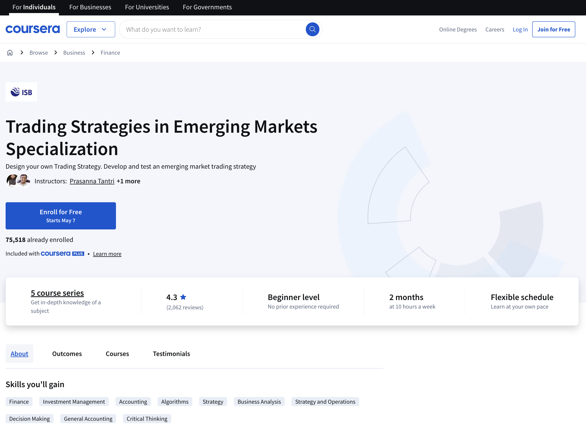

**Url:** [Trading Strategies in Emerging Markets](https://www.coursera.org/specializations/trading-strategy)

**Provider:** Indian School of Business (ISB) – offered on Coursera  

**Level:** Beginner → Intermediate (starts at basics; no prior trading experience required)  

**Duration:** 5 courses including a project; ~2 months at ~10 hours/week (approximately 60–70 hours total)  

**Pricing:** Coursera subscription (or free audit without certificate)  

**Certification:** Yes – Specialization certificate from ISB (via Coursera) upon completion of all courses  

**Curriculum Highlights:** This ISB specialization is an **excellent introduction to systematic trading strategy development**, with a unique focus on emerging markets. It is structured to take you from fundamental concepts to actually designing and testing your own trading strategy:

- **Course 1: Trading Basics** – Covers the essentials of financial markets and instruments. You’ll learn to read financial statements and understand key trading concepts like order types, trading costs, liquidity, and basic asset pricing models. This ensures you grasp the context (especially important in emerging markets) and can interpret market information.
- **Courses 2 & 3: Trading Algorithms & Advanced Trading Algorithms** – These two courses form the core of the specialization, presenting **seven quantitative trading strategies** proven by academic research for emerging markets. Strategies include **momentum and reversal strategies, earnings-based strategies (e.g., Piotroski F-score), and even text analysis of financial reports**. For each strategy, the instructors walk you through the original research paper (teaching you how to extract key insights from academic literature) and then demonstrate how to implement the strategy step-by-step. In the advanced course, you get into the science of **backtesting**: ensuring your strategy results are valid by avoiding pitfalls like look-ahead bias and survival bias. You also learn to incorporate transaction costs and risk measures, and evaluate performance with metrics like Sharpe ratio and alpha.
- **Course 4: Creating a Portfolio of Strategies** – Teaches how to combine multiple strategies into a coherent investment portfolio. You’ll analyze how adding a new strategy affects portfolio risk/return and learn techniques for optimal capital allocation among strategies. There’s also discussion on hedge fund management and investor expectations, which is great context if you aim to run strategies professionally.
- **Course 5: Capstone – Design Your Own Trading Strategy** – Here, you apply everything learned. The project guides you to develop a **completely new trading strategy**, backtest it on data, evaluate its performance, and even draft a plan as if you were pitching a hedge fund around it. This practical experience is invaluable, as you end up with a tested strategy (and code) of your own creation.  
**Why this course is notable:** ISB’s specialization is praised for its **academic rigor combined with hands-on practice**. It’s essentially like taking a graduate-level course in quantitative trading. By focusing on emerging markets, it highlights scenarios often overlooked in U.S.-centric courses – though the principles you learn are applicable globally (the strategies are “universal” but demonstrated in emerging market context). It’s one of the **best for beginners** because it starts from square one and builds up, with a very structured approach. Also, if you enjoy data and research, you’ll appreciate learning how to read finance research papers to extract trading ideas. By the end, you’ll have experience with multiple strategy types and a capstone project for your portfolio. In short, it’s **perfect for aspiring quants who want a guided path to creating algorithmic trading strategies from scratch**.

### 8. Machine Learning for Trading Specialization (Google Cloud & NYIF on Coursera)

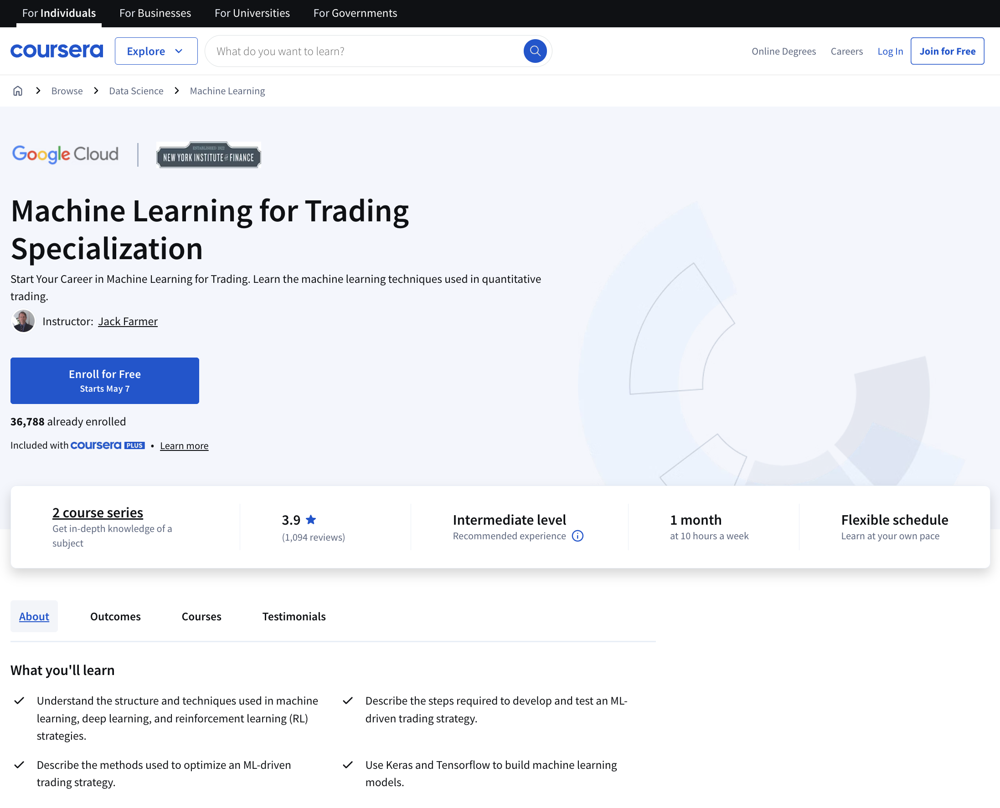

**Url:** [Machine Learning for Trading](https://www.coursera.org/specializations/machine-learning-trading)

**Provider:** New York Institute of Finance & Google Cloud – offered on Coursera  

**Level:** Intermediate (requires **advanced Python and ML proficiency** as prerequisites)  

**Duration:** ~2–3 courses, ~1–2 months (approximately 20–30 hours total, self-paced)  

**Pricing:** Coursera subscription (included in Coursera Plus; free audit available)  

**Certification:** Yes – Specialization certificate (NYIF/Google Cloud via Coursera)  

**Curriculum Highlights:** This is a **short, intensive specialization** aimed at experienced learners who want to apply machine learning specifically to trading. Co-created by Google Cloud and NYIF, it uniquely integrates using **Google Cloud Platform (GCP) tools** for algorithmic trading solutions. The specialization consists of two main courses (with an additional one previously planned, as per Google/NYIF announcements):

- **Introduction to Trading, Machine Learning & GCP:** This first course lays the groundwork by reviewing **trading fundamentals** (trends, returns, volatility, order types, etc.) and key quantitative trading strategies. Even though it’s an advanced program, they ensure you understand the trading domain basics (so that the ML applications make sense). It then moves to how machine learning can be applied to these financial problems. A distinctive aspect is that you get hands-on experience with **Google Cloud tools**: you’ll use GCP (e.g., BigQuery, AI Platform) to **build and run machine learning models in a cloud environment**. This means you learn not only the theory of ML for trading but also practical skills like setting up data pipelines and training models at scale on cloud infrastructure. By the end of this course, you will have built basic ML models in a Jupyter notebook using Google Cloud’s resources.
- **Using Machine Learning in Trading and Finance:** (This is an implied second course, focusing on specific ML techniques like neural networks, time-series forecasting, etc., applied to trading. *Summary based on program description:* You likely delve into deep learning models for price prediction, clustering for asset grouping, or other advanced ML methods relevant to finance. Integration of these models with trading strategies would be emphasized.)
- **Reinforcement Learning for Trading Strategies:** The final course centers on **reinforcement learning (RL)**. You’ll learn the structure of RL trading algorithms and how they differ from traditional strategies. The course walks through developing and testing an RL-driven trading strategy step by step – from defining states and rewards to training an agent to make optimal trading decisions. You also explore how to optimize and tune an RL trading bot for performance. As a challenge, the specialization invites you to apply RL to real trading use cases, reinforcing the learning by doing.  
**Why it’s unique:** This specialization is **highly focused on the intersection of cloud computing, machine learning, and trading**. It’s great for tech-savvy professionals — for example, a software engineer or data scientist who wants to break into quant trading, or a trader who already knows Python/ML and wants to leverage cloud AI services. By learning with Google Cloud tools, you gain skills in deploying scalable trading algorithms (an advantage when working with large datasets or live trading systems). The inclusion of a full course on reinforcement learning is also a plus, as RL is a frontier area for trading strategy innovation. Keep in mind that this course expects you to come in with solid Python, stats, and ML knowledge (it moves fast through the ML parts). If you meet that profile, it’s one of the **most cutting-edge short courses** to bring your trading automation skills to the next level, straight from industry experts. 

### 9. Executive Programme in Algorithmic Trading (EPAT) – QuantInsti

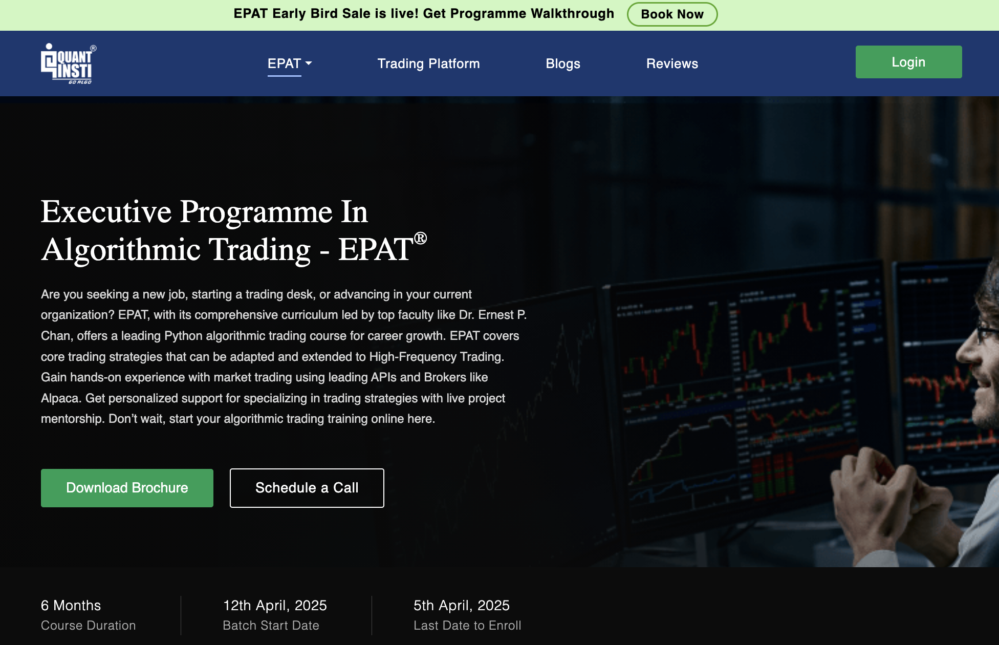

**Url:** [EPAT](https://www.quantinsti.com/epat)

**Provider:** QuantInsti (Quantitative Learning Pvt. Ltd) – Proprietary program (offered directly through QuantInsti’s platform)  

**Level:** Advanced/Professional (comprehensive program for serious traders and finance professionals; beginners with high motivation are also accepted)  

**Duration:** 6 months (part-time). Includes ~120+ hours of live online classes, plus projects  

**Pricing:** Around \$5,000–\$6,000 (standard tuition, with early-bird discounts and financing options). *For example, recent participants cite a fee of ~$5,999 USD*.  

**Certification:** Yes – **EPAT Certification** from QuantInsti. (This is widely recognized in the industry; EPAT alumni often mention it on LinkedIn, akin to an executive education credential.)  

**Curriculum Highlights:** EPAT is an immersive, career-oriented program often considered the **“gold standard”** for algorithmic trading education outside of a university degree. It’s taught by **world-class faculty** – including notable quants like Dr. Ernest Chan and Dr. Euan Sinclair – and covers **the full spectrum of algorithmic trading**. Key components of the curriculum include:

- **Quantitative Trading Strategies:** A wide array of strategies across asset classes (equities, forex, derivatives) and frequencies. You learn strategies ranging from **market making and high-frequency trading** to **momentum, mean reversion, statistical arbitrage, options Greeks-based strategies**, and more. The emphasis is on core principles that can be adapted to various markets, including HFT strategies.
- **Programming & Technology:** A heavy focus on **Python programming for trading**. EPAT starts by ensuring you have a good handle on Python, data analysis libraries (NumPy, pandas), and statistics. It also covers algorithmic trading infrastructure: **API integration with brokers**, using trading platforms, and even an introduction to cloud/AWS setups for algorithm deployment. By the end, you will have built and deployed trading algorithms using real APIs (e.g., connect to a broker like Interactive Brokers or Alpaca to execute trades).
- **Risk Management and Quantitative Techniques:** Modules on financial mathematics, risk modeling (VaR, drawdowns), portfolio optimization, and trading psychology/risk control. This ensures you not only can create algos but also manage them responsibly.
- **Market Microstructure & Electronic Markets:** Given the advanced nature, EPAT dives into exchange mechanisms, order types, slippage, and how to optimize execution in live markets (critical for HFT).
- **Machine Learning in Trading:** Introduction to applying machine learning to develop predictive models or improve strategies. While not as in-depth as a pure ML course, it gives exposure to how techniques like regression, SVMs, or neural networks can be used for algorithmic strategies.
- **Capstone Project and Mentorship:** One of EPAT’s strengths is the **personalized mentorship and hands-on project**. You will work on a capstone trading project (like developing a complete strategy or research paper) with guidance from mentors. This project can often serve as a proof-of-concept algorithm you might take live after the program.  

Classes are typically **live online on weekends** (to accommodate working professionals), and recordings are available for review. The cohort-based format means you can network with peers globally. There are also career services and a job portal for EPAT alumni, as QuantInsti has industry connections. **Why EPAT is top-tier:** In essence, EPAT offers a **master’s degree level of training in 6 months**. It’s one of the **most comprehensive algorithmic trading courses worldwide**, covering both **theory and extensive practical skill-building**. The faculty are practitioners, so you get insights that are immediately applicable. Many successful quants and traders have EPAT on their resume. If you are serious about a career in algorithmic trading or want to significantly upgrade your expertise (and you have the budget and time), EPAT is arguably the **best “all-in-one” program** available online. It takes you from zero to hero, or from intermediate to expert, with a structured curriculum and recognition in the industry. (It is a bigger commitment than other courses listed – but for many, the ROI in career growth justifies it.)

### 10. Algorithmic Trading A-Z™ with Python, Machine Learning & AWS (Udemy)

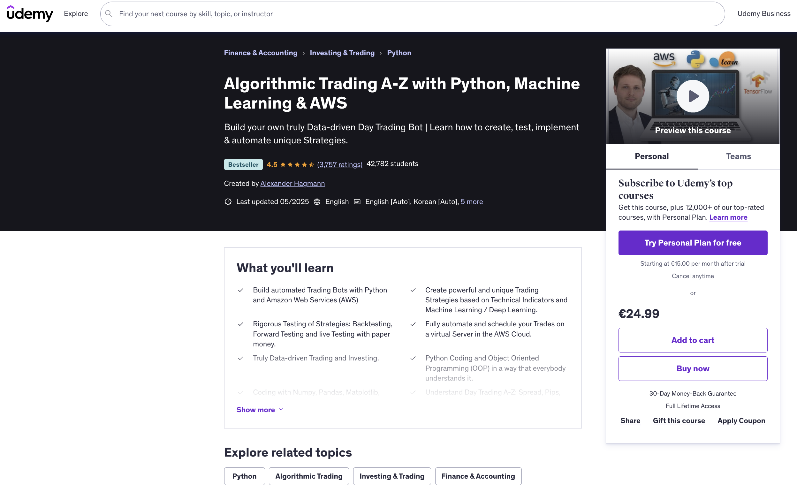

**Url:** [Algorithmic Trading A-Z™ with Python, Machine Learning & AWS][(https://www.udemy.com/course/algorithmic-trading-a-z-with-python-machine-learning-aws/](https://www.udemy.com/course/algorithmic-trading-with-python-and-machine-learning/))

**Provider:** Udemy – Instructor: Alexander Hagmann (experienced quant & data scientist)  

**Level:** Beginner to Intermediate (no prior coding or trading experience required)  

**Duration:** ~22+ hours of on-demand video content (self-paced), 100+ lectures (recently updated in 2025)  

**Pricing:** Approximately \$100 full price, but **Udemy frequently discounts** it to ~$15–20. (Includes lifetime access to all materials.)  

**Certification:** Yes – Udemy Certificate of Completion  

**Curriculum Highlights:** This Udemy bestseller is a **hands-on, end-to-end guide** to building trading bots and strategies from scratch. It’s one of the **most popular online algo trading courses** (4.5/5 rating from over 3,700 reviews and 42,000+ students), and it’s continuously updated (last updated May 2025) to reflect the latest tools and techniques. The course is structured in several sections:

- **Python Crash Course:** It starts by ensuring you have the necessary Python skills. Even if you’ve never coded, the instructor provides a primer on Python programming, covering basics up through using libraries like NumPy and pandas for financial data. This builds a foundation for those new to coding.
- **Trading Fundamentals:** You’ll learn key trading concepts (market orders, bid-ask spread, leverage, etc.) and get introduced to day trading mechanics across different assets (forex, stocks, etc.). This theoretical knowledge is important when automating strategies.
- **Developing Technical Strategies:** The course teaches you to create **technical indicator-based strategies** in Python. You will implement indicators (like moving averages, RSI, MACD) and combine them to form entry/exit rules. There’s emphasis on using **unique or combined indicators** to gain an edge, rather than just simplistic common strategies.
- **Machine Learning & Deep Learning:** True to its name, it doesn’t stop at traditional strategies – you’ll also learn to build and integrate **machine learning models**. This includes using scikit-learn for things like regression or classification-based strategies, and even Keras/TensorFlow for deep learning models that predict market movements. For example, you might create a neural network to forecast price direction and then trade based on that prediction.
- **Backtesting and Forward Testing:** A major focus is on **rigorous testing of strategies**. The instructor shows how to backtest your algorithm on historical data (vectorized backtesting for speed, as well as event-driven backtesting for realism), then how to do forward testing and paper trading to validate performance in unseen data. You even learn how to account for transaction costs and slippage in your backtests.
- **Automation & Deployment:** Uniquely, this course includes deploying your trading bot on the cloud. You learn to set up a **server on Amazon Web Services (AWS)** and schedule your Python trading script to run and execute trades automatically. It covers connecting to broker APIs (like **OANDA, Interactive Brokers, and FXCM**) to place trades live. By the end, you’ll have an automated trading system running with real (or paper) trading accounts.
- **Data-Driven Approach:** There’s a strong theme of making decisions based on data. You’ll stream real-time data, perform data analysis, and ensure your strategies are truly quantitative.

The course is taught through video lessons with lots of coding demos. You follow along building actual trading systems, which helps in learning by doing. **Why we recommend it:** This Udemy course is **perhaps the best value for money** for individual learners. It’s incredibly **comprehensive (from zero Python all the way to cloud deployment)**, yet accessible – a motivated beginner can start here and end with a working trading bot. It has a very practical, project-driven style. While it doesn’t have the prestige of a university name, its content rivals many academic courses. The fact that it’s updated regularly (even adding content on new trends like using ChatGPT in trading, etc.) means you’re learning **current techniques**. If budget is a concern or you prefer a single-course format, “Algorithmic Trading A-Z” is **the top pick for a self-paced, affordable introduction**. Thousands of students have used it to successfully build their first algorithmic strategies (as evidenced by its high rating and reviews). Plus, once you buy it, you can refer back to the material anytime to refresh specific topics. 

## Comparison Table of Top Algorithmic Trading Courses

To summarize the key attributes of each featured course, see the comparison table below. This side-by-side look at provider, level, duration, cost, and certification will help you quickly identify which course fits your needs:

| **Course & Provider**                                          | **Level**               | **Duration**                | **Pricing (Approx.)**                  | **Certification**                        | **Key Focus / Strength**                                   |
|---------------------------------------------------------------|-------------------------|-----------------------------|----------------------------------------|------------------------------------------|------------------------------------------------------------|
| **Papers with Backtest** (Independent monthly course)      | Beginner to Professional | Ongoing (monthly modules)   | $20/month (cancel anytime)             | No                                       | *Monthly strategy deep dives*; includes PDF, video, and Python backtest code. Ideal for hands-on learning and practical strategy review. |
| **Oxford Algorithmic Trading Programme** (Oxford Saïd/GetSmarter)     | Intermediate / Exec (No coding required) | 6 weeks  *~8-10 hrs/week* | £2,100 (≈\$2,500)           | Yes (Oxford Univ. certificate) | *Principles & strategy design*; finance theory, hedge funds, system design (prestigious credential) |
| **Udacity “AI for Trading” Nanodegree**                      | Intermediate to Advanced (Python/ML needed) | ~6 months  *self-paced*   | \$1,999 total (6-mo program) | Yes (Udacity Nanodegree cert)            | *AI/ML-driven trading*; hands-on projects in Python (portfolio optimization, NLP, deep learning)    |
| **Investment Management w/ Python & ML** (EDHEC via Coursera)  | Beginner → Intermediate (teaches Python)    | ~4 months (4 courses, ~80 hrs) | \$49/mo (Coursera sub; free audit) | Yes (Coursera/EDHEC certificate) | *Quant finance foundation*; portfolio analysis, data science, and Python for trading                |
| **Electronic Trading in Financial Mkts** (NYIF via edX)   | Beginner (Markets focus)       | ~12 hours  *self-paced*    | Free audit; ~$199 for cert              | Yes (edX/NYIF certificate)               | *Market structure & execution*; how electronic markets & order books work, trading mechanisms      |
| **ML & Reinforcement Learning in Finance** (NYU/Coursera) | Intermediate/Advanced (Quant/CS focus) | ~4 months (4 courses, ~80 hrs) | \$49/mo (Coursera sub; free audit)      | Yes (Coursera/NYU certificate)           | *Advanced ML for trading*; machine learning and **reinforcement learning** applied to finance      |
| **Trading Strategies in Emerging Markets** (ISB via Coursera) | Beginner (progressing to int.)   | ~2–3 months (5 courses, ~70 hrs) | \$49/mo (Coursera sub; free audit)      | Yes (Coursera/ISB certificate)           | *Strategy development*; academic research-based strategies, backtesting, and capstone project      |
| **Machine Learning for Trading** (Google Cloud/NYIF via Coursera) | Intermediate (Strong Python/ML req.) | ~1 month (2–3 courses, ~20–30 hrs) | \$49/mo (Coursera sub; free audit)      | Yes (Coursera/NYIF certificate)          | *ML & Cloud integration*; using Google Cloud, deep learning and **RL** for trading strategies      |
| **EPAT (Exec. Programme in Alg. Trading)** (QuantInsti)   | Advanced Professional                       | 6 months  *part-time (live)* | \$5,000–\$6,000 (financing available) | Yes (EPAT Certification)                | *Comprehensive career program*; live mentorship, HFT, multi-asset strategies, Python, real trading APIs |
| **Algorithmic Trading A-Z (Udemy)**                           | Beginner-friendly (no experience needed) | ~22+ hours video  *self-paced*  | \$15–\$100 (one-time, often on sale)     | Yes (Udemy completion cert)              | *Practical all-in-one*; build Python trading bots, technical & ML strategies, deploy to AWS         |

**Table:** Comparison of top online algorithmic trading courses (as of 2025). Each course is available globally and online-only. Duration and pricing are approximate. Always check course websites for the latest schedule and fees.

## Standout Picks – Which Course Should You Choose?

Every learner’s needs are different. Here are some **standout recommendations** to help you decide which course might be the best fit:

- **Best for Absolute Beginners:** *Trading Strategies in Emerging Markets (ISB/Coursera)* – This specialization starts from the ground up (no prior knowledge needed) and methodically teaches you how to develop and test trading strategies. It’s academic yet accessible, making it perfect for newcomers who want a guided, step-by-step learning path.

- **Best for a Prestigious Credential:** *Oxford Algorithmic Trading Programme* – If you value a **world-renowned university certificate**, Oxford’s online programme is unmatched. In just 6 weeks, you get a broad education in algo trading principles and the Oxford name on your resume (great for impressing employers). It’s ideal for finance professionals who want an executive education experience.

- **Most Comprehensive (Deep Dive):** *EPAT by QuantInsti* – For those seeking **depth and breadth**, EPAT is the top choice. It’s effectively a 6-month bootcamp covering everything in algorithmic trading (from programming to high-frequency strategies), with mentorship from industry experts. This is best for serious career quants or traders who want an all-inclusive, rigorous program (and are willing to invest time and money).

- **Best University-Backed MOOC:** *EDHEC’s Investment Management with Python & ML* – This Coursera specialization stands out for blending academic theory with practical Python skills. It’s great for learners who want a structured, university-designed curriculum at a low cost. Plus, you earn multiple certificates from a top business school as you progress.

- **Best for Machine Learning Enthusiasts:** *NYU’s ML & RL in Finance* – If your goal is to apply **AI techniques to trading**, this specialization is a winner. It delves into both machine learning and cutting-edge reinforcement learning for finance. Choose this if you have some quant background and want to push into advanced algorithm development using AI (it’s like an intro to “quant finance meets AI” by a leading university).

- **Most Hands-On Projects:** *Udacity AI for Trading Nanodegree* – Udacity’s program is project-centric, meaning you’ll build a portfolio of trading algorithms and models through the course of study. It’s excellent for those who learn best by doing. By completion, you’ll have several polished projects (like an NLP trading model, a portfolio optimizer, etc.) to showcase to employers or use in real trading.

- **Best Affordable All-in-One Course:** *Algorithmic Trading A-Z (Udemy)* – On a budget or limited time? This Udemy course offers **astonishing value**, covering everything from basic trading concepts to deploying an AWS trading bot, at a fraction of the cost of others. It’s self-paced, so you can dip in and out. Great for self-starters who want to get their feet wet in all aspects of algo trading without breaking the bank.

- **Best for Finance Professionals (Non-Coders):** *Oxford Algorithmic Trading Programme* – Worth mentioning again for a specific audience: if you’re a finance industry professional (trader, analyst, manager) with little coding experience, Oxford’s course is tailored for you. It focuses on strategies and evaluation rather than programming, giving you actionable insights you can use to supervise quant teams or evaluate algorithmic funds.

In conclusion, the **algorithmic trading course landscape in 2025** offers something for everyone – from free introductory MOOCs to intensive professional programs. All the courses listed are **online and globally accessible**, so you can learn from anywhere. As you evaluate options, consider your current skill level, your career goals, and how much time/resources you can commit. You might even combine courses (for example, take a Coursera specialization for theory and a Udemy course for practical coding) to maximize your learning. 

Algorithmic trading is a continuously evolving field – new technologies like AI, alternative data, and cloud computing are reshaping what’s possible. The courses above are updated with these trends, ensuring you gain **current, real-world applicable skills**. By investing in the right education, you’ll be well-equipped to thrive in the fast-paced world of algorithmic trading, whether you aim to build your own trading bots, work for a quantitative trading firm, or simply augment your traditional trading with automated strategies. Happy learning and trading!

## What are the basics of trading that a beginner should learn?  

For someone just starting out, the basics of trading are the foundation you’ll build everything else on. First, you need to understand what trading actually is: buying and selling assets—like stocks, currencies, or commodities—to make a profit based on price changes. It’s not about owning something long-term like an investor might; it’s about timing the market.

You’ll want to grasp key concepts like **supply and demand**—prices go up when more people want to buy than sell, and down when the opposite happens. Then there’s the idea of **markets** themselves: stocks trade on exchanges like the NYSE, forex (currency) happens 24/5 globally, and crypto runs on decentralized platforms. Each has its own vibe and rules.

Next, get familiar with **order types**. A market order buys or sells instantly at the current price, while a limit order sets a specific price you’re willing to trade at. Beginners often trip up here, so knowing these prevents costly mistakes.

**Charts and price movements** are huge too. Learn to read a basic candlestick chart—it shows you opening, closing, high, and low prices over time. Terms like “bullish” (price going up) and “bearish” (price dropping) will pop up constantly.

Don’t skip **risk management**—this is make-or-break. You should never risk more than you can afford to lose, and a simple rule like “only risk 1-2% of your account per trade” can save you from blowing up early.

Lastly, wrap your head around **brokerage accounts** and **fees**. You’ll need a platform to trade on, and they’ll charge commissions or spreads (the difference between buy and sell prices). Pick one that’s beginner-friendly but doesn’t nickel-and-dime you.

That’s the starter pack. It’s less about memorizing and more about getting comfortable with how it all fits together before jumping in.

## How do I choose the right trading course for my skill level?  

Picking the right trading [course](/wiki/best-algorithmic-trading-courses) depends on where you’re at and what you’re aiming for, so it’s about matching your current skills to the course’s focus. If you’re a beginner—say, you barely know a stock from a [forex](/wiki/forex-system) pair—look for something that starts with the basics: how markets work, simple strategies, and terms like “bid” or “leverage.” These courses should feel like they’re walking you through step-by-step, not throwing you into the deep end with jargon or complex math.

If you’ve got some experience—maybe you’ve made a few trades or can read a chart—go for an intermediate course. These usually dive into specific strategies (like swing trading or technical analysis) and assume you’re past needing “what’s a broker” explained. Check the syllabus or reviews to see if it builds on what you already know without repeating too much.

For advanced traders, you’re looking at niche or high-level stuff: [algorithmic trading](/wiki/algorithmic-trading), options spreads, or mastering risk in volatile markets like crypto. These courses should challenge you with real-world application—think live trading examples or deep dives into tools like TradingView—and not waste time on beginner fluff.

A quick way to judge fit is to look at the course’s target audience (usually in the description) and prerequisites. If it says “no experience needed,” it’s beginner-tier. If it’s tossing around terms like “Fibonacci retracement” or “hedging” upfront, it’s likely intermediate or higher. Sample a free lesson if they offer one—does it click, or are you lost? Also, consider your goals: [day trading](/wiki/day-trading-spy), long-term gains, or just understanding markets. A course misaligned with that will feel frustrating no matter your level.

Peer feedback helps too—look for reviews from people at your stage. A course that’s gold for pros might overwhelm a newbie, and one that’s perfect for beginners might bore someone seasoned. Match the pace and depth to where you’re standing, and you’ll get the most out of it.

## What are the key differences between free and paid trading courses?  

Free and paid trading courses differ mainly in depth, structure, and support—each has its strengths, but it’s about what you’re willing to trade off. Free courses, often found on YouTube, blogs, or platforms like Coursera’s audit mode, give you the basics without costing a dime. They’re usually broad overviews—think intros to trading concepts, simple strategies like moving averages, or how to set up a broker account. The upside is accessibility; anyone can jump in. But they’re often light on detail, lack personalized guidance, and might not update with market changes. You’re also on your own to sift through what’s legit—some free stuff is just bait to upsell you later.

Paid courses, whether they’re $50 or $500, typically offer more meat. You’re paying for structure—think step-by-step modules, quizzes, or even live sessions. They often go deeper into specific topics like risk management, advanced chart patterns, or niche markets (crypto, options). Instructors might be vetted pros with real trading creds, and you could get extras like community access, trade simulators, or one-on-one feedback. The catch? Quality varies wildly—some are overpriced repackaged basics—and you’re locked into their framework, which might not fit your style.

Time commitment’s another split. Free courses let you dip in and out, no pressure. Paid ones often demand you follow their pace, especially with live cohorts or deadlines. Support’s a biggie too—free rarely offers direct help, while paid might give you email Q&A or Discord groups. Cost aside, free leans on your self-discipline to fill gaps; paid bets on curated content to fast-track you. It’s less about “better” and more about whether you need a hand-held journey or can DIY it with scattered resources.

## Which trading strategies should a beginner focus on mastering?  

For beginners, the goal is to start with trading strategies that are straightforward, forgiving, and build confidence without overwhelming you. Here are a few to focus on mastering early:

**Trend Following** is a solid pick. It’s about spotting when prices are consistently moving up (bullish) or down (bearish) and riding that wave. You use simple tools like moving averages—say, a 50-day crossing over a 200-day signals “buy”—to confirm the trend. It’s beginner-friendly because it’s visual, doesn’t need split-second timing, and teaches you patience while markets do their thing.

**Breakout Trading** is another good one. This is when you wait for a price to bust through a key level—like a high it’s hit before (resistance) or a low it’s bounced off (support)—and trade in that direction. Think buying when a stock jumps past $50 after stalling there repeatedly. It’s intuitive: big moves often follow breakouts. Just watch for false signals, which you’ll learn to spot with practice.

**Swing Trading** fits if you don’t want to stare at screens all day. You’re aiming to catch price “swings” over a few days or weeks, buying low and selling higher (or vice versa). It leans on basic chart patterns—like double bottoms or head-and-shoulders—and teaches you to read momentum without needing crazy precision. It’s less stressful than day trading for newbies.

**Position Trading** takes it even slower. You hold for weeks or months, betting on bigger trends—like a company’s growth or a sector heating up. It’s almost investing with an exit plan. Beginners like it because it’s low-maintenance and forces you to think bigger-picture, not just chase daily noise.

Stick to these because they don’t need advanced math or lightning-fast moves. Focus on one or two, practice with paper trading (fake money), and get comfy with how they play out. They’ll teach you market behavior, timing, and discipline—core skills that scale up later. Avoid stuff like [scalping](/wiki/gamma-scalping) or options until you’ve got these down; those can burn you quick if you’re green.

## How can I evaluate the credibility of a trading course instructor?  

Evaluating a trading course instructor’s credibility comes down to digging into their track record, transparency, and how they present themselves—gut checks matter too. Start with their **experience**. Do they have real-world trading history, or are they just parroting theory? Look for specifics: years in the game, markets they’ve traded (stocks, forex, crypto), or even a verifiable portfolio. If they’re vague—like “I’ve made millions!” with no proof—red flag.

Next, check their **results**. A legit instructor might share past trades or performance stats, even if it’s not all wins—losses show they’re human. Be wary of anyone flashing Lambos or promising riches without evidence; real traders don’t need to flex like that. Some post trade recaps on social media or blogs—cross-check those for consistency.

**Reputation** is key. Search their name online, especially on platforms like X or trading forums. What are students saying? Look for unfiltered takes—glowing reviews on their own site can be curated, but raw chatter elsewhere cuts through the noise. If they’ve got a history of lawsuits, scams, or disappearing after hype, it’ll surface.

Their **teaching style** hints at credibility too. Do they explain concepts clearly, or lean on jargon to sound smart? A good instructor breaks things down without dodging questions. Free content—like a webinar or YouTube vid—can show if they actually know their stuff or just sell dreams.

Finally, **credentials** aren’t everything, but they help. Certifications (like CFA or CMT) or ties to legit firms add weight. No formal creds? Fine, if their practical success backs them up. Cross-reference claims with public records or industry contacts if you can.

Trust your nose - if they’re more salesman than teacher, or their story smells off, walk away. Solid instructors don’t need to oversell; their knowledge does the talking.

## What role does risk management play in trading education?  

Risk management is the backbone of trading education—it’s what keeps you in the game long enough to actually learn anything. Without it, you’re just gambling, and the market doesn’t care how smart you think you are. It’s about controlling how much you can lose before you even think about winning, which is why it’s drilled into any decent trading course.

At its core, it teaches you to **limit losses**. Markets are unpredictable—prices can tank on news, a bad trade, or just random noise. A beginner might bet half their account on one move and get wiped out. Risk management says, “Nah, cap it at 1-2% per trade.” That way, even a string of losses won’t end you. It’s less sexy than chasing gains, but it’s survival.

It also forces you to **size your trades right**. You learn position sizing—how much to buy based on your account and stop-loss (the price where you’ll cut a losing trade). Say you’ve got $10,000 and risk 1% ($100). If your stop-loss is $1 below entry, you buy 100 shares, not 1,000. This math keeps emotions in check; no panic-selling or overbetting.

Then there’s **psychology**. Trading education hammers risk management because it trains you to handle fear and greed—emotions that wreck newbies. Knowing you’ve got a plan (like a stop-loss or a risk-reward ratio of 1:2) stops you from holding a loser too long or cashing out too early. It’s less about the market and more about mastering yourself.

It ties into **strategy too**. A course might teach trend-following or breakouts, but risk management decides if they work for you. High-win-rate strategies might tolerate tighter risks; long-shot plays need stricter limits. Without this lens, you’re blind to what’s sustainable.

In short, it’s the difference between a trader and a dreamer. Education without it is just theory—risk management makes it real, keeping your capital alive so you can grow. Ignore it, and you’re out before you start.

## Are there trading courses tailored to specific markets like stocks, forex, or crypto?  

Yes, there are trading courses tailored to specific markets like stocks, forex, or crypto, and they’re designed to match the unique quirks of each. Stock trading courses, for instance, often focus on company fundamentals—think earnings reports, P/E ratios, and sector trends—alongside technical analysis like chart patterns or [volume](/wiki/volume-trading-strategy) spikes. They’re built for a market that’s tied to business performance and economic cycles, so you’ll see lessons on things like dividend plays or how to trade earnings season.

Forex courses zero in on currency pairs and the global forces driving them—interest rates, central bank moves, geopolitical events. They’ll teach you about leverage (which can be sky-high in forex), pips, and reading economic calendars. The 24/5 nature of forex means strategies often revolve around timing major sessions like London or New York opens, and you’ll get tools like MetaTrader drilled into you.

Crypto courses are a different beast. They tackle a market that’s 24/7, wildly volatile, and less tethered to traditional economics. You’ll learn about blockchain basics, wallet security, and trading altcoins versus majors like Bitcoin or Ethereum. They often lean hard into technical analysis—think support/resistance or RSI—since fundamentals can be murkier, and sentiment drives a lot. Some even cover DeFi or spotting pump-and-dumps, which are crypto-specific headaches.

Plenty of platforms cater to these niches. Udemy has beginner-friendly options like “Stock Market from Scratch” or “Cryptocurrency Fundamentals.” Forex.com offers free forex-focused modules, while places like Asia Forex Mentor dive deep into currency strategies. For crypto, Rekt Capital or TodayTrader specialize in altcoin and Bitcoin tactics. Each market’s courses reflect its pace, risks, and tools—stocks are steady, forex is global, crypto’s the wild west. Pick based on what market vibes with you.

## How much time should I expect to invest in a trading course?  

How much time you’ll invest in a trading course depends on its format, depth, and your starting point, but it’s usually a mix of upfront learning and ongoing practice. For a beginner course—say, an intro to stocks or forex—you’re looking at **10-20 hours** of core content. That’s video lessons, quizzes, or reading spread over a few weeks if it’s self-paced, or condensed into days for a live bootcamp. Add another **10-15 hours** messing around with demo accounts to test what you’ve learned. So, call it 20-35 hours total to get comfortable.

Intermediate courses, like ones on swing trading or technical analysis, step it up—think **20-40 hours** of material. They assume you know the basics, so they pile on strategies, tools, and case studies. Practice doubles here—another **20-40 hours**—because you’re refining timing and spotting patterns in real-time charts. You’re in for 40-80 hours over a month or two if you’re serious.

Advanced courses—options, algo trading, or crypto scalping—can demand **50-100 hours**. They’re dense, with live trading sessions, complex math, or coding (for algos). Practice is endless—easily **50+ hours**—since mastery means executing under pressure. This could stretch over months, especially if you’re balancing a job.

Your pace matters too. Self-learners on Udemy might spread 20 hours over six weeks; a full-time student could crush it in days. Live courses (like a 5-day workshop) compress it but expect full focus—8 hours daily. Realistically, budget **1-3 months** for most courses, including practice, unless you’re all-in with no distractions. The catch? Learning doesn’t stop—markets evolve, so you’re tweaking what you know forever. Start small, commit consistent chunks (2-3 hours a week), and scale up as it clicks.

## What are the signs of a trading course scam to avoid?  

Spotting a trading course scam is about trusting your gut while keeping an eye on red flags. First, if they’re promising you’ll get rich quick—like “millionaire in 30 days” or “guaranteed profits”—run. Trading’s a grind, not a lottery ticket; legit courses talk probabilities, not certainties. Next, check the instructor. If they’re flaunting Lambos and private jets but can’t show a verifiable trading track record, they’re likely selling hype, not skill. Real pros don’t need to flex—they’ve got results.

Look at the sales pitch. High-pressure tactics like “limited spots” or “price doubles tomorrow” scream manipulation. Scammers thrive on FOMO. If the course is light on details—vague about what you’ll actually learn, no syllabus, just buzzwords like “secret system”—it’s probably thin air. Legit ones outline specific skills, like technical analysis or risk management, not some mystical formula.

Price is a clue, too. Dirt-cheap courses ($20 for “everything”) often deliver generic fluff or upsell you later. On the flip side, crazy-high prices (thousands upfront) with no refunds or previews can signal a cash grab—especially if they dodge questions about content. Testimonials? If they’re all glowing 5-stars with no substance (“Changed my life!”), they’re likely fake. Real reviews have grit—some wins, some gripes.

Finally, dig into their community or support. Scams often ghost you post-payment—no real mentorship, dead forums, or canned replies. Cross-check the course name or instructor online or on platforms like X for unfiltered opinions. If it’s littered with complaints about non-delivery or shady billing, you’ve got your answer. Trust the smell test—if it feels off, it probably is.

## How can I measure my progress after completing a trading course?

Measuring your progress after a trading course comes down to tracking tangible outcomes and self-assessing your skills, not just hoping you "feel smarter." Start with your trading performance if you’re putting money on the line. Look at your win rate—how many trades profit versus lose—and your risk-reward ratio, like whether you’re consistently making more on winners than you lose on losers. A course worth its salt should leave you better at spotting setups and cutting losses, so compare your stats pre- and post-course. Even a small uptick, say from a 30% to 40% win rate, shows growth.

If you’re not trading live yet, use a simulator. Most decent platforms (Thinkorswim, TradingView) let you paper trade. Test the strategies you learned—say, a moving average crossover or [breakout](/wiki/breakout-trading) play—and log your results over 20-50 trades. Consistency matters more than one big win; are you executing the plan without hesitation? That’s progress.

Beyond numbers, gauge your decision-making. Can you read a chart faster—spot support, resistance, or volume spikes without second-guessing? Do you understand why a trade failed instead of just shrugging? A good course sharpens your reasoning, so keep a journal. Write down your trade logic before and after; if your “whys” get clearer and less emotional, you’re leveling up.

Test your knowledge, too. Take a concept from the course—like options Greeks or trend analysis—and explain it to someone (or yourself in a mirror). If you stumble, revisit it. Progress isn’t just profits; it’s confidence in the tools you’ve got. Lastly, set a benchmark. Before the course, maybe you blew up a demo account in a week; now, can you grow it 5% in a month? Hard data beats vague vibes every time.

## References & further reading

[1]: Chlistalla, M. (2011). [High-frequency trading. Better than its reputation?](https://c.mql5.com/forextsd/forum/168/high-frequency_trading_-_better_than_its_reputation.pdf). Deutsche Bank Research, Frankfurt am Main, Germany.

[2]: Aldridge, I. (2013). [High-frequency trading: a practical guide to algorithmic strategies and trading systems](https://www.amazon.com/High-Frequency-Trading-Practical-Algorithmic-Strategies/dp/1118343506). John Wiley & Sons.

[3]: Digital Defynd. (2025). [5 Best + Free Algorithmic / Day Trading Courses & Executive Programs (Oxford, Udemy)](https://digitaldefynd.com/best-algorithmic-trading-courses/). Retrieved April 2025.

[4]: Bankers By Day. (2025). [Best Algorithmic Trading Courses (2025) ranked by Bankers](https://www.bankersbyday.com/algorithmic-trading-courses/).

[5]: Oxford Saïd Business School. (2025). [Oxford Algorithmic Trading Programme](https://www.sbs.ox.ac.uk/programmes/executive-education/online-programmes/oxford-algorithmic-trading-programme).

[6]: EDHEC Risk Climate Impact Institute. (2025). [Investment Management with Python and Machine Learning](https://climateimpact.edhec.edu/investment-management-python-and-machine-learning).

[7]: Coursera. (2025). [Machine Learning for Trading Specialization](https://www.coursera.org/specializations/machine-learning-trading).

[8]: Coursera. (2025). [Trading Strategies in Emerging Markets Specialization (ISB)](https://www.coursera.org/specializations/trading-strategy).

[9]: Udemy. (2025). [Algorithmic Trading A-Z with Python, Machine Learning & AWS](https://www.udemy.com/course/algorithmic-trading-with-python-and-machine-learning/).

[10]: QuantInsti. (2025). [Executive Programme in Algorithmic Trading (EPAT)](https://www.quantinsti.com/epat).

