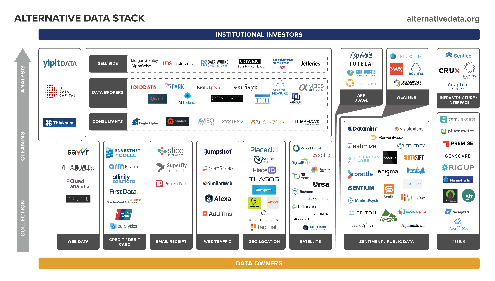
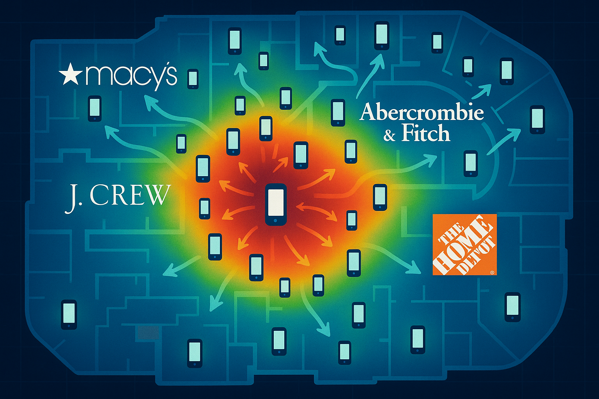
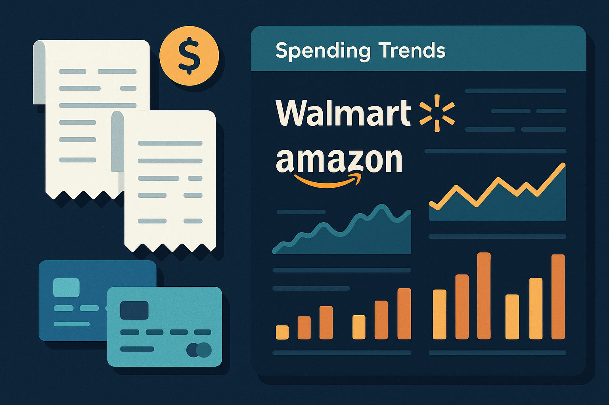
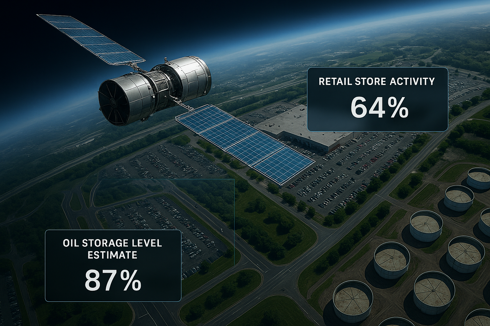
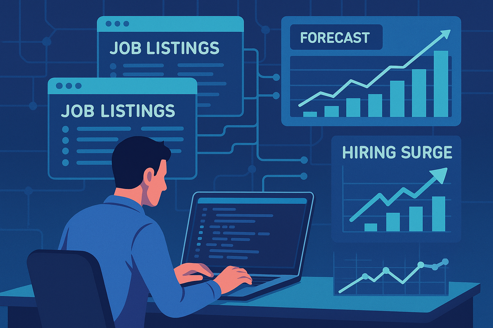
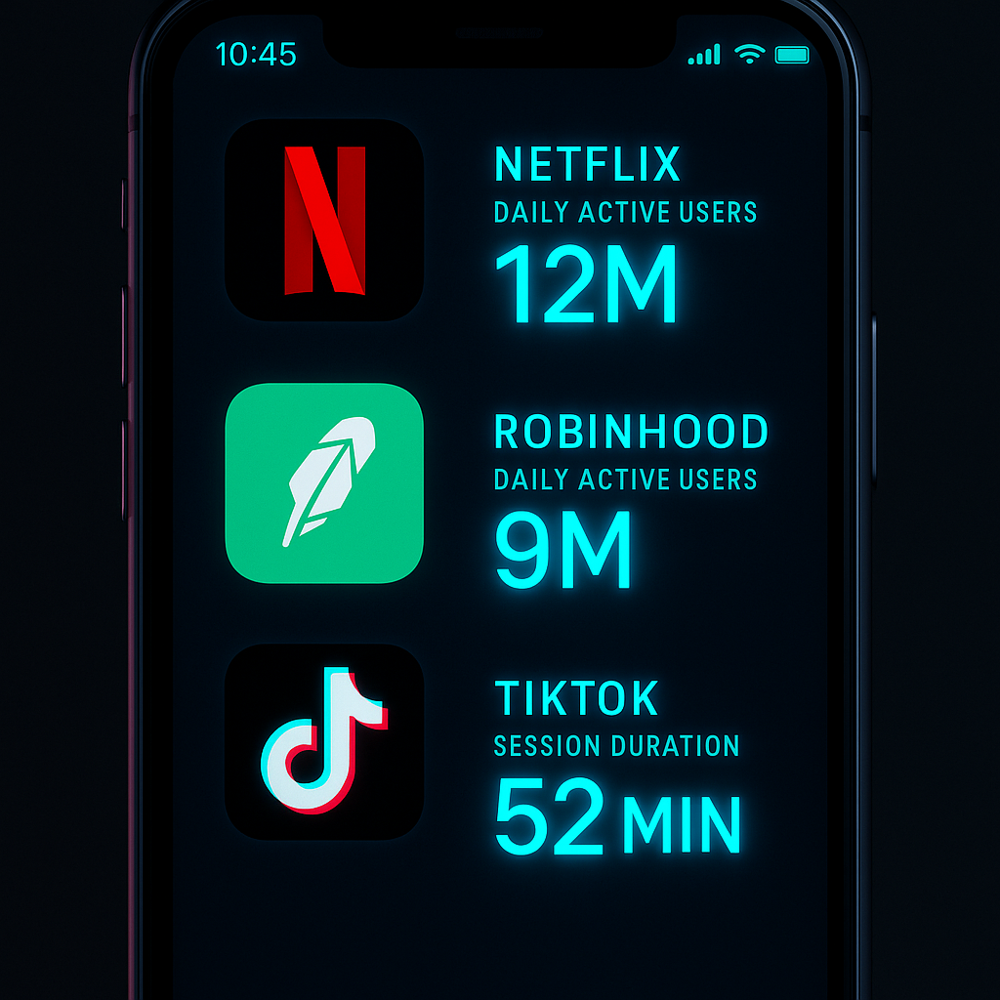
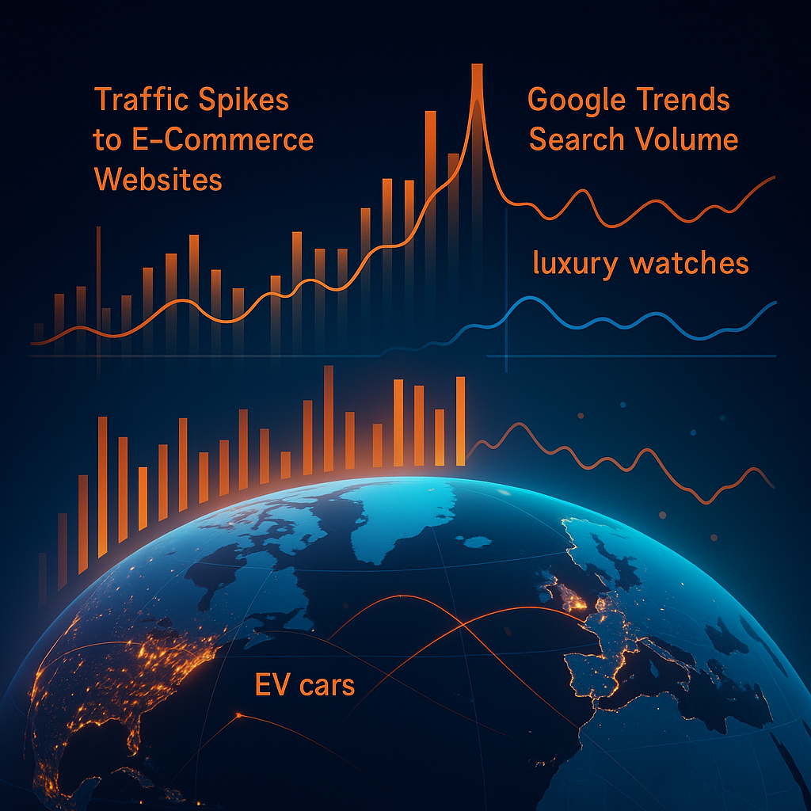
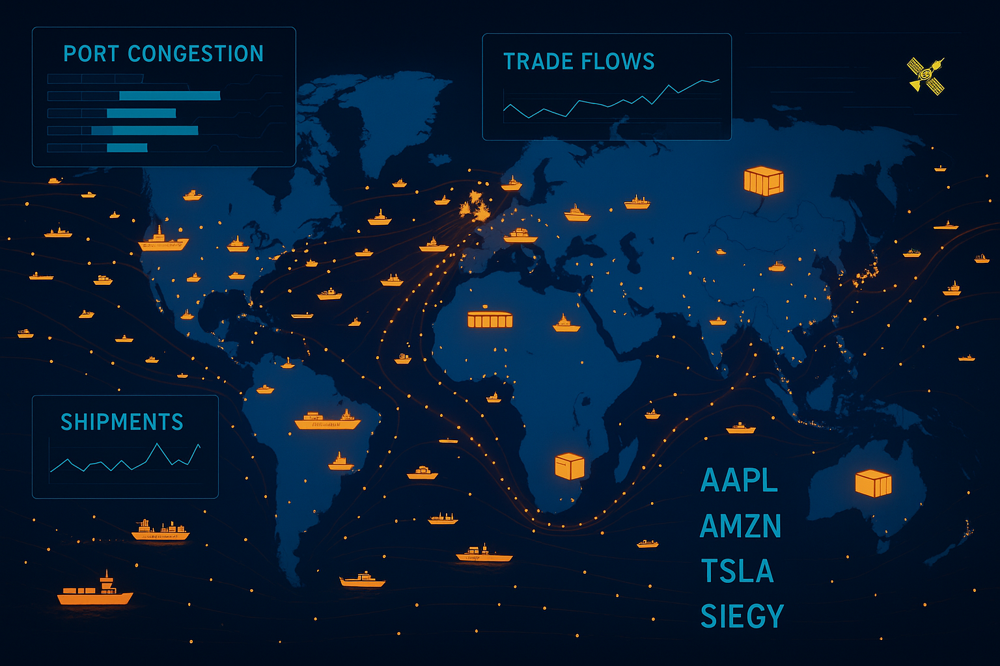

In the race for alpha, quant traders in 2025 are increasingly turning to **alternative data** – non-traditional datasets that offer unique insights beyond financial statements and price feeds. As conventional signals get arbitraged away, these novel data sources have become *vital* to stay ahead of the competition. Surveys indicate that **85% of leading hedge funds use at least two alternative datasets**, and nearly a third of quant funds attribute over 20% of their performance to alternative data. The appeal is clear: whether it’s satellite images of retail parking lots or anonymized credit card swipes, alternative data can provide faster or deeper insight into economic activity, helping quants discover fresh alpha before rivals do. In an era of rapid information dissemination and **alpha decay**, the first to harness a novel dataset can exploit a temporary edge. At the same time, alternative data has matured from a niche experiment into a mainstream tool – **67% of investment professionals now use alt data, up from just 31% in 2022** – making unique data sources and advanced analytics more important than ever. This article presents a comprehensive look at the best alternative data sources for quant trading in 2025, from the types of data and top providers to integration techniques, compliance considerations, and emerging trends shaping the future of this fast-growing field.

## Table of Contents

## Taxonomy of Alternative Data Types for Quant Trading

Alternative data spans a wide array of information channels. Broadly, we can classify it by the source or behavior it captures. Key categories include **geolocation data** (e.g. smartphone-derived foot traffic), **consumer transactions** (credit/debit card and point-of-sale data), **satellite imagery** (remote sensing of physical assets), **web-scraped business data** (such as job postings and product reviews), **social and sentiment data** (from social media, news, and ESG signals), **mobile app usage** (user engagement metrics from smartphones), **web traffic and search data** (website visits and online interest), and **shipping or supply chain data** (logistics and trade flows). Each category comes with distinct strengths and challenges, and quant funds often combine multiple datasets for a fuller picture. The table below summarizes these data types with example use cases and leading providers:

| **Data Type**                     | **Example Use Case**                                                                                 | **Notable Providers (2025)**                                                                          |
| --------------------------------- | ---------------------------------------------------------------------------------------------------- | ----------------------------------------------------------------------------------------------------- |
| **Geolocation (Foot Traffic)**    | Estimate retail sales from store visit counts; track regional activity trends.                       | SafeGraph (US), Placer.ai (US), Advan (global), Unacast (US/EU)                                       |
| **Consumer Transactions**         | Forecast company revenue via credit card spend; detect market share shifts.                          | 1010data (US), Earnest Analytics (US), Second Measure (US), Fable Data (EU)                           |
| **Satellite Imagery**             | Anticipate earnings with parking lot car counts; monitor commodities (oil storage, crops).           | Orbital Insight (US/global), RS Metrics (US), SpaceKnow (EU), Kayrros (EU)                            |
| **Web-Scraped (Jobs & More)**     | Gauge growth by tracking job postings; monitor product prices or reviews online.                     | Thinknum (US/global), LinkUp (global), Revelio Labs (global), Diffbot (global)                        |
| **Social & News Sentiment (ESG)** | Trade on real-time sentiment shifts or ESG controversies; e.g. Reddit buzz or negative news signals. | RavenPack (global), RepRisk (global), FactSet Truvalue (US/global), Social Market Analytics (US)      |
| **Mobile App Usage**              | Track app engagement to predict subscriber growth (e.g. streaming or fintech apps).                  | Data.ai (AppAnnie) (global), Sensor Tower (global), Apptopia (global)                                 |
| **Web Traffic & Search**          | Project e-commerce sales from site visits; assess brand interest via search trends.                  | SimilarWeb (global), Google Trends (global), Cloudflare Radar (global), Comscore (US)                 |
| **Shipping & Supply Chain**       | Anticipate commodity moves via cargo shipping data; track retailers’ import/export volumes.          | MarineTraffic/Spire (global), S\&P Panjiva (global), Orbital Insight (oil storage), CargoMetrics (US) |

*Table: Key categories of alternative data, with example use cases and leading data providers in 2025.*

Below, we delve into each of these data types, discussing what they offer, how quant funds use them, and the unique challenges each presents.

### Geolocation Data (Foot Traffic)

Geolocation data – often derived from opt-in mobile app location services – allows quants to analyze **foot traffic and mobility patterns** in the physical world. By aggregating anonymized smartphone pings, this data can reveal how many people visit particular stores, malls, airports, or regions. The **strength** of foot traffic data is its direct read on real-world consumer activity in near-real-time. For example, counting cars in retail parking lots or the number of phones detected at store locations can **accurately anticipate a retailer’s quarterly earnings** well before the earnings report. In one study, traders who exploited satellite-based parking lot counts earned **4–5% abnormal returns in the days around earnings announcements** by predicting surprises ahead of the market. Such insights have turned foot traffic metrics into a coveted edge. Funds have used location data to forecast **same-store sales** by tracking visits – one fund famously shorted a chain after seeing sustained footfall declines, a strategy validated when weak sales figures sent the stock down.

However, **challenges** abound. Geolocation datasets are massive and require significant cleaning and filtering (e.g. mapping latitude-longitude pings to specific stores or “geofences”). Privacy regulations also demand that this data be anonymized and aggregated. Indeed, a major struggle for foot traffic analytics is navigating privacy laws like GDPR while still extracting meaningful signals. There’s also an inherent **coverage bias** – not every consumer carries an app that shares location, so data providers must scale up to millions of devices to approach representative coverage. Despite these hurdles, when handled properly, foot traffic data has proven to be a **“predictor of financial performance”**, with at least one provider claiming its location and transaction data forecasts are **more accurate than Wall Street analysts’ expectations**.

**Providers:** The geolocation data space has both specialized vendors and data aggregators. In the U.S., firms like [SafeGraph](https://www.safegraph.com/) and [Placer.ai](https://www.placer.ai/) offer detailed foot traffic feeds for retail and real estate analysis. [Advan Research](https://advanresearch.com/) combines mobile location with transaction data, mapping **7,000 companies** to real-world visit trends. For a global lens, providers such as [Unacast](https://www.unacast.com/) and [Cuebiq](https://cuebiq.com/) (Europe) supply mobility data across regions. These vendors supply data either as raw feeds (API or cloud files) or as analytics platforms, often with tools to query traffic by location, time, and demographics. In 2025, quant funds typically ingest this data via cloud pipelines and integrate it with their models to track consumer footfall as a leading indicator for brick-and-mortar business performance.

### Consumer Transaction Data (Credit Card and Sales)

One of the most powerful alternative datasets is **consumer transaction data** – aggregated records of credit and debit card swipes, loyalty program transactions, or even email receipts. This data provides a **near real-time ledger of consumer spending**, which is incredibly valuable for predicting company revenues, **same-store sales**, and earnings outcomes. **Strengths:** Transaction data directly measures what people are buying (and how much they spend), often with daily or weekly updates. Academic research confirms its value: **daily card sales data can predict companies’ quarterly earnings surprises** with high accuracy. In fact, one study found that consumer transaction signals yielded a *long-short strategy return of \~16% per annum* – strong evidence that these insights translate to alpha. Hedge funds have capitalized on this edge. For example, during the 2020 pandemic, funds tracking **aggregated credit card swipes** saw surging online spend at Amazon and **successfully traded the stock’s rally**, beating peers who relied only on traditional indicators. Card data also tipped off investors to **shifts in market share** – e.g. detecting that one retailer’s sales were siphoned by a competitor – allowing timely portfolio adjustments.

Consumer spend data does come with **challenges**. It is typically sourced from panels (e.g. a network of banks or payment processors), so **data coverage can be fragmented** and biased if not carefully aggregated. A given dataset might over-represent certain demographics or regions. Funds mitigate this by using specialized **aggregators that pre-clean and anonymize the data**, often merging multiple sources to improve coverage. Ensuring **point-in-time availability** is another concern – traders need to know exactly when the data was visible to avoid any lookahead bias in backtesting. Many providers deliver data with a short lag (say T+2 days) and timestamp each entry for compliance. **Privacy and compliance** are also paramount: transaction data is aggregated and stripped of personal identifiers to comply with regulations (no fund wants an illegal trove of raw personal spending records). Despite these hurdles, once cleaned and properly aligned, consumer transaction data is often described as a “gold mine” for quants, essentially offering a **real-time income statement** for thousands of companies. Earnest Analytics, for instance, combines two large card panels and uses AI to predict **earnings surprises with 90% accuracy** versus actuals.

**Providers:** The ecosystem for transaction data in 2025 includes both raw data providers and research-oriented firms. On the raw side, [Facteus](https://www.facteus.com/) and [Envestnet|Yodlee](https://www.yodlee.com/) aggregate anonymized card swipes from banks and fintech apps, while [Second Measure](https://secondmeasure.com/) (acquired by Bloomberg) and [1010data](https://www.1010data.com/) provide platforms to query consumer spending by company. [Earnest Analytics](https://www.earnestanalytics.com/) (formerly Earnest Research) offers cleaned consumer spend datasets and a dashboard for real-time sales trends. [M Science](https://www.mscience.com/) and [YipitData](https://www.yipitdata.com/) take a slightly different approach by delivering investment research derived from multiple alt data sources (including card data), often giving clients a higher-level analysis (e.g. a report forecasting Netflix subscriber revenue) rather than just raw feeds. Regionally, [Fable Data](https://www.fabledata.com/) in Europe provides transaction data from EU and UK banking sources (important as GDPR limited some data collection, making local providers key). In Asia, credit card networks and alternative payment platforms are emerging sources – for instance, some investors tap into Japanese credit card consortia data or India’s digital payments trends via fintech partnerships. Overall, transaction data is among the **most sought-after alt datasets**, and top-tier funds commonly budget significant sums (millions of dollars annually) for these feeds – a trend reflected in the rising alt data spend budgets across the industry.

### Satellite Imagery and Remote Sensing

Satellite imagery represents the “eyes in the sky” for quant investors, providing **direct observation of physical economic activity from space**. High-resolution satellites can capture images of everything from retail parking lots and shipping ports to farmland and factory construction. Using computer vision and AI, these images are transformed into data feeds – for example, **counting the number of cars** in 10,000+ store parking lots or measuring the **shadow area of floating oil tank roofs** to estimate oil inventory levels. The **strength** of satellite data is its ability to monitor activity that is hard to glean from financial reports. It offers truly independent, *real-time macro and micro indicators*: crop health indexes, mining activity, cargo ship traffic, nighttime lights as a proxy for economic output, etc. A classic use case was **counting cars at Walmart stores** to forecast sales – pioneered around 2010, this approach showed that parking lot traffic correlated with same-store sales, enabling analysts to predict earnings surprises and stock moves. Researchers found that funds using such imagery could earn significant excess returns, since **few others had access to the data**. In one example, UBS analysts successfully used satellite photos of **Walmart parking lots** to anticipate revenue upticks, beating consensus estimates. Another powerful application is in commodities: **Orbital Insight** helped hedge funds predict oil price movements by tracking **global oil storage** levels via satellite – monitoring the fill levels of dozens of tank farms worldwide. By knowing if oil inventories were building or drawing down faster than expected, traders positioned their energy trades advantageously ahead of official reports.

The **challenges** with satellite data are notable. First, imagery is unstructured and **requires specialized analysis** – quant funds need data scientists who can turn pixels into meaningful metrics. This often means partnering with providers that deliver the analysis (e.g. object counts, index values) rather than raw images. Second, satellite data can be **costly**; high-resolution images and historical archives come at a premium, which historically put this data out of reach for smaller players. There’s also the issue of coverage and frequency: a given satellite might pass over a location only once every few days. Providers mitigate this with constellations of satellites and by focusing on use cases where periodic snapshots are sufficient (e.g. weekly store traffic or monthly construction progress). Cloud cover and image resolution limit what can be observed – e.g. counting *vehicles* is feasible, but counting *people* is not. Another concern is that once a satellite signal becomes widely known, its alpha can diminish; indeed, since such imagery has been commercially available since 2011, large hedge funds have extracted value from it, leaving a potential gap between **sophisticated users and those left “outside the information loop”**. Still, new satellite sources (including **SAR radar imagery** that can see through clouds, and higher-frequency microsat satellites) continue to expand possibilities in 2025.

**Providers:** Leading the pack is [Orbital Insight](https://www.orbitalinsight.com/), which offers an analytics platform for geospatial data – from counting retail foot traffic and oil barrels to measuring **global supply chain activity** via ships, farms, and factories. [RS Metrics](https://rsmetrics.com/), an early pioneer (founded by the “parking lot counting” entrepreneurs), remains active with products like [Xponent](https://www.iqvia.com/locations/united-states/library/fact-sheets/xponent) for retail footfall and **ESGSignals** for environmental metrics (e.g. tracking solar farm installations). [SpaceKnow](https://spaceknow.com/) and [Ursa Space](https://ursaspace.com/) specialize in specific niches – SpaceKnow, for example, provides an index of **industrial activity in China** by observing factory sites, while Ursa focuses on oil and commodity data. Traditional satellite firms like [Planet Labs](https://www.planet.com/) and [Maxar](https://www.maxar.com/) (which acquired DigitalGlobe) supply imagery but often partner with analytic firms for the finance use case. In Europe, **Airbus**’s UP42 platform and startups like [Kayrros](https://www.kayrros.com/) (France) deliver insights such as greenhouse gas emissions from satellite data. A notable trend is integration: some alternative data platforms (e.g. Bloomberg’s alternative data marketplace) incorporate satellite-derived datasets alongside other data, making it easier for quants to consume. Overall, satellite data has moved beyond a curiosity to a **staple for macro-focused funds** and those analyzing sectors like retail, energy, and industrials – it’s not uncommon for a quant PM to have a “satellite data” dashboard on their screen, showing daily port throughput or weekly store traffic indices as part of their decision toolkit.

### Web-Scraped Corporate Data (Job Postings, etc.)

A vast amount of valuable information exists on the web – from job boards and company career pages to e-commerce sites, forums, and government websites. **Web scraping** allows quant investors to systematically collect and utilize this public web data for investment insights. A prime example is **job postings data**: tracking the number and nature of job openings a company lists can reveal its growth plans, new initiatives, or financial momentum. **Strengths:** Web data can offer *forward-looking indicators* that traditional metrics miss. **Hiring trends**, in particular, often foreshadow business expansions or contractions. Investors consider **hiring a leading indicator of corporate performance** – if a company is rapidly hiring software engineers or sales staff, it may signal confidence in future demand. For instance, one large investment manager monitors information from job review portals and recruitment sites to assess a firm’s organizational health before making an investment. There have been cases where funds scraped LinkedIn and Indeed postings to discover that a tech firm was pivoting into AI, **allowing them to invest before the market caught on** to the new strategy. In 2019, a hedge fund identified a surge in AI-related job listings at a company and took a position; when the company later announced an AI initiative, the stock jumped, validating the early bet. Beyond jobs, web scraping extends to **product prices and reviews** (useful for tracking retail pricing power or consumer sentiment on products), **patent filings**, **regulatory data**, and more. Essentially, if it’s public on the web, it can be scraped and turned into a structured dataset.

The **challenges** with web-scraped data lie in quality, legality, and processing. Unlike curated data sources, web data is **unstructured and can be messy**. Scrapers might pick up incomplete or duplicated information, so **data cleaning and validation** are crucial. Also, websites change frequently or block automated scrapers, requiring constant maintenance of scraping scripts. There’s a legal aspect: not all web content is free to scrape – terms of service or regulations like the Computer Fraud and Abuse Act can make indiscriminate scraping risky. Funds mitigate this by targeting sources that explicitly allow data use or using third-party data vendors who handle compliance. Another challenge is **mapping scraped data to investable signals**. For example, knowing a company has 500 job openings is useful, but a quant needs to quantify that (e.g. job openings growth rate) and link it to the company’s stock or revenue. This often requires matching scraped entities (company names, product names) to tickers and then testing the signal’s predictive power. Despite these hurdles, web data can fill unique information gaps. Notably, **web-crawled job data has been shown to predict revenue “momentum”** – an increase in job listings often correlates with upcoming earnings beats as the company scales up to meet demand. Conversely, a sudden drop or a specific type of hiring freeze can be a red flag.

**Providers:** A number of alternative data firms focus on web-sourced data. [Thinknum Alternative Data](https://www.thinknum.com/) is a prominent example – it continuously scrapes over 35+ datasets including job listings, employee count on LinkedIn, app ratings, and more, providing investors with signals on corporate activity. Thinknum’s job postings dataset spans **4,600+ public companies over \~10 years**, allowing time-series analysis of hiring by role and location. [LinkUp](https://www.linkup.com/) is another provider dedicated to job listings, aggregating millions of job posts globally and offering an index used by some macro investors. For broader web data, [Diffbot](https://www.diffbot.com/) provides a general web-scraping AI that structures data from any website (some hedge funds use Diffbot’s Knowledge Graph to feed unusual datasets). [Revelio Labs](https://www.reveliolabs.com/) specializes in workforce analytics, turning not just job listings but also professional profiles and LinkedIn data into insights on employee turnover and skills – useful for HR-driven investing and ESG (e.g. diversity metrics). Funds that prefer in-house solutions sometimes develop their own scrapers for specific needs – for example, scraping a niche industry forum or a specialized government database for clues. In 2025, there’s also a growing availability of **web data via data marketplaces** (Neudata, Eagle Alpha), which package scraped datasets on everything from online travel bookings to crypto exchange order books. The bottom line is that web-scraped data, and job postings in particular, have become an important piece of the alt data mosaic, **bridging gaps between official disclosures**. As one alt data source notes, these datasets let you *“track company activity like never before”*, often revealing strategic shifts inside firms months before they show up in financial results.

### Social Media and Sentiment Data (Including ESG Signals)

In the age of Twitter, Reddit, and ubiquitous news feeds, **sentiment data** from online sources has become a critical alternative indicator of market trends. Quant traders mine **social media posts, news articles, blogs, and even employee review sites** to gauge public sentiment, detect emerging themes, and even predict market movements. A compelling recent example is the **meme stock phenomenon**: hedge funds equipped with social sentiment analysis tools in early 2021 monitored Reddit (WallStreetBets) and Twitter chatter. By detecting **surges in positive sentiment and mentions** of certain tickers, some funds took early positions in stocks like GameStop *before* the peak, profiting from the ensuing short squeeze. According to a PwC report, funds using social media data achieved a **15% increase in the accuracy of short-term stock price forecasts** by incorporating sentiment signals. Beyond specific episodes, **overall sentiment on Twitter** about a company or sector can serve as a real-time proxy for retail investor mood or even customer satisfaction. For instance, spikes in negative tweets about an airline (complaints about service or delays) might presage declines in customer loyalty metrics or even revenue.

Another major angle is **ESG (Environmental, Social, Governance) sentiment and metrics**. Alternative data is particularly valuable here because traditional ESG ratings (from agencies like MSCI or Sustainalytics) update infrequently and often rely on self-reported data. In contrast, alt data providers use techniques like **natural language processing on news and social media** to detect ESG-related controversies or positive impacts in real time. For example, **RepRisk** uses AI to scan thousands of news sources, blogs, and reports for any mention of companies in the context of ESG issues (pollution incidents, fraud allegations, labor disputes, etc.), and compiles a daily risk score. This kind of data can warn investors if a company is trending negatively on ESG dimensions *before* that reputation damage shows up in stock price or official ratings. Similarly, **FactSet’s Truvalue Labs** (now part of FactSet) provides **daily scores of companies’ ESG behavior** by analyzing unstructured data – effectively capturing the **“outside-in” view of corporate ESG performance** rather than what companies report. Sentiment data is also drawn from sources like Glassdoor (employee satisfaction as an HR sentiment indicator) or product review sites (customer sentiment on products).

**Strengths:** Sentiment and ESG alt data offer *timeliness* and *breadth*. They harness the wisdom (or emotions) of crowds in real time. Market-moving news often first appears as a flurry of social media activity or newswire releases – quants with sentiment feeds can react faster. This data can also quantify the unquantifiable: e.g. assigning a sentiment score to textual information. As one study noted, combining alternative sentiment proxies (news, social media, ESG tone) provides a network of signals that can predict volatility and cross-asset moves. Additionally, ESG signals derived from satellites or supply chain data are used to assess companies’ **real environmental impact** (e.g. measuring a mining company’s tailings pond via satellite to gauge pollution). These unconventionally sourced ESG insights cater to the growing demand for sustainable investing strategies, giving funds an edge in spotting **“greenwashing”** or, conversely, underappreciated positive ESG actions.

**Challenges:** The biggest challenge is **noise**. Social media is infamous for its noise-to-signal ratio; not every tweet or Reddit post is truthful or relevant. Quants must deploy sophisticated NLP filters to distinguish genuine sentiment shifts from sarcasm, bots, or irrelevant chatter. There’s also *sentiment decay* – online buzz can be fleeting and may not lead to lasting financial impact, so timing trades is tricky. Another challenge is **data volume and structure**: processing millions of tweets or news articles in real time is a big data problem (often addressed with streaming data systems and cloud computing). For ESG-specific data, one challenge is **standardization** – different providers might score sentiment differently, and linking those scores to financial performance requires careful backtesting. Moreover, **controversy data must be vetted** for materiality: not every negative news story is financially significant. Funds often overlay human analysis or additional filters (like looking for sentiment that correlates with unusual price or volume in the market) to validate signals. There are also compliance considerations: scraping social media is generally public, but using certain data (like content from private forums or data that could be deemed personal) must be done within privacy and platform rules. Despite these issues, sentiment data has proven its worth, particularly in **event-driven trading** and short-term alpha generation, as well as in long-term ESG risk monitoring.

**Providers:** A rich ecosystem exists here. [RavenPack](https://www.ravenpack.com/) is a veteran provider of news analytics – it converts thousands of news sources into sentiment scores and event categories (e.g. “Company X – lawsuit filed – negative sentiment”) for quants to feed into models. [Bloomberg](https://www.bloomberg.com/) offers its own news sentiment analytics as well, and [Refinitiv](https://eikon.refinitiv.com/) has a News Analytics feed – reflecting how mainstream these tools have become. On the social side, firms like [Social Market Analytics (SMA)](https://www.interactivebrokers.com/en/trading/sma-technology.php) specialize in Twitter sentiment for stocks, providing metrics like sentiment polarity and message volume on a minute-by-minute basis. [Dataminr](https://www.dataminr.com/) is used by some hedge funds for early detection of market-moving events on social media and the web (originally developed for security, but applicable to trading). For ESG, [RepRisk](https://www.reprisk.com/) (Switzerland) was mentioned – it covers over 200k companies and updates daily with an ESG risk index. [Truvalue Labs (FactSet)](https://www.factset.com/marketplace/catalog/product/factset-truvalue-scores-and-spotlights) covers thousands of companies with scores for categories like ESG “momentum” (whether sentiment is improving or deteriorating). Other notable ESG data specialists include [Sustainalytics](https://www.sustainalytics.com/) (Morningstar) and [ISS ESG](https://www.issgovernance.com/esg/), though they blend traditional and alt-data approaches. [Sentifi](https://www.startup.ch/Sentifi) is another platform that pulls from millions of social and news sources to create sentiment indices for stocks, sectors, and even cryptocurrencies. As of 2025, the integration of sentiment data into quant strategies is so prevalent that many funds have sentiment dashboards or incorporate an **aggregated sentiment factor** into their alpha models. In summary, *alternative sentiment data* has moved from the periphery to a core component of the quant toolkit, helping traders capture the pulse of the market and the public narrative around investments in real time.

### Mobile App Usage Data

With the world increasingly mobile-first, **mobile app usage data** has emerged as a valuable lens into consumer behavior. This category includes metrics like app download counts, active users, session frequency, time spent in-app, and other engagement indicators gleaned from smartphones. App usage data can be seen as the digital complement to foot traffic: instead of counting people in stores, it counts users in apps. **Use cases:** For any business with a significant mobile app or mobile user base, these metrics are predictive of performance. For example, hedge funds track **daily active users (DAUs)** and **monthly active users (MAUs)** for social media and gaming apps to anticipate revenue growth or churn. An increase in app downloads and engagement for a streaming video service might indicate rising subscriber numbers (and thus higher future revenue), prompting a long position ahead of earnings. Conversely, a sharp drop in engagement for a popular mobile game could signal trouble before the company issues guidance. **Strengths:** Mobile app data is often **very timely – sometimes available daily** – and granular. It can be segmented by geography, device type, etc. It also provides a direct measure of customer interest and usage that is often more immediate than waiting for quarterly reports. During the rise of Pokémon GO, for instance, alternative data firms that tracked its app usage metrics gave investors an early clue to Nintendo’s potential windfall (or later, the fading of the craze). In another case, funds used app data from **ride-hailing services** to compare market share between Uber and Lyft in real time, guiding pair trades in those stocks after their IPOs.

**Challenges:** App usage data typically comes from either **panel data** (users who agree to share their app usage via SDKs) or scraping app store rankings and reviews. Thus, it may not cover *all* users uniformly – there’s a bias toward certain demographics or regions depending on the data source. If an app is primarily used in, say, Asia, but the panel is U.S.-heavy, the data could mislead. Vendors try to correct for this by large panel sizes and modeling. Another challenge is that not every increase in app usage translates to proportional revenue – usage quality matters (are users free or paid? are they spending in-app?). Quants need to contextualize the raw metrics. **Data joining** can also be tricky: many apps are owned by private companies or subsidiaries, so mapping an app’s performance to a publicly traded ticker requires research (for example, knowing that a surge in “Zelle” app usage benefits several banks, not one company). Additionally, **privacy changes in mobile ecosystems** (like Apple’s IDFA restrictions) have sometimes reduced the granularity of third-party app tracking data, requiring providers to adapt. Overall, though, app data has shown strong correlations with key business metrics in sectors like technology, fintech, e-commerce, and gaming, making it a staple alt data input for sector-focused quant teams.

**Providers:** The go-to sources for app data are firms like [data.ai (formerly App Annie)](https://www.data.ai/), [Sensor Tower](https://sensortower.com/), and [Apptopia](https://apptopia.com/). These companies have large opt-in panels or partnerships that allow them to estimate download counts, usage, and revenue for mobile apps globally. For instance, data.ai might report that a certain fintech app saw a 20% month-over-month rise in active users in Q4 – a signal a quant fund could use to predict that company’s customer growth ahead of its earnings call. [SimilarWeb](https://www.similarweb.com/) also provides some app usage data in addition to web traffic. Regionally, there are specialized providers (e.g. [QuestMobile](https://www.questrade.com/) in China focuses on Chinese app usage, which is critical given the dominance of WeChat, AliPay, etc., in that market). **Google** and **Apple** themselves publish top app rankings, which some funds scrape daily to detect new trending apps or shifts in rankings that could be meaningful (though these rankings are relative, not absolute metrics). Some funds also use **APK scraping** (downloading new versions of apps from Android app stores) to see clues in the code about new features or strategies – an esoteric but interesting alt data approach. By 2025, many quant investors treat app usage data as a standard input, especially for consumer-tech and digital economy strategies. It’s particularly popular for **advanced retail investors** following sectors like streaming media or online gaming – almost akin to a modern “channel check,” where instead of surveying a few stores, you’re surveying millions of app users for their engagement.

### Web Traffic and Search Trends

While app data covers the mobile realm, **web traffic data** focuses on the broader internet usage – how many people visit or use websites and online platforms. This includes metrics like website visitor counts, page views, visit duration, and referral sources. In parallel, **search trend data** (like Google Trends) provides insight into what topics or products people are actively searching for. For quant traders, these are valuable because they reflect **consumer interest and demand in real time**. If you can see that an e-commerce site’s traffic jumped 50% in November, you might infer a strong holiday quarter. If search volumes for “electric vehicles” double year-on-year, it could signal rising consumer interest benefiting EV makers. **Strengths:** Web traffic is often a leading indicator for companies with significant online presence. Many retailers report e-commerce growth – alt data can give an early read. A famous example is **SimilarWeb’s traffic data** being used to predict online retail sales: investors tracking traffic to Amazon or Shopify stores could estimate quarterly sales trends before the companies reported them. Another example: when Netflix experienced an outage or a viral hit show, spikes (or drops) in traffic to Netflix’s site could correlate with subscriber growth or churn – giving a tactical trading signal. **Search data** like Google Trends has been shown in academic studies to have predictive power for stock moves, especially for consumer products (e.g. more searches for “iPhone new model” ahead of an Apple launch corresponds with higher sales interest). It’s essentially a proxy for what’s capturing consumer attention.

**Challenges:** Web traffic data from third parties are usually **modeled from panels or ISP data**, meaning they are estimates rather than direct counts. Providers like SimilarWeb use samples of web users and then extrapolate – this introduces some margin of error, especially for smaller sites. Thus, quant funds must treat the data as indicators, not gospel. There is also the issue of **bot traffic** vs. real users – good providers attempt to filter out non-human traffic, but it’s an ongoing effort. **Joining web data to companies** is straightforward when the site is the company (e.g. Amazon.com traffic for Amazon), but for companies with multiple sites or those that are marketplaces (like eBay or Alibaba with many sub-sites), it can be complex. **Search trends** are publicly available (Google Trends), but need interpretation – they’re typically provided as an index, not an absolute number of searches, and require context (e.g. a rising trend for “Peloton bike review” might correlate with sales, but one must consider seasonal effects and news events). Another challenge: the **impact of privacy moves** like cookie restrictions may reduce the data available to some web traffic aggregators, though in 2025 there are alternative methods (like network level data or partnerships with browser extensions) still providing insights.

**Providers:** [SimilarWeb](https://www.similarweb.com/) is a leading provider of web traffic analytics, covering millions of sites globally with estimates of visits, engagement metrics, and even audience geography. After Amazon’s Alexa Internet service (which provided website rankings) shut down, SimilarWeb has become a default for many investors. [Cloudflare](https://www.cloudflare.com/) and [Akamai](https://www.akamai.com/), while not directly selling alt data, publish some aggregate internet trends (Cloudflare Radar gives insights on popular domains, etc.) that can be informative. [Comscore](https://www.comscore.com/) provides detailed web and streaming audience measurements, traditionally for advertisers but sometimes used by investors. On the search side, [Google Trends](https://trends.google.com/trends/) is free and widely used – for example, hedge funds monitor weekly search indices for key product terms (like “SUV purchase” or “mortgage refinance”) to adjust macro models. There are also niche providers: [SEMrush](https://semrush.com/) and [Ahrefs](https://ahrefs.com/) offer data on search engine volumes and website referral traffic, which some quant teams use to gauge digital marketing success or brand interest. Another interesting source is **Baidu Index** for Chinese search trends, which global investors use to gauge the Chinese market sentiment on products or brands (e.g. searches for luxury goods in China). Overall, web and search data help quant traders capture the **digital footprint of consumers**, often serving as an early warning system. For instance, if a traditionally brick-and-mortar retailer suddenly sees a surge in web traffic, it might indicate their e-commerce pivot is succeeding – information one could trade on before the official sales figures confirm it.

### Shipping and Supply Chain Data

Rounding out the alt data arsenal is **shipping and supply chain information** – data that tracks the movement of goods and raw materials around the world. This includes **maritime shipping data** (locations of cargo ships, volume of cargo handled at ports), **air freight** and **trucking data**, and **trade databases** (imports/exports, customs records). The global flow of goods can be a treasure trove of insights for both macro and company-specific trades. **Use cases:** A hedge fund might monitor **satellite AIS signals** (Automatic Identification System trackers on ships) to see how many oil tankers are docking in major ports, thereby inferring global oil supply changes (a strategy that proved valuable during times of OPEC cuts or gluts). Another fund might use bills of lading data (which detail shipments) to estimate **retail inventory levels** – for example, if import data shows that a retailer imported 30% more furniture this quarter, it suggests they expect strong consumer demand, which could mean higher sales. In one case, investors tracked **container throughput at Los Angeles/Long Beach ports** to anticipate the impact of supply chain bottlenecks on retailers, adjusting positions in those stocks well before earnings revealed the extent of inventory delays. Shipping data also plays into **commodity trading**: agricultural traders use satellite imagery of crop shipments and barge traffic to predict grain prices; metals traders watch mining export volumes from key ports (e.g. iron ore shipments from Australia) to gauge industrial demand.

**Strengths:** This data often provides a **ground-truth, real-economy measure** that’s not available in traditional datasets. It’s inherently global – covering emerging markets and opaque supply chains that don’t show up in any one company’s reports. It also can be **very granular**: e.g. knowing the exact number of cars a manufacturer exported from country X in a month, or the daily coal consumption of a power plant via satellite heat signatures. For macro funds, these are invaluable for nowcasting economic indicators (some funds effectively build their own “alt PMI” using such data). For equity quants, supply chain data can reveal **interdependencies** – if a semiconductor factory in Taiwan has a slowdown (and you see fewer shipments out of nearby ports), you might infer trouble for companies down the supply chain like electronics manufacturers, allowing you to adjust those positions.

**Challenges:** Shipping and trade data is **complex and voluminous**. There are thousands of ships on the move; parsing their transponder data yields millions of records. Quants need to match ships to cargo types (oil tanker vs. container ship vs. dry bulk) and possibly to companies (e.g. which shipments might be carrying Apple’s products vs. Samsung’s, which can sometimes be inferred from routing and customs info). Data can also be **incomplete**: not all shipments are tracked (some data might be proprietary or subject to national security). Additionally, companies sometimes obscure their supply chain for competitive reasons, so connecting the dots requires skill. **Data latency** varies – some sources like satellite AIS are real-time, while some customs data might come with a lag of a few weeks. Interpretation is another issue; an increase in imports could mean strong demand *or* inventory build-up that later becomes oversupply – so investors must combine shipping data with other context. Moreover, acquiring and handling this data often requires specialized expertise or services, as raw shipping data isn’t user-friendly.

**Providers:** [MarineTraffic](https://www.marinetraffic.com/) and [Spire Global](https://spire.com/) provide real-time ship tracking data; funds often buy historical and live AIS feeds to plug into algorithms that estimate volumes (e.g. calculating how full tankers are by their waterline). [CargoMetrics](https://www.cargometrics.com/), a hedge-fund-turned-data-vendor, famously built models to trade based on shipping data and now offers indices and signals to others. On the trade data side, [Panjiva](https://panjiva.com/) (owned by S\&P Global) compiles import/export records from customs agencies worldwide, which investors use to, say, tally how many containers Nike or Walmart brought in last quarter. [Thinknum](https://www.thinknum.com/) and [ImportGenius](https://www.importgenius.com/) similarly provide bill-of-lading intelligence. Some alternative data firms merge satellite with shipping – e.g. [SpaceKnow](https://spaceknow.com/) had an index derived from tracking major global ports via satellite imagery (counting containers and ships) to produce a **daily global trade index**. [Windward](https://windward.ai/) and [Kpler](https://www.kpler.com/) are known in commodity trading circles for tracking energy shipments (oil, LNG, etc.), providing near-real-time supply data that often beats official statistics. In 2025, even traditional data providers (Refinitiv, Bloomberg) have integrated some of these – for example, Refinitiv’s Icon terminal has apps for ship tracking and cargo data, acknowledging how mainstream it’s become. To quant traders, supply chain data is like having an X-ray of the global economy’s circulatory system – when you see a blockage or a surge, you can position your portfolio accordingly, often before the market realizes the implications.

## Integrating Alternative Data into Quant Workflows

Acquiring a novel dataset is just the first step – the real work lies in **turning raw alternative data into tradable insights**. Quant firms have learned that successful integration requires robust data engineering and thoughtful modeling. A typical workflow involves several stages:

* **Data acquisition and ingestion:** Traders obtain data through various channels – APIs, secure file transfer, cloud data exchanges, or data marketplaces. Modern alt data providers often deliver updates via the cloud (e.g. an S3 bucket of daily files or a Snowflake data share) for easy ingestion. Firms set up automated pipelines to fetch and store the data in a raw database or data lake. At this stage, **metadata is key**: knowing timestamps, data coverage, and any gaps. For example, if you receive weekly foot traffic data, you must note the exact period it covers to align with your trading calendar.

* **Cleaning and preprocessing:** Alternative datasets are seldom ready-to-use. They come in *varying formats, frequencies, and quality levels*. Quants spend significant effort on **data cleaning** – removing outliers, standardizing formats (e.g. converting all dates to a standard timezone), and dealing with missing values. If you have multiple sources for similar data (say two credit card panels), you might need to **merge and de-dup** records or apply statistical adjustment to reconcile differences. Data must also be **normalized and scaled** appropriately – for instance, converting raw transaction counts into growth rates or per-store averages to compare across companies. An important principle is maintaining data *as of* the time it would have been available (point-in-time data integrity). This means keeping careful version histories. If an alt data series is revised (not uncommon with web-scraped data that might get updated), quant researchers ensure they use only information that was known at the historical moment to avoid lookahead bias.

* **Entity mapping and feature engineering:** A critical step is **joining alternative data with traditional financial data**. Quants must map data to investable entities – e.g. linking a dataset of store traffic by location to publicly traded tickers (which might involve summing traffic for all Walmart stores and attributing to WMT). This often requires creating mapping tables (e.g. SafeGraph place IDs to tickers, or website URLs to company names). Some vendors provide mapping as a value-add, but often funds develop proprietary mapping solutions. Once data is aligned to companies or instruments, the team creates **features** (a.k.a. signals or factors) from it. This could be as simple as “year-over-year growth in foot traffic” or something complex like a sentiment momentum score from news. At this stage creativity and domain knowledge matter: you might compute a **30-day moving average of app users** and see how deviations from trend predict stock moves, or label each day with whether an ESG controversy occurred for a company and study subsequent returns. The engineering process also entails aligning frequency – e.g. if you have weekly data but trade daily, you decide how to interpolate or hold signals constant within the week.

* **Time alignment and backtesting:** Proper **time alignment** is essential. Alternative data often doesn’t follow market calendars – there may be weekends, holidays, or irregular intervals. Quants align the data timeline with trading days, ensuring that the signal at time *T* only uses information available *up to T*. This may mean shifting some data by a lag to simulate reporting delays (for example, if credit card data for the week is only available 3 days after week’s end, your models should reflect that delay). Once aligned, the team performs **backtests** to evaluate how the alt data-derived signals would have performed historically in predicting returns or other targets. This is where one often sees the real value (or lack thereof) of the data. Sometimes, a dataset on its own has modest predictive power, but combined with other factors it shines. For instance, adding an alternative data factor might improve a model’s **quarterly earnings prediction accuracy by 10%** as one study found. Backtests also help tune the features – maybe the *acceleration* of a trend is more predictive than the level, for example.

* **Integration into models or strategies:** If a signal proves useful, it gets integrated into the trading strategy. In a *quantamental fundamental fund*, that might mean analysts incorporate the alt data insights into their earnings forecasts or DCF models. In a fully systematic fund, the signal might be one of many inputs into an alpha model driving portfolio weights. The integration also involves setting up monitoring – dashboards or alert systems for significant changes in the data (e.g. an alert if weekly web traffic for a portfolio company drops more than 20% from average). Many quant firms build internal tools to let researchers easily query and visualize alt data alongside price data – making it part of the daily research routine.

* **Data engineering and infrastructure:** Underlying all this is heavy data engineering. Many alt datasets are *big data* – think billions of geolocation pings or text from millions of tweets. Funds leverage distributed computing (Spark, Hadoop, cloud databases) to process these efficiently. Increasingly, firms deploy machine learning and AI to extract signals (like using NLP on text, or computer vision on images) as part of the pipeline. Ensuring **data quality and reliability** is a continuous task: automated checks for anomalies or pipeline failures are set so that, for example, if a data feed is missing or an outlier appears (say, a sudden 10x spike due to a provider error), it’s flagged and handled. The lack of **standard formats** across alt data means each integration can be a one-off project, so many funds now have dedicated data teams and sometimes specialized tools to speed this up (some use vendor platforms that harmonize data). As a result, the operational hurdle of alt data is high – an investment in itself – but those who excel at it can keep incorporating new signals faster than competitors.

* **Privacy and ethical filtering:** Though more under compliance, it’s worth noting that during integration, firms apply **ethical screens**. For instance, if a dataset inadvertently contains personal identifiers (maybe an email address in a scraped dataset of online receipts), the engineers will hash or remove it to avoid storing PII. Many quantitative funds adhere to internal “data ethics” guidelines to ensure they only use data that’s legally and ethically obtained, which might involve excluding data that could be deemed too invasive even if technically legal.

In practice, integrating alternative data is an iterative process. Initial results might show promise, then models are refined, and sometimes unexpected issues arise (e.g. structural break in the data if a provider changed methodology). It can take anywhere from weeks to months to onboard a new data source and fully integrate it into live trading. This lengthy process is one reason why **large hedge funds with more resources have had an advantage** – they can trial many datasets in parallel. However, the landscape is improving with new tools and data marketplaces making integration more plug-and-play than it was a few years ago. The end goal is to seamlessly blend alternative data with traditional data so that a quant trader’s view of a company or market is holistic. As Deloitte noted, firms that successfully embed alternative data (along with a data-driven culture) are more likely to exceed their performance goals – essentially, good integration can translate to real-world investment edge.

## Compliance and Data Licensing Considerations

The wild west days of alternative data are largely over – 2025’s quant traders operate under **strict compliance frameworks** to ensure that using alt data doesn’t cross legal or ethical lines. One major concern is avoiding **material non-public information (MNPI)**. Data must be vetted to confirm it’s not essentially insider info in disguise. For example, if an alternative dataset were derived from hacked databases or an employee leaking info, using it would be illegal. Reputable funds now conduct thorough **due diligence on data vendors**, often requiring them to document how the data is sourced and confirm that no confidentiality agreements are breached. Many have a compliance officer or committee review each potential dataset. The U.S. SEC has made it clear that while many forms of alt data are allowed, trading on genuinely non-public (and material) info is forbidden even if you paid for it. Thus, hedge funds implement *robust policies to separate public vs. non-public data* and train staff on these distinctions. A rule of thumb is that if a dataset is derived from widely available public or anonymized sources, it’s fair game – but if it smells like insider knowledge (e.g. a dataset of confidential sales figures from a distributor who shouldn’t share them), it’s a no-go. As one commentary put it, **satellite images of a parking lot are technically public information (anyone could in theory observe it), but practically, only those with resources can use it** – regulators haven’t banned this, but it raises questions of fairness. Funds must be prepared to justify that their data edge comes from skill and effort applied to public-like data, not from illicit sources.

**Privacy laws** are another critical factor. Regulations such as Europe’s **GDPR** and California’s **CCPA** set boundaries on personal data usage. Alternative data that involves individuals – location traces, social media content, consumer transactions – has to be handled with care. Typically, data is **anonymized and aggregated** by the provider before it ever reaches the trading firm. Firms will contractually require that providers comply with these laws, including obtaining any necessary user consents. For instance, mobile app location data should be from users who opted in to sharing, and even then it’s aggregated so one can’t track a single person. GDPR also introduced the “right to be forgotten,” so data vendors need processes to delete personal data upon request – quant funds in turn need to ensure any personal identifiers are either not collected or can be purged. Many funds conduct a **Privacy Impact Assessment** for new datasets, and larger ones might even have a **Data Protection Officer** or legal counsel sign off. The era of scraping personal social media data without consent is fading – now it’s about scraping or obtaining data that’s already publicly available or at least legally shareable.

When it comes to **licensing**, alt data usually comes with strict usage agreements. Unlike freely available market data, alternative data is often sold via contracts that specify how it can be used, how many users can access it, whether it can be redistributed, etc. A common arrangement is an annual subscription fee (which can range widely – smaller datasets maybe tens of thousands of dollars, marquee datasets in the hundreds of thousands or more). Some providers charge based on number of seats or the AUM of the fund. The contract may also limit liability (data comes “as is”) and require acknowledgments if used in published materials. A critical aspect is exclusivity: occasionally, **hedge funds strike exclusive or limited-access deals** with a data provider to gain a temporary edge. For example, a provider might only sell a niche dataset to three clients, or one big fund might pay extra for a 3-month head start before others can buy it. This raises ethical questions of fairness, but it’s legal – it’s akin to paying for a faster news feed. However, such deals are less common now as providers prefer to scale their business. Still, the **competitive landscape** means top funds are willing to spend – the average large hedge fund was subscribing to **43 datasets and spending \$1.6 million annually** as of 2024, and budgets are only growing. This high cost is a barrier to entry and has led to a **gap between the haves and have-nots**. Academic research has noted that alternative data can create an “information asymmetry” where those who can afford it consistently profit at the expense of those who cannot. Regulators have so far not restricted this (it’s akin to buying better research), but they keep an eye on it.

Another facet of licensing is ensuring **vendor compliance** and transparency. Funds often insist on audit rights – the ability to audit the data provider’s sourcing if needed. They also look for providers who emphasize compliance. For example, vendors like Earnest or Second Measure openly highlight their data sourcing is compliant and consumer-privacy-safe. Some providers and buyers follow guidelines from industry groups (like the Alternative Data Standards put forth by some hedge funds) to self-regulate practices. We also see the rise of **data marketplaces** (Bloomberg Enterprise Access Point, Nasdaq Data Link, Eagle Alpha, Neudata) which act as intermediaries ensuring that data is vetted and licensed properly. These platforms often handle the legal and delivery logistics, making it easier for funds to buy data with confidence on compliance.

On the **ethical front**, firms consider reputational risk too. Using alt data that might be seen as too intrusive could backfire if made public. A notorious example years ago was when firms considered using aggregated **cellphone location data** to track corporate executives (to see if they were at company headquarters or not) – most deemed this a step too far ethically and worried it could be viewed as misconduct. Today, compliance teams filter out such strategies. The focus is on data that provides insight *without* crossing personal boundaries or legal lines.

In summary, quant traders in 2025 operate under a robust compliance umbrella: **no MNPI, privacy-respectful data only, and strict adherence to licensing terms**. They document their data sourcing and often maintain logs of how each dataset was obtained and used, ready to show regulators if ever asked. This is a far cry from a decade ago when some funds might quietly scrape a website and trade on it without anyone’s knowledge; now, there’s typically a whole approval process. As a result, the alternative data space has become more institutionalized and trustworthy. It’s also worth noting that regulators themselves have started using alternative data to monitor markets (for example, SEC has used web-scraped data to detect insider trading patterns in the past). Compliance and licensing might not be as exciting as finding a new alpha signal, but they’re absolutely essential – a fund could face legal penalties or reputational damage if it missteps. The good news is that most data providers and buyers recognize that **maintaining trust** (with the public and regulators) is key to the longevity of the alt data industry. So terms like “GDPR-compliant” and “ethical sourcing” have become selling points, and funds feel more secure incorporating alt data knowing these safeguards are in place.

## Conclusion: Future Trends and Outlook

As alternative data becomes firmly entrenched in quant trading, several trends are shaping its future. First is the rise of **generative AI and advanced analytics for signal discovery**. With the advent of powerful large language models (LLMs) and other AI, traders are finding new ways to extract value from alt data. For example, generative AI can **summarize complex textual data** (like thousands of earnings call transcripts or ESG reports) into sentiment or risk scores far more efficiently than before. Some funds are experimenting with using LLMs to parse **news feeds, social media, and even internal documents** to generate novel trading signals that would have been hard to code manually. AI is also helping simulate scenarios: a model could, say, *generate* plausible demand curves or alternate macro scenarios using alt data as training input, aiding in strategy robustness checks. The integration of AI is now so deep that almost **85% of data-buying firms are using AI in their investment process**, and nearly half of data vendors explicitly offer products geared towards AI applications. In short, AI isn’t just a buzzword – it’s turbocharging the ability to find patterns in alternative datasets that humans might miss. We are essentially entering a phase where *“alternative data is no longer novel, but its combination with AI yields insights at a scale and speed previously unattainable”*, heralding a new era of data-driven investing.

Another trend is the expansion of alternative data into **emerging markets and new asset classes**. Much of the early alt data was U.S.-centric (because of tech usage and data availability). By 2025, investors are hungry for data in markets like Asia, Latin America, and Africa, where unique opportunities exist. We’re seeing the development of datasets tailored to those regions – for instance, **smartphone mobility data in India** to gauge rural consumption, satellite crop monitoring for African agriculture, or **social media sentiment in Latin America** (where platforms differ from the U.S.). Neudata’s recent industry survey highlighted that **data buyers plan to seek more emerging market data in 2025**. There’s also push into **B2B datasets** – data on businesses themselves (like private company financials, or supply chain relationships) as opposed to just consumer data, since corporates leave digital footprints too. As emerging economies digitize (more smartphones, more e-commerce, etc.), a wealth of alt data is being generated there. The challenge will be accessing and standardizing it, but the opportunity is huge for first movers. This also ties in with alternative data for other asset classes: credit investors might use alt data to assess private company default risk, or real estate investors might use geo-data to track construction in emerging cities. We can expect alt data to increasingly break out of the equities niche and inform everything from **FX and rates (via satellite trade data)** to **private equity due diligence (via web and geo data)**.

We should also address the **consolidation and maturation of data providers**. The alt data vendor landscape has exploded from a few dozen firms a decade ago to hundreds today. But as the industry matures, bigger players are acquiring smaller ones, and traditional financial data companies are scooping up alt data specialists. For example, Nasdaq acquired Quandl (making it Nasdaq Data Link), Morningstar bought Sustainalytics, FactSet bought Truvalue Labs, and S\&P Global acquired Kensho (which deals with AI data analytics). This trend is likely to continue, leading to a more consolidated market where a handful of large, well-capitalized providers offer broad data portfolios. Already, **key players named in industry reports include multi-category firms like Thinknum, YipitData, Quandl (Nasdaq), Preqin, RavenPack, Advan, and M Science**. These companies are expanding their offerings, either organically or via acquisitions, to become one-stop shops. Meanwhile, smaller niche providers may either find a steady specialized client base or get absorbed. For quant traders, consolidation could be a double-edged sword: it might streamline procurement (fewer contracts to manage if one vendor covers many needs), but it could also mean less exclusive content and possibly higher prices if the market power concentrates. On the other hand, the fact that **the alternative data market is projected to grow to \~\$79 billion by 2029 (over 50% CAGR)** suggests there’s plenty of room for many players and innovations. In fact, some predict alternative data revenues will overtake traditional market data by the end of the decade.

Another future development is the push for **standardization and quality**. As noted earlier, lack of standard formats is an issue – we can expect industry groups and possibly regulators to encourage standard reporting conventions for alt data (similar to how accounting has GAAP/IFRS). This could simplify integration and comparison. Quality will also improve as providers use better technology (AI to clean data, blockchain for data provenance perhaps). Additionally, there may be **new data types** on the horizon. The proliferation of IoT (Internet of Things) devices means future alt data might include data from smart cars, connected homes, or wearable devices (in aggregated form). Imagine trading retail stocks off **smart fridge data** showing what foods people consume – it sounds far-fetched, but so did trading off satellite photos once. Generative AI might even create synthetic datasets to fill gaps in real data for modeling purposes.

Finally, we should note the regulatory and ethical horizon. Regulators are generally supportive of innovation but are watching closely. Europe’s stringent privacy laws may tighten further, potentially limiting some data collection (for instance, if cookies go away and no alternative emerges, web tracking might become harder). The U.S. could see more state-level privacy laws akin to CCPA. Regulators might also demand more **disclosure from funds about alt data usage** if they feel it’s needed for market transparency. On ethics, the public spotlight can always swing onto hedge funds and their data strategies – any whiff of something resembling “surveillance” can attract criticism. Funds will thus continue to self-regulate to avoid negative press (much like how they’ve generally avoided using very sensitive personal data even if legal). The notion of fairness might spur discussions: for example, if alt data truly becomes essential, do smaller investors get left behind? We might see fintech startups trying to “democratize” alt data to retail investors, though the most valuable datasets may remain pricey.

In conclusion, alternative data in 2025 is **an established yet rapidly evolving frontier** for quant traders. It’s akin to an arms race of information: traders will leverage ever-more creative data sources (from **multimodal AI-driven insights combining text, image, and audio**, to real-time data feeds from around the globe) to find that extra edge. Those who can integrate new data faster – armed with AI and strong data engineering – will win the continuous battle against alpha decay. We’re also likely to see the alt data industry and quant funds develop even closer ties; some hedge funds invest in data providers or build internal data operations that rival vendors. As the space matures, obtaining alternative data might become as routine as obtaining earnings estimates – just another part of the information mosaic every investor uses. But until that happens, quant traders will enjoy the fact that *alternative data, done right, still provides alternative alpha*. The playing field may level over time, yet new frontiers (and creative minds) will always emerge – ensuring alternative data remains a dynamic, exciting realm in quantitative investing for years to come.

## References & Further Reading

[1]: ["The Alternative Data Market: An Overview (New Figures as of 2024)"](https://tenderalpha.com/the-alternative-data-market-an-overview-new-figures-as-of-2024/) – TenderAlpha

[2]: ["How hedge funds use satellite images to beat Wall Street—and Main Street"](https://newsroom.haas.berkeley.edu/how-hedge-funds-use-satellite-images-to-beat-wall-street-and-main-street/) – Berkeley Haas

[3]: ["Mining Credit Card Data for Stock Returns"](https://alphaarchitect.com/2020/10/27/mining-credit-card-data-for-stock-returns/) – Alpha Architect

[4]: ["Understanding Alternative Data Providers for Hedge Funds"](https://www.daloopa.com/blog/understanding-alternative-data-providers-for-hedge-funds) – Daloopa

[5]: ["The Future of Alternative Data report: AI integration, spending trends and hot datasets"](https://neudata.co/insights/the-future-of-alternative-data-report-2024) – Neudata
