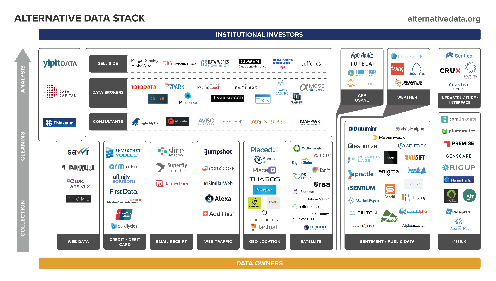

Algorithmic trading, commonly referred to as algo trading, automates the trading process by leveraging computer programs to execute predefined trading strategies. At its core, these strategies rely heavily on data—often vast amounts of it—to make informed decisions. Traditionally, traders used fundamental or technical data such as company earnings, stock price histories, and economic indicators. However, with the influx of technology and the digitalization of information, a new frontier of data has emerged, known as alternative data.

Alternative data refers to non-traditional data sources that traders use to gain insights that aren't available through conventional market data. The allure of alternative data is in its ability to offer a more granular and real-time view of economic and company performance. For instance, while a quarterly report might give insight into a company's past performance, real-time data like geolocation or website traffic can offer instantaneous snapshots of current consumer behavior. As financial markets become more competitive and saturated, having access to unique and timely data sources can be the distinguishing factor for traders, providing an edge over competitors.

**👉 There are many algorithmic trading strategies that use alternative data. Here are three examples:**

- **Location: [Geographic Momentum](https://wiki.paperswithbacktest.com/trading-strategies/equities/geographic-momentum)**
- **News: [Speculation Sentiment](https://wiki.paperswithbacktest.com/trading-strategies/equities/speculation-sentiment)**
- **CEO successions: [Lame-Duck CEOs](https://wiki.paperswithbacktest.com/trading-strategies/equities/lame-duck-ceos)**

The rise of alternative data is indicative of a broader shift in the financial sector, where innovative approaches and tools are consistently being sought after to enhance decision-making and generate alpha. As the landscape of algorithmic trading evolves, the fusion of traditional trading strategies with insights derived from alternative data is setting the stage for the next generation of trading.

## Table of Contents

## Types of Alternative Data in Algo Trading

Alternative data, an untraditional data source employed within algorithmic trading, is widely recognized for providing nuanced, timely, and sometimes unexplored insights, ultimately enhancing trading strategies and investment decisions. Below we deep dive into specific types of alternative data, illustrating their utility and importance within algo trading.

### Satellite Imagery

Satellite imagery permits traders to glean a birds-eye view of various global activities. For instance, by analyzing images of agricultural fields, traders can predict crop yields before official reports are released, influencing commodity trading decisions. Similarly, observing oil reserves can provide insights into potential shifts in oil prices. Infrastructure developments, often captured by satellites, can serve as an indicator of economic activity and corporate health.

### Geolocation

This alternative data type primarily pertains to capturing consumer and retail insights by tracking foot traffic and consumer behavior. Through analyzing geolocation data, traders can, for example, observe the popularity of retail locations, predict sales revenue, and subsequently, make informed investment decisions related to the retail sector. Additionally, understanding migration patterns can aid in forecasting economic shifts in particular regions.

### Corporate Data

Corporate data encapsulates a myriad of insights directly from company operations, which often go beyond what is disclosed in public reports. Hiring trends, for instance, could be deciphered through scrutinizing job posting data, providing clues about a company's growth, expansion, or technological advancement. Product launches and their subsequent performance, gathered from various platforms, allow traders to analyze consumer response and predict company revenues. Furthermore, accessing internal company data, where permissible, enables traders to understand the firm's health and strategic direction.

### Traffic Data

In an era where digital presence can indicate a company’s pulse and customer engagement, web traffic and app usage data serve as proxies for gauging consumer interest and potential revenue. Astute traders leverage this data, analyzing metrics like website visits, page views, and bounce rates to infer the popularity of e-commerce platforms or digital services. Similarly, app usage data, reflecting download counts and user engagement metrics, can intimate the acceptance and viability of mobile applications, assisting traders in anticipating stock movements of tech-centric firms.

### Credit Card Transactions

This data strata sifts through the spending habits of consumers, offering a real-time lens into retail performance, sectoral spends, and potentially, the economic health of regions. By tracking anonymized credit card transactions, traders can apprehend consumer spending patterns, seasonality in purchases, and thereby predict the financial performance of retail entities and sectors. The volume, frequency, and type of transactions can guide investors toward establishing correlational patterns with stock performances and industry trends.

### Derivatives Data

Derivatives transactions, particularly those that occur off-exchange, or “over-the-counter” (OTC), unmask a subset of financial market operations often obfuscated from traditional data sources. Off-exchange derivatives data uncovers trades and strategies implemented outside public exchanges, shedding light on institutional investment tactics, hedging strategies, and risk management practices. This data, while sometimes less transparent, can allow traders to delineate patterns, identify potential market movements, and understand the undercurrents of large-scale trading entities.

### Internet of Things (IoT) Data

Traders implement IoT data, comprised of information procured through interconnected devices and systems, to decipher tangible usage trends and device connectivity that can indirectly indicate consumer behaviour and product performance. This might encompass smart home data (like energy usage and appliance performance), wearable tech data (tracking health and fitness metrics), and more. By analyzing this data, traders can unveil insights into consumer preferences, product adoption, and potential market growth, thereby predicting stock performance of companies involved in IoT product manufacturing and services.

### Location Data

In a globalized economy, the movement of goods and the insights derived from logistics bear a substantial impact on various sectors, especially e-commerce, manufacturing, and retail. Analyzing location data, which encompasses monitoring shipping routes, warehouse stocking, and delivery times, provides a real-time pulse on supply chains and logistical efficiency. For traders, this data becomes pivotal in predicting possible interruptions in supply chains or understanding the scalability and reliability of e-commerce platforms and logistic companies, offering lucrative trading opportunities.

### POS Systems Data

Point of Sale (POS) systems churn out a plethora of information related to retail performance and inventory management. This encompasses sales data, inventory turnover rates, and customer purchase histories, which are instrumental for algorithmic traders to forecast retail stock performance and understand consumer trends. Utilizing this data helps traders to pinpoint which products are performing well in the market, subsequently allowing for informed decisions regarding retail companies’ stock trades.

### Reference Data

Reference data serves as an anchor, offering external data sets for validation and benchmarks. This can include market indexes, interest rates, or exchange rates, providing a macroeconomic backdrop against which other alternative data can be analyzed. For algo traders, utilizing reference data enables the standardization and normalization of trading strategies, ensuring that algorithms act within relevant and realistic market contexts, thereby minimizing erroneous trades or misinterpretations of market conditions.

## Deep Dive into Popular Alternative Data Sources

### Web Scraping for Algo Trading

Web scraping, an intricate process of extracting vast amounts of data from websites, has emerged as a staple in the algo trading world. The value proposition of web scraping lies in its capability to harness information from multiple websites at scale, offering a reservoir of data that may otherwise be inaccessible or labor-intensive to compile.

Various tools and platforms have been developed to facilitate web scraping, with each tailored for specific complexities and requirements. Among the frontrunners are [**Beautiful Soup**](https://pypi.org/project/beautifulsoup4/) and [**Scrapy**](https://scrapy.org/) for Python developers, offering extensive libraries to extract data with ease. For non-programmers, platforms like [**Octoparse**](https://www.octoparse.fr/) and [**Import.io**](http://import.io/) provide user-friendly interfaces to retrieve web data without diving deep into coding.

However, while web scraping holds immense potential, it's not without challenges. Ethical considerations are paramount. Many websites have terms of service that explicitly prohibit data scraping, and breaching these terms can lead to legal repercussions. Furthermore, excessive requests to a website in a short span can cause unintentional Denial-of-Service (DoS) attacks. It's imperative for traders and developers alike to be mindful of these pitfalls and to employ measures like respecting `robots.txt` files or using proxies to avoid IP bans.

The realm of web scraping, when maneuvered ethically and judiciously, can unlock a treasure trove of data, bolstering the efficacy of algo trading strategies and enhancing the trader's edge in competitive markets.

### Popular Free Data Sources

Navigating through the myriad of free data sources is pivotal in identifying valuable, actionable insights for algorithmic trading.

[**Yahoo Finance**](https://finance.yahoo.com/) is notably one of the most popular free data sources for a wide array of financial data, offering historical stock prices, earnings data, and various economic indicators. Traders leverage this for its robust API and CSV data exports, allowing easy integration with various trading platforms and analytics tools.

The [**Kenneth French Data Library**](https://mba.tuck.dartmouth.edu/pages/faculty/ken.french/data_library.html) is an academically revered resource that provides research factors, historical returns, and other related datasets significant for quantitative traders aiming to execute factor-based trading strategies.

[**Damodaran Data**](https://pages.stern.nyu.edu/~adamodar/New_Home_Page/data.html), curated by Professor Aswath Damodaran of NYU Stern, provides access to comprehensive datasets, such as corporate finance, valuation, capital markets, and investment philosophies. Notably, this data is renowned for its applicability in building valuation models.

[**SimFin**](https://www.simfin.com/) prioritizes accessibility and simplicity, offering free fundamental financial data for US companies. It amalgamates data from financial reports, deriving several fundamental & valuation metrics valuable for constructing quantitative models.

[**EODData**](https://eoddata.com/) provides a substantial pool of end-of-day stock data from all over the globe. Traders and investors often utilize this data for backtesting their trading algorithms and models, ensuring robustness before live implementations.

In sum, the realm of free data sources for algorithmic trading is rich and varied, offering traders a buffet of options to enhance their models and strategies. The strategic incorporation and astute analysis of these data sources can markedly augment the acumen and execution of trading strategies in live markets.

### Alternative Data Providers

In the realm of algo trading, where optimal decisions are driven by high-quality data, a variety of alternative data providers have burgeoned, each bringing unique offerings to the table.

[**AltIndex**](https://altindex.com/) specializes in synthesizing alternative data to produce high-quality, actionable indices which can be leveraged by traders and fund managers to navigate the complexities of financial markets, by giving insights into market trends and anomalies.

[**Foursquare**](https://foursquare.com/), originally famed as a consumer app, evolved its business model to leverage its geolocation data. Foursquare's Pilgrim SDK provides businesses with critical location-based insights and analytics, offering a look into foot traffic, consumer movement patterns, and retail visitation metrics.

[**FlightAware**](https://flightaware.com/) empowers algo traders to gain insights from global aviation data, contributing to the analysis of logistics and travel industry trends. Their exhaustive air travel data can provide insights into oil demand, global commerce, and even hint at economic health.

[**MetDesk**](https://www.metdesk.com/), a specialized weather data provider, delivers bespoke meteorological insights that can be pivotal for traders involved in commodities, energy, and agriculture sectors by predicting weather patterns that may impact production and distribution.

[**Plaid**](https://plaid.com/) provides a platform that facilitates access to consumer financial data. From banking to trading apps, Plaid acts as an intermediary, ensuring smooth data flow between different financial bodies, thereby enabling traders and investors to make informed decisions.

[**Descartes Labs**](https://descarteslabs.com/) utilizes satellite imagery data, providing unique insights into agricultural yields, infrastructure growth, and natural resource availability. Traders leverage this data to predict commodity prices and assess the economic impact of changes in physical landscapes.

[**SimilarWeb**](https://www.similarweb.com/) offers comprehensive web traffic data and insights into digital behavior, thereby allowing traders to gauge company health, customer preferences, and potential investment opportunities by analyzing online presence and engagement.

[**PatentAlert**](https://www.patentalert.com/) provides crucial insights by tracking and analyzing patent data. Algorithmic traders utilize this data to identify technological advancements and innovations within companies, which can indicate future market moves.

[**Advan**](https://advanresearch.com/) utilizes geolocation data to provide insights into consumer behavior and foot traffic, offering invaluable insights to traders looking to capitalize on retail and commerce trends.

[**SECFilings.com**](http://secfilings.com/) enables traders to access an exhaustive database of SEC filings, providing an analytical edge through prompt access to critical financial disclosures, ensuring informed strategy derivation.

Pertinently, the choice among these alternative data providers would typically rest on the specific needs, trading strategy, and targeted sector of the algo trader, warranting a meticulous understanding and application of the data provided.

## Innovative Trading Strategies Utilizing Alternative Data

In the era of data-driven trading, deploying alternative data has become a pivotal strategy among algorithmic traders to garner unique market insights and establish profitable trades. The Brand Value Factor revolves around utilizing social media metrics and website analytics to gauge a company’s digital popularity, consumer engagement, and overall brand perception. Metrics like website traffic, social media followers, and online engagement can be direct indicators of a brand's value and, in turn, its stock performance.

Implementing a **Google Search strategy** involves leveraging [**Google Trends**](https://trends.google.com/trends/) data to observe the search volume of particular stocks or commodities. Surges in search frequencies can indicate rising public interest, often preceding market movements, hence providing an opportune moment for traders to position their trades.

Leveraging news and newspaper content for sentiment analysis entails utilizing natural language processing (NLP) to evaluate the sentiment expressed in news articles or reports concerning specific stocks or commodities. Positive or negative sentiments often correlate with upward or downward price movements, respectively, offering predictive insights to traders.

The **Lexical Density of Filings strategy** employs analyzing the complexity and clarity of corporate filings and communications. A higher lexical density can indicate an attempt to obfuscate information, while clear, straightforward language is often seen in more transparent and trustworthy firms. Thus, this linguistic analysis can serve as a predictor of company reliability and stock performance.

**Technology Momentum strategy** leans into assessing a company’s technological advancements and its market acceptance to forecast its future stock trajectory. Analyzing data related to technological innovations, patents, and market reception of new technologies can provide insights into a company's future growth potential and its likely impact on stock prices.

In essence, these innovative trading strategies encapsulate the myriad ways in which alternative data, when astutely analyzed and applied, can be transformed into a potent tool, enabling traders to navigate through the intricate tapestry of the financial markets.

## The Growing Significance of ESG in Alternative Data

ESG, encompassing Environmental, Social, and Governance factors, has carved out a significant niche in the investment decision-making landscape, catalyzing a shift towards sustainability and ethical business practices within the financial industry. ESG reflects a company's approach towards managing its ecological impact, ensuring social responsibility, and maintaining governance practices involving leadership and shareholder rights. As sustainability becomes intertwined with financial viability, ESG components have metamorphosed into critical indicators, influencing investment considerations and shaping modern portfolio theories.

Alternative data, in the context of ESG, often encompasses information pertaining to a company’s carbon footprint, employee satisfaction, executive compensations, board structures, and even customer satisfaction, which are pivotal in comprehensively evaluating its ESG standings.

Social media sentiment, customer reviews, and employee feedback, obtained from platforms like Glassdoor or Twitter, offer real-time insights into a company's social and governance practices. Similarly, satellite imagery and IoT-derived data can highlight environmental factors by tracking pollution levels, energy usage, and resource management practices of businesses.

## Challenges and Ethical Considerations

Alternative data’s ascent in the realm of algo trading is irrefutable, but its adoption isn't without hurdles. Foremost, the accuracy and reliability of alternative data come into question. While these datasets may provide a wealth of insights, their credibility can be suspect, especially when originating from non-conventional sources. It's crucial for traders to exercise due diligence, ensuring **data quality, consistency, and validity**.

Another pressing concern is the privacy implications of using certain types of alternative data. Geolocation data, for instance, delves deep into user movement patterns, sometimes without explicit user consent. This can pose significant ethical dilemmas, especially when there's potential for misuse or unauthorized access. The fine balance between gleaning insights and upholding privacy is a challenge that data-driven firms must navigate.

Regulatory considerations further complicate the landscape. Different countries have varying stances on **data privacy, collection, and usage**. The European Union's General Data Protection Regulation (GDPR) and California's Consumer Privacy Act (CCPA) are prime examples of stringent regulations that mandate strict data handling practices. Traders and firms must stay updated on these dynamic regulatory environments, ensuring that their use of alternative data aligns with legal stipulations, not just ethical considerations.

Incorporating alternative data into algo trading is a promising frontier, but the path is laden with challenges that necessitate a judicious approach, blending technological prowess with ethical responsibility.

## Case Studies

**Alpha Vertex and the Utilization of AI with Alternative Data**

Alpha Vertex utilized alternative data and artificial intelligence (AI) to create predictive financial models that catered to investors and financial institutions. They leveraged a myriad of data, ranging from satellite images to social media sentiments, for predicting stock movements and crafting well-informed trading strategies.

**JPMorgan and the "Volfefe" Index**

Traders at JPMorgan Chase created the "Volfefe" Index, which demonstrated how alternative data, specifically Twitter data, could be potent in the financial world. The index analyzed the impact of Donald Trump's tweets on bond price movements. By studying word patterns and timing, they could deduce the probable impact of tweets on the market, showcasing how non-traditional data, like social media activity, could be harnessed for algorithmic trading.

**Hedge Fund and Satellite Imagery to Gauge Oil Supplies**

Certain hedge funds tapped into satellite imagery as an alternative data source to gauge oil supply levels. By monitoring and analyzing imagery of storage facilities and evaluating the shadows cast by the floating lids of oil storage tanks, they could estimate the quantity of stored oil. This unconventional approach provided a distinct edge, enabling traders to anticipate market moves more effectively.

**Credit Card Transactions Informing Investment in the Retail Sector**

Certain investment firms analyzed anonymized credit card transaction data to infer consumer spending patterns. This data, when synthesized with other alternative datasets, offered a richer understanding of retail performance and consumer behavior, influencing investment decisions in retail stocks and commodities.

**Utilizing Geolocation Data to Evaluate Retail Foot Traffic**

Orbital Insight, a geospatial analytics company, leveraged geolocation data to evaluate foot traffic patterns in retail stores. By assessing the gathered data, investors and traders could glean insights into store popularity and predict quarterly sales, thereby impacting investment decisions in the retail sector.

## Future of Alternative Data in Algo Trading

Predictive analytics and machine learning are carving out the future of algo trading by augmenting alternative data. Enhanced computing capabilities are enabling traders to process complex and voluminous data, like satellite imagery and IoT device outputs, at unprecedented speeds, and with higher accuracy. For example, machine learning algorithms, through regression and classification models, can pinpoint hidden patterns and correlations in big datasets that escape human analysts, facilitating the generation of more potent trading signals[1].

The surging evolution of the Internet of Things (IoT) is another catalyst in reshaping algo trading. IoT devices, from smart meters to connected cars, perpetually generate data streams that can be harnessed to gauge factors like energy usage and consumer behavior, offering potential indicators for investment decision-making. As per a report by Statista, the IoT market's revenue is projected to surpass $1.6 trillion by 2025, indicating a rich, burgeoning source of alternative data that can fortify trading strategies[2].

Potential new sources of alternative data are also mushrooming with advancements in technology and digitization. Think of the burgeoning realm of decentralized finance (DeFi), where blockchain data concerning transactions, liquidity pools, and yield farming can offer insightful metrics that are primed to be tapped into for algo trading. Such datasets allow traders to evaluate market demand for particular tokens, predict price movements, and understand the flow of assets in a manner that was previously unattainable.

Moreover, socio-economic shifts and global events continually mold the landscape of alternative data. For instance, during the COVID-19 pandemic, data pertaining to mobility trends, employment claims, and e-commerce spikes became invaluable in navigating the markets. Future scenarios will undoubtedly unearth fresh data types, necessitating traders to perpetually expand and refine their data acquisition and analysis methodologies to sustain a competitive edge in algo trading[3].

## Conclusion

The pivotal role of alternative data in the realm of algorithmic trading has been well articulated, serving as a bedrock for traders and investors aiming to sharpen their decision-making and enhance returns. As traditional financial metrics become common staples in investment algorithms, alternative data supplies unique, less tapped sources of information, conferring competitive advantages upon its adopters. For instance, geolocation data and satellite imagery grant real-time insights into consumer behavior and global economic activities, facilitating immediate, data-driven trading responses.

Moreover, the palpable impact of alternative data is not bound by the present but extends into shaping future trading landscapes, where incorporation of emerging technologies, like IoT and machine learning, will offer nuanced data types and analytical possibilities. It’s crucial for traders to be perpetually inquisitive, seeking to uncover new data types and formulate innovative strategies, given the fast-evolving financial market dynamics and technological advancements.

Navigating through the expansive universe of alternative data demands not only a deep understanding of available data types and their applicative nuances but also an ethical and regulatory compass to guide through the data acquisition and utilization processes.

💡 **Read more:**

- Trading strategies papers with code on [Equities](https://wiki.paperswithbacktest.com/trading-strategies/equities), [Cryptocurrencies](https://wiki.paperswithbacktest.com/trading-strategies/cryptocurrencies), [Commodities](https://wiki.paperswithbacktest.com/trading-strategies/commodities), [Currencies](https://wiki.paperswithbacktest.com/trading-strategies/currencies), [Bonds](https://wiki.paperswithbacktest.com/trading-strategies/bonds), [Options](https://wiki.paperswithbacktest.com/trading-strategies/options)
- [A curated list](https://github.com/paperswithbacktest/awesome-systematic-trading) of awesome libraries, packages, strategies, books, blogs, and tutorials for systematic trading
- [A bunch of datasets](https://huggingface.co/paperswithbacktest) for quantitative trading
- [A website to help you](https://paperswithbacktest.com/) become a quant trader and achieve financial independence

## Frequently Asked Questions

**What is alternative data in the context of algo trading?**

Alternative data refers to non-traditional sources of information that traders use to gain an edge in the market. This can range from satellite images of parking lots to monitor retail activity to social media sentiments that might influence stock prices. Such data is leveraged to generate predictive models and inform algorithmic trading decisions.

**How does alternative data differ from traditional data sources?**

Traditional data typically comprises financial statements, stock prices, and macroeconomic indicators. In contrast, alternative data delves into unconventional and often real-time sources, such as geolocation data or web traffic metrics, offering a broader perspective on market-moving factors.

**Are there regulations governing the use of alternative data?**

Yes, the use of alternative data is subject to regulations, primarily around privacy and data acquisition methods. Traders must ensure that their data sources are compliant with laws like GDPR in Europe or CCPA in California, which emphasize user privacy.

**How reliable is alternative data?**

The reliability of alternative data varies based on its source and type. While some datasets like satellite imagery can be highly accurate, others, like social media sentiments, might be more susceptible to noise. It's essential for traders to validate and cross-reference their data to ensure its credibility.

**Can individual traders benefit from alternative data, or is it just for institutions?**

While institutional investors were the early adopters of alternative data due to their resources, the democratization of data and the rise of fintech platforms now allow individual traders to access and benefit from these sources too.

**How does ESG fit into the alternative data landscape?**

ESG (Environmental, Social, Governance) data has emerged as a critical subset of alternative data. With investors increasingly focusing on sustainability and ethical considerations, ESG metrics derived from alternative data sources provide insights into a company's long-term risks and opportunities.

**With advancements in technology, what’s next for alternative data?**

The frontier of alternative data is continually expanding with advancements in IoT, machine learning, and blockchain, among others. Future avenues might include data from wearables, deep insights from natural language processing, or decentralized finance metrics to name a few.

**Is there a risk of market saturation as more traders use alternative data?**

As more traders access and integrate alternative data, there's a possibility that the unique edge it offers might diminish. However, the constant evolution of data sources and the ability to combine datasets in innovative ways ensures continued opportunities for differentiation.

## References & Further Reading

[1]: Jordan, M. I., & Mitchell, T. M. (2015). [Machine learning: Trends, perspectives, and prospects](https://www.science.org/doi/10.1126/science.aaa8415). Science, 349(6245), 255-260. DOI: 10.1126/science.aaa8415

[2]: Statista. (2022). Internet of Things (IoT) market size from 2022 to 2030. Retrieved from [Statista Website](https://www.statista.com/)

[3]: Baker, S. R., Bloom, N., Davis, S. J., & Terry, S. J. (2020). [COVID-induced economic uncertainty](https://www.nber.org/papers/w26983). National Bureau of Economic Research, No. w26983. DOI: 10.3386/w26983