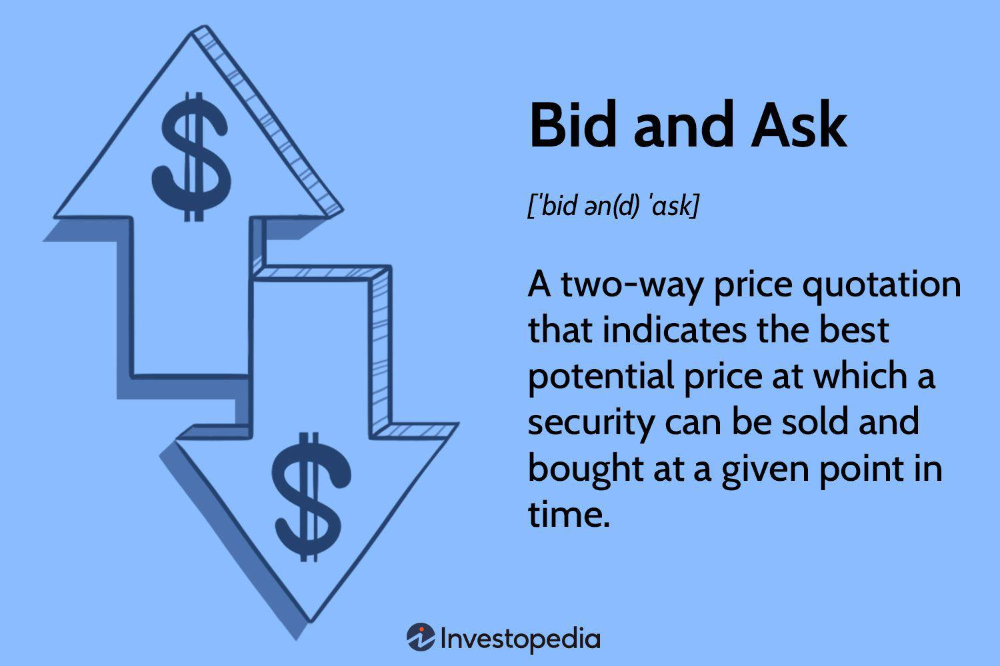

Understanding the complex world of financial markets is essential for traders looking to capitalize on opportunities. These markets are multifaceted, involving trading activities that span stocks, commodities, currencies, and derivatives, each with its own dynamics and potential for profit and loss. Traders navigate this landscape by employing various strategies that fit their risk tolerance, objectives, and market conditions. 

Stock trading, in particular, is a highly dynamic field. It demands constant vigilance and a keen understanding of market movements, which are influenced by economic indicators, corporate news, geopolitical developments, and investor sentiment. This ever-shifting landscape necessitates a strategic approach to buying and selling shares in publicly listed companies with the aim of financial gain.



A key component in stock trading is understanding the 'best ask' price. This refers to the lowest price at which a seller is willing to sell their shares at a given time. It is a critical factor for traders as it lays the foundation for determining transaction feasibility and potential profitability. The 'best ask' price, when viewed in conjunction with the 'best bid' price—the highest price a buyer is willing to pay—gives insight into the current market equilibrium and liquidity.

Algorithmic trading, also known as algo trading, has revolutionized trade execution by enabling high-frequency trading and increasing efficiency. This technological advancement involves using complex algorithms and computer programs to execute trades at speeds and frequencies that traditional manual trading cannot match. Algo trading processes vast amounts of data in real time, making decisions based on predefined criteria and sophisticated mathematical models, thus optimizing trading outcomes. This method is lauded for its ability to capitalize on short-lived market opportunities and for minimizing the role of human emotions in trading decisions.

## Table of Contents

## Understanding Financial Markets

Financial markets serve as platforms for the exchange of assets such as stocks, bonds, commodities, and derivatives. These markets are critical for the efficient allocation of resources in an economy, providing a venue where investors can buy and sell assets, thus influencing their prices based on supply and demand dynamics.

Investment vehicles available in financial markets vary widely. Stocks or equities represent ownership in a company and provide shareholders with voting rights and a claim on future earnings. Bonds are debt instruments where the issuer borrows funds from the investor, typically offering fixed interest payments until maturity. Exchange-traded funds (ETFs) are investment funds traded on stock exchanges, offering diversification and liquidity to investors. Other vehicles include mutual funds, derivatives, and commodities.

Traders operating in these markets must grasp the effects of market forces such as interest rates, inflation, and geopolitical events on asset prices. Economic indicators, including gross domestic product (GDP) growth, unemployment rates, and consumer confidence indices, can also have significant impacts. For instance, higher interest rates often lead to lower stock prices as borrowing becomes more expensive, potentially slowing down economic growth. 

To navigate these complexities, traders employ two main approaches to analyze markets: fundamental and technical analysis. 

**Fundamental analysis** evaluates a security's intrinsic value by examining economic indicators, industry conditions, and company-specific factors such as revenue, earnings, and management. It often involves financial statements analysis, such as assessing a company's earnings-per-share (EPS), price-to-earnings (P/E) ratio, and return on equity (ROE).

**Technical analysis**, on the other hand, focuses on historical price patterns and market behavior. Traders use charts and statistical indicators to predict future price movements, employing tools such as moving averages, relative strength index (RSI), and Bollinger Bands. A basic moving average can be calculated in Python as follows:

```python
def moving_average(prices, window):
    return [sum(prices[i:i+window]) / window for i in range(len(prices) - window + 1)]

# Example usage:
prices = [20, 30, 25, 29, 28, 32]
window = 3
ma = moving_average(prices, window)
print(ma)  # Output: [25.0, 28.0, 27.333333333333332, 29.666666666666668]
```

In conclusion, a comprehensive understanding of financial markets necessitates familiarity with various investment vehicles, market forces, economic indicators, and analytical methodologies. Mastery of both fundamental and technical analysis can significantly enhance a trader's ability to make informed decisions and capitalize on market opportunities.

## Stock Trading Essentials

Stock trading encompasses the buying and selling of company shares with the primary objective of achieving financial gains. This financial activity is a cornerstone of the investment world, attracting both individual investors and institutional participants. The core principle of stock trading is to purchase shares at a lower price and sell them at a higher one, thereby reaping profits from the price differential.

A fundamental aspect of stock trading is understanding the bid and ask prices. The bid price represents the highest price a buyer is willing to pay for a stock, whereas the ask price is the lowest price a seller is willing to accept. The difference between these prices is known as the bid-ask spread. The 'best ask' is particularly significant as it indicates the most favorable price at which a trader can purchase a stock at any given moment. Accurately interpreting these prices enables traders to make informed decisions and potentially capitalize on market opportunities.

Various trading strategies cater to different investment goals and risk appetites. Day trading, for instance, involves the rapid buying and selling of stocks within a single trading day, often capitalizing on small price movements. This strategy requires acute attention to market trends and often involves technical analysis to predict short-term price fluctuations. Conversely, long-term investing focuses on the core fundamentals of the company, such as its financial health, business model, and growth prospects. Investors adopting this approach aim to hold stocks over a longer period, banking on the intrinsic value of the company to appreciate over time. This strategy relies heavily on [fundamental analysis](/wiki/fundamental-analysis), where evaluations are based on financial statements, market position, and industry conditions.

Despite the varying strategies, successful stock trading requires a blend of both technical and fundamental analysis. Traders and investors analyze market trends, historical price data, and economic indicators to guide their decisions. The proliferation of technology and online trading platforms has further democratized access to stock markets, making it easier for individual traders to participate alongside institutional investors.

In summary, stock trading is a multifaceted activity that requires an understanding of market mechanics and the ability to interpret various price signals. Whether utilizing short-term tactics or long-term strategies, the ability to analyze both the broader market environment and individual stock characteristics is essential for any trader seeking to achieve financial gain.

## Best Ask: A Closer Look

The "best ask" is a fundamental concept in stock trading, representing the lowest price a seller is willing to accept for a particular stock at a specific time. It forms one half of the bid-ask spread, with the "best bid" being the highest price a buyer is willing to pay. A tight spread, where the best ask and best bid prices are very close, often indicates a highly liquid market and provides traders with enhanced opportunities for making profitable trades.

Understanding the best ask is crucial for traders, as it helps assess the market's pricing dynamics and potential profit margins. A favorable alignment of the best ask and best bid prices suggests a liquid market with narrow spreads, allowing for efficient trade executions and potential [arbitrage](/wiki/arbitrage) opportunities.

An important regulatory concept associated with the best ask is the National Best Bid and Offer (NBBO). Established in the U.S. markets under the National Market System, the NBBO consolidates and publicizes the highest available bid and lowest available ask prices across all exchanges. This ensures that traders can access the best possible prices, thereby promoting fair and transparent market practices. By relying on the NBBO, traders can make informed decisions, minimizing the risk of executing trades at suboptimal prices. 

In summary, the best ask is indispensable for traders aiming to maximize the profitability of their trades. It acts as a benchmark for evaluating market efficiency and price competitiveness, fostering an environment that prioritizes the best trading conditions for market participants.

 to Algorithmic Trading

Algorithmic trading, often referred to as algo trading, represents a modern approach to executing trades using computer programs that operate based on predetermined rules and algorithms. These algorithms can be designed to analyze market conditions and data to identify trading opportunities that align with specified criteria. Once these opportunities are detected, trades are executed automatically, minimizing the need for human intervention.

The efficiency of [algorithmic trading](/wiki/algorithmic-trading) largely stems from its ability to process vast quantities of data at rapid speeds, far exceeding human capabilities. This technological advantage enables traders and institutional investors to capitalize on short-lived market opportunities with precision and minimal delay. The fast-paced nature of global financial markets means that the time it takes for a human to analyze data and make a decision could result in missed opportunities or increased risk. Algo trading mitigates this risk by reducing the reaction time needed to execute trades.

Several key players in the financial markets utilize algorithmic trading due to its high efficiency. These players include hedge funds, investment banks, institutional investors, and proprietary trading firms. Each of these entities relies on the ability of algorithms to parse complex datasets and execute trades quickly, often using strategies that are based on mathematical models and market theories.

A practical example of algorithmic trading in action can be seen through high-frequency trading ([HFT](/wiki/high-frequency-trading-strategies)), a subset of algo trading that involves the rapid execution of a large number of orders. This approach takes advantage of minute differences in prices and typically relies on advanced algorithms and high-speed data feeds.

In code implementation terms, algo trading can be illustrated with a simple Python script using a framework like pandas or NumPy for data analysis, and a trading API like Alpaca or [Interactive Brokers](/wiki/interactive-brokers-api) for execution:

```python
import pandas as pd
import numpy as np
from alpaca_trade_api import REST

# Initialize API
api = REST('APCA-API-KEY-ID', 'APCA-API-SECRET-KEY', base_url='https://paper-api.alpaca.markets')

# Fetch historical market data
historical_data = api.get_barset('AAPL', 'minute', limit=1000).df['AAPL']

# Simple moving average strategy
short_window = 40
long_window = 100

# Calculate moving averages
historical_data['short_mavg'] = historical_data['close'].rolling(window=short_window, min_periods=1).mean()
historical_data['long_mavg'] = historical_data['close'].rolling(window=long_window, min_periods=1).mean()

# Generate signals
historical_data['signal'] = 0.0
historical_data['signal'][short_window:] = np.where(historical_data['short_mavg'][short_window:] > historical_data['long_mavg'][short_window:], 1.0, 0.0)

# Execute trades
for index, row in historical_data.iterrows():
    if row['signal'] == 1.0:
        api.submit_order(symbol='AAPL', qty=1, side='buy', type='market', time_in_force='gtc')
    elif row['signal'] == 0.0:
        api.submit_order(symbol='AAPL', qty=1, side='sell', type='market', time_in_force='gtc')
```

In this example, a simple moving average crossover strategy is employed: the script generates buy signals when the short-term moving average crosses above the long-term moving average, and sell signals when the opposite occurs. Such systematic and disciplined approaches to trading exemplify the power of algorithmic systems to reduce human error and increase efficiency.

## How Does Algo Trading Work?

Algorithmic trading involves the deployment of computer systems that collect and respond to market data, then automatically execute trades based on pre-defined instructions. These systems function through a series of interdependent processes, which include data input, algorithm analysis, and trade execution. 

The initial step, data input, involves the continuous collection of real-time market data, which can include price quotes, trade volumes, [order book](/wiki/order-book-trading-strategies) data, and relevant economic indicators. The accuracy and timeliness of these data inputs are critical, as they serve as the foundation upon which trading decisions are based. Data sources are typically high-speed, ensuring up-to-date information is available for seamless execution.

Following data acquisition, the algorithmic analysis phase utilizes sophisticated mathematical models to identify trading opportunities and determine appropriate actions. These models evaluate various strategies, often based on historical price behaviors and statistical measures. For example, algorithms may be designed to recognize mean reversion patterns through evaluating historical averages $\bar{P}$ against current prices $P_t$, predicting that deviations will eventually return to the mean. This can be mathematically expressed as:

$$
\text{Signal} = P_t - \bar{P}
$$

Algorithmic systems also incorporate market theories, such as the Efficient Market Hypothesis or behavioral finance concepts, to inform the trading logic embedded in their code. 

One of the primary programming languages used for developing these trading algorithms is Python, due to its extensive libraries and ease of use. A basic outline for an algorithm identifying a simple moving average crossover strategy could look like this:

```python
import pandas as pd

def moving_average_crossover(df, short_window=40, long_window=100):
    # Create moving averages
    df['Short_MA'] = df['Close'].rolling(window=short_window, min_periods=1).mean()
    df['Long_MA'] = df['Close'].rolling(window=long_window, min_periods=1).mean()

    # Create signals
    df['Signal'] = 0
    df['Signal'][short_window:] = np.where(df['Short_MA'][short_window:] > df['Long_MA'][short_window:], 1, 0)

    # Generate trading orders
    df['Position'] = df['Signal'].diff()

    return df

# Example usage
historical_data = pd.DataFrame({'Close': [some_price_data]})
strategy_output = moving_average_crossover(historical_data)
```

In this strategy, when the short-term moving average crosses above the long-term moving average, a buy signal is generated. Conversely, a short position is taken when the short-term average crosses below the long-term moving average.

The final step in algorithmic trading is the execution of trades. Once a trading signal is generated, the system submits orders to the market automatically, employing advanced order types such as limit orders or market orders, depending on the strategy. Execution platforms are designed to minimize latency, thus reducing slippage and optimizing trade outcomes. 

By integrating data input, precise algorithm analysis, and rapid execution, algorithmic trading systems enhance the ability to exploit market inefficiencies, providing a competitive edge to participants in financial markets.

## Popular Algo Trading Strategies

Algorithmic trading strategies have become integral to modern financial markets, leveraging computational power to execute trades in seconds. Popular strategies include trend-following, mean reversion, and market-making, each with unique methodologies and goals.

Trend-following strategies are based on the analysis of market trends, aiming to capitalize on sustained movements in asset prices. These algorithms track market [momentum](/wiki/momentum) and identify patterns that indicate the direction of price changes. Once a trend is identified, the algorithm automatically initiates trades in the trend’s direction, hoping to ride the wave as long as possible. This approach assumes that trends, once established, often continue for a period, allowing traders to profit by following the general flow of the market.

Mean reversion strategies operate on the principle that prices and returns eventually move back towards their average or mean level. Traders utilizing these strategies assume that deviations from historical averages are temporary, and prices will revert. By identifying securities that deviate from their expected value, these algorithms initiate trades, betting on the return to equilibrium. Mathematically, mean reversion can be modeled by analyzing the difference between the current price and the moving average, and a common statistical indicator used is the Z-score, calculated as:

$$
Z = \frac{(P - \mu)}{\sigma}
$$

where $P$ is the current price, $\mu$ is the mean price over a specified period, and $\sigma$ is the standard deviation.

Market-making strategies involve providing [liquidity](/wiki/liquidity-risk-premium) to the market by simultaneously offering buy and sell limits, and seeking to profit from the bid-ask spread. These algorithms engage in frequent trading by placing a buy order at the bid price and a sell order at the ask price, profiting from the spread between these two prices. Market makers benefit from order flows and contribute to market efficiency by ensuring that there is always a willing buyer and seller. These strategies are particularly advantageous in volatile markets, where spreads tend to widen.

Python can be effectively used to implement these strategies, especially in [backtesting](/wiki/backtesting) and live trading scenarios. Below is a simplified example of a moving average crossover strategy, a form of trend-following strategy:

```python
import pandas as pd

# Load historical price data
data = pd.read_csv('price_data.csv')

# Calculate short and long moving averages
data['SMA'] = data['Close'].rolling(window=20).mean()
data['LMA'] = data['Close'].rolling(window=50).mean()

# Generate trade signals
data['Signal'] = 0
data.loc[data['SMA'] > data['LMA'], 'Signal'] = 1
data.loc[data['SMA'] < data['LMA'], 'Signal'] = -1

# Output data with trading signals
print(data[['Close', 'SMA', 'LMA', 'Signal']])
```

In algorithmic trading, selecting the right strategy depends on market conditions, risk tolerance, and investment goals. Future developments in AI and [machine learning](/wiki/machine-learning) are expected to further refine these strategies, potentially offering even greater accuracy and profitability.

## Choosing the Right Algo Trading Platform

Selecting the appropriate algorithmic trading platform is essential for maximizing the potential of trading strategies. Several factors must be considered when choosing a platform, including speed, reliability, and feature set. Each of these components plays a pivotal role in ensuring that trading algorithms operate effectively and efficiently.

**Speed and Reliability:** In the fast-paced world of financial markets, execution speed is paramount. Milliseconds can separate a profitable trade from a loss, making the latency of a trading platform a critical factor. Platforms offering low-latency connectivity and high-frequency trading capabilities are generally preferred. Reliability also acts as a cornerstone, ensuring that the platform remains stable and operational, especially during market surveys.

**Feature Set:** A robust algorithmic trading platform should offer a comprehensive set of features catering to the diverse needs of traders. Essential functionalities include real-time data feeds, advanced charting tools, and backtesting capabilities. Backtesting allows traders to simulate trading strategies using historical data, evaluating their potential performance without financial risk.

**Popular Platforms:**

- **MetaTrader:** Known for its user-friendly interface and versatility, MetaTrader offers powerful tools for technical analysis and automated trading through its integrated MQL4 and MQL5 scripting languages. Its widespread use amongst retail traders is due in part to its robust community and extensive library of trading indicators and scripts.

- **QuantConnect:** An open-source platform, QuantConnect provides a cloud-based environment for backtesting and deploying algorithmic trading strategies. It supports multiple programming languages, including Python and C#, offering flexibility and the ability to integrate complex mathematical models into trading algorithms.

- **TradeStation:** This platform is renowned for its professional-grade tools suitable for both individual and institutional traders. Its proprietary programming language, EasyLanguage, allows for the creation of custom indicators and strategies, making it ideal for traders who develop personalized algorithms.

When evaluating platforms, traders should align their choice with specific trading goals and strategies. Advanced computational abilities, ease of use, and the capacity to customize trading strategies are factors that significantly contribute to a platform's suitability for algorithmic trading. Scalability is also vital, ensuring the platform can handle increased trading volumes as market opportunities are leveraged.

## The Advantages of Algo Trading

Algorithmic trading, often referred to as algo trading, provides numerous advantages to traders by improving operational efficiency and decision-making processes in the financial markets. One of the most significant benefits is the speed and efficiency with which trades are executed. In volatile markets, rapid execution is critical to capitalize on fleeting opportunities and mitigate risks. Algorithms are capable of processing large volumes of market data in milliseconds and executing trades at speeds much faster than human capabilities. This advantage is particularly useful in high-frequency trading (HFT), where quick trade execution is paramount.

Another crucial advantage of algorithmic trading is the ability to backtest strategies. Backtesting involves applying trading strategies to historical data to evaluate their effectiveness before committing real capital. This process allows traders to refine their strategies based on empirical evidence rather than assumptions, minimizing the risks associated with untested approaches. Backtesting can be done by writing simulations in Python, which allows traders to test their algorithms using past market data.

Here's a simple example of backtesting using Python:

```python
import pandas as pd
import numpy as np
import matplotlib.pyplot as plt

# Historical stock data
data = pd.read_csv('historical_stock_data.csv', index_col='Date', parse_dates=True)

# Simple Moving Average (SMA) Strategy
short_window = 40
long_window = 100

# Generate signals
signals = pd.DataFrame(index=data.index)
signals['signal'] = 0.0

signals['short_mavg'] = data['Close'].rolling(window=short_window, min_periods=1, center=False).mean()
signals['long_mavg'] = data['Close'].rolling(window=long_window, min_periods=1, center=False).mean()

signals['signal'][short_window:] = np.where(signals['short_mavg'][short_window:] > signals['long_mavg'][short_window:], 1.0, 0.0)   

signals['positions'] = signals['signal'].diff()

# Plot the simple moving averages and signals
plt.figure(figsize=(10,5))
plt.plot(data['Close'], label='Close Price')
plt.plot(signals['short_mavg'], label='40-day SMA', alpha=0.7)
plt.plot(signals['long_mavg'], label='100-day SMA', alpha=0.7)
plt.scatter(signals.loc[signals.positions == 1.0].index, data['Close'][signals.positions == 1.0], label='Buy Signal', marker='^', color='green')
plt.scatter(signals.loc[signals.positions == -1.0].index, data['Close'][signals.positions == -1.0], label='Sell Signal', marker='v', color='red')
plt.title('Stock Price and Trading Signals')
plt.xlabel('Date')
plt.ylabel('Price')
plt.legend()
plt.show()
```

The elimination of emotional bias in trading is another significant advantage of algo trading. Traders are often influenced by emotions such as fear and greed, which can lead to irrational decision-making. Algorithms ensure that trades are executed based on predefined criteria and market conditions, eliminating the unpredictability of human emotions. This data-driven approach enhances consistency in trading performance, allowing for more disciplined and objective decision-making.

Overall, the advantages of algorithmic trading, including speed, efficiency, backtesting capabilities, and the elimination of emotional bias, make it a powerful tool for traders seeking to improve their trading strategies and outcomes in the dynamic landscape of financial markets.

## Conclusion

The financial markets are continuously influenced by technological advancements, significantly impacting strategies in both stock and algorithmic trading. Utilizing technologies like algorithmic trading systems allows traders to enhance their efficiency, optimize transaction times, and improve decision-making processes. These systems, by design, offer the capability to manage and execute trades with precision at speeds that far exceed human capability, thus vastly increasing market responsiveness.

An understanding of the concept of the "best ask" price is crucial in stock trading. This price is the lowest at which a seller is willing to offer a stock, and recognizing its implications can lead to more profitable transactions. Aligning the "best ask" with favorable market conditions or the "best bid" price can optimize trading outcomes by ensuring that the transactions occurred at favorable price points. 

Algorithmic trading, facilitated by sophisticated mathematical models and algorithms, further complements this by allowing traders to react to market changes almost instantaneously. The reduction of emotional bias, thanks to data-driven decisions, greatly enhances the potential for consistent profitability and risk management. Algorithm execution not only allows for high-frequency trading but also ensures trades are made based on precise trading criteria, minimizing human error.

For both seasoned traders and those new to trading, keeping abreast of technological innovations and market dynamics is essential. The integration of these technologies defines modern financial markets and provides a competitive edge, making adaptation not merely an advantage but a necessity. Therefore, leveraging technology wisely and understanding market intricacies are pivotal for achieving longevity and success in trading activities.

## References & Further Reading

[1]: ["Advances in Financial Machine Learning"](https://www.amazon.com/Advances-Financial-Machine-Learning-Marcos/dp/1119482089) by Marcos Lopez de Prado

[2]: Aronson, D. R. (2007). ["Evidence-Based Technical Analysis: Applying the Scientific Method and Statistical Inference to Trading Signals"](https://onlinelibrary.wiley.com/doi/book/10.1002/9781118268315). Wiley.

[3]: Chan, E. P. (2008). ["Quantitative Trading: How to Build Your Own Algorithmic Trading Business"](https://github.com/ftvision/quant_trading_echan_book). Wiley.

[4]: Jansen, S. (2020). ["Machine Learning for Algorithmic Trading"](https://github.com/stefan-jansen/machine-learning-for-trading). Packt Publishing.

[5]: Bergstra, J., Bardenet, R., Bengio, Y., & Kégl, B. (2011). ["Algorithms for Hyper-Parameter Optimization."](https://proceedings.neurips.cc/paper/2011/file/86e8f7ab32cfd12577bc2619bc635690-Paper.pdf) Advances in Neural Information Processing Systems 24.