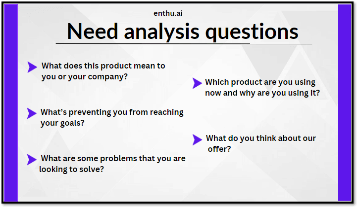

## Table of Contents

## What is Best Ask?

Best Ask is a tool that helps people find answers to their questions quickly and easily. It uses smart technology to understand what you are asking and gives you the best possible answer from a lot of different sources. Whether you need information for school, work, or just out of curiosity, Best Ask can help you get the information you need without spending a lot of time searching.

The tool is designed to be user-friendly, so anyone can use it, no matter how much they know about technology. You just type in your question, and Best Ask does the rest. It's like having a smart friend who knows a lot and can find answers fast. This makes it a great tool for students, professionals, and anyone who wants to learn more about the world around them.

## How does Best Ask work?

Best Ask works by using smart computer technology to understand your questions. When you type a question into Best Ask, it looks at the words you use and tries to figure out what you really want to know. It's like when you ask a friend a question, and they think about what you mean before answering. Best Ask does this very quickly, using a lot of information it has learned from the internet and other places.

Once Best Ask understands your question, it searches through a huge collection of information to find the best answer. It looks at websites, [books](/wiki/algo-trading-books), and other sources to find the most accurate and helpful information. Then, it puts the answer together in a way that's easy for you to read and understand. This means you don't have to spend a lot of time looking through different websites or books yourself; Best Ask does all the hard work for you.

## What are the basic features of Best Ask?

Best Ask has a few basic features that make it easy and fun to use. First, it can understand your questions in many different ways. You can ask it anything, and it will try to figure out what you mean. It's like talking to a smart friend who knows a lot. Best Ask also searches through a lot of different places to find the best answer for you. It looks at websites, books, and other sources to make sure you get the most accurate information.

Another cool thing about Best Ask is that it gives you the answer in a simple way. It doesn't just show you a bunch of links; it puts the information together so you can read it easily. This is great for people who don't want to spend a lot of time searching. Plus, Best Ask keeps learning and getting better, so it can help you with even more questions over time.

## How can Best Ask be integrated into different platforms?

Best Ask can be added to many different places where people use the internet. It can be put into websites, apps, and even chat programs. If you have a website, you can add Best Ask so that people visiting your site can ask questions and get answers right there. For apps, developers can use special tools to include Best Ask, making it easy for people using the app to get information quickly. In chat programs, Best Ask can be used as a smart friend that helps answer questions during conversations.

Adding Best Ask to these places is not hard. There are guides and tools that help people do it. Once Best Ask is part of a website or app, it works the same way everywhere, helping people find answers fast. This makes it useful for all kinds of people, from students doing homework to workers needing information for their jobs. By putting Best Ask in different places, more people can use it and get help whenever they need it.

## What are the benefits of using Best Ask for beginners?

Best Ask is really helpful for people who are just starting to use it. It's easy to use because you just type your question, and Best Ask does all the work to find the answer. You don't need to know a lot about computers or the internet to use it. This makes it perfect for beginners who might feel confused by other search tools. Best Ask also gives you the answer in a simple way, so you don't have to read through a lot of complicated stuff to find what you need.

Another good thing about Best Ask for beginners is that it can help you learn new things quickly. If you're curious about something or need information for school or work, Best Ask can give you the answers fast. This saves you time and makes learning fun. Plus, because Best Ask keeps getting better, it can help you with more and more questions as you use it more.

## Can you explain the user interface of Best Ask?

The user interface of Best Ask is very easy to use. When you open Best Ask, you see a big box where you can type your question. It's like a search bar, but it's made just for asking questions. You can type anything you want to know, and then you press a button that says "Ask." The design is simple and clean, so it's not confusing for people who are new to using it.

After you ask your question, Best Ask shows you the answer on the same page. The answer is written in a way that's easy to read, with clear words and sometimes pictures or examples to help you understand. There are no extra buttons or links to click on, so you can just read the answer and learn what you need to know. This makes Best Ask friendly for everyone, even if you're just starting to use it.

## How does Best Ask handle data privacy and security?

Best Ask cares a lot about keeping your information safe and private. When you use Best Ask, it follows strict rules to make sure your data is protected. It doesn't share your questions or personal information with other people or companies. Best Ask uses special technology to keep your data safe, like encryption, which is like putting a lock on your information so only you and Best Ask can see it.

Best Ask also has clear rules about how it uses your data. It only uses your information to help answer your questions better and to improve the service. If you want to know what data Best Ask has about you, you can ask to see it. You can also tell Best Ask to delete your data if you don't want it to keep it anymore. This way, you can feel safe and in control when you use Best Ask.

## What advanced features does Best Ask offer to power users?

Best Ask has some special features for people who use it a lot and want to do more with it. One of these features is the ability to customize how Best Ask works. Power users can set up Best Ask to give answers in a certain way or focus on specific types of information they like. They can also save their favorite questions and answers, so they can find them quickly later. This makes Best Ask even more useful for people who need it for their work or studies.

Another cool thing for power users is that Best Ask can work with other tools and apps. For example, if you use a special program for taking notes or managing projects, you can connect Best Ask to it. This means you can ask questions and get answers right inside the other program without having to switch back and forth. Best Ask also keeps learning from the questions power users ask, so it gets better at understanding what they need and giving them the best answers possible.

## How can Best Ask's functionality be customized for specific industries?

Best Ask can be changed to fit the needs of different industries by focusing on the special kinds of information they need. For example, if you work in healthcare, you can set up Best Ask to give you answers about medicine, treatments, and health rules. This means when you ask a question, Best Ask will look for the most accurate and up-to-date health information. If you're in the tech industry, you can make Best Ask focus on computer stuff, like coding languages, software, and new technology. This helps you get quick and correct answers about the things you work with every day.

Another way Best Ask can be customized is by working with the special tools and systems that different industries use. For example, in finance, Best Ask can be connected to financial software so you can ask questions about money and get answers right in the program you're using. This makes it easier to find information without having to switch between different apps. By setting up Best Ask to understand the language and needs of your industry, it becomes a really helpful tool that saves time and helps you do your job better.

## What are some common use cases of Best Ask in business environments?

In business environments, Best Ask is often used to help with research and quick information gathering. Employees can use it to find out about market trends, competitors, or industry news without spending a lot of time searching. For example, a marketing team might ask Best Ask about the latest consumer behavior trends to plan their next campaign. This saves time and helps businesses make smart decisions faster.

Best Ask is also great for training and learning. New employees can use it to quickly learn about company policies, procedures, or even specific job tasks. For instance, someone starting in customer service might ask Best Ask about the company's return policy or how to handle common customer complaints. This makes it easier for new hires to get up to speed and start working effectively.

## How does Best Ask compare to other similar tools in the market?

Best Ask is different from other tools because it's really good at understanding what you mean when you ask a question. It looks at your words and tries to figure out what you really want to know. This makes it easier for you to get the right answer without having to ask the question in a special way. Other tools might not be as good at this, so you might have to spend more time trying to find the right words to use. Best Ask also gives you the answer in a simple way, so you don't have to read through a lot of complicated stuff. This makes it easier for everyone to use, even if you're new to it.

Another way Best Ask is different is that it keeps learning and getting better. The more people use it, the better it gets at understanding questions and finding the best answers. Some other tools might not change much over time, so they might not be as helpful for new questions or new information. Best Ask also cares a lot about keeping your information safe and private, which is important for people who want to feel secure when they use it. This makes Best Ask a good choice for anyone who needs quick, accurate answers without worrying about their privacy.

## What future developments are expected for Best Ask?

Best Ask is always getting better. In the future, it will be able to understand even more types of questions. It will use new technology to learn from the questions people ask and give even better answers. Best Ask will also be able to work with more apps and tools, so you can use it in more places without having to switch between different programs. This will make it easier for everyone to get the information they need quickly.

Another thing that will happen is that Best Ask will focus more on specific industries. It will be able to give special answers for people working in healthcare, technology, or other fields. This means if you work in a certain industry, Best Ask will know exactly what kind of information you need and give you the best answers for your job. This will make Best Ask even more helpful for people in different kinds of work.

## How does algo trading work?

Algorithmic trading involves the deployment of computer systems that collect and respond to market data, then automatically execute trades based on pre-defined instructions. These systems function through a series of interdependent processes, which include data input, algorithm analysis, and trade execution. 

The initial step, data input, involves the continuous collection of real-time market data, which can include price quotes, trade volumes, [order book](/wiki/order-book-trading-strategies) data, and relevant economic indicators. The accuracy and timeliness of these data inputs are critical, as they serve as the foundation upon which trading decisions are based. Data sources are typically high-speed, ensuring up-to-date information is available for seamless execution.

Following data acquisition, the algorithmic analysis phase utilizes sophisticated mathematical models to identify trading opportunities and determine appropriate actions. These models evaluate various strategies, often based on historical price behaviors and statistical measures. For example, algorithms may be designed to recognize mean reversion patterns through evaluating historical averages $\bar{P}$ against current prices $P_t$, predicting that deviations will eventually return to the mean. This can be mathematically expressed as:

$$
\text{Signal} = P_t - \bar{P}
$$

Algorithmic systems also incorporate market theories, such as the Efficient Market Hypothesis or behavioral finance concepts, to inform the trading logic embedded in their code. 

One of the primary programming languages used for developing these trading algorithms is Python, due to its extensive libraries and ease of use. A basic outline for an algorithm identifying a simple moving average crossover strategy could look like this:

```python
import pandas as pd

def moving_average_crossover(df, short_window=40, long_window=100):
    # Create moving averages
    df['Short_MA'] = df['Close'].rolling(window=short_window, min_periods=1).mean()
    df['Long_MA'] = df['Close'].rolling(window=long_window, min_periods=1).mean()

    # Create signals
    df['Signal'] = 0
    df['Signal'][short_window:] = np.where(df['Short_MA'][short_window:] > df['Long_MA'][short_window:], 1, 0)

    # Generate trading orders
    df['Position'] = df['Signal'].diff()

    return df

# Example usage
historical_data = pd.DataFrame({'Close': [some_price_data]})
strategy_output = moving_average_crossover(historical_data)
```

In this strategy, when the short-term moving average crosses above the long-term moving average, a buy signal is generated. Conversely, a short position is taken when the short-term average crosses below the long-term moving average.

The final step in [algorithmic trading](/wiki/algorithmic-trading) is the execution of trades. Once a trading signal is generated, the system submits orders to the market automatically, employing advanced order types such as limit orders or market orders, depending on the strategy. Execution platforms are designed to minimize latency, thus reducing slippage and optimizing trade outcomes. 

By integrating data input, precise algorithm analysis, and rapid execution, algorithmic trading systems enhance the ability to exploit market inefficiencies, providing a competitive edge to participants in financial markets.

## What are some popular algo trading strategies?

Algorithmic trading strategies have become integral to modern financial markets, leveraging computational power to execute trades in seconds. Popular strategies include trend-following, mean reversion, and market-making, each with unique methodologies and goals.

Trend-following strategies are based on the analysis of market trends, aiming to capitalize on sustained movements in asset prices. These algorithms track market [momentum](/wiki/momentum) and identify patterns that indicate the direction of price changes. Once a trend is identified, the algorithm automatically initiates trades in the trend’s direction, hoping to ride the wave as long as possible. This approach assumes that trends, once established, often continue for a period, allowing traders to profit by following the general flow of the market.

Mean reversion strategies operate on the principle that prices and returns eventually move back towards their average or mean level. Traders utilizing these strategies assume that deviations from historical averages are temporary, and prices will revert. By identifying securities that deviate from their expected value, these algorithms initiate trades, betting on the return to equilibrium. Mathematically, mean reversion can be modeled by analyzing the difference between the current price and the moving average, and a common statistical indicator used is the Z-score, calculated as:

$$
Z = \frac{(P - \mu)}{\sigma}
$$

where $P$ is the current price, $\mu$ is the mean price over a specified period, and $\sigma$ is the standard deviation.

Market-making strategies involve providing [liquidity](/wiki/liquidity-risk-premium) to the market by simultaneously offering buy and sell limits, and seeking to profit from the bid-ask spread. These algorithms engage in frequent trading by placing a buy order at the bid price and a sell order at the ask price, profiting from the spread between these two prices. Market makers benefit from order flows and contribute to market efficiency by ensuring that there is always a willing buyer and seller. These strategies are particularly advantageous in volatile markets, where spreads tend to widen.

Python can be effectively used to implement these strategies, especially in [backtesting](/wiki/backtesting) and live trading scenarios. Below is a simplified example of a moving average crossover strategy, a form of trend-following strategy:

```python
import pandas as pd

# Load historical price data
data = pd.read_csv('price_data.csv')

# Calculate short and long moving averages
data['SMA'] = data['Close'].rolling(window=20).mean()
data['LMA'] = data['Close'].rolling(window=50).mean()

# Generate trade signals
data['Signal'] = 0
data.loc[data['SMA'] > data['LMA'], 'Signal'] = 1
data.loc[data['SMA'] < data['LMA'], 'Signal'] = -1

# Output data with trading signals
print(data[['Close', 'SMA', 'LMA', 'Signal']])
```

In algorithmic trading, selecting the right strategy depends on market conditions, risk tolerance, and investment goals. Future developments in AI and [machine learning](/wiki/machine-learning) are expected to further refine these strategies, potentially offering even greater accuracy and profitability.

## References & Further Reading

[1]: ["Advances in Financial Machine Learning"](https://www.amazon.com/Advances-Financial-Machine-Learning-Marcos/dp/1119482089) by Marcos Lopez de Prado

[2]: Aronson, D. R. (2007). ["Evidence-Based Technical Analysis: Applying the Scientific Method and Statistical Inference to Trading Signals"](https://onlinelibrary.wiley.com/doi/book/10.1002/9781118268315). Wiley.

[3]: Chan, E. P. (2008). ["Quantitative Trading: How to Build Your Own Algorithmic Trading Business"](https://github.com/ftvision/quant_trading_echan_book). Wiley.

[4]: Jansen, S. (2020). ["Machine Learning for Algorithmic Trading"](https://github.com/stefan-jansen/machine-learning-for-trading). Packt Publishing.

[5]: Bergstra, J., Bardenet, R., Bengio, Y., & Kégl, B. (2011). ["Algorithms for Hyper-Parameter Optimization."](https://proceedings.neurips.cc/paper/2011/file/86e8f7ab32cfd12577bc2619bc635690-Paper.pdf) Advances in Neural Information Processing Systems 24.