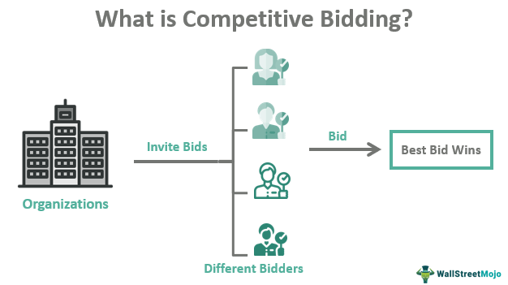

In the fast-paced world of financial markets, the art of bidding has evolved significantly, influenced heavily by advancements in auction processes and the advent of algorithmic trading. Traditional methods of bidding, once reliant on physical presence and manual negotiations, have been transformed through digital platforms that facilitate speed and efficiency. These platforms enable market participants to execute a vast number of trades with precise timing and minimal human intervention.

Auction processes and algorithmic trading have revolutionized the way bids are made, offering structured and transparent methods for price discovery. Auctions, by nature, establish a competitive environment wherein the highest bidder succeeds, determining the fair market value of an asset. In this context, understanding the dynamics of best bid auction processes becomes critical for traders and investors aiming to optimize their strategies and outcomes.



Best bid auction processes require participants to continuously assess their willingness to pay and adjust their bids accordingly. This continuous evaluation is where algorithmic trading plays a pivotal role, as algorithms can analyze market data in real time, making instant decisions based on predefined criteria. These algorithms can be designed to consider a multitude of factors such as historical price patterns, trading volumes, and other market signals, thus offering a sophisticated approach to bidding.

This article explores how bid auctions integrate with algorithmic trading strategies, unveiling the complexities and advantages associated with this integration. Various examples will demonstrate how algorithmic trading has enhanced bidding strategies, showcasing its capability to predict optimal bidding prices, adjust to competitor actions in real-time, and refine bidding patterns through machine learning techniques. Such strategies are not just theoretical; they are applied in practical scenarios where the efficiency and accuracy of algo trading provide a competitive edge.

As algorithmic trading continues to evolve, it provides traders with the ability to execute complex strategies with remarkable speed and minimal error. By leveraging these technological advancements, investors and traders can enhance their understanding and approach to bidding within auction processes, maximizing their potential for success.

## Table of Contents

## What is an Auction Process?

An auction process is a structured method used for buying and selling goods or services by inviting competitive bids. This process typically results in the good being awarded to the highest bidder, thus establishing a dynamic and competitive environment. Auctions serve as critical mechanisms in various markets, ensuring that assets are allocated efficiently based on demand.

There are several types of auctions, each with its unique characteristics and strategic considerations:

1. **English Auction**: The most common type, an English auction involves bidders openly making competitive bids. Bidding starts at a specified reserve price and increases incrementally until only one bidder remains. This format is familiar in art sales and traditional auction houses.

2. **Dutch Auction**: In contrast to the English auction, a Dutch auction begins with a high price that is lowered until a bidder agrees to pay. This type is often used in the sale of perishable goods, shares, or in certain treasury auctions.

3. **Sealed-Bid Auction**: Participants submit their bids confidentially, ensuring that no bidder knows the bid of another. This auction type can be further divided into two forms:
   - **First-Price Sealed-Bid Auction**: The highest bidder wins and pays their bid amount.
   - **Second-Price Sealed-Bid Auction (Vickrey Auction)**: The highest bidder wins but pays the second-highest bid. This mechanism encourages bidders to bid their true valuation of the item.

Understanding each auction type is crucial for strategizing effectively during the bidding process. For instance, strategies in an English auction may focus on outlasting competitors, while a sealed-bid auction might require careful estimation of opponents' valuations to bid effectively. Such awareness allows participants to tailor their approach, maximizing their likelihood of winning the auction while securing favorable terms.

## The Role of Bidding in Auctions

Bidding is a central aspect of auctions and is pivotal in determining the outcome of transactions. Participants in auctions express the value they assign to the items by placing bids, which ultimately reflect their willingness to pay. This expression of value is critical as it forms the bedrock of competitive auction environments, where the highest bid generally secures ownership of the auctioned item.

A strategic approach to bidding is essential for maximizing the chances of winning in an auction. Successful bidders often develop and implement strategies that consider various factors such as the item's perceived value, budget constraints, and the bidding behavior of competitors. The ability to predict how other participants are likely to bid can provide a significant advantage. This may involve studying historical bidding patterns or utilizing statistical models to estimate potential outcomes.

Analyzing competitor behavior involves interpreting signals from the bids of others, which can suggest changes in market sentiment or shifts in perceived item value. Understanding market conditions, such as demand and supply dynamics, is equally important. Tools such as market analysis software or economic indicators can provide insights into these conditions, helping bidders adjust their strategies accordingly.

Integrating these analyses, participants can employ more sophisticated tactics, such as incremental bidding to slowly increase their offer while observing competitor responses or sniping, which is placing a winning bid at the last possible moment to avoid counterbids. The complexity of these strategies underscores the necessity for bidders to remain vigilant and adaptable as auction conditions continuously evolve.

## Understanding the Best Bid Concept

The best bid concept is central to auction markets and financial trading, representing the highest price a buyer is willing to pay for a particular asset at any given time. This concept is crucial as it indicates the maximum level of demand from buyers, thereby setting a baseline for competitive bidding and offer evaluations in auction environments.

In auction markets, the best bid plays a critical role in influencing the final sale price of assets. Sellers often use the best bid as a reference point to determine their willingness to accept an offer, especially in dynamic auctions where prices fluctuate rapidly. The interaction between the best bid and the best offer (the lowest price a seller is willing to accept) forms the bid-ask spread, which is a key measure of market [liquidity](/wiki/liquidity-risk-premium).

To effectively leverage the best bid in decision-making, traders employ a variety of analysis tools and techniques aimed at calculating or predicting this crucial price point. These tools may include historical data analysis, statistical models, and real-time market data. Predictive analytics and [machine learning](/wiki/machine-learning) models are particularly effective in forecasting future best bids based on past market behaviors and patterns.

For example, a simple predictive model might use a linear regression approach where historical bidding data are used to predict future bids. In Python, such a model could be implemented using the following code snippet:

```python
import numpy as np
from sklearn.linear_model import LinearRegression

# Example historical bidding data
historical_data = np.array([[1, 100], [2, 150], [3, 200], [4, 250], [5, 300]])
X = historical_data[:, 0].reshape(-1, 1)  # Features: time index
y = historical_data[:, 1]  # Target: bid prices

# Create and fit the linear regression model
model = LinearRegression().fit(X, y)

# Predict future best bids
future_times = np.array([[6], [7], [8]])
predicted_bids = model.predict(future_times)
print(predicted_bids)
```

This code demonstrates a simplistic approach where linear regression is applied to predict future bids based on a time series of historical bids. While this provides a basic framework, more advanced models incorporating additional market factors and real-time data are used in practice to accurately predict the best bid.

Understanding and predicting the best bid enables traders to optimize their bidding strategies, potentially yielding significant competitive advantages in auction-based trading scenarios.

## Algorithmic Trading in Auctions

Algorithmic trading leverages sophisticated computer algorithms to automate the process of executing trades within financial markets. These algorithms are designed to enhance the efficiency of bidding processes by implementing high-speed and data-driven transactions. The primary function of these algorithms is to process voluminous datasets, extract pertinent information, and use predictive analytics to uncover trends in the marketplace. 

In auction settings, [algorithmic trading](/wiki/algorithmic-trading) presents a distinctive advantage by allowing traders to precisely pinpoint the best bidding opportunities based on comprehensive data analysis. The primary mechanism involves algorithms conducting real-time analysis of market conditions, factoring in variables such as price fluctuations, trading volumes, and competitor bidding patterns. Utilizing historical and real-time data, these algorithms forecast potential market movements, thereby enabling traders to initiate or adjust bids with precision and timeliness.

A standard technique within algorithmic trading includes the implementation of predictive models such as machine learning algorithms, which can continually learn and refine bidding strategies. For precise execution, algorithms use techniques such as linear regression, decision trees, or neural networks to model and anticipate future price trajectories. The continuous adaptation of these models enhances strategic bidding by integrating freshly acquired data into previous learned patterns, optimizing bidding strategies further.

### Python Example
Below is a basic example of how an algorithm might be structured to predict market trends and make bidding decisions:

```python
import numpy as np
from sklearn.linear_model import LinearRegression

# Dummy training data (features: past bid prices, target: market trend indicator)
X_train = np.array([[10], [20], [30], [40], [50]])
y_train = np.array([15, 25, 35, 45, 55])

# Fit model
model = LinearRegression()
model.fit(X_train, y_train)

# Predict future trend based on new bid price
new_bid_price = np.array([[60]])
predicted_trend = model.predict(new_bid_price)

print(f"Predicted Market Trend for Bid Price 60: {predicted_trend}")
```

In practical application, algorithmic trading systems require robust infrastructure to handle the high-frequency nature of transactions. This includes ensuring low-latency computing environments and access to real-time data feeds. Moreover, traders often employ multiple algorithms in synergy, each targeting a specific aspect of market analysis, thus diversifying the bidding strategy and mitigating the risk involved.

## Bidding Examples in Algo Trading

In the context of algorithmic trading, bidding strategies have become increasingly sophisticated, leveraging advancements in technology and data analysis. These strategies aim to enhance the efficiency and effectiveness of trading decisions. Below are three key examples of how bidding strategies are optimized through algorithmic trading.

### Example 1: Predictive Algorithms for Market Price Forecasting

Predictive algorithms play a crucial role in forecasting market prices, enabling traders to make informed bidding decisions. These algorithms use historical price data, market conditions, and various external factors to predict future trends. A typical approach involves using time-series analysis or machine learning techniques such as linear regression, support vector machines (SVM), or more advanced models like Long Short-Term Memory (LSTM) networks for accurate predictions.

For instance, a simple linear regression model in Python can be implemented as follows:

```python
import numpy as np
from sklearn.linear_model import LinearRegression

# Sample data: historical prices and corresponding time data
time = np.array([1, 2, 3, 4, 5]).reshape(-1, 1)
prices = np.array([100, 105, 110, 108, 115])

# Creating a linear regression model
model = LinearRegression()
model.fit(time, prices)

# Predicting future prices
future_time = np.array([6, 7, 8]).reshape(-1, 1)
predicted_prices = model.predict(future_time)

print(predicted_prices)
```

Such algorithms provide traders with insights into likely future price movements, allowing them to adjust their bidding strategies proactively.

### Example 2: Algorithmic Strategies with Real-Time Competitor Analysis

In competitive markets, real-time analysis of competitor actions is vital for successful bidding. Algorithmic strategies equipped with real-time data processing capabilities can adapt bids based on competitor behavior, market demand, and supply shifts. Techniques like sentiment analysis and high-frequency trading algorithms are commonly used to interpret market signals and competitors' activity patterns.

For real-time analysis, traders often employ algorithms capable of parsing market data feeds and executing trades within milliseconds. Python libraries such as `pandas` and `NumPy` are frequently used for handling and analyzing data streams efficiently. For example:

```python
import pandas as pd
import numpy as np

# Real-time market data feed mock-up
data = pd.DataFrame({
    'timestamp': pd.date_range(start='2023-01-01', periods=5, freq='T'),
    'competitor_bid': [100, 102, 101, 105, 103]
})

# Analyzing recent price trends and adjusting bid
current_bid = data['competitor_bid'].rolling(window=2).mean().iloc[-1]
adjusted_bid = current_bid + 1  # small increment above competitor average

print(f"Adjusted Bid: {adjusted_bid}")
```

This capability allows traders to not just react to market conditions, but to anticipate them, providing a strategic advantage in trading.

### Example 3: Machine Learning Models for Refining Bidding Patterns

Machine learning algorithms can refine and optimize bidding patterns by learning from past data and continuously evolving. Techniques such as [reinforcement learning](/wiki/reinforcement-learning) can be utilized wherein the algorithm improves bidding strategies through trial and error, maximizing the long-term rewards.

A reinforcement learning model might involve setting up a trading environment where an agent (the algorithm) makes bidding decisions based on a reward function defined by the profitability of trades. Implementing a basic reinforcement learning scenario involves libraries like `TensorFlow` or `PyTorch`.

For example, using Q-learning, a popular reinforcement learning algorithm:

```python
import numpy as np

# Initialize Q-table with state-action pairs
Q = np.zeros((5, 3))  # 5 states, 3 actions

# Parameters for Q-learning
alpha = 0.1  # learning rate
gamma = 0.9  # discount factor
epsilon = 0.1  # exploration factor

# Sample function to update Q-values
def update_q(state, action, reward, next_state):
    best_next_action = np.argmax(Q[next_state])
    Q[state, action] = Q[state, action] + alpha * (reward + gamma * Q[next_state, best_next_action] - Q[state, action])

# Mock-up of a single update step
current_state = 0
action_taken = 1
reward_received = 10
next_state = 2

update_q(current_state, action_taken, reward_received, next_state)
```

By utilizing these strategies, traders can fine-tune their bidding processes, adapting to complex market dynamics effectively.

## Benefits of Algo Trading in Bidding Processes

Algorithmic trading has become integral to modern bidding processes in financial markets, offering numerous benefits that enhance both efficiency and effectiveness. One of the key advantages is the enhanced speed and accuracy with which decisions are made during auctions. Algorithms can process large volumes of data much faster than a human trader, enabling real-time analysis and execution at the most opportune moments. By minimizing decision-making time, algo trading ensures that traders remain competitive in fast-paced auction environments.

A significant benefit of algorithmic trading is its ability to reduce emotional bias and human errors in bidding strategies. Emotions such as fear and greed, common in manual trading, can lead to suboptimal bidding decisions. Algorithms, by design, follow predefined rules and logic, ensuring that every decision is based on data-driven insights rather than emotions. This approach leads to more consistent and rational bidding strategies, improving the likelihood of success in competitive auctions.

Moreover, algorithmic systems are adept at handling complex computations and processing large datasets efficiently. This capability is especially important in high-frequency trading environments where the rapid analysis of market conditions and competitor behavior is crucial. Advanced algorithms can identify patterns and trends that may not be immediately apparent to human traders, thus uncovering valuable bidding opportunities.

The scalability of algorithmic trading strategies is another notable advantage. Traders can implement and manage multiple bidding strategies across different markets simultaneously, something that would be impractical with manual trading methods. This scalability allows for consistent and repeatable results, regardless of the market or asset class. Furthermore, algorithms can be continuously optimized and adapted to changing market conditions, ensuring ongoing competitiveness.

Overall, the integration of algorithmic trading in bidding processes enhances both the strategic execution of bids and the operational efficiency of trading practices. Its ability to execute high-speed, data-driven, and unbiased trades provides traders with a robust tool to navigate the complexities of modern financial markets.

## Challenges and Considerations

The high dependency on technology in algorithmic trading demands robust and reliable systems to ensure smooth operation and minimize risks. Algorithmic trading systems must be meticulously designed and rigorously tested to withstand technical failures, such as system crashes or data feed errors, which can lead to significant financial losses. Furthermore, regular updates and maintenance are crucial to address potential vulnerabilities and improve system performance.

Market [volatility](/wiki/volatility-trading-strategies) and rapid changes can pose substantial challenges for algorithmic bidding strategies. The ability of algorithms to adapt to sudden market shifts is essential for maintaining their effectiveness. An algorithm programmed to operate under specific market conditions may become suboptimal when faced with unexpected volatility. Thus, incorporating adaptive mechanisms and real-time data analysis can help mitigate this risk. For instance, algorithms can be developed to adjust parameters dynamically or switch between different trading strategies based on current market conditions.

Regulatory concerns and compliance issues are critical considerations in algorithmic trading practices. Traders and firms must ensure that their algorithms comply with financial regulations and market conduct rules, which can vary between jurisdictions. Failure to adhere to these regulations can result in legal repercussions and financial penalties. Staying informed on regulatory changes and incorporating compliance checks into trading algorithms are necessary steps for maintaining lawful operations.

Continuous monitoring and optimization of algorithms are necessary to maintain performance over time. Algorithms must be routinely evaluated and refined to adapt to evolving market conditions and remain competitive. This ongoing process involves analyzing trade data, [backtesting](/wiki/backtesting) strategies, and implementing improvements. Machine learning techniques can be employed to enhance predictive accuracy and automate parts of the optimization process. For example, a machine learning algorithm could analyze historical bid data to identify patterns and suggest adjustments, helping to improve future bidding strategies.

In summary, while algorithmic trading offers significant advantages in terms of speed and efficiency, it requires diligent attention to technological, market, and regulatory factors. Ensuring robust systems, adapting to market volatility, maintaining regulatory compliance, and continuously optimizing algorithms are vital steps for successful algorithmic trading in auctions.

## Conclusion

The integration of bidding processes with algorithmic trading represents a transformative advancement in financial markets. This amalgamation has redefined how trades are executed, offering unparalleled speed and efficiency. Grasping the intricacies of bidding mechanics, auction types, and algorithmic trading methodologies equips investors and traders with a significant competitive advantage. 

As technology advances, so do the strategies and tools available for optimizing auction participation. Algorithmic trading leverages sophisticated models to analyze market trends, assess risk, and execute trades at speeds unattainable by human traders. An exemplary advantage of this technology is its ability to process vast amounts of data in real time, predicting market movements with enhanced precision. For example, traders can implement Python-based machine learning algorithms, such as linear regression or [deep learning](/wiki/deep-learning) models, to forecast bidding prices and adjust their strategies accordingly:

```python
from sklearn.linear_model import LinearRegression
import numpy as np

# Example data: features (market indicators, historical data) and target (price)
X = np.array([[1, 2], [2, 3], [3, 4]])
y = np.array([5, 7, 9])

# Create and train the model
model = LinearRegression()
model.fit(X, y)

# Predict future bidding prices
predictions = model.predict(np.array([[4, 5]]))
print(predictions)
```

Investors and traders must stay informed and adaptable in this constantly evolving landscape. The volatile nature of markets demands continuous learning and adjustment of strategies to maintain a competitive edge. As algorithmic frameworks become more sophisticated, the potential for higher returns and improved performance increases, provided they are supported by reliable technology and sound regulatory practices. This dynamic environment calls for an integrated approach where technology, strategy, and human oversight converge to harness the benefits of algorithmic bidding to their fullest extent.

## References

1. **Hasbrouck, J. (2003).** "Trading and Exchanges: Market Microstructure for Practitioners," Oxford University Press. This book provides a comprehensive overview of market microstructure and examines the intricacies of order types and liquidity, which are essential for understanding bidding strategies in financial markets.

2. **O’Hara, M. (1995).** "Market Microstructure Theory," Blackwell Publishers. O'Hara's work investigates into the behaviors of participants in auctions and the dynamics of order executions, which help to explain the theoretical framework behind different auction types and their impact on bidding processes.

3. **Gomber, P., Arndt, B., Lutat, M., & Uhle, T. (2011).** "High-Frequency Trading," Goethe University, Research Papers. This paper provides insights into high-frequency trading practices and their implications in financial markets, offering context about how algorithmic trading enhances the bidding process through speed and precision.

4. **MacKenzie, D. (2019).** "Trading at the Speed of Light," Princeton University Press. In this book, MacKenzie explores the technology and strategies underpinning high-frequency and algorithmic trading, detailing the competitive edge they provide in auction-based markets.

5. **Milgrom, P. (1989).** "Auctions and Bidding: A Primer," Journal of Economic Perspectives. Milgrom's article explains different auction formats and bidding strategies, analyzing their efficiency in varying market scenarios, which is crucial for strategizing algorithmic trading applications.

6. **Spooner, A. A., & Tuckwell, R. (2014).** "Algorithmic Trading and Market Dynamics: A Practical View," Journal of Trading, 9(1). This journal article discusses practical implementations of algorithmic trading systems, highlighting how algorithms can optimize bidding and order execution in fast-moving markets.

7. **Hendershott, T., & Riordan, R. (2011).** "Algorithmic Trading and Information," NBER Working Paper No. 17637. This paper explores the role of informational efficiency in algorithmic trading, which is vital for understanding how algorithms utilize information to refine bidding strategies.

8. **Biais, B., Glosten, L., & Spatt, C. (2005).** "Market Microstructure: A Survey of Microfoundations, Empirical Results, and Policy Implications," Journal of Financial Markets, 8(2), 217-264. This survey outlines the foundations of market microstructure and discusses empirical findings relevant to auction theory and algorithmic trading.

9. **Chlistalla, M. (2011).** "High-frequency Trading – Better than its Reputation?," Deutsche Bank Research. This report evaluates the implications of high-frequency trading on market stability and efficiency, offering insights on its role in modern bidding environments.

10. **Foucault, T., Pagano, M., & Roell, A. (2013).** "Market Liquidity: Theory, Evidence, and Policy," Oxford University Press. This book provides a thorough exploration of liquidity in financial markets, elaborating on its relationship with auction processes and algorithmic bidding efficiency.

## References & Further Reading

[1]: Hasbrouck, J. (2003). ["Trading and Exchanges: Market Microstructure for Practitioners."](https://www.acsu.buffalo.edu/~keechung/MGF743/Readings/Trading-Exchanges-Market-Microstructure-Practitioners%20Draft%20Copy.pdf) Oxford University Press.

[2]: O’Hara, M. (1995). ["Market Microstructure Theory."](https://www.wiley.com/en-us/Market+Microstructure+Theory-p-9780631207610) Blackwell Publishers.

[3]: Gomber, P., Arndt, B., Lutat, M., & Uhle, T. (2011). ["High-Frequency Trading."](https://papers.ssrn.com/sol3/papers.cfm?abstract_id=1858626) Goethe University, Research Papers.

[4]: MacKenzie, D. (2019). ["Trading at the Speed of Light."](https://press.princeton.edu/books/hardcover/9780691211381/trading-at-the-speed-of-light) Princeton University Press.

[5]: Milgrom, P. (1989). ["Auctions and Bidding: A Primer."](https://www.jstor.org/stable/1942756) Journal of Economic Perspectives, 3(3), 3-22.

[6]: Spooner, A. A., & Tuckwell, R. (2014). ["Algorithmic Trading and Market Dynamics: A Practical View."](https://dl.acm.org/doi/book/10.5555/aai28781427) Journal of Trading, 9(1).

[7]: Hendershott, T., & Riordan, R. (2011). ["Algorithmic Trading and Information."](https://www.semanticscholar.org/paper/Algorithmic-Trading-and-Information-Hendershott-Riordan/992bb61fe2a9861310118f9f68ad98433e75eefd) NBER Working Paper No. 17637.

[8]: Biais, B., Glosten, L., & Spatt, C. (2005). ["Market Microstructure: A Survey of Microfoundations, Empirical Results, and Policy Implications."](https://www.sciencedirect.com/science/article/abs/pii/S1386418104000382) Journal of Financial Markets, 8(2), 217-264.

[9]: Chlistalla, M. (2011). ["High-frequency Trading – Better than its Reputation?"](https://c.mql5.com/forextsd/forum/168/high-frequency_trading_-_better_than_its_reputation.pdf) Deutsche Bank Research. 

[10]: Foucault, T., Pagano, M., & Roell, A. (2013). ["Market Liquidity: Theory, Evidence, and Policy."](https://academic.oup.com/book/55158) Oxford University Press.