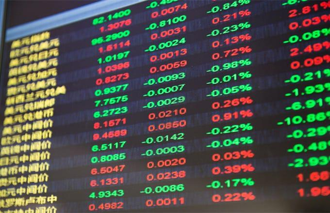

The evolving landscape of global financial markets has brought Chinese dividend stocks into the spotlight. As global markets experience increased volatility and uncertainties, these stocks offer investors a unique proposition: the potential for stable income through regular dividends. This stability stands in stark contrast to the often unpredictable nature of traditional equity markets, where returns might fluctuate widely based on market sentiments and global economic factors.

Chinese dividend stocks have gained particular attention due to China's strong economic fundamentals and sustained growth over the past decades. These stocks, especially those in the energy and finance sectors, are attractive for income-focused investors seeking reliable returns. China's major corporations in these industries often present high dividend yields, providing a consistent income stream that can serve as a buffer against broader market volatility.



Simultaneously, the advent of algorithmic trading has transformed investment strategies, offering a new dimension to how investors approach these assets. Algorithmic trading involves the use of automated, pre-programmed instructions to execute trades, leveraging historical data and analytics to make informed decisions with precision and speed. This technology enables investors to strategically navigate the complexities of dividend stocks, allowing for optimized trade executions and the ability to capitalize on market opportunities that manual trading might miss.

As this article explores, the intersection of Chinese dividend stocks and algorithmic trading presents numerous drivers, trends, and opportunities for today's investors. Understanding these elements can provide insights into how investors can effectively engage with these financial instruments, balancing the pursuit of stable income with the strategic advantages offered by technological advancements in trading methodologies.

## Table of Contents

## Understanding Chinese Dividend Stocks

Chinese dividend stocks have become increasingly attractive to investors worldwide, primarily due to China's strong and sustained economic growth. This economic robustness creates a conducive environment for companies to offer stable and potentially increasing dividends. These stocks function as a viable option for those seeking consistent income, especially when set against the often unpredictable global equity markets.

High-yield dividend stocks from energy and finance sectors in China are of particular interest. The energy sector, spearheaded by companies like China Petroleum & Chemical Corporation (Sinopec) and China National Offshore Oil Corporation (CNOOC), benefits from the country's strategic focus on energy sufficiency and significant investments in infrastructure. Such companies are in a position to generate substantial profits, a portion of which is distributed to shareholders as dividends. The finance sector also presents opportunities, with banks such as Industrial and Commercial Bank of China (ICBC) providing stable dividends due to regulated lending practices and a large customer base.

Income-focused investors find Chinese dividend stocks appealing as they provide a hedge against market [volatility](/wiki/volatility-trading-strategies). This is due to the relatively stable cash flows generated by dividends, which can act as a cushion during market downturns. Dividend-paying stocks tend to have lower volatility as compared to non-dividend-paying stocks because the dividend payments contribute to the overall return on the investment, offering some buffer against price swings.

The appeal of these stocks also lies in their potential for growth. As China's economy continues to expand, so does the opportunity for companies to increase their earnings and, consequently, increase the dividends paid out to investors. This aspect provides a dual benefit—regular income from dividends and the potential for capital appreciation. Furthermore, the Chinese government's supportive policies towards economic growth and its strategic aims to increase consumer consumption bolster the prospects for companies in key sectors to maintain or enhance their dividend payouts.

In conclusion, Chinese dividend stocks offer a compelling mix of steady income and potential growth, making them an attractive choice for income-oriented investors. These stocks not only provide a regular income stream but also help in achieving portfolio diversification, reducing risk by spreading investments across different sectors that are less correlated with fluctuating market conditions.

## The Rise of Algorithmic Trading in Stock Markets

Algorithmic trading has fundamentally transformed the landscape of stock market participation by leveraging automated and pre-programmed trading instructions. This innovative approach deploys sophisticated algorithms that can analyze vast quantities of historical data to identify patterns and trends, thereby enabling precise and swift execution of trades. The evolution of [algorithmic trading](/wiki/algorithmic-trading) has been driven largely by advancements in technology, including the increase in computational power and improvements in data processing capabilities.

At the core of algorithmic trading is the reliance on complex algorithms capable of processing market data and executing orders based on specific criteria. These algorithms monitor market conditions in real-time and apply quantitative models to make trading decisions, which significantly reduces the time lag associated with human decision-making. By using statistical methods and [machine learning](/wiki/machine-learning) techniques, algorithms can forecast market movements and make trades to capitalize on short-term or momentary price discrepancies.

The increasing prevalence of algorithmic trading is evident in both global and Chinese financial markets. Globally, it is estimated that algorithmic trading accounts for a significant portion of trading [volume](/wiki/volume-trading-strategy) in major markets, particularly in the United States where they play a crucial role in high-frequency trading strategies. In China, the market has witnessed substantial growth in the adoption of algorithmic trading strategies as well. The country's gradual liberalization of its financial markets and technological advancements have facilitated the use of algorithmic strategies among institutional investors and high-net-worth individuals.

Algorithmic trading in stock markets not only enhances the efficiency and speed of executions but also contributes to tighter spreads and increased market [liquidity](/wiki/liquidity-risk-premium). However, it is important to note that algorithms tend to amplify market trends, which can sometimes lead to increased volatility, particularly during periods of market stress.

In sum, algorithmic trading represents a paradigm shift in stock market operations, marrying advanced computational techniques with financial market strategies to streamline trading processes, improve accuracy, and capitalize on market inefficiencies. As this technology continues to evolve, its role in shaping the future of stock markets—including the burgeoning Chinese market—will likely expand, driven by further technological innovation and the global adoption of data-driven decision-making in finance.

## Utilizing Algo Trading with Chinese Dividend Stocks

The incorporation of algorithmic trading with Chinese dividend stocks illuminates a sophisticated synergy that holds significant potential for investors seeking both stable income and enhanced efficiency in trading operations. Algorithmic trading, by its very nature, provides investors with the ability to deploy automated systems capable of executing trades at hyper-advanced speeds and with high precision. This technological approach empowers investors to exploit market inefficiencies and optimize their portfolio management strategies with respect to dividend stocks.

### Strategic Exploitation of Dividend Cycles

Algorithmic trading systems can be uniquely tailored to capitalize on dividend cycles, which are defined periods around dividend announcements when stock prices often exhibit predictable patterns of movement. These cycles typically involve strategic buying before the ex-dividend date to capture dividends and selling afterward. Algorithms can be programmed to recognize these patterns and execute trades at the most opportune moments, thereby maximizing the capture of dividend payouts while also leveraging potential capital appreciation.

For instance, if a stock is expected to go ex-dividend, a simple mean-reversion strategy could involve buying ahead of the ex-dividend date and selling after the price adjustment. In Python, such a strategy might look like:

```python
from datetime import datetime, timedelta
import pandas as pd

def dividend_strategy(stock_data, ex_dividend_dates):
    positions = []
    for i, date in enumerate(ex_dividend_dates):
        prior_date = date - timedelta(days=3)  # Buy 3 days before ex-dividend
        post_date = date + timedelta(days=3)  # Sell 3 days after

        buy_price = stock_data.loc[prior_date, 'Close']
        sell_price = stock_data.loc[post_date, 'Close']

        profit = sell_price - buy_price
        positions.append((prior_date, post_date, profit))

    return positions
```

### Earnings Release Algorithms

Additionally, algorithms can be tuned to respond to earnings releases, which frequently precede both positive and negative market shifts. By integrating real-time data analysis with historical performance metrics, algorithmic systems can swiftly execute trades that either capitalize on anticipated growth or hedge against potential declines.

A specific strategy might entail the deployment of a [momentum](/wiki/momentum)-based algorithm that increases positions in stocks when favorable earnings reports are anticipated and vice versa. By analyzing past earnings announcements and subsequent stock performance, algorithms can make data-driven decisions without emotional or cognitive biases that often affect human traders.

### Portfolio Optimization Strategies

Optimization techniques, such as mean-variance optimization and the Black-Litterman model, can be employed to fine-tune dividend stock portfolios. Through these computational methods, algorithms assess the trade-offs between expected returns and risk, leading to more balanced and diversified investment portfolios that align with investor risk appetites and income goals.

In conclusion, the strategic inclusion of algorithmic trading in the management of Chinese dividend stocks offers a new dimension to investing. By leveraging precise and adaptive trading algorithms, investors can enhance their performance and potentially achieve greater returns on investment while navigating the complexities of fluctuating dividend cycles and earnings reports.

## Benefits and Risks of Algorithmic Trading with Dividend Stocks

Algorithmic trading offers numerous advantages for investors in dividend stocks, particularly through the automation of trading processes. Automation enables continuous trading operations beyond traditional market hours, allowing for immediate response to market changes and optimizing the timing of dividend captures. This real-time capability can lead to enhanced income generation compared to manual trading methods, especially when targeting specific dividend cycles and corporate earnings announcements.

Despite these advantages, algorithmic trading also presents several risks that investors must consider. Market anomalies, such as flash crashes, can disrupt trading activities and cause significant financial losses. These events, characterized by sudden and severe price drops, are often exacerbated by the high speed and large volumes associated with algorithmic trading.

Technical failures also pose risks. Errors in algorithms, software malfunctions, or infrastructure outages can lead to unintended trading decisions. Such failures may result in financial losses or discrepancies in a carefully balanced portfolio.

To mitigate these risks, investors can employ several risk management strategies. Diversification, both in terms of asset selection and trading strategies, is crucial. By spreading investments across various sectors and using a variety of algorithms, the impact of adverse events can be minimized.

Risk management can also involve careful monitoring of algorithm performance and market conditions. Incorporating stop-loss orders and other automated safeguards can protect against extreme market movements and system errors. These defensive measures ensure adherence to risk tolerance levels and invest with greater confidence.

In summary, while algorithmic trading in dividend stocks has its challenges, strategic use of diversification and risk management protocols can maximize benefits and minimize potential drawbacks. As with any investment strategy, continuous evaluation and adaptation to market conditions are essential in maintaining an optimal balance between risk and return.

## Future Trends in Chinese Dividend Stocks and Algo Trading

Technological advancements are poised to significantly enhance algorithmic trading platforms, offering increased efficiency, precision, and customization options for investors targeting Chinese dividend stocks. With the integration of [artificial intelligence](/wiki/ai-artificial-intelligence) (AI) and machine learning (ML), these platforms are becoming more adept at analyzing vast datasets to identify optimal trading strategies even in complex market environments. As a result, investors can expect more sophisticated models capable of adapting to market changes in real-time.

Furthermore, the expansion of 5G technology is expected to streamline algorithms' data processing capabilities by reducing latency and improving the communication speed between trading platforms and financial markets. This development could be particularly beneficial for executing high-frequency trading strategies that rely on rapid market data analysis and instantaneous execution.

Regarding China's financial markets, potential policy changes could influence the landscape for dividend stocks. The Chinese government has increasingly emphasized the importance of enhancing market transparency and encouraging a greater flow of foreign investments. This could lead to regulatory adjustments that impact dividend distribution policies and the availability of Chinese stocks to international investors. Potential policy shifts towards easing capital controls and further inclusion in global indices might also attract foreign interest, adding liquidity and possibly enhancing dividend yields.

Anticipated trends in trading strategies involve the refinement of algorithms tailored specifically to exploit dividend events. For instance, Machine Learning-based predictive analytics could offer enhanced forecasting of dividend announcements and their likely impact on stock prices, allowing traders to optimize entry and [exit](/wiki/exit-strategy) points. Additionally, algorithms might incorporate sentiment analysis derived from news and social media to gain insights into market perceptions, thus refining their trading decisions.

In the face of these innovations and trends, investors should remain vigilant regarding the implications on risk management. The increasing complexity of trading algorithms necessitates a robust understanding of technological tools to mitigate potential risks associated with erroneous trades and algorithmic anomalies. By adopting diversified strategies and maintaining an agile approach, investors can better navigate the evolving financial landscape, capitalizing on the opportunities presented by technological advancements and policy shifts in China's financial markets.

## Conclusion

Chinese dividend stocks are increasingly seen as attractive avenues for income-focused investors, thanks to China's sustained economic growth and the potential for stable returns. These stocks, particularly those in the high-yield sectors like energy and finance, offer a steady income stream that can act as a hedge against the volatile nature of global equity markets. As the financial landscape continues to evolve, algorithmic trading emerges as an essential tool, offering new ways to optimize investments in these dividend stocks.

Algorithmic trading leverages automation and advanced analytics to execute trades with high precision and speed, a stark improvement over traditional manual methods. This strategy allows investors to capitalize on dividend cycles and earnings releases with pinpoint accuracy. By implementing predefined algorithms, investors can consistently apply sophisticated trading strategies that might be impractical or impossible to execute manually.

Nevertheless, it is crucial for investors to recognize the inherent risks associated with algorithmic trading. Market anomalies and technical failures are possible, emphasizing the need for robust risk management and diversification strategies. By considering both the benefits and risks, investors can strategically position themselves to maximize opportunities and navigate challenges within the rapidly changing market environment.

Ultimately, Chinese dividend stocks, when complemented with the strategic application of algorithmic trading, offer a powerful opportunity to generate consistent income. Investors who are proactive in engaging with these modern trading techniques stand to gain significant advantages in achieving their financial goals within the dynamic global markets.

## References & Further Reading

[1]: ["Advances in Financial Machine Learning"](https://www.amazon.com/Advances-Financial-Machine-Learning-Marcos/dp/1119482089) by Marcos Lopez de Prado

[2]: ["Algorithms for Hyper-Parameter Optimization"](https://dl.acm.org/doi/10.5555/2986459.2986743) by Bergstra, J., Bardenet, R., Bengio, Y., & Kégl, B. (2011). Advances in Neural Information Processing Systems 24.

[3]: ["Machine Learning for Algorithmic Trading"](https://github.com/PacktPublishing/Machine-Learning-for-Algorithmic-Trading-Second-Edition) by Stefan Jansen

[4]: ["Quantitative Trading: How to Build Your Own Algorithmic Trading Business"](https://books.google.com/books/about/Quantitative_Trading.html?id=j70yEAAAQBAJ) by Ernest P. Chan

[5]: ["Evidence-Based Technical Analysis: Applying the Scientific Method and Statistical Inference to Trading Signals"](https://www.amazon.com/Evidence-Based-Technical-Analysis-Scientific-Statistical/dp/0470008741) by David Aronson