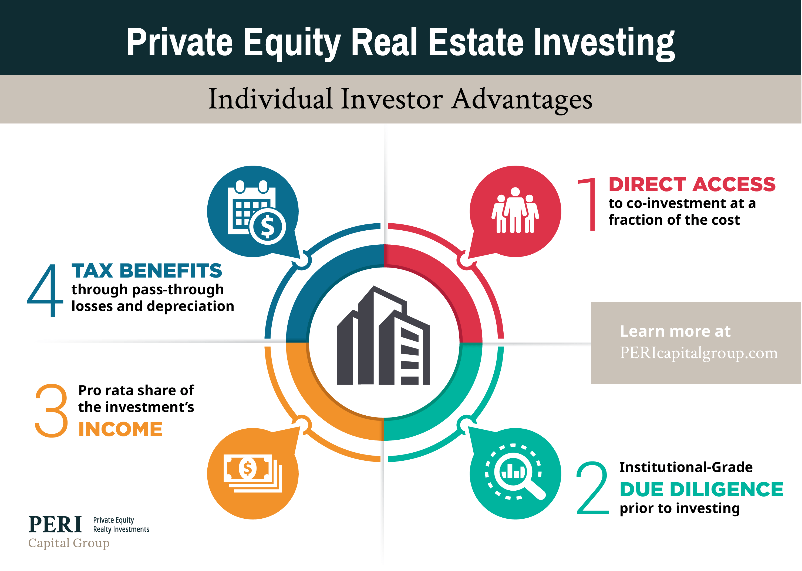

## Table of Contents

## What is commercial real estate?

Commercial real estate is property that is used for business activities, not for living in. This includes places like offices, shops, hotels, and warehouses. People or companies rent these spaces to run their businesses. The goal is usually to make money from the business, not just from owning the property.

Investing in commercial real estate can be a good way to earn money. Owners can make money by renting out the space to businesses. The rent they get can be more than what they pay for things like loans and upkeep. But, it can also be riskier than other types of real estate because it depends a lot on how well the businesses renting the space are doing.

## Why should someone invest in commercial real estate?

Investing in commercial real estate can be a smart move because it can bring in a lot of money. When you own a commercial property, you can rent it out to businesses. The rent you get from these businesses can be much higher than what you pay for things like the mortgage and maintenance. This means you can make a good profit. Plus, commercial leases are often longer than home leases, which means you have a steady income for a longer time.

Another reason to invest in commercial real estate is that it can help spread out your investments. Instead of putting all your money into one thing, like stocks or a home, you can put some into commercial property. This can make your overall investment safer because if one type of investment goes down, the others might still do well. Also, commercial real estate can grow in value over time, so if you decide to sell it later, you might get more money than you paid for it.

## What are the different types of commercial real estate investments?

There are several types of commercial real estate investments you can consider. One type is office buildings, where businesses rent space to do their work. These can be big skyscrapers in cities or smaller buildings in suburbs. Another type is retail spaces, like shopping malls or standalone stores where companies sell things to customers. Industrial properties are also common, including warehouses and factories where goods are made or stored. 

Another category is multifamily housing, which means buildings with many apartments that people rent to live in. These can be big apartment complexes or smaller buildings with just a few units. Lastly, there are special purpose properties, like hotels, movie theaters, or even self-storage units. Each type of commercial real estate has its own risks and benefits, so it's good to think about what fits your investment goals best.

Choosing the right type of commercial real estate depends on what you want to achieve. If you're looking for steady income, multifamily housing might be a good choice because people always need places to live. If you're interested in higher potential returns, you might look into retail or office spaces in growing areas. Understanding the local market and the needs of businesses or tenants in that area can help you make a smart investment decision.

## How does commercial real estate differ from residential real estate?

Commercial real estate and residential real estate are different in many ways. Commercial real estate is used for businesses, like offices, stores, or factories. People rent these spaces to run their companies or to sell things. On the other hand, residential real estate is where people live, like houses or apartments. The main goal of commercial real estate is to make money from the business activities happening there, while residential real estate focuses on providing a place for people to live.

Another big difference is how leases work. Commercial leases are usually longer than residential ones, often lasting several years. This can give the owner a steady income for a longer time. Residential leases are shorter, often just a year or even month-to-month. Also, the way you make money from these properties is different. With commercial real estate, you might earn more rent because businesses can pay more than families. But, it can be riskier because if the business does badly, they might not be able to pay the rent. With residential real estate, the risk might be lower because people always need a place to live, but the rent might not be as high.

## What are the key factors to consider when evaluating commercial real estate investments?

When looking at commercial real estate investments, one of the most important things to think about is where the property is located. A good location can mean more people see the business, which can lead to more customers and higher rent. You should also check how easy it is for people to get to the property, like if it's near public transport or highways. Another big factor is the condition of the building. If it needs a lot of repairs, it might cost you a lot of money before you can start making money from it.

Another key thing to consider is the local market and economy. You want to know if the area is growing or if businesses are doing well there. If the economy is strong, businesses might be willing to pay more rent, which is good for you. You should also look at the lease terms. Longer leases can mean more steady income, but make sure the rent is high enough to cover your costs and still make a profit. Finally, think about how much money you need to put in at the start and if you can handle the risks that come with commercial real estate. It can be a good way to make money, but it's important to do your homework first.

## How can one finance a commercial real estate investment?

There are different ways to get money for a commercial real estate investment. One common way is to get a loan from a bank or a commercial lender. They might give you a mortgage for the property, but you'll need to show them that you can pay it back. This means having a good credit score and maybe even some money to put down at the start. Another way is to find investors who want to put their money into your project. They might give you the money you need in exchange for a part of the profits later on.

Another option is to use a real estate investment trust (REIT). A REIT is like a company that owns and manages a bunch of properties. You can buy shares in the REIT, and they use the money to buy commercial real estate. This way, you don't have to manage the property yourself, but you still get some of the profits. Lastly, you could use your own money if you have enough saved up. This can be riskier because if the investment doesn't go well, you could lose a lot of your own money. But if it does well, you get to keep all the profits.

## What are the risks associated with commercial real estate investments?

Investing in commercial real estate can be risky. One big risk is that businesses might not do well. If the companies renting your property start to struggle, they might not be able to pay the rent. This can leave you without the money you were counting on to pay your bills, like the mortgage or repairs. Also, if the economy in the area goes down, it can be hard to find new tenants to rent the space, which means you might have to lower the rent or leave the property empty for a while.

Another risk is that commercial real estate often needs a lot of money to start with. You might need to put down a big chunk of money to buy the property, and then you have to pay for things like fixing it up or keeping it in good shape. If something goes wrong, like the roof needs to be replaced, it can cost a lot more money than you planned. Plus, if you borrowed money to buy the property, you have to make sure you can pay back the loan, even if things don't go as planned.

Lastly, the value of commercial real estate can go up and down a lot. If the market changes, the price of your property might drop, and you could lose money if you need to sell it. Also, laws and rules about commercial properties can change, and this might mean you have to spend more money to follow them or you might not be able to use the property the way you wanted to. It's important to think about all these risks before deciding to invest in commercial real estate.

## How does location impact the value of commercial real estate?

Location is super important when it comes to the value of commercial real estate. If a property is in a busy area where lots of people go, like downtown or near a big shopping mall, it can be worth a lot more money. Businesses want to be where people can easily see and visit them, so they are willing to pay more rent for a good spot. Also, if the property is easy to get to, like near highways or public transport, it can attract more customers and make the property even more valuable.

On the other hand, if a property is in a quiet or hard-to-reach area, it might not be as valuable. Businesses might not want to rent space there because fewer people will see them, which means less business for them. The local economy also matters. If the area is growing and doing well, with new jobs and businesses popping up, the value of commercial real estate there can go up. But if the area is struggling, with businesses closing down, the value can drop. So, location really plays a big role in how much a commercial property is worth.

## What are the tax implications of investing in commercial real estate?

Investing in commercial real estate can have some tax benefits, but it also comes with some things you need to think about. One good thing is that you can take a deduction for depreciation. This means you can lower your taxable income by saying that the building is wearing out over time. Also, you can deduct the interest you pay on your loan, which can save you money on taxes. If you make improvements to the property, like fixing the roof or adding new systems, you might be able to deduct those costs too.

But, there are also some tax rules you need to know about. When you sell a commercial property, you might have to pay capital gains tax if you make a profit. The tax rate can be different depending on how long you owned the property. If you sell it within a year, you might pay a higher rate than if you held onto it for more than a year. Also, if you get income from renting out the property, you have to report that as income and pay taxes on it. It's a good idea to talk to a tax expert to make sure you understand all the rules and can make the best choices for your investment.

## How can technology and data analytics enhance commercial real estate investment decisions?

Technology and data analytics can make a big difference when you're deciding where to invest in commercial real estate. They help by giving you lots of information about things like how much rent you might get, how busy an area is, and what other properties are selling for. For example, with data analytics, you can look at trends to see if an area is getting more popular or if businesses there are doing well. This can help you pick a good spot for your investment. Also, technology like drones and virtual tours can let you see properties without having to go there in person, which saves time and money.

Another way technology helps is by making it easier to manage your property. You can use special software to keep track of when rent is due, how much you're spending on repairs, and how well your tenants are doing. This can help you make smart choices about how to run your property and make more money. Plus, using data can help you predict what might happen in the future, so you can plan better and maybe avoid some risks. In the end, using technology and data can make your commercial real estate investments more successful.

## What are some advanced strategies for maximizing returns in commercial real estate?

One advanced strategy for making more money from commercial real estate is called value-add investing. This means buying a property that needs some work and then fixing it up to make it better. By doing things like updating the building, adding new features, or improving how it's run, you can attract better tenants who will pay more rent. This can also make the property worth more money when you decide to sell it. Another way to boost returns is through adaptive reuse, which is changing a building's purpose to something that's more in demand. For example, turning an old factory into trendy loft apartments or a new office space can bring in higher rents and increase the property's value.

Another strategy is to use leverage smartly. This means borrowing money to buy more properties than you could with just your own cash. If the properties make more money than what you pay on the loans, you can end up with bigger profits. But, it's important to be careful because if things don't go as planned, you could owe more than you can pay back. Lastly, using technology and data can help you make better decisions. By looking at trends and using software to manage your properties, you can find the best places to invest and run your buildings more efficiently, which can lead to higher returns.

## How do economic cycles affect commercial real estate markets and investment strategies?

Economic cycles have a big impact on commercial real estate markets. When the economy is doing well, more people are working and businesses are growing. This means they need more office space, stores, and factories, which can drive up the demand for commercial properties. As a result, rents go up and property values increase. Investors might see this as a good time to buy because they can make more money from renting out their properties. But, if the economy starts to slow down, businesses might not do as well. They might close or need less space, which can lead to empty buildings and lower rents. This can make it harder for investors to make money, and property values might go down.

Because of these ups and downs, it's important for investors to change their strategies based on where the economy is in its cycle. During good times, investors might want to buy properties to take advantage of high demand and rising values. They might also focus on value-add investments, where they fix up properties to get even higher rents. But when the economy is slowing down, it can be smarter to be more careful. Investors might look for properties that are already in good shape and have steady tenants, like grocery stores or medical offices, because these businesses tend to do well even when the economy isn't great. By understanding economic cycles, investors can make better choices about when to buy, sell, or hold onto their commercial real estate investments.

## What are some Property Investment Strategies?

Property investment strategies encompass a variety of approaches designed to maximize returns and manage risks effectively. Core strategies include:

1. **Buy-and-Hold**: This long-term strategy involves purchasing a property and retaining it to benefit from rental income and capital appreciation over time. Stability in rental demand and favorable market conditions can lead to substantial financial gains.

2. **Flipping**: Flipping focuses on purchasing undervalued properties, improving them through renovations, and selling at a higher price. Timing, renovation costs, and market conditions play crucial roles in the success of this strategy.

3. **Leasing**: Leasing properties involves renting properties to tenants, generating a consistent income stream. Common lease agreements include fixed-term leases and month-to-month arrangements, each with distinct implications on cash flow and property turnover.

4. **Real Estate Investment Trusts (REITs)**: REITs allow investors to pool resources and invest in large-scale properties or property portfolios. They offer liquidity, as REIT shares can be traded on major exchanges, and diversification, reducing individual risk exposure.

### Financing and Leveraging

Financing is essential in property investment, as it enables investors to acquire properties without committing the entire purchase price upfront. Leverage is a key concept, where borrowed funds amplify potential returns. The formula for return on equity (ROE) in leveraged investments is:

$$
ROE = \frac{(Rental\ Income - Operating\ Expenses - Loan\ Payments)}{Equity\ Invested}
$$

Careful assessment of interest rates, loan terms, and market conditions is vital to prevent over-leveraging, which can lead to financial distress.

### Evaluating Potential Properties

A thorough evaluation involves several factors:

- **Location**: Proximity to amenities, public transportation, and economic growth potential significantly affect property value and demand.

- **State of the Property**: The need for repairs or upgrades should be reflected in the purchase price and budget plans.

- **Potential for Development**: Properties with potential for expansion or zoning changes can offer long-term value hikes.

- **Return on Investment (ROI)**: Calculated by assessing the net profit relative to the initial investment, ROI helps gauge financial viability.

$$
ROI = \frac{(Net\ Profit\ from\ Property)}{Cost\ of\ Investment} \times 100
$$

### Risk Assessment and Management

Effective risk management requires:

- **Market Analysis**: Understanding economic indicators and trends to anticipate changes in property values and demand.

- **Diversification**: Spreading investments across different property types or locations to mitigate risks associated with specific markets.

- **Insurance**: Ensuring properties are insured against potential risks like natural disasters or tenant defaults.

### Emerging Trends

Modern trends reshaping property investment include:

- **Co-living Spaces**: These offer shared living environments, appealing to younger demographics and enhancing rental yields through efficient space utilization.

- **Digital Real Estate Platforms**: Online platforms provide tools for property search, investment analysis, and transaction facilitation, increasing transparency and efficiency.

- **Remote Work Impact**: The popularity of remote work has altered homebuying patterns, increasing demand in suburban and rural areas while challenging urban markets.

These strategies, carefully executed, offer robust frameworks for property investment success, requiring continuous adaptation to evolving market dynamics and technological advancements.

## References & Further Reading

[1]: Bergstra, J., Bardenet, R., Bengio, Y., & Kégl, B. (2011). ["Algorithms for Hyper-Parameter Optimization."](https://papers.nips.cc/paper/4443-algorithms-for-hyper-parameter-optimization) Advances in Neural Information Processing Systems 24.

[2]: ["Advances in Financial Machine Learning"](https://www.amazon.com/Advances-Financial-Machine-Learning-Marcos/dp/1119482089) by Marcos Lopez de Prado

[3]: ["Evidence-Based Technical Analysis: Applying the Scientific Method and Statistical Inference to Trading Signals"](https://www.amazon.com/Evidence-Based-Technical-Analysis-Scientific-Statistical/dp/0470008741) by David Aronson

[4]: ["Machine Learning for Algorithmic Trading"](https://github.com/stefan-jansen/machine-learning-for-trading) by Stefan Jansen

[5]: ["Quantitative Trading: How to Build Your Own Algorithmic Trading Business"](https://www.amazon.com/Quantitative-Trading-Build-Algorithmic-Business/dp/1119800064) by Ernest P. Chan