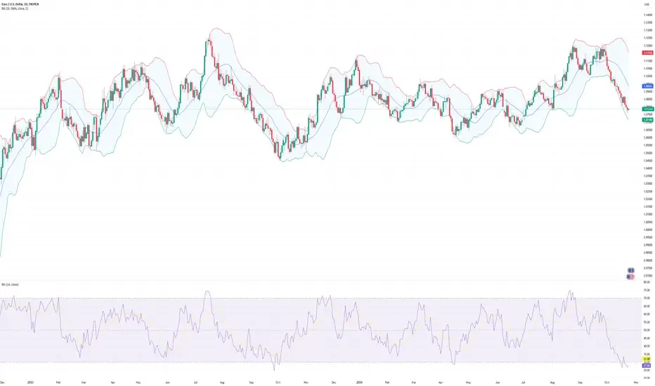

## Table of Contents

## What is day trading and how does it differ from other trading styles?

Day trading is when someone buys and sells stocks or other financial things within the same day. They try to make money from small changes in prices during the day. Day traders usually do not keep their investments overnight because they want to avoid risks that can happen when the market is closed.

Day trading is different from other trading styles because it focuses on short-term gains. Other styles, like swing trading or long-term investing, might hold onto stocks for days, weeks, or even years. Swing traders look for gains over a few days or weeks, while long-term investors aim for growth over many years. Day trading needs a lot of attention and quick decisions, while other styles can be more relaxed and need less daily watching.

## Why is TradingView a popular choice for day traders?

TradingView is a popular choice for day traders because it offers a lot of useful tools all in one place. It has real-time charts and data, which are super important for day traders who need to see what's happening in the market right away. TradingView also lets you use many different indicators and drawing tools to help you make quick decisions. Plus, you can set up alerts to notify you when certain things happen in the market, so you don't miss out on important moves.

Another reason day traders like TradingView is that it has a big community where people share ideas and strategies. You can follow other traders, see what they're doing, and even chat with them. This can be really helpful if you're new to [day trading](/wiki/day-trading-spy) or if you want to learn new tricks. Also, TradingView works on many devices, like your computer, phone, or tablet, so you can trade from anywhere, which is perfect for day traders who need to stay on top of things all the time.

## What are the basic technical indicators used in day trading on TradingView?

Day traders on TradingView often use a few basic technical indicators to help them make quick decisions. One of the most common is the Moving Average, which helps smooth out price data to see the trend more clearly. There are different types, like the Simple Moving Average (SMA) and the Exponential Moving Average (EMA), but they all help traders spot when a stock might be going up or down. Another popular indicator is the Relative Strength Index (RSI), which tells you if a stock is overbought or oversold. If the RSI is over 70, it might mean the stock is overbought and could go down soon. If it's under 30, it might be oversold and could go up.

Another useful indicator is the Moving Average Convergence Divergence (MACD), which shows the relationship between two moving averages of a stock's price. It helps traders see when the trend might be changing. The MACD line crossing above the signal line can be a sign to buy, and crossing below can be a sign to sell. Lastly, Bollinger Bands are also commonly used. They consist of a middle band being an SMA and two outer bands that are standard deviations away from the SMA. When the price touches the upper band, it might mean the stock is overbought, and when it touches the lower band, it might be oversold. These indicators help day traders make quick, informed decisions on TradingView.

## How can a beginner set up a simple day trading strategy on TradingView?

To set up a simple day trading strategy on TradingView, a beginner should start by choosing a stock or asset to trade. Open a chart for that stock on TradingView and set the time frame to a short one, like 1 minute or 5 minutes, since day traders focus on quick moves. Next, add some basic indicators to help make decisions. A good start is adding the Simple Moving Average (SMA) with a period of 20 to see the trend. If the price is above the SMA, it might be a good time to buy, and if it's below, it might be time to sell. Also, add the Relative Strength Index (RSI) with a period of 14 to check if the stock is overbought or oversold. If the RSI goes above 70, it might be overbought and could go down soon. If it goes below 30, it might be oversold and could go up.

Once the indicators are set up, a beginner can start watching the chart and looking for signals. A simple strategy could be to buy when the price crosses above the SMA and the RSI is below 70, and sell when the price crosses below the SMA and the RSI is above 30. It's also a good idea to set up alerts on TradingView so you get notified when these signals happen. Remember, day trading involves risk, so start with a small amount of money and practice with a demo account first. Keep learning and adjusting your strategy as you get more comfortable with the platform and the market.

## What are the key elements of a successful day trading strategy?

A successful day trading strategy needs a few important things. First, you need a clear plan. This means knowing when to buy and sell, and using tools like charts and indicators to help you make decisions. For example, you might decide to buy when a stock's price goes above a certain moving average and sell when it goes below it. It's also important to set rules for how much money you're willing to risk on each trade. This helps you keep your losses small and stay in the game longer.

Another key part of a good day trading strategy is discipline. This means sticking to your plan even when the market gets crazy. It's easy to get excited and make quick decisions that aren't part of your plan, but that can lead to big losses. You also need to keep learning and adjusting your strategy as you go. The market changes all the time, so what worked yesterday might not work today. By staying disciplined and flexible, you can improve your chances of making money in day trading.

Lastly, having the right tools and resources can make a big difference. Using a platform like TradingView gives you real-time data and charts, which are crucial for day trading. It also helps to have a community where you can learn from other traders and share ideas. Starting with a small amount of money and practicing with a demo account can also help you get the hang of things without risking too much. By combining a solid plan, discipline, and the right tools, you can build a successful day trading strategy.

## How can you use TradingView's charting tools to identify entry and exit points?

TradingView's charting tools help you find good times to buy and sell by showing you important information about a stock's price. You can use tools like moving averages to see the overall trend. If the price goes above a moving average, it might be a good time to buy because the stock could be starting to go up. If the price goes below the moving average, it might be time to sell because the stock could be starting to go down. Another helpful tool is the Relative Strength Index (RSI), which shows if a stock is overbought or oversold. If the RSI goes above 70, the stock might be overbought and could go down soon, so it might be a good time to sell. If the RSI goes below 30, the stock might be oversold and could go up soon, so it might be a good time to buy.

You can also use other tools like trend lines and support and resistance levels to find entry and exit points. Drawing trend lines on the chart helps you see the direction the stock is moving. If the price breaks above an upward trend line, it might be a good time to buy. If it breaks below a downward trend line, it might be a good time to sell. Support and resistance levels are prices where the stock tends to stop going down or up. If the price bounces off a support level, it might be a good time to buy. If it hits a resistance level and starts to go down, it might be a good time to sell. By using these tools together, you can make better decisions about when to enter and exit trades on TradingView.

## What are some advanced technical analysis tools available on TradingView for day trading?

TradingView offers some advanced tools that can help day traders make better decisions. One of these tools is the Fibonacci Retracement, which helps you find levels where the price might go up or down again. You draw lines on the chart from a high point to a low point, and the tool shows you levels like 23.6%, 38.2%, 50%, 61.8%, and 100%. These levels can tell you where the price might stop falling and start going up, or where it might stop rising and start going down. Another advanced tool is the Ichimoku Cloud, which gives you a lot of information at once. It shows you support and resistance levels, trend direction, and momentum all in one chart. If the price is above the cloud, it might be a good time to buy. If it's below the cloud, it might be a good time to sell.

Another useful tool is the Volume Profile, which shows you where a lot of trading happens at different price levels. This can help you see where the price might stop or change direction because a lot of people are buying or selling at those levels. You can also use the Average True Range (ATR) to see how much the price is moving. If the ATR is high, it means the price is moving a lot, and if it's low, the price is not moving much. This can help you decide how much risk to take on a trade. By using these advanced tools together, you can get a better understanding of what the market might do next and make smarter trading decisions.

## How can risk management be integrated into a day trading strategy on TradingView?

Risk management is super important in day trading, and TradingView has tools to help you do it right. One way to manage risk is by setting stop-loss orders. On TradingView, you can use the platform's alerts to notify you when a stock reaches a certain price, so you can sell it quickly and not lose too much money. Another way is to decide how much money you're willing to risk on each trade before you start. You can use the platform's drawing tools to mark these levels on your chart, so you know when to get out if things go wrong. Also, TradingView lets you practice with a demo account, so you can try out your risk management plan without losing real money.

Another part of risk management is knowing how much to trade. TradingView has features that let you see how much money you might make or lose on a trade. This can help you decide how many shares to buy or sell. It's also a good idea to keep an eye on how much you're trading overall. If you're losing money, you might want to trade less until you get back on track. By using TradingView's tools and keeping a close eye on your trades, you can manage your risk better and have a better chance of making money in day trading.

## What are the common mistakes to avoid when using TradingView for day trading?

One common mistake when using TradingView for day trading is relying too much on the platform's indicators without understanding them. Just because a line on the chart says to buy or sell doesn't mean it's always right. You need to learn what each indicator means and how to use them together to make good decisions. Another mistake is not setting up stop-loss alerts. TradingView has great tools for setting alerts, but if you don't use them, you might lose more money than you planned. Always set an alert to tell you when to sell if the price goes against you.

Another big mistake is trading too much. TradingView makes it easy to see lots of charts and trade all day, but that can lead to overtrading. It's better to focus on a few good trades than to jump in and out of the market all the time. Also, don't forget to practice with a demo account first. TradingView lets you do this, so you can try out your strategy without losing real money. By avoiding these mistakes, you can use TradingView more effectively for day trading.

## How can backtesting be utilized to refine a day trading strategy on TradingView?

Backtesting on TradingView is a way to test your day trading strategy using old market data to see how it would have worked in the past. You can use the Pine Script editor on TradingView to write code for your strategy and then run it against historical data. This helps you see if your strategy makes money or loses money over time. By looking at the results, you can find out what works and what doesn't, and then make changes to your strategy to make it better. For example, if your strategy loses money when the market is going down, you might add rules to avoid trading during those times.

Using [backtesting](/wiki/backtesting) on TradingView can also help you set better entry and exit points for your trades. You can see how different indicators or rules affect your trades and adjust them to find the best times to buy and sell. This way, you can fine-tune your strategy to fit different market conditions. Remember, though, that past results don't always mean the same thing will happen in the future. But backtesting can give you a good idea of how your strategy might work and help you feel more confident when you start trading for real.

## What are the latest trends and updates in TradingView that can enhance day trading strategies?

TradingView keeps adding new features that can help day traders do better. One of the latest trends is the use of more advanced charting tools, like the new heatmap feature. This tool shows you which stocks are doing well and which ones are not, all at a glance. It can help you quickly find good trading opportunities. Another update is the improved mobile app, which now works even better on your phone or tablet. This means you can keep an eye on the market and make trades from anywhere, which is super important for day traders who need to act fast.

Also, TradingView has been working on making its community features even better. Now, you can join more groups and chat rooms where traders share their ideas and strategies. This can be a big help if you're new to day trading or if you want to learn new tricks. Plus, TradingView has added more educational content, like webinars and tutorials, to help you understand the market better. By using these new tools and resources, you can make your day trading strategy even stronger.

## How can an expert trader customize and automate their day trading strategy using TradingView's Pine Script?

An expert trader can use TradingView's Pine Script to write their own trading strategy and automate it. Pine Script is a special language made by TradingView that lets you tell the platform what to do. You can write code to tell TradingView when to buy or sell based on your own rules. For example, you might write a script that says to buy when the price goes above a moving average and the RSI is below 70. Once you have written your strategy in Pine Script, you can run it on TradingView's charts to see how it would have worked in the past. This is called backtesting, and it helps you see if your strategy makes money or loses money over time. If it works well, you can then use it to make real trades automatically.

To start using Pine Script, you go to the Pine Script editor on TradingView. You type in your rules and conditions, like when to enter and exit trades, and how much to risk. Once your script is ready, you can add it to your chart and set it to run automatically. TradingView will then follow your rules and make trades for you without you having to do anything. This can save a lot of time and help you stick to your strategy. But remember, even with automation, it's important to keep an eye on your trades and be ready to make changes if the market changes.

## What are the top TradingView strategies for algo trading?

Algorithmic trading on TradingView allows traders to implement and refine a variety of effective strategies, each suited to different market environments. Here, we explore three commonly used strategies: [momentum](/wiki/momentum) trading, mean reversion, and [breakout](/wiki/breakout-trading) strategies.

**Momentum Trading Strategies**

Momentum trading strategies are predicated on the belief that security prices that are trending will continue to trend. These strategies typically utilize technical indicators like moving averages and the Relative Strength Index (RSI) to identify entry and [exit](/wiki/exit-strategy) points. The essence of momentum trading lies in capturing the surge of pricing trends, whether upward or downward.

For example, a simple momentum strategy might involve using the Moving Average Convergence Divergence (MACD) indicator. The MACD is calculated as:  
$$
\text{MACD} = \text{EMA}_{12} - \text{EMA}_{26} \]  
where $\text{EMA}_{12}$ and $\text{EMA}_{26}$ represent the exponential moving averages over 12 and 26 periods, respectively. A bullish signal is generated when the MACD crosses above its signal line (the $\text{EMA}_9$ of the MACD).

Below is a basic Python script illustrating a momentum trading signal with the MACD:

```python
import pandas as pd

def calculate_macd(data, short_window=12, long_window=26, signal_window=9):
    data['EMA_short'] = data['Close'].ewm(span=short_window, adjust=False).mean()
    data['EMA_long'] = data['Close'].ewm(span=long_window, adjust=False).mean()
    data['MACD'] = data['EMA_short'] - data['EMA_long']
    data['Signal_Line'] = data['MACD'].ewm(span=signal_window, adjust=False).mean()
    data['Signal'] = data['MACD'] > data['Signal_Line']
    return data

# Example usage
# data = pd.read_csv('market_data.csv')
# macd_data = calculate_macd(data)
```

**Mean Reversion Strategies**

Mean reversion strategies operate under the assumption that prices and returns eventually move back towards their historical mean. Traders utilizing these strategies aim to capitalize on temporary extremes in price by identifying overbought or oversold conditions. Technical tools such as Bollinger Bands can be employed to detect these extremes.

Bollinger Bands consist of a middle band (a simple moving average) and two outer bands. The outer bands are usually set two standard deviations away from the middle band:

$$
\text{Upper Band} = \text{SMA}(P, n) + k \times \sigma
$$
$$
\text{Lower Band} = \text{SMA}(P, n) - k \times \sigma
$$

where $P$ is the price, $n$ is the number of periods in the moving average, $k$ is the number of standard deviations, and $\sigma$ is the standard deviation of $P$.

**Breakout Strategies**

Breakout strategies identify price levels at which the security price is likely to break out of its established range, indicating a strong momentum move. When prices break above resistance or below support levels, it often signals the commencement of a new trend, which traders aim to capture.

Key levels are often determined by drawing trendlines or using price patterns like triangles and channels. Once a breakout is confirmed with [volume](/wiki/volume-trading-strategy) analysis, traders execute trades in the direction of the breakout.

In sum, these strategies alone or in combination can greatly enhance [algorithmic trading](/wiki/algorithmic-trading) performance on TradingView. Leveraging robust technical indicators and data-driven insights, traders can optimize their strategies for more consistent and profitable outcomes.

## References & Further Reading

[1]: Bergstra, J., Bardenet, R., Bengio, Y., & Kégl, B. (2011). ["Algorithms for Hyper-Parameter Optimization."](https://papers.nips.cc/paper/4443-algorithms-for-hyper-parameter-optimization) Advances in Neural Information Processing Systems 24.

[2]: ["Advances in Financial Machine Learning"](https://www.amazon.com/Advances-Financial-Machine-Learning-Marcos/dp/1119482089) by Marcos Lopez de Prado

[3]: ["Evidence-Based Technical Analysis: Applying the Scientific Method and Statistical Inference to Trading Signals"](https://www.amazon.com/Evidence-Based-Technical-Analysis-Scientific-Statistical/dp/0470008741) by David Aronson

[4]: ["Machine Learning for Algorithmic Trading"](https://github.com/stefan-jansen/machine-learning-for-trading) by Stefan Jansen

[5]: ["Quantitative Trading: How to Build Your Own Algorithmic Trading Business"](https://books.google.com/books/about/Quantitative_Trading.html?id=j70yEAAAQBAJ) by Ernest P. Chan