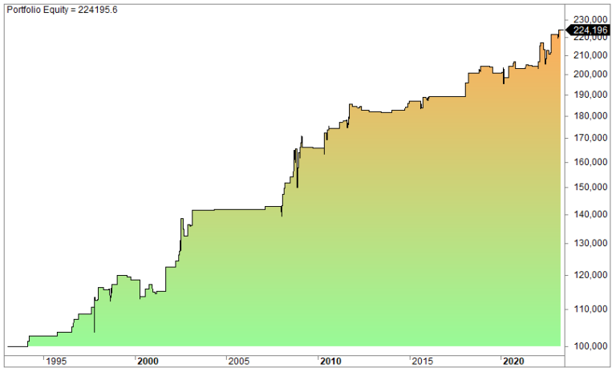

Algorithmic trading, commonly referred to as algo trading, has significantly transformed financial markets by utilizing advanced computational techniques. This approach allows traders to automate their trading activities, optimizing strategies to minimize human error and enhance efficiency. The key advantage of algo trading lies in its ability to rapidly process vast amounts of data, enabling traders to make informed decisions and capitalize on transient market opportunities that might be missed by human intervention alone.

TradingView has emerged as a leading platform among algo traders thanks to its comprehensive suite of tools and features designed to support strategy development. The platform is highly regarded for its user-friendly interface and extensive charting capabilities, making it an attractive choice for both novice and experienced traders. On TradingView, traders have access to a wide range of strategies tailored to various trading styles and objectives, whether focusing on short-term market movements or long-term trends.



In this article, we will examine some of the most effective TradingView strategies for algorithmic trading, highlighting their functionalities and assessing their effectiveness in enhancing trading outcomes. By understanding these strategies, traders can better position themselves to achieve their trading goals, leveraging the robust tools offered by TradingView to navigate the complexities of modern financial markets.

## Table of Contents

## Understanding Algorithmic Trading

Algorithmic trading, commonly referred to as algo trading, utilizes computer algorithms to automate the process of trading securities by following a set of pre-defined instructions. These instructions can encompass a wide array of parameters, including the timing, price, and volume of trades. This method of trading capitalizes on three primary components: data analysis, trade execution, and risk management.

At its core, algorithmic trading leverages computer programs to analyze vast amounts of market data. The algorithms digest historical and real-time data to identify patterns or trends that may inform future market movements. A fundamental advantage of this approach is the speed with which it operates. Algorithms can process data and execute transactions in a fraction of a second, a feat that is impossible for human traders. This rapid execution enables the capturing of transient market opportunities that might escape manual trading.

Moreover, algorithmic trading negates the influence of emotional bias on trading decisions. Human traders are often swayed by emotions such as fear and greed, which can lead to irrational decision-making and erratic performance. By using pre-set rules and logic embedded in algorithms, trades are executed based on empirical data and computed strategies, devoid of emotional interference. This objective approach ensures that trading strategies are implemented consistently and without deviation.

To illustrate, consider a simple algorithmic strategy where an order is placed if a stock's 50-day moving average crosses above its 200-day moving average. The basic Python code for such logic could be structured as follows:

```python
if short_term_moving_average > long_term_moving_average:
    execute_trade("buy")
```

In this snippet, `execute_trade` is a function that triggers a buy order when the short-term moving average surpasses the long-term moving average, adhering to the strategy's logic without hesitation or second-guessing.

In summary, [algorithmic trading](/wiki/algorithmic-trading) presents a blend of speed, precision, and unbiased decision-making, enabling traders to navigate the complexities of financial markets with enhanced efficacy.

## Why Use TradingView for Algo Trading

TradingView is a preferred platform for algorithmic trading due to its intuitive interface and robust charting capabilities. Its design caters to traders across different experience levels, aiming to streamline the process of developing and testing trading algorithms. A standout feature of TradingView is its comprehensive suite of technical indicators, which enables traders to conduct detailed market analysis. These tools cover a broad spectrum, providing insights into various market conditions and helping traders identify potential trading opportunities.

One of the most significant advantages of TradingView is the ability to create custom scripts with Pine Script, its proprietary coding language. Pine Script offers traders the flexibility to tailor algorithms according to specific trading strategies. This customization capacity is essential for traders aiming to develop unique strategies that accommodate their analysis style and market predictions. For example, the following Pine Script snippet demonstrates a simple moving average crossover strategy:

```pinescript
//@version=4
study("Simple Moving Average Crossover", shorttitle="SMA Crossover", overlay=true)

// Define moving averages
shortSMA = sma(close, 10)
longSMA = sma(close, 30)

// Plot moving averages
plot(shortSMA, color=color.blue, title="Short SMA")
plot(longSMA, color=color.red, title="Long SMA")

// Signal generation
if crossover(shortSMA, longSMA)
    strategy.entry("Buy", strategy.long)
else if crossunder(shortSMA, longSMA)
    strategy.entry("Sell", strategy.short)
```

This script defines two simple moving averages—one short-term and the other long-term—and generates buy or sell signals based on their crossover points. Such flexibility in scripting enhances the development of sophisticated trading strategies, which can be continually refined and backtested using historical data.

TradingView's community features significantly contribute to its appeal among algorithmic traders. The platform has a vibrant community where traders can exchange strategies, share insights, and collaborate on developing more effective trading systems. This collaborative environment fosters learning and innovation, as traders can access a wealth of knowledge and experience from peers around the globe.

By engaging with the community, traders can refine their strategies, learn new trading techniques, and discover fresh perspectives on market analysis. Within this supportive network, traders gain exposure to diverse ideas, which can lead to the creation of more robust and adaptive trading algorithms. Overall, TradingView provides a comprehensive, user-friendly platform equipped with powerful tools and community support, making it an excellent choice for those involved in algorithmic trading.

## Top TradingView Strategies for Algo Trading

Algorithmic trading on TradingView allows traders to implement and refine a variety of effective strategies, each suited to different market environments. Here, we explore three commonly used strategies: [momentum](/wiki/momentum) trading, mean reversion, and [breakout](/wiki/breakout-trading) strategies.

**Momentum Trading Strategies**

Momentum trading strategies are predicated on the belief that security prices that are trending will continue to trend. These strategies typically utilize technical indicators like moving averages and the Relative Strength Index (RSI) to identify entry and [exit](/wiki/exit-strategy) points. The essence of momentum trading lies in capturing the surge of pricing trends, whether upward or downward.

For example, a simple momentum strategy might involve using the Moving Average Convergence Divergence (MACD) indicator. The MACD is calculated as:  
$$
\text{MACD} = \text{EMA}_{12} - \text{EMA}_{26} \]  
where $\text{EMA}_{12}$ and $\text{EMA}_{26}$ represent the exponential moving averages over 12 and 26 periods, respectively. A bullish signal is generated when the MACD crosses above its signal line (the $\text{EMA}_9$ of the MACD).

Below is a basic Python script illustrating a momentum trading signal with the MACD:

```python
import pandas as pd

def calculate_macd(data, short_window=12, long_window=26, signal_window=9):
    data['EMA_short'] = data['Close'].ewm(span=short_window, adjust=False).mean()
    data['EMA_long'] = data['Close'].ewm(span=long_window, adjust=False).mean()
    data['MACD'] = data['EMA_short'] - data['EMA_long']
    data['Signal_Line'] = data['MACD'].ewm(span=signal_window, adjust=False).mean()
    data['Signal'] = data['MACD'] > data['Signal_Line']
    return data

# Example usage
# data = pd.read_csv('market_data.csv')
# macd_data = calculate_macd(data)
```

**Mean Reversion Strategies**

Mean reversion strategies operate under the assumption that prices and returns eventually move back towards their historical mean. Traders utilizing these strategies aim to capitalize on temporary extremes in price by identifying overbought or oversold conditions. Technical tools such as Bollinger Bands can be employed to detect these extremes.

Bollinger Bands consist of a middle band (a simple moving average) and two outer bands. The outer bands are usually set two standard deviations away from the middle band:

$$
\text{Upper Band} = \text{SMA}(P, n) + k \times \sigma
$$
$$
\text{Lower Band} = \text{SMA}(P, n) - k \times \sigma
$$

where $P$ is the price, $n$ is the number of periods in the moving average, $k$ is the number of standard deviations, and $\sigma$ is the standard deviation of $P$.

**Breakout Strategies**

Breakout strategies identify price levels at which the security price is likely to break out of its established range, indicating a strong momentum move. When prices break above resistance or below support levels, it often signals the commencement of a new trend, which traders aim to capture.

Key levels are often determined by drawing trendlines or using price patterns like triangles and channels. Once a breakout is confirmed with [volume](/wiki/volume-trading-strategy) analysis, traders execute trades in the direction of the breakout.

In sum, these strategies alone or in combination can greatly enhance algorithmic trading performance on TradingView. Leveraging robust technical indicators and data-driven insights, traders can optimize their strategies for more consistent and profitable outcomes.

## Integrating Technical Indicators

Technical indicators are essential tools for analyzing market trends and forecasting price movements. TradingView, a platform well-regarded for its comprehensive analytical features, offers a diverse selection of indicators including Bollinger Bands and the Moving Average Convergence Divergence (MACD), among others.

Bollinger Bands consist of a middle band (usually a simple moving average) and two outer bands. The outer bands are typically two standard deviations from the middle band and adjust in response to market [volatility](/wiki/volatility-trading-strategies). When prices move closer to the upper band, it suggests an overbought market condition, while proximity to the lower band indicates an oversold condition. Traders can utilize these signals to make informed entry and exit decisions.

The MACD indicator is another valuable tool that displays the relationship between two moving averages of a security’s price. The MACD is calculated by subtracting the 26-period exponential moving average (EMA) from the 12-period EMA. A signal line, which is a 9-day EMA of the MACD itself, is plotted on top of the MACD line and can indicate buy or sell signals. A basic trading strategy might involve buying the asset when the MACD crosses above the signal line and selling when it crosses below.

Effectively integrating these indicators into algorithmic strategies involves setting precise parameters that define optimal market entry and exit points under varying conditions. For example, a trader may program an algorithm to initiate a trade when the price crosses above the Bollinger Bands, coupled with a positive MACD crossover to confirm momentum.

In TradingView, traders can backtest these strategies to simulate their performance using historical data. This allows for evaluation of the strategy's effectiveness across different market environments. TradingView's [backtesting](/wiki/backtesting) environment provides detailed reports that include performance metrics such as profit [factor](/wiki/factor-investing), maximum drawdown, and win/loss ratio, which are critical in assessing the viability of an algorithmic approach.

Through iterative analysis, traders can fine-tune these indicators and their associated parameters. Python can be employed within TradingView’s Pine Script language to further optimize strategies. For instance, traders may experiment with different EMA periods to improve the MACD's responsiveness to market changes. 

By thoroughly understanding and systematically applying technical indicators within TradingView, traders can develop robust algorithmic strategies that stand up to real-world market challenges.

## The Importance of Backtesting

Backtesting is a crucial component of algorithmic trading, providing traders with the ability to test their strategies against historical data. It serves as a validation tool, offering a glimpse into how a strategy might perform under various market conditions before it is deployed with real capital. This practice not only helps in assessing the viability of a trading approach but also plays a significant role in its refinement and optimization.

TradingView equips traders with sophisticated backtesting capabilities, allowing for a thorough examination of algorithmic strategies. Via its proprietary Pine Script language, users can script custom strategies and backtest them directly on the platform. This tool is vital for spotting potential pitfalls and opportunities within a strategy, enabling traders to make informed adjustments.

Within backtesting, it is essential to consider diverse market scenarios that a strategy might encounter. This includes bull and bear markets, ranging periods, and unexpected economic events. Simulating these conditions allows traders to evaluate a strategy's robustness and adaptability. Additionally, during the backtesting phase, accounting for factors such as slippage and transaction costs is paramount. Slippage refers to the difference between the expected price of a trade and the price at which it is actually executed. In highly volatile markets, slippage can significantly affect the performance of a strategy.

For an effective backtesting process, it is advisable to incorporate these aspects using Python:

```python
def backtest_strategy(data, strategy, slippage=0.01, transaction_cost=0.001):
    initial_capital = 100000  # Starting capital
    positions = []
    for index, row in data.iterrows():
        action = strategy(row)
        if action == "buy":
            positions.append(row['price'])
        elif action == "sell" and positions:
            buy_price = positions.pop(0)
            trade_profit = (row['price'] - buy_price) * (1 - transaction_cost) - slippage
            initial_capital += trade_profit
    return initial_capital

# Example strategy
def example_strategy(price_data):
    if price_data['indicator'] > 1.5:
        return "buy"
    elif price_data['indicator'] < 0.5:
        return "sell"
    else:
        return "hold"
```

In this Python snippet, `backtest_strategy` simulates buying and selling actions based on a simple example strategy function. The transaction costs and slippage are factored into the calculations, providing a more realistic estimate of the strategy's profitability. By thoroughly backtesting and considering these factors, traders can optimize their strategies on platforms like TradingView, increasing the likelihood of successful and consistent trading outcomes.

## Risk Management in Algo Trading

Effective risk management is essential for the success of algorithmic trading. This practice involves strategies that protect traders from substantial losses while maximizing potential gains. Setting stop-loss orders and diversifying trading strategies are two primary methods to mitigate risks.

A stop-loss order is a predetermined price point that triggers an automatic sell order for a security. This mechanism helps traders limit losses by exiting a position when the market moves unfavorably. Implementing stop-losses in algorithmic trading reduces exposure to large market swings and unexpected events. For instance, consider a scenario where a trader wishes to limit the maximum loss to 2% of the trading position. The stop-loss order can be set as follows:

```python
def calculate_stop_loss(entry_price, max_loss_percent):
    return entry_price * (1 - max_loss_percent / 100)

entry_price = 100  # Example entry price
max_loss_percent = 2
stop_loss_price = calculate_stop_loss(entry_price, max_loss_percent)
print(f"Stop-loss price: {stop_loss_price}")
```

Diversification is another critical component of risk management. By spreading investments across various strategies or asset classes, traders can reduce the impact of adverse price movements in any single area. This approach helps in balancing the overall risk-return profile of the trading portfolio.

TradingView offers a suite of tools to assist traders in effectively managing these risk parameters. Traders can utilize the platform to set stop-loss orders automatically and receive alerts when certain price levels are reached. TradingView’s scripting language, Pine Script, allows traders to program these risk management rules into their trading strategies.

Moreover, continuous monitoring of algorithmic performance is vital. Market conditions are dynamic and can significantly influence the effectiveness of a given strategy. By regularly assessing performance metrics such as drawdown, volatility, and Sharpe ratio, traders can determine if their strategies need adjustments. These metrics provide quantitative measures of a strategy's risk and return, helping traders make informed decisions about potential modifications. Constant vigilance ensures that strategies remain aligned with the trader’s risk tolerance and market trends.

In conclusion, risk management in algorithmic trading is more than just an auxiliary function; it is a pivotal element of sustainable trading success. By leveraging TradingView’s tools, traders can effectively implement stop-loss orders, diversify their portfolios, and maintain ongoing oversight of their strategies, resulting in enhanced protection and performance in volatile markets.

## Utilizing TradingView's Community and Resources

TradingView's community is a pivotal feature that sets it apart as a premier platform for algorithmic trading. This robust community facilitates the sharing of strategies, insights, and analytical ideas among traders, creating a collaborative environment that enhances trading proficiency. Participation in this community provides traders with several advantages.

Firstly, engagement with the TradingView community aids in the discovery and refinement of trading strategies. Users can access a plethora of shared strategies and indicators developed by other traders. By examining these publicly available scripts and ideas, traders can identify new opportunities or methodologies that may complement their existing strategies. For example, a trader focusing on momentum trading might find innovative ways to enhance their models by integrating community-validated indicators or adopting variations from peer-reviewed scripts.

Secondly, the ability to follow expert traders and analysts within the TradingView platform allows users to gain valuable market insights. By subscribing to updates from seasoned professionals, traders benefit from real-time alerts and analyses, which can be instrumental in making informed trading decisions. This system of following and engagement fosters a learning environment where less experienced traders can improve by observing the methodologies and rationales of expert traders.

Additionally, TradingView's platform supports interactive discussions on proposed strategies, which are instrumental in strategy optimization. Users can comment on indicators and strategies, ask questions, or provide feedback, thus participating in a feedback loop that enhances the quality and robustness of trading strategies. This peer review process ensures that traders do not operate in isolation and are less likely to fall victim to cognitive biases or oversight that can lead to substantial losses in algorithmic trading environments.

In conclusion, TradingView's community and resources offer unparalleled support for traders looking to advance their algorithmic trading strategies. By engaging with this active community, traders can consistently refine their approaches, stay informed on market trends, and leverage collective insights to enhance their decision-making processes.

## Conclusion

TradingView stands out as an exceptional platform for algorithmic trading, offering a comprehensive suite of tools, indicators, and a vibrant community. Its user-friendly interface and robust charting capabilities enable traders to develop and refine their trading strategies efficiently. The integration of Pine Script, a proprietary scripting language, further empowers traders to create custom indicators and automate their trading processes.

Success in algorithmic trading, however, is contingent upon more than just the development of effective strategies. Continuous adaptation to market changes and rigorous risk management are crucial components. Traders must employ strategies that are not only data-driven but also dynamic, adapting to the evolving market landscape. Implementing stop-loss orders, diversifying trading strategies, and regularly reviewing algorithmic performance are all essential aspects of managing risk effectively.

By leveraging the extensive resources available on TradingView, traders can significantly enhance their algorithmic trading proficiency. Engaging with the platform's community allows traders to exchange insights and collaborations, fostering the discovery and improvement of trading methods. Following experts and incorporating community-shared strategies can contribute to refining one's own approach.

In summary, TradingView's comprehensive tools and resources provide traders with the necessary infrastructure to achieve consistent and profitable results in algorithmic trading. Embracing both strategic development and adaptive risk management enables traders to navigate the complexities of the financial markets with confidence.

## References & Further Reading

[1]: Bergstra, J., Bardenet, R., Bengio, Y., & Kégl, B. (2011). ["Algorithms for Hyper-Parameter Optimization."](https://papers.nips.cc/paper/4443-algorithms-for-hyper-parameter-optimization) Advances in Neural Information Processing Systems 24.

[2]: ["Advances in Financial Machine Learning"](https://www.amazon.com/Advances-Financial-Machine-Learning-Marcos/dp/1119482089) by Marcos Lopez de Prado

[3]: ["Evidence-Based Technical Analysis: Applying the Scientific Method and Statistical Inference to Trading Signals"](https://www.amazon.com/Evidence-Based-Technical-Analysis-Scientific-Statistical/dp/0470008741) by David Aronson

[4]: ["Machine Learning for Algorithmic Trading"](https://github.com/stefan-jansen/machine-learning-for-trading) by Stefan Jansen

[5]: ["Quantitative Trading: How to Build Your Own Algorithmic Trading Business"](https://books.google.com/books/about/Quantitative_Trading.html?id=j70yEAAAQBAJ) by Ernest P. Chan