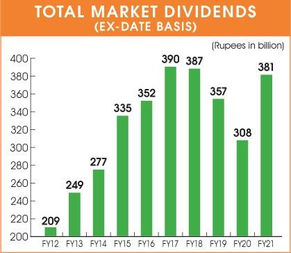

## Table of Contents

## What are dividend stocks and why are they important for investors?

Dividend stocks are shares in a company that regularly pay out a portion of their profits to shareholders. These payments, called dividends, are usually given out every three months, but some companies might pay them yearly or even monthly. When you own dividend stocks, you get these payments just for holding onto the stock, which can be a nice extra income.

Dividend stocks are important for investors because they can provide a steady income stream. This is especially helpful for people who are retired or need regular money coming in. Also, dividend stocks can make your investment grow over time. When companies pay dividends, they often increase the amount over the years, which means your income from the stock can go up too. Plus, if you reinvest the dividends by buying more shares, your investment can grow even faster.

## How does the Pakistani stock market work and what role do dividend stocks play in it?

The Pakistani stock market, also known as the Pakistan Stock Exchange (PSX), is where people buy and sell shares of companies. It's like a big store where instead of buying things like clothes or food, you buy pieces of businesses. When you buy a share, you own a tiny part of that company. The price of these shares can go up or down depending on how well the company is doing and what people think about it. The PSX helps companies raise money by selling shares to the public, and it gives people a chance to invest and possibly make money if the share prices go up.

Dividend stocks are important in the Pakistani stock market because they give investors a way to earn money regularly. Many companies in Pakistan pay dividends to their shareholders, usually every year. This means if you own shares in these companies, you get some money back from the profits they make. For people who want a steady income from their investments, dividend stocks can be a good choice. They also make investing in the stock market less risky because even if the share price doesn't go up, you still get the dividend payments. This can be especially helpful for people who need regular money coming in, like retirees.

## What are the key factors to consider when selecting dividend stocks in Pakistan?

When picking dividend stocks in Pakistan, one important thing to look at is the company's history of paying dividends. You want to choose companies that have been paying dividends regularly for a long time. This shows that the company is stable and likely to keep paying dividends in the future. Also, check if the company has been increasing its dividends over the years. A company that raises its dividends means it's doing well and sharing more profits with shareholders.

Another factor to consider is the company's financial health. Look at its earnings and cash flow to make sure it can afford to keep paying dividends. A company with strong earnings and good cash flow is more likely to maintain or even increase its dividends. You should also think about the dividend yield, which is the annual dividend payment divided by the stock's price. A higher yield can be attractive, but be careful because sometimes a high yield can mean the company is in trouble and the stock price has dropped a lot.

Lastly, consider the overall market conditions and the sector the company is in. Some sectors, like utilities or consumer goods, tend to be more stable and pay reliable dividends. It's also good to diversify your investments across different sectors to reduce risk. Keep an eye on economic trends in Pakistan, as they can affect how well companies perform and their ability to pay dividends. By looking at these factors, you can make smarter choices about which dividend stocks to buy in the Pakistani market.

## Can you list some of the top dividend-paying companies in Pakistan?

Some of the top dividend-paying companies in Pakistan are well-known and have a good track record of sharing profits with their shareholders. Companies like Engro Corporation, which is involved in many different businesses like fertilizers and food, often pay good dividends. Another company is Pakistan Petroleum Limited (PPL), which is in the oil and gas sector and has been paying steady dividends for a long time. These companies are popular among investors looking for regular income because they have strong financial health and a history of paying dividends.

Another company to consider is Habib Bank Limited (HBL), one of the biggest banks in Pakistan. Banks like HBL usually pay good dividends because they make money from interest on loans and other services. Then there's Fauji Fertilizer Company, which is in the fertilizer business and has been known for its high dividend payouts. These companies are favorites among investors because they not only pay dividends regularly but also tend to increase them over time, which means more money for shareholders.

## How do dividend yields in Pakistan compare to other investment options?

Dividend yields in Pakistan can be quite attractive compared to other investment options like savings accounts or government bonds. For example, while a savings account in Pakistan might give you an interest rate of around 5% to 7%, many top dividend-paying companies can offer yields that are higher, sometimes reaching up to 10% or more. This means if you invest in these companies, you could get more money back regularly than if you just kept your money in a bank.

However, it's important to remember that investing in stocks, including dividend stocks, comes with more risk than safer options like savings accounts or bonds. The stock market can go up and down, and the price of your shares might drop. But if you're okay with taking some risk and you want to earn more money over time, dividend stocks in Pakistan can be a good choice. They not only give you regular income but also the chance for your investment to grow if the company does well.

## What are the tax implications of investing in dividend stocks in Pakistan?

When you invest in dividend stocks in Pakistan, you need to know about the taxes you'll have to pay on the money you get from dividends. The government takes a 15% tax on dividends, which means if you get 100 rupees in dividends, you'll have to pay 15 rupees in taxes. This tax is taken out before you even get the dividend, so you don't have to worry about paying it later. It's called a withholding tax, and it's the same for everyone, no matter how much money you make.

Besides the tax on dividends, if you sell your stocks and make a profit, you might have to pay capital gains tax. This tax is 15% on the profit you make from selling your stocks if you've held them for less than a year. If you hold the stocks for more than a year, you don't have to pay this tax. So, if you're thinking about selling your stocks, it's good to keep these tax rules in mind to understand how much money you'll actually keep after taxes.

## How has the performance of dividend stocks in Pakistan been over the past decade?

Over the past ten years, dividend stocks in Pakistan have done pretty well. Many big companies like Engro Corporation and Pakistan Petroleum Limited have been paying good dividends regularly. These companies have been able to keep their dividends steady or even increase them, which is great for investors looking for a steady income. The Pakistani stock market has seen its ups and downs, but these companies have stayed strong and continued to share their profits with shareholders.

However, there have been some challenges too. The economy in Pakistan has faced some tough times, which can affect how well companies do and how much they can pay in dividends. Sometimes, political and economic uncertainty can make the stock market go down, which can impact the value of your investments. But overall, if you look at the long run, many dividend stocks in Pakistan have given investors a good return, both from the dividends and from the growth in the price of the stocks.

## What are the risks associated with investing in dividend stocks in Pakistan?

Investing in dividend stocks in Pakistan comes with some risks. One big risk is that the stock market can go up and down a lot. If the market goes down, the price of your stocks can drop, and you might lose money. Also, if a company doesn't do well, it might cut or stop paying dividends. This can be a problem if you were counting on that money for your regular income. Another risk is that the economy in Pakistan can be a bit unstable at times. If the economy gets worse, companies might struggle to make profits, which means they might not be able to pay dividends like they used to.

Another thing to think about is the political situation in Pakistan. Sometimes, changes in the government or new laws can affect how companies do business and how much profit they make. This can make the stock market more risky. Also, there's always the chance that a company might run into financial trouble. If that happens, not only might they stop paying dividends, but the value of their stocks could also fall a lot. So, while dividend stocks can be a good way to earn money, it's important to be aware of these risks and maybe spread your money across different types of investments to be safer.

## How can investors diversify their portfolio using dividend stocks in Pakistan?

To diversify their portfolio using dividend stocks in Pakistan, investors can start by choosing stocks from different sectors. Instead of putting all their money into one type of business, like banking or oil, they can spread it across different areas like food, energy, and telecom. This way, if one sector has a tough time, the others might still do well and keep paying dividends. For example, an investor could buy shares in Engro Corporation for food and fertilizers, Pakistan Petroleum Limited for oil and gas, and Habib Bank Limited for banking. This mix helps balance out the risks and can lead to more stable income.

Another way to diversify is by looking at the size of the companies. Big companies like Fauji Fertilizer might pay steady dividends, but smaller companies could offer higher yields and the chance for the stock price to grow more. By mixing large, stable companies with smaller, growing ones, investors can have both safety and the chance for bigger gains. It's also smart to keep an eye on how the economy is doing and adjust the portfolio. If the economy looks shaky, maybe put more money into the safer, bigger companies. If things are looking good, you might want to try some smaller companies with higher potential.

## What are the best strategies for long-term investment in Pakistani dividend stocks?

For long-term investment in Pakistani dividend stocks, one good strategy is to focus on companies with a strong history of paying dividends. Look for companies like Engro Corporation or Pakistan Petroleum Limited that have been paying dividends for many years and have even increased them over time. This shows that the company is doing well and is likely to keep paying dividends in the future. Another important thing is to check the company's financial health. Make sure it's making good profits and has enough cash to keep paying dividends. This way, you can feel more confident that your investment will keep giving you money over the long run.

Another strategy is to diversify your investments across different sectors and company sizes. Instead of putting all your money into one type of business, like banking, try to spread it out. You could invest in companies from different sectors like food, energy, and telecom. This helps balance the risks because if one sector has a tough time, the others might still do well and keep paying dividends. Also, consider mixing big, stable companies with smaller, growing ones. Big companies might give you steady dividends, while smaller ones could offer higher yields and the chance for the stock price to grow more. By keeping your investments spread out, you can have both safety and the chance for bigger gains over the long term.

## How do macroeconomic factors influence dividend stocks in Pakistan?

Macroeconomic factors like inflation, interest rates, and economic growth can really affect dividend stocks in Pakistan. When inflation goes up, the value of money goes down, which can make it harder for companies to keep paying the same amount of dividends. If interest rates go up, people might choose to put their money in banks instead of stocks because they can get a good return with less risk. Also, if the economy is growing, companies usually make more money and can pay bigger dividends. But if the economy slows down, companies might struggle and have to cut their dividends.

Another important factor is the political situation in Pakistan. If there's a lot of uncertainty or changes in government, it can make the stock market go up and down a lot. This can scare investors and make stock prices drop, which can hurt the value of dividend stocks. Also, if the government changes laws or taxes, it can affect how much money companies have left to pay dividends. So, it's good for investors to keep an eye on these big economic and political changes because they can really impact how well their dividend stocks do over time.

## What advanced analytical tools can be used to evaluate the potential of dividend stocks in Pakistan?

To evaluate the potential of dividend stocks in Pakistan, investors can use advanced tools like financial ratios and stock screeners. Financial ratios such as the dividend payout ratio, which shows how much of a company's earnings are paid out as dividends, can help you see if a company can keep paying dividends. Another useful ratio is the dividend yield, which tells you how much money you get back from your investment in dividends each year. Stock screeners are tools that let you filter stocks based on specific criteria like dividend yield or payout ratio. This helps you find the best dividend stocks quickly without having to look through every company one by one.

Another tool to consider is fundamental analysis software, which can give you detailed information about a company's financial health. This software can help you look at things like the company's earnings, cash flow, and debt levels. By understanding these numbers, you can better predict if a company will be able to keep paying dividends in the future. Technical analysis tools are also helpful because they can show you patterns in stock prices and help you decide when to buy or sell. These tools can make it easier to spot trends and make smarter investment choices. By using these advanced analytical tools, investors can get a clearer picture of which dividend stocks in Pakistan have the most potential.

## What is the understanding of dividend stocks?

Dividends represent a portion of a company's earnings that is distributed to shareholders, typically on a regular basis, such as quarterly or annually. This distribution serves as a direct source of income for investors, in addition to the potential for capital appreciation of the stock itself. The primary advantage of investing in dividend stocks is the dual benefit of [earning](/wiki/earning-announcement) consistent income while also participating in the stock’s long-term value growth.

Companies that offer significant dividend yields are usually well-established entities with a track record of stable earnings performance. These companies are often in mature industries where growth is steady but less aggressive, allowing for a portion of profits to be returned to shareholders. A strong dividend yield indicates that the company is generating sufficient profits and is financially robust enough to share those profits with investors.

When assessing dividend stocks, several key metrics and fundamental attributes should be evaluated to ensure a sound investment. First, the dividend yield, which is calculated as the annual dividends paid per share divided by the share price, provides a direct measure of the income generated from the investment:

$$
\text{Dividend Yield} = \frac{\text{Annual Dividends per Share}}{\text{Share Price}}
$$

A higher dividend yield might initially seem attractive, but it is essential to consider whether the yield is sustainable. This is where understanding the fundamentals becomes critical. The payout ratio, which is the proportion of earnings paid out as dividends to shareholders, serves as another important indicator. It reveals a company's ability to maintain its dividend payments and invest in further growth:

$$
\text{Payout Ratio} = \frac{\text{Dividends per Share}}{\text{Earnings per Share}}
$$

A payout ratio that is too high could suggest that a company is giving away a substantial portion of its earnings, which might not be sustainable in the long run, especially if the company encounters financial headwinds.

Furthermore, examining a company's earnings history, debt levels, industry position, and overall financial health is crucial for making informed decisions. Companies with a consistent track record of earnings and revenue growth are often in stronger positions to sustain and potentially increase dividend payments. As a result, investing in such companies reduces the risk of income fluctuation and enhances long-term investment stability.

## How can one identify the best dividend stocks in Pakistan?

Pakistan offers a promising landscape for dividend investors, with various sectors providing notable dividend yields. Notably, the utilities, finance, and energy sectors are prominent contributors to high dividend returns in the region. Within these sectors, several companies stand out for their robust dividend portfolios, including HUB Power Company, Kot Addu Power Company, and MCB Bank. These companies have historically provided attractive dividend yields, making them appealing to income-focused investors.

### Key Sectors and Companies

1. **Utilities**: The utilities sector is renowned for its stable earnings and consistent dividend payments. Companies like HUB Power Company and Kot Addu Power Company exemplify this stability. These firms benefit from regulated revenue streams and long-term power purchase agreements, which enable them to offer reliable dividends to their shareholders.

2. **Finance**: The financial sector, particularly commercial banks, also offers substantial dividend opportunities. MCB Bank, one of the leading banks in Pakistan, is known for its strong financial performance and regular dividend payouts. Banks typically have the advantage of capitalizing on economic growth and rising interest rates, which boosts their profitability and capacity to pay dividends.

3. **Energy**: The energy sector, encompassing both oil and gas, is another significant source of dividend income in Pakistan. The reliance on energy resources ensures that well-established companies in this sector can distribute a portion of their profits back to shareholders.

### Factors to Consider When Selecting Dividend Stocks

When assessing the potential of dividend stocks, investors should take into account several key factors:

- **Dividend Yield**: This is a crucial indicator of the income generated relative to the stock's price. It is calculated as:
$$
  \text{Dividend Yield} = \left( \frac{\text{Annual Dividend per Share}}{\text{Price per Share}} \right) \times 100

$$

  A high dividend yield may suggest attractive income prospects but can also signal potential underlying issues if unsustainable.

- **Payout Ratio**: This metric denotes the proportion of earnings a company distributes as dividends. Calculated by:
$$
  \text{Payout Ratio} = \left( \frac{\text{Dividends per Share}}{\text{Earnings per Share}} \right) \times 100

$$

  A company with a moderate payout ratio is generally preferable, as it indicates a balance between rewarding shareholders and retaining earnings for growth.

- **Company Stability**: A thorough evaluation of a company's financial health, operational efficiency, and market position is essential. Stable companies with a track record of steady earnings are more likely to sustain dividend payments through varying economic cycles.

By focusing on these sectors and carefully evaluating these factors, investors can identify compelling dividend investment opportunities in Pakistan, enhancing their portfolios with the potential for attractive long-term returns.

## References & Further Reading

[1]: Bergstra, J., Bardenet, R., Bengio, Y., & Kégl, B. (2011). ["Algorithms for Hyper-Parameter Optimization."](https://papers.nips.cc/paper/4443-algorithms-for-hyper-parameter-optimization) Advances in Neural Information Processing Systems 24.

[2]: ["Advances in Financial Machine Learning"](https://www.amazon.com/Advances-Financial-Machine-Learning-Marcos/dp/1119482089) by Marcos Lopez de Prado

[3]: ["Evidence-Based Technical Analysis: Applying the Scientific Method and Statistical Inference to Trading Signals"](https://www.amazon.com/Evidence-Based-Technical-Analysis-Scientific-Statistical/dp/0470008741) by David Aronson

[4]: ["Machine Learning for Algorithmic Trading"](https://github.com/PacktPublishing/Machine-Learning-for-Algorithmic-Trading-Second-Edition) by Stefan Jansen

[5]: ["Quantitative Trading: How to Build Your Own Algorithmic Trading Business"](https://books.google.com/books/about/Quantitative_Trading.html?id=j70yEAAAQBAJ) by Ernest P. Chan