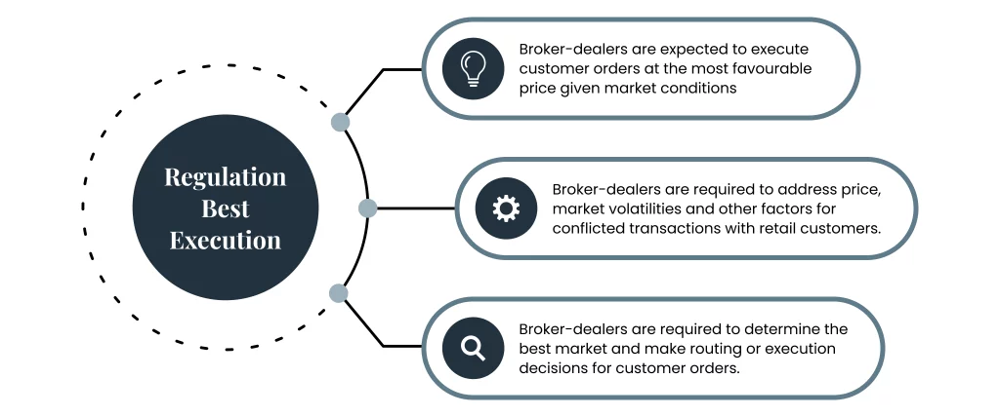

## Table of Contents

## What is the Best Execution Rule?

The Best Execution Rule is a regulation that requires brokers to do their best to get the best price for their clients when buying or selling stocks or other investments. This means that brokers must look at different places where they can trade and choose the one that gives the best deal for their client. It's all about making sure that clients get the most value from their trades.

This rule is important because it helps protect investors. It makes sure that brokers are working hard to get the best possible price, rather than just choosing the easiest or quickest option. By following the Best Execution Rule, brokers show that they are putting their clients' interests first, which builds trust and fairness in the financial markets.

## Why was the Best Execution Rule established?

The Best Execution Rule was established to make sure that when people buy or sell stocks, their brokers do everything they can to get the best price. Before this rule, brokers might have chosen the easiest or quickest place to trade, even if it didn't give the client the best deal. This rule helps protect investors by making sure that their brokers are always trying to find the best price, which is really important for getting the most value out of their investments.

By having this rule, it also makes the whole financial market more fair and trustworthy. When investors know that their brokers are working hard to get them the best price, they feel more confident about investing. This rule encourages brokers to put their clients' interests first, which helps build a stronger and more honest relationship between brokers and their clients.

## Who does the Best Execution Rule apply to?

The Best Execution Rule applies to brokers and dealers who handle trades for their clients. This means that if you have a broker who buys or sells stocks for you, they have to follow this rule. It doesn't matter if you're a big investor or a small one; the rule is there to make sure everyone gets treated fairly.

The rule is important for all kinds of investments, like stocks, bonds, and other financial products. Whenever a broker makes a trade for a client, they need to check different places where they can do the trade and pick the one that gives the best price. This helps make sure that clients get the best value for their money.

## What are the key components of the Best Execution Rule?

The Best Execution Rule is all about making sure that when brokers buy or sell things like stocks for their clients, they try their best to get the best price. This means that brokers need to look at different places where they can make the trade and choose the one that gives the best deal. It's not just about [picking](/wiki/asset-class-picking) the easiest or quickest option; it's about finding the place that will give the client the most value for their money.

This rule is important because it helps protect people who invest their money. When brokers follow this rule, they show that they care about getting the best price for their clients, not just doing what's easiest for them. This builds trust between brokers and their clients, and it makes the whole financial market fairer and more honest. Everyone, from big investors to small ones, benefits from knowing that their brokers are working hard to get them the best possible deal.

## How do financial institutions comply with the Best Execution Rule?

Financial institutions comply with the Best Execution Rule by always trying to find the best price for their clients when they buy or sell investments like stocks. They do this by checking different places where they can make the trade and choosing the one that gives the best deal. This means they need to look at things like the price, how fast the trade can happen, and any extra costs. By doing all this, they make sure they are doing their best to get the best value for their clients' money.

To make sure they are following the rule, financial institutions also keep records of all the trades they make. They write down where they made the trade, why they chose that place, and how it helped their client get the best price. This helps them show that they are trying their best to follow the Best Execution Rule. It's all about being fair and honest with their clients and making sure everyone gets treated the same way.

## What are the common challenges in achieving best execution?

Achieving best execution can be tough for brokers because there are so many things to think about. They need to look at different places to trade and pick the one that gives the best price, but it's not just about the price. They also have to think about how fast the trade can happen, any extra costs, and how easy it is to do the trade. Sometimes, the best price might be at a place that takes longer to trade or has higher fees, so brokers have to balance all these things to find the best deal for their clients.

Another challenge is that the markets are always changing. Prices can go up and down really quickly, and what was the best price a few minutes ago might not be the best price now. Brokers need to keep an eye on these changes and be ready to act fast. Plus, they have to deal with different rules and ways of doing things at different trading places, which can make it harder to find the best deal. It's a lot of work to make sure they are always trying their best to get the best price for their clients.

## Can you explain the difference between best execution and best price?

Best execution and best price are related but different ideas. Best price is just about getting the lowest price when you buy something or the highest price when you sell something. It's all about the number you see on the price tag. If you're buying a stock, you want the cheapest price; if you're selling, you want the highest price you can get.

But best execution looks at more than just the price. It's about getting the best overall deal for the client. This means brokers need to think about things like how fast the trade can happen, any extra costs that might come up, and how easy it is to do the trade. Sometimes, the place with the best price might take longer to trade or have higher fees, so brokers have to balance all these things to make sure they are getting the best overall deal for their clients.

## How is best execution monitored and enforced by regulatory bodies?

Regulatory bodies keep an eye on best execution by checking if brokers are doing what they're supposed to do. They look at the records that brokers keep of their trades to see if they are trying their best to get the best price for their clients. They also check if brokers are looking at different places to trade and picking the one that gives the best overall deal. If they find that a broker isn't following the rules, they can take action to make things right.

Enforcement can include fines, warnings, or even taking away a broker's license if they keep breaking the rules. Regulatory bodies want to make sure that everyone is treated fairly and that clients are getting the best value for their money. By keeping a close watch on how brokers do their trades, these bodies help make the financial markets more honest and trustworthy for everyone.

## What role does technology play in ensuring best execution?

Technology plays a big role in helping brokers make sure they are doing their best to get the best price for their clients. Computers and special software can look at lots of different places where trades can happen really fast. They can see prices changing and pick the best place to trade in just a few seconds. This helps brokers find the best deal without having to do all the work by hand, which can take a lot of time.

Also, technology helps keep track of all the trades and makes sure everything is done the right way. There are systems that record every trade, where it happened, and why it was chosen. This makes it easier for brokers to show they are following the rules and for regulators to check if they are doing things right. Using technology makes the whole process faster, more accurate, and easier to keep an eye on.

## How do different types of orders affect the application of the Best Execution Rule?

Different types of orders can change how brokers apply the Best Execution Rule. For example, a market order tells the broker to buy or sell right away at the current price. With this kind of order, the broker needs to act fast to get the best price at that moment. But a limit order is different. It tells the broker to buy or sell only if the price reaches a certain level. This means the broker has to wait for the right price, which can take longer but might get a better deal for the client.

Another type of order is a stop order, which turns into a market order once the stock reaches a certain price. This can be tricky because the broker needs to watch the price and then act quickly when it hits the stop price. Each type of order makes the broker think about different things like speed, price, and timing. No matter the order type, the broker still has to do their best to get the best overall deal for the client, even if it means balancing different factors.

## What are the international variations of the Best Execution Rule?

The Best Execution Rule is not just a rule in one country; it has different versions around the world. In the United States, the rule is set by the Securities and Exchange Commission (SEC) and says that brokers must try their best to get the best price for their clients. In Europe, the Markets in Financial Instruments Directive (MiFID II) has its own version of the rule. It asks brokers to look at more things than just price, like how fast the trade happens and how much it costs.

In Australia, the Australian Securities and Investments Commission (ASIC) also has rules about best execution. They want brokers to think about things like the price, how easy it is to trade, and any extra costs. In Canada, the Investment Industry Regulatory Organization of Canada (IIROC) sets rules that are similar to the U.S. but might have some small differences. Even though the rules are different in each place, they all want the same thing: to make sure brokers are doing their best to get the best deal for their clients.

## How can firms demonstrate that they have achieved best execution?

Firms can show they have achieved best execution by keeping good records of all their trades. They need to write down where they made the trade, why they chose that place, and how it helped their client get the best price. This helps them prove that they looked at different places to trade and picked the one that gave the best overall deal. By having these records, firms can show that they are following the rules and trying their best to get the best value for their clients' money.

Another way firms can demonstrate best execution is by using technology to help them make trades. Special software can look at lots of different places to trade very quickly and pick the best one. This helps firms act fast and make sure they are getting the best price at that moment. By using technology, firms can also keep track of all their trades easily and show that they are doing everything they can to follow the Best Execution Rule.

## References & Further Reading

[1]: Bergstra, J., Bardenet, R., Bengio, Y., & Kégl, B. (2011). ["Algorithms for Hyper-Parameter Optimization."](https://papers.nips.cc/paper/4443-algorithms-for-hyper-parameter-optimization) Advances in Neural Information Processing Systems 24.

[2]: ["Advances in Financial Machine Learning"](https://www.amazon.com/Advances-Financial-Machine-Learning-Marcos/dp/1119482089) by Marcos Lopez de Prado

[3]: ["Evidence-Based Technical Analysis: Applying the Scientific Method and Statistical Inference to Trading Signals"](https://www.amazon.com/Evidence-Based-Technical-Analysis-Scientific-Statistical/dp/0470008741) by David Aronson

[4]: ["Machine Learning for Algorithmic Trading"](https://github.com/stefan-jansen/machine-learning-for-trading) by Stefan Jansen

[5]: ["Quantitative Trading: How to Build Your Own Algorithmic Trading Business"](https://www.amazon.com/Quantitative-Trading-Build-Algorithmic-Business/dp/1119800064) by Ernest P. Chan