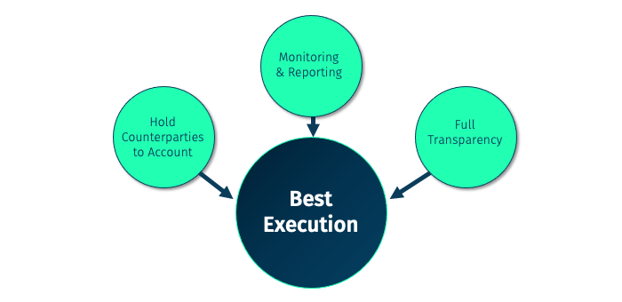

Best execution is a fundamental obligation for investment services firms, including brokerage houses, to manage and execute client orders efficiently. This responsibility extends beyond merely fulfilling a transaction; it demands a comprehensive consideration of various critical factors. Price opportunity, which involves obtaining the best possible price for a trade, is central to best execution. This encompasses the assessment of prevailing market prices and the potential for price improvement.

Execution likelihood is another pivotal factor, referring to the probability of completing an order in its entirety. Crucially, this involves choosing venues or trading strategies that enhance the odds of executing the total order without partial fills, which could adversely impact trading results. Speed is similarly vital; timely execution can prevent unwanted influences from market volatility, particularly in dynamic environments where prices can shift rapidly.



The principles of best execution have significantly evolved over time, primarily because of regulatory developments. In the United States and Europe, such changes have introduced more explicit guidelines and frameworks. In the U.S., the introduction of Regulation NMS emphasized ensuring investors receive the best national prices by enhancing market competition. Similarly, in Europe, the Markets in Financial Instruments Directive (MiFID) provided a structured approach defining vital elements like price, costs, and execution speed more clearly.

Algorithmic trading, a modern development in the financial markets, has further refined the application of best execution. Algorithmic trading involves using advanced algorithms and strategies to automate trading processes, which necessitates precise adherence to best execution mandates considering these evolved regulations. This evolution requires investment services firms to remain constantly aware of both regulatory requirements and technological advancements to discharge their obligations effectively.

## Table of Contents

## Historical Context of Best Execution

In 1975, the U.S. Congress made significant strides in securities regulation by enacting the Securities Acts Amendments. Among its critical innovations was laying the groundwork for a more connected and transparent trading ecosystem. This legislative movement led to the establishment of the National Market System (NMS), which would evolve substantially over subsequent decades.

Fast forward to 2005, and we observe one of the critical responses to these initial legislative efforts: the implementation of Regulation NMS by the U.S. Securities and Exchange Commission (SEC). Regulation NMS was designed to ensure that investors received the best National Best Bid and Offer (NBBO) by promoting competition among trading venues. By encouraging market participants to find and achieve the best available price, Regulation NMS aimed to enhance overall market efficiency and fairness. The NBBO represents the highest bid price and the lowest ask price available across all exchanges, serving as a pivotal benchmark for best execution. For instance, if an investor placed a trade order, the execution of that order would need to adhere to the prevailing NBBO to be deemed compliant under these regulations.

At around the same time, Europe made notable advances with the introduction of the Markets in Financial Instruments Directive (MiFID) in 2004, which took effect in 2007. MiFID and its successor, MiFID II, implemented in 2014, set ambitious goals to delineate clearly for investors and firms what comprises 'best execution.' Unlike the U.S. system, which prominently focuses on price, Europe's MiFID framework emphasized a multifaceted approach. It outlined that best execution should consider a range of [factor](/wiki/factor-investing)s, including price, costs, speed, likelihood of execution, and settlement. These directives aimed to enhance transparency and bolster investor protection by requiring firms to provide detailed reports on how they achieve best execution for their clients' trades.

Both the U.S. and European regulatory developments underscore the emphasis on ensuring fair, transparent, and competitive trading landscapes, evolving the concept of best execution to consider a broader spectrum of factors and enhance investor confidence in trading practices.

## Benchmarks for Determining 'Best' Execution

Benchmarks play a crucial role in evaluating execution quality, helping to determine whether traders and brokers are meeting their best execution obligations. Among the most widely used are the Arrival Price, Volume Weighted Average Price (VWAP), and Time Weighted Average Price (TWAP).

The Arrival Price is a pre-trade benchmark that reflects the market price of a security at the moment an order is received for execution. It serves as an intuitive guide for traders to gauge execution quality by assessing the price movement from the order receipt to its completion. However, a major drawback is its susceptibility to market [volatility](/wiki/volatility-trading-strategies). Fluctuations can distort the Arrival Price, making it a less stable benchmark particularly in volatile markets.

In contrast, VWAP and TWAP are post-trade benchmarks that provide stability across different trading environments. VWAP is calculated by dividing the total traded value by the total traded [volume](/wiki/volume-trading-strategy) over a specified period. This benchmark is suited to large trades spread over a timeframe, as it reflects the average price at which a security has traded over the day or during a particular period. The formula for VWAP can be represented as:

$$
\text{VWAP} = \frac{\sum_{i=1}^{n}(P_i \times Q_i)}{\sum_{i=1}^{n} Q_i}
$$

where $P_i$ is the price and $Q_i$ is the quantity of the $i^{th}$ trade.

TWAP, on the other hand, calculates the average price of a security over a specified time interval, dividing the sum of the prices by the number of time intervals. It is particularly useful in distributing trades over time to minimize market impact, especially when executing large orders. It's expressed simply as:

$$
\text{TWAP} = \frac{\sum_{i=1}^{n} P_i}{n}
$$

While VWAP and TWAP offer benefits in terms of stability, they can also present challenges as market conditions evolve. For instance, in highly volatile environments or when trading volumes peak unexpectedly, these benchmarks may not accurately reflect the best possible execution. As such, they require careful consideration and adjustment to align with market realities.

In conclusion, choosing the right benchmark involves understanding the trade characteristics and market conditions. Whether it’s the flexibility offered by the Arrival Price or the stability of VWAP and TWAP, each benchmark has inherent strengths and limitations. Balancing these factors is key to achieving optimal execution and fulfilling best execution obligations.

## Identifying the Best Liquidity Sources

Liquidity in financial markets refers to the ability to execute large orders without causing significant price changes. Identifying the best [liquidity](/wiki/liquidity-risk-premium) sources, or venues, is crucial for optimizing trade execution. These venues include traditional exchanges like the New York Stock Exchange (NYSE), electronic communication networks (ECNs), and dark pools. Each venue offers distinct advantages and challenges determined by several key factors such as price, fees, information leakage risk, and adverse selection.

**Price** is a straightforward factor, as investors often seek venues that can provide the most favorable pricing for their trades. However, the lowest price isn't always the optimal choice because of hidden costs or potential market impacts.

**Fees** are also significant. Exchanges typically charge transaction fees, which can vary depending on trading volume and membership status. ECNs, known for matching buy and sell orders at specified prices, often have different fee structures aimed at attracting higher liquidity levels. On the other hand, dark pools, which operate at lower visibility, might offer competitive fees but pose their own risks.

**Information leakage risk** is the possibility that details about a trading strategy get revealed to the market, potentially leading to unfavorable shifts in prices before trades are completed. Dark pools mitigate this risk by concealing order details from the public. However, they are not immune to leakage, and smaller trades may still involve significant exposure.

**Adverse selection** occurs when a trader unknowingly trades with a more informed counterparty, often at a disadvantage. Liquidity venues like dark pools are sometimes criticized for increasing this risk because traders lack information on counterparties and order intent. However, this risk can be mitigated by sophisticated algorithms that analyze transaction patterns to reduce exposure to better-informed traders.

When evaluating these factors, traders must weigh the relative benefits of each venue carefully. For instance, although dark pools offer decreased market impact due to their opaqueness, participants may face higher adverse selection risks. Conversely, exchanges provide greater transparency but might expose trading strategies, leading to potential information leakage.

Optimal trade execution in this context involves balancing these considerations to identify liquidity venues that align with specific trading objectives while minimizing risks. Ultimately, the capability to assess these factors effectively is essential for successful trading in today's complex and fast-evolving market environment.

## Evaluating Best Execution in Algorithmic Trading

Algorithmic trading requires careful evaluation of several factors to achieve best execution. While price opportunities are often perceived as the primary determinant, true best execution encompasses additional dimensions such as execution speed and execution likelihood.

**Price Opportunities and Beyond**

Misconceptions persist around the idea that achieving the best market price equates to achieving best execution. In reality, relying solely on market price overlooks the critical aspects of how quickly and likely the order is executed, especially in volatile market conditions. For example, obtaining a favorable price is futile if the transaction cannot be completed in due time due to technological or liquidity constraints.

**Strategic Execution Algorithms**

To address the complexities of best execution, various strategic execution algorithms are employed, broadly categorized into static and dynamic models.

- **Static Algorithms**: These algorithms follow a predefined set of rules regardless of market changes. A common static method is the Volume-Weighted Average Price (VWAP) algorithm, which aims to execute orders at prices that reflect the average price over a specific period. VWAP is calculated as follows:
$$
  \text{VWAP} = \frac{\sum (\text{Price}_i \times \text{Volume}_i)}{\sum \text{Volume}_i}

$$

  where $\text{Price}_i$ and $\text{Volume}_i$ represent the price and volume of each trade.

- **Dynamic Algorithms**: Unlike static algorithms, dynamic counterparts adjust their strategies based on real-time market data and conditions. They are crucial for adapting to market volatility and liquidity shifts. An example is the Implementation Shortfall algorithm, which aims to minimize the cost of trading by balancing the market impact and timing risk.

Using Python, traders can simulate these algorithms to test their effectiveness under specific scenarios. For instance, a simple VWAP strategy could be implemented and validated using historical price and volume data, allowing for performance assessment and potential adjustments.

```python
def calculate_vwap(prices, volumes):
    total_dollar_volume = sum(p * v for p, v in zip(prices, volumes))
    total_volume = sum(volumes)
    return total_dollar_volume / total_volume if total_volume else 0

# Example data
prices = [100, 102, 101, 103]
volumes = [200, 180, 220, 160]

vwap = calculate_vwap(prices, volumes)
print(f"Calculated VWAP: {vwap}")
```

Algorithmic trading's evolution has been marked by continuous advancements in technology, highlighting the necessity for sophisticated models capable of assessing more than just market prices. Successful strategies encompass the balance of multiple parameters, ensuring orders are executed efficiently and in line with the best execution standards. Therefore, understanding and leveraging both static and dynamic algorithms become vital in navigating the intricate world of trading today.

## Regulatory Impact and Future Considerations

Regulatory focus on best execution has significantly influenced the trading landscape, particularly contributing to the growth of high-frequency trading ([HFT](/wiki/high-frequency-trading-strategies)). The stringent requirements to ensure that investors receive the best possible execution have pushed trading firms toward using advanced algorithms and sophisticated trading models. This environment fosters a competitive edge for those who can leverage speed and technology, thus favoring HFT practices where milliseconds can impact profitability.

As technology advances, future regulations may need to adapt to encompass new facets such as [machine learning](/wiki/machine-learning), [artificial intelligence](/wiki/ai-artificial-intelligence), and blockchain technology. These innovations can alter market dynamics, create new forms of trading, and potentially raise new regulatory challenges. Ensuring data accessibility and transparency will remain vital as these technological tools become mainstream. This might involve developing policies to govern the ethical use of algorithms and the handling of massive amounts of data generated by trading activities.

Ongoing assessments and refinements within regulatory frameworks are expected to continually impact best execution practices. Regulators will need to balance fostering innovation and maintaining market integrity, ensuring a level playing field for all market participants. This could result in periodic updates to existing laws or the introduction of new guidelines that address emerging risks associated with technological advancements and new trading strategies.

As such, firms must be vigilant, continually reviewing their internal processes and execution strategies in response to evolving regulations. Staying informed and adaptable will be crucial in meeting fiduciary duties while leveraging technological advancements for optimal trading outcomes.

## Conclusion

Best execution is a pivotal element in [algorithmic trading](/wiki/algorithmic-trading), significantly shaped by benchmarks, liquidity sources, and regulatory frameworks. For investment services firms, navigating this complex landscape requires a strategic approach to satisfy their fiduciary responsibilities to clients. Key performance indicators like Arrival Price, VWAP, and TWAP serve as essential tools in assessing execution quality and aligning with best execution standards.

Moreover, the identification and engagement with optimal liquidity sources—be it traditional exchanges, electronic communication networks, or dark pools—play a vital role in minimizing risks such as information leakage and adverse selection. The ever-evolving regulatory environment demands that firms remain vigilant, ensuring compliance with current regulations while anticipating future legislative shifts that might influence trading practices.

As trading environments continue to shift due to technological advancements and market dynamics, investment firms must foster adaptability and a proactive mindset. Leveraging advanced strategic execution algorithms allows firms to optimize trading outcomes, balancing execution speed, price opportunities, and the likelihood of order fulfillment.

Ultimately, maintaining an informed perspective and agile operations is critical for firms striving to achieve effective best execution. By continuously assessing industry developments and adopting innovative practices, investment services firms can effectively meet client expectations and regulatory demands in an ever-competitive market landscape.

## References & Further Reading

[1]: Harris, L. (2003). ["Trading and Exchanges: Market Microstructure for Practitioners."](https://www.amazon.com/Trading-Exchanges-Market-Microstructure-Practitioners/dp/0195144708) Oxford University Press.

[2]: O'Hara, M. (2015). ["High-Frequency Trading: The Good, the Bad, and the Regulation."](https://www.sciencedirect.com/science/article/pii/S0304405X15000045) Financial Analysts Journal, 70(3).

[3]: Gomber, P., Arndt, B., Lutat, M., & Uhle, T. (2011). ["High-Frequency Trading."](https://papers.ssrn.com/sol3/papers.cfm?abstract_id=1858626) SpringerLink.

[4]: Hasbrouck, J. (2007). ["Empirical Market Microstructure: The Institutions, Economics, and Econometrics of Securities Trading."](https://academic.oup.com/book/52241) Oxford University Press.

[5]: Malkiel, B. G. (2016). ["A Random Walk Down Wall Street: The Time-tested Strategy for Successful Investing."](https://www.amazon.com/Random-Walk-Down-Wall-Street/dp/0393358380) W. W. Norton & Company.

[6]: SEC. (2005). ["Regulation NMS."](https://www.sec.gov/rules-regulations/2005/06/regulation-nms) U.S. Securities and Exchange Commission.

[7]: European Union. (2004). ["Markets in Financial Instruments Directive (MiFID)."](https://eur-lex.europa.eu/legal-content/EN/TXT/?uri=CELEX%3A32004L0039) Official Journal of the European Union.

[8]: Pardo, R. (2008). ["The Evaluation and Optimization of Trading Strategies."](https://onlinelibrary.wiley.com/doi/book/10.1002/9781119196969) Wiley Trading.