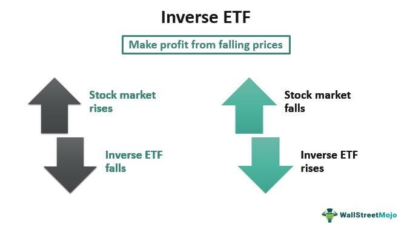

Inverse Exchange-Traded Funds (ETFs) offer a compelling approach for traders seeking to capitalize on bearish market conditions. These financial instruments are designed to move in the opposite direction of a corresponding benchmark index, allowing investors to potentially profit when markets decline. As an essential tool in an investor's arsenal, inverse ETFs present a unique mechanism that leverages downward market movements for returns. 

Incorporating inverse ETFs into algorithmic trading strategies opens the possibility for enhanced returns through automated, systematic approaches. These strategies involve using algorithms to execute trades based on predefined criteria, which can efficiently manage the complexities and nuances of inverse ETF trading. The integration of inverse ETFs within algorithmic frameworks can benefit traders looking to diversify their portfolio and execute trades with precision and speed.



Algorithmic trading with inverse ETFs requires careful consideration of various factors, including market conditions, liquidity, volatilities, and trading costs. The merit of these trades lies not only in their ability to hedge against downturns but also in their capacity to generate returns during bear markets. However, like all investment vehicles, inverse ETFs come with their own set of risks—primarily stemming from their inherent volatility and potential for amplified losses.

A significant aspect of employing inverse ETFs in trading strategies is the necessity of continuous risk assessment and management. Traders must remain vigilant about market signals and economic indicators, ensuring that they fine-tune their strategies to mitigate risks and optimize performance. Additionally, the ability to backtest strategies is crucial, as it provides insights into how a particular approach might perform based on historical data. Backtesting helps traders validate the effectiveness of their algorithms, making data-driven decisions that enhance trading outcomes.

In summary, inverse ETFs offer intriguing possibilities for investors aiming to profit from declining market conditions. By incorporating these instruments into algorithmic trading strategies, traders can strategically leverage market downturns, provided they remain informed and diligent about the associated risks and conduct thorough backtesting to validate their trading plans.

## Table of Contents

## Understanding Inverse ETFs

Inverse Exchange-Traded Funds (ETFs) are specialized financial instruments crafted to provide returns that are the inverse of a specific index or sector. These instruments are engineered to capitalize on downward market movements, thus offering an opportunity for traders and investors to profit during market declines. They achieve this by utilizing derivative instruments such as swaps and futures contracts, which allow them to effectively short-sell the underlying assets of the index they aim to track inversely.

The primary utility of inverse ETFs lies in their ability to serve as a hedging tool. Investors looking to protect their portfolios against potential downturns can use inverse ETFs to offset losses in other areas during market slumps. For example, if an investor holds a portfolio heavily weighted in technology stocks and forecasts a sector decline, they might invest in an inverse [ETF](/wiki/etf-trading-strategies) that targets a technology index. The gains from the inverse ETF could counterbalance some or all of the losses from the traditional long positions in technology stocks.

Inverse ETFs are structured to reset daily. This daily reset aims to achieve the inverse return of the benchmark index for that day, making them particularly suited for short-term trading strategies. However, this same feature introduces complexities for long-term investors due to the effects of compounding. Over longer periods, even if the benchmark index declines steadily, the returns on an inverse ETF might not mirror the inverse of the accumulated losses due to daily resets and compounding effects.

To illustrate how inverse ETFs operate during market downturns, consider the S&P 500 index. If the S&P 500 declines by 1% in a day, an inverse ETF designed to track this index could potentially increase by roughly 1% on that same day. This inverse relationship enables traders with a bearish outlook to profit from declines without the necessity to engage in complex short-selling strategies themselves.

While inverse ETFs present attractive opportunities during declining markets, they also [carry](/wiki/carry-trading) significant risks. Their design to reset daily means that their performance can diverge significantly from expectations over extended periods, especially in volatile markets. Traders and investors must carefully monitor their holdings and adjust their strategies as needed to mitigate risks associated with these instruments.

## Leveraged Inverse ETFs: Pros and Cons

Leveraged inverse exchange-traded funds (ETFs) are designed to provide amplified returns by using financial derivatives and debt to achieve a multiple of the opposite return of a given index. These financial instruments aim to enhance potential profits from declining markets, but they also introduce a heightened level of risk.

### Advantages of Leveraged Inverse ETFs

1. **Amplified Returns**: Leveraged inverse ETFs are engineered to offer returns that are a multiple of the inverse of the targeted index's daily performance. For example, a two-times (2x) leveraged inverse ETF seeks to deliver twice the inverse daily return of its benchmark index. This structure allows traders to potentially achieve significant gains during market downturns.

2. **Short-term Hedging**: These ETFs can serve as an effective short-term hedging tool for investors looking to protect their portfolios against imminent market losses. By gaining from an index's falling performance, investors can offset losses in other portfolio components.

3. **Liquidity**: Leveraged inverse ETFs tend to have high liquidity, allowing for easy entry and exit, which is beneficial for traders aiming to exploit short-term market movements.

### Risks of Leveraged Inverse ETFs

1. **Volatility Decay**: One of the significant risks associated with leveraged inverse ETFs is volatility decay. Due to their structure, these ETFs reset daily, which means that compounding can lead to significant performance deviations from the expected multiple over longer periods, especially in volatile markets. This is known as the “volatility drag” effect.

2. **Market Timing Requirements**: Given their high sensitivity to daily market movements, successful trading with leveraged inverse ETFs necessitates precise market timing. Misjudges in market direction can lead to substantial losses, even over short periods.

3. **Cost**: Leveraged products typically have higher expense ratios than traditional ETFs. The cost of borrowing and derivatives can erode profits, particularly if held over an extended period.

4. **Leverage Risk**: The inherent leverage amplifies not only potential gains but also potential losses. If the market does not move as anticipated, investors can incur large losses in a brief time frame. For example, if a 2x leveraged inverse ETF experiences a 5% market movement against the investor's position, it would result in a 10% loss in the ETF.

### Conclusion

Leveraged inverse ETFs offer both significant opportunities and stark challenges. Their potential for substantial gains is countered by the corresponding risk of equally large losses, particularly given the daily reset feature and the compounding effect. As such, these financial instruments are best suited for experienced traders with a strong understanding of the market, short-term trading skills, and robust risk management strategies. Responsible use requires staying informed about their unique characteristics and employing careful timing and monitoring to mitigate inherent risks.

## Market Trends and Their Impact

Effective inverse ETF strategies require a thorough understanding of market trends, as these financial instruments are designed to yield returns that move in the opposite direction of a benchmark index. A grasp of economic indicators and current news is essential to anticipate and react to market conditions that influence inverse ETF movements.

Economic indicators, such as interest rates, unemployment figures, and GDP growth, significantly impact market sentiment and, consequently, the performance of inverse ETFs. For instance, an increase in interest rates may signal a tightening economic environment, potentially leading to a decline in stock prices and offering an opportunity for inverse ETF profits. Conversely, positive economic news can boost investor confidence and drive market upticks, challenging inverse ETF positions.

News events, both macroeconomic and geopolitical, also play a vital role. Elections, trade negotiations, and unexpected crises can cause rapid market fluctuations. Investors must stay informed about such events, as they can trigger substantial short-term market movements influencing inverse ETF performance.

To predict market shifts and strategically employ inverse ETFs, traders often utilize tools like technical analysis. Technical analysis involves examining statistical trends from historical trading data, including price movements and trading volumes. Popular techniques include trend lines, moving averages, and [momentum](/wiki/momentum) indicators, such as the Relative Strength Index (RSI) and Moving Average Convergence Divergence (MACD). These tools help identify potential entry and [exit](/wiki/exit-strategy) points by highlighting overbought or oversold conditions in the market.

For example, a simple moving average (SMA) is calculated by averaging the closing price of a security over a specified period. It serves to smooth out short-term fluctuations and highlight longer-term trends. In Python, an SMA can be calculated using the `pandas` library:

```python
import pandas as pd

# Assuming df is a DataFrame with a 'Close' column containing closing prices
df['SMA'] = df['Close'].rolling(window=20).mean()
```

By understanding market trends through economic indicators, news events, and technical analysis, traders can more effectively deploy inverse ETFs in their strategies. This informed approach helps anticipate potential market reversals, allowing traders to capitalize on downturns with precision and confidence.

## Selecting the Right Inverse ETF for Your Strategy

Inverse ETFs, designed to produce returns that are inversely proportional to their underlying benchmarks, are powerful instruments in an investor's toolkit, particularly for those seeking to profit from or hedge against declining markets. Selecting the right inverse ETF requires careful consideration of several factors to ensure alignment with one's trading strategy.

### Underlying Index

The choice of an inverse ETF begins with understanding its underlying index. These can range from broad market indices like the S&P 500 to more specific sectors such as technology or energy. The performance of the inverse ETF is linked directly to this index, making its selection critical based on the investor's market outlook. For instance, if an investor anticipates a downturn in the technology sector due to industry-specific headwinds, an inverse ETF that tracks a tech-focused index would be appropriate.

### Fee Structures

Expense ratios, or annual fees expressed as a percentage of the fund's average assets, can vary significantly among inverse ETFs. While these fees may seem small, they can erode returns over time, especially in volatile or prolonged investment periods. An inverse ETF with a notably higher expense ratio might not be justified unless it offers significant advantages in terms of trading strategy alignment or performance.

### Liquidity

Liquidity is a crucial [factor](/wiki/factor-investing) in inverse ETF selection, reflecting how easily the ETF can be bought or sold in the market. Highly liquid ETFs usually have tight bid-ask spreads, minimizing transaction costs. Inverse ETFs with low trading volumes can pose a risk of slippage, where the execution price deviates from the expected price, potentially diminishing returns.

### Volatility

Inverse ETFs are inherently volatile due to their structure, but this [volatility](/wiki/volatility-trading-strategies) varies across different funds. Assessing an ETF's volatility is essential, as it indicates potential price fluctuations. This can be measured by the ETF's beta relative to its benchmark index, with a higher beta suggesting greater volatility and, by extension, higher risk and reward potential.

### Historical Performance

While past performance is not indicative of future results, it can provide insights into how an inverse ETF has historically reacted to market changes. Reviewing statistical measures such as annual returns, maximum drawdowns, and Sharpe ratios can offer a comprehensive picture of the ETF's performance relative to risk taken. Such information can guide investors toward ETFs that have shown resilience or specific trends aligning with their strategic goals.

### Conclusion

Selecting the appropriate inverse ETF is a multifaceted decision requiring in-depth analysis of the underlying index, fee structures, [liquidity](/wiki/liquidity-risk-premium), volatility, and historical performance. By integrating these factors into the selection process, investors can craft strategies that align more closely with their market expectations and risk tolerance.

## Portfolio Diversification with Inverse ETFs

Inverse Exchange-Traded Funds (ETFs) present a unique opportunity for portfolio diversification, particularly in environments marked by market volatility. Traditional long-only portfolios can benefit from the inclusion of inverse ETFs as they offer a hedge against market downturns. By moving inversely with a benchmark index, inverse ETFs provide a protective layer against potential losses in long holdings.

### Diversification Benefits

The primary appeal of inverse ETFs lies in their ability to enhance risk-adjusted returns within a diversified portfolio. Standard investment strategies often involve a combination of equities, bonds, and commodities, each contributing distinct risk and return characteristics. Incorporating inverse ETFs can provide an additional counterbalancing force. For instance, when equities are expected to decline, holding inverse ETFs that track major indices like the S&P 500 can potentially offset losses from long positions.

With the use of inverse ETFs, investors can reflect a bearish outlook without needing to engage in short selling, which carries its own set of complexities and risks. This makes inverse ETFs a practical tool for managing risk, as they allow participation in market declines while avoiding margin calls or borrowing stocks as traditional short selling would require.

### Portfolio Construction

In constructing a portfolio using inverse ETFs, several considerations must be kept in mind. One approach is to allocate a certain percentage of the portfolio to inverse ETFs based on the investor’s risk tolerance and market outlook. For instance, Python can be used to optimize portfolio weighting. The sample Python code below demonstrates a basic framework for integrating inverse ETFs into a diversified portfolio:

```python
import numpy as np
import pandas as pd
from scipy.optimize import minimize

# Hypothetical return data for portfolio assets, including inverse ETFs
returns = pd.DataFrame({
    'Stock_A': np.random.normal(0.01, 0.02, 100),
    'Bond_B': np.random.normal(0.005, 0.01, 100),
    'Inverse_ETF': np.random.normal(-0.01, 0.03, 100),
})

# Calculate mean returns and covariance matrix
mean_returns = returns.mean()
cov_matrix = returns.cov()

# Define portfolio optimization function to minimize portfolio variance
def portfolio_variance(weights):
    return weights.T @ cov_matrix @ weights

# Constraints: sum of weights = 1
constraints = ({'type': 'eq', 'fun': lambda x: np.sum(x) - 1})
bounds = tuple((0, 1) for _ in range(len(returns.columns)))

# Initial guess: equal distribution
init_guess = [1./len(returns.columns)] * len(returns.columns)

optimized_result = minimize(portfolio_variance, init_guess,
                            bounds=bounds, constraints=constraints)

# Optimal weights for the minimum variance portfolio
optimal_weights = optimized_result.x
print("Optimal Weights:", optimal_weights)
```

### Considerations and Risks

While inverse ETFs can serve as effective diversification tools, they are not without risks. Their value can decline during prolonged market uptrends, potentially reducing the overall portfolio’s returns. Additionally, many inverse ETFs experience tracking errors due to management fees and derivative usage, which can affect their ability to perfectly mirror the inverse of an index's performance.

Furthermore, investors should be mindful of the effects of compounding returns within inverse ETFs, especially when held over extended periods. These products are typically designed for short-term tactical purposes rather than long-term strategic holding, as daily rebalancing can lead to significant deviations in expected performance.

In conclusion, inverse ETFs offer a compelling method for portfolio diversification when used judiciously. By counterbalancing conventional holdings, they can mitigate risk in bearish markets. However, investors must carefully consider the method of integration into their portfolios, the appropriate allocation, and be constantly vigilant regarding the product’s nuanced risks.

## Timing and Execution in Inverse ETF Trading

Timing is a crucial factor in inverse ETF trading due to the typically short-term nature of these financial instruments. Proper timing hinges on the analysis of economic indicators and the assessment of market momentum to determine the most favorable entry and exit points. 

Economic indicators, such as inflation rates, employment data, and Gross Domestic Product (GDP) growth, provide insights into the overall economic environment, which can significantly influence market trends. For example, rising inflation might suggest potential market downturns, making an inverse ETF a suitable option to profit from these declines. Conversely, strong employment figures could indicate economic recovery, potentially reducing the effectiveness of an inverse ETF strategy centered on a bearish market view.

Market momentum, often evaluated through technical analysis, involves examining past price motions to forecast future trends. Indicators such as Moving Averages (MAs), Relative Strength Index (RSI), and Bollinger Bands help traders identify potential entry and exit points. For instance, a moving average crossover might signal a shift in momentum, suggesting either the initiation or the winding down of an inverse ETF position. When the short-term moving average crosses below the long-term moving average, it can indicate a bearish signal, potentially marking an entry point for an inverse ETF trade.

```python
# Example code to calculate moving averages in Python
import pandas as pd

# Sample data: Adjust with real time price data for accurate analysis
data = {'Date': ['2022-10-01', '2022-10-02', '2022-10-03'],
        'Price': [101.0, 102.5, 101.2]}
df = pd.DataFrame(data)
df['Date'] = pd.to_datetime(df['Date'])

# Calculate short-term and long-term moving averages
df['Short_MA'] = df['Price'].rolling(window=5).mean()
df['Long_MA'] = df['Price'].rolling(window=20).mean()

# Identify crossover points for potential trading signals
df['Signal'] = 0
df['Signal'][5:] = np.where(df['Short_MA'][5:] > df['Long_MA'][5:], 1, 0)
df['Position'] = df['Signal'].diff()

print(df[['Date', 'Price', 'Short_MA', 'Long_MA', 'Position']])
```

To maximize the potential of an inverse ETF strategy, it is imperative to execute trades in step with confirmed market trends rather than relying solely on speculative cues. By combining a robust analysis of economic indicators and real-time momentum assessments, traders can better navigate the complexities of timing in inverse ETF trading, optimizing their strategies for potential gains while minimizing risks.

## Risk Management in Inverse ETF Trading

Inverse ETFs are inherently volatile due to their design, which aims to move inversely to a benchmark index. As such, effective risk management is vital to protect against potential losses and manage the volatility inherent in these instruments.

### Setting Stop-Loss Limits

One of the primary tools in risk management is setting stop-loss limits. Stop-loss orders automatically trigger a sale if the ETF reaches a certain price, thereby limiting losses. An effective stop-loss strategy involves careful consideration of the percentage loss an investor is willing to tolerate. For instance, setting a stop-loss at 5% below the purchase price can protect against significant downturns. Here's an illustrative example in Python for calculating stop-loss levels:

```python
def calculate_stop_loss(purchase_price, loss_tolerance_percentage):
    """
    Calculate the stop-loss price given a purchase price and tolerated loss percentage.

    Args:
        purchase_price (float): The purchase price of the ETF.
        loss_tolerance_percentage (float): The percentage of loss that can be tolerated.

    Returns:
        float: The stop-loss price.
    """
    return purchase_price * (1 - loss_tolerance_percentage / 100)

# Example usage:
purchase_price = 100  # Example purchase price
loss_tolerance = 5  # 5% loss tolerance
stop_loss_price = calculate_stop_loss(purchase_price, loss_tolerance)
print(f"Stop-loss price: ${stop_loss_price:.2f}")
```

### Diversification Tactics

Diversification is another key component of risk management. By spreading investments across various asset classes, sectors, or geographical regions, traders can mitigate the risk associated with a single market downturn. Inverse ETFs can be used as hedging instruments within a diversified portfolio, offering protection when markets decline. While they provide potential to profit in downward trends, it's crucial to balance them with other holdings to manage risk effectively. 

### Regular Market Monitoring

Continuous monitoring of market conditions, news, and economic indicators is essential for managing risk in inverse ETF trading. Regular assessment of market trends can inform timely decisions on entry and exit points. Utilizing platforms that offer real-time data and alerts can aid in staying informed. Additionally, reviewing market volatility indices, such as the VIX, provides insights into potential market movements, which can be crucial for inverse ETF trading.

In conclusion, risk management in inverse ETF trading involves setting precise stop-loss orders to cap losses, diversifying investments to spread risk, and maintaining vigilance over market dynamics to make informed decisions. Writing disciplined strategies and adhering to them consistently can navigate through the volatility inherent in inverse ETFs.

## Backtesting Inverse ETF Strategies

Backtesting is a critical component in the development and refinement of trading strategies involving inverse ETFs. It involves the simulation of trading strategies using historical data to evaluate their potential performance. This process helps traders understand the viability of their strategies before committing real capital.

The importance of [backtesting](/wiki/backtesting) lies in its ability to provide empirical evidence regarding the effectiveness of the trading strategy under historical market conditions. By assessing past performance, traders can identify potential pitfalls, understand the impact of transaction costs, and adjust strategies to improve their effectiveness.

### Methodology of Backtesting

1. **Data Collection**: The first step is to gather accurate and comprehensive historical data of the inverse ETFs and the respective indices they track. This data typically includes prices, volume, and dividends.

2. **Strategy Development**: Define the rules of the trading strategy clearly. This includes entry and exit points, position sizing, and risk management measures. For inverse ETFs, it's crucial to clearly outline how market signals will inform buy or sell decisions.

3. **Simulation**: Implement the strategy using historical data. This requires simulating trades based on past market conditions. Python is often used due to its libraries like Pandas and NumPy that facilitate data manipulation and analysis. An example code snippet might look like this:

   ```python
   import pandas as pd

   # Assuming 'data' is a DataFrame containing historical prices
   data['Signal'] = (data['Price'].pct_change().shift(-1) < 0).astype(int)
   data['Returns'] = data['Price'].pct_change()
   data['StrategyReturns'] = data['Signal'].shift(1) * data['Returns']
   ```

4. **Strategy Optimization**: Analyze the results to identify areas of improvement. Optimization involves adjusting the parameters of the strategy to enhance performance, but it’s crucial to avoid overfitting, which is tailoring the strategy too closely to past data, thus reducing its effectiveness in future scenarios.

5. **Validation**: Employ out-of-sample testing and walk-forward analysis to confirm that the strategy maintains its effectiveness in different market conditions. This involves using a portion of the dataset to develop the strategy and a separate portion to test it.

### Interpreting Results

The results of backtesting are typically evaluated using several performance metrics:

- **Total Returns**: The aggregate return generated by the strategy.
- **Sharpe Ratio**: Measures the risk-adjusted return, providing insights into the strategy's return per unit of risk.
$$
  \text{Sharpe Ratio} = \frac{E[R_p - R_f]}{\sigma_p}

$$
  where $E[R_p - R_f]$ is the expected return of the portfolio minus the risk-free rate, and $\sigma_p$ is the standard deviation of the portfolio returns.

- **Drawdown**: Indicates the peak-to-trough decline during a specific period, which helps in understanding the risk.

- **Consistency**: Evaluates the frequency and distribution of wins versus losses, providing insights into the strategy's reliability over time.

Backtesting is essential for traders using inverse ETFs, especially due to their inherent complexity and volatility. By simulating strategies under various historical conditions, traders can gain confidence and insight into potential performance, ultimately guiding informed decisions in real-world trading.

## Conclusion and Key Takeaways

Inverse ETFs offer a powerful mechanism for traders looking to capitalize on downturns in market conditions. However, harnessing the full potential of these instruments requires a strategic approach. The importance of a well-thought-out plan cannot be understated, given the inherent complexities and risks associated with inverse ETFs.

Understanding the risks is a foundational aspect of effective inverse ETF strategies. These financial instruments are inherently volatile, often reacting sharply to market fluctuations. As such, traders must be prepared for rapid changes in market conditions and be willing to adjust their strategies accordingly. Setting clear stop-loss limits can help mitigate potential losses, while diversification can cushion the impact of an underperforming asset.

Staying informed is crucial for success in inverse ETF trading. Market indicators, economic news, and sector-specific developments can significantly impact the performance of inverse ETFs. Traders should utilize tools like technical analysis and economic forecasting to maintain a comprehensive view of the market landscape. This information forms the basis for making informed decisions on entry and exit points, thereby optimizing trading outcomes.

Strategic backtesting plays a pivotal role in validating and refining inverse ETF strategies. By simulating past market conditions, traders can assess how their strategies might have performed historically. This process involves applying the trading strategy to historical market data and analyzing the outcomes. Python, with its robust data analysis libraries, offers an excellent platform for conducting thorough backtests. Here's a simplified Python snippet that illustrates a basic backtesting setup:

```python
import pandas as pd

def backtest_strategy(data, strategy_logic):
    results = []
    for index, row in data.iterrows():
        result = strategy_logic(row)
        results.append(result)
    return pd.DataFrame(results)

# Sample Strategy Logic
def example_strategy(row):
    # Example condition: Buy if the market dropped more than 2% yesterday
    if row['market_return'] < -0.02:
        return {'action': 'buy', 'return': row['inverse_etf_return']}
    else:
        return {'action': 'hold', 'return': 0}

# Sample Data
market_data = pd.DataFrame({'market_return': [-0.03, 0.01, -0.02, -0.01],
                            'inverse_etf_return': [0.03, -0.01, 0.02, 0.01]})

# Execute Backtest
results = backtest_strategy(market_data, example_strategy)
print(results)
```

As demonstrated, understanding risks, staying informed, and strategic backtesting are essential components in using inverse ETFs effectively. A disciplined approach that combines these elements will likely yield the best outcomes, helping traders navigate the complexities of volatile market environments with confidence.

## References & Further Reading

[1]: Bergstra, J., Bardenet, R., Bengio, Y., & Kégl, B. (2011). ["Algorithms for Hyper-Parameter Optimization."](https://papers.nips.cc/paper/4443-algorithms-for-hyper-parameter-optimization) Advances in Neural Information Processing Systems 24.

[2]: ["Advances in Financial Machine Learning"](https://www.amazon.com/Advances-Financial-Machine-Learning-Marcos/dp/1119482089) by Marcos Lopez de Prado

[3]: ["Evidence-Based Technical Analysis: Applying the Scientific Method and Statistical Inference to Trading Signals"](https://www.amazon.com/Evidence-Based-Technical-Analysis-Scientific-Statistical/dp/0470008741) by David Aronson

[4]: ["Machine Learning for Algorithmic Trading"](https://github.com/stefan-jansen/machine-learning-for-trading) by Stefan Jansen

[5]: ["Quantitative Trading: How to Build Your Own Algorithmic Trading Business"](https://books.google.com/books/about/Quantitative_Trading.html?id=j70yEAAAQBAJ) by Ernest P. Chan