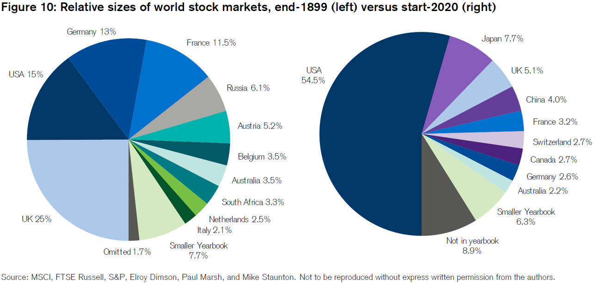

Algorithmic trading has fundamentally reshaped the operations of stock markets worldwide. By leveraging sophisticated computer algorithms, traders can automate complex trading decisions, resulting in enhanced speed and precision. These algorithms process a wide array of data inputs, including market prices, timing, and volume, to execute trades with optimal efficiency. The inherent advantages of algorithmic trading—reduced human error, enhanced decision-making speed, and the ability to handle large volumes of transactions—have made it a crucial component of modern financial markets.

The impact of algorithmic trading is not uniform across different stock markets. Each market's unique set of characteristics, such as liquidity, regulatory environment, and technological infrastructure, influences how effectively algorithmic trading can be employed. Some markets benefit significantly from these advancements, naturally becoming more appealing to investors seeking to leverage automated strategies. Consequently, this article aims to highlight the world’s leading stock markets in terms of algorithmic trading, examining factors that contribute to their prominence and how they cater to the demands of sophisticated traders.



## Table of Contents

## Defining Algorithmic Trading

Algorithmic trading, often referred to as algo trading, uses sophisticated computer programs to execute a set sequence of instructions for trading financial securities. These automated instructions, or algorithms, can incorporate variables such as timing, price, and quantity to optimize trading outcomes. The primary objective of this technology is to perform trades with precision and speed, unattainable by human traders. This automation allows for executing multiple trades simultaneously and monitoring an extensive range of market conditions.

The core advantage of algorithmic trading lies in its speed. Computers can analyze and react to market data far quicker than humans, facilitating the execution of trades in fractions of a second. This rapid processing is crucial for capitalizing on fleeting market opportunities where prices might change rapidly.

In addition to speed, accuracy is another notable benefit. Algorithmic trading reduces the potential for human error, such as emotional decision-making or misinterpretation of data, ensuring trades align strictly with the predefined strategy. Algorithms execute transactions based on precise criteria, adhering to the set rules without deviation, reducing the likelihood of mistakes that could arise from human oversight.

Furthermore, algorithmic trading is adept at managing multiple trades across various markets and assets simultaneously. The ability to monitor numerous trades in real-time and across multiple markets offers a strategic advantage. Traders can implement complex strategies that take into account cross-asset correlations, [arbitrage](/wiki/arbitrage) opportunities, and multi-leg trading strategies, all of which require a level of computational power and monitoring that human traders cannot provide manually.

Overall, the integration of [algorithmic trading](/wiki/algorithmic-trading) into financial markets has revolutionized trading by providing tools that enhance speed, precision, and multi-trade management, thus offering a competitive edge in today's fast-paced trading environment.

## Criteria for the Best Stock Markets in Algo Trading

To evaluate the best stock markets for algorithmic trading, specific criteria must be considered to ensure the efficacy, speed, and profitability of trading algorithms. These criteria include market [liquidity](/wiki/liquidity-risk-premium), regulatory environment, and technological infrastructure.

**Market Liquidity:** Liquidity is a crucial factor in algorithmic trading, as it determines the ease with which assets can be bought and sold without causing significant price changes. High liquidity ensures that trades can be executed quickly and at stable prices, which is essential for algorithms that rely on precise timing to achieve optimal outcomes. Markets with high volume and depth provide the necessary conditions for liquidity, allowing for seamless entry and exit strategies that minimize slippage and transaction costs.

**Regulatory Environment:** The regulatory framework of a stock market can significantly impact the viability of algorithmic trading. Markets with supportive regulatory environments facilitate the use of algorithms by minimizing restrictive policies and encouraging innovation. Regulations that improve transparency, protect against market manipulation, and focus on fair trading practices contribute positively. Conversely, overly stringent regulations may impede the flexibility and speed necessary for executing complex trading strategies, thereby making some markets less attractive for algorithmic activities.

**Technological Infrastructure:** Advanced technological infrastructure underpins effective algorithmic trading by enabling high-speed data transmission and execution. This includes robust hardware, sophisticated software platforms, and reliable network connectivity. The best markets are those with cutting-edge technology that supports the processing of large volumes of data and rapid decision-making required by trading algorithms. High-frequency trading, for instance, demands low-latency environments to capitalize on arbitrage opportunities within microseconds. Access to real-time data feeds, high-performance computing facilities, and connectivity to global financial markets are all indicators of a market's technological capability to support algorithmic operations.

These criteria — market liquidity, regulatory environment, and technological infrastructure — are essential for evaluating the most favorable stock markets for algorithmic trading. They contribute to an environment where trading systems can operate efficiently, maximize gains, and mitigate risks.

## Leading Stock Markets for Algo Trading

The United States is renowned for being a leader in algorithmic trading, primarily due to its advanced technological support and robust regulatory environment. The presence of multiple high-frequency trading firms and exchanges like the New York Stock Exchange (NYSE) and NASDAQ, which offer sophisticated electronic trading platforms, significantly contribute to its prominence. The US market's regulatory framework, overseen by the Securities and Exchange Commission (SEC) and the Commodity Futures Trading Commission (CFTC), provides a stable yet dynamic environment for algorithmic trading, focusing on fair trading practices and transparency.

Australia emerges as a favorable market for algorithmic trading, recognized for its stable market performance and support for technological advancements. The Australian Securities Exchange (ASX), known for its innovative approach, has embraced cutting-edge technology to facilitate faster and more efficient electronic trading. The regulatory framework, governed by the Australian Securities and Investments Commission (ASIC), ensures market integrity while fostering innovation, making it an attractive market for traders using algorithms.

New Zealand offers considerable flexibility and efficiency in trading algorithms, largely due to its progressive regulatory stance and supportive technological infrastructure. The New Zealand Stock Exchange (NZX) is smaller compared to its global counterparts but provides an agile environment for algorithmic trading. The country's regulatory body, the Financial Markets Authority (FMA), promotes a balanced approach, encouraging market growth while maintaining investor protection.

Sweden is considered a tech-oriented market conducive to algorithmic trading. The Stockholm Stock Exchange (part of Nasdaq Nordic) provides a technologically advanced trading platform supported by a strong IT infrastructure. Sweden's regulatory environment, managed by the Finansinspektionen (Swedish Financial Supervisory Authority), is known for being adaptive, thereby enabling financial innovation and algorithmic trading development. The combination of technological readiness and supportive regulation makes Sweden a notable player in the field of algorithmic trading.

## Benefits of Investing in Algorithmic-Friendly Markets

Investing in algorithmic-friendly markets provides substantial benefits due to the sophisticated capabilities of algorithmic trading systems. Key advantages include enhanced returns, efficient trading, and improved risk management.

#### Enhanced Returns

Well-optimized algorithms have the potential to outperform traditional trading strategies by leveraging complex mathematical models and data analysis techniques. Algorithms can process large volumes of historical and real-time market data to identify patterns and make predictions with high accuracy. For instance, [machine learning](/wiki/machine-learning) models can be applied to develop predictive algorithms. In Python, a common approach involves using libraries such as `pandas` for data manipulation and `scikit-learn` for building machine learning models:

```python
import pandas as pd
from sklearn.model_selection import train_test_split
from sklearn.ensemble import RandomForestRegressor

# Load and preprocess market data
data = pd.read_csv('market_data.csv')
X = data.drop('target', axis=1)
y = data['target']

# Split data into training and test sets
X_train, X_test, y_train, y_test = train_test_split(X, y, test_size=0.2)

# Train a Random Forest model
model = RandomForestRegressor(n_estimators=100)
model.fit(X_train, y_train)

# Predictions
predictions = model.predict(X_test)
```

Such algorithms allow for making trades based on statistical evidence and historical trends, aiming to achieve higher returns than those possible through manual analysis alone.

#### Efficient Trading

Algorithmic trading ensures trades are executed at the best possible times, capitalizing on minute market fluctuations that may not be apparent to human traders. Algorithms can react to market conditions in milliseconds, exploiting opportunities that arise and disappear rapidly. The speed and precision offered by algorithmic execution help in minimizing transaction costs and reducing slippage. 

For example, algorithms can employ high-frequency trading ([HFT](/wiki/high-frequency-trading-strategies)) strategies, executing a large number of trades quickly to profit from small price discrepancies. This is particularly advantageous in liquid markets where rapid order execution and low latency are crucial.

#### Risk Management

One of the critical strengths of algorithmic trading systems is their ability to incorporate advanced risk management strategies. Algorithms can be programmed to follow specific risk parameters automatically, such as stop-loss orders or portfolio diversification rules. This automation ensures disciplined adherence to risk management protocols, reducing the potential impact of emotional or impulsive trading decisions.

Risk management algorithms might involve techniques like Value at Risk (VaR) calculations, which assess the potential loss in value of a portfolio over a defined period for a given confidence interval. By implementing these strategies, traders can limit their exposure to adverse market movements. 

Overall, investing in algorithmic-friendly markets enables traders and investors to utilize sophisticated technology for achieving enhanced returns, executing trades efficiently, and managing risks effectively, thereby optimizing their overall trading strategy.

## Challenges in Algo Trading Across Different Markets

Algorithmic trading across different markets encounters several challenges that can significantly impact performance and outcomes. One of the key challenges is market [volatility](/wiki/volatility-trading-strategies). Sudden and unexpected changes in market conditions can lead to variations in asset prices, potentially causing algorithms to execute trades at suboptimal times or prices. Such volatility can result in either substantial gains or significant losses within short periods. Algorithms designed for stable market conditions may struggle to adapt swiftly to these changes, leading to inefficiencies or unexpected outcomes.

To address volatility, algorithm developers often incorporate measures such as stop-loss orders, which are automated instructions to sell an asset when it reaches a specified price. Additionally, risk management techniques can be embedded within algorithms to minimize potential losses during periods of extreme market fluctuations. For instance, an algorithm might pause trading activities when volatility indices surpass a certain threshold.

Regulatory challenges are another significant hurdle for algo traders. Different markets have distinct regulatory frameworks, which can influence the development and deployment of trading algorithms. Regulations may dictate parameters such as trading speed, frequency, and transparency requirements. Compliance with these regulations is essential to avoid legal repercussions and fines. However, navigating the regulatory landscape can be complex, especially when trading across multiple jurisdictions. For example, while some markets may encourage high-frequency trading, others impose restrictions to ensure market stability.

Lastly, technological limitations present challenges for algorithmic trading. Not all markets offer the same level of technological infrastructure, which can impact the speed and reliability of trade execution. Markets with outdated technology may suffer from latency issues, hindering the ability of an algorithm to execute trades promptly. This delay can be crucial in high-frequency trading, where even milliseconds matter. Moreover, discrepancies in data quality and availability across markets can affect an algorithm's decision-making processes.

To mitigate these challenges, traders and firms often invest in advanced technological solutions, such as co-location services, where trading systems are placed in close proximity to exchange servers to reduce latency. Additionally, continuous improvements in data analytics and machine learning can enhance the ability of algorithms to process vast amounts of information and adapt to changing market conditions efficiently.

In summary, while algorithmic trading offers significant advantages, it must navigate the challenges posed by market volatility, diverse regulatory environments, and technological disparities to achieve optimal performance.

## Future of Algorithmic Trading Globally

Algorithmic trading continues to evolve, driven by both technological innovation and dynamic market conditions. Emerging markets represent new opportunities for the adoption of algorithmic trading strategies, particularly as these regions improve their financial infrastructures and regulatory frameworks. Countries in Asia, Africa, and Latin America are increasingly integrating algorithms into their trading systems, fuelling regional competition and fostering a tech-savvy investment environment. These advancements hold the potential to revolutionize trading by providing enhanced liquidity and more sophisticated trading strategies.

Technological advancements remain a pivotal force in the future of algorithmic trading. Machine learning and [artificial intelligence](/wiki/ai-artificial-intelligence) are at the forefront, allowing algorithms to evolve and adapt to complex market patterns and data streams. Techniques such as [deep learning](/wiki/deep-learning) enable more nuanced analysis of market signals, offering predictive capabilities that were previously unattainable. Furthermore, the integration of big data analytics ensures that algorithms can process vast amounts of information in real-time, leading to more informed and timely decisions. One promising area of development is quantum computing, which, once fully realized, could exponentially increase the processing power available for handling multifaceted trading strategies. This technological progression promises to further enhance the precision and speed of algorithmic trading systems.

Regulatory shifts significantly influence the trajectory of algorithmic trading. Globally, there is a trend towards both deregulation to stimulate market innovation and stricter oversight to mitigate risks associated with high-frequency trading. Emerging markets may benefit from adopting regulations that balance innovation with necessary protections for market integrity. Meanwhile, established markets continue to refine their regulatory landscapes to address the complexities introduced by advanced algorithmic techniques. Anticipated changes include standardizing disclosure requirements for algorithmic trading methods and implementing controls to prevent market manipulation. These regulatory alterations could either encourage growth by establishing clearer guidelines or impose constraints that challenge current trading practices. 

Overall, the future of algorithmic trading globally is characterized by a synthesis of technological advancements and evolving regulatory frameworks. As markets advance their digital capabilities, algorithmic trading is poised to become more prevalent, demanding continuous adaptation and innovation from stakeholders to harness its full potential.

## Conclusion

Algorithmic trading offers vast opportunities for improving trading efficiency and effectiveness. By leveraging technology, investors can implement strategies that take advantage of speed, accuracy, and the ability to process large volumes of trades. However, the selection of an appropriate market is instrumental in harnessing these benefits. Markets with supportive regulatory frameworks, advanced technological infrastructures, and sufficient liquidity provide the optimal environment for algorithmic trading to thrive.

Continuous research and development in both technology and regulations are pivotal for the future of algorithmic trading. Technological advancements, such as improved data analytics and machine learning algorithms, are expected to significantly enhance the performance and adaptability of trading systems. These improvements will enable more precise modeling of market behaviors and better risk management, ultimately leading to superior trading outcomes.

Regulatory developments also play a significant role in shaping the future landscape of algorithmic trading. As markets evolve, regulations need to adapt to balance innovation with the protection of market integrity. The ability to anticipate and respond to these regulatory shifts will be critical for participants who aim to sustain their competitive edge in algorithmic trading.

In conclusion, while algorithmic trading offers considerable advantages, its success depends heavily on choosing the right markets and staying attuned to technological and regulatory changes. These elements will collectively determine the trajectory and success of algorithmic trading practices moving forward.

## FAQs

### FAQs

**What is algorithmic trading?**  
Algorithmic trading is the use of computer algorithms to automate trading processes in financial markets. These algorithms follow predefined instructions based on timing, price, [volume](/wiki/volume-trading-strategy), or any mathematical model to execute orders. The primary goal is to perform trades at optimal times with increased speed and accuracy, thereby enhancing the trading efficiency.

**Which markets are best for algo trading?**  
Currently, the United States and Australia are considered among the top markets for algorithmic trading. The United States benefits from advanced technological support and a well-structured regulatory framework that encourages innovation in algorithmic trading. Similarly, Australia is known for its stable market performance and a favorable technological infrastructure that supports algorithm-driven activities efficiently.

**What are the risks of algo trading?**  
Algorithmic trading, despite its advantages, comes with risks such as market volatility and regulatory challenges. Market volatility can lead to rapid and unforeseen changes in prices, affecting the performance of trading algorithms. Additionally, different markets impose varying regulations that can constrain or prohibit certain algorithmic strategies, requiring traders to continuously adapt to the evolving regulatory landscape.

## References & Further Reading

[1]: Bergstra, J., Bardenet, R., Bengio, Y., & Kégl, B. (2011). ["Algorithms for Hyper-Parameter Optimization."](https://proceedings.neurips.cc/paper/2011/file/86e8f7ab32cfd12577bc2619bc635690-Paper.pdf) Advances in Neural Information Processing Systems 24.

[2]: ["Advances in Financial Machine Learning"](https://www.amazon.com/Advances-Financial-Machine-Learning-Marcos/dp/1119482089) by Marcos Lopez de Prado

[3]: ["Evidence-Based Technical Analysis: Applying the Scientific Method and Statistical Inference to Trading Signals"](https://www.amazon.com/Evidence-Based-Technical-Analysis-Scientific-Statistical/dp/0470008741) by David Aronson

[4]: ["Machine Learning for Algorithmic Trading"](https://github.com/stefan-jansen/machine-learning-for-trading) by Stefan Jansen

[5]: ["Quantitative Trading: How to Build Your Own Algorithmic Trading Business"](https://books.google.com/books/about/Quantitative_Trading.html?id=j70yEAAAQBAJ) by Ernest P. Chan