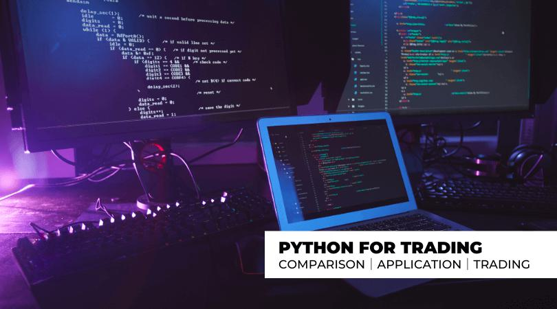

Algorithmic trading has revolutionized the way financial markets operate, building on centuries of trading evolution that moved from manual, pit-based trading to highly advanced, automated systems. Originally, trading involved manual execution in which traders physically presented and negotiated their orders on exchange floors. This method required extensive human intervention and was limited by physical presence and human speed. The rise of electronic trading marked a significant shift, allowing for faster and more efficient trading through electronic order matching, laying the groundwork for algorithmic trading.

Algorithmic, or "algo," trading leverages computer programs to execute pre-defined trading strategies. These algorithms use complex mathematical models and statistical analyses to assess market conditions, making buy or sell decisions at speeds and frequencies beyond human capability. Coding is the linchpin in this process, as it allows the creation of these sophisticated algorithms, enabling the automation of trading strategies.



The importance of coding in algorithmic trading cannot be overstated. As the backbone of these systems, coding allows for the customization of trading strategies, ensuring that algorithms can adapt to evolving market conditions. It also streamlines the execution process, reducing human error and enhancing precision. Programming languages such as Python, C++, R, and Java are pivotal in developing these algorithms due to their robust libraries and frameworks tailored for financial data analysis and high-speed execution.

The impact of algorithmic trading on financial markets has been profound. It has increased market liquidity and decreased transaction costs, which benefits investors by making markets more efficient. However, it has also introduced complexity and volatility, evidenced by the occurrence of flash crashes and other anomalies. The speed and volume at which these trades are executed can lead to significant market disruptions if not properly managed.

This article will explore these dimensions in detail, covering what algorithmic trading is, its historical development, and the significant role coding plays in it. It will also examine the popular programming languages used in algo trading, steps to develop algorithms, the importance of backtesting, and real-world applications. Through these discussions, readers will gain insights into the transformative power of algorithmic trading and the critical role coding plays in the modern financial landscape.

## Table of Contents

## What is Algorithmic Trading?

Algorithmic trading, commonly referred to as algo trading, is the process of executing orders using pre-programmed and automated trading instructions. These instructions account for variables such as time, price, and [volume](/wiki/volume-trading-strategy), significantly reducing the role of human discretion in trading decisions. The significance of algorithmic trading lies in its ability to enhance market efficiency by executing orders at speeds and frequencies unattainable by a human trader, thereby enabling the exploitation of minute market inefficiencies.

The history of [algorithmic trading](/wiki/algorithmic-trading) dates back to the early 1970s with the advent of electronic trading platforms. The London Stock Exchange facilitated one of the first instances of automated trading with the introduction of its Electronic Trading System (SETS) in 1984. The development of algorithmic trading accelerated in the 1990s as stock exchanges worldwide adopted electronic trading systems, driven by technological advances and regulatory changes that permitted more electronic access to markets.

Key players in the algo trading space include investment banks, hedge funds, and proprietary trading firms. Some of the most notable platforms supporting algorithmic trading are MetaTrader, [Interactive Brokers](/wiki/interactive-brokers-api), and Bloomberg Terminal. These platforms offer robust support for developing, testing, and deploying trading algorithms, providing traders with tools to execute complex strategies.

Algorithmic trading provides several advantages over traditional trading methods. The primary benefit is the speed of execution, as algorithms can analyze multiple markets and execute orders faster than manual trading, capitalizing on short-lived trading opportunities. Algo trading also minimizes emotional human disruptions, reducing biases and errors associated with manual trading. Furthermore, algorithms can operate continuously, trading beyond regular market hours when applicable, to capture trading opportunities in different time zones.

In financial terms, an algorithmic trading strategy might, for example, involve the use of a statistical [arbitrage](/wiki/arbitrage) approach where pricing inefficiencies between related financial instruments are exploited. An illustrative Python snippet might look like this:

```python
import numpy as np
import pandas as pd

# Assume 'spread' is a time series representing the price difference between two instruments
spread = pd.Series([...])  # example spread data

# Moving average of the spread
spread_ma = spread.rolling(window=30).mean()

# Standard deviation of the spread
spread_sd = spread.rolling(window=30).std()

# Z-score calculation
z_score = (spread - spread_ma) / spread_sd

# Define entry and exit signals based on z-score
entry_threshold = 2.0
exit_threshold = 0.5
entry_signal = z_score > entry_threshold
exit_signal = z_score < exit_threshold
```

This code represents a basic [statistical arbitrage](/wiki/statistical-arbitrage) model that computes the z-score of the spread between two assets and generates entry and [exit](/wiki/exit-strategy) signals based on thresholds. In practice, such models are more sophisticated, involving more complex statistical and mathematical methods.

In conclusion, algorithmic trading revolutionized financial markets by increasing the efficiency and precision of trade executions and reducing transaction costs. The continuous advancement in computing power and data accessibility is expected to drive further innovations in this field, heralding a new era in trading technology.

## The Role of Coding in Algo Trading

Algorithmic trading relies heavily on the precise and accurate execution of instructions to analyze financial markets and execute trades. Coding serves as the core infrastructure for developing these trading systems. A well-coded algorithm can process vast amounts of market data in milliseconds, much faster than any human trader, which is crucial for capitalizing on short-lived market opportunities.

Different programming languages have their own strengths and are chosen based on the specific needs of the trading strategy. Python is highly favored due to its simplicity and the robustness of its libraries, such as NumPy, pandas, and SciPy, which are excellent for data analysis and manipulation. Its extensive library support makes Python particularly useful for designing medium-frequency trading strategies where execution time is less critical than high-frequency trading ([HFT](/wiki/high-frequency-trading-strategies)).

For HFT, where execution speed is paramount, C++ is often preferred due to its high-performance capabilities and ability to interact directly with hardware, minimizing latency. The language's efficiency and control over system resources enable the creation of sophisticated trading algorithms that operate on milliseconds or microseconds.

Java and C# are also popular among developers building large, scalable trading platforms due to their strong object-oriented features and performance. Java's platform independence and C#'s integration with Microsoft’s products make them excellent choices for commercial trading platforms.

Algorithm development and testing form another crucial aspect. A trading algorithm must be well-designed to capture the intended financial strategy effectively. This requires rigorous testing to ensure the algorithm behaves as expected under various conditions. Backtesting, a process using historical data to test a trading strategy, is essential for verifying the algorithm's viability and robustness before deploying it live.

The process often begins with hypothesis formulation and then progresses through phases of coding the strategy, [backtesting](/wiki/backtesting), optimization, and risk management. The iterative nature of this development process demands a deep understanding of both financial markets and programming.

Speed and accuracy are vital in algorithmic trading. An incorrectly coded algorithm can lead to significant financial losses, and slow execution times can miss market opportunities or incur slippage. Thus, developers must write efficient and error-free code, often implementing complex mathematical models and strategies. For instance, execution speed can be optimized by using parallel computing or optimizing data structures and algorithms.

In summary, coding underpins the framework of algorithmic trading, providing the necessary tools to design, test, and execute trading strategies with precision and efficiency. This technical backbone enables traders to address both the analytical and quantitative aspects of the financial markets effectively.

## Popular Programming Languages for Algo Trading

Algorithmic trading relies heavily on the prowess of programming languages to execute effective trading strategies. Selecting the right language is crucial for ensuring optimal performance, reliability, and ease of use within trading environments. Here, we examine the popular programming languages used in algorithmic trading, each providing unique advantages tailored to specific trading needs.

### Python

Python has seen a surge in popularity for algorithmic trading due to its simplicity and extensive library support. It boasts powerful libraries such as NumPy and pandas for data manipulation, matplotlib and Plotly for visualization, and SciPy for scientific computing, making it an excellent choice for both novice and advanced traders. The easy syntax of Python facilitates rapid development and prototyping of trading strategies, while its vast community ensures plenty of resources and support.

Moreover, Python integrates seamlessly with libraries like Zipline and Backtrader, which are specifically designed for backtesting trading algorithms. This makes Python particularly advantageous for testing strategies against historical data to assess performance. For example, a simple moving average crossover strategy can be developed and tested with just a few lines of code in Python.

```python
import pandas as pd
import numpy as np

# Sample data
data = pd.DataFrame({'Price': [100, 102, 104, 101, 107]})
data['SMA_10'] = data['Price'].rolling(window=10).mean()

# Trading signal
data['Signal'] = np.where(data['Price'] > data['SMA_10'], 1, 0)
```

### C++

C++ is favored for high-frequency trading (HFT) due to its execution speed and efficient memory management. High-frequency traders require minimal latency, as millisecond delays can significantly impact profitability. C++ provides close-to-hardware operations, making it ideal for scenarios where speed is of the essence.

Furthermore, C++ enables traders to implement complex mathematical computations and custom data structures, facilitating the development of sophisticated algorithms. The language's ability to integrate with hardware support and its robust standard library positions C++ as a formidable tool in high-performance trading environments.

### R

R is primarily used for statistical analysis and backtesting in algorithmic trading. Known for its statistical capabilities, R provides extensive packages like quantmod and TTR for technical analysis, which are instrumental in devising and testing trading strategies based on historical data.

R’s strong suit lies in its ability to generate advanced statistical models and visual analytics. It allows traders to perform comprehensive data analysis and build predictive models that can forecast market movements. This statistical prowess makes R an excellent choice for traders focused on data-driven strategies and market research.

### Java and C#

Java and C# are popular for developing robust trading platforms and systems. Both languages provide object-oriented features, garbage collection, and a large ecosystem of libraries, allowing for scalable and maintainable code structures.

Java's platform independence and extensive libraries make it suitable for large-scale trading systems that require integration across diverse environments. In contrast, C# is known for its Windows-friendly nature and is often used in trading platforms that leverage Microsoft's .NET framework.

The strengths of Java and C# lie in their ability to build comprehensive trading platforms capable of handling complex operations, multiple asset classes, and regulatory requirements. Both languages enable traders to develop front-end applications with user-friendly interfaces and back-end systems with efficient processing capabilities.

In conclusion, the choice of programming language in algorithmic trading is dictated by the specific requirements of the trading strategy and platform. Python is favored for ease of use and extensive library support, C++ for speed in high-frequency trading, R for robust statistical analysis, and Java and C# for building scalable trading systems. Each language contributes uniquely to the landscape of algorithmic trading, enabling traders to tailor their approaches to their technical and operational needs.

## Developing a Trading Algorithm

Designing and creating a trading algorithm involves multiple steps, each critical to developing a functional and profitable system. The process typically begins with a clear strategy formulation based on financial theories or models and proceeds through meticulous coding, rigorous backtesting, and optimization.

**Steps to Design and Create a Trading Algorithm from Scratch**

1. **Define a Trading Strategy**: The foundational step is to conceptualize a trading strategy or financial model that dictates buy and sell signals. This could be based on technical indicators, such as moving averages or Relative Strength Index (RSI), or on more complex financial models like statistical arbitrage. For example, a simple moving average crossover strategy involves buying when a shorter moving average crosses above a longer moving average and selling when the opposite occurs.

2. **Translate the Strategy into Code**: Once a strategy is defined, the next step is to translate it into a programmable format. Languages such as Python are preferred due to their readability and robust libraries like `pandas` for data manipulation and `numpy` for numerical computations. A simple algorithm for a moving average crossover might involve:

   ```python
   import pandas as pd

   def moving_average_crossover_strategy(prices, short_window, long_window):
       signals = pd.DataFrame(index=prices.index)
       signals['signal'] = 0.0
       signals['short_mavg'] = prices.rolling(window=short_window, min_periods=1).mean()
       signals['long_mavg'] = prices.rolling(window=long_window, min_periods=1).mean()
       signals['signal'][short_window:] = np.where(signals['short_mavg'][short_window:] > signals['long_mavg'][short_window:], 1.0, 0.0)   
       signals['positions'] = signals['signal'].diff()
       return signals
   ```

3. **Incorporate Historical Data and Backtesting**: Historical data is indispensable for backtesting algorithms to evaluate their performance before live deployment. Backtesting involves running the trading algorithm through historical price data to assess how it would have performed. The goal is to identify potential trading signals and the consequent returns. Efficient use of libraries like `backtrader` or `zipline` can facilitate this process.

4. **Address Common Challenges in Algorithm Development**: Numerous challenges can arise during the development phase. These include data quality issues, where incomplete or erroneous data can lead to inaccurate backtesting results, and overfitting, where a model is too closely tailored to historical data, thus failing to generalize to unseen data. Other issues include latency in execution, especially relevant in high-frequency trading, and the requirement for continuous monitoring and adjustment of algorithms to reflect changing market conditions.

Each step in developing a trading algorithm requires a meticulous approach to ensure accuracy, performance, and reliability. The integration of financial models and strategies into code, coupled with rigorous testing against historical data, forms the bedrock of successful algorithmic trading systems. As such, overcoming the inherent challenges in algorithm development is crucial for aspiring traders to build long-term sustainable trading systems.

## Backtesting and Optimization

Backtesting serves as a crucial step in verifying the viability and effectiveness of trading algorithms before deploying them in real financial markets. It involves applying a trading algorithm to historical market data to assess how it would have performed in the past. This process helps traders identify potential flaws in their strategy and estimate the strategy’s expected performance.

### Tools and Platforms Used for Backtesting

Various tools and platforms are available to assist in backtesting trading algorithms. Python, with its rich ecosystem of libraries such as Pandas, NumPy, and Matplotlib, is a popular choice for performing backtests due to its powerful data manipulation capabilities and ease of use. Libraries like Backtrader and pyfolio are specifically designed for backtesting and performance analysis within Python. Additionally, platforms like QuantConnect and MetaTrader provide integrated environments for both coding and backtesting algorithms with historical data.

Example Python code snippet for backtesting using Backtrader:
```python
import backtrader as bt

class MyStrategy(bt.Strategy):
    def __init__(self):
        self.sma = bt.indicators.SimpleMovingAverage(self.datas[0], period=15)

    def next(self):
        if self.sma[0] > self.data.close[0]:
            self.buy()
        elif self.sma[0] < self.data.close[0]:
            self.sell()

cerebro = bt.Cerebro()
data = bt.feeds.YahooFinanceData(dataname='AAPL', fromdate=datetime(2020, 1, 1),
                                 todate=datetime(2020, 12, 31))
cerebro.adddata(data)
cerebro.addstrategy(MyStrategy)
cerebro.run()
```

### Optimizing and Refining Trading Algorithms

Optimization involves improving a trading algorithm’s performance by adjusting its parameters to achieve better results. Algorithm optimization can be conducted through parameter tuning, where different sets of parameters are tested to find the combination that gives the highest return or risk-adjusted return.

Refining trading algorithms also involves incorporating better risk management techniques, adjusting position sizes, and setting stop-loss and take-profit levels to enhance performance further. It's important to avoid overfitting the algorithm to past data, which occurs when a model is too complex and captures the noise in the dataset instead of the underlying market trends.

### Stress Testing Algorithms in Varied Market Conditions

Stress testing evaluates the algorithm's robustness by applying it to historical data from varied market conditions, such as periods of high [volatility](/wiki/volatility-trading-strategies) or economic downturns. This ensures the algorithm can withstand different scenarios and is not limited to performing well only in specific market phases.

For instance, an effective stress test might involve running the algorithm on datasets corresponding to the 2008 financial crisis or the COVID-19 market crash, where exceptional conditions prevailed. By testing the algorithm under these stress scenarios, traders can assess its resilience and make necessary adjustments to mitigate potential risks in live trading situations.

In conclusion, backtesting and optimization form the backbone of developing robust trading algorithms. By effectively employing these methodologies, traders can significantly reduce the risks associated with live trading and enhance their strategies' potential to achieve desired performance.

## Real-World Applications of Algo Trading

Algorithmic trading has become a cornerstone of modern financial markets, allowing traders to execute orders at speeds and volumes impossible for human traders. Today, algorithmic trading strategies vary widely, from high-frequency trading to long-term investment models. Here, we explore some prevalent strategies, case studies, regulatory considerations, and emerging trends in algorithmic trading.

### Examples of Algorithmic Trading Strategies

1. **Market Making**: This strategy involves placing both buy and sell orders for a particular asset to capitalize on the bid-ask spread. Algorithms monitor multiple markets to adjust quotes based on real-time data, enhancing liquidity and narrowing spreads.

2. **Arbitrage**: Arbitrage involves exploiting price differences of a single asset across different markets. An algorithm can quickly detect and execute trades to profit from these discrepancies, often operating in milliseconds to ensure the opportunity doesn't slip away.

3. **Trend Following**: This strategy relies on algorithms to identify and follow long-term market trends. By analyzing moving averages or momentum indicators, the system makes decisions on when to enter or exit trades, minimizing human emotion's impact.

4. **Statistical Arbitrage**: It involves using statistical models to identify trading opportunities in pairs or baskets of stocks that deviate from their historical statistical relationship, betting on the convergence of prices.

### Case Studies of Successful Implementation

The deployment of algorithmic trading has been exemplified by several successful implementations:

- **Goldman Sachs**: The firm has effectively utilized high-frequency trading algorithms to enhance its market making and execution efficiency, reportedly generating substantial revenue from these operations.

- **Renaissance Technologies**: Known for its Medallion Fund, this hedge fund has leveraged complex mathematical models and algorithms to achieve returns with a remarkable Sharpe ratio, significantly outperforming the market.

### Regulatory Considerations in Different Markets

The rise of algorithmic trading has prompted regulatory scrutiny. Key considerations include:

- **Market Integrity**: Algorithms can impact market stability, leading to phenomena such as the "flash crash." Regulators have introduced measures like circuit breakers to contain excessive market volatility.

- **Transparency and Fairness**: Ensuring that algorithmic strategies do not exploit market loopholes is critical. Authorities require detailed reporting and monitoring to prevent manipulative practices.

- **Best Execution**: Regulators mandate that algorithmic trades adhere to the best execution principle, ensuring that trades are conducted in the client's best interest, considering price, cost, speed, and likelihood of execution.

### Future Trends and Innovations

As technology advances, algorithmic trading continues to evolve:

1. **Machine Learning and AI**: Algorithms are increasingly employing machine learning to adapt to changing market conditions and improve prediction accuracy. These technologies enable the development of more sophisticated models that can learn and evolve over time.

2. **Quantum Computing**: Although still nascent, quantum computing shows promise in solving complex optimization problems faster, offering a potential edge in pricing and strategy development.

3. **Decentralized Finance (DeFi)**: The rise of blockchain technologies and decentralized finance presents new opportunities and challenges for algorithmic trading. Algorithms are being developed to operate in these novel ecosystems, executing trades without traditional intermediaries.

In conclusion, algorithmic trading exemplifies the transformative power of technology in finance, providing tools for enhanced efficiency, speed, and decision-making. As the landscape continues to change, a deep understanding of these elements is crucial for navigating the future of trading.

## Conclusion

Algorithmic trading has reshaped the landscape of financial markets by leveraging the power of coding to execute trades at speeds and efficiencies human traders cannot match. The primary role of coding in this domain is creating the algorithms that dictate trading strategies, analyze vast amounts of data, and make split-second decisions. Without robust software development, the intricate strategies used in algo trading would be virtually impossible to implement effectively.

Aspiring algorithmic traders should recognize that mastering coding is indispensable for success. Key takeaways include the necessity of mastering a programming language such as Python, widely used due to its simplicity and rich ecosystem of libraries like NumPy and pandas. These tools facilitate data manipulation, crucial for developing and testing strategies. Understanding advanced programming languages like C++ can be advantageous for high-frequency trading, requiring maximum performance and speed.

Moreover, continuous learning is paramount, given the constant evolution of financial markets and technologies. Aspiring traders can access numerous resources to enhance their skills. Online platforms such as Coursera or edX offer courses on financial engineering and data science. Books like "Algorithmic Trading" by Ernie Chan provide insights into developing strategies and understanding market dynamics. Utilizing forums and communities like QuantConnect or Stack Overflow can provide support and real-world insights from seasoned professionals.

In summary, coding forms the bedrock of algorithmic trading, empowering traders to develop sophisticated models and backtest them against historical data. By leveraging educational resources and committing to continuous learning, aspiring algorithmic traders can position themselves for success in this dynamic field.

## References & Further Reading

[1]: Bergstra, J., Bardenet, R., Bengio, Y., & Kégl, B. (2011). ["Algorithms for Hyper-Parameter Optimization."](https://papers.nips.cc/paper/4443-algorithms-for-hyper-parameter-optimization) Advances in Neural Information Processing Systems 24.

[2]: ["Advances in Financial Machine Learning"](https://www.amazon.com/Advances-Financial-Machine-Learning-Marcos/dp/1119482089) by Marcos Lopez de Prado

[3]: ["Evidence-Based Technical Analysis: Applying the Scientific Method and Statistical Inference to Trading Signals"](https://www.amazon.com/Evidence-Based-Technical-Analysis-Scientific-Statistical/dp/0470008741) by David Aronson

[4]: ["Machine Learning for Algorithmic Trading"](https://github.com/stefan-jansen/machine-learning-for-trading) by Stefan Jansen

[5]: ["Quantitative Trading: How to Build Your Own Algorithmic Trading Business"](https://books.google.com/books/about/Quantitative_Trading.html?id=j70yEAAAQBAJ) by Ernest P. Chan