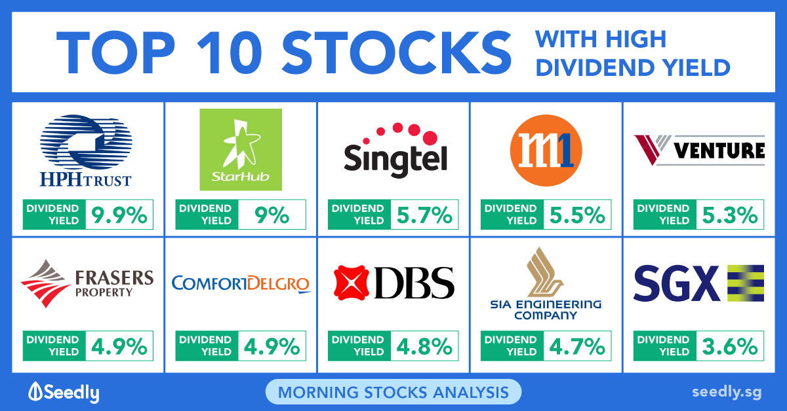

## Table of Contents

## What are dividend stocks and why are they important for investors?

Dividend stocks are shares of companies that regularly pay out a portion of their earnings to shareholders. These payments, called dividends, are usually given out every three months, but sometimes they can be paid monthly or yearly. The amount of the dividend is often based on how well the company is doing and how much profit it makes. Many big and stable companies, like those in utilities or consumer goods, often pay dividends.

Dividend stocks are important for investors because they provide a steady income stream. This can be really helpful, especially for people who are retired or looking for regular income from their investments. Besides the income, dividend stocks can also grow in value over time, which means investors can benefit from both the dividends and an increase in the stock price. This makes dividend stocks a popular choice for people who want to balance income and growth in their investment portfolio.

## How does the Singapore stock market work in relation to dividend stocks?

The Singapore stock market, known as the Singapore Exchange (SGX), is where people can buy and sell stocks, including those that pay dividends. Companies listed on the SGX can choose to pay dividends to their shareholders if they make a profit. These dividends are usually paid out a few times a year, and the amount depends on how well the company is doing. Investors in Singapore can look at the SGX website to see which companies are paying dividends and how much they are paying.

Dividend stocks are popular in Singapore because many investors like the steady income they provide. For example, many people in Singapore invest in real estate investment trusts (REITs), which are required to pay out most of their income as dividends. This makes REITs a good choice for people looking for regular income. Overall, the SGX makes it easy for investors to find and invest in dividend stocks, helping them build a portfolio that can provide both income and potential growth.

## What criteria should beginners use to select dividend stocks in Singapore?

When beginners in Singapore want to pick dividend stocks, they should first look at the dividend yield. This is how much money they get back from their investment every year, shown as a percentage. A higher yield might seem good, but it's important to check if it's too high. Sometimes, a very high yield can mean the company is not doing well, and the stock price might drop. So, it's a good idea to compare the yield with other similar companies to see if it makes sense.

Next, beginners should think about how stable the company is. Companies that have been paying dividends for a long time are usually more reliable. Look at the company's history of paying dividends and see if they have increased them over time. This can show that the company is doing well and might keep paying good dividends in the future. Also, consider the company's business. Some industries, like utilities or consumer goods, tend to be more stable and are more likely to keep paying dividends even during tough times.

Lastly, beginners should also look at the company's financial health. Check if the company is making enough money to keep paying dividends. You can do this by looking at their earnings and how much debt they have. A company with strong earnings and low debt is more likely to keep paying dividends. It's also a good idea to spread your money across different stocks to lower the risk. By considering these things, beginners can make smarter choices when [picking](/wiki/asset-class-picking) dividend stocks in Singapore.

## Can you list some of the top dividend-paying stocks in Singapore for beginners?

Some of the top dividend-paying stocks in Singapore for beginners are from companies like DBS Group Holdings, Oversea-Chinese Banking Corporation (OCBC), and United Overseas Bank (UOB). These are big banks in Singapore that have been paying good dividends for a long time. They are stable and have a strong history of sharing their profits with shareholders. DBS, OCBC, and UOB are good choices because they are well-known and trusted, making them a safe bet for beginners looking for steady income.

Another good option for beginners is to look at real estate investment trusts (REITs) like CapitaLand Integrated Commercial Trust (CICT) and Mapletree Industrial Trust (MIT). REITs are required to pay out most of their income as dividends, which makes them very attractive for people wanting regular income. CICT owns shopping malls and offices, while MIT focuses on industrial properties. Both have a good track record of paying dividends and can be a great way for beginners to start investing in dividend stocks in Singapore.

## What are the tax implications of dividend income in Singapore?

In Singapore, the tax rules for dividend income are pretty simple and good for investors. If you are a Singaporean or a permanent resident, you don't have to pay any tax on the dividends you get from local companies. This means all the money you get from dividends is yours to keep, which is great for people looking to earn income from their investments.

However, if you are a foreigner and you get dividends from Singapore companies, you might have to pay a withholding tax. This tax is usually 10% of the dividend amount, but it can be different depending on any tax agreements between Singapore and your home country. So, it's a good idea to check the specific rules that apply to you to make sure you understand how much tax you might need to pay on your dividend income.

## How do dividend yields and payout ratios affect investment decisions?

Dividend yield and payout ratio are two important things to look at when deciding to invest in dividend stocks. The dividend yield tells you how much money you get back from your investment each year as a percentage. If a stock has a high yield, it might seem like a good deal because you're getting more money back. But, a very high yield can sometimes be a warning sign that the company might not be doing well, and the stock price could drop. So, it's smart to compare the yield with other similar companies to see if it's a good choice.

The payout ratio is also important because it shows how much of the company's earnings are being paid out as dividends. If the payout ratio is high, it means the company is giving most of its profits to shareholders. This can be good if you want a lot of income, but it might also mean the company doesn't have much money left to grow or handle tough times. A lower payout ratio might mean the company is keeping more money to invest in its future, which could be good for long-term growth. By looking at both the dividend yield and the payout ratio, you can make a better decision about whether a stock is right for your investment goals.

## What are the risks associated with investing in high-dividend stocks in Singapore?

Investing in high-dividend stocks in Singapore can be risky. One big risk is that a high dividend might not last. If a company is paying out a lot of its profits as dividends, it might not have enough money left to grow or handle problems. This can make the company weaker over time, and if things get tough, the company might have to cut the dividend or even stop paying it. That means the income you were counting on could go away.

Another risk is that the stock price could fall. Sometimes, a high dividend yield can be a sign that the stock price has already dropped a lot. If the market thinks the company is in trouble, the stock price might keep going down, and you could lose money on your investment. It's important to look at why the dividend yield is high and make sure it's not because the company is struggling. By understanding these risks, you can make smarter choices about which high-dividend stocks to invest in.

## How can investors use dividend reinvestment plans (DRIPs) to their advantage in Singapore?

Dividend reinvestment plans (DRIPs) can be a great way for investors in Singapore to grow their investments over time. When you use a DRIP, instead of getting cash from your dividends, you use that money to buy more shares of the company. This means you can own more of the company without spending extra money. Over time, this can lead to owning a lot more shares, which can increase your future dividends and the value of your investment.

Using DRIPs also helps you take advantage of compound growth. As you get more shares, you earn dividends on those new shares too. This can make your investment grow faster because you're [earning](/wiki/earning-announcement) dividends on a bigger and bigger number of shares. For people who want to build their wealth over the long term, DRIPs can be a smart choice because they help your money work harder for you without needing to put in more cash.

## What advanced metrics should expert investors look at when evaluating Singapore dividend stocks?

Expert investors in Singapore should look at a few advanced metrics when picking dividend stocks. One key metric is the dividend coverage ratio, which shows how many times a company's earnings can cover its dividend payments. A higher ratio means the company can easily pay its dividends, which is a good sign. Another important metric is the free cash flow yield, which tells you how much cash the company is generating compared to its market value. A strong free cash flow yield means the company has enough money to keep paying dividends and invest in growth. Lastly, experts should consider the return on equity (ROE), which measures how well a company is using the money shareholders have invested. A high ROE can show that the company is good at turning shareholder money into profits, which could lead to higher dividends in the future.

These metrics give expert investors a deeper look into a company's health and its ability to keep paying dividends. By checking the dividend coverage ratio, investors can see if the dividends are safe and likely to continue. The free cash flow yield helps them understand if the company has enough cash to support its dividend payments and other needs. And looking at the return on equity can tell them if the company is using their money well to grow profits. Using these advanced metrics, expert investors can make smarter choices about which dividend stocks in Singapore are the best for their portfolios.

## How do sector-specific factors influence the performance of dividend stocks in Singapore?

Sector-specific factors can really affect how well dividend stocks do in Singapore. For example, in the banking sector, things like interest rates and how well the economy is doing can make a big difference. When interest rates go up, banks can earn more from loans, which might mean they can pay out bigger dividends. But if the economy slows down, people might borrow less, and that could hurt the banks' profits and their ability to keep paying good dividends. So, it's important for investors to keep an eye on these factors when looking at bank stocks.

Another sector to think about is real estate investment trusts (REITs). REITs have to pay out most of their income as dividends, so their performance can be influenced by things like property prices and how much rent they can charge. If property prices go up and they can charge more rent, REITs might be able to pay higher dividends. But if the real estate market has a tough time, like during a big economic downturn, REITs might struggle to keep their dividends steady. Understanding these sector-specific factors can help investors make better choices about which dividend stocks to buy in Singapore.

## What are the historical trends of dividend stocks in Singapore and what can they tell us about future performance?

Looking at the past, dividend stocks in Singapore have been a good choice for people wanting steady income. Over the years, big companies like DBS, OCBC, and UOB have kept paying good dividends even when the economy was up and down. This shows that these companies are strong and can handle tough times. Also, real estate investment trusts (REITs) like CapitaLand Integrated Commercial Trust and Mapletree Industrial Trust have been reliable for paying dividends because they have to give most of their money to shareholders. This history tells us that if you pick the right companies, dividend stocks can be a safe way to earn money over time.

But, the future of dividend stocks in Singapore can be tricky to predict. The economy, interest rates, and what's happening in different industries can all change how well these stocks do. For example, if interest rates go up, banks might do better and pay more dividends, but if the economy slows down, all companies might struggle. Also, if there's a big change in the real estate market, REITs might have a hard time keeping their dividends steady. So, while history shows that dividend stocks can be a good investment, it's important to keep an eye on what's happening now and in the future to make smart choices.

## How can expert investors use options and other derivatives to enhance their dividend stock strategies in Singapore?

Expert investors in Singapore can use options and other derivatives to make their dividend stock strategies even better. One way to do this is by using covered call options. When you own a dividend stock, you can sell call options against it. This means you get extra money from the option premium on top of the dividends you're already getting. If the stock price stays the same or goes down a bit, you keep the option money and the dividends. But if the stock price goes up a lot, you might have to sell your stock at the option's strike price, which could mean missing out on some gains but still getting the option money and dividends.

Another way to use derivatives is by using put options to protect against falling stock prices. If you're worried that a dividend stock might lose value, you can buy a put option. This gives you the right to sell the stock at a certain price, even if the market price drops below that. This can help you keep getting dividends without worrying as much about losing money if the stock price goes down. By using these options and other derivatives smartly, expert investors can make their dividend stock investments safer and possibly earn more money.

## What are the top dividend stocks for algo trading in Singapore?

When examining the highest-yielding dividend stocks in Singapore suitable for [algorithmic trading](/wiki/algorithmic-trading), it is crucial to focus on key financial metrics that guide investment decisions. Among these metrics, dividend yield, payout ratio, and share price performance are particularly significant.

**Dividend Yield**  
Dividend yield is a measure of the annual dividends paid by a company relative to its share price. It is computed using the formula:

$$
\text{Dividend Yield} = \left( \frac{\text{Annual Dividends Per Share}}{\text{Share Price}} \right) \times 100\%
$$

A high dividend yield indicates that a company returns a considerable proportion of its profits to shareholders, making it attractive to income-focused investors.

**Payout Ratio**  
The payout ratio reflects the proportion of earnings a company distributes in dividends. It is calculated as:

$$
\text{Payout Ratio} = \left( \frac{\text{Dividends Per Share}}{\text{Earnings Per Share}} \right) \times 100\%
$$

A lower payout ratio might indicate that a company retains more earnings for growth, yet a very high ratio might not be sustainable in the long-term.

**Share Price Performance**  
The evaluation of share price performance involves considering the historical price trends of a stock to determine its stability and potential for appreciation. Consistency in share price is critical, as fluctuations can affect overall returns for dividend investors.

Among the prominent companies in Singapore offering high dividend stocks, Singapore Telecommunications Limited (Singtel) and Keppel Corporation stand out.

**Singapore Telecommunications Limited (Singtel)**  
Singtel is one of Asia’s leading communications technology groups, providing a significant dividend yield over the years. The company maintains a stable payout ratio, ensuring consistent returns while investing in its expansion and technological advancements. Singtel's share price shows a history of relatively stable performance, reinforcing its reliability within the market.

**Keppel Corporation**  
Keppel Corporation spans various sectors, including real estate, infrastructure, and investment. Its diverse portfolio contributes to a robust dividend yield, supported by a healthy payout ratio. The corporation's strategic positioning and history of strong financial performance make it a favorable choice for dividend stock investments. Keppel Corporation’s share price history reveals resilience, often sustaining positive returns to shareholders.

When utilizing algorithmic trading to optimize these investments, investors can leverage the ability to process complex financial data rapidly and execute trades based on pre-defined criteria that capture these core metrics. Algorithmic models can be developed to monitor and react to changes in dividend yields, payout ratios, and share price performances, thereby enhancing strategic decision-making and potentially improving returns from high-dividend stocks like Singtel and Keppel Corporation.

## References & Further Reading

[1]: Bergstra, J., Bardenet, R., Bengio, Y., & Kégl, B. (2011). ["Algorithms for Hyper-Parameter Optimization."](https://papers.nips.cc/paper/4443-algorithms-for-hyper-parameter-optimization) Advances in Neural Information Processing Systems 24.

[2]: ["Advances in Financial Machine Learning"](https://www.amazon.com/Advances-Financial-Machine-Learning-Marcos/dp/1119482089) by Marcos Lopez de Prado

[3]: ["Evidence-Based Technical Analysis: Applying the Scientific Method and Statistical Inference to Trading Signals"](https://www.amazon.com/Evidence-Based-Technical-Analysis-Scientific-Statistical/dp/0470008741) by David Aronson

[4]: ["Machine Learning for Algorithmic Trading"](https://github.com/PacktPublishing/Machine-Learning-for-Algorithmic-Trading-Second-Edition) by Stefan Jansen

[5]: ["Quantitative Trading: How to Build Your Own Algorithmic Trading Business"](https://books.google.com/books/about/Quantitative_Trading.html?id=j70yEAAAQBAJ) by Ernest P. Chan