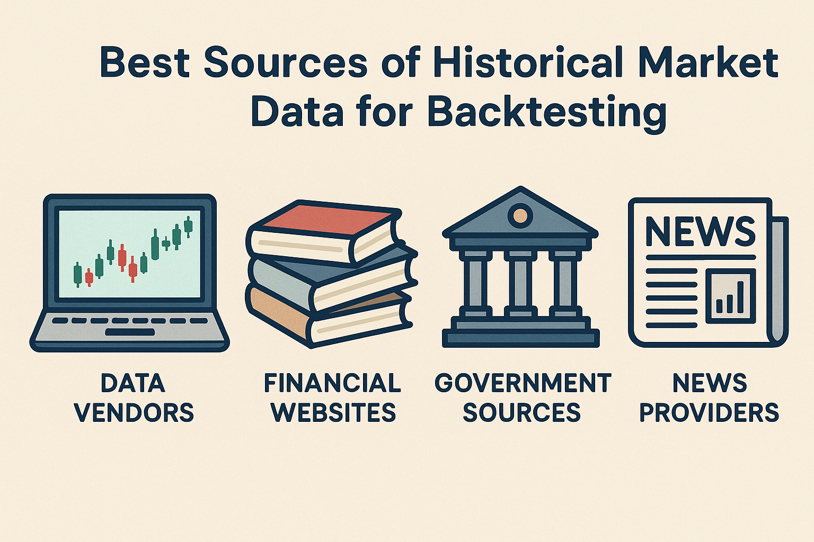

## Table of Contents

Retail traders looking to backtest trading strategies need reliable historical market data. High-quality data across equities, forex, crypto, and futures is essential for building and testing quantitative strategies. This article explores the best sources of historical market data – both free and paid – with a focus on backtesting and quantitative strategy development. We’ll compare popular data vendors and platforms (e.g. Yahoo Finance, Nasdaq Data Link (Quandl), Alpaca, Binance, Tiingo, Polygon.io, Bloomberg, etc.), covering data formats, frequency, cost, ease of use, and licensing. By the end, you’ll know the pros and cons of each provider and get tips on choosing the right data source for your trading goals and budget.

## Free vs. Paid Historical Data Sources: An Overview

When it comes to historical market data, retail traders have a spectrum of options from completely free datasets to premium institutional feeds. Free data sources (like Yahoo Finance or exchange APIs) are budget-friendly and often sufficient for basic backtests, but they may come with limitations in data quality, depth, or convenience. Paid data providers (like Polygon.io or Bloomberg) offer more comprehensive and cleaner data – often including intraday tick data, long history, and fundamental metrics – at a cost. The choice depends on your strategy’s needs and budget:

- **Data Frequency & Depth:** If you need intraday or tick-level data (for high-frequency or intraday strategies), free sources might be limited or harder to use. Paid services often provide extensive intraday history. For end-of-day (EOD) strategies, many free sources suffice.
- **Data Quality:** Free data can have quality issues. For example, users have noted discrepancies in Yahoo Finance’s adjusted prices (e.g. inconsistent dividend adjustments). Premium providers like Bloomberg ensure corporate actions are correctly applied.
- **Access & Ease of Use:** Free sources may require more DIY effort (manual downloads, multiple API calls, or data cleaning). Paid platforms often provide polished APIs, documentation, and customer support, saving time.
- **Cost Considerations:** Always weigh whether a free provider is sufficient or if a paid plan is necessary for your strategy’s complexity. Many retail traders start with free data for backtesting long-term trends, while hedge funds or advanced quants with real-time needs invest in premium feeds.

Below, we break down the top data sources across asset classes – noting their formats, coverage, pros, cons, and costs – followed by a comparison table and tips for choosing the right source.

## Yahoo Finance – Free End-of-Day Stock Data (and More)

Yahoo Finance is a popular go-to for free historical data on equities (stocks, ETFs, indices), and it also provides data for some currencies and cryptocurrencies. Yahoo’s website lets you view price history and download it as CSV. It covers decades of daily data for many stocks and even includes basic fundamental figures (e.g. P/E ratios, earnings) and news headlines.

**Data Access & Formats:** You can manually download CSV files from Yahoo Finance’s “Historical Data” tab. However, note that as of 2024, Yahoo has restricted direct downloads to paid users – its Yahoo Finance Gold plan (~$500/year) is now required to export historical data via the website. Many retail traders formerly relied on Yahoo’s free downloads, so this change was disruptive. Alternatively, developers often use unofficial APIs or libraries like yfinance (in Python) to fetch Yahoo data programmatically (these methods simulate what the website does and are still free). Data is typically retrieved in JSON or CSV format via these APIs.

**Asset Classes & Coverage:** Primarily equities and ETFs (U.S. and international), major indices, and some forex pairs (as “currency” tickers like EURUSD=X) and crypto (a limited set of crypto tickers, e.g. BTC-USD). Yahoo’s equity data usually includes adjusted close prices accounting for splits/dividends. Be cautious: some users report that Yahoo’s adjustments for dividends can be inconsistent, which can affect backtests if not corrected.

**Data Frequency:** Daily data is Yahoo’s strong suit – many stocks have 20-30+ years of daily prices. Intraday data is available, but with limitations. Yahoo provides intra-day intervals (1-minute, 5-minute, etc.) for recent history only (up to ~30-60 days of intraday history, depending on the interval). For example, 1-minute bars can only be fetched for the last week or so, and up to 60 days for hourly bars. There is no tick-by-tick trade data from Yahoo, just OHLCV bars.

**Cost & Licensing:** Yahoo’s data is free for personal use. The new Yahoo Finance Premium/Gold plans that unlock bulk downloads also bundle other features (advanced charts, research reports, etc.). If you use unofficial methods (like an API library) without a subscription, it’s effectively free, but keep usage moderate to avoid hitting any undocumented rate limits. Data is provided for personal analysis; redistribution is not allowed.

**Pros:** Yahoo Finance is ubiquitous and easy to use – it’s often the first stop for quick historical price checks. Coverage of U.S. equities is broad, and data includes adjusted prices and even some fundamentals and news. The interface (or yfinance library) makes it easy to get a CSV of daily prices for a stock in seconds.

**Cons:** The recent move to paywall CSV downloads is a drawback for non-programmers. Intraday data is very limited in depth (not suitable for serious intraday strategy backtests). Data quality, while decent for free, can occasionally have errors or missing days, and as noted, dividend/split adjustments might require verification. Also, Yahoo’s data is delayed (not for live trading use) – fine for historical backtests, but keep in mind if you ever pull near-real-time quotes, they lag.

In summary, Yahoo Finance is great for free daily historical data on stocks and ETFs, making it useful for backtesting longer-term strategies. Just be prepared to use a library or pay for Premium if you need to download a lot of data regularly. And double-check data accuracy (especially around corporate actions) or use another source to confirm critical values.

## Alpha Vantage – Free API for Stocks, Forex, and Crypto

[Alpha Vantage](https://www.alphavantage.co/) is a popular free API that provides historical and real-time data for multiple asset classes. It’s often cited as one of the best free data sources for developers and quant enthusiasts. Alpha Vantage covers equities, foreign exchange, cryptocurrencies, commodities, and even options data in a unified way. This broad coverage makes it attractive for retail traders who want a single API to fetch diverse datasets.

**Data Access & Formats:** The service is accessed via a REST API, requiring a free API key (which anyone can obtain by signing up). Data is returned in JSON by default, and CSV output is also available for certain endpoints. Alpha Vantage provides extensive documentation and code samples, and there are official/unofficial SDKs for Python, R, JavaScript, etc., making integration easy. They also offer Excel and Google Sheets add-ins for pulling data directly into spreadsheets.

**Asset Classes & Coverage:** Alpha Vantage has global equities (it sources data from exchanges worldwide, including U.S. stocks licensed from Nasdaq), forex currency pairs (both major and minor pairs), cryptocurrencies (with data for hundreds of crypto assets against fiat or BTC), and some commodity prices. In 2023, they also introduced options data (e.g. OPRA feeds for U.S. options). Beyond prices, Alpha Vantage provides technical indicators (50+ indicators can be queried via API) and some fundamental data (company financials, macroeconomic indicators like GDP, inflation, etc.). This is valuable for strategy research that might combine price and fundamental or economic data.

**Data Frequency:** Alpha Vantage offers daily historical prices for equities going back decades (often 20+ years for U.S. stocks). Intraday data is available in intervals from 1-minute up to 60-minute. However, free accounts are limited in how much intraday data you can pull per request (their API returns either the “last X intervals” or up to a certain time span). Typically, you can get the last few weeks of 1-minute data; for longer intraday history, you might need to use the premium tiers or stitch multiple calls. There is no tick-by-tick data (intraday is in aggregate bars). For forex and crypto, intraday (minute) and daily series are available similarly. Technical indicator API responses can be daily or intraday as well.

**Cost & Licensing:** The Free Plan is quite generous: up to 5 API requests per minute and 500 per day. This is sufficient for many backtesting needs (you could download daily data for hundreds of symbols over a day or two). If you need more, Alpha Vantage offers premium plans: e.g. a $49.99/month plan with higher rate limits (up to 75 requests/min) and no daily cap, and higher tiers for enterprise needs. The data itself remains the same; you’re mostly paying for speed and volume of API calls. For most retail traders, the free tier is enough to start. Data is licensed for personal or internal use; using it to redistribute or for commercial purposes would require a commercial license (beyond typical retail usage).

**Pros:** Alpha Vantage is developer-friendly and covers a lot of ground in one API. It’s an excellent one-stop-shop for a retail quant: you can fetch U.S. stock prices, forex rates, crypto prices, technical indicators, and even macro data without juggling multiple services. The documentation and ease of use are frequently praised. Another big plus is the affordability – the free plan’s limits are more generous than some competitors (for example, 500/day is more generous than many freemium APIs). The premium plans are also reasonably priced for the amount of data access, scaling up to professional levels if needed.

**Cons:** Being a free service, Alpha Vantage enforces rate limits that can slow down heavy data gathering (500 data calls per day on the free tier means you may need to space out large downloads). Intraday history depth is somewhat limited on free plans – if you need years of minute-by-minute data, you might have to upgrade or use another source. Also, while data coverage is broad, it may not be as institutionally clean as Bloomberg or Reuters data (e.g., corporate actions are handled well, but for very precise needs you’d want to verify critical values). Another consideration: Alpha Vantage’s stock data is good for U.S. markets, but for some international exchanges the data might be end-of-day only or less granular. Always verify if the exchange you need is supported. Lastly, because it’s popular, there is occasional downtime or slowness during peak times (though generally reliability is good).

Overall, Alpha Vantage is a top choice for retail traders starting with backtesting. It provides a wide variety of data for free, in convenient formats, and has an upgrade path if your needs grow. It’s especially useful if you want to combine market data with technical indicators or fundamentals easily, since those are integrated into the API.

## Alpaca – Free API for U.S. Stocks (Plus Crypto & More)

[Alpaca](https://alpaca.markets/) is an electronic brokerage platform known for its API-first trading approach. In addition to enabling commission-free stock trading via API, Alpaca offers a Market Data API that provides historical data. For retail algorithmic traders focusing on U.S. equities, Alpaca’s data API is an attractive option because it’s free for sign-up users and well integrated with their trading platform. They have also expanded into crypto data, and even offer some options and forex data via the same API.

**Data Access & Formats:** You’ll need to sign up for a free Alpaca account (no funding required for data access). Alpaca provides RESTful APIs and an official Python SDK (alpaca-py) for accessing data. Data is returned in JSON. They support streaming via WebSockets for live data as well. The API endpoints cover historical bars (candles), as well as trades and quotes for more granular needs. The Market Data API is segmented by asset class (there are endpoints for stocks, crypto, etc., under one umbrella). Notably, you don’t need an Alpaca brokerage account to use crypto data endpoints – those are publicly accessible without API keys in some cases , though using an API key lifts limits.

**Asset Classes & Coverage:** Alpaca’s primary coverage is U.S. stocks and ETFs. They cover essentially the entire U.S. stock market (all major exchanges). Until recently, free users were limited to IEX exchange data for real-time prices, but for historical data, Alpaca now provides full market (SIP consolidated) data with a 15-minute delay for free. This means you get 100% market coverage of trades for historical bars on U.S. equities, just not real-time unless you upgrade. Alpaca also supports cryptocurrencies (they list 20+ crypto assets) and has data for options on U.S. stocks, as well as some forex data. In practice, their stock data is most mature, and crypto data is continuously improving (they allow crypto trading on their platform, so they provide crypto market data too).

**Data Frequency & History:** For stocks, Alpaca provides up to 7+ years of historical data on the free plan  – this includes daily bars and intraday bars. Intraday data is available at least to the 1-minute level (possibly lower; their API also can return individual trades, but free users may mainly use minute bars). You can query minute-by-minute stock prices for multiple years, which is quite powerful for backtesting. Tick-level data (individual trade or quote data) is available, though heavy use of that may require the higher-tier plan. Alpaca’s free plan covers intraday bars and daily bars for U.S. equities, updated through the previous trading day (and continues to update daily). For crypto, you can get minute-level historical data and daily data; since crypto trades 24/7, Alpaca’s data covers those continuous sessions. They do not impose a short lookback window like some free sources do – you can get the full 7-year history of minute bars for a stock in one go (the main limit is rate limits on API calls and how much data per call, but not a tiny window like Yahoo’s 60-day intraday limit). The Algo Trader Plus paid plan ($99/mo) offers real-time full SIP feed and higher call limits, but for backtesting, the free Basic plan is usually enough.

**Cost & Licensing:** The Basic plan is $0/month. This gives you 200 API calls per minute and up to 7 years history, as noted. The only real restriction is that real-time stock quotes are IEX-only (which is fine for backtesting since you’re using historical data). Also, WebSocket streaming is limited to 30 symbols at a time on free tier , but that’s not relevant for pulling historical data. If you did want higher throughput or real-time across all exchanges, the $99/mo plan increases rate limits (10,000 calls/min) and gives true real-time on all exchanges. Data from Alpaca is intended for personal trading and development; using it commercially would fall under their terms for “professional use” which requires contacting them or being a partner. For a retail trader backtesting their own strategies, there’s effectively no cost.

**Pros:** For U.S. stock traders, Alpaca is a fantastic free resource. You get a large historical dataset (multiple years of minute bars and daily bars) with full market coverage (meaning the data reflects all exchanges, ensuring accuracy). It’s fairly easy to use via API, especially if you’re already using Alpaca for paper trading or live trading – you can seamlessly use the same API for data. Crypto data being available is a bonus (you can backtest crypto strategies without needing a separate exchange API). Another pro is that Alpaca’s data includes corporate actions info and adjustment factors, and covers corporate actions (splits, dividends) explicitly in the API , which helps ensure backtests use adjusted prices. Since Alpaca is a broker, using their data can be a stepping stone to live trading (you backtest with their data and can execute through them if desired).

**Cons:** Alpaca’s data is limited to U.S. markets for equities (no international stock exchanges). If you trade outside the U.S., this won’t help for those equities. The historical depth, while good for intraday backtesting, is not as deep as some paid datasets (e.g. 7 years of minute data – if you needed 20 years, you’d need another source). For tick-by-tick analysis, Alpaca’s free service might not be sufficient – you may get trades data in small windows but it’s not designed as a tick data repository for unlimited use. Also, because it’s an API, you’ll need to write code; there’s no web interface to download bulk data as CSV (though one could use the API to export to CSV manually). Another minor con is that you have to sign up and obtain API keys – a small hurdle compared to truly “open” sources. And while Alpaca’s data is generally reliable, there may be occasional gaps or issues especially if you query a huge amount of data in one go (some users might hit rate limits or need to paginate through time).

In summary, Alpaca’s Market Data API is an excellent free resource for retail traders focusing on U.S. stock and crypto strategies. It provides intraday and daily data suitable for serious backtesting without the cost barrier. If your strategies revolve around U.S. equities or popular cryptos, Alpaca can cover your data needs from testing through to implementation.

## Binance API – Free Cryptocurrency Market Data

For cryptocurrency traders, exchange APIs are often the best source of historical data. [Binance](https://www.binance.com/en/binance-api), being one of the largest crypto exchanges globally, offers an extensive and free historical data via its API. Retail traders interested in backtesting crypto strategies (on Bitcoin, Ethereum, altcoins, etc.) can leverage Binance’s data for accurate price history.

**Data Access & Formats:** Binance provides a public REST API (as well as WebSocket streams for live data). The REST API includes endpoints for historical klines (candlesticks), trades, and other market data. Data is returned in JSON. The candlestick endpoint allows you to specify symbol, interval (e.g. 1min, 5min, 1h, 1d), and date range, and will return OHLCV data. By default it returns up to 500 or 1000 data points per call, but you can loop calls to get the full history. Binance’s API is free to use; for higher rate limits you might need an API key (which is free to create on their exchange). There are also third-party solutions like Binance Data Collection that aggregate Binance’s data into downloadable files , or sites like CryptoDataDownload that provide Binance historical data in CSV format for convenience.

**Asset Classes & Coverage:** Binance’s data covers cryptocurrencies – specifically, all trading pairs listed on Binance (the main global exchange). This includes hundreds of crypto assets and their trading pairs (e.g. BTC/USDT, ETH/BTC, etc.). Data for spot markets is commonly used. Binance also has separate APIs for futures markets data (USDS-M futures, COIN-M futures) which can be accessed similarly if you are backtesting futures contracts on crypto (those are perpetual swaps or quarterly futures). The focus here is on spot crypto prices, which suffice for most retail backtests. Binance does not provide stock or forex data – it’s purely crypto.

**Data Frequency & History:** Binance’s API is very powerful in that it offers multiple granularities:
- Tick-level trades: You can query recent trades or use the older “aggregate trades” endpoint to get every trade that happened. However, pulling an entire history of individual trades for a busy symbol like BTC/USDT can be extremely data-heavy (millions of trades). Most users will prefer the candlestick data for backtesting.
- Candlesticks: Intervals range from 1 minute up to 1 month. 1-minute bars are commonly used for strategy testing. Binance has historical data from its start (mid-2017 for many major coins) up to the present. For example, you can get minute-by-minute price bars for BTC/USDT from 2017 through today.
- Because crypto markets operate 24/7, you get continuous data (no off days, except for pairs that started trading later).
- The API requires iterating if you want very long histories (e.g., 1000 data point limit per call means ~16 hours of 1min data per call, so to get years you’ll loop many calls). Some users instead download official monthly CSV dumps provided by Binance or use third-party aggregated files to save time.

**Cost & Licensing:** Binance’s data is free. There are API rate limits (e.g., weight per request, and number of requests per minute depending on the endpoint) , but no direct fees. With an API key, you typically get a higher call limit than if you call as an anonymous user. The data can be used for personal analysis freely. There are no licensing fees for using historical data; Binance even encourages developers to build with their API. If you plan to redistribute or resell the data, that would likely violate terms, but for backtesting and research you’re in the clear.

**Pros:** Binance API offers granular and comprehensive crypto data at no cost. You can get tick-level precision or OHLCV bars easily, which is fantastic for testing anything from high-frequency crypto strategies to longer-term ones. The data is of high quality (coming directly from the exchange). Another pro is the huge number of trading pairs – if you want to backtest on obscure altcoins, Binance likely has the history (though be cautious: very illiquid coins can have erratic data). The community has also built many tools and wrappers (Python’s python-binance library, for instance) to simplify using the API.

**Cons:** One limitation is that Binance only reflects its own exchange. If you want a more aggregated view of the crypto market (across exchanges), you’d have to combine data from multiple exchange APIs or use a service like CoinAPI (which is paid) or CryptoCompare. For most retail purposes, using one major exchange is fine, but just note that prices can vary slightly between exchanges. Also, retrieving very large datasets via API can be time-consuming due to rate limits – for example, pulling 5 years of 1-minute BTC data means thousands of API calls. This can be mitigated by using the bulk download sources Binance provides (they publish downloadable files of historical data). Another con is that data cleaning might be needed: crypto data can have anomalies (exchange outages, data spikes) that you should be prepared to handle. Binance data does not include on-chain data or fundamentals – it’s strictly market prices and volumes, so if your strategy needs other info, you’d need additional sources.

In summary, Binance’s API is an excellent free source for historical crypto market data. It’s perfect for retail traders developing crypto trading algorithms, providing all the price history needed for backtesting. Just be mindful of the scope (exchange-specific) and the effort required to download and manage large time series if your strategy demands fine granularity.

## Nasdaq Data Link (Quandl) – Marketplace for Diverse Datasets

[Nasdaq Data Link](https://www.nasdaq.com/solutions/data/nasdaq-data-link) (formerly Quandl) is a platform that hosts a vast range of financial and economic datasets. Unlike single-source providers, Nasdaq Data Link is more of a data marketplace/portal: it offers data from many different sources (exchanges, data vendors, universities, etc.) through a unified API. For a retail trader, Data Link/Quandl can be a treasure trove of both free and paid datasets relevant to backtesting, especially if you need something beyond basic price history.

**Data Access & Formats:** Data Link provides a REST API and also the ability to download data as CSV. You can query a specific dataset by its identifier. They also have libraries (like Quandl Python package, now Nasdaqdatalink package) and integration with tools like Excel. The format is typically tabular (CSV or JSON). Because Data Link aggregates many sources, each dataset might have its own structure (some are time-series, some are tables with multiple fields). The API is free to use for free datasets (just register for an API key), and works similarly for paid data (you need a subscription to access those endpoints).

**Asset Classes & Coverage:** It depends on the dataset. This is the key: Nasdaq Data Link has datasets covering equities, futures, forex, commodities, options, cryptocurrencies, economic indicators, sentiment data, alternative data, and more. For example:
- They host historical stock price databases such as the “Wiki” dataset (which was a community-maintained EOD stock price dataset up to 2018) and others like Sharadar’s US Equity database (which is paid and includes clean historical prices with fundamentals).
- They offer futures data: notably, the Wiki Continuous Futures (CHRIS) database, which provides continuous price series for hundreds of futures contracts (built from individual contract data) – and this dataset is free. It has ~50 years of history for many futures, compiled from sources like CME, ICE, etc. For someone backtesting commodity or financial futures, this free continuous data is extremely valuable.
- Forex: There are datasets like currency exchange rates (some free, some paid).
- Cryptocurrency: Quandl had some crypto datasets (e.g. Bitcoin prices from various exchanges, some free, some premium).
- Macro/Economic: Data Link includes integration with sources like FRED (Federal Reserve Economic Data) for interest rates, GDP, etc. (FRED is free).
- Alternative data: They have premium datasets like sentiment indices, social media analytics, etc., which might be of interest for advanced strategy research (these are usually paid).
In short, Nasdaq Data Link/Quandl covers almost every asset class in some form – but you have to find the specific dataset for your needs.

Data Frequency: Again, it varies by dataset. Many stock and futures datasets are daily frequency (e.g., end-of-day prices). Some premium offerings provide intraday data (for instance, there were premium intraday stock datasets and options price datasets). The free continuous futures (CHRIS) data is daily. Economic data might be monthly or quarterly, etc. If you need minute or tick data via Data Link, it typically requires a premium subscription to a provider that offers that (e.g., Intrinio or others used to list data via Quandl). For example, there was a Nasdaq data product for intraday US stock prices but at a cost. Most retail traders using Data Link will likely leverage the daily data (since intraday from other sources like Alpaca or Polygon might be easier). One benefit is Data Link often provides long history – some datasets go back decades (especially economic and futures data).

**Cost & Licensing:** Nasdaq Data Link offers both free and premium datasets. Many datasets are completely free – you just use your API key to download them. For instance, the Wiki Continuous Futures database mentioned is free and open. FRED data (macroeconomic) is free. However, a lot of specialized data is premium (paid). Premium datasets range widely in price – some are $10-$50/month for niche stock data, others are thousands per year for institutional-grade info. If you search their catalog, you can filter by free vs premium. Premium Quandl datasets include things like official exchange data (e.g., end-of-day data directly from Tokyo Stock Exchange, or minute data from Nasdaq), or proprietary datasets like quantitative sentiment indicators. Each has its own license terms, but generally for paid data you’re allowed to use it internally; redistribution is prohibited. Free datasets often have more open terms (some are even sourced from public domain). Nasdaq Data Link provides a uniform API experience for both, which is nice.

**Pros:** The biggest advantage of Data Link/Quandl is the breadth of data available. It’s one of the few places a retail trader can access, say, 50 years of continuous futures prices for free , or get fundamental data merged with price data (via certain databases), or pull in macro data to incorporate into a strategy. It’s great for quants who want to explore alternative data or less-common markets without negotiating with multiple vendors. The API is straightforward, and you can download entire datasets in one go (especially if using Python, you can just data = nasdaqdatalink.get("DATASET/CODE")). Another pro: data quality can be high for curated datasets – for example, the premium stock databases often clean corporate actions, include delisted stocks (avoiding survivorship bias), etc., which is crucial for accurate backtests.

**Cons:** The main downside is that for up-to-date price data on stocks or common instruments, free offerings are limited. Quandl’s once-free “Wiki” stock price dataset stopped updating in 2018 (Nasdaq stopped supporting it as free). So if you want current daily stock data, you’ll likely need a premium dataset (or use another source like Yahoo/Alpha Vantage). Essentially, while Data Link is a rich source, using it for bread-and-butter price history might require paying (e.g., Sharadar’s daily US stock data costs money). Another con is inconsistency between datasets – since they come from different providers, the format and coverage can vary. You might have to do some work to integrate multiple datasets (like matching a stock price series from one source with a fundamental series from another). Also, intraday data on Data Link can be expensive – if your strategy needs minute-level data for thousands of stocks, a service like Polygon might be more cost-effective than trying to piece it together on Data Link. Finally, Data Link’s user interface can be a bit daunting – it’s geared more towards programmatic access, so discovering what’s available requires searching their site or documentation.

In summary, Nasdaq Data Link (Quandl) is a powerful resource for backtesters, offering both mainstream and exotic datasets. It’s especially useful if you need futures data, economic indicators, or other specialized data to augment your strategy. For pure price history of stocks or crypto, it might not be the first choice unless you specifically need their curated databases. Many traders use Data Link in combination with other sources (e.g., using free APIs for recent prices but Quandl for long historical or fundamental data).

## Tiingo – Affordable Data for Stocks, Forex, and Crypto

[Tiingo](https://www.tiingo.com/) is a financial data provider that offers a blend of free and low-cost data services, tailored to retail and indie quant developers. It provides historical data for stocks, ETFs, mutual funds, cryptocurrencies, and FX, along with news feeds and some fundamental data. Tiingo is known for its focus on data quality and for offering an alternative to free sources like Yahoo with a relatively low subscription fee.

**Data Access & Formats:** Tiingo’s data is accessible via a well-documented REST API. You can get data in JSON or CSV (by appending a format parameter). There are also libraries and wrappers (e.g., tiingo-python or using pandas_datareader which supports Tiingo ). Tiingo’s website itself is more focused on providing tools and charts to subscribers, but for backtesting, you’ll primarily use the API to pull data into your own analysis environment. Setting up an API key (free with registration) is required. They also provide Excel/Google Sheets integration via API if needed.

**Asset Classes & Coverage:** Tiingo started with U.S. equities and has a very comprehensive stock price database (50+ years of history for U.S. stocks in many cases ). It covers tens of thousands of global securities (including international markets to some extent, though U.S. is the core). It includes broad coverage of ETFs and mutual funds as well. In addition, Tiingo offers crypto data – they aggregate data from over 40 crypto exchanges and cover 2000+ crypto pairs. They also provide forex data for 40+ currency pairs, sourced from tier-1 banks and FX pools. Essentially, Tiingo tries to cover the main assets a retail trader might need: stocks (with corporate actions handled), crypto, and FX. They do not explicitly offer futures data in their standard service, which is a notable gap if you need futures (though one could get ETF proxies or similar).

Beyond pricing data, Tiingo has a news API that provides curated news articles and even a sentiment analysis feed, and a fundamentals API (in beta in past) for company financials. These are more supplementary for strategy research (e.g., one could backtest news sentiment strategies using their data).

**Data Frequency & History:**

- **For stocks:** Tiingo provides end-of-day (daily) data going back several decades for U.S. stocks. They ensure historical completeness (including delisted companies in their dataset, to avoid survivorship bias). Data is typically updated daily after market close. They incorporate splits and dividends into an adjusted close series, and also offer unadjusted prices if needed.
- **Intraday data:** Tiingo offers intraday price data for equities via IEX. Free accounts historically could get IEX intraday prices (minute bars) for recent days. With a paid subscription, you can access extended intraday history. Tiingo’s API has endpoints for historical intraday bars for a given stock and day. However, note that IEX is a single exchange (albeit a decent proxy for overall market moves). Tiingo might also incorporate other sources for intraday now, but originally they partnered with IEX for real-time data.
- **For crypto:** Tiingo’s crypto feed includes intraday (minute) bars and daily prices for all supported coins. Since they aggregate multiple exchanges, their data might represent a composite price.
- **For forex:** They provide intraday and daily data, likely minute bars and daily rates.

In terms of history length: Stocks have 30+ years (even 50 in some cases) daily , intraday for at least a few years where available. Crypto depends on when the coin started trading, but Tiingo had data since around 2013 for Bitcoin, etc., and since inception for others. FX data goes back years as well.

**Cost & Plans:** Tiingo operates on a freemium model:

- **Free access:** By registering, you get an API key that allows a limited number of API calls (historically, it was 1,000 calls/day and 50/hour , and up to 500 unique symbols per month ). Free users have access to daily price data for stocks (and crypto/forex), but not to the full news or fundamental feeds. It’s enough to do a decent amount of backtesting on daily data if you stay within limits.
- **Premium (Paid) access:** Tiingo’s individual subscription was long priced at $10/month (called the “Power User” tier). That gave much higher limits (e.g., 50k calls/day)  and access to news and fundamentals. However, as of 2025, Tiingo’s pricing page indicates $30/month for individuals  (perhaps reflecting an expanded feature set and rising costs). Even at $30, it’s relatively affordable. They also offer a $50/month plan for commercial/internal use with higher limits. All paying users get real-time IEX stock prices and extended intraday history.
- Both tiers are for internal/personal use only (no redistribution). For commercial licensing (like embedding data in an app), one must contact Tiingo for custom packages.

**Pros:** Data quality and completeness is a major pro for Tiingo. They pride themselves on cleaning data from multiple sources and filling gaps. For example, they use 3 different exchanges to cross-verify U.S. stock prices and ensure errors are fixed. This means fewer bad ticks or missing days compared to some free sources. Also, Tiingo’s inclusion of delisted securities and long history makes it excellent for backtesting strategies over many years (you won’t accidentally ignore companies that went bankrupt, etc.). The coverage of crypto and FX alongside equities is convenient – you can get all from one API. Another pro is that Tiingo provides some value-added data like sentiment scores from news, which you generally won’t get from purely price-focused APIs. And importantly, cost: Tiingo gives a lot of data for a relatively low price, bridging the gap between free sources and expensive vendors. It’s often recommended in the quant community as a reliable alternative to scraping Yahoo or paying much higher fees elsewhere.

**Cons:** For completely free usage, Tiingo’s limits might feel restrictive if you have a very large number of symbols or need intraday data – you might quickly hit the cap of 500 symbols/month or the daily call limit. Most serious users will end up paying the subscription, which, while not expensive, is still a consideration if you truly want a no-cost solution. Another con is that intraday data is limited to IEX feed for U.S. stocks, which doesn’t include trades from all exchanges (so volume and possibly some price moves might not be fully represented; though for many purposes IEX intraday is fine). If you need tick data or full-depth intraday, Tiingo is not the solution (they focus on minute bars and daily data). Also, Tiingo doesn’t cover futures or options prices in its standard offering, which means multi-asset strategies involving futures would require another source. Lastly, the platform is smaller than some competitors, so while support is generally good, you don’t have the huge community or dozens of client libraries that something like Alpha Vantage has – but it’s growing.

In summary, Tiingo is an excellent choice for retail traders who need high-quality end-of-day stock data and an affordable path to intraday and multi-asset data. It offers a nice balance between free and paid, and it emphasizes clean data – which can save you headaches in backtesting. If your strategy spans stocks, crypto, and FX, Tiingo can handle all three under one account, which is very convenient.

## Polygon.io – High-Resolution Market Data API (Stocks, Crypto, & More)

[Polygon.io](https://polygon.io/) is a popular data platform that provides real-time and historical market data with a focus on U.S. markets. It is known for offering low-latency APIs and extensive historical data, including tick-by-tick data, which sets it apart from many retail-focused services. Polygon covers U.S. equities, options, indices, forex, and crypto through different API endpoints, making it a comprehensive solution for a wide range of assets.

**Data Access & Formats:** Polygon is entirely API-driven, offering both RESTful APIs and WebSocket streams. Data is returned in JSON, and CSV downloads are supported for bulk data needs. The API is well-documented, and they provide client libraries for several languages. One standout feature is that Polygon’s APIs are very granular – you can request aggregated bars (minute, hourly, daily) or raw ticks (every trade and quote) for stocks and options. This granularity is one reason serious quants use Polygon for backtesting high-frequency strategies. The platform requires an API key, and they have tiered plans that determine your access level.

**Asset Classes & Coverage:**

- **Stocks (Equities):** Polygon covers the entire U.S. stock market (all exchanges). This includes equities and ETFs. For stocks, you can get trades and quotes data, minute bars, daily bars, etc., and even historical order book snapshots at certain tiers.
- **Options:** They provide options price data for U.S. options markets, which is relatively rare to find via API. This includes options chains, Greeks, and trades/quotes.
- **Indices:** Polygon has data on major indices (like S&P 500, Nasdaq indices, etc.), which can be useful for benchmark comparisons or index-based strategies.
- **Forex:** They offer FX data (majors, minors, probably sourced from aggregators or forex ECNs). Forex coverage is global currency pairs.
- **Crypto:** Polygon covers crypto markets as well – they aggregate from multiple crypto exchanges to provide trading data for cryptocurrencies.
- **Futures:** As of recent updates, Polygon has also added some futures data (especially via their integration with real-time feeds), but this might require higher-tier plans or specific subscriptions.

Essentially, Polygon positions itself as a one-stop API for all market data needs – similar in breadth to institutional feeds, but accessible via cloud APIs.

**Data Frequency & History:** This is where Polygon shines:

- They provide tick-level data for equities: every trade and quote on U.S. exchanges, with history. For example, you can query all trades for Apple on a particular date. This is crucial for backtesting strategies that require seeing the order flow or simulating order execution. Not many retail-friendly services offer this.
- They also provide aggregated bars: 1-minute bars, hourly, daily, etc., which are easier to work with for many strategies. You can specify the timeframe and Polygon will return candlesticks.
- History length depends on the subscription tier: the free (Basic) plan gives 2 years of historical data (and only end-of-day data on that plan). The “Starter” plan ($29/mo) gives 5 years of history (with minute-level aggregates). The “Developer” plan ($79/mo) extends to 10 years of history and includes second-level aggregates and trades data. The “Advanced” plan (~$199/mo) provides 20+ years of historical data and real-time data with full tick coverage. So, if you need decades of intraday history (e.g., minute bars for 20 years, or tick data for 10+ years), you’d be looking at the higher tiers.
- Options data history is usually not as long (because options expire), but they have historical options for past contracts as well, enabling backtesting options strategies.
- Forex and crypto data on Polygon likely have several years of history as well (crypto from around 2017 onward, and FX possibly further).

**Cost & Plans:** Polygon.io is a paid service with tiered pricing, but it also has a free tier:

- **Free (Stocks Basic):** $0/month, which allows 5 API calls/minute, 2 years historical (EOD and minute aggregates). It’s mainly to try out the service. You get end-of-day data and limited intraday for a couple of years, which might be enough for simple strategies.
- **Starter ($29/mo):** Unlimited calls, 5 years history, 15-min delayed realtime, minute bars, etc..
- **Developer ($79/mo):** Unlimited calls, 10 years history, delayed realtime, access to trades and second-level data.
- **Advanced ($199/mo):** 20+ years history, real-time (tick data live), includes full trades/quotes, etc..
- They also have separate packages/tabs for options, FX, and crypto, which might be similarly priced. For instance, crypto might have its own free tier and paid tiers, etc. They often allow mixing packages if you need multi-asset.
- Note: These plans are typically for non-professional (individual) use. For business use (embedding in a product), they have enterprise pricing.

**Pros:** Polygon.io’s biggest advantage is depth and granularity of data. If your backtesting demands high-resolution historical data (ticks, bid/ask spreads, etc.), Polygon is one of the best in the retail-accessible space. It essentially offers capabilities that approach what institutional feeds provide  (in fact, many small fintech companies use Polygon as an alternative to directly subscribing to exchange feeds). The API is robust and fast, suitable for programmatic strategy evaluation. Another pro is the breadth of markets – you can get stocks, options, crypto, FX all in one account, which is convenient. Polygon’s data includes things like corporate actions, reference data (like ticker info), and even fundamental data (they have an endpoint for company financials and analyst estimates in some plans). So it’s not just raw prices. The reliability and support are generally solid given it’s a paid service with a tech-savvy user base.

**Cons:** The obvious con is cost – to unlock the most useful features (like long history and tick data), you need the higher-priced plans. $79 or $199 per month is a significant expense for a hobbyist trader. That said, if you don’t need tick data or real-time, the cheaper plans or free tier might suffice. Another consideration: Polygon is U.S.-centric. If you need stock data for other countries, Polygon doesn’t cover those (unlike Bloomberg or some other global data sources). For example, you won’t get European or Asian stock prices here. Also, because it exposes so much data, working with it can mean handling very large datasets (e.g., trying to load tick data for even one day of trading can be millions of records). That requires some technical prowess in data handling. A minor con: the free tier is quite limited in call rate (5/min) , so it’s really just for testing – you’d upgrade if you commit to using it. Lastly, licensing: data is for personal use; if you start to share it or build a commercial app, you’d need a different license, which can be costly.

In summary, Polygon.io is an excellent choice for retail traders who need institutional-grade historical data, especially for U.S. markets and intraday strategies. If your strategy requires examining each trade or simulating intraday orders, Polygon likely has the data you need. It does come at a price, but for serious quantitative strategists, it can be well worth the cost given the depth of history and detail provided.

## Interactive Brokers API – Multi-Asset Data for Account Holders

Many retail traders use [Interactive Brokers (IB)](https://www.interactivebrokers.co.uk/fr/trading/ib-api.php) for trading due to its global market access and low commissions. IB isn’t primarily a data vendor, but if you have an IB account (even a free paper trading account), you can use their API to retrieve historical data on a wide range of assets. This can be a cost-effective way to get data for backtesting, especially for asset classes like futures or international stocks where dedicated data sources can be pricey.

**Data Access & Formats:** Interactive Brokers offers several APIs (Python, Java, C++, etc.) to connect to their Trader Workstation (TWS) or IB Gateway. Through these APIs, you can request historical data for a given instrument. The data is returned in a structured format (typically as plain text lines that your API client parses into objects; not exactly JSON/CSV, but you can convert it). There’s also an interface called IBKR Quant (essentially their Python for analysis initiative) which provides easier access for Python users. IB’s API is a bit more involved to use than a simple REST call – you run their software and your program talks to it.

**Asset Classes & Coverage:** This is where IB shines: as a broker, it provides data for stocks, ETFs, options, futures, forex, bonds, and more across global exchanges. If you want to backtest U.S. stocks, European stocks, Japanese stocks – IB has data for all if you have market data subscriptions. Similarly, IB has data for futures (CME, Euronext, etc.), which is often hard to get for retail users without paying separate vendors. Forex data (currency pairs) is available and does not require a subscription (FX data is free on IB). Crypto is one area IB only recently entered (they offer crypto trading through Paxos for a few coins, so data might be limited there). For options, IB can provide historical option prices (though one contract at a time, and limited history per contract), which is useful for options strategy backtesting if managed carefully.

**Data Frequency & Limitations:**

- IB provides intraday data and daily data. However, the history available and the granularity depend on the bar size requested. The rule of thumb: IB can provide up to 1 year of historical data for daily bars, and for intraday, the max history depends on the bar size (e.g., you can get perhaps a few months of 1-minute bars, a week of tick data, etc.). There are known limitations: for example, IB’s API won’t give you more than 1 year in a single request for daily, and intraday requests have shorter lookbacks (the IB API documentation notes, for instance, 30-second bars up to 6 months, 1-minute bars perhaps up to 1 year if chunked properly, etc.).
- **There are also pacing limits:** you can only make so many data requests per 10 minutes (IB imposes pacing of ~60 requests in 10 minutes for historical data). This means if you need data for hundreds of symbols, it will throttle.
- **Data quality:** IB’s data is generally good, but not tick-accurate for large histories. They consolidate some data (especially if you request larger bar sizes, they might be aggregated and not reflect every tiny trade). Also, IB might not give every tick – they provide “historical data snapshots”. Still, for most backtesting needs (especially daily and minutely strategies), it’s sufficiently accurate.
- **Real-time vs Delayed:** If you do not subscribe to live market data for a given exchange on IB, the historical data you pull may be delayed or limited. But IB often allows historical data retrieval even without live subscriptions (with some delay). For example, you could get yesterday’s daily bar for a stock without paying, but not the last 10 minutes of data. For deep history, it’s usually fine without live data subscriptions.

**Cost & Requirements:** There is no extra fee for using the API to get data – it comes with your IB account. However, IB’s account has monthly minimum commissions or activity fees if you have a small balance (though they removed the $10 monthly minimum recently for IBKR Lite accounts). Essentially, if you have an IB account anyway, the data feels “free”. If you’re considering getting IB just for data, keep in mind there might be inactivity fees if you’re not trading, unless you use their free tier (IBKR Lite for U.S. only, which might have some limitations). Also, to get historical data for certain exchanges (especially non-US stocks or futures), you might need to subscribe to the market data feed for at least one month to enable historical data. Those subscriptions can cost from $1 to $10+ per exchange per month. In summary, for active IB users, data is no additional cost; for others, there might be small data fees.

Licensing-wise, IB data is for personal use in trading. It’s not to be redistributed. But as a retail trader using it for backtesting, that’s fine.

**Pros:** The key advantage of IB as a data source is breadth and integration. If you already trade through IB, using it for backtesting data means you’re using the same data source for testing and live trading (consistency). It covers assets that are otherwise expensive to get – e.g., historical futures data (you can get futures daily prices back quite far, and intraday for months, which might save you from buying data from CME). It’s also one of the few ways to get historical data on a ton of international markets without paying separate vendors for each country. Forex traders can get free data on major pairs with decent quality (since IB’s forex quotes are aggregated from interbank sources). Another pro is that IB’s data includes things like corporate actions adjustments if you request adjusted data, and you can fetch fundamentals through their API (IB has an interface to Reuters fundamental data for account holders). In essence, IB is a multi-asset, global one-stop, as long as you navigate the API.

**Cons:** Using IB’s API strictly for data can be a bit cumbersome. You need to have TWS running or a gateway, handle the API connection, and manage pacing limits. It’s not as straightforward as calling a REST endpoint. The historical data requests can be a bit finicky (you have to page through time if you want more than a year, for example, by making multiple requests). Also, IB’s intraday data depth is limited – if you need years of minute-by-minute data for stocks, IB won’t give you that (it gives months, not years). Data coverage for very old history can be spotty; IB wasn’t always storing full data beyond certain periods. Another con: if you don’t already use IB, setting up an account just for data might be overkill, especially given the alternatives. And as mentioned, some data might require paying for a month of live feed (e.g., to get historical intraday for Eurex futures, you might need to activate that feed for ~$15 for a month).

In summary, Interactive Brokers is a solid “hidden” data source for those who have access. It can fill gaps for asset classes like futures and international equities for backtesting, without major additional cost. It’s particularly useful if you’re combining backtesting with live trading on IB. However, for ease of use and extensive intraday history, dedicated data services may be preferable.

## Bloomberg Terminal – Institutional-Grade Data (All Asset Classes)

No discussion of market data would be complete without mentioning the [Bloomberg Terminal](https://www.bloomberg.com/professional/products/bloomberg-terminal/), which is the gold standard for financial data – albeit one far beyond the budget of typical retail traders. Bloomberg provides everything: equities, bonds, forex, commodities, derivatives, macro data, news, and more, with decades of history and up-to-the-second updates. It’s what professionals at banks and hedge funds use for both research and trading. While not aimed at retail, it’s useful to understand what Bloomberg offers (and why most individuals seek cheaper alternatives).

**Data Access & Formats:** The Bloomberg Terminal is a proprietary software platform. Subscribers get one (or more) terminal login that runs on a PC (or via Bloomberg’s web/mobile app). Through this interface, you can query historical data (with Bloomberg’s specialized functions) and export to Excel, etc. Bloomberg also has an API (BPIPE) and an Excel add-in that allows programmatic retrieval of data into custom applications. Data can be pulled as time series, or you can use their Python API to get data into Pandas dataframes, for instance. The format is typically whatever you request (the API returns data objects, Excel returns cells, etc.). It’s not as straightforward as a REST API, but it’s extremely powerful.

**Asset Classes & Coverage:** Virtually all asset classes globally:

- Stocks/Equities: All global stock exchanges, with corporate actions, dividends, etc. They have historical data on stocks going back as far as the exchanges have (often back to the 1960s or earlier for U.S. stocks).
- Indices: All major and minor indices worldwide.
- Mutual funds, ETFs, etc.: Yes, extensive coverage.
- Fixed Income: Government bonds, corporate bonds, bond indices, yield curves, etc.
- Forex: All currency pairs, with history and real-time.
- Commodities: Futures and spot prices for commodities, historical data (including things like historical oil prices decades back, gold, etc.).
- Derivatives: Options, futures, swaps, you name it – Bloomberg has data on it, including OTC derivatives data (like interest rate swaps rates, etc.).
- Crypto: Bloomberg has added crypto pricing for major coins in recent years, though it’s not a focus.
- Economics: Thousands of economic indicators for virtually every country (often from official sources, updated in one place).
- Alternative data: Bloomberg also integrates things like news sentiment, ESG scores, analyst estimates, etc.

In essence, Bloomberg is comprehensive. If a data exists, Bloomberg likely has it or can get it.

**Data Frequency & History:** All frequencies:

- Tick data: Bloomberg provides tick-by-tick data (every trade or quote) for many instruments (though access to deep tick history might require special requests or additional fees). For equities, they can provide tick data but often require using their B-PIPE service for large scale.
- Intraday: Minute-by-minute or custom interval data is available and stored for many years, depending on the asset. For example, Bloomberg can provide intraday stock data going back 20+ years for many major stocks (this is something free sources do not have).
- Daily/Monthly/Yearly: Of course, all that and at least 40+ years on most developed market securities, sometimes more.
- Fundamentals and News: They have decades of financial statements, analyst forecasts, corporate actions, and news archives.

**Cost:** Here’s the catch – a Bloomberg Terminal costs around $24,000 per year (about $2,000 per month) for one user. If a firm has multiple terminals, the price per terminal drops slightly (e.g., two terminals might be ~$20k each). Subscriptions are leased typically in two-year contracts. This price includes basically everything (all asset classes data) except certain exchanges’ live data might have additional exchange fees. For an individual, this cost is usually prohibitive. Bloomberg does not offer a scaled-down “historical data only” package; it’s all-or-nothing. There are some programs for students or startups that might lower the cost a bit, but still in the thousands range. Clearly, this is not aimed at retail traders – it’s for finance professionals and institutions.

**Pros:** The pro is obvious: unmatched breadth, depth, and reliability. With Bloomberg, you don’t have to worry if the data is clean or complete – it generally is. Corporate actions are flawlessly adjusted , dividends, spinoffs, ticker changes, all accounted for. You also get data on obscure things you wouldn’t find elsewhere. Need the 1985 price of a small-cap stock or the historical yield of a rare bond? Bloomberg likely has it. The Terminal also integrates news and analytics, which means you can research a strategy in a holistic way (seeing how news impacted prices, etc.). For backtesting, one huge advantage is Bloomberg’s coverage of delisted securities – you can get time series for companies that no longer trade (vital for avoiding survivorship bias). Another benefit: fast access – their systems are very optimized, so pulling large datasets is often quicker than many web APIs (since it’s all on their private network). And if you do have the budget, their support will assist with data queries, which can be valuable.

**Cons:** For a retail trader, the primary con is cost – it’s out of reach for most individuals. Even if money is no object, Bloomberg’s Terminal is a complex tool; it has a steep learning curve and is overkill if you just want to run a few backtests. The data is also not easily exportable in bulk (they frown upon dumping entire databases; you’re supposed to use it within the Terminal’s environment or moderate exports due to licensing). Additionally, Bloomberg is a professional tool, so it might have limitations on sharing data – you can’t legally share Bloomberg data with non-subscribers or publish it without permission. Another con is that if you only care about one asset class (say just crypto or just U.S. stocks daily), Bloomberg is like using a rocketship to travel a few blocks – it’s overpowered for that need.

Bloomberg is the ultimate data source, but not practical for most individual backtesters. It’s mentioned here mainly to highlight what the high end of the market offers (and why services like Polygon or Tiingo exist – to serve those who can’t get Bloomberg). For a retail trader, unless you have access via an employer, it usually won’t be an option. Instead, one might use multiple cheaper/free sources to approximate what Bloomberg provides. That said, if your trading eventually evolves to an institutional scale, Bloomberg (or its peers like Refinitiv Eikon) might become relevant.

Now that we’ve gone through the major players, the table below summarizes key features of each provider – including which asset classes they cover, data frequencies available, typical access methods, and an indication of cost:

## Comparison of Historical Market Data Sources

| **Provider**                 | **Asset Classes Covered**                                                  | **Data Frequency**                                               | **Access Methods**                          | **Cost (Tier)**                                              | **Key Features / Notes**                                                                 |
|-----------------------------|-----------------------------------------------------------------------------|------------------------------------------------------------------|---------------------------------------------|---------------------------------------------------------------|-------------------------------------------------------------------------------------------|
| **Yahoo Finance**           | Equities (global), ETFs, Indices; some FX & Crypto                          | Daily (decades); Intraday limited (minutes for ~1–2 months)      | Web (CSV download), Unofficial API (JSON)   | Free (Premium $500/yr for bulk download)                      | + Wide coverage, easy UI; – Premium required for CSV export, intraday history limited.    |
| **Alpha Vantage**           | Equities (global), Forex, Crypto, Commodities, Options                      | Daily (20+ yrs); Intraday (1min+); no tick                       | REST API (JSON/CSV); Excel add-in           | Free (500 calls/day); Premium from $49/mo                     | + Multi-asset & indicators API; – API call limits, intraday data needs pagination.        |
| **Nasdaq Data Link (Quandl)** | Equities, Futures, Forex, Crypto, Econ Data (varies by dataset)           | Daily common (some intraday/tick via premium)                    | REST API, CSV downloads                      | Free datasets; Premium datasets vary ($)                     | + Huge variety (e.g., free 50-year futures data); – Many datasets require subscription.   |
| **Alpaca (Market Data API)** | U.S. Stocks & ETFs, Crypto (20+ coins), Options, some Forex                | Daily; Intraday (minute bars, some tick/trades); ~7+ years       | REST API, WebSockets, Python SDK            | Free (with account); Premium $99/mo for full real-time       | + Free intraday stock data (15-min delayed full market); – U.S.-only stocks, need signup. |
| **Binance API**             | Cryptocurrencies (Spot and Futures via separate API)                        | Tick-by-tick trades; Intraday bars (1m+); Daily                  | REST API (JSON), WebSocket streams          | Free (public API)                                            | + Comprehensive crypto data, all pairs; – Exchange-specific, large tick data volume.      |
| **Tiingo**                  | U.S. & some Int’l Stocks, ETFs, Mutual Funds; Crypto (2000+ coins), FX      | Daily (30+ yrs); Intraday (1-min, via IEX feed); no raw ticks    | REST API (JSON/CSV), Python/R libraries     | Free (limited API calls); Premium ~$30/mo                    | + Clean, adjusted data; – Intraday data IEX-only, no futures/options.                     |
| **Polygon.io**              | U.S. Stocks & ETFs, Options, Indices; Crypto; Forex; some Futures           | Tick data (trades, quotes); Intraday (sec/min); Daily (20+ yrs) | REST API (JSON/CSV), WebSockets             | Free (2 yrs EOD); Paid $29–$199/mo tiers                    | + Granular data; – Higher cost for long history & real-time.                             |
| **Interactive Brokers (API)** | Stocks (global), ETFs, Options, Futures, Forex, Bonds                     | Daily (years); Intraday (mins/seconds); some recent tick data    | API (requires IB account & software)        | Data free with IB account (subs may be needed)              | + Global, multi-asset; – Setup complexity, pacing limits, no bulk download.               |
| **Bloomberg Terminal**      | All asset classes (global: Stocks, FX, Commodities, Bonds, Derivatives)     | Tick, Intraday, Daily – extensive history (decades)              | Terminal software; Excel & API integrations | ~$2,000/month (annual contract)                             | + Unrivaled data quality/coverage; – Too expensive for most individuals.                 |

*Table: Key features of popular historical data providers for backtesting. Free vs paid refers to individual (non-commercial) use. “Intraday” includes minute-level data unless tick specifically noted. Always verify licensing terms for your intended use.*

As shown above, each source has strengths and weaknesses. Free sources like Yahoo and Binance are great for basic stock or crypto data, whereas affordable options like Tiingo and Polygon’s lower tiers fill the gap for better quality and intraday needs. Institutional products like Bloomberg offer everything but at a steep price.

## Tips for Choosing the Right Data Source

Selecting the best data source depends on your trading goals, strategy requirements, and budget. Here are some tips to guide your decision:

- **Match Data to Your Strategy:** Consider the frequency and asset class of your strategy. If you’re trading daily or weekly stock trends, a free daily data source (Yahoo Finance or Alpha Vantage) may suffice. If you’re developing a high-frequency intraday strategy, you’ll need minute or tick data – leaning towards Polygon.io or a broker API with intraday coverage. For futures or niche markets, you might use specialized sources (e.g. continuous futures from Nasdaq Data Link  or your broker’s data).

- **Start Free, Then Scale:** It’s wise to start with free data to prototype your strategy. Free equity data (Yahoo/Alpha Vantage) or crypto data (Binance API) can get you pretty far in development. As your strategy proves itself, you can upgrade to paid data for more history or accuracy. Many providers offer a free tier or trial – use that to ensure the data fits your needs before paying. For example, you might backtest on 2 years of free Polygon data, and if the strategy looks good, subscribe to a higher plan for 10+ years of data to validate robustness.

- **Data Quality Matters:** In backtesting, garbage in = garbage out. Free data might have missing entries or corporate action mistakes. If your strategy is sensitive to those, choose a provider known for data cleanliness (Tiingo or Nasdaq Data Link’s premium stock data). Paid sources often include adjustments and delisted stocks, which can significantly affect backtest realism. Check for corporate action adjustments – ensure your source provides adjusted price series or the raw data plus corporate action info so you can adjust manually.

- **Understand License and Terms:** Use the data within its allowed usage. Most free/personal data sources are fine for internal backtesting, but you can’t redistribute the data. If you plan to publish results or share code with data embedded, be cautious. For instance, Yahoo and others are for personal use; even paid APIs like Tiingo or Polygon individual plans forbid redistributing the raw data. If you’re just doing private strategy research, this is not an issue.

- **Consider Integration and Ease of Use:** If you’re not an experienced programmer, you might prefer sources that offer easy download (like Yahoo Finance’s interface, or pre-formatted CSVs). If you are comfortable with Python or another language, using an API (Alpaca, Alpha Vantage, etc.) will be more efficient. Some trading platforms (MetaTrader, NinjaTrader, etc.) also come with historical data – if you use those platforms, their built-in data could be an option. Choose a source that fits your workflow. For example, Excel users might use Alpha Vantage’s Excel plugin or even Google Sheets’ GOOGLEFINANCE() function (though Google’s data has limitations like no dividend adjustments ).

- **Budget vs. Benefit:** Be realistic about your budget. While having tick data from 20 years ago is nice, if your strategy doesn’t require that level of detail, you might be paying for nothing. Paid data is usually priced by history depth and real-time access – if you don’t need real-time or ultra-long history, choose a cheaper tier. For instance, if you just need U.S. stock minute data for 3 years, Polygon’s $29 plan or Tiingo’s $10-30 plan will do; no need for the $199 plan or a Bloomberg subscription. On the other hand, skimping on data that is critical (like futures prices) could hurt your strategy – a small fee to get proper data (say, $20 from EOD Historical Data for futures, or subscribing to IB’s data feed) can be worth it to avoid false strategy assumptions.

- **Combine Sources if Needed:** You don’t have to get everything from one place. Many traders use a combination: e.g., Yahoo Finance for equity prices, FRED (via Nasdaq Data Link) for economic indicators, Binance for crypto, and maybe Tiingo for a clean US stock feed to double-check results. This can optimize costs (using free where possible, paid where necessary). Just be mindful of any differences in how data is adjusted or time-zone alignments when merging data from different sources.

- **Community and Support:** Finally, consider the community and support. Platforms like Alpaca and Alpha Vantage have active communities and lots of sample code, which can be helpful if you run into issues. Polygon and Tiingo have good documentation and responsive support for customers. If you’re new to data retrieval, having a responsive support team or forum (even Reddit or Stack Overflow help, as seen with people troubleshooting Yahoo’s changes  ) can save you time.

By carefully matching your needs with a provider’s offerings, you can minimize costs and maximize the effectiveness of your backtesting. Remember, the goal is to obtain accurate, relevant data for your strategy with minimal hassle. Starting simple and upgrading as needed is usually the best approach for retail traders.

## Conclusion

Historical market data is the backbone of any backtesting and quantitative trading endeavor. Today’s retail traders are fortunate to have access to a rich ecosystem of data sources – from completely free APIs and exchange data, to affordable premium services, all the way to institutional-grade terminals. Equities, forex, crypto, and futures each have their go-to data providers, and we’ve covered many of the best options in each category.

For most individual traders, a combination of free and low-cost sources can cover all needs. For example, you might use Yahoo Finance or Alpha Vantage for long-term stock data, Alpaca or Polygon for intraday stock quotes, Binance for crypto ticks, and Nasdaq Data Link for that odd dataset like continuous futures or macro indicators. As your strategy development progresses, you can invest in better data (Tiingo or Polygon premium tiers, etc.) to refine your edge. Each step of the way, weigh the cost against the value added to your strategy – often, better data can improve a strategy, but diminishing returns do set in.

By organizing your data sourcing with clear headers (by asset class or provider) and keeping your data pipelines well-structured, you not only ensure a smooth backtesting process but also make your research easier to present and explain. This article’s structured comparison and the summary table should serve as a reference as you decide where to get your historical data. Armed with the right data, you can backtest with confidence, knowing that your strategy is built on a solid factual foundation. Good luck with your trading strategy development, and happy backtesting!

## References & further reading

[1]: QuantInsti. [Historical Market Data Sources](https://blog.quantinsti.com/financial-market-data-providers/). QuantInsti Blog.

[2]: Reddit. [Alternative data source (Yahoo Finance now requires paid membership)](https://www.reddit.com/r/algotrading/comments/1fb81iu/alternative_data_source_yahoo_finance_now/). r/algotrading.

[3]: Yahoo Help. [Download historical data in Yahoo Finance](http://help.yahoo.com/kb/SLN2311.html). Yahoo Support.

[4]: AlgoTrading101. [yfinance Library – A Complete Guide](https://algotrading101.com/learn/yfinance-guide/). AlgoTrading101 Blog.

[5]: Yahoo Inc. [Yahoo Finance Launches Premium Experience With New Content and Tools](https://www.yahooinc.com/press/yahoo-finance-launches-premium-experience-with-new-content-and-tools).

[6]: Data Science Collective. [The Best Stock Market APIs in 2025](https://medium.com/data-science-collective/the-best-stock-market-apis-in-2025-087a9e8483da). Medium.

[7]: Postman. [Alpaca | Public APIs](https://www.postman.com/alpacamarkets). Postman API Network.

[8]: Binance Developers. [Kline Candlestick Data | Binance Open Platform](https://developers.binance.com/docs/derivatives/usds-margined-futures/market-data/rest-api/Kline-Candlestick-Data).

[9]: Nasdaq Data Link. [Financial, Economic and Alternative Data – ICE EUA Futures](https://data.nasdaq.com/data/CHRIS/ICE_C1-ECX-EUA-Futures-Continuous-Contract-1-C1-Front-Month).

[10]: QuantStart. [Evaluating Data Coverage with Tiingo](https://www.quantstart.com/articles/evaluating-data-coverage-with-tiingo/).
