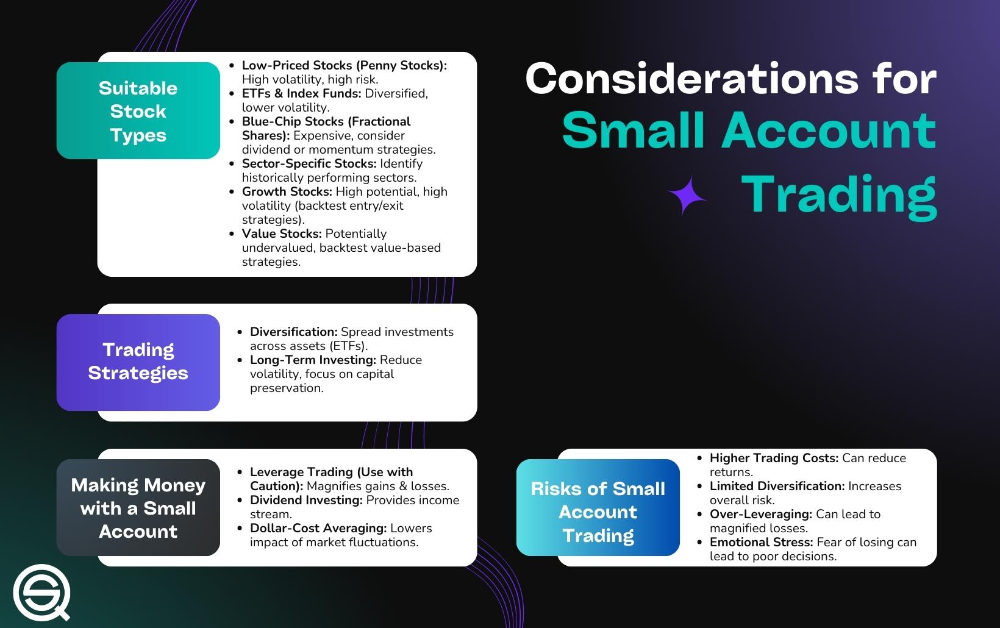

Trading options presents a compelling opportunity for those managing small accounts, particularly when combined with algorithmic trading strategies that harness data-driven insights. This approach allows traders to exploit the nuanced dynamics of options markets, potentially leading to significant returns on smaller investments. The essential elements underpinning successful options trading for small accounts include affordability, volatility, and historical performance, which collectively determine the suitability of particular stocks for option trading.

Affordability is a critical consideration, ensuring that the cost of options contracts aligns well with limited financial resources. Volatility, on the other hand, is integral to options trading, as more substantial price fluctuations can enhance profit opportunities. Historical performance provides traders with insights into a stock's past behavior, offering predictive power and aiding strategic decision-making.



Algorithmic trading strategies bring a considerable advantage to small account holders by automating trade execution and quickly adapting to market shifts. By leveraging complex algorithms, traders can analyze vast amounts of market data in real time, optimizing their trades to maximize profit potential. This automation not only increases efficiency but also reduces the likelihood of human error in decision-making.

The primary objective for small account traders is to balance maximizing profit potential with effective risk management. Algorithmic strategies equip traders with tools like backtesting and volatility analysis, enabling them to refine their approaches and adapt to market developments proactively. These capabilities are crucial for capitalizing on profitable opportunities while safeguarding against adverse market conditions.

With a focus on practical application, the subsequent sections of this guide will examine how smaller traders can optimize their trading endeavors through algorithmic methods, ensuring that each move is supported by data and strategic foresight. In doing so, small account holders can unlock the full potential of options trading, fostering sustainable growth and achieving their financial objectives.

## Table of Contents

## Understanding Options Trading for Small Accounts

Options trading offers a strategic advantage, particularly for small accounts, by providing leverage and flexibility not available in direct equity trading. An option is a financial derivative that grants the holder the right, but not the obligation, to buy (call option) or sell (put option) an underlying asset at a pre-specified price, known as the strike price, on or before a certain expiration date. This mechanism allows traders to benefit from price movements without having to invest the full price of the stock, thus conserving capital and maximizing potential returns.

For traders with smaller accounts, options represent an opportunity to gain exposure to market movements with limited upfront capital, due to their inherent leverage. Consider a call option priced at $1.50 per share for a 100-share contract; the total investment required would be $150. This is significantly lower than purchasing the underlying shares directly. The leverage aspect of options trading can amplify gains if the market moves favorably, but it also heightens the risk of loss, demanding careful management.

Algorithmic trading is an advantageous tool for small account holders engaging in options trading. Algorithms allow for the automation of trade executions, ensuring swift responses to the often volatile and rapidly changing market conditions characteristic of options trading. Automation also reduces the emotional component of trading, fostering more disciplined and systematic trading approaches. Python, for instance, provides robust libraries such as `QuantLib` and `py_vollib` to handle options pricing and strategy [backtesting](/wiki/backtesting), enabling traders to refine their strategies using historical data before capital is at risk.

An effective options trading strategy, powered by algorithms, can greatly minimize risks while optimizing returns for small account traders. The key lies in understanding and employing techniques that limit capital at risk. With options, traders can define risk levels through predefined maximum loss potential, inherent in buying options outright. In combination with algorithmic tools for position sizing, [volatility](/wiki/volatility-trading-strategies) assessment, and market trend analysis, traders can enhance their decision-making process and improve the probability of favorable outcomes.

In conclusion, options trading stands as a viable opportunity for small accounts to engage with financial markets, with [algorithmic trading](/wiki/algorithmic-trading) enhancing execution and strategy precision. The versatility of options combined with the efficiency gains from algorithmic trading can turn small account constraints into advantages, provided traders apply sound risk management principles.

## Criteria for Choosing Stocks for Options Trading

When selecting stocks for options trading, especially for small accounts, it's crucial to consider several key factors to ensure potential success while minimizing risk. 

1. **Volatility**: Volatility is a critical component in options trading because it reflects the degree of price movement a stock might experience. High volatility stocks provide greater opportunities for significant price shifts, which are essential for maintaining profitable options trades. Traders can measure volatility using metrics like historical volatility (the past fluctuation of stock prices) and implied volatility, which indicates market expectations of future volatility. For instance, a commonly used measure is the standard deviation of stock returns:
$$
   \sigma = \sqrt{\frac{\sum (R_i - \bar{R})^2}{N-1}}

$$

   where $R_i$ represents individual stock returns, $\bar{R}$ is the mean return, and $N$ is the number of observations.

2. **Liquidity**: Liquidity entails the ease with which shares of a stock can be bought or sold without causing a significant impact on its price. High liquidity stocks allow traders to enter and exit positions with smaller spreads between the bid and ask prices, ensuring better execution and reducing trading costs. Look for stocks with high average daily volumes and tight bid-ask spreads, as they are desirable for efficient options trading.

3. **Underlying Stock Health**: The financial health and stability of the underlying company significantly influence the security of options positions. Stocks from companies with strong fundamentals, such as consistent revenue growth, profitability, and manageable debt levels, provide added confidence. Analyzing financial statements and ratios like the price-to-earnings (P/E) ratio, debt-to-equity ratio, and return on equity (ROE) can help assess the company's overall health.

4. **Affordable Pricing**: For small account traders, it is essential that the stock price is suitable for the account's size, as this determines the affordability of purchasing options. Stocks with high prices may require substantial premium payments for their options, making them less accessible for small accounts. Analyze the premium costs concerning the account balance and choose stocks that allow acquiring options without over-leveraging.

By carefully evaluating these criteria—volatility, [liquidity](/wiki/liquidity-risk-premium), underlying stock health, and affordable pricing—traders can better position themselves to succeed in options trading. These factors, combined, ensure that chosen stocks meet the necessary requirements for viable options trading strategies within the constraints of a small account.

## Top Stocks for Options Trading in Algo Trading

When trading options through algorithmic strategies, selecting the right stocks is imperative for success, especially for small accounts. Here’s a breakdown of various categories of stocks that align with profitable options trading considerations:

1. **Technology Sector Stocks**: The technology sector often exhibits substantial growth potential and favorable volatility metrics, making it ideal for options trading. Companies such as Apple (AAPL) and NVIDIA (NVDA) are known for their price movements, providing opportunities to capitalize on the volatility through strategic options trades. The rapid innovation and frequent updates within this sector contribute to significant price fluctuations, thus enhancing the appeal for algorithmic trading strategies that are designed to react to such volatility efficiently.

2. **Blue-chip Favorites**: Stocks of established companies with a history of stable performance, like The Coca-Cola Company (KO) and Johnson & Johnson (JNJ), are considered blue-chip stocks. By trading options on these stocks, smaller accounts can access the benefits of market exposure to reputable large-cap companies while managing risk. These stocks typically have high liquidity, ensuring that options markets for these equities feature tighter bid-ask spreads, enhancing execution quality.

3. **Sector-Specific Plays**: Certain sectors, such as healthcare, offer unique opportunities due to their inherent volatility and growth prospects driven by regulatory changes, innovations, or breakthroughs in medical research. Companies like Pfizer Inc. (PFE) and Moderna, Inc. (MRNA) maintain a dynamic market position that can lead to significant price shifts, ideal for options traders seeking growth through strategic sector-specific bets.

4. **Small Cap and Penny Stocks**: While small cap and penny stocks are affordable, they come with high volatility. This volatility presents potential for significant profit, although it demands diligent risk management. Options on stocks like Tattooed Chef Inc. (TTCF) or Sundial Growers Inc. (SNDL) may appeal to traders who utilize algorithms to identify and exploit short-term price movements. However, given the risks, profoundly rigorous analysis and a robust risk mitigation strategy are crucial when engaging with these equities.

By focusing on these categories of stocks, traders can harness algorithmic strategies to exploit the underlying characteristics of each sector while aligning with their financial goals and risk appetite.

## Algorithmic Strategies for Options Trading

Algorithmic trading strategies play a crucial role in optimizing options trading by facilitating data-driven decision-making and efficient execution. These strategies utilize sophisticated algorithms to analyze historical data, predict market trends, and implement trading decisions that enhance profitability and manage risks effectively. Here, we discuss four key algorithmic strategies used in options trading.

1. **Backtesting**: This involves testing a trading strategy using historical data to evaluate its performance before deploying it in live markets. The process helps traders refine their strategies by identifying potential weaknesses and optimizing them for better results. Backtesting ensures that the strategy has a validated expected performance, mitigating risks when applied to actual trading. In Python, libraries like backtrader or PyAlgoTrade are commonly used for building backtesting systems. An example of a basic backtesting code using backtrader is shown below:

    ```python
    import backtrader as bt

    class MyStrategy(bt.Strategy):
        def next(self):
            # Example strategy: buy if close is higher than open
            if self.data.close[0] > self.data.open[0]:
                self.buy()

    cerebro = bt.Cerebro()
    cerebro.addstrategy(MyStrategy)

    data = bt.feeds.YahooFinanceData(dataname='AAPL',
                                     fromdate=datetime(2020, 1, 1),
                                     todate=datetime(2021, 1, 1))
    cerebro.adddata(data)
    cerebro.run()
    ```

2. **Delta-Neutral Strategies**: These strategies aim to hedge against price movements in the underlying asset by balancing positions to maintain a net zero delta. Delta-neutral strategies help minimize the impact of directional market movements on the portfolio's value, thus reducing risk. This can be achieved by combining options positions with different deltas to ensure the portfolio remains neutral to changes in the price of the underlying asset. In mathematical terms:
$$
    \sum \Delta_i \times \text{Position Size}_i = 0

$$

    where $\Delta_i$ is the delta of the $i^{th}$ option.

3. **Volatility-Based Strategies**: These strategies exploit anticipated changes in market volatility to position for profit opportunities in options trading. Algorithms can analyze historical volatility patterns and use statistical models to predict future volatility, guiding traders on whether to engage in long or short volatility strategies. For instance, if an algorithm predicts a volatility spike, a trader might purchase options to capitalize on the potential surge in premium prices.

4. **Mean-Reversion Techniques**: These techniques are based on the hypothesis that the price of a security tends to revert to its average value over time. Algorithms can monitor price fluctuations and identify when a stock's price deviates significantly from its historical average, thus indicating a potential reversion opportunity. By executing mean-reversion strategies, traders can target entry points where the probability of the price returning to equilibrium is higher. An algorithm might be set to trigger a buy signal if the asset price falls below its moving average by a defined threshold.

In summary, these algorithmic strategies enable traders to implement refined and efficient options trading methods, bolstering their ability to capitalize on market opportunities while systematically managing risk.

## Risk Management Techniques

Effective risk management is essential for options trading, particularly for small accounts where the impact of losses can be magnified. Several techniques can be employed to manage risk effectively:

1. **Position Sizing**: Determining the appropriate position size is crucial to managing risk. Algorithms can be utilized to calculate the optimal trade size based on the account size and the risk tolerance of the trader. The position size can be calculated using the formula:
$$
   \text{Position Size} = \frac{\text{Account Size} \times \text{Risk per Trade}}{\text{Stop-Loss Amount}}

$$

   This formula ensures that only a small percentage of the account is at risk on any single trade. Algorithmic trading platforms can automatically adjust the position size to remain within these parameters.

2. **Stop-Loss Orders**: Implementing automated stop-loss orders is vital for capping potential losses at acceptable levels. Stop-loss orders instruct the trading system to sell an option when its price reaches a certain point, thus limiting loss. By automating this process, traders can ensure that emotions do not interfere with decision-making.

3. **Diversification**: To minimize risk, spreading options across various sectors and stocks is recommended. Diversification reduces the impact of a single underperforming asset on the overall portfolio. Algorithms can assist in achieving diversification by analyzing and selecting options from different sectors with varying risk profiles, ensuring that the portfolio is not overly exposed to any single market factor.

4. **Continuous Monitoring**: Continuous monitoring of the market and the options portfolio is vital for managing risk in real-time. Trading algorithms can be designed to constantly evaluate market conditions and adjust portfolios or trading strategies accordingly. For example, if a position's risk exceeds predetermined thresholds due to market volatility, the algorithm might reduce the exposure or rebalance the portfolio.

Implementing these risk management techniques with the assistance of algorithmic trading strategies can significantly enhance the stability and profitability of options trading for small accounts. These methods ensure that risks are systematically controlled, allowing traders to focus on strategic decision-making rather than the emotional aspects of trading.

## Conclusion

Options trading, when integrated with algorithmic strategies, offers a potent avenue for small account holders to enhance their trading potential. By fostering a detailed understanding of market dynamics and making informed strategic choices, small traders have the potential to capitalize on market opportunities while keeping risks to a minimum. This requires a disciplined approach to selecting stocks that align with identified criteria such as volatility, liquidity, and strong fundamentals. Implementing algorithm-driven strategies further amplifies this approach by allowing for efficient trade execution, precise risk management, and the potential to tap into complex trading phenomena such as volatility spikes or price corrections.

Moreover, continuous learning is indispensable. The financial markets are in a perpetual state of flux, guided by macroeconomic factors, political events, and technological advancements. Small account holders must remain vigilant, adapting their strategies to be resilient against unforeseen events while optimizing them for new opportunities. This requires not only a firm grasp of current strategies but also a readiness to incorporate new ideas and tools as they emerge.

Ultimately, the union of options trading with algorithmic strategies empowers small traders to punch above their weight class in the financial markets. By systematically applying these principles, traders can work towards achieving sustainable growth, turning modest initial capital into substantive financial gains over time.

## References & Further Reading

[1]: Bergstra, J., Bardenet, R., Bengio, Y., & Kégl, B. (2011). ["Algorithms for Hyper-Parameter Optimization."](https://dl.acm.org/doi/10.5555/2986459.2986743) Advances in Neural Information Processing Systems 24.

[2]: ["Advances in Financial Machine Learning"](https://www.amazon.com/Advances-Financial-Machine-Learning-Marcos/dp/1119482089) by Marcos Lopez de Prado

[3]: ["Evidence-Based Technical Analysis: Applying the Scientific Method and Statistical Inference to Trading Signals"](https://www.amazon.com/Evidence-Based-Technical-Analysis-Scientific-Statistical/dp/0470008741) by David Aronson

[4]: ["Machine Learning for Algorithmic Trading"](https://github.com/stefan-jansen/machine-learning-for-trading) by Stefan Jansen

[5]: ["Quantitative Trading: How to Build Your Own Algorithmic Trading Business"](https://www.amazon.com/Quantitative-Trading-Build-Algorithmic-Business/dp/1119800064) by Ernest P. Chan